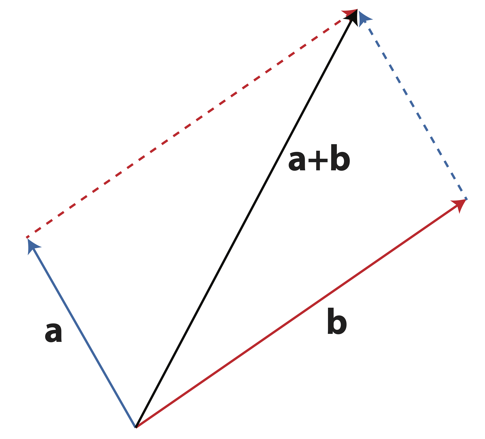
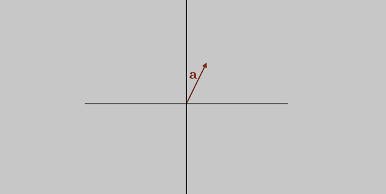
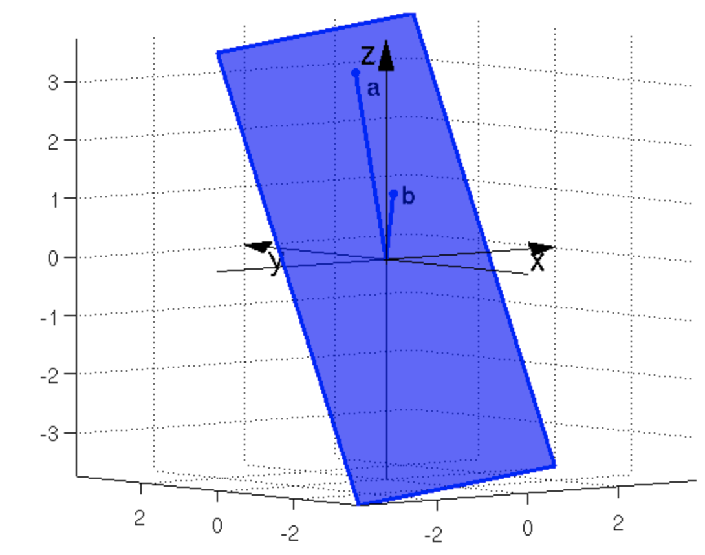

# Linear Independence {#linind}

One of the most central ideas in all of Linear Algebra is that of **linear independence**. For regression problems, it is repeatedly stressed that _multicollinearity_ is problematic. Multicollinearity is simply a statistical term for linear dependence. It's bad. Having a firm understanding of linear combinations, we can develop the important concept of linear independence. 

## Linear Independence

:::{.definition name='Linear Dependence and Linear Independence' #lininddef}
A set of vectors $\{\v_1,\v_2,\dots, \v_n\}$ is **linearly dependent** if we can express the zero vector, $\bo{0}$, as non-trivial linear combination of the vectors.  In other words there exist some constants $\alpha_1,\alpha_2,\dots \alpha_n$  (non-trivial means that these constants are not _all_ zero) for which
\begin{equation}
\alpha_1\v_1 +\alpha_2\v_2 + \dots +\alpha_n\v_n=\bo{0}.
  (\#eq:triv)
\end{equation}

A set of terms is **linearly independent** if Equation \@ref(eq:triv) has only the _trivial solution_, $$\alpha_1=\alpha_2=\dots=\alpha_n = 0.$$
:::

Another way to express linear dependence is to say that we can write one of the vectors as a linear combination of the others. If there exists a non-trivial set of coefficients $\alpha_1,\alpha_2, \dots, \alpha_n$ for which
$$\alpha_1\v_1 +\alpha_2\v_2 + \dots +\alpha_n\v_n=\bo{0}$$
then for $\alpha_j \neq 0$ we could write
$$\v_j=-\frac{1}{\alpha_j} \sum_{\substack{i=1\\i \neq j}}^n \alpha_i \v_i$$

:::{.example name='Linearly Dependent Vectors' #lindep}
The vectors $\v_1 =\pm 1\\2\\2 \mp, \v_2 = \pm 1\\2\\3 \mp, \mbox{  and  } \v_3 = \pm 3\\6\\7 \mp$ are linearly dependent because 
$$\v_3 = 2\v_1+\v_2$$
or, equivalently, because
$$2\v_1+\v_2-\v_3 = \bo{0}$$
:::

### Determining Linear Independence

You should realize that the linear combination expressed Definition \@ref{def:linind} can be written as a matrix vector product. Let $\A_{m\times n} = (\A_1|\A_2|\dots|\A_n)$ be a matrix. Then by Definition \@ref{def:linind}, the columns of $\A$ are linearly independent if and only if the equation
\begin{equation}
\A\x = \bo{0}
(\#eq:homo)
\end{equation}
has only the trivial solution, $\x=0$. Equation \@ref(eq:homo) is commonly known as the homogeneous linear equation. For this equation to have only the trivial solution, it must be the case that under Gauss-Jordan elimination, the augmented matrix $(\A|\bo{0})$ reduces to $(\bo{I}|0)$. We have already seen this condition in our discussion about matrix inverses - if a square matrix $\A$ reduces to the identity matrix under Gauss-Jordan elimination then it is equivalently called _full rank, nonsingular, or invertible_. Now we add an additional condition equivalent to the others - the matrix $\A$ has linearly independent columns (_and rows_).

In Theorem \@ref(thm:equivcond) we provide an important list of equivalent conditions regarding the existence of a matrix inverse.

:::{.theorem name='Equivalent Conditions for Matrix Invertibility' #equivcond}
Let $\A$ be an $n\times n$ matrix - a _square_ matrix. Then the following statements are _equivalent_. (If one these statements is true, then all of these statements are true)

- $\A$ is invertible ($\A^{-1} exists$)
- $\A$ has full rank ($rank(\A)=n$)
- The columns of $\A$ are linearly independent
- The rows of $\A$ are linearly independent
- The system $\A\x=\b$, $\b\neq \bo{0}$ has a unique solution
- $\A\x=\bo{0} \Longrightarrow \x=\bo{0}$
- $\A$ is nonsingular
- $\A \xrightarrow{Gauss-Jordan} \bo{I}$
:::

## Span of Vectors {#span}

:::{.definition name='Vector Span' #spandef}
The **span** of a single vector $\v$ is the set of all scalar multiples of $\v$:
$$span(\v)=\{\alpha\v\ \mbox{  for any constant  } \alpha\}$$
 The **span** of a collection of vectors, $\V=\{\v_1,\v_2,\dots,\v_n\}$ is the set of all linear combinations of these vectors:
 $$span(\V)=\{\alpha_1\v_1+\alpha_2\v_2+\dots+\alpha_n\v_n \mbox{ for any constants }\alpha_1,\dots,\alpha_n\}$$
:::

Recall that addition of vectors can be done geometrically using the _head-to-tail_ method shown in Figure \@ref(fig:vectoradd2).

```{r label='vectoradd2', fig.align='center', fig.cap = 'Geometrical addition of vectors: Head-to-tail', echo=F, out.width=300}

```


If we have two linearly independent vectors on a coordinate plane, then any third vector can be written as a linear combination of them. This is because two vectors is sufficient to _span_ the entire 2-dimensional plane. You should take a moment to convince yourself of this geometrically, using the animation in Figure \@ref(fig:animspan) to help.

```{r label='animspan', fig.align='center', fig.cap = 'Animation: Span of Two Linear Independent Vectors is a Plane. ', echo=F, out.width=300}

```

In 3-space, two linearly independent vectors can still only span a plane. Figure \@ref(fig:spanfig) depicts this situation. The set of all linearly combinations of the two vectors $\a$ and $\b$ (i.e. the $span(\a,\b)$) carves out a plane. We call this a two-dimensional collection of vectors a **subspace** of $\Re^3$. A subspace is formally defined in Definition \@ref(def:subspacedef).

(ref:spancap) The $span(\a,\b)$ in $\Re^3$ creates a plane (a 2-dimensional _subspace_)

```{r label='spanfig', fig.align='center', fig.cap = '(ref:spancap)', echo=F, out.width=300}
knitr::include_graphics("figs/span.png")
```


:::{.definition name='Subspace' #subspacedef}
A **subspace**, $\mathcal{S}$ of $\Re^n$ is thought of as a "flat"  (having no curvature) surface within $\Re^n$. It is a collection of vectors which satisfies the following conditions:

1. The origin ($\bo{0}$ vector) is contained in $\mathcal{S}$
2. If $\x$ and $\y$ are in $\mathcal{S}$ then the sum $\x+\y$ is also in $\mathcal{S}$
3. If $\x$ is in $\mathcal{S}$ and $\alpha$ is a constant then $\alpha\x$ is also in $\mathcal{S}$
:::

The span of two vectors $\a$ and $\b$ is a subspace because it satisfies these three conditions. (Can you prove it formally? See exercise 4).

:::{.example name='Span' #span}
Let $\a=\pm 1\\3\\4 \mp$ and $\b=\pm 3\\0\\1 \mp$. Explain why or why not each of the following vectors is contained in the $span(\a,\b)$? 

a. $\x=\pm 5\\6\\9 \mp$ 

  - To determine if $\x$ is in the $span(\a,\b)$ we need to find coefficients $\alpha_1, \alpha_2$ such that $$\alpha_1\a+\alpha_2\b=\x.$$ Thus, we attempt to solve the system
$$\pm 1&3\\3&0\\4&1 \mp \pm \alpha_1\\ \alpha_2 \mp = \pm 5\\6\\9\mp.$$
After Gaussian Elimination, we find that the system is consistent with the solution
$$\pm\alpha_1\\ \alpha_2 \mp=\pm 2\\1\mp$$
and so $\x$ is in fact in the $span(\a,\b)$.

b. $\y=\pm 2\\4\\6 \mp$ 

  - We could follow the same procedure as we did in part (a) to learn that the corresponding system is _not_ consistent and thus that $\y$ is not in the $span(\a,\b)$.

:::

:::{.definition name='Hyperplane' #hyperplane}
A **hyperplane** is a subspace with 1 less dimension than the ambient space. Such a space "cuts" the ambient space into two pieces, one that is "above" the hyperplane, and one that is "below" it.  Hyperplanes are not always defined to go through the origin, so we will distinguish these subspaces from _affine_ hyperplanes, which are not subspaces. 

```{r  fig.align='center', echo=F, out.width=300}

```
:::


##  Exercises
<ol>
<li> **Six views of matrix multiplication:**  _This notational exercise turns out to contain one of (well, six of) the most fundamentally important concepts to grasp for applied linear algebra. We must be able to intuitively create matrix multiplications from every angle in order for us to be strong practitioners. This is not something that we develop immediately. It comes through practice, visualization, and experience. Do not skip this exercise and keep it in your pocket as you proceed through this book. _

Let $\A_{m\times k}$, $\B_{k\times n}$, and $\C_{m\times n}$ be matrices such that
$$\A\B=\C.$$
<ol style="list-style-type:lower-alpha">
  <li> Express the first column of $\C$ as a linear combination of the columns of $\A$.
  <li> Express the first column of $\C$ as a matrix-vector product.
  <li> Express $\C$ as a sum of outer products.
  <li> Express the first row of $\C$ as a linear combination of the rows of $\B$.
  <li> Express the first row of $\C$  as a matrix-vector product.
  <li> Express the element $\C_{ij}$ as an inner product of row or column vectors from $\A$ and $\B$.
</ol>
<li> Determine whether or not the vectors $$\x_1=\pm 1\\3\\1\mp,\x_2=\pm 0\\1\\1\mp,\x_3=\pm 2\\1\\0\mp$$ are linearly independent.
<li> Let $\a=\pm 1\\3\\4 \mp$ and $\b=\pm 3\\0\\1 \mp$. 
<ol style="list-style-type:lower-alpha">
  <li> Show that the zero vector, $\pm 0\\0\\0 \mp$ is in the $span(\a,\b)$. 
  <li> Determine whether or not the vector $\pm 1\\0\\1 \mp$ is in the $span(\a,\b)$.
</ol>

<li> Which of the following sets of variables has a clear problem with linear dependence? Explain your reasoning.

<ol type='a'>
<li> A garden center that stocks products on hundreds of hand-built rectangular display tables, all in varying sizes, has data that contains: 
<ul>
<li> _Table Number_
<li> _Length of table_
<li> _Width of Table_
<li> _Table Perimeter_
<li> _Area of Table_
</ul>
<li> Apple farmer tracking his product has data containing:
<ul>
<li> _Truck number_
<li> _Number of pallets on truck_
<li> _Number of boxes per pallet_
<li> _Total number of boxes on truck_
</ul>
<li> A triathlon race company collects the following information from each participant:
<ul>
<li> _Name_
<li> _Swim time_
<li> _Bike time_
<li> _Run time_
<li> _Total race time_
</ul>
<li> A software company keeps the following payroll data for its salaried employees:
<ul>
<li>  _Employee ID_
<li>  _Annual Salary (sans bonus)_
<li>  _Tenure at company_
<li>  _Gross monthly pay_
<li>  _Bonus amount_
</ul>
</ol>

<li> Describe the span of one vector in $\Re^3$.
<li> Describe the span of two linearly _independent_ vectors in $\Re^3$.
<li> Describe the span of two linearly _dependent_ vectors in $\Re^3$.
<li> What is the span of the zero vector, $\bo{0}=(0,0,\dots, 0)$?
<li> Compare the $span \left\lbrace \pm 1\\1 \mp \right\rbrace$ to the $span \left\lbrace \pm 1\\1 \mp , \pm 2\\2 \mp \right\rbrace$.
<li> What is the dimension of the $span \left\lbrace\pm 1\\1 \mp , \pm 2\\2 \mp \right\rbrace$
<li> What is the definition of the dimension of a subspace?
<li> How would you describe a hyperplane?
<li> Draw the $span(\a,\b)$ if $\a=\pm 1\\2 \mp$ and $\b=\pm 3\\6 \mp$.
<li> Prove that the span of vectors is a subspace by showing that it satisfies the three conditions from Definition \@ref(def:spandef). To make a formal proof, the strategy should be as follows: (1) Take two arbitrary elements from the span and show that when you add them together, the resulting vector is also in the span. (2) Take one arbitrary vector from the span and show that when you multiply it by a constant, the resulting vector is also in the span. (3) Show that the zero vector is contained in the span. You can simply show this fact for the span of two vectors and notice how the concept will hold for more than two vectors.
<li>  _True/False_ Mark each statement as true or false. Justify your response.
<ol style="list-style-type:lower-alpha">
  <li> If $\A\x=\b$ has a solution then $\b$ can be written as a linear combination of the columns of $\A$.
  <li> If $\A\x=\b$ has a solution then $\b$ is in the span of the columns of $\A$.
  <li> If  $\v_1$ is in the $span(\v_2,\v_3)$, then $\v_1, \v_2, \,\mbox{ and},\v_3$ form a linearly independent set.
  <li> Two vectors are linearly independent only if they are not perfectly correlated, $-1<\rho<1$, where $\rho$ is Pearson's correlation coefficient.
</ol>

<li> Let $\x = \left(\begin{array}{c} 2\\0\\1 \end{array}\right)$, $\y = \left(\begin{array}{c} 1\\1\\2 \end{array}\right)$, and $\z = \left(\begin{array}{c} 3\\-1\\0 \end{array}\right)$. 
<ol type='a'>
<li>Are the vectors $\x, \y, \z$ linearly independent?
<li> What is the rank of the matrix that contains these 3 vectors as columns?
<li> What is the rank of the matrix that contains these 3 vectors as rows?
</ol>

</ol>

## List of Key Terms {-}

- linearly independent
- linearly dependent
- full rank
- perfect multicollinearity
- severe multicollinearity
- invertible
- nonsingular
- linear combination geometrically       
- linear (in)dependence geometrically    
- vector span                            
- subspace                               
- dimension of subspace                  
- hyperplane                             
               

