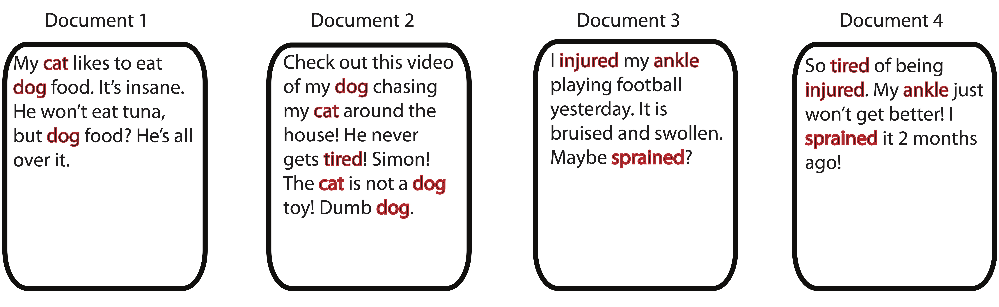

# Basis and Change of Basis {#basis}

When we think of coordinate pairs, or coordinate triplets, we tend to think of them as points on a grid where each axis represents one of the coordinate directions:\

```{r id='coordplane', fig.align='center', fig.cap = 'The Coordinate Plane', echo=F, out.width="40%"}
knitr::include_graphics("figs/coordplane.jpg")
```

We may not have previously formalized it, but even in this elementary setting, we are considering these points (vectors) as linear combinations of the elementary __basis vectors__
$$\e_1 = \pm 1\\0\mp \mbox{  and  } \e_2=\pm 0\\1 \mp.$$
For example, the point $(2,3)$ can be written as
\begin{equation}
\pm 2\\3 \mp = 2\pm 1\\0\mp+3\pm 0\\1\mp = 2\e_1+3\e_2.
  (\#eq:coord)
\end{equation}

We consider the coefficients (the scalars 2 and 3) in this linear combination as __coordinates__ in the basis $\mathcal{B}_1=\{\e_1,\e_2\}$.  The coordinates, in essence, tell us how much "information" from the vector/point $(2 ,3 )$ lies along each basis direction: to create this point, we must travel 2 units along the direction of $\e_1$ and then 3 units along the direction of $\e_2$. 

We can also view Equation \@ref(eq:coord) as a way to separate the vector $(2,3)$ into orthogonal components. Each component is an __orthogonal projection__ of the vector onto the span of the corresponding basis vector. The orthogonal projection of vector $\bo{a}$ onto the span another vector $\v$ is simply the closest point to $\bo{a}$ contained on the span($\v$), found by _projecting_ $\bo{a}$ onto $\v$ at a $90^\circ$ angle. Figure \@ref(fig:orthogproj) shows this explicitly for $\bo{a}=(2,3)$.

```{r fig=T,label='orthogproj', fig.align='center', fig.cap = 'Orthogonal Projections onto basis vectors', echo=F, out.width="40%"}
knitr::include_graphics("figs/orthogproj.jpg")
```

:::{.definition name='Elementary Basis' #elembasisdef}
For any vector $\a=(a_1,a_2,\dots, a_n)$, the basis $\mathcal{B} = \{\e_1,\e_2,\dots,\e_n\}$ (recall $\e_i$ is the $i^{th}$ column of the identity matrix $\bo{I}_n$) is the __elementary basis__ and $\a$ can be written in this basis using the __coordinates__ $a_1,a_2,\dots, a_n$ as follows:
$$\a=a_1\e_1+a_2\e_2+\dots a_n\e_n.$$
:::

The elementary basis $\mathcal{B}_1$ is convenient for many reasons, one being its __orthonormality__:
\begin{eqnarray*}
\e_1^T\e_1 &=& \e_2^T\e_2 = 1\\
\e_1^T\e_2 &=& \e_2^T\e_1 = 0
\end{eqnarray*}

However, there are many (infinitely many, in fact) ways to represent the data points on different axes. If I wanted to view this data in a different way, I could use a different basis. Let's consider, for example, the following orthonormal basis, drawn in green over the original grid in Figure \@ref(fig:coordplaneB2):
$$\mathcal{B}_2 = \{\v_1,\v_2\}=\left\lbrace {\textstyle\frac{\sqrt{2}}{2}}\pm 1\\ 1\mp ,{\textstyle\frac{\sqrt{2}}{2}}\pm 1\\-1\mp\right\rbrace$$

(ref:coordcap) New basis vectors, $\v_1$ and $\v_2$, shown on original plane

```{r fig=T,label='coordplaneB2', fig.align='center', fig.cap = '(ref:coordcap)', echo=F, out.width="40%"}
knitr::include_graphics("figs/coordplaneB2.jpg")
```


The scalar multipliers $\frac{\sqrt{2}}{2}$ are simply normalizing factors so that the basis vectors have unit length. You can convince yourself that this is an orthonormal basis by confirming that
\begin{eqnarray*}
\v_1^T\v_1 &=& \v_2^T\v_2 = 1\\
\v_1^T\v_2 &=& \v_2^T\v_1 = 0
\end{eqnarray*}

If we want to _change the basis_ from the elementary $\mathcal{B}_1$ to the new green basis vectors in $\mathcal{B}_2$, we need to determine a new set of coordinates that direct us to the point using the green basis vectors as a frame of reference. In other words we need to determine $(\alpha_1,\alpha_2)$ such that travelling $\alpha_1$ units along the direction $\v_1$ and then $\alpha_2$ units along the direction $\v_2$ will lead us to the point in question. For the point $(2,3)$ that means
$$
\pm 2\\3 \mp = \alpha_1\v_1+\alpha_2\v_2 = \alpha_1\pm \frac{\sqrt{2}}{2}\\ \frac{\sqrt{2}}{2}\mp+\alpha_2\pm \frac{\sqrt{2}}{2}\\ -\frac{\sqrt{2}}{2}\mp .
$$

This is merely a system of equations $\bo{V}\bo{a}=\b$:
$$
{\textstyle\frac{\sqrt{2}}{2}}\pm 1&1 \\1& -1\mp \pm \alpha_1\\ \alpha_2 \mp = \pm 2\\3 \mp
$$

The $2\times 2$ matrix $\V$ on the left-hand side has linearly independent columns and thus has an inverse. In fact, $\V$ is an orthonormal matrix which means its inverse is its transpose. Multiplying both sides of the equation by $\V^{-1}=\V^T$ yields the solution
$$\bo{a} =\pm \alpha_1 \\ \alpha_2 \mp = \V^T\b= \pm \frac{5\sqrt{2}}{2} \\ -\frac{\sqrt{2}}{2} \mp$$

This result tells us that in order to reach the red point (formerly known as (2,3) in our previous basis), we should travel $\frac{5\sqrt{2}}{2}$ units along the direction of $\v_1$ and then $-\frac{\sqrt{2}}{2}$ units along the direction $\v_2$ (Note that $\v_2$ points toward the southeast corner and we want to move northwest, hence the coordinate is negative). Another way (a more mathematical way) to say this is that _the length of the orthogonal projection of $\bo{a}$ onto the span of $\v_1$ is $\frac{5\sqrt{2}}{2}$, and the length of the orthogonal projection of $\bo{a}$ onto the span of $\v_2$ is $-\frac{\sqrt{2}}{2}$_. While it may seem that these are difficult distances to plot, they work out quite well if we examine our drawing in Figure \@ref(fig:coordplaneB2), because the diagonal of each square is $\sqrt{2}$. 

In the same fashion, we can re-write all 3 of the red points on our graph in the new basis by solving the same system simultaneously for all the points. Let $\B$ be a matrix containing the original coordinates of the points and let $\A$ be a matrix containing the new coordinates:
$$\B=\pm -4 & 2 & 5 \\ -2 & 3 & 2 \mp\,\, \A=\pm \alpha_{11} & \alpha_{12} & \alpha_{13}\\ \alpha_{21} & \alpha_{22} & \alpha_{23} \mp$$

Then the new data coordinates on the rotated plane can be found by solving:
$$\V\A=\B$$
And thus $$\A=\V^T\B =\frac{\sqrt{2}}{2} \pm   -6 & 5 &7\\ -2&-1&3\mp$$

Using our new basis vectors, our alternative view of the data is that in Figure \@ref(fig:coordplaneB2rotate).

(ref:coordB2cap) Points plotted in the new basis, $\mathcal{B}$

```{r fig=T,label='coordplaneB2rotate', fig.align='center', fig.cap = '(ref:coordB2cap)', echo=F, out.width="50%"}
knitr::include_graphics("figs/coordplaneB2rotate.jpg")
```


In the above example, we changed our basis from the original elementary basis to a new orthogonal basis which provides a different view of the data. All of this amounts to a rotation of the data around the origin. No real information has been lost - the points maintain their distances from each other in nearly every distance metric. __Our new variables, $\v_1$ and $\v_2$ are linear combinations of our original variables $\e_1$ and $\e_2$__, thus we can transform the data _back_ to its original coordinate system by again solving a linear system (in this example, we'd simply multiply the new coordinates again by $\V$).

In general, we can change bases using the procedure outlined in Theorem \@ref(thm:changebasedef).

:::{.theorem name='Changing Bases' #changebasedef}
Given a matrix of coordinates (in columns), $\A$, in some basis, $\mathcal{B}_1=\{\x_1,\x_2,\dots,\x_n\}$, we can change the basis to $\mathcal{B}_2=\{\v_1,\v_2,\dots,\v_n\}$ with the new set of coordinates in a matrix $\B$ by solving the system
$$\X\A=\V\B$$
where $\X$ and $\V$ are matrices containing (as columns) the basis vectors from $\mathcal{B}_1$ and $\mathcal{B}_2$ respectively.

Note that when our original basis is the elementary basis, $\X=\bo{I}$, our system reduces to
$$\A=\V\B.$$

When our new basis vectors are orthonormal, the solution to this system is simply
$$\B=\V^T\A.$$
:::

:::{.definition name='Basis' #basisdef}
A __basis__ for an arbitrary vector space $\mathcal{V}$ is any set of linearly independent vectors $\{\mathcal{B}_1,\dots, \mathcal{B}_r\}$ such that $$span(\{\mathcal{B}_1,\dots, \mathcal{B}_r\}) = \mathcal{\mathbf{V}}.$$
$r$ is said to be the __dimension__ of the vector space $\Re^n$.
  
A __basis__ for the vector space $\Re^n$ is then any set of $n$ linearly independent vectors in $\Re^n$; $n$ is said to be the __dimension__ of the vector space $\Re^n$. When the basis vectors are orthonormal (as in our prior examples), the set is called an __orthonormal basis__. 
:::

The preceding discussion dealt entirely with bases for $\Re^n$ (our example was for points in $\Re^2$). However, we will need to consider bases for _subspaces_ of $\Re^n$. Recall that the span of two linearly independent vectors in $\Re^3$ is a plane. This plane is a 2-dimensional subspace of $\Re^3$. Its dimension is 2 because 2 basis vectors are required to represent this space. However, not all points from $\Re^3$ can be written in this basis - only those points which exist on the plane. In Chapter \@ref(leastsquares) we discuss how to proceed in a situation where the point we'd like to represent does not actually belong to the subspace we are interested in. This is the foundation for Least Squares.

## Vector Space Models

The knowledge of coordinates and bases in data science allows us to explore the data using a _vector space model_. In a vector space model, the objects/observations of interest are considered vectors in a vector space and then often the dimensionality of that vector space is reduced in some way - yielding a new set of basis vectors (a smaller set) and coordinates of the data along those new basis vectors. Let's take a look at such a model using some text data as an example. The finer details of the text-mining process can be found in Chapter \@ref(svdapp). Figure \@ref(fig:documents) shows 4 short "documents". The words highlighted in red are the words that appear in at least two documents. We'll use those red-highlighted words as the variables in our analysis, and the documents as the observations. 

```{r label='documents', fig.align='center', fig.cap = 'Four Short Documents', echo=F, out.width="100%"}

```

We'll create a matrix, called a term-document matrix, where the $(i,j)^{th}$ entry is the number of times that term $i$ appeared in document $j$. Why put our documents/observations along the columns? Simply because we're exposing the linear combinations involved in our interpretation and we want that intuition to come easily from the animation in Figure \@ref(fig:multlincombanim), which might be helpful to revisit at this time. Everything works the same if we put the documents on the columns, the translation is simply a linear combination of rows, which is too wide for print. 

\begin{equation*}
    \begin{array}{cc}
         & \begin{array}{cccc} \;doc_1\; & \;doc_2\;& \;doc_3\;& \;doc_4 \end{array}\\
          \begin{array}{c}
            \hbox{cat} \\
            \hbox{dog}\\
            \hbox{tired} \\
            \hbox{injured} \\
            \hbox{ankle} \\
            \hbox{sprained} \\
        \end{array} &
\left(
\begin{array}{cccc}
\quad 1\quad   &  \quad 2\quad      &  \quad 0\quad   &  \quad 0\quad    \\
\quad 2\quad   &  \quad 3\quad      &  \quad 0\quad   &  \quad 0\quad    \\
\quad 0\quad   &  \quad 1\quad      &  \quad 0\quad   &  \quad 1\quad    \\
\quad 0\quad   &  \quad 0\quad      &  \quad 1\quad   &  \quad 1\quad    \\
\quad 0\quad   &  \quad 0\quad      &  \quad 1\quad   &  \quad 1\quad    \\
\quad 0\quad   &  \quad 0\quad      &  \quad 1\quad   &  \quad 1\quad    \\
\end{array}\right)
\end{array}
\end{equation*}

These documents, upon formulation of the term-document matrix above, live in the 6-dimensional term space. We could expand each document in a coordinate-basis representation where each of the elementary axes represents a single term, for instance:

\begin{equation*}
doc_1 = 1 \begin{array}{c} dog \\ \pm 1\\0\\0\\0\\0\\0 \mp \end{array} + 2 \begin{array}{c} cat \\ \pm 0\\1\\0\\0\\0\\0 \mp \end{array}
\end{equation*}

Now, we will _change the basis_ and create _new_ basis vectors that attempt to approximate this data in only 2 dimensions using a matrix factorization. Matrix factorizations are extremely powerful for data analysis, but we are not presently concerned with how they are created or chosen to solve a problem. Our goal in this section is merely to interpret the output and catch a glimpse of their utility. Below we examine one such matrix factorization, which was created using a Nonnegative Matrix Factorization (NMF) algorithm [@leeseung].

\begin{equation*}
    \begin{array}{cc}
         & \begin{array}{cc} \;factor_1\; & \;factor_2\end{array}\\
          \begin{array}{c}
            \hbox{cat} \\
            \hbox{dog}\\
            \hbox{tired} \\
            \hbox{injured} \\
            \hbox{ankle} \\
            \hbox{sprained} \\
        \end{array} &
\left(
\begin{array}{cc}
\quad 1.0\quad   &  \quad 0\quad       \\
\quad 1.6\quad   &  \quad 0\quad       \\
\quad 0.4\quad   &  \quad 0.4\quad       \\
\quad 0\quad   &  \quad 0.8\quad       \\
\quad 0\quad   &  \quad 0.8\quad       \\
\quad 0\quad   &  \quad 0.8\quad       \\
\end{array}\right)
\end{array} 
\begin{array}{c}
         \begin{array}{cccc} \;doc_1\; & \;doc_2\;& \;doc_3\;& \;doc_4\end{array}\\
         \left(
\begin{array}{cccc}
\quad 1.0  \quad & \quad 1.7 \quad & \quad  0    \quad &0   \quad \\
\quad 0    \quad & \quad 0.1 \quad & \quad   0.9 \quad &1.1 \quad     \\

\end{array}\right) \end{array}
\end{equation*}

The "factors" in the left matrix live in the term space. The factors can be considered as linear combinations of our original term vectors:

\begin{eqnarray*}
factor_1 &=& 1 \begin{array}{c} dog \\ \pm 1\\0\\0\\0\\0\\0 \mp \end{array} + 1.6 \begin{array}{c} cat \\ \pm 0\\1\\0\\0\\0\\0 \mp \end{array} +0.4 \begin{array}{c} tired \\ \pm 0\\0\\1\\0\\0\\0 \mp \end{array} +0 \begin{array}{c} injured \\ \pm 0\\0\\1\\0\\0\\0 \mp \end{array} +0 \begin{array}{c} ankle \\ \pm 0\\0\\1\\0\\0\\0 \mp \end{array}+0 \begin{array}{c} sprained \\ \pm 0\\0\\1\\0\\0\\0 \mp \end{array} \\

factor_2 &=& 0 \begin{array}{c} dog \\ \pm 1\\0\\0\\0\\0\\0 \mp \end{array} + 0 \begin{array}{c} cat \\ \pm 0\\1\\0\\0\\0\\0 \mp \end{array} +0.4 \begin{array}{c} tired \\ \pm 0\\0\\1\\0\\0\\0 \mp \end{array} +0.8 \begin{array}{c} injured \\ \pm 0\\0\\1\\0\\0\\0 \mp \end{array} +0.8 \begin{array}{c} ankle \\ \pm 0\\0\\1\\0\\0\\0 \mp \end{array}+0.8 \begin{array}{c} sprained \\ \pm 0\\0\\1\\0\\0\\0 \mp \end{array}
\end{eqnarray*}

Thus, these "factors" can be thought of almost like documents: they are merely a collection of terms. In particular, it seems as though $factor_1$ is a generic document about _pets_ and $factor_2$ is a generic document about _injuries_. Thus we might choose call these factors "topics" and give them names based upon the interpretation of their __loadings__, which are the coefficients in the above coordinate-basis expansion. 

Furthermore, the "scores" in the right matrix provide information about how each document relates to each of these topics:

\begin{eqnarray*}
doc_2 &=& 1.7 factor_1 + 0.1 factor_2\\
doc_4 &=& 0.0 factor_1 + 1.1 factor_2
\end{eqnarray*}

The above representation allows us to conclude that document 2 is _mostly_ about factor/topic 1 ("pets") and document 4 is _mostly_ about factor/topic 2 ("injuries") just by identifying the largest coordinate for each document.

A matrix factorization gives us information about both the rows and columns of the matrix of interest. Here, we saw both the terms and documents collected into two topics according to the loadings (left matrix) and the scores (right matrix).

We strongly encourage the reader to convince themselves of our conclusions and to replicate this analysis by completing the related question in the exercises.


## Exercises
<ol>
<li> What are the coordinates of the vector $\x=\pm 4\\3 \mp$ in the basis $\left\lbrace\pm -1\\-1 \mp , \pm 1\\-1 \mp \right\rbrace$? Draw a picture to make sure your answer lines up with intuition.
<li> In the following picture what would be the signs (+/-) of the coordinates of the green point in the basis $\{\v_1, \v_2\}$? Pick another point at random and answer the same question for that point.
<center>  </center>
<li> Write the orthonormal basis vectors from exercise 1 as linear combinations of the original elementary basis vectors.
<li> What is the length of the orthogonal projection of $\a_1$ onto $\v_1$?

<li> Interpret the following Nonnegative Factor Output for a term-document matrix of a small collection of text documents, answering the following questions:
<ol type='a'>
<li> What meaning (theme/topic) would you give to each of the three factors?
<li> What is the dominant factor (theme/topic) for each document?
<li> What is the loading of the word _baseball_ on Factor 2?
<li> What is the coordinate/score of document 5 along Factor 3?
</ol>

\begin{equation*}
 \begin{array}{rc} & \begin{array}{ccc} Factor1 & Factor2 & Factor 3\end{array} \\
					\begin{array}{c}
						baseball \\
						pitcher  \\
						mound    \\
						player   \\
						coach    \\
						soccer   \\
						world    \\
						fifa     \\
						cup      \\
						canada   \\
						womens   \\
						USA      \\
						olympics \\
						medal    \\
						gold     	\\	
						phelps   \end{array} & \left( \begin{array}{ccc}
						
\quad 1.9  \quad  &\quad 0 		\quad &\quad  0\quad \cr
\quad 2.6  \quad  	&\quad 0 		\quad &\quad 0.1\quad  \cr
\quad 1.1  \quad 	&\quad 0.0 		\quad &\quad 0\quad  \cr
\quad 1.5  \quad  	&\quad 0.1 	\quad 	& \quad 0\quad \cr
\quad 1.3  \quad 	&\quad 0.8 	\quad 	&\quad 0.8 \quad \cr
\quad 0 	  \quad &\quad 2.2 	\quad 	&\quad 0 \quad \cr
\quad 0.1  \quad  	&\quad 1.7 	\quad 	&\quad 0.5 \quad \cr
\quad 0 	  \quad 	&\quad 2.3 	\quad 	&\quad 0 \quad \cr
\quad 0 	  \quad 	&\quad 1.6 	\quad 	&\quad 0.1\quad  \cr
\quad 0.2  \quad  	&\quad 1.9 	\quad 	&\quad 0.5 \quad \cr
\quad 0 	  \quad 	&\quad 1.8 	\quad 	&\quad 0.7\quad  \cr
\quad 0.1  \quad 		&\quad 2.0 	\quad 	&\quad 2.3 \quad \cr
\quad 0 	  \quad &\quad 0.2 	\quad 	&\quad 2.8 \quad \cr
\quad  0	  \quad 	&\quad 0.1 	\quad 	&\quad 2.2 \quad \cr
\quad 0 	  \quad 	&\quad 0 	\quad 	&\quad 1.8 \quad \cr				
\quad 0 	  \quad &\quad 0 	\quad 	&\quad 1.6 \quad \end{array}\right)	\end{array}
						
						\begin{array}{c} \begin{array}{ccccc} doc1 & doc2 & doc3 & doc4 & doc5 \end{array} \\
						\left( \begin{array}{ccccc}
					\; 	3.2\;  &\; 2.7 \;  &\; 0   \;  &\; 0.2 \; & \; 0.1\; \cr
					\; 	0.1\;  &\; 0.1 \;  &\; 2.5 \;  &\; 2.1 \; & \; 0.3\; \cr
					\; 	0.2\;  &\; 0 	 \;  &\; 0.2 \;  &\; 0.1 \; & \; 2.9\; \end{array}\right) \end{array}	
\end{equation*}


</ol>


## List of Key Terms {-}

- basis vectors
- orthonormal basis
- coordinates in different bases         
             
                            
    
