--- 
author: "Shaina Race Bennett, PhD"
date: "2021-08-02"
link-citations: yes
github-repo: shainarace/linearalgebra
title: "Linear Algebra for Data Science"
description: "A traditional textbook fused with a collection of data science case studies that was engineered to weave practicality and applied problem solving into a linear algebra curriculum"
always_allow_html: true
bibliography: Dissertation.bib
csl: ieee.csl
---

#  {-}
<!-- | -->
<!--        {height=200px width=2px} -->
<!-- -->


## Preface {-} 

This course is meant to instill a working knowledge of linear algebra terminology and to lay the foundations of advanced data mining techniques like Principal Component Analysis, Factor Analysis, Collaborative Filtering, Correspondence Analysis, Network Analysis, Support Vector Machines and many more. In order to fully comprehend these important tools and techniques, we will need to understand the language in which they are presented: Linear Algebra. This is NOT a rigorous proof-based mathematics course. It is an intuitive introduction to the most important definitions and concepts that are needed to understand and effectively implement these important data mining methodologies. So that we know _how_ to stir the pile...


<center>Image source: [https://xkcd.com/1838/](https://xkcd.com/1838/) </center>

## Structure of the book {-}

This project is the fusion of a traditional textbook (with definitions, theorems, examples and exercises) with a collection of interactive programming exercises (designed for in-class demonstration) that was engineered to weave practicality and applied problem solving into the curriculum right from the start. 


This is a work in progress; please check back frequently for updates.

## About the author {-}

Shaina Race Bennett earned her PhD in Operations Research from NC State in 2014 where she focused on matrix theory and clustering high-dimensional data sets. She was a teaching assistant professor at the Institute for Advanced Analytics from 2014 until 2021 when she joined Fidelity Investments as a Principal Data Scientist. She enjoys bringing linear algebra to life with animations and applications, and would love to hear from you about your experience with this text.


## Acknowledgements {-}

The author would like to acknowledge and celebrate the work of her PhD advisor Dr. Carl Meyer who wrote the most _thorough_ and complete proof-based presentation of the material in this book. If you're looking for more details, we strongly suggest the book that contains all of them:

Meyer, Carl D. _Matrix analysis and applied linear algebra_. Vol. 71. Siam, 2000.


<!--chapter:end:index.Rmd-->

# Introduction {#intro}


## What is Linear Algebra?

At its heart, Linear Algebra is the study of **linear functions**. The term **linear** should be understood to mean _straight_ or _flat_. A  line on the two dimensional coordinate plane, written $$y=mx+b$$ represents a linear equation - the set of points $(x,y)$ satisfying this equation form a straight line. On the other hand, a quadratic equation like $$y=ax^2+bx+c$$ is *nonlinear* - it is not straight, it has curvature. You may have learned that the equation of a plane in 3-dimensional space (the coordinate cube $(x,y,z)$) is written as
$$ax+by+cz=d.$$
Such a plane is a classic example - the set of points $(x,y,z)$ satisfying this equation form a flat surface (a plane). 

A linear function involves only multiplication by scalars and addition/subtraction, for example:
$$2x+3y+6z=9 \quad \mbox{or} \quad 4x_1-3x_2+9x_3+x_4-x_5+2x_6 = 2.$$
The second equation above brings us to an important point: we don't have to restrict ourselves to a  3-dimensional world. While the "flatness" of linear equations is evident when we can graph them in 2 and 3-dimensions, with 6 variables we can no longer conceptualize the "flatness" of our equation. We take on principal that the surface that contains all solutions to the equation $4x_1-3x_2+9x_3+x_4-x_5+2x_6 = 2$ is flat, without curvature, existing in a 6-dimensional space (or higher!). You may be asking now: _what is 6-dimensional space?_  We'll get to the the definition of $n$-space soon (Definition \@ref(def:nspace)), but it should satisfy your intuition to extend your basic notion of coordinate axes. If you have 3 variables of interest, say _height_, _weight_ and _circumference_, you can make a 3-d scatter plot because we have 3 physical dimensions to map to each characteristic. Add in a fourth variable, say _cost_, and suddenly we cannot _physically_ consider the plot (because our perception is limited to 3-dimensions) but we must to be able to expand our intuition and consider a "fourth axis" (fourth dimension) to represent _cost_. All the things we know about distance and similarity and location still apply when considering an "extra number in our list"; a vector is nothing more than a list of numbers.  More than that, the 4+ dimensional lists of numbers maintain all of the theorems about similarity, distance, angles, projections, area, volume, and everything else that we developed in 2- and 3-dimensional space.

In some cases, this course will challenge you to think geometrically about data. Not in terms of the geometry you learned in high school regarding polygons and circles, but in terms of the layout and patterns of data. Linear algebra allows us to develop concepts of distance and similarity when our data has more than 3 variables and we can no longer look at a scatter plot and use our eyeballs to declare "these two observations are far away from each other". 


The second term in the phrase is, of course, **algebra.** While you are likely familiar with the term,  this course will challenge your initial familiarity. Linear Algebra deals with the algebra of matrices, which is likely different from any algebra you've experienced before. For example, when given an equation for an unknown value, like 
$$2x=3,$$ you probably immediately think "I should divide both sides by 2 to determine the unknown value x". Our equations in this course will be quite different because the expressions will involve matrices and vectors. For example,
$$\left(\begin{matrix} 2 & 3\\1&4 \end{matrix}\right) \left(\begin{matrix} x_1\\x_2 \end{matrix}\right) = \left(\begin{matrix} 5\\6 \end{matrix}\right)$$
is one type of equation we will learn to solve in this course. In this situation, we cannot simply divide both sides by the left hand matrix to solve for the unknowns - in fact it should look quite confusing to consider what that would even mean! 

Learning to work with matrices will be like learning a new language - the only way to succeed will be to practice and struggle and practice and struggle. Keep pace with the course and learn the terminology and definitions foremost - without the language and notation firmly in place, the techniques will seem far more difficult than they actually are.

## Why Linear Algebra 

If you want to understand the foundations of data science, it is imperative that you be familiar with Linear Algebra. As you've probably already noticed, data tends to come in rows and columns. By its very nature, data forms a matrix. A **matrix** is just an array of numbers, logically ordered by rows and columns. For example take the following data:


<table>
<tr><td>Name <td> Credit Score <td> Income
<tr><td> John <td> 780 <td> 95000
<tr><td> Sam <td> 600 <td> 60000
<tr><td> Elena <td> 550 <td> 65000
<tr><td> Jim <td> 400 <td> 35000
<tr><td> Eric <td> 450 <td> 40000
<tr><td> Helen <td> 750 <td> 80000
</table>

To do anything to this data, we need a way to store it mathematically. This is done by creating a matrix:

\begin{equation*}
\begin{array}{ccc} & Credit Score & Income \\
\begin{array}{c} John \\Sam \\Elena \\Jim \\Eric \\Helen \end{array} &
\left(\begin{matrix} 780 & 95000\\
600 & 60000\\
550 & 65000\\
 400 & 35000\\
 450 & 40000\\
750 & 80000 \end{matrix} \right)
\end{array}
\end{equation*}


The rows of this matrix correspond to observations, in this case a sample of people for whom we have collected data. The columns of this matrix correspond to the variables we are measuring. Some manipulation and pre-processing is usually required to turn nominal/categorical/qualitative variables into numerical data, often using binary dummy variables. Most every tool in data science involves some form of linear algebra on a data matrix.  In this course, we will learn some of the foundations of these tools. If you master the material in this course, you will be able to understand many more advanced data techniques as you progress through your careers. With that in mind, let's start at the beginning.

## Describing Matrices and Vectors

As we alluded to earlier, **matrices** are simply arrays of numbers which correspond in some way to their rows and columns. The following are examples of matrices:
$$\A=\left(\begin{matrix} 1 & 2\\3&5 \end{matrix}\right) \qquad \mathbf{H}= \left(\begin{matrix} 6 & 5& 10\\0.1 & 0.5 & 0.9\\1&4&1\\1&1&1\\2&0.4&9.99 \end{matrix}\right)$$

In this text, when we denote a matrix, we will always use a bold capital letter like $\mathbf{A}, \mathbf{M}, \mbox{or } \mathbf{D}$. To start, lets cover some basic properties and notation.

### Dimension/Size of a Matrix

:::{.definition #dim name='Dimension/Size of a Matrix'}
The **dimension** of a matrix is the number of rows and number of columns in the matrix. This is sometimes referred to as the **size** of the matrix. We say a matrix in $m\times n$ if it has $m$ rows and $n$ columns. If $\A$ is a matrix, we might specify the dimensions of $\A$ with a subscript: $\A_{m\times n}$ should be read _$\A$ is an $m\times n$ matrix_.

An $n\times n$ matrix is called a **square matrix** because it has the same number of rows and columns. A matrix without this characteristic is called a **rectangular matrix.**
:::


:::{.example name='Dimensions of a Matrix' #dimensions}
Consider the data matrix presented previously, containing observations on the two variables *Credit Score* and *Income*:

$$
\A\,=\left(\begin{matrix}
780 & 95000\cr
600 & 60000\cr
550 & 65000\cr
400 & 35000\cr
450 & 40000\cr
750 & 80000\end{matrix}\right)
$$

The dimension of the matrix $\A$ is $6\times 2$ because $\A$ has 6 rows and 2 columns. Thus when referring to $\A$ we might write $\A_{6\times 2}$ when the size is important. Note that the number of rows _always_ comes first when specifying the size of a matrix!
:::


:::{.exercise name='Determining dimension of a matrix' #dimensions}
For the following matrices, determine the dimension:

$$\mathbf{B} = \left( \begin{matrix}1 & 2 & 0 \cr 2&1&0\cr3&1&1 \end{matrix}\right) \quad \mathbf{C} = \left(\begin{matrix} .01&.5&1.6&1.7\\ .1&3.5&4&2\\.61&.55&.46&.17\cr1.2&1.5&1.6&1\cr.31&.35&1.3&2.3\\2.3&3.5&.06&.7\\.3&.2&2.1&1.8\end{matrix}\right) \quad \mathbf{T} = \left(\begin{matrix} 1\cr1.3\cr0.8\cr2\cr2.5\cr0.8\cr0.9 \end{matrix} \right)$$
\vspace{1cm}
:::

### $(i,j)$ Notation

Now beyond just knowing how many rows and columns a matrix has, we frequently want to refer to a specific row or column that matrix. In Example \@ref(exm:dimensions) above, you may have noticed that the names of the individuals did not appear in our matrix - those names were merely _identifiers_. Of course we did not throw them away and erase them from our hard drive, we merely replaced them with an implied numerical index $i=\{1,2,3,4,5,6\}$ that corresponds to a row of the matrix for every person. As long as we don't reorder the rows of our matrix, we will know that the correspondence is as follows:
$$\left\lbrace \begin{array}{c}
row 1\\ row 2\\ row 3\\ row 4\\ row 5\\ row 6
\end{array}  \right\rbrace \Longleftrightarrow
\left\lbrace \begin{array}{c}
John\\ Sam\\ Elena\\ Jim\\ Eric\\ Helen
\end{array}  \right\rbrace$$

So, if I'd like to focus on data about _Eric_ in particular, I'd have to look no further than the $5^{th}$ row of my matrix $\A$.  Similarly, if I want to know the _Credit Scores_ of all individuals, I'd simply focus on the $1^{st}$ column of the matrix. Hence, to find _Eric's Credit Score_, I'd aim my sight on the element of the matrix located in the $5^{th}$ row and $1^{st}$ column of the matrix $\A$.

Now, rather than write an entire sentence each time we want to refer to an individual element or row, we will develop some notation. As a general rule, the letter $i$ is used to index the rows of a matrix and the letter $j$ is used to index the columns.

:::{.definition name='Notation for Elements of a Matrix' #ijnotdef}
Two subscripts are used to identify individual elements of a matrix:

- The element of matrix $\A$ corresponding to _row_ $i$ and _column_ $j$ is written $A_{ij}$

- The **diagonal** elements of a square matrix are those that have identical row and column indices: $\A_{ii}$
:::


Beyond these basic conventions, there are other common notational tricks that we will become familiar with. The first of these is writing a **partitioned matrix**. We will often want to consider a matrix as a collection of either rows or columns rather than individual elements. As we will see in the future, when we partition matrices in this form, we can view their multiplication in simplified form. This often leads us to a new view of the data which can be helpful for interpretation. 

When we write $\A=( \A_1 | \A_2 | \dots | \A_n )$ we are viewing the matrix $\A$ as collection of column vectors, $\A_i$, in the following way:
$$\A=( \A_1 | \A_2 | \dots | \A_n )=\left(\begin{matrix} \uparrow & \uparrow &\uparrow&\dots & \uparrow \\
			\A_1&\A_2&\A_3&\dots&\A_p \\
			\downarrow &\downarrow &\downarrow &\dots&\downarrow   \end{matrix}\right) $$

Similarly, we can write $\A$ as a collection of row vectors:
$$\A=\left(\begin{matrix} \A_1 \\ \A_2 \\ \vdots \\  \A_m \end{matrix}\right) = 
\left(\begin{matrix} \longleftarrow & \A_1 & \longrightarrow \\
 \longleftarrow & \A_2 & \longrightarrow \\
  \vdots & \vdots & \vdots \\
   \longleftarrow & \A_m & \longrightarrow \end{matrix}\right)$$
			
Sometimes, we will want to refer to both rows and columns in the same context. The above notation is not sufficient for this as we have $\A_j$ referring to either a column or a row. In these situations, we may use
$\A_{\star j}$ to reference the $j^{th}$ column and $\A_{i \star}$ to reference the $i^{th}$ row:

$$\bordermatrix{\blue{\acol{1}}&\acol{2}&\dots&\dots &\acol{n}}{~\\~\\~\\~\\~}{\pm \blue{a_{11}} & a_{12} &\dots & \dots & a_{1n} \\
\blue{\vdots} & \vdots &  &  & \vdots \\
\blue{a_{i1}} & \dots& a_{ij} & \dots & a_{in}\\
\blue{\vdots} & \vdots &  &  & \vdots \\
\blue{a_{m1}} & \dots& \dots & \dots & a_{mn} \mp}$$
$$\bordermatrix{&&&&&}{\blue{\arow{1}} \\\vdots \\ \arow{i} \\ \vdots \\\arow{m}}{\pm  \blue{a_{11}} & \blue{a_{12} }&\blue{\dots} & \blue{\dots} & \blue{a_{1n}} \cr
 \vdots& \vdots &  &  & \vdots \cr
 a_{i1} & \dots& a_{ij} & \dots & a_{in}\cr
 \vdots & \vdots &  &  & \vdots \cr
  a_{m1} & \dots& \dots & \dots & a_{mn} \mp}$$

	
:::{.definition name='Rows and Columns of a Matrix' #rowcol}
To refer to entire rows or columns, a placeholder $\star$ is often used to represent the idea that we take _all_ rows or columns after narrowing in on a given column or row respectively:

- To refer to the $k^{th}$ row of $\A$ we will use the notation $\arow{k}$ ("$k^{th} row, _all_ columns") \

- Similarly, to refer to the $k^{th}$ column of $\A$ we will use the notation $\acol{k}$.\

Often, when there is no confusion about whether we are referring to rows or columns, the above notation will be shortened to simply $\A_k$. In such a scenario it will be made clear from context whether this represents the $k^{th}$ row or $k^{th}$ column. For example, 
$$\A=( \A_1 | \A_2 | \dots | \A_n )$$
represents a matrix $\A$ with $n$ columns $\{\A_1,\A_2,\dots,\A_n\}$.
:::

<table>
<tr>
<td> Obs. <td>  Height (in.) <td>  Weight (lbs.) <td>  Age 
<tr>
<td> 1 <td>  63 <td>  120 <td>  23
<tr>
<td> 2 <td>  69 <td>  170 <td>  30
<tr>
<td> 3 <td>  72 <td>  190 <td>  41
<tr>
<td> 4 <td>  64 <td>  150 <td>  27
<tr>
<td> 5 <td>  64 <td>  175 <td>  35
<tr>
<td> 6 <td>  68 <td>  165 <td>  25
<tr>
<td> 7 <td>  70 <td>  180 <td>  21
</td></tr>
</table>
<caption> (\#tab:examijnot) Data for Example \@ref(exm:ijnot) </caption>

:::{.example name='Rows, Columns, and Elements of a Matrix' #ijnot}

Consider the data in Table \@ref(tab:examijnot) and corresponding data matrix:

<div>

</div>

$$\mathbf{B}=
\left(\begin{matrix}63 & 120 & 23\\
69 & 170 & 30\\
72 & 190 & 41\\
64 & 150 & 27\\
64 & 175 & 35\\
68 & 165 & 25\\
70 & 180 & 21\end{matrix}\right)$$

Element $B_{42}=150$ corresponds to the _weight_ (second column) of _observation 4_ (fourth row).

The column $$\bcol{3} = \left(\begin{matrix} 23\\30\\41\\27\\35\\25\\21 \end{matrix}\right)$$ corresponds to the variable _age_ and the row $$\brow{6} = \left(\begin{matrix} 68&165&25 \end{matrix}\right)$$ corresponds to the measurements for _observation 6_.
:::

:::{.exercise name='Rows, Columns, and Elements of a Matrix' #ijnot}
For the matrix
$$ \mathbf{L}=\left(\begin{matrix} 3 & -6 & -2\\1 & -4 & 5\\0 & 4 & -5 \end{matrix}\right)$$
Write the following elements, rows, or columns:
\vspace{.5cm}
$$L_{23}= \qquad\qquad L_{31}= \qquad\qquad \mathbf{L}_{\star 2}= \qquad\qquad \mathbf{L}_{1 \star}=\qquad\qquad$$
\vspace{1cm}
:::

:::{.definition name='Equality of Matrices' #equality}
Two matrices are **equal** if and only if they have the same size and all of their corresponding entries are equal. That is,
$$\A=\B \Longleftrightarrow A_{ij} = B_{ij} \quad \mbox{for all i and j}$$
:::


### Example: Defining social networks {-}

One advantage to using (i,j)-notation is that it allows us to define an entire matrix by describing one arbitrary element according to its row ($i$) and column ($j$). Let's consider a classic example from network analysis. Suppose we have a group of 6 students and we want to examine how often they have worked together in teams. Rather than use the students names, let's just number them Student 1 through Student 6. These students were put into teams in the summer semester and then reassigned to new teams for the fall and the spring semester:


\begin{center}
\begin{tabular}{|c|c||c|c||c|c|}
\hline
\multicolumn{2}{|c||}{Summer Teams} &\multicolumn{2}{c||}{Fall Teams} & \multicolumn{2}{c|}{Spring Teams}\\
\hline
Team 1 & Team 2 & Team 1 & Team 2& Team 1 & Team 2\\
\hline
Student 1 & Student 4 & Student 2& Student 5 & Student 2& Student 3\\
Student 2 & Student 5 & Student 3& Student 1 & Student 4& Student 5\\
Student 3 & Student 6 & Student 4& Student 6 & Student 1& Student 6\\
\hline
\end{tabular}
\end{center}


Now, we can define what is called an _adjacency_ or _association_ matrix for this data as follows:

$$\A_{ij} =\left\{ \begin{array}{l}
\mbox{# of times Student i has worked with Student j}\,\,\,\mbox{if } i\neq j\\
0 \,\,\,\mbox{ if } i=j 
\end{array} \right.$$

Breaking apart this matrix definition, we see both the rows (indexed by $i$) and columns (indexed by $j$) will correspond to students. For example, the element in the $2^{nd}$ row and $3^{rd}$ column, ($A_{23}$), will be the number of times Student 2 has worked with Student 3. Thus, 
$$A_{23}=2.$$ 
When the row and column numbers are the same ($i=j$), which happens along the _diagonal_ of the matrix, the entries will be 0 (this number was chosen arbitrarily - one could also use `3' along the diagonal). The result is a square matrix with 6 rows and columns:
$$\A=\left(\begin{matrix} 0&2&1&1&1&1\\2&0&2&2&0&0\\1&2&0&1&1&1\\1&2&1&0&1&1\\1&0&1&1&0&3\\1&0&1&1&3&0\end{matrix}\right)$$
We can quickly see that there is symmetry in this matrix because the number of times Students $i$ and $j$ worked together is, of course, the same as the number of times Students $j$ and $i$ worked together. Formally, a matrix is called **symmetric** if $A_{ij}=A_{ji}$ (this important concept is formalized in Definition \@ref(def:symdef). We can also see straight from this matrix that Students 5 and 6 worked together every semester while neither of them worked with Student 2 at all.

An adjacency matrix like the one listed above is often used to describe a _network_ or _graph._ A **graph** is a collection of **vertices** (nodes) that each represent some entity, and **edges** which connect vertices that are related in some way.

Below is a network of the students, where the thickness of the edge between two vertices indicates the number of times they have worked together.  


<div class="figure" style="text-align: center">
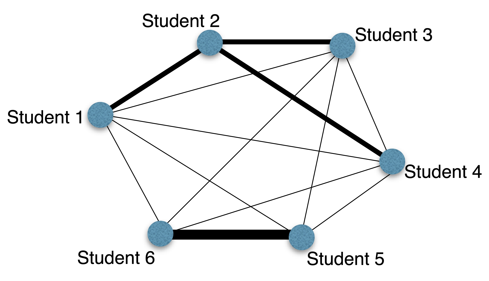
<p class="caption">(\#fig:unnamed-chunk-7)Network of Student Team Membership</p>
</div>

If we had chosen to put 3's along the diagonal, each vertex in this graph would have a bold edge that loops back to itself. Graphs and the adjacency matrices which define them are at the heart of many problems in social network analysis. For example, websites like Facebook and LinkedIn are just enormous networks of nodes (individual users) connected by edges ("friendships" or "connections"). In the case of Twitter, the network is even more complicated because the relationships are _directed_: the "follower" connection is not symmetric, the people I "follow" do not have to follow me back. We may have a chance to discuss more of this later; in general, it makes the analysis much more difficult!

### Example: Correlation matrices {#introcorr}

When we have several variables to analyze, it is good practice to measure the pairwise correlations between variables. Suppose we have 4 variables, $x_1, x_2, x_3,\,\mbox{and}\, x_4$. We will often examine the _correlation matrix_, $\C$, which is defined as follows:
$$\C_{ij}=correlation(x_i,x_j).$$
For example, suppose our correlation matrix is as follows:
$$\C=\left(\begin{matrix} 1 & 0.3 & -0.9 & 0.1\\0.3 & 1 & 0.8 & -0.5\\-0.9&0.8&1&-0.6\\0.1&-0.5&-0.6&1 \end{matrix}\right)$$

It is clear that the diagonal elements of this matrix, $C_{ii}$, should always equal 1 because every variable is perfectly correlated with itself. We can also see that

$$C_{ij}=C_{ji}\quad \mbox{Because }\,correlation(x_i,x_j)=correlation(x_j,x_i)$$ 
And in this particular example,
$$C_{13}=-0.9 \quad \mbox{Indicates that }\,x_1\,\,\mbox{and}\,\,x_3\,\,\mbox{have a strong negative correlation.}$$


## Vectors

Now that we've introduced the concept of a matrix, let's talk about vectors. A **vector** are merely a special type of matrix, one that consists of only a single row or column. They are essentially ordered lists of numbers. For example:

$$\x=\left(\begin{matrix} 5\\6\\7\\8 \end{matrix}\right) \qquad \mathbf{z}=\left(\begin{matrix} 3 & 5 & 1 & 0 & 2 \end{matrix}\right) \qquad \y = \left(\begin{matrix} y_1\\y_2\\y_3 \end{matrix}\right)$$
are all examples of vectors; $\x$ and $\y$ are **column vectors** and $\mathbf{z}$ is a **row vector**. In this text, to denote a vector we will always use a _bold lower-case letter_ like $\x, \y, \mbox{or } \mathbf{a}$. Since vectors only have one row or column, we do not need two subscripts to refer to their elements - we can use a single subscript to refer to the elements, as shown in the vector $\y$. Thus, $x_3$ refers to the $3^{rd}$ element in the vector $\x$ above: $$x_3 = 7.$$ Notice that the elements of a vector are not written in bold. In fact, all **scalar** quantities (a quantity that is just a single number (like 2 or $\sqrt{5}$), not a matrix) will be represented by unbolded, usually lowercase (often greek) letters. For example, letters like $\alpha, \beta, x_i, \mbox{or } a$ will be used to refer to scalars.

You may wonder now why the notation is so particular, but as we get into the subject it will be come clear that some convention must be retained if we are going to understand an equation. If we write an equation like
$$\A\x=\b \qquad \mbox{or} \qquad \mathbf{M}\y=\alpha\y$$
We have to know what it represents - in the first case, we are dealing with a matrix $\A$, and two vectors $\x$ and $\b$; in the second case we are dealing with a matrix $\mathbf{M}$, a vector $\y$, and a scalar, $\alpha$.

:::{.exercise name='Matrix, Vector, and Scalar Notation' #matnot}
For the following quantities, indicate whether the notation indicates a Matrix, Scalar, or Vector.
\vspace{.5cm}
$$\A \qquad \qquad A_{ij} \qquad \qquad \v \qquad \qquad  p_2 \qquad \qquad  \lambda  \qquad \qquad \p_2$$
\vspace{.5cm}
:::

In the previous exercise, we see an important difference: $p_2$ is not bold, and thus is automatically assumed to a scalar, while $\p_2$ is bold and lowercase meaning, despite the subscript, it refers to a vector. 

### Vector Geometry: $n$-space

You are already familiar with the concept of "ordered pairs" or coordinates $(x_1,x_2)$ on the two-dimensional plane (in Linear Algebra, we call this plane "$2$-space"). Fortunately, we do not live in a two-dimensional world! Our data will more often consist of measurements on a number (lets call that number $n$) of variables.  Thus, our data points belong to what is known as $n$-space. They are represented by **$n$-tuples** which are nothing more than ordered lists of numbers:
$$(x_1, x_2, x_3, \dots, x_n).$$
An $n$-tuple defines a **vector** with the same $n$ elements, and so these two concepts should be thought of interchangeably. The only difference is that the vector has a direction (usually depicted with an arrow), away from the origin and toward the $n$-tuple. This concept is obviously very difficult to visualize when $n>3$, but our mental visualizations of $2-$ and $3-$space will usually be sufficient when we want to consider higher dimensional spaces.

:::{.example name='2-space' #twospace}
Whereas we once thought of ordered pairs as _points_ in space, we can also consider the coordinates as defining _vectors_. In almost every scenario, these two concepts can be thought of equivalently, however the direction of vectors helps us define their arithmetic geometrically, as we will see in the next chapter.
<center>
 
 
</center>
:::

You will recall that the symbol $\Re$ is used to denote the set of real numbers. $\Re$ is simply $1$-space. It is a set of vectors with a single element. In this sense any real number, $x$, has a direction: if it is positive, it is to one side of the origin, if it is negative it is to the opposite side. That number, $x$, also has a magnitude: $|x|$ is the distance between $x$ and the origin, 0.

:::{.definition name='n-space' #nspace}
$n$-space (the set of real $n$-tuples) is denoted $\Re^n$.  In set notation, the formal mathematical definition is simply:
$$\Re^n = \left\lbrace (x_1,x_2,\dots,x_n) : x_i \in \Re, i=1,\dots, n\right\rbrace.$$
:::

We will often use this notation to define the size of an arbitrary vector. For example, $\x \in \Re^p$ simply means that $\x$ is a vector with $p$ entries:
$\x=(x_1,x_2,\dots,x_p)$.

Many (all, really) of the concepts we have previously considered in $2$- or $3$-space extend naturally to $n$-space and a few new concepts become useful as well. One very important concept is that of a **norm** or distance metric, as we will see in Chapter \@ref(norms). Before we get into the details of the vector space model, let's continue with some of the basic definitions we will need on that journey.

## Matrix Operations

### Transpose {#transpose}

One important transformation we will have to perform on a matrix is to switch the columns into rows. It is not necessary that you see the importance of this transformation right now, but trust that it is something we will need quite frequently.

:::{.definition name='Transpose of a Matrix or Vector' #transposedef}
For a given $m\times n$ matrix $\A$, the **transpose** of $\A$, written $\A^T$ (read as "$\A$-transpose") in this course and sometimes elsewhere denoted as $\A'$ is the $n\times m$ matrix whose rows are the corresponding columns of $\A$.

Thus, if $\A$ is a $3\times 4$ matrix then $\A^T$ is a $4\times 3$ matrix as follows:
$$\A = \left(\begin{matrix} A_{11} & A_{12} & A_{13} &A_{14}\\ A_{21} & A_{22} & A_{23} &A_{24}\\ A_{31} & A_{32} & A_{33} &A_{34}\end{matrix}\right)
\quad  \A^T = \left(\begin{matrix} A_{11} & A_{21} & A_{31}\\A_{12} & A_{22} & A_{32}\\A_{13} & A_{23} & A_{33}\\A_{14} & A_{24} & A_{34}\end{matrix}\right)$$

An equivalent way to state this definition is to say that 
$$(A^T)_{ij} = A_{ji}$$
_Note: If we transpose the transpose of a matrix, we will get back the original matrix. That is,_ $$(\A^T)^T = \A.$$
:::


:::{.example name='Transpose of a Matrix or Vector' #transpose}
For the following matrices and vectors, determine the transpose:
$$\B=\left(\begin{matrix} 2 & -3 & -4 \\5&-6&-7\\-8&9&0 \end{matrix}\right) \qquad \mathbf{M}=\left(\begin{matrix} -1&2\\-3&6\\7&-9\\5&-1 \end{matrix}\right) \qquad \x=\left(\begin{matrix}3\\-4\\5\\6\end{matrix}\right)$$
To find the transpose, we simply create new matrices whose rows are the corresponding columns of each matrix or vector:
$$\B^T=\left(\begin{matrix} 2 &5& -8\\-3&-6&9\\-4&-7&0\end{matrix}\right) \qquad \mathbf{M}^T = \left(\begin{matrix}-1&-3&7&5\\2&6&-9&-1 \end{matrix}\right) $$ $$\x^T = \left(\begin{matrix} 3&-4&5&6 \end{matrix}\right)$$
:::

:::{.definition name='Symmetric Matrix' #symdef}
Defining the matrix transpose allows us to define the notion of a _symmetric matrix_. A matrix $\A$ is called **symmetric** if and only if $$\A=\A^T.$$
This is equivalent to saying that $\A$ is symmetric if and only if
$$A_{ij}=A_{ji}.$$
It should be clear from the definition that in order for $\A$ to be a symmetric matrix, it _must_ be a square matrix - otherwise $\A$ and $\A^T$ would not even have the same size!
:::


:::{.example name='Symmetric Matrices' #sym}
The following matrix is symmetric because $\B^T = \B$.
$$\B=\left(\begin{matrix} 2 & 0 & 1 \\0&-6&-7\\1&-7&0 \end{matrix}\right)$$
:::

:::{.exercise name='Transpose and Symmetry' #transposesym}
Given that,
$$\A=\left(\begin{matrix} 2 & -4 \\-1&2\\3&-6 \end{matrix}\right) \quad \v^T = \left(\begin{matrix} 1 & 0 & -2 & 5\end{matrix}\right) \quad \B=\left(\begin{matrix} B_{11}&B_{12}&B_{13}\\B_{21}&B_{22}&B_{23}\\B_{31}&B_{32}&B_{33}\\B_{41}&B_{42}&B_{43}\end{matrix}\right)$$
 compute the following matrices:
\vspace{.5cm}
$$\A^T= \qquad \qquad \qquad \qquad (\A^T)^T= \qquad \qquad \qquad \qquad$$
\vspace{1cm}
$$ \v= \qquad \qquad \qquad \qquad \B^T = \qquad \qquad\qquad \qquad $$
\vspace{1cm}

Give an example of a $4\times 4$ symmetric matrix:\
\vspace{1.5cm} 

Is a correlation matrix symmetric? (For a hint, see section \@ref(introcorr))\
\vspace{.5cm}
:::

### Trace of a Matrix

Another important matrix operation that will come into play later is the _trace_ of a matrix. The **trace** of a square matrix is the sum of the diagonal elements of this matrix.

:::{.definition name='Trace of a Matrix' #tracedef}
For an $n\times n$ square matrix, $\A$, the **trace** of $\A$, written
$$trace(\A)\,\,\,\mbox{or}\,\,\,tr(\A)$$
is the sum of the diagonal elements:
$$tr(\A)=\sum_{i=1}^n A_{ii}$$

The trace of a rectangular matrix is undefined. 
:::


:::{.example name='Trace of a Matrix' #trace}
Let $$\A=\left(\begin{matrix} 3&4&1\\0&1&-2\\-1&\sqrt{2}&3\end{matrix}\right)$$
Then, the trace of $\A$ is the sum of the diagonal elements:
$$tr(\A)=\sum_{i=1}^3 A_{ii} = 3+1+3 = 7.$$
:::

While we're on the subject of diagonal elements, let's take the opportunity to introduce some special types of matrices, namely the **identity matrix** and a **diagonal matrix**. 

## Special Matrices and Vectors {#special}

:::{.definition name='Identity Matrix' #identity}
The bold capital letter $\mathbf{I}$ will always to denote the **identity matrix**. Sometimes this matrix has a single subscript to specify the size of the matrix. More often, the size of the identity is implied by the matrix equation in which it appears.
$$\mathbf{I}_4 = \left(\begin{matrix} 1 & 0 & 0 & 0 \\
						0 & 1 & 0 & 0\\
						0&0&1&0\\
						0&0&0&1 \end{matrix}\right)$$
:::


:::{.definition name='Elementary Vectors' #elemvectors}
The bold lowercase $\mathbf{e}_j$ is used to refer to the $j^{th}$ column of $\mathbf{I}$. It is simply a vector of zeros with a one in the $j^{th}$ position. We do not often specify the size of the vector $\mathbf{e}_j$, the number of elements is generally assumed from the context of the problem.

$$\mathbf{e}_j=\begin{matrix}
\begin{matrix} ~ \\~\\~\\~\\j^{th}\text{row} \rightarrow \\ ~\\~\\~ \end{matrix} & 
  \begin{pmatrix}0\\0\\ \vdots \\0\\1\\0\\ \vdots\\0\end{pmatrix}\\\\
\end{matrix}$$

The vector $\mathbf{e}$ with no subscript refers to a vector of all ones. In some texts, this vector is written as a bold faced $\textbf{1}$.

$$\mathbf{e} = \left(\begin{matrix} 1\\1\\1\\ \vdots \\ 1\end{matrix}\right)$$
:::		

The elementary vectors described in Definition \@ref(def:elemvectors) create the coordinate axes of $n$-space. For illustrative purposes, let's consider $2$-space. The elementary vectors in $2$-space are:
$$\e_1 = \left(\begin{matrix} 1\\0\end{matrix}\right) \quad \mbox{and} \quad \e_2 = \left(\begin{matrix} 0\\1 \end{matrix}\right) $$
These vectors correspond to the directions of the coordinate axes as illustrated in Figure \@ref(fig:elemvectors)

<div class="figure" style="text-align: center">

<p class="caption">(\#fig:elemvectors)Elementary cectors represent our "usual" coordinate axes</p>
</div>

						
:::{.definition name='Diagonal Matrix' #diag}
A **diagonal matrix** is a matrix for which off-diagonal elements, $\A_{ij},\,i\ne j$ are zero.
For example:
$$\mathbf{D} = \left(\begin{matrix} \sigma_1 & 0 & 0 & 0 \\
						0 & \sigma_2 & 0 & 0\\
						0&0&\sigma_3&0\\
						0&0&0&\sigma_4 \end{matrix}\right)$$
Since the off diagonal elements are 0, we need only define the diagonal elements for such a matrix. Thus, we will frequently write
$$\mathbf{D}=diag\{\sigma_1,\sigma_2,\sigma_3,\sigma_4\}$$
or simply $$D_{ii} = \sigma_i.$$
:::


From the preceding definitions, it should be clear that diagonal and identity matrices are always _square_, meaning they have the same number of rows and columns, and {symmetric}, meaning they do not change under the transpose operation.

:::{.exercise name='Trace and Special Matrices' #traceexer}
Write out the following matrices and then compute their Trace, if possible:

$$\I_5 \qquad \mathbf{D}=diag\{2,6,1\} \qquad \e_2 \in \Re^4$$
\vspace{1.5cm}
:::


:::{.definition name='Triangular Matrices' #triangulardef}
Triangular matrices are square matrices whose elements are zero either below or above the main diagonal. If the matrix has zeros below the main diagonal, then it's called **upper triangular**. The following illustration depicts an upper triangular matrix, where the asterisk symbol is used to denote any number (including potential zeros).
$$\left(\begin{matrix} *&*&*&\dots&*\\0&*&*&\dots&*\\0&0&*&\dots&*\\ \vdots &\vdots &\ddots &\ddots&*\\0&0&0&0&*\end{matrix}\right)$$

If a matrix has zeros above the main diagonal, then it's called **lower triangular**. The following illustration depicts a lower triangular matrix.
$$\left(\begin{matrix} 0&0&0&\dots&0\\ *&0&0&\dots&0\\ *&*&0&\dots&0\\ \vdots &\vdots &\ddots &\ddots&0\\ *&*&*&*&0\end{matrix}\right)$$
:::

:::{.exercise name='Triangular Matrices' #triangularexer}
The following are examples of triangular matrices. Are they upper or lower triangular?

$$\left(\begin{matrix} 1&2&3&4\\0&5&6&7\\0&0&8&9\\0&0&0&1 \end{matrix}\right) \quad \left(\begin{matrix} -1&0&0\\0&-2&0\\1&-1&2 \end{matrix}\right) \quad \left(\begin{matrix} 0&0&0\\0&0&0\\0&0&0 \end{matrix}\right)$$
:::

## Summary of Conventional Notation 

Linear Algebra has some conventional ways of representing certain types of numerical objects.  Throughout this course, we will stick to the following basic conventions:

- Bold and uppercase letters like $\A$, $\X$, and $\U$ will be used to refer to matrices. 
- Occasionally, the size of the matrix will be specified by subscripts, like $\A_{m\times n}$, which means that $\A$ is a matrix with $m$ rows and $n$ columns. 
- Bold and lowercase letters like $\x$ and $\y$ will be used to reference vectors. Unless otherwise specified, these vectors will be thought of as columns, with $\x^T$ and $\y^T$ referring to the row equivalent.
- The individual elements of a vector or matrix will often be referred to with subscripts, so that $A_{ij}$ (or sometimes $a_{ij}$) denotes the element in the $i^{th}$ row and $j^{th}$ column of the matrix $\A$.  Similarly, $x_k$ denotes the $k^{th}$ element of the vector $\x$. These references to individual elements are not generally bolded because they refer to scalar quantities. 
- Scalar quantities are written as unbolded greek letters like $\alpha$, $\delta$, and $\lambda$. 
- The notation $\x \in \Re^n$ simply means that $\x$ is a vector in $n$-space, or a vector with $n$ elements.
- The **transpose** of an $m\times n$ matrix $\A$ is the $n\times m$ matrix $\A^T$ whose rows are the columns of $\A$.
- The **trace** of a square matrix $\A_{n\times n}$, denoted $Tr(\A)$ or $Trace(\A)$, is the sum of the diagonal elements of $\A$,
$$Tr(\A)=\sum_{i=1}^n A_{ii}.$$


## Exercises


<ol> 
<li>Use the following matrices or vectors to answer the following questions:
\begin{equation*}
\mathbf{A}=\left(\begin{array}{ccc} 1&3&8\\3&0&-2\\4&1&-3 \end{array}\right) \quad \mathbf{M}=\left(\begin{array}{cccc} 1&8&-2&5\\2&8&1&7 \end{array}\right) \quad 
\mathbf{D} = \left(\begin{array}{ccc} 1&0&0\\0&5&0\\0&0&3\end{array}\right) 
\end{equation*}
\begin{equation*}
\mathbf{X}=\left(\begin{array}{cc} 780 & 95000\\600 & 60000\\550 & 65000\\400 & 35000\\450 & 40000\\750 &80000\end{array}\right) \quad
\mathbf{t} = \left(\begin{array}{c} 1\\1.3\\0.8\\2\\2.5\\0.8\\0.9 \end{array}\right) \quad 
\mathbf{v}=\left(\begin{array}{c} 6\\3\\-1\\2\end{array}\right) \quad \mathbf{u}=\left(\begin{array}{cccc} 6&4&8&1\end{array}\right)
\end{equation*}

<ol style="list-style-type:lower-alpha">
  <li> Write the appropriate size/dimensions next to each matrix:
<ol style="list-style-type:lower-roman">
  <li> $\mathbf{A}$  
  <li> $\mathbf{M}$  
  <li> $\mathbf{D}$
  <li> $\mathbf{X}$  
  <li> $\mathbf{t}$  
  <li> $\mathbf{v}$  
  <li> $\mathbf{u}$  
</ol>

  <li> Which of these matrices are square? Which are rectangular?

  <li> Give the following quantities:
 <ol style="list-style-type:lower-roman">   
  <li> $A_{12}=$   
  <li> $M_{21}=$   
  <li> $\D_{\star3}=$  
  <li> $\mathbf{M}_{2\star}=$   
  <li> $X_{42}=$  
  <li> $t_5=$   
  <li> $v_3=$  
</ol>

  <li> What are the diagonal elements of $\A$?
</ol>


<li> For each of the following matrices and vectors, give their dimension. Label each as a matrix or vector. For each matrix, indicate whether the matrix is square or rectangular.
<ol style="list-style-type:lower-alpha">
  <li>  $$\A=\left(\begin{matrix} 2 & 3 & -1\\1&-1&1\\2&2&1 \end{matrix}\right)$$  
  <li>  $$\mathbf{h}=\left(\begin{matrix} -1\\-4\\1\\2 \end{matrix}\right)$$  
  <li>  $$\B=\left(\begin{matrix}   B_{11}&B_{12}&B_{13}\\B_{21}&B_{22}&B_{23}\\B_{31}&B_{32}&B_{33}\\B_{41}&B_{42}&B_{43}\end{matrix}\right)$$  
  <li>  $$\C=\left(\begin{matrix} 1 & 0.3 & -0.9 & 0.1\\0.3 & 1 & 0.8 & -0.5\\-0.9&0.8&1&-0.6\\0.1&-0.5&-0.6&1 \end{matrix}\right)$$  
  <li>  $$\A = [A_{ij}] \quad \mbox{where } i=1,2,3 \quad \mbox{and   } j=1,2$$  
</ol>
<li> For the following quantities, use what you know about notation to tell if they are matrices, vectors, or scalars:
<ol style="list-style-type:lower-alpha">
  <li> $\mathbf{H}$  
  <li> $\mathbf{W}$  
  <li> $n$  
  <li> $\v_2$  
  <li> $v_2$  
  <li> $\mathbf{M}_{\star 2}$  
  <li> $\lambda$  
  <li> $A_{ij}$  
  <li> $\mathbf{r}$  
</ol>

<li> The matrix $\C$ from exercise 2d is the correlation matrix discussed earlier in this chapter. What is the trace of $\C$? For any correlation matrix computed using $p$ variables, what should we expect the trace to be?

<li> If $$\v^T = \left(\begin{matrix} 1&6&-1&\sqrt{2} \end{matrix}\right),$$ then what is $\v$?

<li> For each of the following, write the vector or matrix that is specified:
<ol style="list-style-type:lower-alpha">
  <li> $\e_3 \in \Re^4$
  <li> $\D=diag\{2, \sqrt{3}, -1\}$
  <li> $\e \in \Re^3$
  <li> $\I_2$
</ol>

<li> How do you know if a matrix is symmetric? Give an example of a symmetric matrix.

<li> Give an example of a $4\times 4$ upper triangular matrix and a $3\times 3$ lower triangular matrix.

<li> Suppose we measure the heights of 10 people, $person_1, person_2, \dots, person_{10}$. 
<ol style="list-style-type:lower-alpha">
  <li> If we define a matrix $\S$ as
$$S_{ij} = height(person_i) - height(person_j)$$
is the matrix $\S$ symmetric? What is the trace($\S$)?  
  <li> If instead we create a matrix $\mathbf{G}$ where
$$G_{ij} = [height(person_i) - height(person_j)]^2$$
is the matrix $\mathbf{G}$ symmetric? What is the trace($\mathbf{G}$)?  
</ol>


<li> Refer to the network/graph shown below. This particular network has 6 numbered vertices (the circles) and edges which connect the vertices. Each edge has a certain {weight} (perhaps reflecting some level of association between the vertices) which is given as a number.

<li> Use the network shown below to answer the following questions.  
<div class="figure" style="text-align: center">

<p class="caption">(\#fig:unnamed-chunk-8)Graph (Network) for exercise 11</p>
</div>
<ol style="list-style-type:lower-alpha">  
  <li>  Write down the adjacency matrix, $\A$, for this graph where $\A_{ij}$ reflects the weight of the edge connecting vertex $i$ and vertex $j$.   
  <li>  The **degree** of a vertex is defined as the sum of the weights of the edges connected to that vertex. Create a vector $\mathbf{d}$ such that $d_i$ is the degree of node $i$.  
</ol>


<!-- ## List of Key Terms  -->

<!-- - linear -->
<!-- - matrix -->
<!-- - vector -->
<!-- - scalar -->
<!-- - $A_{ij}$ -->
<!-- - $\A_{\star j}$ -->
<!-- - $\A_{i \star}$ -->
<!-- - dimensions -->
<!-- - diagonal element -->
<!-- - square matrix -->
<!-- - rectangular matrix -->
<!-- - network -->
<!-- - graph -->
<!-- - adjacency matrix -->
<!-- - correlation matrix -->
<!-- - transpose -->
<!-- - symmetric matrix -->
<!-- - trace -->
<!-- - diagonal matrix -->
<!-- - identity matrix -->
<!-- - upper triangular matrix -->
<!-- - lower triangular matrix -->


<!--chapter:end:00-introLA.Rmd-->

# Matrix Arithmetic {#mult}

## Matrix Addition, Subtraction, and Scalar Multiplication


Addition, subtraction, and scalar multiplication are the only operations which act *element-wise* on matrices - they are performed in a way you might expect given your previous studies. 

:::{.definition name='Addition, Subtraction, and Scalar Multiplication' #addsubdef}
Two matrices can be added or subtracted only when they have the same dimensions. If $\mathbf{A}$ and $\mathbf{B}$ are both $m\times n$ matrices then the (i,j) element of the sum (or difference), written $(\mathbf{A}_-^+ \mathbf{B})_{ij}$ is:

\begin{equation*} (\mathbf{A}+\mathbf{B})_{ij}=A_{ij}+B_{ij} \end{equation*}
similarly,
\begin{equation*}(\mathbf{A}-\mathbf{B})_{ij}=A_{ij}-B_{ij} \end{equation*}
Multiplying a scalar by a matrix or vector also works element-wise:
\begin{equation*}(\alpha\mathbf{A})_{ij}=\alpha A_{ij} \end{equation*}
:::
Two matrices can be added or subtracted only when they have the same dimensions. If $\mathbf{A}$ and $\mathbf{B}$ are both $m\times n$ matrices then the (i,j) element of the sum (or difference), written $(\mathbf{A}_-^+ \mathbf{B})_{ij}$ is\:

:::{.example name='Addition, Subtraction, and Scalar Multiplication' #addsub}
<br>
a. Compute $\mathbf{A}+\mathbf{B}$, if possible:
$$\mathbf{A}=\left(\begin{matrix} 2 & 3 & -1\\1&-1&1\\2&2&1 \end{matrix}\right) \quad \mathbf{B}=\left(\begin{matrix} 4 & 5 & 6\\-1&0&4\\3&4&3 \end{matrix}\right)$$
*We can add the matrices because they have the same size.*
$$\mathbf{A}+\mathbf{B} = \left(\begin{matrix} 6 & 8 & 5\\0&-1&5\\5&6&4\end{matrix}\right)$$
b. Compute $\mathbf{A}-\bo{H}$, if possible:
$$\mathbf{A}=\left(\begin{matrix} 1 & 2\\3&5 \end{matrix}\right) \qquad \bo{H}= \left(\begin{matrix} 6 & 5& 10\\0.1 & 0.5 & 0.9 \end{matrix}\right)$$
*We cannot subtract these matrices because they don't have the same size.*\

c. Compute $2\mathbf{A}$:
$$\mathbf{A}=\left(\begin{matrix} 2 & 3 & -1\\1&-1&1\\2&2&1 \end{matrix}\right)$$
*We simply multiply every element in $\mathbf{A}$ by 2,*
$$2\mathbf{A}=\left(\begin{matrix} 4 & 6 & -2\\2&-2&2\\4&4&2 \end{matrix}\right)$$

:::


:::{.exercise name='Addition, Subtraction, and Scalar Multiplication' #addsubexer}
<br>
a.  Compute $\v-\y$, if possible: $$\v=\left(\begin{matrix} 2\\-3\\4 \end{matrix}\right) \quad \y=\left(\begin{matrix} 1\\4\\1 \end{matrix}\right)$$
b. Compute $\v+\bo{h}$, if possible:
$$\v=\left(\begin{matrix} 4\\-5\\3 \end{matrix}\right) \quad \bo{h}=\left(\begin{matrix} -1\\-4\\1\\2 \end{matrix}\right)$$
c. Compute $\frac{1}{\sqrt{2}}\v$:
$$\v=\left(\begin{matrix} 4\\-5\\3 \end{matrix}\right)$$
:::

## Geometry of Vector Addition and Scalar Multiplication {#sec:vectoradd}

You've already learned how vector addition works algebraically: it occurs element-wise between two vectors of the same length:
$$
 \a+\b =\left(\begin{matrix} a_1\\ a_2\\ a_3\\ \vdots \\ a_n \end{matrix}\right) +\left(\begin{matrix} b_1\\ b_2\\ b_3\\ \vdots \\ b_n \end{matrix}\right) = \left(\begin{matrix} a_1+b_1\\a_2+b_2\\a_3+b_3\\ \vdots \\a_n+b_n \end{matrix}\right)
$$

Geometrically, vector addition is witnessed by placing the two vectors, $\a$ and $\b$, _tail-to-head_. The result, $\a+\b$, is the vector from the open tail to the open head. This is called the parallelogram law and is demonstrated in Figure \@ref(fig:vectoradd).


<!--      |  -->
<!-- :-------------------------:|:-------------------------: -->
<!-- Addition of vectors  |  Subtraction of Vectors -->

<div class="figure" style="text-align: center">

<p class="caption">(\#fig:vectoradd)Geometry of Vector Addition</p>
</div>

When subtracting vectors as $\a-\b$ we simply add $-\b$ to $\a$. The vector $-\b$ has the same length as $\b$ but points in the opposite direction. This vector has the same length as the one which connects the two heads of $\a$ and $\b$ as shown in Figure \@ref(fig:vectorsub). 

<div class="figure" style="text-align: center">
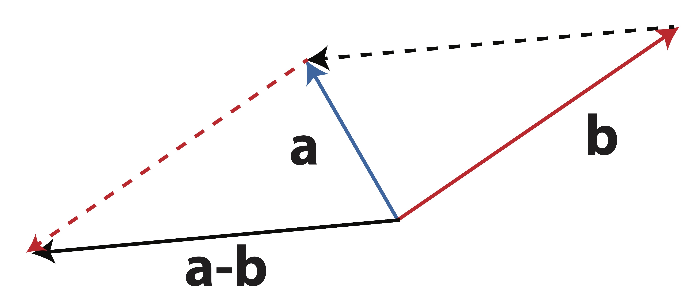
<p class="caption">(\#fig:vectorsub)Geometry of Vector Subtraction</p>
</div>

:::{.example name='Centering Data' #centering}

One thing we will do frequently in this course is deal with centered and/or standardized data. To center a group of data points, we merely subtract the mean of each variable from each measurement on that variable. Geometrically, this amounts to a *translation* (shift) of the data so that its center (or mean) is at the origin. Figure \@ref(fig:centerall) illustrates this process using 4 data points.

<div class="figure" style="text-align: center">

<p class="caption">(\#fig:centerall)Centering a Data Cloud as a Geometric Translation</p>
</div>
:::

__Scalar multiplication__ is another operation which acts element-wise:
$$\alpha \a = \alpha \left(\begin{matrix} a_1\\a_2\\a_3\\ \vdots \\a_n \end{matrix}\right) = \left(\begin{matrix} \alpha a_1 \\ \alpha a_2\\ \alpha a_3 \\ \vdots \\ \alpha a_n\end{matrix}\right) $$

Scalar multiplication changes the length of a vector but not the overall direction (although a negative scalar will scale the vector in the opposite direction through the origin). We can see this geometric interpretation of scalar multiplication in Figure \@ref(fig:vectormult).


<div class="figure" style="text-align: center">
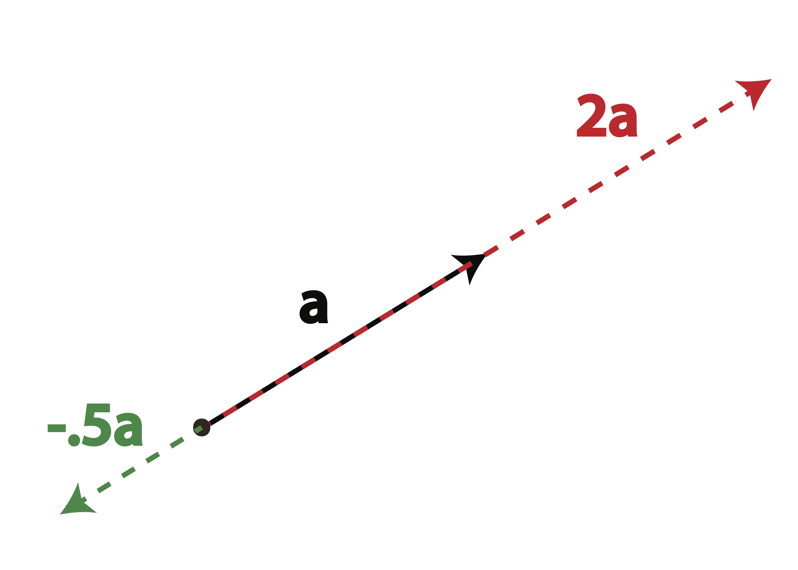
<p class="caption">(\#fig:vectormult)Geometric Effect of Scalar Multiplication</p>
</div>

<!-- :::{.example name='Vector Scaling: Standardizing Data' #scaling} -->
<!-- Once data has been centered, it is also common to then scale the variables according to their standard deviation (or some other normalization factor). Geometrically this amounts to a proportional shrinking of the data. The following graphic illustrates this process using the same 4 data points from Example \@ref(exm:centering).  -->
<!-- ```{r, fig=T, label='scaleall', fig.show="hold", out.width="80%", echo=F,fig.align='center', fig.cap = 'Standardizing a Data Cloud.'} -->
<!-- knitr::include_graphics("figs/scaleall.jpg") -->
<!-- ``` -->
<!-- Note that it's the _variable_ vectors undergo the scalar multiplication whereas what's depicted in Figure \@ref(fig:scaleall) is the coordinates of _observations_. This is the first time we might contemplate the fact that any data matrix can have two equivalent geometric views: For an $m \times n$ matrix, the rows create vectors (points) that live in $\Re^n$ and the columns create vectors (points) that live in $\Re^m$. Depending on our task, either vantage point can provide analytical insights. -->
<!-- ::: -->


## Linear Combinations

:::{.definition name='Linear Combination' #lincombdef}

A **linear combination** is constructed from a set of terms $\v_1, \v_2, \dots, \v_n$ by multiplying each term by a scalar constant and adding the result:
$$\bo{c}=\alpha_1\v_1+\alpha_2 \v_2+ \dots+ \alpha_n\v_n = \sum_{i=1}^n \alpha_i \v_n$$
The coefficients $\alpha_i$ are scalar constants and the terms, $\{\v_i\}$ can be scalars, vectors, or matrices. Most often, we will consider linear combinations where the terms $\{\v_i\}$ are vectors. 
:::

Linear combinations are quite simple to understand. Once the equation is written, we can consider the expression as a breakdown into parts. 

:::{.example name='Linear Combination' #lincomb}
The simplest linear combination might involve columns of the identity matrix:
$$\left(\begin{matrix} 3 \\ -2\\4 \end{matrix}\right) = 3\left(\begin{matrix} 1\\0\\0 \end{matrix}\right) -2 \left(\begin{matrix} 0\\1\\0 \end{matrix}\right) +4 \left(\begin{matrix} 0\\0\\1 \end{matrix}\right)$$
We can easily picture this linear combination as a "breakdown into parts where the parts give directions along the 3 coordinate axis with which we are all familiar.
:::


We don't necessarily have to use vectors as the terms for a linear combination. Example \@ref(exm:matrixlincomb) shows how we can write any $m\times n$ matrix as a linear combination of $nm$ elementary matrices.

:::{.example name='Linear Combination of Matrices' #matrixlincomb}
Write the matrix $\mathbf{A}=\left(\begin{matrix} 1 & 3\\4&2 \end{matrix}\right)$ as a linear combination of the following matrices:
$$\left\lbrace \left(\begin{matrix} 1 & 0\\0&0 \end{matrix}\right),\left(\begin{matrix} 0 & 1\\0&0 \end{matrix}\right),\left(\begin{matrix} 0 & 0\\1&0 \end{matrix}\right),\left(\begin{matrix} 0 & 0\\0&1 \end{matrix}\right) \right\rbrace$$
Solution:
$$\mathbf{A}=\left(\begin{matrix} 1 & 3\\4&2 \end{matrix}\right) = 1\left(\begin{matrix} 1 & 0\\0&0 \end{matrix}\right)+3\left(\begin{matrix} 0 & 1\\0&0 \end{matrix}\right)+4\left(\begin{matrix} 0 & 0\\1&0 \end{matrix}\right)+2\left(\begin{matrix} 0 & 0\\0&1 \end{matrix}\right)$$
:::


## Matrix Multiplication

When we multiply matrices, we do not perform the operation element-wise as we did with addition and scalar multiplication. Matrix multiplication is, in itself, a very powerful tool for summarizing information. In fact, many of the analytical tools we will focus on in this course, like Markov Chains, Principal Components Analysis, Factor Analysis, and the Singular Value Decomposition, can all be understood more clearly with a firm grasp on matrix multiplication. Because this operation is so important, we will spend a considerable amount of energy breaking it down in many ways. 

### The Inner Product
We'll begin by defining the multiplication of a row vector times a column vector, known as an inner product (sometimes called the _dot product_ in applied sciences). For the remainder of this course, unless otherwise specified, we will consider vectors to be columns rather than rows. This makes the notation more simple because if $\x$ is a column vector,
$$\x=\left(\begin{matrix} x_1\\x_2\\\vdots\\ x_n\end{matrix}\right)$$
then we can automatically assume that $\x^T$ is a row vector:
$$\x^T = \left(\begin{matrix} x_1&x_2&\dots&x_n\end{matrix}\right).$$

:::{.definition name='Inner Product' #innerproddef}
The **inner product** of two vectors, $\x$ and $\y$, written $\x^T\y$, is defined as the sum of the product of corresponding elements in $\x$ and $\y$:

$$\x^T\y = \sum_{i=1}^n x_i y_i.$$
If we write this out for two vectors with 4 elements each, we'd have:

$$\x^T\y=\left(\begin{matrix} x_1 & x_2 & x_3 & x_4 \end{matrix}\right) \left(\begin{matrix} y_1\\y_2\\y_3\\y_4 \end{matrix}\right) = x_1y_1+x_2y_2+x_3y_3+x_4y_4$$

*Note: The inner product between vectors is only possible when the two vectors have the same number of elements!*\
:::

<div class="figure" style="text-align: center">

<p class="caption">(\#fig:animinnerproduct)Animation of Inner Product between two vectors</p>
</div>

:::{.example name='Vector Inner Product' #innerprod}
Let $$\x=\left(\begin{matrix} -1 \\2\\4\\0 \end{matrix}\right) \quad \y=\left(\begin{matrix} 3 \\5\\1\\7 \end{matrix}\right) \quad \v=\left(\begin{matrix} -3 \\-2\\5\\3\\-2 \end{matrix}\right) \quad \u= \left(\begin{matrix} 2\\-1\\3\\-3\\-2 \end{matrix}\right)$$

If possible, compute the following inner products:

a. $\x^T\y$
\begin{eqnarray}
\x^T\y &=&\left(\begin{matrix} -1 &2&4&0 \end{matrix}\right) \left(\begin{matrix} 3 \\5\\1\\7 \end{matrix}\right) \cr &=& (-1)(3)+(2)(5)+(4)(1)+(0)(7) \cr &=& -3+10+4=\framebox{11}
\end{eqnarray}
b. $\x^T\v$
This is not possible because $\x$ and $\v$ do not have the same number of elements
c. $\v^T\u$
\begin{eqnarray}
\v^T\u &=& \left(\begin{matrix} -3 &-2&5&3&-2 \end{matrix}\right) \left(\begin{matrix} 2\\-1\\3\\-3\\-2 \end{matrix}\right)  \cr &=& (-3)(2)+(-2)(-1)+(5)(3)+(3)(-3)+(-2)(-2) \cr &=& -6+2+15-9+4 = \framebox{6}
\end{eqnarray}
:::

:::{.exercise name='Vector Inner Product' #innerprodexer}
Let $$\bo{v}=\left(\begin{matrix} 1 \\2\\3\\4\\5 \end{matrix}\right) \quad \e=\left(\begin{matrix} 1 \\1\\1\\1\\1 \end{matrix}\right) \quad \bo{p}=\left(\begin{matrix} 0.5 \\0.1\\0.2\\0\\0.2 \end{matrix}\right) \quad \u= \left(\begin{matrix} 10\\4\\3\\2\\1 \end{matrix}\right) \quad \bo{s} = \left(\begin{matrix} 2\\2\\-3 \end{matrix}\right)$$

If possible, compute the following inner products:

a. $\bo{v}^T\e$
b. $\bo{e}^T\bo{v}$
c. $\bo{v}^T\bo{s}$
d. $\bo{p}^T\u$
e. $\bo{v}^T\bo{v}$
:::

It should be clear from the definition and from the previous exercise, that for all vectors $\x$ and $\y$,
$$\x^T\y = \y^T\x.$$
Also, if we take the inner product of a vector with itself, the result is the sum of squared elements in that vector:
$$\x^T\x = \sum_{i=1}^n x_i^2 = x_1^2 + x_2^2+ \dots + x_n^2.$$

Now that we are comfortable multiplying a row vector ($\x^T$ in the definition) and a column vector ($\y$ in the definition), we can define multiplication for matrices in general.


### Matrix Product

Matrix multiplication is nothing more than a collection of inner products done simultaneously in one operation. We must be careful when multiplying matrices because, as with vectors, the operation is not always possible. Unlike the vector inner product, the order in which you multiply matrices makes a big difference!

:::{.definition name='Matrix Multiplication' #matmultdef}
Let $\mathbf{A}_{m\times n}$ and $\mathbf{B}_{k\times p}$ be matrices. The matrix product $\mathbf{A}\mathbf{B}$ is possible if and only if $n=k$; that is, when the number of columns in $\mathbf{A}$ is the same as the number of rows in $\mathbf{B}$. If this condition holds, then the dimension of the product, $\mathbf{A}\mathbf{B}$ is $m\times p$ and the (ij)-entry of the product $\mathbf{A}\mathbf{B}$ is the inner product of the $i^{th}$ row of $\mathbf{A}$ and the $j^{th}$ column of $\mathbf{B}$:

$$(\mathbf{A}\mathbf{B})_{ij} = \mathbf{A}_{i\star}\mathbf{B}_{\star j}$$
:::

This definition may be easier to dissect using an example:

:::{.example name='Steps to Compute a Matrix Product' #matmult}

Let $$\mathbf{A}=\left(\begin{matrix} 2 & 3 \\ -1 & 4 \\ 5 & 1 \end{matrix}\right) \quad \mbox{and} \quad \mathbf{B}=\left(\begin{matrix}  0 & -2 \\ 2 & -3 \end{matrix}\right)$$

When we first get started with matrix multiplication, we often follow a few simple steps:

1. Write down the matrices and their dimensions. Make sure the "inside" dimensions match - those corresponding to the columns of the first matrix and the rows of the second matrix:
$$\underset{(3\times \red{2})}{\mathbf{A}} \underset{(\red{2} \times 2)}{\mathbf{B}}$$
If these dimensions match, then we can multiply the matrices. If they don't, we stop right there - multiplication is not possible.
2. Now, look at the "outer" dimensions - this will tell you the size of the resulting matrix.
$$\underset{(\blue{3}\times 2)}{\mathbf{A}} \underset{(2\times \blue{2})}{\mathbf{B}}$$
So the product $\mathbf{A}\mathbf{B}$ is a $3\times 2$ matrix.
3. Finally, we compute the product of the matrices by multiplying each row of $\mathbf{A}$ by each column of $\mathbf{B}$ using inner products. The element in the first row and first column of the product (written $(\mathbf{A}\mathbf{B})_{11}$) will be the inner product of the first row of $\mathbf{A}$ and the first column of $\mathbf{B}$. Then, $(\mathbf{A}\mathbf{B})_{12}$ will be the inner product of the first row of $\mathbf{A}$ and the second column of $\mathbf{B}$, etc.

\begin{eqnarray}
\mathbf{A}\mathbf{B} &=&\left(\begin{matrix} (2)(0)+(3)(2) & (2)(-2)+(3)(-3)\\
 			 (-1)(0)+(4)(2) & (-1)(-2)+(4)(-3)\\
 			  (5)(0)+(1)(2) & (5)(-2)+(1)(-3) \end{matrix}\right) \cr
 	&=& \left(\begin{matrix} 6&-13\\8 & -10\\2&-13\end{matrix}\right)
\end{eqnarray}
:::

Matrix multiplication is incredibly important for data analysis. You may not see why all these multiplications and additions are so useful at this point, but we will visit some basic applications shortly. For now, let's practice so that we are prepared for the applications!

:::{.exercise name='Matrix Multiplication' #matmultexer}
Suppose we have $$\mathbf{A}_{4\times 6} \quad \mathbf{B}_{5\times 5} \quad \M_{5\times 4} \quad \bP_{6\times 5}$$
Circle the matrix products that are possible to compute and write the dimension of the result.
$$\mathbf{A}\M \qquad \M\mathbf{A} \qquad \mathbf{B}\M  \qquad \M\mathbf{B} \qquad \bP\mathbf{A} \qquad \bP\M \qquad \mathbf{A}\bP \qquad \mathbf{A}^T\bP \qquad \M^T\mathbf{B}$$
Let 
\begin{equation}
\mathbf{A}=\left(\begin{matrix} 1&1&0&1\\0&1&1&1\\1&0&1&0\end{matrix}\right) \quad \M = \left(\begin{matrix} -2&1&-1&2&-2\\1&-2&0&-1&2\\2&1&-3&-2&3 \\ 1&3&2&-1&2\end{matrix}\right)  \end{equation}

\begin{equation}
\C=\left(\begin{matrix} -1&0&1&0\\1&-1&0&0\\0&0&1&-1 \end{matrix}\right) \end{equation}

Determine the following matrix products, if possible:

a. $\mathbf{A}\C$

b. $\mathbf{A}\M$

c. $\mathbf{A}^T\C$

:::

One very important thing to keep in mind is this:

 <p style="text-align:center"><strong> matrix multiplication is NOT commutative! </strong></p>
 
 As we see from the previous exercises, it's quite common to be able to compute a product $\mathbf{A}\mathbf{B}$ where the reverse product, $\mathbf{B}\mathbf{A}$ is not even possible to compute. Even if both products are possible it is almost _never_ the case that $\mathbf{A}\mathbf{B}$ equals $\mathbf{B}\mathbf{A}$.
 


### Matrix-Vector Product

A matrix-vector product works exactly the same way as matrix multiplication; after all, a vector $\x$ is nothing but an $n\times 1$ matrix. In order to multiply a matrix by a vector, again we must match the dimensions to make sure they line up correctly. For example, if we have an $m\times n$ matrix $\mathbf{A}$, we can multiply by a $1\times m$ row vector $\v^T$ on the left:
$$\v^T\mathbf{A} \quad \mbox{works because } \underset{ (1\times \red{m})}{\v^T} \underset{(\red{m}\times n)}{\mathbf{A}}$$
$$\Longrightarrow \mbox{The result will be a   } 1 \times n \mbox{ row vector.}$$
or we can multiply by an $n\times 1$ column vector $\x$ on the right:

$$\mathbf{A}\x \quad \mbox{works because } \underset{(m\times \red{n})}{\mathbf{A}}\underset{(\red{n}\times 1)}{\x} $$
$$\Longrightarrow \mbox{The result will be a   } m\times 1 \mbox{ column vector.}$$

Matrix-vector multiplication works the same way as matrix multiplication: we simply multiply rows by columns until we've completed the answer. In the case of $\v^T\mathbf{A}$, we'd multiply the row $\v$ by each of the $n$ columns of $\mathbf{A}$, carving out our solution, one entry at a time :

$$\v^T\mathbf{A} = \left(\begin{matrix} \v^T\mathbf{A}_{*1} & \v^T\acol{2} & \dots & \v^T\acol{n} \end{matrix}\right).$$

In the case of $\mathbf{A}\x$, we'd multiply each of the $m$ rows of $\mathbf{A}$ by the column $\x$:

$$\mathbf{A}\x = \left(\begin{matrix} \arow{1}\x \\ \arow{2}\x \\ \vdots \\ \arow{m}\x \end{matrix}\right).$$

Let's see an example of this:

:::{.example name='Matrix-Vector Products' #matvecprod}
Let $$\mathbf{A}=\left(\begin{matrix} 2 & 3 \\ -1 & 4 \\ 5 & 1 \end{matrix}\right)  \quad \v=\left(\begin{matrix} 3\\2 \end{matrix}\right) \quad \bo{q}=\left(\begin{matrix} 2\\-1\\3\end{matrix}\right)$$

Determine whether the following matrix-vector products are possible. When possible, compute the product.

a. $\mathbf{A}\bo{q}$ 
$$\mbox{Not Possible: Inner dimensions do not match} \quad \underset{(3\times \red{2})}{\mathbf{A}}\underset{(\red{3}\times 1)}{\bo{q}}$$
b. $\mathbf{A}\v$
$$
\left(\begin{matrix} 2 & 3 \\ -1 & 4 \\ 5 & 1 \end{matrix}\right) \left(\begin{matrix} 3\\2 \end{matrix}\right) = \left(\begin{matrix} 2(3)+3(2) \\  -1(3)+4(2)\\5(3)+1(2) \end{matrix}\right) = \left(\begin{matrix} 12\\5\\17\end{matrix}\right)
$$
c. $\bo{q}^T\mathbf{A}$
<center>Rather than write out the entire calculation, the blue text highlights one of the two inner products required:</center>
$$
\left(\begin{matrix} \blue{2} & \blue{-1} & \blue{3}\end{matrix}\right) \left(\begin{matrix} \blue{2} & 3 \\ \blue{-1} & 4 \\ \blue{5} & 1 \end{matrix}\right)  =  \left(\begin{matrix} \blue{20} & 5  \end{matrix}\right)
$$

d. $\v^T\mathbf{A}$
$$\mbox{Not Possible: Inner dimensions do not match} \quad \underset{(1\times \red{2})}{\v^T}\underset{(\red{3}\times 2)}{\mathbf{A}}$$
:::

:::{.exercise name='Matrix-Vector Products' #matvecprodexer}
Let
$$ \mathbf{A}=\left(\begin{matrix} 1&1&0&1\\0&1&1&1\\1&0&1&0\end{matrix}\right) \quad \mathbf{B}=\left(\begin{matrix}  0 & -2 \\ 1 & -3 \end{matrix}\right) $$ $$ \x=\left(\begin{matrix} 2\\1\\3 \end{matrix}\right) \quad \y = \left(\begin{matrix} 1\\1 \end{matrix}\right) \quad \z = \left(\begin{matrix} 3\\1\\2\\3 \end{matrix}\right)$$
Determine whether the following matrix-vector products are possible. When possible, compute the product.

a. $\mathbf{A}\z$

b. $\z^T\mathbf{A}$

c. $\y^T\mathbf{B}$

d. $\mathbf{B}\y$

e. $\x^T\mathbf{A}$
:::

### Linear Combination view of Matrix Products {-}

All matrix products can be viewed as linear combinations or a collection of linear combinations. This vantage point is _extremely_ crucial to our understanding of data science techniques that are based on matrix-factorization. Let's start with matrix-vector product and see how we can depict it as a linear combination of the columns of the matrix.

:::{.definition name='Matrix-Vector Product as a Linear Combination' #matvecprodlincomb}
Let $\mathbf{A}$ be an $m\times n$ matrix partitioned into columns, 
$$\mathbf{A} = [\mathbf{A}_1 | \mathbf{A}_2 | \dots | \mathbf{A}_n]$$
and let $\x$ be a vector in $\Re^n$. Then,
$$\mathbf{A}\x = x_1\mathbf{A}_1 + x_2\mathbf{A}_2 + \dots + x_n\mathbf{A}_n$$\
:::

We use the animation in Figure \@ref(fig:matvecprodlincombanim) to illustrate Definition \@ref(def:matvecprodlincomb).

(ref:matvecprodlincombanim) Illustration of Definition \@ref(def:matvecprodlincomb)

<div class="figure" style="text-align: center">

<p class="caption">(\#fig:matvecprodlincombanim)(ref:matvecprodlincombanim)</p>
</div>

Definition \@ref(def:matvecprodlincomb) extends to _any_ matrix product. If $\mathbf{A}\mathbf{B}=\mathbf{C}$ then the columns of $\mathbf{C}$ can be viewed as linear combinations of the columns of $\mathbf{A}$ and, likewise, the rows of $\C$ can be viewed as linear combinations of the rows of $\mathbf{B}$. We leave the latter fact for the reader to explore independently (see end-of-chapter exercise 5), and animate the former in Figure \@ref(fig:multlincombanim).

<div class="figure" style="text-align: center">
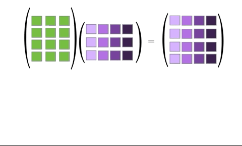
<p class="caption">(\#fig:multlincombanim)(ref:matvecprodlincombanim)</p>
</div>

#### Multiplication by a Diagonal Matrix
 
 As we will see in the next example, multiplication by a diagonal matrix causes a very specific effect on a matrix.

:::{.example name='Multiplication by a Diagonal Matrix' #diagmult}
 Compute the following matrix product and comment on what you find in the results:
 $$\D=\left(\begin{matrix} 2&0&0\\0&3&0\\0&0&-2 \end{matrix}\right) \mathbf{A}= \left(\begin{matrix} 1&2&3\\1&1&2\\2&1&3 \end{matrix}\right)$$
 $$\D\mathbf{A}=\left(\begin{matrix} 2&4&6\\3&3&6\\-4&-2&-6 \end{matrix}\right)$$
 In doing this multiplication, we see that the effect of multiplying the matrix $\mathbf{A}$ by a diagonal matrix on the left is that the rows of the matrix $\mathbf{A}$ are simply scaled by the entries in the diagonal matrix. You should work this computation out by hand to convince yourself that this effect will happen every time. Diagonal scaling can be important, and from now on when you see a matrix product like $\D\mathbf{A}$ where $\D$ is diagonal, you should automatically put together that the result is just a row-scaled version of $\mathbf{A}$.
:::
 
:::{.exercise name='Multiplication by a Diagonal Matrix' #diagmultexer}
 What happens if we were to compute the product from Example \@ref(exm:diagmult) in the reversed order, with the diagonal matrix on the right: $\mathbf{A}\D?$
 <br>
 Would we expect the same result? Is multiplication by a diagonal matrix commutative? Work out the calculation and comment on what you've found.
:::

## Vector Outer Products

Whereas inner products were the product of a row vector with a column vector (think $\x^T\y$),  **outer products**  are the product of a *column* vector with a *row* vector (think $\x\y^T$).
Let's first consider the dimensions of the outcome:

$$\underset{(m\times \red{1})}{\x} \underset{(\red{1} \times n)}{\y^T} = \bo{M}_{m\times n}$$

So the result is a matrix! We'll want to treat this product in the same way we treat any matrix product, by multiplying row $\times$ column until we've run out of rows and columns. Let's take a look at an example:

:::{.example name='Vector Outer Product' #outerprod}
Let $\x = \left(\begin{matrix} 3\\4\\-2 \end{matrix}\right)$ and $\y=\left(\begin{matrix} 1\\5\\3 \end{matrix}\right)$. Then,
$$\x\y^T = \left(\begin{matrix} \red{3}\\4\\-2 \end{matrix}\right) \left(\begin{matrix} \red{1}&5&3 \end{matrix}\right) = \left(\begin{matrix} \red{3}&15&9\\4&20&12\\-2&-10&-3\end{matrix}\right)$$
As you can see by performing this calculation, a vector outer product will _always_ produce a matrix whose rows are multiples of each other!
:::

## The Identity and the Matrix Inverse

The *identity matrix*, introduced in Section \@ref(special), is to matrices as the number `1' is to scalars. It is the **multiplicative identity**. For any matrix (or vector) $\mathbf{A}$, multiplying $\mathbf{A}$ by the identity matrix on either side does not change $\mathbf{A}$:
\begin{align*}
\mathbf{A}\I&=\mathbf{A} \\
\I\mathbf{A} &= \mathbf{A} 
\end{align*}

This fact is easy to verify in light of Example \@ref(exm:diagmult). Since the identity is simply a diagonal matrix with ones on the diagonal, when we multiply it by any matrix it merely scales each row or column of that matrix by 1.  The size of the identity matrix is generally implied in context. If $\mathbf{A}$ is $m\times n$ then writing $\mathbf{A}\I$ implies that $\I$ is $n \times n$, where as writing $\I\mathbf{A}$ implies $\I$ is $m\times m$.

For *certain* square matrices $\mathbf{A}$, an inverse matrix, written $\mathbf{A}^{-1}$, exists such that
$$\mathbf{A}\mathbf{A}^{-1} = \I$$
$$\mathbf{A}^{-1}\mathbf{A} = \I$$
It is very important to understand that not all matrices have inverses. There are 2 very important conditions that must be satisfied:
\begin{itemize}
\item The matrix $\mathbf{A}$ must be square
\item The matrix $\mathbf{A}$ must be full-rank. 
\end{itemize}

We have not yet discussed the notion of matrix rank, so the present discussion is aimed only at defining the concept of a matrix inverse rather than defining when it exists or how it is determined. For now, we want to see the analogy of the matrix inverse to our previous understanding of scalar algebra. Recall that the inverse of a non-zero scalar number is its reciprocal:
$$a^{-1} = \frac{1}{a}$$
Multiplying a scalar by its inverse yields the multiplicative identity, 1:
$$(a)(a^{-1}) = (a)(\frac{1}{a}) = 1$$
All scalars have an inverse with the exception of 0. For matrices, the idea of an inverse is quite the same - multiply a matrix on the left or right by its inverse to get the multiplicative identity, $\I$. However, as previously stated, the matrix inverse only exists for a small subset of matrices, those that are square and full rank. Such matrices are equivalently called **invertible** or **non-singular**. 


(ref:canceltitle) Don't Cancel That!!

:::{.example name='(ref:canceltitle)' #dontcancel}
We must be careful in linear algebra to remember the basics and not confuse our equations with scalar equations. When we see an equation like
$$\mathbf{A}\x=\lambda\x$$
We <font-color:red><strong> CANNOT </strong> <font-color:black>cancel terms from both sides. Mathematically, this operation amounts to multiplying both sides by an inverse. When the term we are canceling is a non-zero scalar, then we can proceed as usual. However, we must be careful not to assume that a matrix/vector quantity has an inverse. For example, the following operation is **nonsense:** 
$$\require{cancel}$$ 
$$\mathbf{A}\cancel{\mathbf{x}}=\lambda \cancel{\mathbf{x}}$$
Note that, while this equation made sense to begin with, after erroneously canceling terms, it no longer makes sense as it equates a matrix, $\mathbf{A}$, with a scalar, $\lambda$.
:::


## Exercises
<ol>
<li> On a coordinate plane, draw the vectors $\a = \left(\begin{matrix} 1\\2\end{matrix}\right)$ and $\b=\left(\begin{matrix} 0\\1\end{matrix}\right)$ and then draw $\bo{c}=\a+\b$. Make dotted lines which illustrate how the point/vector $\bo{c}$ can be reached by connecting the vectors a and b "tail-to-head".
<li> Use the following vectors to answer the questions:
$$
\v=\left(\begin{matrix} 6\\-1\end{matrix}\right) \quad \bo{u}=\left(\begin{matrix} -2\\1\end{matrix}\right) \quad \x=\left(\begin{matrix} 4\\2\\1\end{matrix}\right) \quad \y=\left(\begin{matrix}-1\\-2\\-3\end{matrix}\right) \quad \e=\left(\begin{matrix} 1\\1\\1\end{matrix}\right)
$$
  <ol style="list-style-type:lower-alpha">
      <li> Compute the following linear combinations, if possible:
        <ol style="list-style-type:lower-roman">
          <li> $2\u+3\v=$ 
          <li> $\x-2\y+\e=$ 
          <li> $-2\u-\v+\e=$ 
          <li> $\u+\e=$
        </ol>  
        
<li> Compute the following inner products, if possible:
  <ol style="list-style-type:lower-roman">
    <li> $\u^T\v=$ 
    <li> $\x^T\x=$ 
    <li> $\e^T\y=$ 
    <li> $\x^T\u=$
    <li> $\x^T\e=$ 
    <li> $\y^T\e=$
    <li> $\v^T\x=$ 
    <li> $\e^T\v=$  
</ol>  
<li> What happens when you take the inner product of a vector with $\e$?   
<li> What happens when you take the inner product of a vector with itself (as in $\x^T\x$)?  
</ol>  
<li> Use the following matrices to answer the questions:
$$\mathbf{A}=\left(\begin{matrix} 1&3&8\\3&0&-2\\8&-2&-3 \end{matrix}\right) \quad \bo{M}=\left(\begin{matrix} 1&8&-2&5\\2&8&1&7 \end{matrix}\right) \quad 
\D = \left(\begin{matrix} 1&0&0\\0&5&0\\0&0&3\end{matrix}\right) $$ 
$$
\bo{H}=\left(\begin{matrix} 2&-1\\1&3 \end{matrix}\right) \quad \bo{W}=\left(\begin{matrix} 1&1&1&1\\2&2&2&2\\3&3&3&3\end{matrix}\right)
$$
<ol style="list-style-type:lower-alpha">
<li> Circle the matrix products that are possible and specify their resulting dimensions:
<ol style="list-style-type:lower-roman">
  <li> $\mathbf{A}\M$ 
  <li> $\mathbf{A}\bo{W}$ 
  <li> $\bo{W}\D$
  <li> $\bo{W}^T\D$
  <li> $\bo{H}\M$
  <li> $\bo{M}\bo{H}$
  <li> $\bo{M}^T\bo{H}^T$
  <li> $\D\bo{W}$  
</ol>  
<li> Compute the following matrix products:  
    
$$\bo{H}\M\quad \mbox{and} \quad \mathbf{A}\D$$
<li> From the previous computation, $\mathbf{A}\D$, do you notice anything interesting about multiplying a matrix by a diagonal matrix on the right? Can you generalize what happens in words? (*Hint:* see Example \@ref(exm:diagmult) and Exercise \@ref(exr:diagmultexer).  
</ol>  
<li> Is matrix multiplication commutative?
<li> **Different Views of Matrix Multiplication:** Consider the matrix product 
$\mathbf{A}\mathbf{B}$ where $$\mathbf{A} = \left(\begin{matrix} 1 & 2\\3&4 \end{matrix}\right) \quad \mathbf{B} = \left(\begin{matrix} 2&5\\1&3\end{matrix}\right)$$
Let $\C=\mathbf{A}\mathbf{B}$.
<ol style="list-style-type:lower-roman">
<li> Compute the matrix product $\C$.
<li> Compute the matrix-vector product $\mathbf{A}\mathbf{B}_{\star 1}$ and show that this is the first column of $\C$. (Likewise, $\mathbf{A}\mathbf{B}_{\star 2}$ is the second column of $\C$.) (_Matrix multiplication can be viewed as a collection of matrix-vector products._)
<li> Compute the two outer products using columns of $\mathbf{A}$ and rows of $\mathbf{B}$ and show that
$$\acol{1}\brow{1} + \acol{2}\brow{2} = \C$$ (_Matrix multiplication can be viewed as the sum of outer products._)
<li> Since $\mathbf{A}\mathbf{B}_{\star 1}$ is the first column of $\C$, show how $\C_{\star 1}$ can be written as a linear combination of columns of $\mathbf{A}$. (_Matrix multiplication can be viewed as a collection of linear combinations of columns of the first matrix._)
<li> Finally, note that $\arow{1}\mathbf{B}$ will give the first row of $\C$. (_This amounts to a linear combination of rows - can you see that?_)
</ol>
</ol>

## List of Key Terms {-}

- addition
- subtraction
- equal matrices
- scalar multiplication
- inner product
- matrix product
- linear combination
- outer product
- multiplicative identity
- matrix inverse


<!--chapter:end:015-mult.Rmd-->

# Applications of Matrix Multiplication {#multapp}

As we will begin to see here, matrix multiplication has a number of uses in data modeling and problem solving. It expresses a rather large number of operations in a surprisingly compact way. The more comfortable we can be with this compact notation and what it entails, the more understanding we can have with analytical tools like Principal Components Analysis, Factor Analysis, Markov Chains, and Optimization (to name a few).

## Systems of Equations

Matrix multiplication creates a __system of equations__, which is nothing more than a collection of equations  which hold true simultaneously. Suppose we take the matrix-vector product:
$$\A\x=\b$$
Where 
$$\A=\pm 1&2&3&1\\0&3&2&1\\1&1&1&4\mp \quad \x=\pm x_1\\x_2\\x_3\\x_4 \mp \quad \mbox{and} \quad \b=\pm 10\\15\\6\mp$$
Let's take a look at what happens when we write the equation $\A\x=\b$ the old-fashioned way, without matrices:
$$
\pm 1&2&3&1\\0&3&2&1\\1&1&1&4\mp\pm x_1\\x_2\\x_3\\x_4 \mp = \pm 10\\15\\6\mp 
$$
$$
\Longrightarrow\begin{cases}\begin{align}
x_1+2x_2+3x_3+x_4 = 10\\
3x_2+2x_3+x_4 = 15\\
x_1+x_2+x_3+4x_4 = 6\end{align}\end{cases}
$$

We get a system of three equations. In general, a system of equations is nothing more than a matrix equation, $\A\x=\b$ where the matrix $\A$ contains the coefficients on the parameters you wish you find, $\x$ is a vector containing those unknown parameters and $\b$ is a vector containing the right hand sides of the equations. These systems of equations pop-up in all types of data applications from regression analysis to optimization. Let's consider a scenario which mimics the real-world and try to model it using a matrix-vector product.

:::{.example name='System of Equations' #syseq}
A large manufacturing company has recently signed a deal to manufacture trail mix for a well-known food label. This label makes 3 versions of its product - one for airlines, one for grocery stores, and one for gas stations. Each version has a different mixture of peanuts, raisins, and chocolate which serves as the base of the trail mix. The base mixtures are made in 15 kg batches and sent to a second building for packaging. 

The following table contains the information about the mixes, each row containing the recipe for a 15 kg batch. There is also some additional information on the costs of the ingredients, the price the manufacturer can charge for the mixtures and the amount of storage allocated for each ingredient.

| |Raisins <br> (kg/batch)| Peanuts <br> (kg/batch)|Chocolate <br>(kg/batch) | Sale Price<br>(\$/kg) |
|:-------------:|:------------:|:------------:|:--------------:|:-------------:|
| Airline (a) |7|6|2|4.99|
| Grocery (g) |2|5|8|6.50|
| Gas Station (s) |6|4|5|5.50|
 ---
|Storage (kg) | 380 | 500| 620| |
|Cost (\$/kg) | 2.55|4.65|4.80| |


__a. If the manufacturer wanted to use up all the ingredients in storage each day, how many batches of each mixture (airline, gas station, and grocery) should be made? __


We can gather from the table that 1 batch of the airline mixture contains 7 kgs of raisins. We want the total number of kgs of raisins from each of the 3 mixtures to match the storage capacity of raisins, which is 380 kg. We can set this up as a system of equations, one for each ingredient, where
\begin{eqnarray}
a&=&\mbox{batches of airline mixture}\\
g&=&\mbox{batches of grocery mixture}\\
s&=&\mbox{batches of gas station mixture}\\
a,g,s &\geq & 0 
\end{eqnarray}
as follows:
$$\begin{cases}\begin{eqnarray}
7 a+6 s+2g &=& 380 \quad \mbox{(Raisins)}\\
6 a+4 s+5g &=& 500 \quad \mbox{(Peanuts)}\\
2 a+5 s+8g &=& 620 \quad \mbox{(Chocolate)}\end{eqnarray}\end{cases}$$

We can then transform this system of equations into matrix form:
$$\pm 7&2&6\\6&5&4\\2&8&5 \mp \pm a\\g\\s \mp = \pm 380\\500\\620 \mp$$

While we haven't yet discussed how to solve such a system of equations, you can verify that 
$$a=20\,batches \quad g=60\,batches \quad s=20\,batches$$
is indeed a solution - in fact, it is the only possible solution. Determining solutions such as this, and establishing that they are unique (i.e. that they are the _only_ possible solution) is one of the many tools that the study of linear algebra will provide.


__b. Use matrix-vector multiplication to determine how much it costs the manufacturer to produce 1 batch of each mixture
__


For 1 batch of airline mixture, the manufacturer will spend $$7 kg\times \$2.55/kg = \$17.85\,\,\mbox{ on raisins.}$$

Of course, we need to add in the cost of peanuts and chocolate and then repeat this calculation for both grocery and gas station mixtures.

This is conveniently done in one matrix-vector multiplication:
$$\pm 7&6&2\\2&5&8 \\6&4&5 \mp \pm 2.55\\4.65\\4.80 \mp = \pm 55.35\\66.75\\57.90\mp$$
Thus, the cost of 1 batch of each type of mixture is:


|Mixture | Cost (\$/batch)|
|:--------|:--------:|
|airline | 55.35    |
|grocery | 66.75    |
|gas station | 57.90|

:::


### _Big_ Systems of Equations

When we expand our minds to the possibilities associated with matrix-matrix products, the systems that we can generate get very large very quickly.

For example, let's consider a $2\times 2$ example, $$\A\X=\B$$ where $$\A=\pm 2&3\\1&4 \mp \qquad \X=\pm x_{11} & x_{12} \\x_{21} & x_{22} \mp \qquad \B=\pm 7 & 6 \\ 5& 9 \mp$$

Let's take a look at what the simple equation $\A\X=\B$ is really saying in terms of all the matrix values that we have. All we have to do is write out the multiplication "the long way". For example, to get the element in the first row and first column of $\B$ (in this case, 7) we would compute the inner product of the first row of $\A$ with the first column of $\X$:

$$\pm 2 & 3 \mp \pm x_{11} \\ x_{21} \mp = \red{2x_{11}+3x_{21} = 7}$$

Now the equation in red above is just one of 4. We have one equation for each element of $\B$!. Let's make sure we understand how to get all 4 of these equations:
\begin{eqnarray}
2x_{11}+3x_{21} &=& 7 \\
2x_{12}+3x_{22} &=&6\\
1x_{11}+4x_{21} &=& 5 \\
1x_{12}+4x_{22} &=&9\\
\end{eqnarray}

Now, a list of 4 equations does not seem that big. But what if the dimensions of the matrix $\B$ were $9\times10$? By now you should be able to see that we'd have a system of 90 equations! The number of equations generated will always equal the number of elements in the right hand side matrix $\B$.


## Regression Analysis

In statistics, the solution to these systems of equations is exactly what we are trying to find when we do regression analysis. Take, for example, a regression analysis with some dependent variable, $\y$, and two independent variables, $\h,\w$. The preliminary goal of this analysis is to find unknown parameters $\beta_0, \beta_1, \dots$ such that
\begin{equation}
\y= \beta_0+\beta_1\h+\beta_2\w
 (\#eq:hwmodel)
\end{equation}

This is the single equation we usually consider when talking about regression analysis - but what about all those data points? Suppose, for simplicity, we have only 4 observations as listed in the following table:


|$\h$|$\w$|$\y$ |
|:---:|:---:|:---:|
|3|3|6|
|2|3|6|
|5|6|10|
|6|5|9|


When we write the model from Equation \@ref(eq:hwmodel), what we are really saying is that the equation holds true for each of the 4 observations in our dataset. So rather than 1 single equation, what we really have here is 4 equations - 1 for each observation:

\begin{eqnarray}
\beta_0 + 3 \beta_1 + 3 \beta_2 &=& 6 \quad \mbox{(obs. 1)}\\
\beta_0 + 2 \beta_1 + 3 \beta_2 &=& 6 \quad \mbox{(obs. 2)}\\
\beta_0 + 5 \beta_1 + 6 \beta_2 &=& 10 \,\,\, \mbox{(obs. 3)}\\
\beta_0 + 6 \beta_1 + 5 \beta_2 &=& 9 \quad \mbox{(obs. 4)}\\
\end{eqnarray}

Rather than writing all these equations out, we instead represent the situation in matrix format as 
$$\X\bbeta = \y,$$
Where
$$\X=\pm 1&3&3\\1&2&3\\1&5&6\\1&6&5 \mp \quad \bbeta = \pm \beta_0 \\\beta_1 \\ \beta_2 \mp \quad \mbox{and}\quad \y = \pm 6 \\6 \\10\\9\mp$$

We know from our experiences with data that this situation will not have an exact solution: our data does not fall exactly on some straight line or surface. Instead, we have to consider some error, $\boldsymbol\epsilon$ and try to minimize it:
$$\X\bbeta + \boldsymbol\epsilon = \y,$$
where 
$$\boldsymbol\epsilon = \pm \epsilon_1 \\ \epsilon_2 \\ \epsilon_3 \\ \epsilon_4 \mp$$ is a vector containing the _residuals._ We will get into the exact details of this shortly, but for now it is important that we see how to set up the regression equation in terms of matrices and vectors. The typical regression equation with the intercept will always involve adding a column of 1's to the matrix of independent variables, as seen in the previous example.

## Linear Combinations

Let's revisit the second part of Example \@ref(exm:syseq), where the task was to use matrix-vector multiplication to determine how much it would cost for the manufacturer to produce 1 batch of each mixture.

Essentially what we want to do is take a linear combination of the amounts of raisins, peanuts, and chocolate where the scalar weights are the cost of each ingredient:
$$\bordermatrix{~& \mbox{Cost of 1kg}}{}{\begin{pmatrix}\mbox{airline}\\ \mbox{grocery}\\ \mbox{gas station} \end{pmatrix}} = \$2.55 \bordermatrix{~& raisins}{}{ \begin{pmatrix} 7\\ 2\\ 6\end{pmatrix}} + \$4.65 \bordermatrix{~& peanuts}{}{ \begin{pmatrix} 6\\ 5\\ 4\end{pmatrix}}  + \$4.80 \bordermatrix{~& chocolate}{}{ \begin{pmatrix} 2\\ 8\\ 5\end{pmatrix}}$$
This linear combination is exactly the same as the matrix-vector product originally used:
$$\pm 7&6&2\\2&5&8 \\6&4&5 \mp \pm 2.55\\4.65\\4.80 \mp = \pm 55.35\\66.75\\57.90\mp$$

Matrix multiplication is nothing more than a series of linear combinations. Let's develop another quick example.

:::{.example name='Linear Combinations of Variables' #lincombvar}
Suppose we have data for 100 postal packages using 3 variables: height $\bo{h}$, weight $\bo{w}$, and volume $\bo{v}$. If we create a data matrix, $\X$, the size of the matrix will be $100\times 3$ and the three columns will be composed of the variables height, weight, and volume. The previous sentence is written mathematically by creating a partitioned matrix:
$$\X = \left( \bo{h} | \bo{w} | \v \right)$$

If we wanted to create a new variable vector, $\bo{c}$, which equaled the height plus twice the weight of the package, we'd want to compute the following linear combination:
$$\bo{c} = \bo{h} + 2\bo{w} + 0\v$$

This could be accomplished by multiplying our whole data matrix by the vector $\pm 1\\2\\0\mp$.

\begin{eqnarray*}
\bo{c}&=&\underset{(100\times 3)}{\X}\pm 1\\2\\0\mp \cr
&=&\left( \bo{h} | \bo{w} | \v \right)\pm 1\\2\\0\mp \cr
&=& \bo{h} + 2\bo{w} + 0\v
\end{eqnarray*}

If this example confuses you, you ought to write out a smaller matrix of values for the three variables, height, weight and volume. Write down 3 observations or so and see how the linear combination of these columns is precisely the same as the matrix-vector product. Being able to think of these two ideas as interchangeable will be fundamental when we start talking about factor analysis and principal components analysis.
:::


If we dissect our formula for a system of linear equations, $\A\x=\bo{b}$, we will find that the right-hand side vector $\bo{b}$ can be expressed as a linear combination of the columns in the coefficient matrix, $\A$.

\begin{eqnarray*}
\bo{b}&=& \A\x\\
\bo{b}&=& (\A_1|\A_2|\dots|\A_n)\pm x_1\\x_2\\ \vdots\\x_3 \mp  \\
\bo{b}&=& x_1\A_1 + x_2\A_2 + \dots + x_n\A_n 
\end{eqnarray*}
A concrete example of this expression is given in Example \@ref(exm:lincom).

:::{.example name='Systems of Equations as Linear Combinations' #lincom}
Consider the following system of equations:
\begin{eqnarray}
3x_1 + 2x_2 + 9x_3 &=& 1\\
4x_1 + 2x_2 + 3x_3 &=& 5\\
2x_1 + 7x_2 + \,x_3 &=& 0
\end{eqnarray}
We can write this as a matrix vector product $\A\x=\bo{b}$ where
$$\A=\pm 3 & 2 & 9\\4 & 2 & 3\\2 &7&1\mp \,\,\,\x=\pm x_1\\x_2\\x_3\mp \mbox{   and   } \bo{b}=\pm 1\\5\\0 \mp$$
We can also write $\bo{b}$ as a linear combination of columns of $\A$:
$$x_1 \pm 3\\4\\2 \mp +x_2 \pm 2\\2\\7\mp + x_3 \pm9\\3\\1 \mp = \pm 1\\5\\0 \mp$$
:::


Similarly, if we have a matrix-matrix product, we can write each column of the result as a linear combination of columns of the first matrix. Let $\A_{m\times n}$, $\X_{n\times p}$, and $\B_{m\times p}$ be matrices. If we have $\A\X=\B$ then
$$
(\A_1 | \A_2 | \dots | \A_n) \pm x_{11} & x_{12} & \dots & x_{1p} \\x_{21} & x_{22} & \dots & x_{2n}\\ \vdots & \vdots & \ddots & \vdots \\ x_{n1} & x_{n2}&\dots &x_{np} \mp = (\B_1 | \B_2 | \dots | \B_n) 
$$

and we can write 
$$\B_j = \A\X_j = x_{1j}\A_1 + x_{2j}\A_2 + x_{3j}\A_3 + \dots + x_{nj}\A_n.$$
A concrete example of this expression is given in Example \@ref(exm:matmat).

:::{.example name='Linear Combinations in Matrix-Matrix Products' #matmat}
Suppose we have the following matrix formula:
$$\A\X=\B$$
Where $\A=\pm 2 & 1 & 3\\1 & 4 & 2\\ 3 & 2 & 1 \mp$, $\X=\pm 5&6\\9&5\\7&8 \mp$. 
Then 
\begin{eqnarray}
\B &=&\pm 2 & 1 & 3\\1 & 4 & 2\\ 3 & 2 & 1 \mp \pm 5&6\\9&5\\7&8 \mp \\
~	&=& \pm 2(5)+1(9)+3(7)&2(6) +1(5)+3(8)\\1(5)+4(9)+2(7)&1(6)+4(5)+2(8)\\3(5)+2(9)+1(7)&3(6)+2(5)+1(8) \mp 
\end{eqnarray}
and we can immediately notice that the columns of $\B$ are linear combinations of columns of $\A$:
$$\B_1 = 5\pm 2\\1\\3\mp+9\pm 1\\4\\2 \mp + 7 \pm 3\\2\\1 \mp$$
$$\B_2 = 6\pm 2\\1\\3\mp+5\pm 1\\4\\2 \mp + 8 \pm 3\\2\\1 \mp$$

We may also notice that the _rows_ of $\B$ can be expressed as a linear combination of _rows_ of $\X$:

$$\B_{1\star} = 2\pm 5& 6 \mp +  1\pm 9& 5 \mp + 3\pm 7& 8 \mp $$
$$\B_{2\star} = 1\pm 5& 6 \mp +  4\pm 9& 5 \mp + 2\pm 7& 8 \mp $$
$$\B_{3\star} = 3\pm 5& 6 \mp +  2\pm 9& 5 \mp + 1\pm 7& 8 \mp $$

Linear combinations are everywhere, and they can provide subtle but important meaning in the sense that they can break data down into a sum of parts. 

You should convince yourself of one final view of matrix multiplication, as the _sum of outer products_. In this case $\B$ is the sum of 3 outer products (3 matrices of rank 1) involving the columns of $\A$ and corresponding rows of $\X$:
$$\B=\acol{1}\X_{1\star}+\acol{2}\X_{2\star}+\acol{3}\X_{3\star}.$$
:::

Example \@ref(exm:matmat) turns out to have important implications for our interpretation of matrix factorizations. In this context we'd call $\A\X$ a _factorization_ of the matrix $\B$. We will see how to use these expressions to our advantage in later chapters. 

## Exercises {#multapp-ex}
<ol type='1'>
<li>  A florist offers three sizes of flower arrangements (small, medium, large) containing three types of flowers (roses, daisies, and chrysanthemums). The number of each type of flower in each size arrangement is given in the table below, along with the selling price of each arrangement and the cost of each individual flower.

<table>
<tr>
<td style="text-align: center"> <td style="text-align: center"> __Roses__ <td style="text-align: center"> __Daisies__ <td style="text-align: center"> __Chrys.__ <td style="text-align: center"> __Price__</td>
<tr>
<td >Small  <td style="text-align: center"> 1 <td style="text-align: center"> 3 <td style="text-align: center"> 3<td style="text-align: center"> \$10</td>
<tr>
<td >Medium <td style="text-align: center">  2<td style="text-align: center">  4<td style="text-align: center"> 6<td style="text-align: center">\$15 </td>
<tr>
<td>Large  <td style="text-align: center">  4<td style="text-align: center">  8<td style="text-align: center">6 <td style="text-align: center"> \$20</td>
<tr >
<td style="border-top: double">Cost   <td style="text-align: center; border-top: double">  \$0.50 <td style="text-align: center; border-top: double"> \$0.25 <td style="text-align: center; border-top: double"> \$0.10 <td style="text-align: center; border-top: double"> </td>
</tr>
</table>


Let $$\A = \pm 1 &3 & 3\\2& 4& 6\\4& 8&6 \mp \quad \bo{p}= \pm 10\\15\\20 \mp \quad \bo{c} = \pm 0.50\\0.25\\0.10 \mp.$$
  <ol type='a'>
    <li> Determine the matrix-vector product that produces a vector, $\y$ which gives the total cost of creating       each size arrangement (small, medium, and large).
    <li> Suppose that an order came in for 2 small arrangements and 2 large arrangements. Let $$\bo{v} = \pm 2\\0\\2 \mp$$
Using matrix arithmetic (and writing out the formula) determine both the price of this order and the total profit to the florist. </ol>


<li> Write the following system of equations as a matrix-vector product $\A\x=\b$:
\begin{eqnarray}
2x_2 +3x_3&=& 8,
2x_1+3x_2+1x_3 &=& 5,
x_1-x_2-2x_3 &=&-5
\end{eqnarray}


<li> A model is being developed to predict a student's SAT score based upon some numeric attributes. The data being used for this model is provided below:

|Observation | PSAT score | Mother's SAT score | SAT Score |
|:----------:|:----------:|:------------------:|:---------:|
|1|1600|1700|1750|
|2|1800|1250|1750|
|3|1750|1300|1600|
|4|1200|1800|1450|
|5|1350|1950|1500|


If our regression model is
$$SAT\_score = \beta_0 + \beta_1* PSAT\_score + \beta_2* Mothers\_SAT\_Score + \epsilon$$
Show how we'd set up the underlying matrix equation for regression analysis,
$$\y = \X\bbeta $$
by defining the matrices/vectors $\X, \bbeta, \mbox{ and } \y$.


<li> Suppose a company collected daily data regarding the sales and revenue of particular products for which prices fluctuate daily:


<table>
  <tr>
    <td></td>
    <td colspan="2" style="text-align: center">Monday</td>
    <td colspan="2" style="text-align: center">Tuesday</td>
    <td colspan="2" style="text-align: center">Wednesday</td>
    <td colspan="2" style="text-align: center">Thursday</td>
    <td colspan="2" style="text-align: center">Friday</td>
  </tr>
  <tr>
    <td>Product</td>
    <td style="text-align: center">Sales</td>
    <td style="text-align: center">Rev.</td>
    <td style="text-align: center">Sales</td>
    <td style="text-align: center">Rev.</td>
    <td style="text-align: center">Sales</td>
    <td style="text-align: center">Rev.</td>
    <td style="text-align: center">Sales</td>
    <td style="text-align: center">Rev.</td>
    <td style="text-align: center">Sales</td>
    <td style="text-align: center">Rev.</td>
  </tr>
  <tr>
  <td>Widgets <td style="text-align: center"> 1 <td style="text-align: center"> 195 <td style="text-align: center"> 5 <td style="text-align: center"> 945 <td style="text-align: center"> 2 <td style="text-align: center"> 400<td style="text-align: center"> 2 <td style="text-align: center"> 450<td style="text-align: center"> 5 <td style="text-align: center"> 790</td>
  </tr>
  <tr>
  <td>Gadgets <td style="text-align: center"> 35 <td style="text-align: center"> 350 <td style="text-align: center"> 13 <td style="text-align: center"> 110 <td style="text-align: center"> 25 <td style="text-align: center"> 300 <td style="text-align: center"> 45 <td style="text-align: center"> 497 <td style="text-align: center"> 90 <td style="text-align: center"> 789 </td>
  </tr>
</table>

<ol style="list-style-type:lower-alpha">
  <li>  Show how you could use matrix addition to compute the total weekly sales and revenue of each product.
  <li>  Now suppose you find out that both the sales and the revenue numbers in the table above were listed in hundreds (i.e. that 100 widgets were sold on Monday, bringing in \$19,500 in revenue). Using your answer from part a. show how you would use scalar multiplication to represent the exact weekly numbers for revenue and units sold.
</ol>
<li> Let 

$$\A=\pm 3 & 2 & 9\\4 & 2 & 3\\2 &7&1\mp \quad$$


<li> For a general matrix $\A_{m\times n}$ describe what the following products will provide.  Also give the size of the result (i.e. "$n\times 1$ vector" or "scalar").
<ol style="list-style-type:lower-alpha">
  <li> $\A\e_j$  
  <li> $\e_i^T\A$  
  <li> $\e_i^T\A\e_j$  
  <li> $\A\e$  
  <li> $\e^T\A$  
  <li>  $\frac{1}{n}\e^T\A$  
</ol>
<li> Let $\bo{D}_{n\times n}$ be a diagonal matrix with diagonal elements $D_{ii}$. What effect does multiplying a matrix $\A_{n\times m}$ on the left by $\bo{D}$ have? What effect does multiplying a matrix $\A_{m\times n}$ on the right by $\bo{D}$ have? If you cannot see this effect in a general sense, try writing out a simple $3\times 3$ matrix as an example first.


</ol>

<!--chapter:end:016-multapp.Rmd-->

# R Programming Basics

Before we get started, you will need to know the basics of matrix manipulation in the R programming language:

- Generally matrices are entered in as one vector, which R then breaks apart into rows and columns in they way that you specify (with nrow/ncol). The default way that R reads a vector into a matrix is down the columns. To read the data in across the rows, use the byrow=TRUE option). This is only relevant if you're entering matrices from scratch.


```r
Y=matrix(c(1,2,3,4),nrow=2,ncol=2)
Y
```

```
##      [,1] [,2]
## [1,]    1    3
## [2,]    2    4
```

```r
X=matrix(c(1,2,3,4),nrow=2,ncol=2,byrow=TRUE)
X
```

```
##      [,1] [,2]
## [1,]    1    2
## [2,]    3    4
```

- The standard multiplication symbol, '\*', will unfortunately provide unexpected results if you are looking for matrix multiplication. '\*' will multiply matrices _elementwise_.  In order to do matrix multiplication, the function is '%\*%'.


```r
X*X
```

```
##      [,1] [,2]
## [1,]    1    4
## [2,]    9   16
```

```r
X%*%X
```

```
##      [,1] [,2]
## [1,]    7   10
## [2,]   15   22
```

- To transpose a matrix or a vector $\X$, use the function t($\X$).

```r
t(X)
```

```
##      [,1] [,2]
## [1,]    1    3
## [2,]    2    4
```

- R indexes vectors and matrices starting with $i=1$ (as opposed to $i=0$ in python).
- X[i,j] gives element $\X_{ij}$. You can alter individual elements this way.


```r
X[2,1]
```

```
## [1] 3
```

```r
X[2,1]=100
X
```

```
##      [,1] [,2]
## [1,]    1    2
## [2,]  100    4
```

- To create a vector of all ones, $\e$, use the ```  rep()``` function


```r
e=rep(1,5)
e
```

```
## [1] 1 1 1 1 1
```

- To compute the mean of a vector, use the mean function. To compute the column means of a matrix (or data frame), use the ```  colMeans() ```  function. You can also use the ``` apply``` function, which is necessary if you want column standard deviations (```  sd() ``` function). ```  apply(X,dim,function)``` applies the specified function to the specified dimension ```  dim``` (1 for rows, 2 for columns) of the matrix or data frame X.

```r
# Start by generating random ~N(0,1) data:
A=replicate(2,rnorm(5))
colMeans(A)
```

```
## [1]  0.07026611 -0.19105826
```

```r
# (Why aren't the means close to zero?)
A=replicate(2,rnorm(100))
colMeans(A)
```

```
## [1] -0.088383791  0.009258649
```

```r
#LawOfLargeNumbers.

apply(A,2,sd)
```

```
## [1] 0.9939934 1.0653783
```

```r
# To apply a "homemade function" you must create it as a function
# Here we apply a sum of squares function for the first 5 rows of A:
apply(A[1:5, ],1,function(x) x%*%x)
```

```
## [1] 0.5092665 0.7769321 1.2645749 6.6386635 1.1766071
```

```r
# Here we center the data by subtracting the mean vector:
B=apply(A,2,function(x) x-mean(x))
colMeans(B)
```

```
## [1]  2.373102e-17 -2.263814e-17
```

```r
# R doesn't tell you when things are zero to machine precision. "Machine zero" in
# R is given by the internal variable .Machine$double.eps
colMeans(B) < .Machine$double.eps
```

```
## [1] TRUE TRUE
```

- To invert a matrix, use the ```  solve()``` command.


```r
Xinv=solve(X)
X%*%Xinv
```

```
##      [,1] [,2]
## [1,]    1    0
## [2,]    0    1
```

- To determine size of a matrix, use the ```  dim()``` function. The result is a vector with two values: ```  dim(x)[1]``` provides the number of rows and ```  dim(x)[2]``` provides the number of columns. You can label rows/columns of a matrix using the ```  rownames()``` or ```  colnames()``` functions.


```r
dim(A)
```

```
## [1] 100   2
```

```r
nrows=dim(A)[1]
ncols=dim(A)[2]
colnames(A)=c("This","That")
A[1:5, ]
```

```
##            This       That
## [1,]  0.1200798  0.7034539
## [2,] -0.2004114  0.8583515
## [3,]  1.1020791 -0.2235993
## [4,]  0.8429696  2.4347620
## [5,] -0.9853639  0.4535032
```

- Most arithmetic functions you apply to a vector act elementwise. In R, $\x^2$ will be a vector containing the square of the elements in $\x$. You can add a column to a matrix (or a data frame) by using the ```  cbind()``` function.


```r
# Add a column containing the square of the second column
A=cbind(A,A[ ,2]^2)
colnames(A)
```

```
## [1] "This" "That" ""
```

```r
colnames(A)[3]="That Squared"
colnames(A)
```

```
## [1] "This"         "That"         "That Squared"
```

- You can compute vector norms using the ```  norm() ``` function. Unfortunately, the default norm is _not_ the $2$-norm (it should be!) so we must specify the ``` type="2" ``` as the second argument to the function.


```r
x=c(1,1,1)
y=c(1,0,0)
norm(x,type="2")
```

```
## [1] 1.732051
```

```r
# It's actually fewer characters to work from the equivalent definition:
sqrt(x%*%x)
```

```
##          [,1]
## [1,] 1.732051
```

```r
norm(y,type="2")
```

```
## [1] 1
```

```r
norm(x-y,type="2")
```

```
## [1] 1.414214
```

You'll learn many additional R techniques throughout this course, but our strategy in this text will be to pick them up as we go as opposed to trying to remember them from the beginning.


<!--chapter:end:018-Intro.Rmd-->

# Solving Systems of Equations {#solvesys}


In this section we will learn about solving the systems of equations that were presented in Chapter \@ref(multapp). There are three general situations we may find ourselves in when attempting to solve systems of equations:

1. The system could have one unique solution.
2. The system could have infinitely many solutions (sometimes called _underdetermined_).
3. The system could have no solutions (sometimes called _overdetermined_ or _inconsistent_).


Luckily, no matter what type of system we are dealing with, the method to arriving at the answer (should it exist) is the same. The process is called Gaussian (or Gauss-Jordan) Elimination.

## Gaussian Elimination

Gauss-Jordan Elimination is essentially the same process of elimination you may have used in an Algebra class in primary school. Suppose, for example, we have the following simple system of equations:
$$\begin{cases}\begin{eqnarray}
x_1+2x_2 &=& 11\\
x_1+x_2 &=& 6\end{eqnarray}\end{cases}$$

One simple way to solve this system of equations is to subtract the second equation from the first. By this we mean that we'd perform subtraction on the left hand and right hand sides of the equation:
$$\pm &x_1&+&2x_2 \\ -&(x_1&+&x_2) \\ \hline &&&x_2 \mp = \pm 11 \\-6\\\hline 5 \mp$$
This operation is clearly allowed because the two subtracted quantities are equal (by the very definition of an equation!). What we are left with is one much simpler equation, 
$$x_2=5$$
using this information, we can return to the first equation, substitute and solve for $x_1$:

$$\begin{eqnarray}
x_1+2(5)&=&11 \\
x_1 &=& 1
\end{eqnarray}$$

This final process of substitution is often called **back substitution.** Once we have a sufficient amount of information, we can use that information to substitute and solve for the remainder.

### Row Operations
In the previous example, we demonstrated one operation that can be performed on systems of equations without changing the solution: one equation can be added to a multiple of another (in that example, the multiple was -1). For any system of equations, there are 3 operations which will not change the solution set:

1. Interchanging the order of the equations.
2. Multiplying both sides of one equation by a constant.
3. Replace one equation by a linear combination of itself and of another equation.

Taking our simple system from the previous example, we'll examine these three operations concretely:

$$\begin{cases}\begin{eqnarray}
x_1+2x_2 &=& 11\\
x_1+x_2 &=& 6\end{eqnarray}\end{cases}$$

1. Interchanging the order of the equations.
<table style="width:auto; margin-left: auto; 
  margin-right: auto; border:none;" >
<tr>
<td style="text-align:center; vertical-align:center">
 \begin{cases}\begin{align}
x_1+2x_2 &= 11\\
x_1+x_2 &= 6\end{align}\end{cases}
<td style="text-align:center; vertical-align:center; width:10px">
 $\Leftrightarrow$ 
 <td style="text-align:center; vertical-align:center">
 \begin{cases}\begin{align}
x_1+x_2 =& 6\\
x_1+2x_2 =& 11\end{align}\end{cases}
</tr>
</table>
2. Multiplying both sides of one equation by a constant. _(Multiply the second equation by -1)_.
<table style="width:auto; margin-left: auto; 
  margin-right: auto; border:none;" >
<tr>
<td style="text-align:center; vertical-align:center">
\begin{cases}\begin{align}
x_1+2x_2 &=& 11\\
x_1+x_2 &=& 6\end{align}\end{cases}
<td style="text-align:center; vertical-align:center; width:10px">
 $\Leftrightarrow$ 
 <td style="text-align:center; vertical-align:center">
 \begin{cases}\begin{align}
x_1+2x_2 &=& 11\\
-1x_1-1x_2 &=& -6\end{align}\end{cases}
</tr>
</table>


3. Replace one equation by a linear combination of itself and of another equation. _(Replace the second equation by the first minus the second.)_
<table style="width:auto; margin-left: auto; 
  margin-right: auto; border:none;" >
<tr>
<td style="text-align:center; vertical-align:center">
\begin{cases}\begin{eqnarray}
x_1+2x_2 &=& 11\\
x_1+x_2 &=& 6\end{eqnarray}\end{cases}
<td style="text-align:center; vertical-align:center; width:10px">
 $\Leftrightarrow$ 
 <td style="text-align:center; vertical-align:center">
 \begin{cases}\begin{eqnarray}
x_1+2x_2 &=& 11\\
x_2 &=& 5\end{eqnarray}\end{cases}
</tr>
</table>

Using these 3 row operations, we can transform any system of equations into one that is _triangular_. A **triangular system** is one that can be solved by back substitution. For example,
$$\begin{cases}\begin{align}
x_1+2x_2 +3x_3= 14\\
x_2+x_3 =6\\
x_3 = 1\end{align}\end{cases}$$
is a triangular system. Using substitution, the second equation will give us the value for $x_2$, which will allow for further substitution into the first equation to solve for the value of $x_1$.  Let's take a look at an example of how we can transform any system to a triangular system.

:::{.example name='Transforming a System to a Triangular System via 3 Operations' #rowopeq}

Solve the following system of equations:
$$\begin{cases}\begin{eqnarray}
x_1+x_2 +x_3&=& 1\\
x_1-2x_2+2x_3 &=&4\\
x_1+2x_2-x_3 &=& 2\end{eqnarray}\end{cases}$$
To turn this into a triangular system, we will want to eliminate the variable $x_1$ from two of the equations. We can do this by taking the following operations:

a. Replace equation 2 with (equation 2 - equation 1).
b. Replace equation 3 with (equation 3 - equation 1).

Then, our system becomes:
$$\begin{cases}\begin{eqnarray}
x_1+x_2 +x_3&=& 1\\
-3x_2+x_3 &=&3\\
x_2-2x_3 &=& 1\end{eqnarray}\end{cases}$$

Next, we will want to eliminate the variable $x_2$ from the third equation. We can do this by replacing equation 3 with (equation 3 + $\frac{1}{3}$ equation 2). _However_, we can avoid dealing with fractions if instead we:

c.  Swap equations 2 and 3.

$$\begin{cases}\begin{eqnarray}
x_1+x_2 +x_3 &=& 1\\
x_2-2x_3  &=& 1\\
-3x_2+x_3  &=&3\end{eqnarray}\end{cases}$$

Now, as promised our math is a little simpler: 

d. Replace equation 3 with (equation 3 + 3*equation 2).

$$\begin{cases}\begin{eqnarray}
x_1+x_2 +x_3 &=& 1 \\
x_2-2x_3  &=& 1 \\
-5x_3  &=&6 \end{eqnarray}\end{cases}$$

Now that our system is in triangular form, we can use substitution to solve for all of the variables:
$$x_1 = 3.6 \quad x_2 = -1.4 \quad x_3 = -1.2 $$

This is the procedure for Gaussian Elimination, which we will now formalize in it's matrix version.
:::

### The Augmented Matrix

When solving systems of equations, we will commonly use the **augmented matrix**. 

:::{.definition name='The Augmented Matrix' #augmat}
The **augmented matrix** of a system of equations is simply the matrix which contains all of the coefficients of the equations, augmented with an extra column holding the values on the right hand sides of the equations. If our system is:

$$\begin{cases}\begin{eqnarray}
a_{11}x_1+a_{12}x_2 +a_{13}x_3&=& b_1
a_{21}x_1+a_{22}x_2 +a_{23}x_3&=& b_2
a_{31}x_1+a_{32}x_2 +a_{33}x_3&=&b_3 \end{eqnarray}\end{cases}$$

Then the corresponding augmented matrix is
$$\left(\begin{array}{rrr|r}
a_{11}&a_{12}&a_{13}& b_1\\
a_{21}&a_{22}&a_{23}& b_2\\
a_{31}&a_{12}&a_{33}& b_3\\
\end{array}\right)$$
:::

Using this augmented matrix, we can contain all of the information needed to perform the three operations outlined in the previous section. We will formalize these operations as they pertain to the rows (i.e. individual equations) of the augmented matrix (i.e. the entire system) in the following definition.

:::{.definition name='Row Operations for Gaussian Elimination' #rowops}
Gaussian Elimination is performed on the rows, $\arow{i},$ of an augmented matrix, $$\A = \pm \arow{1}\\\arow{2}\\\arow{3}\\\vdots\\\arow{m}\mp$$ by using the three **elementary row operations**:

1. Swap rows $i$ and $j$.
2. Replace row $i$ by a nonzero multiple of itself.
3. Replace row $i$ by a linear combination of itself plus a multiple of row $j$.


The ultimate goal of Gaussian elimination is to transform an augmented matrix into an **upper-triangular matrix** which allows for backsolving. 
$$\A \rightarrow \left(\begin{array}{rrrr|r}
 t_{11}& t_{12}& \dots& t_{1n}&c_1\cr 
								0& t_{22}& \dots& t_{2n}&c_2\cr
								\vdots& \vdots& \ddots& \vdots&\vdots\cr
								0& 0& \dots& t_{nn}&c_n\end{array}\right)$$
:::

 The key to this process at each step is to focus on one position, called the _pivot position_ or simply the _pivot_, and try to eliminate all terms below this position using the three row operations. Only nonzero numbers are allowed to be pivots. If a coefficient in a pivot position is ever 0, then the rows of the matrix should be interchanged to find a nonzero pivot. If this is not possible then we continue on to the next possible column where a pivot position can be created.

Let's now go through a detailed example of Gaussian elimination using the augmented matrix. We will use the same example (and same row operations) from the previous section to demonstrate the idea.

:::{.example name='Row Operations on the Augmented Matrix' #rowopmat}
We will solve the system of equations from Example \@ref(exm:rowopeq) using the Augmented Matrix.
\begin{equation*}\begin{cases}\begin{align}
x_1+x_2 +x_3= 1\\
x_1-2x_2+2x_3 =4\\
x_1+2x_2-x_3 = 2\end{align}\end{cases}
\end{equation*}

Our first step will be to write the augmented matrix and identify the current pivot. Here, a square is drawn around the pivot and the numbers below the pivot are circled. It is our goal to eliminate the circled numbers using the row with the pivot. 
\begin{equation*}
\left(\begin{array}{rrr|r}
 1 & 1 & 1 & 1\\
 1 & -2 & 2 &4\\
 1&2&-1 &2
\end{array}\right)
 \xrightarrow{Current Pivot}\left(\begin{array}{rrr|r}
 \fbox{1} & 1 & 1 & 1\\
\enclose{circle}[mathcolor="red"]{\color{black}{1}} & -2 & 2 &4\\
 \enclose{circle}[mathcolor="red"]{\color{black}{1}}&2&-1 &2
\end{array}\right)
\end{equation*}
We can eliminate the circled elements by making combinations with those rows and the pivot row. For instance, we'd replace row 2 by the combination (row 2 - row 1). Our shorthand notation for this will be R2' = R2-R1. Similarly we will replace row 3 in the next step.
\begin{equation*}
\xrightarrow{R2'=R2-R1}
  \left(\begin{array}{rrr|r}
 \fbox{1} & 1 & 1 & 1\\
\red{0} & \red{-3} & \red{1} &\red{3}\\
 \enclose{circle}[mathcolor="red"]{\color{black}{1}}&2&-1 &2
\end{array}\right)
 \xrightarrow{R3'=R3-R1} \left(\begin{array}{rrr|r}
 \fbox{1} & 1 & 1 & 1\\
0 & -3 & 1 &3\\
\red{0}&\red{1}&\red{-2}&\red{1}
\end{array}\right)
\end{equation*}
 
 Now that we have eliminated each of the circled elements below the current pivot, we will continue on to the next pivot, which is -3. Looking into the future, we can either do the operation $R3'=R3+\frac{1}{3}R2$ or we can interchange rows 2 and 3 to avoid fractions in our next calculation. To keep things neat, we will do the latter. (_note: either way you proceed will lead you to the same solution!_)
\begin{equation*} \xrightarrow{Next Pivot}
    \left(\begin{array}{rrr|r}
\fbox{1} & 1 & 1 & 1\\
0 & \fbox{-3} & 1 &3\\
0&\enclose{circle}[mathcolor="red"]{\color{black}{1}}&-2&1
\end{array}\right)
 \xrightarrow{R2 \leftrightarrow R3}      \left(\begin{array}{rrr|r}
 \fbox{1} & 1 & 1 & 1\\
 0&\fbox{1}&-2&1\\
0 & \enclose{circle}[mathcolor="red"]{\color{black}{-3}} & 1 &3
\end{array}\right)
\end{equation*}
Now that the current pivot is equal to 1, we can easily eliminate the circled entries below it by replacing rows with combinations using the pivot row. We finish the process once the last pivot is identified (the final pivot has no eliminations to make below it).
\begin{equation*}
 \xrightarrow{R3'=R3+3R2}
     \left(\begin{array}{rrr|r}
 \fbox{1} & 1 & 1 & 1\\
 0&\fbox{1}&-2&1\\
\red{0} & \red{0} & \red{\fbox{-5}} &\red{6}
\end{array}\right)
\end{equation*} 

At this point, when all the pivots have been reached, the augmented matrix is said to be in **row-echelon form**. This simply means that all of the entries below the pivots are equal to 0. The augmented matrix can be transformed back into equation form now that it is in a triangular form:

\begin{equation*}
\begin{cases}\begin{align}
x_1+x_2 +x_3= 1\\
x_2-2x_3 = 1\\
5x_3 =-6\end{align}\end{cases}
\end{equation*}
Which is the same system we finally solved in Example \@ref(exm:rowopeq) to get the final solution:
$$x_1 = 3.6 \quad x_2 = -1.4 \quad x_3 = -1.2 $$
:::
 
 
 
### Gaussian Elimination Summary

 Let's summarize the process of Gaussian elimination step-by-step:
<ol>
<li> We work from the upper-left-hand corner of the matrix to the lower-right-hand corner
<li> Focusing on the first column, identify the first pivot element. The first pivot element should be located in the first row (if this entry is zero, we must interchange rows so that it is non-zero). 
<li> Eliminate (zero-out) all elements below the pivot using the combination row operation.
<li> Determine the next pivot and go back to step 2.
<ul>
<li> Only nonzero numbers are allowed to be pivots. 
<li> If a coefficient in the next pivot position is 0, then the rows of the matrix should be interchanged to find a nonzero pivot. 
<li> If this is not possible then we continue on to the next column to determine a pivot.
</ul>
<li> When the entries below all of the pivots are equal to zero, the process stops. The augmented matrix is said to be in _row-echelon form_, which corresponds to a _triangular_ system of equations, suitable to solve using back substitution.
</ol>

:::{.exercise name='Gaussian Elimination and Back Substitution' #gaussianelim}
Use Gaussian Elimination and back substitution to solve the following system.
$$\begin{cases}\begin{align}
2x_1-x_2=1\\
-x_1+2x_2-x_3=0\\
-x_2+x_3=0\end{align}\end{cases}$$
\vspace{3cm}
:::
 
 

## Gauss-Jordan Elimination

 Gauss-Jordan elimination is Gaussian elimination taken one step further. In Gauss-Jordan elimination, we do not stop when the augmented matrix is in row-echelon form. Instead, we force all the pivot elements to equal 1 and we continue to eliminate entries _above_ the pivot elements to reach what's called **reduced row echelon form**.
 
 Let's take a look at another example:

:::{.example name='Gauss-Jordan elimination' #gaussjordan}
 We begin with a system of equations, and transform it into an augmented matrix:
 $$\begin{cases}\begin{align}
x_2 -x_3= 3\\
-2x_1+4x_2-x_3 = 1\\
-2x_1+5x_2-4x_3 =-2\end{align}\end{cases}
 \Longrightarrow \left(\begin{array}{rrr|r}0&1&-1&3\\-2&4&-1&1\\-2&5&-4&-2\end{array}\right) $$ 
 
We start by locating our first pivot element. This element cannot be zero, so we will have to swap rows to bring a non-zero element to the pivot position. 
$$\left(\begin{array}{rrr|r}0&1&-1&3\\-2&4&-1&1\\-2&5&-4&-2\end{array}\right) \xrightarrow{R1\leftrightarrow R2}
\left(\begin{array}{rrr|r}\fbox{-2}&4&-1&1\\0&1&-1&3\\-2&5&-4&-2\end{array}\right)$$
Now that we have a non-zero pivot, we will want to do two things: 
\begin{itemize}
\item Use the pivot to eliminate all of the elements below it (as with Gaussian elimination) \item Make the pivot element equal to 1.
\end{itemize}
It does not matter what order we perform these two tasks in. Here, we will have an easy time eliminating using the -2 pivot:
$$\left(\begin{array}{rrr|r}\fbox{-2}&4&-1&1\\0&1&-1&3\\-2&5&-4&-2\end{array}\right)\xrightarrow{R3'=R3-R1} \left(\begin{array}{rrr|r}\fbox{-2}&4&-1&1\\0&1&-1&3\\\red{0}&\red{1}&\red{-3}&\red{-3}\end{array}\right)$$
Now, as promised, we will make our pivot equal to 1.
$$\left(\begin{array}{rrr|r}\fbox{-2}&4&-1&1\\0&1&-1&3\\0&1&-3&-3\end{array}\right) \xrightarrow{R1'=-\frac{1}{2} R1} \left(\begin{array}{rrr|r}\red{\fbox{1}}&\red{-2}&\red{\frac{1}{2}}&\red{-\frac{1}{2}}\\0&1&-1&3\\0&1&-3&-3\end{array}\right)$$
We have finished our work with this pivot, and now we move on to the next one. Since it is already equal to 1, the only thing left to do is use it to eliminate the entries below it:
$$\left(\begin{array}{rrr|r}1&-2&\frac{1}{2}&-\frac{1}{2}\\0&\fbox{1}&-1&3\\0&1&-3&-3\end{array}\right)\xrightarrow{R3'=R3-R2} \left(\begin{array}{rrr|r}1&-2&\frac{1}{2}&-\frac{1}{2}\\0&\fbox{1}&-1&3\\\red{0}&\red{0}&\red{-2}&\red{-6}\end{array}\right)$$
And then we move onto our last pivot. This pivot has no entries below it to eliminate, so all we must do is turn it into a 1:
$$\left(\begin{array}{rrr|r}1&-2&\frac{1}{2}&\frac{-1}{2}\\0&1&-1&3\\0&0&\fbox{-2}&-6\end{array}\right)\xrightarrow{R3'=-\frac{1}{2}R3}\left(\begin{array}{rrr|r}1&-2&\frac{1}{2}&-\frac{1}{2}\\0&1&-1&3\\\red{0}&\red{0}&\red{\fbox{1}}&\red{3}\end{array}\right) $$
Now, what really differentiates Gauss-Jordan elimination from Gaussian elimination is the next few steps. Here, our goal will be to use the pivots to eliminate all of the entries _above_ them. While this takes a little extra work, as we will see, it helps us avoid the tedious work of back substitution.

We'll start at the southeast corner on the current pivot. We will use that pivot to eliminate the elements above it:

$$\left(\begin{array}{rrr|r} 1&-2&\frac{1}{2}&-\frac{1}{2}\\0&1&-1&3\\0&0&\fbox{1}&3\end{array}\right) \xrightarrow{R2'=R2+R3} \left(\begin{array}{rrr|r} 1&-2&\frac{1}{2}&-\frac{1}{2}\\\red{0}&\red{1}&\red{0}&\red{6}\\0&0&\fbox{1}&3\end{array}\right)$$

$$ \left(\begin{array}{rrr|r} 1&-2&\frac{1}{2}&-\frac{1}{2}\\0&1&0&6\\0&0&\fbox{1}&3\end{array}\right)\xrightarrow{R1'=R1-\frac{1}{2}R3}\left(\begin{array}{rrr|r} \red{1}&\red{-2}&\red{0}&\red{-2}\\0&1&0&6\\0&0&\fbox{1}&3\end{array}\right)$$
We're almost done! One more pivot with elements above it to be eliminated:

$$\left(\begin{array}{rrr|r} 1&-2&0&-2\\0&\fbox{1}&0&6\\0&0&1&3\end{array}\right) \xrightarrow{R1'=R1+2R2}
\left(\begin{array}{rrr|r}\red{1}&\red{0}&\red{0}&\red{10}\\0&\fbox{1}&0&6\\0&0&1&3\end{array}\right)$$

And we've reached **reduced row echelon form**. How does this help us? Well, let's transform back to a system of equations:
 $$\begin{cases}\begin{align}
x_1 = 10\\
x_2= 6\\
x_3 =3\end{align}\end{cases}$$
The solution is simply what's left in the right hand column of the augmented matrix.
:::

As you can see, the steps to performing Gaussian elimination and Gauss-Jordan elimination are very similar. Gauss-Jordan elimination is merely an extension of Gaussian elimination which brings the problem as close to completion as possible. 


### Gauss-Jordan Elimination Summary


1. Focusing on the first column, identify the first pivot element. The first pivot element should be located in the first row (if this entry is zero, we must interchange rows so that it is non-zero). Our goal will be to use this element to eliminate all of the elements below it.  
2. The pivot element should be equal to 1. If it is not, we simply multiply the row by a constant to make it equal 1 (or interchange rows, if possible).
3. Eliminate (zero-out) all elements below the pivot using the combination row operation.
4. Determine the next pivot and go back to step 2.
  - Only nonzero numbers are allowed to be pivots. If a coefficient in a pivot position is ever 0, then the rows of the matrix should be interchanged to find a nonzero pivot. If this is not possible then we continue on to the next possible column where a pivot position can be created.
5. When the last pivot is equal to 1, begin to eliminate all the entries above the pivot positions.
6. When all entries above and below each pivot element are equal to zero, the augmented matrix is said to be in _reduced row echelon form_ and the Gauss-Jordan elimination process is complete.

:::{.exercise name='Gauss-Jordan Elimination' #gaussjordanexer}
Use the Gauss-Jordan method to solve the following system:
$$\begin{cases}\begin{align}
4x_2-3x_3=3\\
-x_1+7x_2-5x_3=4\\
-x_1+8x_2-6x_3=5\end{align}\end{cases}$$

:::


## Three Types of Systems

 As was mentioned earlier, there are 3 situations that may arise when solving a system of equations:

-  The system could have one __unique solution__ (this is the situation of our examples thus far).
-  The system could have no solutions (sometimes called _overdetermined_ or ___inconsistent___).
-  The system could have __infinitely many solutions__ (sometimes called _underdetermined_).


### The Unique Solution Case {#uniquesol}

Based on our earlier examples, we already have a sense for systems which fall into the first case.

(ref:case1title) Case 1: Unique solution

:::{.theorem name='(ref:case1title)' #case1}
A system of equations $\A\x=\b$ has a unique solution if and only if _both_ of the following conditions hold:

1. The number of equations is equal to the number of variables (i.e. the coefficient matrix $\A$ is _square_).
2. The number of pivots is equal to the number of rows/columns. In other words, under Gauss-Jordan elimination, the coefficient matrix is transformed into the identity matrix:
$$\A \xrightarrow{Gauss-Jordan} I$$

In this case, we say that the matrix $\A$ is **invertible** because it is full-rank (the rank of a matrix is the number of pivots after Gauss-Jordan elimination) _and_ square. 
:::

### The Inconsistent Case {#inconsistent}

The second case scenario is a very specific one. In order for a system of equations to be **inconsistent** and have no solutions, it must be that after Gaussian elimination, a situation occurs where at least one equation reduces to $0=\alpha$ where $\alpha$ is  nonzero. Such a situation would look as follows (using asterisks to denote any nonzero numbers):

$$\left(\begin{array}{rrr|r} *&*&*&*\\0&*&*&*\\0&0&0&\alpha\end{array}\right) $$

The third row of this augmented system indicates that $$0x_1+0x_2+0x_3=\alpha$$ where $\alpha\neq 0$, which is a contradiction. When we reach such a situation through Gauss-Jordan elimination, we know the system is inconsistent.

:::{.example name='Identifying an Inconsistent System' #inconsistent}
$$\begin{cases}\begin{align}
x-y+z=1\\
x-y-z=2\\
x+y-z=3\\
x+y+z=4\end{align}\end{cases}$$
Using the augmented matrix and Gaussian elimination, we take the following steps:

$$\left(\begin{array}{rrr|r} 1&-1&1&1\\1&-1&-1&2\\1&1&-1&3\\1&1&1&4\end{array}\right) \xrightarrow{\substack{R2'=R2-R1 \\ R3'=R3-R1 \\ R4'=R4-R1}} \left(\begin{array}{rrr|r} 1&-1&1&1\\0&0&-2&1\\0&2&-2&2\\0&2&0&3\end{array}\right) $$
$$\xrightarrow{ R4\leftrightarrow R2}\left(\begin{array}{rrr|r} 1&-1&1&1\\0&2&0&3\\0&2&-2&2\\0&0&-2&1\end{array}\right)\xrightarrow{R3'=R3-R2} \left(\begin{array}{rrr|r} 1&-1&1&1\\0&2&0&3\\0&0&-2&-1\\0&0&-2&1\end{array}\right)$$
$$\xrightarrow{R4'=R4-R3} \left(\begin{array}{rrr|r} 1&-1&1&1\\0&2&0&3\\0&0&-2&-1\\0&0&0&2\end{array}\right)$$

In this final step, we see our contradiction equation, $0=2$. Since this is obviously impossible, we conclude that the system is inconsistent.
:::

Sometimes inconsistent systems are referred to as _over-determined_. In this example, you can see that we had more equations than variables. This is a common characteristic of over-determined or inconsistent systems. You can think of it as holding too many demands for a small set of variables! In fact, this is precisely the situation in which we find ourselves when we approach linear regression. Regression systems do not have an exact solution: there are generally no set of $\beta_i's$ that we can find so that our regression equation exactly fits every observation in the dataset - the regression system is inconsistent. Thus, we need a way to get _as close as possible_ to a solution; that is, we need to find a solution that minimizes the residual error. This is done using the Least Squares method, the subject of Chapter \@ref(leastsquares).

### The Infinite Solutions Case {#infinitesol}

For the third case, consider the following system of equations written as an augmented matrix, and its reduced row echelon form after Gauss-Jordan elimination. As an exercise, it is suggested that you confirm this result.

$$\left(\begin{array}{rrr|r} 1&2&3&0\\2&1&3&0\\1&1&2&0\end{array}\right) \xrightarrow{Gauss-Jordan} \left(\begin{array}{rrr|r} 1&0&1&0\\0&1&1&0\\0&0&0&0\end{array}\right) $$

There are several things you should notice about this reduced row echelon form. For starters, it has a row that is completely 0. This means, intuitively, that one of the equations was able to be completely eliminated - it contained redundant information from the first two. The second thing you might notice is that there are only 2 pivot elements. Because there is no pivot in the third row, the last entries in the third column could not be eliminated! This is characteristic of what is called a **free-variable**. Let's see what this means by translating our reduced system back to equations:
 $$\begin{cases}\begin{align}
x_1+x_3 = 0\\
x_2+x_3= 0\end{align}\end{cases}$$
Clearly, our answer to this problem depends on the variable $x_3$, which is considered _free_ to take on any value. Once we know the value of $x_3$ we can easily determine that
\begin{align}
x_1 &= -x_3 \\
x_2 &= -x_3 \end{align}

Our convention here is to __parameterize__ the solution and simply declare that $x_3=s$ (or any other placeholder variable for a constant). Then our solution becomes:
$$\pm x_1\\x_2\\x_3 \mp = \pm -s \\ -s \\ s \mp = s \pm -1\\-1\\1 \mp$$
What this means is that any scalar multiple of the vector $\pm -1\\-1\\1 \mp$ is a solution to the system. Thus there are infinitely many solutions!


(ref:case3title) Case 3: Infinitely Many Solutions

:::{.theorem name='(ref:case3title)' #case3}
A system of equations $\A\x=\b$ has infinitely many solutions if the system is consistent and _any_ of the following conditions hold:

1. The number of variables is greater than the number of equations.
2. There is at least one _free variable_ presented in the reduced row echelon form.
3. The number of pivots is less than the number of variables.
:::


:::{.example name='Infinitely Many Solutions' #infsolutions}
For the following reduced system of equations, characterize the set of solutions in the same fashion as the previous example. 
$$\left(\begin{array}{rrrr|r}
 1&0&1&2&0\\0&1&1&-1&0\\0&0&0&0&0\\0&0&0&0&0\end{array}\right) $$
A good way to start is sometimes to write out the corresponding equations:
$$\begin{cases}\begin{align}
x_1+x_3+2x_4 = 0\\
x_2+x_3-x_4= 0\end{align}\end{cases} \Longrightarrow \systeme{
x_1=-x_3-2x_4\\
x_2=-x_3+x_4\end{align}\end{cases}$$

Now we have _two_ variables which are free to take on any value. Thus, let 
$$x_3 = s \quad \mbox{and} \quad x_4 = t$$
Then, our solution is:
$$\pm x_1\\x_2\\x_3\\x_4 \mp = \pm -s-2t \\ -s+t\\s\\t \mp = s\pm -1\\-1\\1\\0 \mp + t\pm -2\\1\\0\\1 \mp$$
so any linear combination of the vectors 
$$\pm -1\\-1\\1\\0 \mp \quad \mbox{and} \quad \pm -2\\1\\0\\1 \mp$$
will provide a solution to this system.
:::


### Matrix Rank

The **rank** of a matrix is the number of linearly independent rows or columns in the matrix (the number of linearly independent rows will always be the same as the number of linearly independent columns). It can be determined by reducing a matrix to row-echelon form and counting the number of pivots. A matrix is said to be **full rank** when its rank is maximal, meaning that either all rows or all columns are linearly independent. In other words, an $m\times n$ matrix $\A$ is full rank when the rank($\A$)$=\min(m,n)$. A square matrix that is full rank will always have an inverse. 


## Solving Matrix Equations

One final piece to the puzzle is what happens when we have a matrix equation like 
$$\A\X=\B$$
This situation is an easy extension of our previous problem because we are essentially solving the same system of equation with several different right-hand-side vectors (the columns of $\B$).

Let's look at a $2\times 2$ example to get a feel for this! We'll dissect the following matrix equation into two different systems of equations:

$$\pm 1&1\\2&1\mp \pm x_{11} & x_{12} \\ x_{21} & x_{22} \mp = \pm 3&3\\4&5 \mp.$$

Based on our previous discussions, we ought to be able to see that this matrix equation represents 4 separate equations which we'll combine into two systems:

$$\pm  1&1\\2&1\mp \pm x_{11} \\x_{21} \mp = \pm 3\\4 \mp \quad \mbox{and}\quad \pm  1&1\\2&1\mp \pm x_{12} \\x_{22} \mp = \pm 3\\5 \mp$$

Once you convince yourself that the unknowns can be found in this way, let's take a look at the augmented matrices for these two systems:

$$\left(\begin{array}{rr|r}
 1&1&3\\2&1&4\end{array}\right) \quad\mbox{and}\quad \left(\begin{array}{rr|r}
 1&1&3\\2&1&5\end{array}\right)$$

When performing Gauss-Jordan elimination on these two augmented matrices, how are the row operations going to differ? They're not! The same row operations will be used for each augmented matrix - the only thing that will differ is how these row operations will affect the right hand side vectors. Thus, it is possible for us to keep track of those differences in one larger augmented matrix :

$$\begin{pmatrix}
\begin{array}{cc|cc}
1&1&3&3\\
2&1&4&5
\end{array}
\end{pmatrix}$$

We can then perform the row operations on both right-hand sides at once:

$$\begin{pmatrix}
\begin{array}{cc|cc}
1&1&3&3\\
2&1&4&5
\end{array}
\end{pmatrix}\xrightarrow{R2'=R2-2R1}\begin{pmatrix}
\begin{array}{cc|cc}
1&1&3&3\\
0&-1&-2&-1
\end{array}
\end{pmatrix} $$
$$\xrightarrow{R2'=-1R2}\begin{pmatrix}
\begin{array}{cc|cc}
1&1&3&3\\
0&1&2&1
\end{array}
\end{pmatrix}\xrightarrow{R1'=R1-R2}\begin{pmatrix}
\begin{array}{cc|cc}
1&0&1&2\\
0&1&2&1
\end{array}
\end{pmatrix}$$

Now again, remembering the situation from which we came, we have the equivalent system:
$$\pm 1&0\\0&1 \mp \pm x_{11} & x_{12} \\ x_{21} & x_{22} \mp = \pm 1&2\\2&1\mp$$

So we can conclude that $$\pm x_{11} & x_{12} \\ x_{21} & x_{22} \mp = \pm 1&2\\2&1\mp$$ and we have solved our system. This method is particularly useful when finding the inverse of a matrix. 

### Solving for the Inverse of a Matrix

For any square matrix $\A$, we know the inverse matrix ($\A^{-1}$), if it exists, satisfies the following matrix equation,
$$\A\A^{-1} = \I.$$

Using the Gauss-Jordan method with multiple right hand sides, we can solve for the inverse of any matrix. We simply start with an augmented matrix with $\A$ on the left and the identity on the right, and then use Gauss-Jordan elimination to transform the matrix $\A$ into the identity matrix.
$$\left(\begin{array}{r|r}
 \bo{A} & \I\end{array}\right)\xrightarrow{Gauss-Jordan}\left(\begin{array}{r|r} \bo{I} & \A^{-1}\end{array}\right)$$
 If this is possible then the matrix on the right is the inverse of $\A$. If this is not possible then $\A$ does not have an inverse. Let's see a quick example of this.
 
:::{.example name='Finding a Matrix Inverse' #findinverse}
  Find the inverse of $$\A = \pm -1&2&-1\\0&-1&1\\2&-1&0 \mp$$ using Gauss-Jordan Elimination.
 
 Since $\A\A^{-1} = \I$, we set up the augmented matrix as $\left(\begin{array}{r|r} \bo{A} & \I\end{array}\right)$:
 
 $$\begin{pmatrix}
\begin{array}{ccc|ccc}-1&2&-1&1&0&0\\0&-1&1&0&1&0\\2&-1&0&0&0&1 \end{array}\end{pmatrix} \xrightarrow{R3'=R3+2R1}
\begin{pmatrix}
\begin{array}{ccc|ccc} -1&2&-1&1&0&0\\0&-1&1&0&1&0\\0&3&-2&2&0&1 \end{array}\end{pmatrix}$$
 
 $$\begin{pmatrix}
\begin{array}{ccc|ccc} -1&2&-1&1&0&0\\0&-1&1&0&1&0\\0&3&-2&2&0&1 \end{array}\end{pmatrix}
\xrightarrow{\substack{R1'=-1R1\\R3'=R3+3R2}}\begin{pmatrix}\begin{array}{ccc|ccc} 1&-2&1&-1&0&0\\0&-1&1&0&1&0\\0&0&1&2&3&1 \end{array}\end{pmatrix}$$
$$\begin{pmatrix}\begin{array}{ccc|ccc} 1&-2&1&-1&0&0\\0&-1&1&0&1&0\\0&0&1&2&3&1 \end{array}\end{pmatrix}\xrightarrow{\substack{R1'=R1-R3\\R2'=R2-R3}}\begin{pmatrix}\begin{array}{ccc|ccc} 1&-2&0&-3&-3&-1\\0&-1&0&-2&-2&-1\\0&0&1&2&3&1 \end{array}\end{pmatrix}$$
$$\begin{pmatrix}\begin{array}{ccc|ccc} 1&-2&0&-3&-3&-1\\0&-1&0&-2&-2&-1\\0&0&1&2&3&1 \end{array}\end{pmatrix}\xrightarrow{\substack{R2'=-1R2\\R1'=R1+2R2}}\begin{pmatrix}\begin{array}{ccc|ccc} 1&0&0&1&1&1\\0&1&0&2&2&1\\0&0&1&2&3&1 \end{array}\end{pmatrix}$$

Finally, we have completed our task. The inverse of $\A$ is the matrix on the right hand side of the augmented matrix!
$$\A^{-1} = \pm 1&1&1\\2&2&1\\2&3&1 \mp$$
:::


:::{.exercise name='Finding a Matrix Inverse' #inverseexer}
Use the same method to determine the inverse of
$$\B=\pm 1&1&1\\2&2&1\\2&3&1 \mp$$
(_hint:  Example \@ref(exm:findinverse) should tell you the answer you expect to find!_)
:::


:::{.example name='Inverse of a Diagonal Matrix' #diaginverse}
A full rank diagonal matrix (one with no zero diagonal elements) has a particularly neat and tidy inverse. Here we motivate the definition by working through an example. Find the inverse of the digaonal matrix $\D$,
$$\D = \pm 3&0&0\\0&-2&0\\0&0&\sqrt{5} \mp $$
To begin the process, we start with an augmented matrix and proceed with Gauss-Jordan Elimination. In this case, the process is quite simple! The elements above and below the diagonal pivots are already zero, we simply need to make each pivot equal to 1!

$$\pm\begin{array}{ccc|ccc} 3&0&0&1&0&0\\0&-2&0&0&1&0\\0&0&\sqrt{5}&0&0&1 \end{array}\mp
\xrightarrow{\substack{R1'=\frac{1}{3}R1 \\R2' = -\frac{1}{2} R2\\R3'=\frac{1}{\sqrt{5}} R3}}
\pm\begin{array}{ccc|ccc} 1&0&0&\frac{1}{3}&0&0\\0&1&0&0&-\frac{1}{2}&0\\0&0&1&0&0&\frac{1}{\sqrt{5}} \end{array}\mp$$

Thus, the inverse of $\D$ is:
$$\D^{-1} = \pm \frac{1}{3}&0&0\\0&-\frac{1}{2}&0\\0&0&\frac{1}{\sqrt{5}} \mp $$

As you can see, all we had to do is take the scalar inverse of each diagonal element! 
:::


:::{.definition name='Inverse of a Diagonal Matrix' #diaginverse}
An $n\times n$ diagonal matrix $\D = diag\{d_{11},d_{22},\dots,d_{nn}\}$ with no nonzero diagonal elements is invertible with inverse
$$\D^{-1} = diag\{\frac{1}{d_{11}},\frac{1}{d_{22}},\dots,\frac{1}{d_{nn}}\}$$
:::


## Exercises
<ol>
<li> Using Gaussian Elimination on the augmented matrices, reduce each system of equations to a triangular form and solve using back-substitution.
<ol style="list-style-type:lower-alpha">
 <li>$$\begin{cases}
x_1 +2x_2= 3\\
-x_1+x_2=0\end{cases}$$
  <li>$$\begin{cases}
x_1+x_2 +2x_3= 7\\
x_1+x_3 = 4\\
-2x_1-2x_2 =-6\end{cases}$$
  <li>$$\begin{cases}\begin{align}
2x_1-x_2 +x_3= 1\\
-x_1+2x_2+3x_3 = 6\\
x_2+4x_3 =6 \end{align}\end{cases}$$
</ol>

<li> Using Gauss-Jordan Elimination on the augmented matrices, reduce each system of equations from the previous exercise to reduced row-echelon form and give the solution as a vector.

<li> Use either Gaussian or Gauss-Jordan Elimination to solve the following systems of equations. Indicate whether the systems have a unique solution, no solution, or infinitely many solutions. If the system has infinitely many solutions, exhibit a general solution in vector form as we did in Section \@ref(infinitesol).
<ol style="list-style-type:lower-alpha">
  <li> $$\begin{cases}\begin{align}
		2x_1+2x_2+6x_3=4\\
		2x_1+x_2+7x_3=6\\
		-2x_1-6x_2-7x_3=-1\end{align}\end{cases}$$
  <li> $$\begin{cases}\begin{align}
		1x_1+2x_2+2x_3=0\\
		2x_1+5x_2+7x_3=0\\
		3x_1+6x_2+6x_3=0\end{align}\end{cases}$$	
  <li> $$\begin{cases}\begin{align}
		1x_1+3x_2-5x_3=0\\
		1x_1-2x_2+4x_3=2\\
		2x_1+1x_2-1x_3=0\end{align}\end{cases}$$	
  <li> $$\begin{cases}\begin{align}
w-h+l=1\\
w-h-l=2\\
w+h-l=3\\
w+h+l=4\end{align}\end{cases}$$
  <li> $$\begin{cases}\begin{align}
w-h+l=1\\
w-h-l=2\\
w+h-l=3\\
w+h+l=2\end{align}\end{cases}$$
<li> $$\begin{cases}\begin{align}
x_1+2x_2+2x_3+3x_4=0\\
2x_1+4x_2+x_3+3x_4=0\\
3x_1+6x_2+x_3+4x_4=0\end{align}\end{cases}$$
</ol>

<li> Use Gauss-Jordan Elimination to find the inverse of the following matrices, if possible.
<ol style="list-style-type:lower-alpha">
<li> $\A=\pm 2&3\\2&2\mp$
<li> $\B=\pm 1&2\\2&4\mp$
<li> $\C=\pm 1&2&3\\4&5&6\\7&8&9\mp$
<li> $\D=\pm 4&0&0\\0&-4&0\\0&0&2 \mp$
</ol>

<li> What is the inverse of a diagonal matrix, $\bo{D}=diag\{\sigma_{1},\sigma_{2},
\dots,\sigma_{n}\}$?

<li> Suppose you have a matrix of data, $\A_{n\times p}$, containing $n$ observations on $p$ variables. Suppose the standard deviations of these variables are contained in a diagonal matrix
$$\bo{S}= diag\{\sigma_1, \sigma_2,\dots,\sigma_p\}.$$ Give a formula for a matrix that contains the same data but with each variable divided by its standard deviation. _Hint: This problem connects Text Exercise \@ref(exr:diagmultexer) and Example \@ref(exm:diaginverse)_. 
</ol>

## List of Key Terms

- systems of equations
- row operations
- row-echelon form
- pivot element
- Gaussian elimination
- Gauss-Jordan elimination
- reduced row-echelon form
- rank
- unique solution
- infinitely many solutions
- inconsistent
- back-substitution


<!--chapter:end:0189-GaussJordan.Rmd-->

## Gauss-Jordan Elimination in R

It is important that you understand what is happening in the process of Gauss-Jordan Elimination. Once you have a handle on how the procedure works, it is no longer necessary to do every calculation by hand. We can skip to the reduced row echelon form of a matrix using the ```pracma``` package in R. \\

We'll start by creating our matrix as a variable in R.  Matrices are entered in as one vector, which R then breaks apart into rows and columns in they way that you specify (with nrow/ncol). The default way that R reads a vector into a matrix is down the columns. To read the data in across the rows, use the byrow=TRUE option). Once a matrix is created, it is stored under the variable name you give it (below, we call our matrices $\Y$ and $\X$). We can then print out the stored matrix by simply typing $\Y$ or $\X$ at the prompt:


```r
(Y=matrix(c(1,2,3,4),nrow=2,ncol=2))
```

```
##      [,1] [,2]
## [1,]    1    3
## [2,]    2    4
```

```r
(X=matrix(c(1,2,3,4),nrow=2,ncol=2,byrow=TRUE))
```

```
##      [,1] [,2]
## [1,]    1    2
## [2,]    3    4
```

To perform Gauss-Jordan elimination, we need to install the ```pracma``` package which contains the code for this procedure. 


```r
install.packages("pracma")
```

After installing a package in R, you must always add it to your library (so that you can actually use it in the current session). This is done with the library command:


```r
library("pracma")
```

Now that the library is accessible, we can use the \textbf{rref} command to get the reduced row echelon form of an augmented matrix, $\A$:

```r
A= matrix(c(1,1,1,1,-1,-1,1,1,1,-1,-1,1,1,2,3,4), nrow=4, ncol=4)
A
```

```
##      [,1] [,2] [,3] [,4]
## [1,]    1   -1    1    1
## [2,]    1   -1   -1    2
## [3,]    1    1   -1    3
## [4,]    1    1    1    4
```

```r
rref(A)
```

```
##      [,1] [,2] [,3] [,4]
## [1,]    1    0    0    0
## [2,]    0    1    0    0
## [3,]    0    0    1    0
## [4,]    0    0    0    1
```
And we have the reduced row echelon form for one of the problems from the worksheets! You can see this system of equations is inconsistent because the bottom row amounts to the equation
$$0\x_1+0\x_2+0\x_3 = 1.$$
This should save you some time and energy by skipping the arithmetic steps in Gauss-Jordan Elimination.
  
  
  
  


<!--chapter:end:01899-GaussJordanInR.Rmd-->

# Norms, Similarity, and Distance  {#norms}

## Norms and Distances {#sec-norms}

In applied mathematics, Norms are functions which measure the magnitude or length of a vector. They are commonly used to determine similarities between observations by measuring the distance between them. As we will see, there are many ways to define distance between two points. 

:::{.definition name='Vector Norms and Distance Metrics' #normdef}
A Norm, or distance metric, is a function that takes a vector as input and returns a scalar quantity ($f: \Re^n \to \Re$). A vector norm is typically denoted by two vertical bars surrounding the input vector, $\|\bo{x}\|$, to signify that it is not just any function, but one that satisfies the following criteria:

1.  If $c$ is a scalar, then $$\|c\x\|=|c|\|x\|$$\
2. The triangle inequality: $$\|\x+\bo{y}\| \leq \|\x\|+\|\bo{y}\|$$\
3. $\|\x\|=0$ if and only if $\x=0$.\
4. $\|\x\|\geq 0$ for any vector $\x$\

:::

We will not spend any time on these axioms or on the theoretical aspects of norms, but we will put a couple of these functions to good use in our studies, the first of which is the __Euclidean norm__ or __2-norm__.

(ref:norm2title) Euclidean Norm, $\|\star\|_2$

:::{.definition name='(ref:norm2title)' #twonormdef}
The __Euclidean Norm__, also known as the __2-norm__ simply measures the Euclidean length of a vector (i.e. a point's distance from the origin). Let $\x = (x_1,x_2,\dots,x_n)$. Then,
$$\|\x\|_2 = \sqrt{x_1^2 + x_2^2 + \dots + x_n^2} $$
If $\x$ is a column vector, then $$\|\x\|_2= \sqrt{\x^T\x}.$$
Often we will simply write $\|\star\|$ rather than $\|\star\|_2$ to denote the $2$-norm, as it is by far the most commonly used norm.
:::

This is merely the distance formula from undergraduate mathematics, measuring the distance between the point $\x$ and the origin. To compute the distance between two different points, say $\x$ and $\y$, we'd calculate 
$$\|\x-\y\|_2= \sqrt{(x_1-y_1)^2 + (x_2-y_2)^2 + \dots + (x_n-y_n)^2}$$

:::{.example name='Euclidean Norm and Distance' #twonorm}
Suppose I have two vectors in $3$-space: 
$$\x=(1,1,1) \mbox{   and   } \bo{y}=(1,0,0)$$
Then the magnitude of $\x$ (i.e. its length or distance from the origin) is
$$\|\x\|_2=\sqrt{1^2+1^2+1^2}=\sqrt{3}$$
and the magnitude of $\bo{y}$ is
$$\|\bo{y}\|_2=\sqrt{1^2+0^2+0^2}=1$$
and the distance between point $\x$ and point $\bo{y}$ is
$$ \|\x-\bo{y}\|_2=\sqrt{(1-1)^2 + (1-0)^2 + (1-0)^2} =\sqrt{2}.$$
The Euclidean norm is crucial to many methods in data analysis as it measures the closeness of two data points.
:::

Thus, to turn any vector into a __unit vector__, a vector with a length of 1, we need only to divide each of the entries in the vector by its Euclidean norm. This is a simple form of standardization used in many areas of data analysis.  For a unit vector $\x$, $\x^T\x=1$. 

Perhaps without knowing it, we've already seen many formulas involving the norm of a vector. Examples \@ref(exm:sdnorm) and \@ref(exm:lsreg) show how some of the most important concepts in statistics can be represented using vector norms.

:::{.example name='Standard Deviation and Variance' #sdnorm}
Suppose a group of individuals has the following heights, measured in inches: (60, 70, 65, 50, 55). The mean height for this group is 60 inches. The formula for the __sample standard deviation__ is typically given as
$$s = \frac{\sqrt{\sum_{i=1}^n (x_i-\bar{x})^2}}{\sqrt{n-1}}$$ 

We want to subtract the mean from each observation, square the numbers, sum the result, take the square root and divide by $\sqrt{n-1}$.

If we let $\bar{\x}=\bar{x}\e=(60,60,60,60,60)$ be a vector containing the mean, and $\x=(60, 70, 65, 50, 55)$ be the vector of data then the standard deviation in matrix notation is:
$$s=\frac{1}{\sqrt{n-1}}\|\x-\bar{\x}\|_2=7.9$$

The __sample variance__ of this data is merely the square of the sample standard deviation:
$$s^2 = \frac{1}{n-1}\|\x-\bar{\x}\|_2^2$$
:::

:::{.example name='Residual Sums of Squares' #lsreg}
Another place we've seen a similar calculation is in linear regression. You'll recall the objective of our regression line is to minimize the sum of squared residuals between the predicted value $\hat{y}$ and the observed value $y$:
$$\sum_{i=1}^n (\hat{y}_i-y_i )^2.$$
In vector notation, we'd let $\y$ be a vector containing the observed data and $\hat{\y}$ be a vector containing the corresponding predictions and write this summation as
$$\|\hat{\y}-\y\|_2^2$$

In fact, any situation where the phrase "sum of squares" is encountered, the $2$-norm is generally implicated.
:::

(ref:rsquaredtitle) Coefficient of Determination, $R^2$

:::{.example name='(ref:rsquaredtitle)' #rsquared}
Since variance can be expressed using the Euclidean norm, so can the __coefficient of determination__ or $R^2$. 
$$R^2 = \frac{SS_{reg}}{SS_{tot}}= \frac{\sum_{i=1}^n (\hat{y_i}-\bar{y})^2}{\sum_{i=1}^n (y_i-\bar{y})^2} = \frac{\|\hat{\y}-\bar{\y}\|^2}{\|\y-\bar{\y}\|^2}$$
:::

## Other useful norms and distances

### 1-norm, $\|\star\|_1$.

If $\x=\pm x_1 & x_2 & \dots &x_n \mp$ then the $1$-norm of $\X$ is
$$\|\x\|_1 = \sum_{i=1}^n |x_i|.$$
This metric is often referred to as _Manhattan distance_, _city block distance_, or _taxicab distance_ because it measures the distance between points along a rectangular grid (as a taxicab must travel on the streets of Manhattan, for example). When $\x$ and $\y$ are binary vectors, the $1$-norm is called the __Hamming Distance__, and simply measures the number of elements that are different between the two vectors.

<div class="figure" style="text-align: center">

<p class="caption">(\#fig:unnamed-chunk-24)The lengths of the red, yellow, and blue paths represent the 1-norm distance between the two points. The green line shows the Euclidean measurement (2-norm).</p>
</div>


### $\infty$-norm, $\|\star\|_{\infty}$.
The infinity norm, also called the Supremum, or Max distance, is:
$$\|\x\|_{\infty} =  \max\{|x_1|,|x_2|,\dots,|x_p|\}$$


## Inner Products
The inner product of vectors is a notion that we've already seen in Chapter \@ref(mult), it is what's called the _dot product_ in most physics and calculus text books.  


:::{.definition name='Vector Inner Product' #innerproddef}
 The inner product of two $n\times 1$ vectors $\x$ and $\y$ is written $\x^T\y$ (or sometimes as $\langle \x,\y \rangle$) and is the sum of the product of corresponding elements.
$$\x^T\y = \pm x_1 & x_2 & \dots & x_n \mp \pm y_1 \\y_2 \\ \vdots \\ y_n \mp = x_1y_1+x_2y_2+\dots+x_ny_n=\sum_{i=1}^n x_i y_i.$$

When we take the inner product of a vector with itself, we get the square of the 2-norm:
$$\x^T\x=\|\x\|_2^2.$$
:::

Inner products are at the heart of every matrix product. When we multiply two matrices, $\X_{m\times n}$ and $\bo{Y}_{n\times p}$, we can represent the individual elements of the result as inner products of rows of $\X$ and columns of $\Y$ as follows:

$$
\X\Y = \pm \xrow{1} \\ \xrow{2}    \\ \vdots \\ \xrow{m}   \mp 
\pm \ycol{1}&\ycol{2}&\dots&\ycol{p}  \mp \\
= \pm \xrow{1}\ycol{1} & \xrow{1}\ycol{2}   & \dots & \xrow{1}\ycol{p}  \\
\xrow{2}\ycol{1} & \xrow{2}\ycol{2}    & \dots & \xrow{2}\ycol{p}  \\
\xrow{3}\ycol{1}  &\xrow{3}\ycol{2}    &\dots & \xrow{3}\ycol{p}  \\
\vdots & \vdots  & \ddots & \vdots \\
\xrow{m}\ycol{1} & \dots & \ddots & \xrow{m}\ycol{p}  \mp 
$$

### Covariance
Another important statistical measurement that is represented by an inner product is __covariance.__ Covariance is a measure of how much two random variables change together. The statistical formula for covariance is given as
\begin{equation}
Covariance(\x,\y)=E[(\x-E[\x])(\y-E[\y])]
  (\#eq:cov)
\end{equation}
where $E[\star]$ is the expected value of the variable.
 If larger values of one variable correspond to larger values of the other variable and at the same time smaller values of one correspond to smaller values of the other, then the covariance between the two variables is positive. In the opposite case, if larger values of one variable correspond to smaller values of the other and vice versa, then the covariance is negative. Thus, the _sign_ of the covariance shows the tendency of the linear relationship between variables, however the _magnitude_ of the covariance is not easy to interpret. Covariance is a population parameter - it is a property of the joint distribution of the random variables $\x$ and $\y$.  Definition \@ref(def:covariancedef) provides the mathematical formulation for the _sample_ covariance. This is our best estimate for the population parameter when we have data sampled from a population.


:::{.definition name='Sample Covariance' #covariancedef}

If $\x$ and $\y$ are $n\times 1$ vectors containing $n$ observations for two different variables, then the __sample covariance__ of $\x$ and $\y$ is given by
$$\frac{1}{n-1}\sum_{i=1}^n (x_i-\bar{x})(y_i-\bar{y}) = \frac{1}{n-1}(\x-\bar{\x})^T(\y-\bar{\y})$$
Where again $\bar{\x}$ and $\bar{\y}$  are vectors that contain $\bar{x}$ and $\bar{y}$ repeated $n$ times. It should be clear from this formulation that $$cov(\x,\y)=cov(\y,\x).$$

When we have $p$ vectors, $\v_1,\v_2,\dots,\v_p$, each containing $n$ observations for $p$ different variables, the sample covariances are most commonly given by the __sample covariance matrix__, $\ssigma$, where $$\ssigma_{ij}=cov(\v_i,\v_j).$$ This matrix is symmetric, since $\ssigma_{ij}=\ssigma_{ji}$. If we create a matrix $\V$ whose columns are the vectors $\v_1,\v_2,\dots \v_p$ _once the variables have been centered to have mean 0_, then the covariance matrix is given by:
$$cov(\V)=\ssigma = \frac{1}{n-1}\V^T\V.$$
The $j^{th}$ diagonal element of this matrix gives the variance $\v_j$ since
\begin{eqnarray}
\ssigma_{jj}=cov(\v_j,\v_j) &=&\frac{1}{n-1}(\v_j-\bar{\v}_j)^T(\v_j-\bar{\v}_j) \\
&=&\frac{1}{n-1}\|\v_j-\bar{\v}_j\|_2^2\\
&=& var(\v_j)
\end{eqnarray}
:::

When two variables are completely uncorrelated, their covariance is zero. This lack of correlation would be seen in a covariance matrix with a diagonal structure. That is, if $\v_1, \v_2,\dots, \v_p$ are uncorrelated with individual variances $\sigma_1^2,\sigma_2^2,\dots,\sigma_p^2$ respectively then the corresponding covariance matrix is:
$$\ssigma = \pm \sigma_1^2 & 0 & 0& \dots & 0\\
										0 & \sigma_2^2 & 0 & \dots & 0\\
										0 & 0 & \ddots & \vdots & 0 \\
										\vdots & \vdots &\vdots & \ddots & \vdots \\
										0 & 0 & 0 & 0 & \sigma_p^2 \mp$$
Furthermore, for variables which are independent and identically distributed (take for instance the error terms in a linear regression model, which are assumed to independent and normally distributed with mean 0 and constant variance $\sigma$), the covariance matrix is a multiple of the identity matrix:
$$\ssigma = \pm \sigma^2 & 0 & 0& \dots & 0\\
										0 & \sigma^2 & 0 & \dots & 0\\
										0 & 0 & \ddots & \vdots & 0 \\
										\vdots & \vdots &\vdots & \ddots & \vdots \\
										0 & 0 & 0 & 0 & \sigma^2 \mp =\sigma^2\bo{I}$$
										
Transforming our variables in a such a way that their covariance matrix becomes diagonal will be our goal in Chapter \@ref(pca).


:::{.theorem name='Properties of Covariance Matrices' #propcov}
The following mathematical properties stem from Equation \@ref(eq:cov). Let $\X_{n\times p}$ be a matrix of data containing $n$ observations on $p$ variables.  If $\A$ is a constant matrix (or vector, in the first case) then
$$cov(\X\A)=\A^Tcov(\X)\A \quad \mbox{ and } \quad cov(\X+\A)=cov(\X)$$
:::


### Mahalanobis Distance

Mahalanobis Distance is similar to Euclidean distance, but takes into account the correlation of the variables. This metric is relatively common in data mining applications like classification. Suppose we have $p$ variables which have some covariance matrix, $\cov$. Then the Mahalanobis distance between two observations, $\x=\pm x_1& x_2 &\dots & x_p \mp^T$ and $\y = \pm y_1 & y_2 & \dots & y_p \mp^T$ is given by
$$d(\x,\y)=\sqrt{(\x-\y)^T\cov^{-1}(\x-\y)}.$$
If the covariance matrix is diagonal (meaning the variables are uncorrelated) then the Mahalanobis distance reduces to Euclidean distance normalized by the variance of each variable:
$$d(\x,\y)=\sqrt{\sum_{i=1}^p\frac{(x_i-y_i)^2}{s_i^2}}=\|\cov^{-1/2}(\x-\y)\|_2.$$
										

### Angular Distance

The inner product between two vectors can provide useful information about their relative orientation in space and about their similarity. For example, to find the cosine of the angle between two vectors in $n$-space, the inner product of their corresponding unit vectors will provide the result. This cosine is often used as a measure of similarity or correlation between two vectors.


:::{.definition name='Cosine of Angle between Vectors' #cosine}
The cosine of the angle between two vectors in $n$-space is given by
$$\cos(\theta)=\frac{\x^T\y}{\|\x\|_2\|\y\|_2}$$

:::

This angular distance is at the heart of __Pearson's correlation coefficient__.

### Correlation

Pearson's correlation is a normalized version of the covariance, so that not only the _sign_ of the coefficient is meaningful, but its _magnitude_ is meaningful in measuring the strength of the linear association.

(ref:cosinecorrtitle) Pearson's Correlation and Cosine Distance

:::{.example name='(ref:cosinecorrtitle)' #cosinecorr}
You may recall the formula for Pearson's correlation between variable $\x$ and $\y$ with a sample size of $n$ to be as follows:
$$r = \frac{\sum_{i=1}^{n} (x_i - \bar{x})(y_i-\bar{y})}{\sqrt{\sum_{i=1}^{n} (x_i - \bar{x})^2}\sqrt{\sum_{i=1}^{n} (y_i - \bar{y})^2}}$$
If we let $\bar{\x}$ be a vector that contains $\bar{x}$ repeated $n$ times, like we did in Example \@ref(exm:sdnorm), and let $\bar{\y}$ be a vector that contains $\bar{y}$ then Pearson's coefficient can be written as:
$$r=\frac{(\x-\bar{\x})^T(\y-\bar{\y})}{\|\x-\bar{\x}\|\|\y-\bar{\y}\|}$$
In other words, it is just the cosine of the angle between the two vectors once they have been _centered_ to have mean 0.

This makes sense: correlation is a measure of the extent to which the two variables share a line in space. If the cosine of the angle is positive or negative one, this means the angle between the two vectors is $0^{\circ}$ or $180^{\circ}$, thus, the two vectors are perfectly correlated or _collinear._ 
:::

It is difficult to visualize the angle between two variable vectors because they exist in $n$-space, where $n$ is the number of observations in the dataset. Unless we have fewer than 3 observations, we cannot draw these vectors or even picture them in our minds. As it turns out, this angular measurement does translate into something we can conceptualize: Pearson's correlation coefficient is the angle formed between the two possible regression lines using the centered data: $\y$ regressed on $\x$ and $\x$ regressed on $\y$. This is illustrated in Figure \@ref(fig:corrangle).

(ref:corranglecap) Correlation Coefficient $r$ and Angle between Regression Lines

<div class="figure" style="text-align: center">
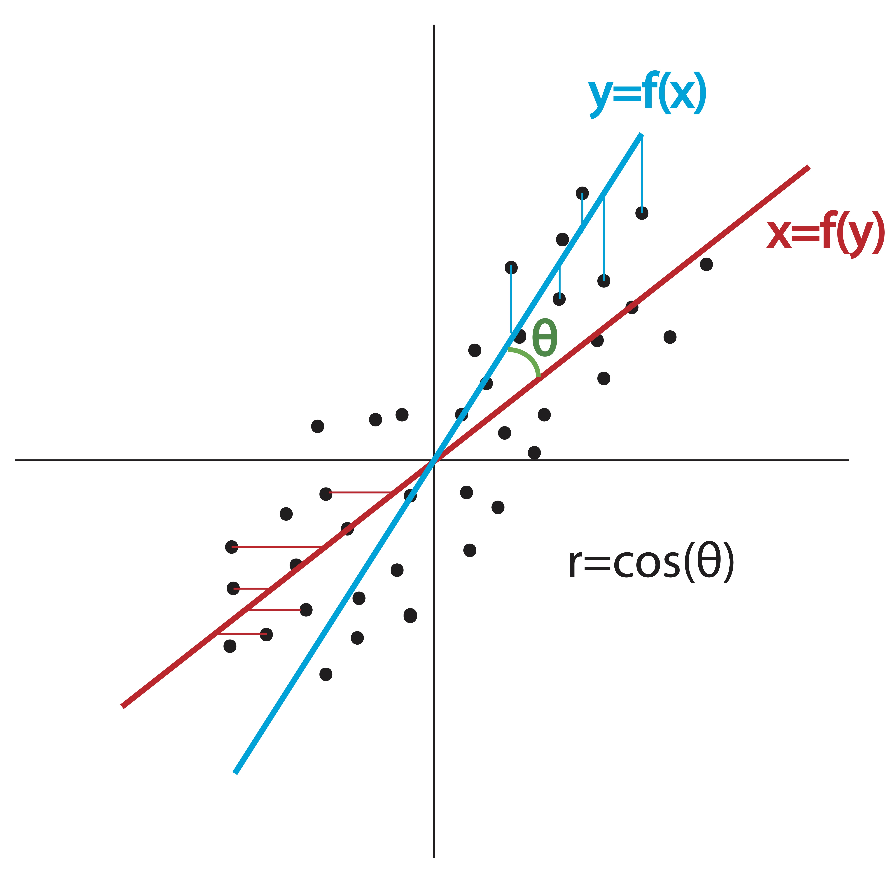
<p class="caption">(\#fig:corrangle)(ref:corranglecap)</p>
</div>


To compute the matrix of pairwise correlations between variables $\x_1,\x_2,\x_3,\dots,\x_p$ (columns containing $n$ observations for each variable), we'd first center them to have mean zero, then normalize them to have length $\|\x_i\|=1$ and then compose the matrix
$$\X=[\x_1|\x_2|\x_3|\dots|\x_p].$$

Using this centered and normalized data, the correlation matrix is simply
$$\C=\X^T\X.$$
## Outer Products

The outer product of two vectors $\x \in \Re^m$ and $\y \in \Re^n$, written $\x\y^T$, is an $m\times n $ matrix with rank 1. To see this basic fact, lets just look at an example.

:::{.example name='Outer Product' #outerprod}
Let $\x=\pm 1\\2\\3\\4\mp$ and let $\y=\pm2\\1\\3\mp$. Then the outer product of $\x$ and $\y$ is:
$$\x\y^T = \pm 1\\2\\3\\4\mp \pm 2&1&3\mp = \pm 2&1&3\\4&2&6\\6&3&9\\8&4&12 \mp$$
which clearly has rank 1.  It should be clear from this example that computing an outer product will always result in a matrix whose rows and columns are multiples of each other.
:::

:::{.example name='Centering Data with an Outer Product' #centerouter}
As we've seen in previous examples, many statistical formulas involve the _centered_ data, that is, data from which the mean has been subtracted so that the new mean is zero. Suppose we have a matrix of data containing observations of individuals' heights (h) in inches, weights (w), in pounds and wrist sizes (s), in inches:

$$\A=\bm{ ~ & h & w & s \cr 
			person_1 & 60 & 102 & 5.5 \cr
			person_2 & 72 & 170 &  7.5 \cr
			person_3 & 66 & 110 & 6.0\cr
			person_4 & 69 & 128 & 6.5\cr
			person_5 & 63 & 130 &  7.0\cr}$$
			
The average values for height, weight, and wrist size are as follows:
\begin{eqnarray}
\bar{h}&=&66\\
\bar{w}&=&128\\
\bar{s}&=&6.5
\end{eqnarray}			

To center all of the variables in this data set simultaneously, we could compute an outer product using a vector containing the means and a vector of all ones:

 $$\pm 60 & 102 & 5.5 \cr
			 72 & 170 &  7.5 \cr
			66 & 110 & 6.0\cr
			69 & 128 & 6.5\cr
			63 & 130 &  7.0\cr \mp - \pm 1\\1\\1\\1\\1 \mp \pm 66 & 128 & 6.5 \mp$$
$$= \pm 60 & 102 & 5.5 \cr
			 72 & 170 &  7.5 \cr
			66 & 110 & 6.0\cr
			69 & 128 & 6.5\cr
			63 & 130 &  7.0\cr \mp - \pm  66 & 128 & 6.5 \\66 & 128 & 6.5 \\66 & 128 & 6.5 \\66 & 128 & 6.5 \\66 & 128 & 6.5 \mp$$

$$= \pm    -6.0000 & -26.0000  & -1.0000\\
    6.0000 &  42.0000   & 1.0000\\
         0 & -18.0000 &  -0.5000\\
    3.0000    &     0       &  0\\
   -3.0000 &   2.0000 &   0.5000 \mp$$
:::


## Exercises

<ol>
<li> Let $\u=\pm 1\\2\\-4\\-2\mp$ and $\v=\pm 1\\-1\\1\\-1\mp$. 
<ol style="list-style-type:lower-alpha">
<li>  Determine the Euclidean distance between $\u$ and $\v$.
<li>  Find a vector of unit length in the direction of $\u$.
<li>  Determine the cosine of the angle between $\u$ and $\v$.
<li>  Find the 1- and $\infty$-norms of $\u$ and $\v$.
<li>  Suppose these vectors are observations on four independent variables, which have the following covariance matrix:
$$\cov=\pm 2&0&0&0\\0&1&0&0\\0&0&2&0\\0&0&0&1 \mp$$
Determine the Mahalanobis distance between $\u$ and $\v$.
</ol>

<li>  Write a matrix expression for the correlation matrix, $\C$,  for a matrix of _centered_ data, $\X$, where $\C_{ij}=r_{ij}$ is Pearson's correlation measure between variables $\x_i$ and $\x_j$. To do this, we need more than an inner product, we need to normalize the rows and columns by
the norms $\|\x_i\|$. For a hint, revisit the exercises in Chapter \@ref(mult).

<li>  Suppose you have a matrix of data, $\A_{n\times p}$, containing $n$ observations on $p$ variables. Develop a matrix formula for the standardized data (where the mean of each variable should be subtracted from the corresponding column before dividing by the standard deviation). _Hint: use Exercises 1(f) and 4 from Chapter \@ref(mult) along with Example \@ref(exm:centerouter)._

<li>  Explain why, for any norm or distance metric,
$$\|\x-\y\|=\|\y-\x\|$$

</ol>


<!-- % -->
<!-- % -->
<!-- %\section{Homogeneous Linear Equations} -->
<!-- % -->
<!-- %Linear Algebra is the study of linear equations. As you may recall, a homogeneous linear equation is one in which the right hand side of the equation is 0 (whether it be the scalar 0, a vector of zeros, or a matrix of zeros). In two dimensions, the set of solutions to a linear equation is a one-dimensional line, something we are all familiar with, for example: -->
<!-- % -->
<!-- %$$3x_1 + 2x_2 = 0.$$ -->
<!-- % -->
<!-- %We can write this simple homogeneous equation in  matrix notation by letting $\bo{a}=\pm 3 \\ 2 \mp$ and $\x=\pm x_1 \\ x_2 \mp$ so our equation becomes -->
<!-- %$$\bo{a}^T\x=\pm 3 & 2 \mp \pm x_1 \\x_2 \mp = 0.$$ -->
<!-- % -->
<!-- %This equation has infinitely many solutions - any point on the line will do. Gaussian Elimination will obviously not change this simple equation.  In this situation, $x_1$ is called a basic variable (because it corresponds to a basic column) and $x_2$ is called a free variable (because it does \textit{not} correspond to a basic column and it is free to take on any value). And so to represent the solution set, we have the following: -->
<!-- %$$\pm -\frac{2}{3} x_1 \\ x_1 \mp = x_1 \pm -frac{2}{3} \\ 1 \mp = \alpha \pm -\\frac{2}{3} \\ 1 \mp = span \left\lbrace\pm -\frac{2}{3} \\ 1 \mp \right\rbrace$$  -->
<!-- % -->


<!--chapter:end:019-norms.Rmd-->

# Linear Independence {#linind}

One of the most central ideas in all of Linear Algebra is that of **linear independence**. For regression problems, it is repeatedly stressed that _multicollinearity_ is problematic. Multicollinearity is simply a statistical term for linear dependence. It's bad. Having a firm understanding of linear combinations, we can develop the important concept of linear independence. 

## Linear Independence

:::{.definition name='Linear Dependence and Linear Independence' #lininddef}
A set of vectors $\{\v_1,\v_2,\dots, \v_n\}$ is **linearly dependent** if we can express the zero vector, $\bo{0}$, as non-trivial linear combination of the vectors.  In other words there exist some constants $\alpha_1,\alpha_2,\dots \alpha_n$  (non-trivial means that these constants are not _all_ zero) for which
\begin{equation}
\alpha_1\v_1 +\alpha_2\v_2 + \dots +\alpha_n\v_n=\bo{0}.
  (\#eq:triv)
\end{equation}

A set of terms is **linearly independent** if Equation \@ref(eq:triv) has only the _trivial solution_, $$\alpha_1=\alpha_2=\dots=\alpha_n = 0.$$
:::

Another way to express linear dependence is to say that we can write one of the vectors as a linear combination of the others. If there exists a non-trivial set of coefficients $\alpha_1,\alpha_2, \dots, \alpha_n$ for which
$$\alpha_1\v_1 +\alpha_2\v_2 + \dots +\alpha_n\v_n=\bo{0}$$
then for $\alpha_j \neq 0$ we could write
$$\v_j=-\frac{1}{\alpha_j} \sum_{\substack{i=1\\i \neq j}}^n \alpha_i \v_i$$

:::{.example name='Linearly Dependent Vectors' #lindep}
The vectors $\v_1 =\pm 1\\2\\2 \mp, \v_2 = \pm 1\\2\\3 \mp, \mbox{  and  } \v_3 = \pm 3\\6\\7 \mp$ are linearly dependent because 
$$\v_3 = 2\v_1+\v_2$$
or, equivalently, because
$$2\v_1+\v_2-\v_3 = \bo{0}$$
:::

### Determining Linear Independence

You should realize that the linear combination expressed Definition \@ref{def:linind} can be written as a matrix vector product. Let $\A_{m\times n} = (\A_1|\A_2|\dots|\A_n)$ be a matrix. Then by Definition \@ref{def:linind}, the columns of $\A$ are linearly independent if and only if the equation
\begin{equation}
\A\x = \bo{0}
(\#eq:homo)
\end{equation}
has only the trivial solution, $\x=0$. Equation \@ref(eq:homo) is commonly known as the homogeneous linear equation. For this equation to have only the trivial solution, it must be the case that under Gauss-Jordan elimination, the augmented matrix $(\A|\bo{0})$ reduces to $(\bo{I}|0)$. We have already seen this condition in our discussion about matrix inverses - if a square matrix $\A$ reduces to the identity matrix under Gauss-Jordan elimination then it is equivalently called _full rank, nonsingular, or invertible_. Now we add an additional condition equivalent to the others - the matrix $\A$ has linearly independent columns (_and rows_).

In Theorem \@ref(thm:equivcond) we provide an important list of equivalent conditions regarding the existence of a matrix inverse.

:::{.theorem name='Equivalent Conditions for Matrix Invertibility' #equivcond}
Let $\A$ be an $n\times n$ matrix - a _square_ matrix. Then the following statements are _equivalent_. (If one these statements is true, then all of these statements are true)

- $\A$ is invertible ($\A^{-1} exists$)
- $\A$ has full rank ($rank(\A)=n$)
- The columns of $\A$ are linearly independent
- The rows of $\A$ are linearly independent
- The system $\A\x=\b$, $\b\neq \bo{0}$ has a unique solution
- $\A\x=\bo{0} \Longrightarrow \x=\bo{0}$
- $\A$ is nonsingular
- $\A \xrightarrow{Gauss-Jordan} \bo{I}$
:::

## Span of Vectors {#span}

:::{.definition name='Vector Span' #spandef}
The **span** of a single vector $\v$ is the set of all scalar multiples of $\v$:
$$span(\v)=\{\alpha\v\ \mbox{  for any constant  } \alpha\}$$
 The **span** of a collection of vectors, $\V=\{\v_1,\v_2,\dots,\v_n\}$ is the set of all linear combinations of these vectors:
 $$span(\V)=\{\alpha_1\v_1+\alpha_2\v_2+\dots+\alpha_n\v_n \mbox{ for any constants }\alpha_1,\dots,\alpha_n\}$$
:::

Recall that addition of vectors can be done geometrically using the _head-to-tail_ method shown in Figure \@ref(fig:vectoradd2).

<div class="figure" style="text-align: center">

<p class="caption">(\#fig:vectoradd2)Geometrical addition of vectors: Head-to-tail</p>
</div>


If we have two linearly independent vectors on a coordinate plane, then any third vector can be written as a linear combination of them. This is because two vectors is sufficient to _span_ the entire 2-dimensional plane. You should take a moment to convince yourself of this geometrically, using the animation in Figure \@ref(fig:animspan) to help.

<div class="figure" style="text-align: center">

<p class="caption">(\#fig:animspan)Animation: Span of Two Linear Independent Vectors is a Plane. </p>
</div>

In 3-space, two linearly independent vectors can still only span a plane. Figure \@ref(fig:spanfig) depicts this situation. The set of all linearly combinations of the two vectors $\a$ and $\b$ (i.e. the $span(\a,\b)$) carves out a plane. We call this a two-dimensional collection of vectors a **subspace** of $\Re^3$. A subspace is formally defined in Definition \@ref(def:subspacedef).

(ref:spancap) The $span(\a,\b)$ in $\Re^3$ creates a plane (a 2-dimensional _subspace_)

<div class="figure" style="text-align: center">

<p class="caption">(\#fig:spanfig)(ref:spancap)</p>
</div>


:::{.definition name='Subspace' #subspacedef}
A **subspace**, $\mathcal{S}$ of $\Re^n$ is thought of as a "flat"  (having no curvature) surface within $\Re^n$. It is a collection of vectors which satisfies the following conditions:

1. The origin ($\bo{0}$ vector) is contained in $\mathcal{S}$
2. If $\x$ and $\y$ are in $\mathcal{S}$ then the sum $\x+\y$ is also in $\mathcal{S}$
3. If $\x$ is in $\mathcal{S}$ and $\alpha$ is a constant then $\alpha\x$ is also in $\mathcal{S}$
:::

The span of two vectors $\a$ and $\b$ is a subspace because it satisfies these three conditions. (Can you prove it formally? See exercise 4).

:::{.example name='Span' #span}
Let $\a=\pm 1\\3\\4 \mp$ and $\b=\pm 3\\0\\1 \mp$. Explain why or why not each of the following vectors is contained in the $span(\a,\b)$? 

a. $\x=\pm 5\\6\\9 \mp$ 

  - To determine if $\x$ is in the $span(\a,\b)$ we need to find coefficients $\alpha_1, \alpha_2$ such that $$\alpha_1\a+\alpha_2\b=\x.$$ Thus, we attempt to solve the system
$$\pm 1&3\\3&0\\4&1 \mp \pm \alpha_1\\ \alpha_2 \mp = \pm 5\\6\\9\mp.$$
After Gaussian Elimination, we find that the system is consistent with the solution
$$\pm\alpha_1\\ \alpha_2 \mp=\pm 2\\1\mp$$
and so $\x$ is in fact in the $span(\a,\b)$.

b. $\y=\pm 2\\4\\6 \mp$ 

  - We could follow the same procedure as we did in part (a) to learn that the corresponding system is _not_ consistent and thus that $\y$ is not in the $span(\a,\b)$.

:::

:::{.definition name='Hyperplane' #hyperplane}
A **hyperplane** is a subspace with 1 less dimension than the ambient space. Such a space "cuts" the ambient space into two pieces, one that is "above" the hyperplane, and one that is "below" it.  Hyperplanes are not always defined to go through the origin, so we will distinguish these subspaces from _affine_ hyperplanes, which are not subspaces. 


:::


##  Exercises
<ol>
<li> **Six views of matrix multiplication:**  _This notational exercise turns out to contain one of (well, six of) the most fundamentally important concepts to grasp for applied linear algebra. We must be able to intuitively create matrix multiplications from every angle in order for us to be strong practitioners. This is not something that we develop immediately. It comes through practice, visualization, and experience. Do not skip this exercise and keep it in your pocket as you proceed through this book. _

Let $\A_{m\times k}$, $\B_{k\times n}$, and $\C_{m\times n}$ be matrices such that
$$\A\B=\C.$$
<ol style="list-style-type:lower-alpha">
  <li> Express the first column of $\C$ as a linear combination of the columns of $\A$.
  <li> Express the first column of $\C$ as a matrix-vector product.
  <li> Express $\C$ as a sum of outer products.
  <li> Express the first row of $\C$ as a linear combination of the rows of $\B$.
  <li> Express the first row of $\C$  as a matrix-vector product.
  <li> Express the element $\C_{ij}$ as an inner product of row or column vectors from $\A$ and $\B$.
</ol>
<li> Determine whether or not the vectors $$\x_1=\pm 1\\3\\1\mp,\x_2=\pm 0\\1\\1\mp,\x_3=\pm 2\\1\\0\mp$$ are linearly independent.
<li> Let $\a=\pm 1\\3\\4 \mp$ and $\b=\pm 3\\0\\1 \mp$. 
<ol style="list-style-type:lower-alpha">
  <li> Show that the zero vector, $\pm 0\\0\\0 \mp$ is in the $span(\a,\b)$. 
  <li> Determine whether or not the vector $\pm 1\\0\\1 \mp$ is in the $span(\a,\b)$.
</ol>
<li> Describe the span of one vector in $\Re^3$.
<li> Describe the span of two linearly _independent_ vectors in $\Re^3$.
<li> Describe the span of two linearly _dependent_ vectors in $\Re^3$.
<li> What is the span of the zero vector, $\bo{0}=(0,0,\dots, 0)$?
<li> Compare the $span \left\lbrace \pm 1\\1 \mp \right\rbrace$ to the $span \left\lbrace \pm 1\\1 \mp , \pm 2\\2 \mp \right\rbrace$.
<li> What is the dimension of the $span \left\lbrace\pm 1\\1 \mp , \pm 2\\2 \mp \right\rbrace$
<li> What is the definition of the dimension of a subspace?
<li> How would you describe a hyperplane?
<li> Draw the $span(\a,\b)$ if $\a=\pm 1\\2 \mp$ and $\b=\pm 3\\6 \mp$.
<li> Prove that the span of vectors is a subspace by showing that it satisfies the three conditions from Definition \@ref(def:spandef). To make a formal proof, the strategy should be as follows: (1) Take two arbitrary elements from the span and show that when you add them together, the resulting vector is also in the span. (2) Take one arbitrary vector from the span and show that when you multiply it by a constant, the resulting vector is also in the span. (3) Show that the zero vector is contained in the span. You can simply show this fact for the span of two vectors and notice how the concept will hold for more than two vectors.
<li>  _True/False_ Mark each statement as true or false. Justify your response.
<ol style="list-style-type:lower-alpha">
  <li> If $\A\x=\b$ has a solution then $\b$ can be written as a linear combination of the columns of $\A$.
  <li> If $\A\x=\b$ has a solution then $\b$ is in the span of the columns of $\A$.
  <li> If  $\v_1$ is in the $span(\v_2,\v_3)$, then $\v_1, \v_2, \,\mbox{ and},\v_3$ form a linearly independent set.
</ol>
<li> Two vectors are linearly independent only if they are not perfectly correlated, $-1<\rho<1$, where $\rho$ is Pearson's correlation coefficient.
</ol>


## List of Key Terms {-}

- linearly independent
- linearly dependent
- full rank
- perfect multicollinearity
- severe multicollinearity
- invertible
- nonsingular
- linear combination geometrically       
- linear (in)dependence geometrically    
- vector span                            
- subspace                               
- dimension of subspace                  
- hyperplane                             
               


<!--chapter:end:025-linind.Rmd-->

# Basis and Change of Basis {#basis}

When we think of coordinate pairs, or coordinate triplets, we tend to think of them as points on a grid where each axis represents one of the coordinate directions:\

<div class="figure" style="text-align: center">

<p class="caption">(\#fig:unnamed-chunk-26)The Coordinate Plane</p>
</div>

We may not have previously formalized it, but even in this elementary setting, we are considering these points (vectors) as linear combinations of the elementary __basis vectors__
$$\e_1 = \pm 1\\0\mp \mbox{  and  } \e_2=\pm 0\\1 \mp.$$
For example, the point $(2,3)$ can be written as
\begin{equation}
\pm 2\\3 \mp = 2\pm 1\\0\mp+3\pm 0\\1\mp = 2\e_1+3\e_2.
  (\#eq:coord)
\end{equation}

We consider the coefficients (the scalars 2 and 3) in this linear combination as __coordinates__ in the basis $\mathcal{B}_1=\{\e_1,\e_2\}$.  The coordinates, in essence, tell us how much "information" from the vector/point $(2 ,3 )$ lies along each basis direction: to create this point, we must travel 2 units along the direction of $\e_1$ and then 3 units along the direction of $\e_2$. 

We can also view Equation \@ref(eq:coord) as a way to separate the vector $(2,3)$ into orthogonal components. Each component is an __orthogonal projection__ of the vector onto the span of the corresponding basis vector. The orthogonal projection of vector $\bo{a}$ onto the span another vector $\v$ is simply the closest point to $\bo{a}$ contained on the span($\v$), found by _projecting_ $\bo{a}$ onto $\v$ at a $90^\circ$ angle. Figure \@ref(fig:orthogproj) shows this explicitly for $\bo{a}=(2,3)$.

<div class="figure" style="text-align: center">
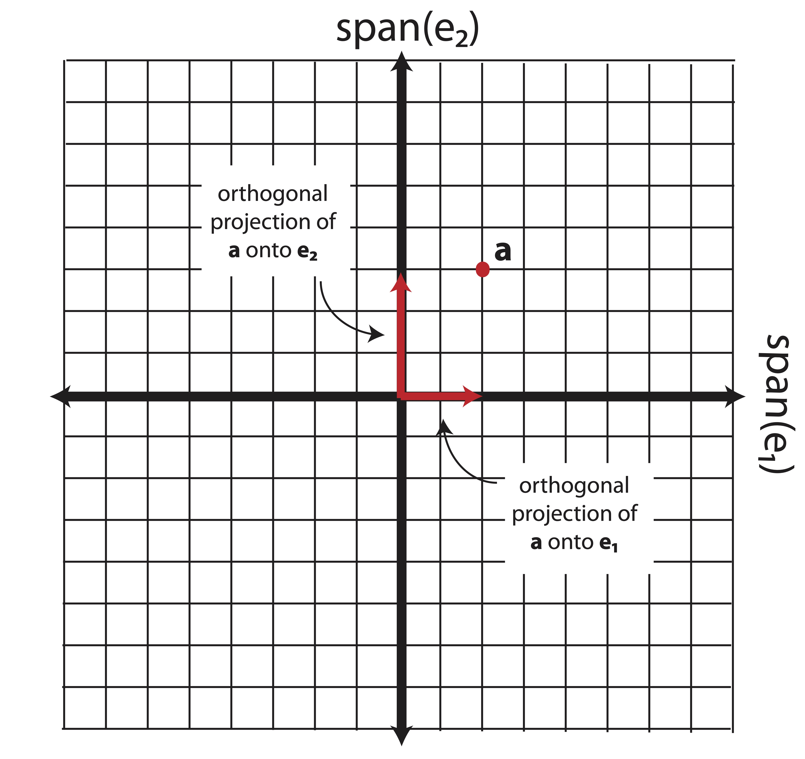
<p class="caption">(\#fig:orthogproj)Orthogonal Projections onto basis vectors</p>
</div>

:::{.definition name='Elementary Basis' #elembasisdef}
For any vector $\a=(a_1,a_2,\dots, a_n)$, the basis $\mathcal{B} = \{\e_1,\e_2,\dots,\e_n\}$ (recall $\e_i$ is the $i^{th}$ column of the identity matrix $\bo{I}_n$) is the __elementary basis__ and $\a$ can be written in this basis using the __coordinates__ $a_1,a_2,\dots, a_n$ as follows:
$$\a=a_1\e_1+a_2\e_2+\dots a_n\e_n.$$
:::

The elementary basis $\mathcal{B}_1$ is convenient for many reasons, one being its __orthonormality__:
\begin{eqnarray*}
\e_1^T\e_1 &=& \e_2^T\e_2 = 1\\
\e_1^T\e_2 &=& \e_2^T\e_1 = 0
\end{eqnarray*}

However, there are many (infinitely many, in fact) ways to represent the data points on different axes. If I wanted to view this data in a different way, I could use a different basis. Let's consider, for example, the following orthonormal basis, drawn in green over the original grid in Figure \@ref(fig:coordplaneB2):
$$\mathcal{B}_2 = \{\v_1,\v_2\}=\left\lbrace {\textstyle\frac{\sqrt{2}}{2}}\pm 1\\ 1\mp ,{\textstyle\frac{\sqrt{2}}{2}}\pm 1\\-1\mp\right\rbrace$$

(ref:coordcap) New basis vectors, $\v_1$ and $\v_2$, shown on original plane

<div class="figure" style="text-align: center">

<p class="caption">(\#fig:coordplaneB2)(ref:coordcap)</p>
</div>


The scalar multipliers $\frac{\sqrt{2}}{2}$ are simply normalizing factors so that the basis vectors have unit length. You can convince yourself that this is an orthonormal basis by confirming that
\begin{eqnarray*}
\v_1^T\v_1 &=& \v_2^T\v_2 = 1\\
\v_1^T\v_2 &=& \v_2^T\v_1 = 0
\end{eqnarray*}

If we want to _change the basis_ from the elementary $\mathcal{B}_1$ to the new green basis vectors in $\mathcal{B}_2$, we need to determine a new set of coordinates that direct us to the point using the green basis vectors as a frame of reference. In other words we need to determine $(\alpha_1,\alpha_2)$ such that travelling $\alpha_1$ units along the direction $\v_1$ and then $\alpha_2$ units along the direction $\v_2$ will lead us to the point in question. For the point $(2,3)$ that means
$$
\pm 2\\3 \mp = \alpha_1\v_1+\alpha_2\v_2 = \alpha_1\pm \frac{\sqrt{2}}{2}\\ \frac{\sqrt{2}}{2}\mp+\alpha_2\pm \frac{\sqrt{2}}{2}\\ -\frac{\sqrt{2}}{2}\mp .
$$

This is merely a system of equations $\bo{V}\bo{a}=\b$:
$$
{\textstyle\frac{\sqrt{2}}{2}}\pm 1&1 \\1& -1\mp \pm \alpha_1\\ \alpha_2 \mp = \pm 2\\3 \mp
$$

The $2\times 2$ matrix $\V$ on the left-hand side has linearly independent columns and thus has an inverse. In fact, $\V$ is an orthonormal matrix which means its inverse is its transpose. Multiplying both sides of the equation by $\V^{-1}=\V^T$ yields the solution
$$\bo{a} =\pm \alpha_1 \\ \alpha_2 \mp = \V^T\b= \pm \frac{5\sqrt{2}}{2} \\ -\frac{\sqrt{2}}{2} \mp$$

This result tells us that in order to reach the red point (formerly known as (2,3) in our previous basis), we should travel $\frac{5\sqrt{2}}{2}$ units along the direction of $\v_1$ and then $-\frac{\sqrt{2}}{2}$ units along the direction $\v_2$ (Note that $\v_2$ points toward the southeast corner and we want to move northwest, hence the coordinate is negative). Another way (a more mathematical way) to say this is that _the length of the orthogonal projection of $\bo{a}$ onto the span of $\v_1$ is $\frac{5\sqrt{2}}{2}$, and the length of the orthogonal projection of $\bo{a}$ onto the span of $\v_2$ is $-\frac{\sqrt{2}}{2}$_. While it may seem that these are difficult distances to plot, they work out quite well if we examine our drawing in Figure \@ref(fig:coordplaneB2), because the diagonal of each square is $\sqrt{2}$. 

In the same fashion, we can re-write all 3 of the red points on our graph in the new basis by solving the same system simultaneously for all the points. Let $\B$ be a matrix containing the original coordinates of the points and let $\A$ be a matrix containing the new coordinates:
$$\B=\pm -4 & 2 & 5 \\ -2 & 3 & 2 \mp\,\, \A=\pm \alpha_{11} & \alpha_{12} & \alpha_{13}\\ \alpha_{21} & \alpha_{22} & \alpha_{23} \mp$$

Then the new data coordinates on the rotated plane can be found by solving:
$$\V\A=\B$$
And thus $$\A=\V^T\B =\frac{\sqrt{2}}{2} \pm   -6 & 5 &7\\ -2&-1&3\mp$$

Using our new basis vectors, our alternative view of the data is that in Figure \@ref(fig:coordplaneB2rotate).

(ref:coordB2cap) Points plotted in the new basis, $\mathcal{B}$

<div class="figure" style="text-align: center">
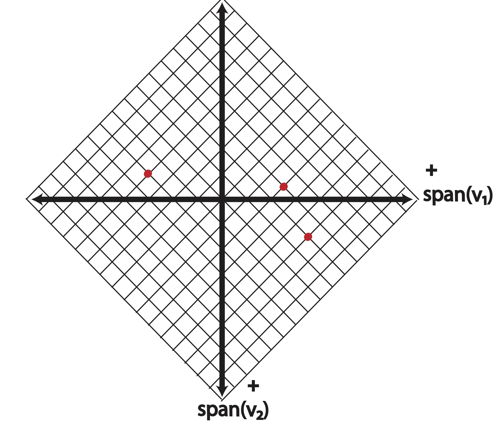
<p class="caption">(\#fig:coordplaneB2rotate)(ref:coordB2cap)</p>
</div>


In the above example, we changed our basis from the original elementary basis to a new orthogonal basis which provides a different view of the data. All of this amounts to a rotation of the data around the origin. No real information has been lost - the points maintain their distances from each other in nearly every distance metric. __Our new variables, $\v_1$ and $\v_2$ are linear combinations of our original variables $\e_1$ and $\e_2$__, thus we can transform the data _back_ to its original coordinate system by again solving a linear system (in this example, we'd simply multiply the new coordinates again by $\V$).

In general, we can change bases using the procedure outlined in Theorem \@ref(thm:changebasedef).

:::{.theorem name='Changing Bases' #changebasedef}
Given a matrix of coordinates (in columns), $\A$, in some basis, $\mathcal{B}_1=\{\x_1,\x_2,\dots,\x_n\}$, we can change the basis to $\mathcal{B}_2=\{\v_1,\v_2,\dots,\v_n\}$ with the new set of coordinates in a matrix $\B$ by solving the system
$$\X\A=\V\B$$
where $\X$ and $\V$ are matrices containing (as columns) the basis vectors from $\mathcal{B}_1$ and $\mathcal{B}_2$ respectively.

Note that when our original basis is the elementary basis, $\X=\bo{I}$, our system reduces to
$$\A=\V\B.$$

When our new basis vectors are orthonormal, the solution to this system is simply
$$\B=\V^T\A.$$
:::

:::{.definition name='Basis' #basisdef}
A __basis__ for an arbitrary vector space $\mathcal{V}$ is any set of linearly independent vectors $\{\mathcal{B}_1,\dots, \mathcal{B}_r\}$ such that $$span(\{\mathcal{B}_1,\dots, \mathcal{B}_r\}) = \mathcal{\mathbf{V}}.$$
$r$ is said to be the __dimension__ of the vector space $\Re^n$.
  
A __basis__ for the vector space $\Re^n$ is then any set of $n$ linearly independent vectors in $\Re^n$; $n$ is said to be the __dimension__ of the vector space $\Re^n$. When the basis vectors are orthonormal (as in our prior examples), the set is called an __orthonormal basis__. 
:::

The preceding discussion dealt entirely with bases for $\Re^n$ (our example was for points in $\Re^2$). However, we will need to consider bases for _subspaces_ of $\Re^n$. Recall that the span of two linearly independent vectors in $\Re^3$ is a plane. This plane is a 2-dimensional subspace of $\Re^3$. Its dimension is 2 because 2 basis vectors are required to represent this space. However, not all points from $\Re^3$ can be written in this basis - only those points which exist on the plane. Chapter, we will discuss how to proceed in a situation where the point we'd like to represent does not actually belong to the subspace we are interested in. This is the foundation for Least Squares.

## Exercises
<ol>
<li> What are the coordinates of the vector $\x=\pm 4\\3 \mp$ in the basis $\left\lbrace\pm -1\\-1 \mp , \pm 1\\-1 \mp \right\rbrace$? Draw a picture to make sure your answer lines up with intuition.
<li> In the following picture what would be the signs (+/-) of the coordinates of the green point in the basis $\{\v_1, \v_2\}$? Pick another point at random and answer the same question for that point.
<center>  </center>
<li> Write the orthonormal basis vectors from exercise 1 as linear combinations of the original elementary basis vectors.
<li> What is the length of the orthogonal projection of $\a_1$ onto $\v_1$?

</ol>

## List of Key Terms {-}

- basis vectors
- orthonormal basis
- coordinates in different bases         
             
                            
    

<!--chapter:end:026-basis.Rmd-->

# Orthogonality {#orthog}
Orthogonal (or perpendicular) vectors have an angle between them of $90^{\circ}$, meaning that their cosine (and subsequently their inner product) is zero. 

:::{.definition name='Orthogonality' #orthogdef}
Two vectors, $\x$ and $\y$, are __orthogonal__ in $n$-space if their inner product is zero:
$$\x^T\y=0$$
:::

Combining the notion of orthogonality and unit vectors we can define an orthonormal set of vectors, or an orthonormal matrix. Remember, for a unit vector, $\x^T\x = 1$.\

:::{.definition name='Orthonormal Set' #orthsetdef}
The $n\times 1$ vectors $\{\x_1,\x_2,\x_3,\dots,\x_p\}$ form an __orthonormal set__ if and only if

1. $\x_i^T\x_j = 0\,$  when $i \ne j$ and \
2. $\x_i^T\x_i = 1\,$  (equivalently $\|\mathbf{x}_i\|=1$)

In other words, an orthonormal set is a collection of _unit vectors which are mutually orthogonal_.
:::

If we form a matrix, $\X=(\x_1|\x_2|\x_3|\dots|\x_p )$, having an orthonormal set of vectors as columns, we will find that multiplying the matrix by its transpose provides a nice result:

\begin{eqnarray*}
\X^T\X = \pm \x_1^T \\ \x_2^T \\ \x_3^T \\ \vdots \\ \x_p^T  \mp 
\pm \x_1&\x_2&\x_3&\dots&\x_p  \mp 
&=& \pm \x_1^T\x_1 & \x_1^T\x_2 & \x_1^T\x_3 & \dots & \x_1^T\x_p \\
\x_2^T\x_1 & \x_2^T\x_2 & \x_2^T\x_3 & \dots & \x_2^T\x_p \\
\x_3^T\x_1 & \x_3^T\x_2 & \x_3^T\x_3 &\dots & \x_3^T\x_p \\
\vdots & \vdots & \ddots & \ddots & \vdots \\
\x_p^T\x_1 & \dots & \dots & \ddots & \x_p^T\x_p \mp \\
&=&  \pm 1 & 0 & 0 & \dots & 0\\
            0 & 1 & 0 & \dots & 0 \\
             0 & 0 & 1 & \dots & 0 \\
             \vdots & \vdots & \ddots & \ddots & \vdots \\
            0 & 0 & 0 & \dots & 1 \mp 
= \bo{I}_p 
\end{eqnarray*}
We will be particularly interested in these types of matrices when they are square. If $\X$ is a square matrix with orthonormal columns, the arithmetic above means that the inverse of $\X$ is $\X^T$ (i.e. $\X$ also has orthonormal rows):
$$\X^T\X=\X\X^T = I.$$ 
Square matrices with orthonormal columns are called orthogonal matrices - this an unfortunate naming mismatch, we agree.         

:::{.definition name='Orthogonal Matrix' #orthmatdef}
A _square_ matrix, $\bo{U}$ with orthonormal columns also has orthonormal rows and is called an __orthogonal matrix__. Such a matrix has an inverse which is equal to it's transpose,
$$\U^T\U=\U\U^T = \bo{I} $$
:::

## Orthonormal Basis

Our primary interest in orthonormal sets will be in the formulation of new bases for our data. An orthonormal basis has two advantages over other types of bases, with one advantage stemming from each of the two criteria for orthonormality:

1. The basis vectors are mutually perpendicular. They are just rotations of the elementary basis vectors and thus when we examine our data in these new bases, we are merely observing a rotation of our data. This allows us to plot the new coordinates of our data on a plane without much regard for the basis vectors themselves. Basis vectors that are _not_ orthogonal would create a distorted image of our data if we did this. We'd need to factor in the angle between the basis vectors to grasp our previously intuitive notions of distance and similarity. \

2. The basis vectors have length 1. So when we look at the coordinates associated with each basis vector, they tell us how many _units_ to go in each direction. This way, again, we can ignore the basis vectors and focus on the coordinates alone. We truly just rotated the axes. 

These two advantages combine to mean that we can use our new coordinates in place of our original data without any loss of "signal". We can rotate my multidimensional data cloud, put that rotated data into a regression or clustering model, and then draw conclusions that about my original data points (of course our "variables" (basis vectors) are no longer the same so we wouldn't be able to draw any conclusions about our original variables from my regression analysis until we _un_-rotated the data, but the predictions would all match exactly).

However, the _real_ power of these advantages are the ease with which we can perform orthogonal projections and the ease with which we can transform from our original space to the new space and back again. 

## Orthogonal Projection

Think about taking a giant flashlight and shining all of the data onto a subspace at a right angle. The resulting shadow would be the __orthogonal projection__ of the data onto the subspace. Figure \@ref(fig:orthogproganim) brings this definition to life.

<div class="figure" style="text-align: center">

<p class="caption">(\#fig:orthogproganim)Omitting a variable from an orthonormal basis amounts to orthogonal projection onto the span of the other basis vectors.</p>
</div>

Of course, data can exist _below_ and all around the subspace in question, so it might be helpful to imagine two flashlights or many flashlights that project each data point down to the closest point on the subspace (an orthogonal projection onto a subspace of interest always gets you as _close_ to your original data as possible, under the constraint that the projection be contained in the subspace).

When we have a cloud of data and we "drop" one of our variables, geometrically this amounts to an orthogonal projection of the data onto the span of the other axes - reducing the dimensionality of the space in which it exists by 1. Figure \@ref(fig:orthogproganim2) strives to make this clear.

<div class="figure" style="text-align: center">
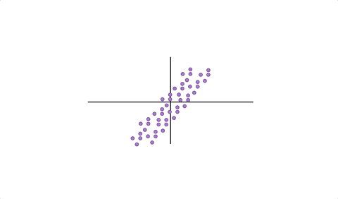
<p class="caption">(\#fig:orthogproganim2)Omitting a variable from an orthonormal basis amounts to orthogonal projection onto the span of the other basis vectors.</p>
</div>

## Why??

My favorite question. "Whyyy do we have to learn this?!" It's time to build some intuition toward that question. Consider the following 3-D scatter plot, which is interactive. Turn it around with your mouse and see what you notice.

<div class="figure" style="text-align: center">
preserveea9d16ff2b574a9d
<p class="caption">(\#fig:pcafig)3-Dimensional data cloud that suffers from severe multicollinearity.</p>
</div>
Does it look like this data is 3-dimensional in nature? It appears that it could be well-summarized if it existed on a plane. However, what _is_ that plane? We can't merely drop a variable in this instance, as doing so is quite likely to destroy a good proportion of the information from the data. Still, it seems clear that by rotating the data to the _right_ set of axes, we could then squish it down and use 2 coordinates to describe the data without losing much of the information at all. What do we mean by "information"? In this context, using the word "variance" works well. We want to keep as much of the original variance as possible when we squish the cloud down to a plane with an orthogonal projection. Can you find the (approximate) rotation that gives you the _best_ view of the data points? 

Figure \@ref(fig:pcafig) is really the jumping off point. Once we can intuitively see _why_ we might benefit from a new basis and _how_ one might be crafted, we're ready to start digging in to PCA. Once we've exposed the basic terminology in Chapters \@ref(eigen) and \@ref(pca), we can explore the magnificent world of dimension reduction and its many benefits in the case studies in Chapters \@ref(pcaapp)-\@ref(otherdimred).


## Exercises

<ol>
<li>  Let $$\U=\frac{1}{3}\pm -1&2&0&-2\\2&2&0&1\\0&0&3&0\\-2&1&0&2\mp$$
<ol style="list-style-type:lower-alpha">
<li>  Show that $\U$ is an orthogonal matrix.
<li>  Let $\bo{b}=\pm 1\\1\\1\\1\mp$. Solve the equation $\U\x=\bo{b}$.
</ol>
<li> Draw the orthogonal projection of the points onto the subspace $span \left\lbrace \pm 1\\-1\mp \right\rbrace$
<center>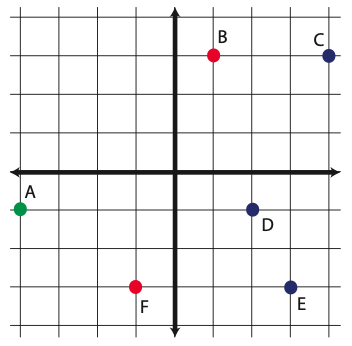</center>
<li> Are the vectors $\v_1=\pm 1\\-1\\1 \mp$ and $\v_2=\pm 0\\1\\1 \mp$ orthogonal? How do you know?
<li> What are the two conditions necessary for a collection of vectors to be orthonormal?
<li> Show that the vectors $\v_1 = \pm 3 \\ 1\mp$ and $\v_2=\pm -2 \\6\mp$ are orthogonal. Create an orthonormal basis for $\Re^2$ using these two direction vectors.
<li> Consider $\a_1=(1,1)$ and $\a_2=(0,1)$ as coordinates for points in the elementary basis. Write the coordinates of $\a_1$ and $\a_2$ in the orthonormal basis found in the previous exercise. Draw a picture which reflects the old and new basis vectors. 
<li> Briefly explain why an orthonormal basis is important.
<li> Find two vectors which are orthogonal to $\x=\pm 1\\1\\1\mp$
<li>  __Pythagorean Theorem.__ Show that $\x$ and $\y$ are orthogonal if and only if
$$\|\x+\y\|_2^2 = \|\x\|_2^2 + \|\y\|_2^2$$
_(Hint: Recall that $\|\x\|_2^2 = \x^T\x$)_

</ol>

<!--chapter:end:0269-orthogonality.Rmd-->

# Least Squares {#leastsquares}

## Introducing Error

The least squares problem arises in almost all areas of applied mathematics. In data science, the idea is generally to find an approximate mathematical relationship between predictor and target variables such that the sum of squared errors between the true target values and the predicted target values is minimized. In two dimensions, the goal would be to develop a line as depicted in Figure \@ref(fig:leastsquaresillustrated) such that the sum of squared vertical distances (the residuals, in green) between the true data (in red) and the mathematical prediction (in blue) is minimized.

<div class="figure" style="text-align: center">

<p class="caption">(\#fig:leastsquaresillustrated)Least Squares Illustrated in 2 dimensions</p>
</div>

If we let $\bo{r}$ be a vector containing the residual values $(r_1,r_2,\dots,r_n)$ then the sum of squared residuals can be written in linear algebraic notation as
$$\sum_{i=1}^n r_i^2 = \bo{r}^T\bo{r}=(\y-\hat{\y})^T(\y-\hat{\y}) = \|\y-\hat{\y}\|^2$$

 Suppose we want to regress our target variable $\y$ on $p$ predictor variables, $\x_1,\x_2,\dots,\x_p$. If we have $n$ observations, then the ideal situation would be to find a vector of parameters $\boldsymbol\beta$ containing an intercept, $\beta_0$ along with $p$ slope parameters, $\beta_1,\dots,\beta_p$ such that
\begin{equation}
(\#eq:lssystem)
\underbrace{\bordermatrix{1&\x_1 & \x_2 & \dots & \x_p}{obs_1\\obs_2\\ \vdots \\ obs_n}{\left(\begin{matrix}
					  1 &  x_{11} & x_{12} & \dots & x_{1p}\\
					 1 & x_{21} & x_{22} & \dots & x_{2p}\\
					  \vdots & \vdots & \vdots & \vdots &\vdots\\
					 1 & x_{n1} & x_{n2} & \dots & x_{np} \end{matrix}\right) }}_{\LARGE\mathbf{X}}
					  \underbrace{\left(\begin{matrix} \beta_0\\ \beta_1\\  \vdots \\ \beta_p \end{matrix}\right)}_{\LARGE \boldsymbol\beta} 
					  =  \underbrace{\pm y_0\\ y_1 \\ \vdots \\ y_n \mp}_{\LARGE \y} 
\end{equation}					  

With many more observations than variables, this system of equations will not, in practice, have a solution. Thus, our goal becomes finding a vector of parameters $\hat{\bbeta}$ such that $\X\hat{\bbeta}=\hat{\y}$ comes as close to $\y$ as possible.
Using the design matrix, $\X$, the least squares solution $\hat{\boldsymbol\beta}$ is the one for which
$$\|\y-\X\hat{\boldsymbol\beta} \|^2=\|\y-\hat{\y}\|^2$$ is minimized. Theorem \@ref(thm:leastsquares) characterizes the solution to the least squares problem.

:::{.theorem name='Least Squares Problem and Solution' #leastsquares}
For an $n\times m$ matrix $\X$ and $n\times 1$ vector $\y$, let $\bo{r} = \X\widehat{\boldsymbol\beta} - \y$. The least squares problem is to find a vector $\widehat{\boldsymbol\beta}$ that minimizes the quantity
$$\sum_{i=1}^n r_i^2 = \|\y-\X\widehat{\boldsymbol\beta} \|^2.$$

Any vector $\widehat{\bbeta}$ which provides a minimum value for this expression is called a _least-squares solution_.

- The set of all least squares solutions is precisely the set of solutions to the so-called **normal equations**, $$\X^T\X\widehat{\bbeta} = \X^T\y.$$
- There is a unique least squares solution if and only if $rank(\X)=m$ (i.e. linear independence of variables or no perfect multicollinearity!), in which case $\X^T\X$ is invertible and the solution is given by
$$\widehat{\bbeta} = (\X^T\X)^{-1}\X^T\y$$
:::


:::{.example name='Solving a Least Squares Problem' #lsex}
In 2014, data was collected regarding the percentage of linear algebra exercises done by students and the grade they received on their examination. Based on this data, what is the expected effect of completing an additional 10\% of the exercises on a students exam grade?\
<table>
<tr> <td>ID <td> \% of Exercises <td> Exam Grade
<tr> <td> 1 <td> 20 <td> 55
<tr> <td> 2 <td> 100<td> 100
<tr> <td> 3 <td> 90 <td> 100
<tr> <td> 4 <td> 70 <td> 70
<tr> <td> 5 <td> 50 <td> 75
<tr> <td> 6 <td> 10 <td> 25
<tr> <td> 7 <td> 30 <td> 60
</table>

To find the least squares regression line, we want to solve the equation $\X\bbeta = \y$:
$$
\pm 1 & 20\\
 1 & 100\\
  1 & 90\\
   1 & 70\\
    1 & 50\\
     1 & 10\\
      1 & 30\mp \pm \beta_0 \\ \beta_1 \mp = \pm 55\\100\\100\\70\\75\\25\\60 \mp
$$

This system is obviously inconsistent. Thus, we want to find the least squares solution $\hat{\bbeta}$ by solving $\X^T\X\hat{\bbeta}=\X^T\y$:

\begin{eqnarray}
\small
\pm 1&1&1&1&1&1&1 \\20&100&90&70&50&10&30 \mp\pm 1 & 20\\
 1 & 100\\
  1 & 90\\
   1 & 70\\
    1 & 50\\
     1 & 10\\
      1 & 30\mp \pm \beta_0 \\ \beta_1 \mp &=&\pm 1&1&1&1&1&1&1 \\20&100&90&70&50&10&30 \mp \pm 55\\100\\100\\70\\75\\25\\60 \mp \cr
\pm 7 & 370\\370&26900 \mp     \pm \beta_0 \\ \beta_1 \mp &=& \pm 485 \\ 30800\mp
\end{eqnarray}

Now, since multicollinearity was not a problem, we can simply find the inverse of $\X^T\X$ and multiply it on both sides of the equation:
$$\pm 7 & 370\\370&26900 \mp^{-1}= \pm 0.5233 &  -0.0072\\ -0.0072 & 0.0001 \mp$$
and so $$\pm \beta_0 \\ \beta_1 \mp = \pm  0.5233 &  -0.0072\\ -0.0072 & 0.0001 \mp \pm  485 \\ 30800\mp = \pm 32.1109 \\0.7033\mp$$ 

Thus, for each additional 10\% of exercises completed, exam grades are expected to increase by about 7 points. The data along with the regression line $$grade=32.1109+0.7033percent\_exercises$$ is shown below.

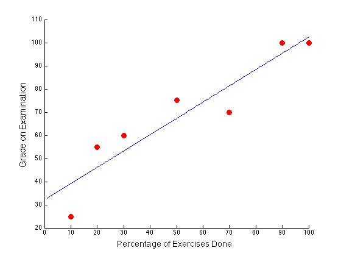

:::
		 
## Why the normal equations?

The normal equations can be derived using matrix calculus (demonstrated at the end of this section) but the solution of the normal equations also has a nice geometrical interpretation.  It involves the idea of orthogonal projection, a concept which will be useful for understanding future topics.

### Geometrical Interpretation
 
 In order for a system of equations, $\A\x=\b$ to have a solution, $\b$ must be a linear combination of columns of $\A$. That is simply the definition of matrix multiplication and equality. If $\A$ is $m\times n$ then
 $$\A\x=\b \Longrightarrow \b = x_1\A_1+x_2\A_2+\dots+x_n\A_n.$$
 As discussed in Chapter \@ref(linind), another way to say this is that $\b$ is in the $span$ of the columns of $\A$. The $span$ of the columns of $\A$ is called the **column space** of $\A$. In Least-Squares applications, the problem is that $\b$ is _not_ in the column space of $\A$. In essence, we want to find the vector $\hat{\b}$ that is _closest_ to $\b$ but exists in the column space of $\A$. Then we know that $\A\hat{\x}=\hat{\b}$ _does_ have a unique solution, and that the right hand side of the equation comes as close to the original data as possible. By multiplying both sides of the original equation by $\A^T$ what we are really doing is _projecting_ $\b$ orthogonally onto the column space of $\A$. We should think of the column space as a flat surface (perhaps a plane) in space, and $\b$ as a point that exists off of that flat surface. There are many ways to draw a line from a point to plane, but the shortest distance would always be travelled perpendicular (orthogonal) to the plane. You may recall from undergraduate calculus or physics that a _normal_ vector to a plane is a vector that is orthogonal to that plane. The normal equations, $\A^T\A\x=\A^T\b$, help us find the closest point to $\b$ that belongs to the column space of $\A$ by means of an orthogonal projection. This geometrical vantage point is depicted in Figure \@ref(fig:lsproj).

(ref:lsprojcap) The normal equations yield the vector $\hat{\b}$ in the column space of $\A$ which is closest to the original right hand side $\b$ vector.

<div class="figure" style="text-align: center">

<p class="caption">(\#fig:lsproj)(ref:lsprojcap)</p>
</div>

### Calculus Derivation

If you've taken a course in undergraduate calculus, you recall that finding minima and maxima of functions typically involves taking their derivatives and setting them equal to zero. That approach to the derivation of the normal equations will be fruitful, but we first need to understand how to take derivatives of matrix equations. Without teaching vector calculus, we will simply provide the following required formulas for matrix derivatives. If you've taken some undergraduate calculus, perhaps you'll see some parallels. 

While $\frac{\partial}{\partial \mathbf{x}}$ would commonly be the formula reported, we've swapped out the $\mathbf{x}$ for $\boldsymbol \beta$ in the table below in an effort to make our current problem more recognizable.

<table>
<tr>
<td> Condition
<td> Formula
<tr>
<td style="text-align:center"> $\mathbf{a}$ is not a function of $\boldsymbol \beta$
<td> $\frac{\partial \mathbf{a}}{\partial \boldsymbol \beta}= \mathbf{0}$
<tr>
<tr>
<td style="text-align:center"> $\mathbf{a}$ is not a function of $\boldsymbol \beta$
<td> $\frac{\partial \boldsymbol \beta}{\partial \boldsymbol \beta}= \mathbf{I}$
<tr>
<td style="text-align:center"> $\A$ is not a function of $\boldsymbol \beta$
<td> $\frac{\partial \boldsymbol \beta^T\mathbf{A}}{\partial \boldsymbol \beta}= \mathbf{A}^T$
<tr>
<td style="text-align:center"> $\A$ is not a function of $\boldsymbol \beta$
<td> $\frac{\partial \boldsymbol \beta^T\mathbf{A}\boldsymbol \beta}{\partial \boldsymbol \beta}= (\mathbf{A}+\mathbf{A}^T)\boldsymbol \beta$
<tr>
<td style="text-align:center"> $\A$ is not a function of $\boldsymbol \beta$ <br> $\A$ is symmetric
<td> $\frac{\partial \boldsymbol \beta^T\mathbf{A}\boldsymbol \beta}{\partial \boldsymbol \beta}= 2\mathbf{A}\boldsymbol \beta$
</td></tr>
</table>


Now let's start with our objective, which is to minimize sum of squared error, by writing it as the inner product of the vector of residuals with itself:
$$\boldsymbol \varepsilon^T \boldsymbol \varepsilon = (\mathbf{y}-\mathbf{X}\boldsymbol \beta)^T(\mathbf{y}-\mathbf{X}\boldsymbol \beta)$$
We'd like to minimize this function with respect to $\boldsymbol \beta$, our vector of unknowns. Thus, our procedure will be to take the derivative with respect to $\boldsymbol \beta$ and set it equal to 0. Note, on the second line of this proof, we take advantage of the fact that $\mathbf{a}^T\mathbf{b} = \mathbf{b}^T\mathbf{a}$ for all $\mathbf{a},\mathbf{b} \in \Re^n$

\begin{eqnarray*}
\frac{\partial}{\partial \boldsymbol \beta} \left(\boldsymbol \varepsilon^T \boldsymbol \varepsilon\right) 
&=&
\frac{\partial}{\partial \boldsymbol \beta} \left(\mathbf{y}^T\mathbf{y} - \mathbf{y}^T(\mathbf{X}\boldsymbol \beta) - (\mathbf{X}\boldsymbol \beta)^T\mathbf{y} + (\mathbf{X}\boldsymbol \beta)^T(\mathbf{X}\boldsymbol \beta)\right)\\
&=&
\frac{\partial}{\partial \boldsymbol \beta} \left(\mathbf{y}^T\mathbf{y} -2\mathbf{y}^T(\mathbf{X}\boldsymbol \beta) + \boldsymbol \beta\mathbf{X}^T\mathbf{X}  \boldsymbol \beta \right)\\
&=& 0 - 2\mathbf{X}^Ty + 2\mathbf{X}^T\mathbf{X}\boldsymbol \beta
\end{eqnarray*}

Setting the last line equal to zero and solving for $\boldsymbol \beta$ completes the derivation. $\Box$

In Chapter \@ref(lsapp), we'll take a deeper dive into the utility of least squares for applied data science. 

<!--chapter:end:029-OLStext.Rmd-->

# Applications of Least Squares {#lsapp}


## Simple Linear Regression
### Cars Data

The `cars' dataset is included in the datasets package. This dataset contains observations of speed and stopping distance for 50 cars. We can take a look at the summary statistics by using the **summary** function.


```r
summary(cars)
```

```
##      speed           dist       
##  Min.   : 4.0   Min.   :  2.00  
##  1st Qu.:12.0   1st Qu.: 26.00  
##  Median :15.0   Median : 36.00  
##  Mean   :15.4   Mean   : 42.98  
##  3rd Qu.:19.0   3rd Qu.: 56.00  
##  Max.   :25.0   Max.   :120.00
```

We can plot these two variables as follows:


```r
plot(cars)
```


### Setting up the Normal Equations

Let's set up a system of equations
$$\mathbf{X}\boldsymbol\beta=\mathbf{y}$$
to create the model
$$stopping\_distance=\beta_0+\beta_1speed.$$

To do this, we need a design matrix $\mathbf{X}$ containing a column of ones for the intercept term and a column containing the speed variable. We also need a vector $\mathbf{y}$ containing the corresponding stopping distances.

#### The `model.matrix()` function {-}

The ``` model.matrix()``` function will create the design or modeling matrix $\mathbf{X}$ for us. This function takes a formula and data matrix as input and exports the matrix that we represent as $\mathbf{X}$ in the normal equations. For datasets with categorical (factor) inputs, this function would also create dummy variables for each level, leaving out a reference level by default. You can override the default to leave out a reference level (when you override this default, you perform **one-hot-encoding** on said categorical variable) by including the following option as a third input to the function, where `df` is the name of your data frame: <br>
``` contrasts.arg = lapply(df[,sapply(df,is.factor) ], contrasts, contrasts=FALSE ```

For an exact example, see the commented out code in the chunk below. There are no factors in the `cars` data, so the code may not even run, but I wanted to provide the line of code necessary for this task, as it is one that we use quite frequently for clustering, PCA, or machine learning!


```r
# Create matrix X and label the columns
X=model.matrix(dist~speed, data=cars)
# Create vector y and label the column
y=cars$dist


# CODE TO PERFORM ONE-HOT ENCODING (NO REFERENCE LEVEL FOR CATEGORICAL DUMMIES)
# X=model.matrix(dist~speed, data=cars, contrasts.arg = lapply(cars[,sapply(cars,is.factor) ], contrasts, contrasts=FALSE) 
```

Let's print the first 10 rows of each to see what we did:


```r
# Show first 10 rows, all columns. To show only observations 2,4, and 7, for
# example, the code would be X[c(2,4,7), ]
X[1:10, ]
```

```
##    (Intercept) speed
## 1            1     4
## 2            1     4
## 3            1     7
## 4            1     7
## 5            1     8
## 6            1     9
## 7            1    10
## 8            1    10
## 9            1    10
## 10           1    11
```

```r
y[1:10]
```

```
##  [1]  2 10  4 22 16 10 18 26 34 17
```

### Solving for Parameter Estimates and Statistics

Now lets find our parameter estimates by solving the normal equations,
$$\mathbf{X}^T\mathbf{X}\boldsymbol\beta = \mathbf{X}^T\mathbf{y}$$
using the built in **solve** function. To solve the system $\mathbf{A}\mathbf{x}=\mathbf{b}$ we'd use ``` solve(A,b)```.


```r
(beta=solve(t(X) %*% X ,t(X)%*%y))
```

```
##                   [,1]
## (Intercept) -17.579095
## speed         3.932409
```

At the same time we can compute the residuals,
$$\mathbf{r}=\mathbf{y}-\mathbf{\hat{y}}$$
the total sum of squares (SST),
$$\sum_{i=1}^n (y-\bar{y})^2=(\mathbf{y}-\mathbf{\bar{y}})^T(\mathbf{y}-\mathbf{\bar{y}})=\|\mathbf{y}-\mathbf{\bar{y}}\|^2$$
the regression sum of squares (SSR or SSM)
$$\sum_{i=1}^n (\hat{y}-\bar{y})^2=(\mathbf{\hat{y}}-\mathbf{\bar{y}})^T(\mathbf{\hat{y}}-\mathbf{\bar{y}})=\|\mathbf{\hat{y}}-\mathbf{\bar{y}}\|^2$$
the residual sum of squares (SSE)
$$\sum_{i=1}^n r_i =\mathbf{r}^T\mathbf{r}=\|\mathbf{r}\|^2$$
and the unbiased estimator of the variance of the residuals, using the model degrees of freedom which is $n-2=48$:
$$\widehat{\sigma_{\varepsilon}}^2 =\frac{SSE}{d.f.} = \frac{\|\mathbf{r}\|^2}{48}$$

Then $R^2$:
$$R^2 = \frac{SSR}{SST}$$

We can also compute the standard error of $\widehat{\boldsymbol\beta}$ since

\begin{eqnarray*}
\widehat{\boldsymbol\beta} &=& (\mathbf{X}^T\mathbf{X})^{-1}\mathbf{X}^T\mathbf{y}\\
var(\widehat{\boldsymbol\beta})&=&var((\mathbf{X}^T\mathbf{X})^{-1}\mathbf{X}^T\mathbf{y})\\
 &=&(\mathbf{X}^T\mathbf{X})^{-1}\mathbf{X}^T var(\mathbf{y}) \mathbf{X}(\mathbf{X}^T\mathbf{X})^{-1} \\
 &=&(\mathbf{X}^T\mathbf{X})^{-1}\mathbf{X}^T (\widehat{\sigma_{\varepsilon}}^2) \mathbf{X}(\mathbf{X}^T\mathbf{X})^{-1} \\
  &=& \widehat{\sigma_{\varepsilon}}^2 (\mathbf{X}^T\mathbf{X})^{-1}\mathbf{X}^T\mathbf{X}(\mathbf{X}^T\mathbf{X})^{-1} \\
  &=& \widehat{\sigma_{\varepsilon}}^2(\mathbf{X}^T\mathbf{X})^{-1}
\end{eqnarray*}

The variances of each $\widehat\beta$ are given by the diagonal elements of their covariance matrix (see Definition \@ref(def:covariancedef)), and the standard errors of each $\widehat\beta$ are thus obtained by taking the square roots of these diagonal elements:
$$s.e.(\widehat{\beta_i})=\sqrt{\widehat{\sigma_{\varepsilon}}[(\mathbf{X}^T\mathbf{X})^{-1}]_{ii}}$$


```r
meany=mean(y)
XXinv=solve(t(X)%*%X)
yhat=X%*%XXinv%*%t(X)%*%y
resid=y-yhat
SStotal=norm(y-meany,type="2")^2
### OR  SStotal=t(y-meany)%*%(y-meany)
SSreg=norm(yhat-meany,type="2")^2
### OR  SSreg=t(yhat-meany)%*%(yhat-meany)
SSresid=norm(resid,type="2")^2
### OR SSresid=t(resid)%*%resid
Rsquared=SSreg/SStotal
StdErrorResiduals=norm(resid/sqrt(48), type="2") #=sqrt(SSresid/48)
CovBeta=SSresid*XXinv/48
StdErrorIntercept = sqrt(CovBeta[1,1])
StdErrorSlope = sqrt(CovBeta[2,2])
```


```
## [1] "Rsquared: 0.651079380758252"
```

```
## [1] "SSresid: 11353.5210510949"
```

```
## [1] "SSmodel: 21185.4589489052"
```

```
## [1] "StdErrorResiduals: 15.3795867488199"
```

```
## [1] "StdErrorIntercept: 6.75844016937923"
```

```
## [1] "StdErrorIntercept: 0.415512776657122"
```

Let's plot our regression line over the original data:


```r
plot(cars)
abline(beta[1],beta[2],col='blue')
```


### OLS in R via ```lm()```

Finally, let's compare our results to the built in linear model solver, ``` lm()```:


```r
fit = lm(dist ~ speed, data=cars)
summary(fit)
```

```
## 
## Call:
## lm(formula = dist ~ speed, data = cars)
## 
## Residuals:
##     Min      1Q  Median      3Q     Max 
## -29.069  -9.525  -2.272   9.215  43.201 
## 
## Coefficients:
##             Estimate Std. Error t value Pr(>|t|)    
## (Intercept) -17.5791     6.7584  -2.601   0.0123 *  
## speed         3.9324     0.4155   9.464 1.49e-12 ***
## ---
## Signif. codes:  0 '***' 0.001 '**' 0.01 '*' 0.05 '.' 0.1 ' ' 1
## 
## Residual standard error: 15.38 on 48 degrees of freedom
## Multiple R-squared:  0.6511,	Adjusted R-squared:  0.6438 
## F-statistic: 89.57 on 1 and 48 DF,  p-value: 1.49e-12
```

```r
anova(fit)
```

```
## Analysis of Variance Table
## 
## Response: dist
##           Df Sum Sq Mean Sq F value   Pr(>F)    
## speed      1  21186 21185.5  89.567 1.49e-12 ***
## Residuals 48  11354   236.5                     
## ---
## Signif. codes:  0 '***' 0.001 '**' 0.01 '*' 0.05 '.' 0.1 ' ' 1
```

## Multiple Linear Regression

### Bike Sharing Dataset

<!--chapter:end:0299-OLS.Rmd-->

# Eigenvalues and Eigenvectors {#eigen}

Eigenvalues and eigenvectors are (scalar, vector)-pairs that form the "essence" of a matrix. The prefix eigen- is adopted from the German word _eigen_ which means "characteristic, inherent, own" and was introduced by David Hilbert in 1904, but the study of these characteristic directions and magnitudes dates back to Euler's study of the rotational motion of rigid bodies in the $18^{th}$ century.

:::{.definition name='Eigenvalues and Eigenvectors' #eigsdef}
For a square matrix $\A_{n\times n}$, a scalar $\lambda$ is called an __eigenvalue__ of $\A$ if there is a nonzero vector $\x$ such that $$\A\x=\lambda\x.$$ Such a vector, $\x$ is called an __eigenvector__ of $\A$ corresponding to the __eigenvalue__ $\lambda$. We sometimes refer to the pair $(\lambda,\x)$ as an __eigenpair.__
:::

Eigenvalues and eigenvectors have numerous applications from graphic design to quantum mechanics to geology to epidemiology. The main application of note for data scientists is Principal Component Analysis, but we will also see eigenvalue equations used in social network analysis to determine important players in a network and to detect communities in the network.  Before we dive into those applications, let's first get a handle on the definition by exploring some examples.

:::{.example name='Eigenvalues and Eigenvectors' #eig1}
Determine whether $\x=\pm 1\\1 \mp$ is an eigenvector of $\A=\pm 3 & 1 \\1&3 \mp$ and if so, find the corresponding eigenvalue.\\
To determine whether $\x$ is an eigenvector, we want to compute $\A\x$ and observe whether the result is a multiple of $\x$. If this is the case, then the multiplication factor is the corresponding eigenvalue:
$$\A\x=\pm  3 & 1 \\1&3 \mp \pm 1\\1 \mp =\pm 4\\4 \mp=4\pm 1\\1 \mp$$
From this it follows that $\x$ _is_ an eigenvector of $\A$ and the corresponding eigenvalue is $\lambda = 4$.\\

Is the vector $\y=\pm 2\\2 \mp$ an eigenvector? 
$$\A\y=\pm  3 & 1 \\1&3 \mp \pm 2\\2 \mp =\pm 8\\8 \mp=4\pm 2\\2 \mp = 4\y$$
Yes, it is and it corresponds to the _same_ eigenvalue, $\lambda=4$
:::

Example \@ref(exm:eig1) shows a very important property of eigenvalue-eigenvector pairs. If $(\lambda,\x)$ is an eigenpair then any scalar multiple of $\x$ is also an eigenvector corresponding to $\lambda$. To see this, let $(\lambda,\x)$ be an eigenpair for a matrix $\A$ (which means that $\A\x=\lambda\x$) and let $\y=\alpha\x$ be any scalar multiple of $\x$. Then we have,
$$\A\y = \A(\alpha\x)=\alpha(\A\x) = \alpha(\lambda\x) = \lambda(\alpha\x)=\lambda\y$$
which shows that $\y$ (or any scalar multiple of $\x$) is also an eigenvector associated with the eigenvalue $\lambda$.

Thus, for each eigenvalue we have infinitely many eigenvectors. In the preceding example, the eigenvectors associated with $\lambda = 4$ will be scalar multiples of $\x=\pm 1\\1 \mp$. You may recall from Chapter \@ref(linind) that the set of all scalar multiples of $\x$ is denoted $span(\x)$.  The $span(\x)$ in this example represents the __eigenspace__ of $\lambda$.
_Note: when using software to compute eigenvectors, it is standard practice for the software to provide the normalized/unit eigenvector._

In some situations, an eigenvalue can have multiple eigenvectors which are linearly independent. The number of linearly independent eigenvectors associated with an eigenvalue is called the __geometric multiplicity__ of the eigenvalue. Example \@ref(exm:eig2) clarifies this concept.

:::{.example name='Geometric Multiplicity' #eig2}
Consider the matrix $\A=\pm 3 & 0 \\0 & 3 \mp$. It should be straightforward to see that $\x_1 =\pm 1 \\0 \mp$ and $\x_2=\pm 0\\1\mp$ are both eigenvectors corresponding to the eigenvalue $\lambda = 3$. $\x_1$ and $\x_2$ are linearly independent, therefore the geometric multiplicity of $\lambda=3$ is 2.\

What happens if we take a linear combination of $\x_1$ and $\x_2$? Is that also an eigenvector?
Consider $\y=\pm 2 \\ 3 \mp = 2\x_1+3\x_2$. Then 
$$\A\y = \pm 3 & 0 \\0 & 3 \mp \pm 2 \\ 3 \mp = \pm 6 \\ 9 \mp = 3 \pm 2\\3\mp = 3\y$$
shows that $\y$ is also an eigenvector associated with $\lambda=3$.

The __eigenspace__ corresponding to $\lambda=3$ is the set of all linear combinations of $\x_1$ and $\x_2$, i.e. the $span(\x_1,\x_2)$.
:::

We can generalize the result that we saw in Example \@ref(exm:eig2) for any square matrix and any geometric multiplicity. Let $\A_{n\times n}$ have an eigenvalue $\lambda$ with geometric multiplicity $k$. This means there are $k$ linearly independent eigenvectors, $\x_1,\x_2,\dots,\x_k$ such that $\A\x_i=\lambda\x_i$ for each eigenvector $\x_i$.  Now if we let $\y$ be a vector in the $span(\x_1,\x_2,\dots,\x_k)$ then $\y$ is some linear combination of the $\x_i$'s:
$$\y=\alpha_1\x_2+\alpha_2\x_2+\dots+\alpha_k\x_k$$
Observe what happens when we multiply $\y$ by $\A$:
\begin{eqnarray*}
\A\y &=&\A(\alpha_1\x_2+\alpha_2\x_2+\dots+\alpha_k\x_k) \\  
&=& \alpha_1(\A\x_1)+\alpha_2(\A\x_2)+\dots +\alpha_k(\A\x_k) \\ 
&=& \alpha_1(\lambda\x_1)+\alpha_2(\lambda\x_2)+\dots +\alpha_k(\lambda\x_k) \\ 
&=& \lambda(\alpha_1\x_2+\alpha_2\x_2+\dots+\alpha_k\x_k) \\
&=& \lambda\y
\end{eqnarray*}
which shows that $\y$ (or any vector in the $span(\x_1,\x_2,\dots,\x_k)$) is an eigenvector of $\A$ corresponding to $\lambda$.

This proof allows us to formally define the concept of an eigenspace.

:::{.definition name='Eigenspace' #eigenspace}
Let $\A$ be a square matrix and let $\lambda$ be an eigenvalue of $\A$. The set of all eigenvectors corresponding to $\lambda$, together with the zero vector, is called the __eigenspace__ of $\lambda$.  The number of basis vectors required to form the eigenspace is called the __geometric multiplicity__ of $\lambda$.
:::

Now, let's attempt the eigenvalue problem from the other side. Given an eigenvalue, we will find the corresponding eigenspace in Example \@ref(exm:eig3).

:::{.example name='Eigenvalues and Eigenvectors' #eig3}
Show that $\lambda=5$ is an eigenvalue of $\A=\pm 1 & 2 \\4&3 \mp$ and determine the eigenspace of $\lambda=5$.

Attempting the problem from this angle requires slightly more work. We want to find a vector $\x$ such that $\A\x=5\x$. Setting this up, we have:
$$\A\x = 5\x.$$
What we want to do is move both terms to one side and factor out the vector $x$. In order to do this, we must use an identity matrix, otherwise the equation wouldn't make sense (we'd be subtracting a constant from a matrix). 
\begin{eqnarray*}
\A\x-5\x &=& \bo{0}\\
(\A-5\bo{I})\x &=& \bo{0} \\
\left( \pm 1 & 2 \\4&3 \mp - \pm 5 & 0 \\ 0 & 5 \mp \right) \pm x_1 \\ x_2 \mp &=& \pm 0 \\0 \mp \\
\pm -4 & 2\\ 4 & -2 \mp  \pm x_1 \\ x_2 \mp &=& \pm 0 \\0 \mp \\
\end{eqnarray*}
Clearly, the matrix $\A-\lambda\bo{I}$ is singular (i.e. does not have linearly independent rows/columns). This will always be the case by the definition $\A\x=\lambda\x$, and is often used as an alternative definition.\\
In order to solve this homogeneous system of equations, we use Gaussian elimination:
$$\left(\begin{array}{rr|r}
 -4 & 2 & 0 \\4 & -2 & 0 \end{array}\right)\longrightarrow\left(\begin{array}{rr|r} 1 & -\frac{1}{2} & 0 \\0 & 0 & 0 \end{array}\right)$$
This implies that any vector $\x$ for which $x_1-\frac{1}{2}\x_2=0$ satisfies the eigenvector equation. We can pick any such vector, for example $\x=\pm 1\\2\mp$, and say that the eigenspace of $\lambda=5$ is
$$span\left\lbrace\pm 1\\2 \mp\right\rbrace$$
:::

If we didn't know either an eigenvalue or eigenvector of $\A$ and instead wanted to find both, we would first find eigenvalues by determining all possible $\lambda$ such that $\A-\lambda\bo{I}$ is singular and then find the associated eigenvectors. There are some tricks which allow us to do this by hand for $2\times 2$ and $3\times 3$ matrices, but after that the computation time is unworthy of the effort. Now that we have a good understanding of how to interpret eigenvalues and eigenvectors algebraically, let's take a look at some of the things that they can do, starting with one important fact.

:::{.definition name='Eigenvalues and the Trace of a Matrix' #eigtrace}
Let $\A$ be an $n\times n$ matrix with eigenvalues $\lambda_1,\lambda_2,\dots,\lambda_n$. Then the sum of the eigenvalues is equal to the trace of the matrix (recall that the trace of a matrix is the sum of its diagonal elements).
$$Trace(\A)=\sum_{i=1}^n \lambda_i.$$
:::

:::{.example name='Trace of Covariance Matrix' #tracecov}
Suppose that we had a collection of $n$ observations on $p$ variables, $\x_1,\x_2,\dots,\x_p$. After centering the data to have zero mean, we can compute the sample variances as:
$$var(\x_i)=\frac{1}{n-1}\x_i^T\x_i =\|\x_i\|^2$$
These variances form the diagonal elements of the sample covariance matrix,
$$\ssigma = \frac{1}{n-1}\X^T\X$$
Thus, the total variance of this data is
$$\frac{1}{n-1}\sum_{i=1}^n \|\x_i\|^2 = Trace(\ssigma) = \sum_{i=1}^n \lambda_i.$$

In other words, the sum of the eigenvalues of a covariance matrix provides the total variance in the variables $\x_1,\dots,\x_p$.
:::

## Diagonalization
Let's take another look at Example \@ref(exm:eig3). We already showed that $\lambda_1=5$ and $\v_1=\pm 1\\2\mp$ is an eigenpair for the matrix $\A=\pm 1 & 2 \\4&3 \mp$. You may verify that $\lambda_2=-1$ and $\v_2=\pm 1\\-1 \mp$ is another eigenpair. Suppose we create a matrix of eigenvectors:
$$\V=(\v_1,\v_2) = \pm 1&1\\2&-1 \mp$$
and a diagonal matrix containing the corresponding eigenvalues:
$$\D=\pm 5 & 0 \\ 0 & -1 \mp$$
Then it is easy to verify that $\A\V=\V\D$:
\begin{eqnarray*}
\A\V &=& \pm 1 & 2 \\4&3 \mp \pm 1&1\\2&-1 \mp\\
		&=& \pm 5&-1\\10&1 \mp\\
		&=&  \pm 1&1\\2&-1 \mp\pm 5 & 0 \\ 0 & -1 \mp\\
		&=&\V\D
\end{eqnarray*}
If the columns of $\V$ are linearly independent, which they are in this case, we can write:
$$\V^{-1}\A\V = \D$$

What we have just done is develop a way to transform a matrix $\A$ into a diagonal matrix $\D$.  This is known as __diagonalization.__

:::{.definition name='Diagonalizable' #diagable}
An $n\times n$ matrix $\A$ is said to be __diagonalizable__ if there exists an invertible matrix $\bP$ and a diagonal matrix $\D$ such that
$$\bP^{-1}\A\bP=\D$$
This is possible if and only if the matrix $\A$ has $n$ linearly independent eigenvectors (known as a _complete set of eigenvectors_). The matrix $\bP$ is then the matrix of eigenvectors and the matrix $\D$ contains the corresponding eigenvalues on the diagonal.
:::

Determining whether or not a matrix $\A_{n\times n}$ is diagonalizable is a little tricky. Having $rank(\A)=n$ is _not_ a sufficient condition for having $n$ linearly independent eigenvectors. The following matrix stands as a counter example:
$$\A=\pm -3& 1 & -3 \\20& 3 & 10 \\2& -2 & 4 \mp$$
This matrix has full rank but only two linearly independent eigenvectors. Fortunately, for our primary application of diagonalization, we will be dealing with a symmetric matrix, which can always be diagonalized. In fact, symmetric matrices have an additional property which makes this diagonalization particularly nice, as we will see in Chapter \@ref(pca).

## Geometric Interpretation of Eigenvalues and Eigenvectors
Since any scalar multiple of an eigenvector is still an eigenvector, let's consider for the present discussion unit eigenvectors $\x$ of a square matrix $\A$ - those with length $\|\x\|=1$. By the definition, we know that
$$\A\x = \lambda\x$$
We know that geometrically, if we multiply $\x$ by $\A$, the resulting vector points in the same direction as $\x$. Geometrically, it turns out that multiplying the unit circle or unit sphere by a matrix $\A$ carves out an ellipse, or an ellipsoid. We can see eigenvectors visually by watching how multiplication by a matrix $\A$ changes the unit vectors. Figure \@ref(fig:eigenarrows) illustrates this. The blue arrows represent (a sampling of) the unit circle, all vectors $\x$ for which $\|\x\|=1$. The red arrows represent the image of the blue arrows after multiplication by $\A$, or $\A\x$ for each vector $\x$.  We can see how almost every vector changes direction when multiplied by $\A$, except the eigenvector directions which are marked in black.  Such a picture provides a nice geometrical interpretation of eigenvectors for a general matrix, but we will see in Chapter \@ref(pca) just how powerful these eigenvector directions are when we look at symmetric matrix.

(ref:eigenarrowscap) Visualizing eigenvectors (in black) using the image (in red) of the unit sphere (in blue) after multiplication by $\A$.

<div class="figure" style="text-align: center">
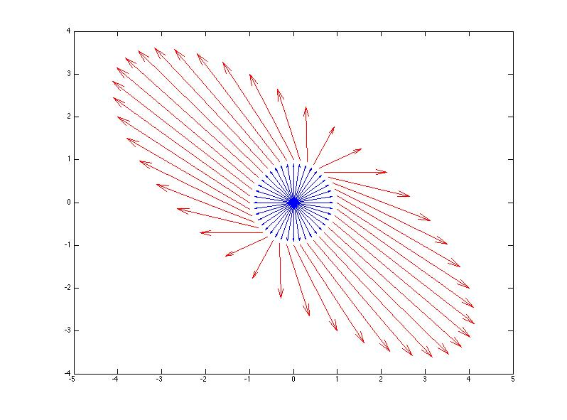
<p class="caption">(\#fig:eigenarrows)(ref:eigenarrowscap)</p>
</div>


## Exercises
<ol>
<li> Show that $\v$ is an eigenvector of $\A$ and find the corresponding eigenvalue:
<ol style="list-style-type:lower-alpha">
<li> $\A=\pm 1 & 2 \\2 & 1 \mp \quad \v=\pm 3\\-3 \mp $
<li> $\A=\pm -1 & 1 \\6 & 0 \mp \quad \v=\pm 1\\-2 \mp $
<li> $\A=\pm 4 & -2 \\5 & -7 \mp \quad \v=\pm 4\\2 \mp $
</ol>
<li> Show that $\lambda$ is an eigenvalue of $\A$ and list two eigenvectors corresponding to this eigenvalue:
<ol style="list-style-type:lower-alpha">
<li>$\A=\pm 0& 4\\-1&5\mp \quad \lambda = 4$
<li> $\A=\pm 0& 4\\-1&5\mp \quad \lambda = 1$
</ol>
<li> Based on the eigenvectors you found in exercises 2, can the matrix $\A$ be diagonalized? Why or why not? If diagonalization is possible, explain how it would be done.
<li> Can a rectangular matrix have eigenvalues/eigenvectors?
</ol>

<!--chapter:end:02999-eigen.Rmd-->

# Principal Components Analysis {#pca}

We now have the tools necessary to discuss one of the most important concepts in mathematical statistics: **Principal Components Analysis (PCA)**. Before we dive into the mathematical details, we'll first introduce an effective analogy to develop our intuition.

## God's Flashlight

Imagine your data as a multidimensional cloud of points in space. God (however you conceive that) has a flashlight and can project this data at a right angle down onto a flat surface - the flashlight just casts a point shadow, the shadows don’t get bigger like on Earth. The center of the flat surface is fixed at the center of the data, so it's more like 2 flashlights, one from below the surface, one from above, both at right angles. We could rotate this flashlight/flat surface setup around and get infinitely many projections of the data from different perspectives. The PCA projection is the _one_ with the most variance, which indicates that it _contains the most information from your original data_. It's also the projection that is _closest to the original data_ in the Euclidean or sum-of-squared-error sense (PCA gives the rank k approximation to your data with the lowest possible error). Once projected, the axes of the projection (drawn so that the “first” axis points in the direction of greatest variance) are your principal components, providing the orthogonal directions of maximal variance. 

This projection we've just described is actually the projection of the data onto a _hyperplane_, which entails a rank reduction of 1, though you might have imagined it as a projection onto a 2-dimensional plane. The great thing about PCA is that both of those visuals are appropriate - we can project the data onto any dimensional subspace of the original from 2 to rank($\X$)-1. 

## PCA Details

PCA involves the analysis of eigenvalues and eigenvectors of the covariance or the correlation matrix. Its development relies on the following important facts:
 
:::{.theorem name='Diagonalization of Symmetric Matrices' #eigsym}
All $n\times n$ real valued symmetric matrices (like the covariance and correlation matrix) have two very important properties:

1. They have a complete set of $n$ linearly independent eigenvectors, $\{\v_1,\dots,\v_n\}$, corresponding to eigenvalues $$\lambda_1 \geq \lambda_2 \geq\dots\geq \lambda_n.$$
2. Furthermore, these eigenvectors can be always be chosen to be _orthonormal_ so that if $\V=[\v_1|\dots|\v_n]$ then
$$\V^{T}\V=\bo{I}$$
or equivalently, $\V^{-1}=\V^{T}$.

Letting $\D$ be a diagonal matrix with $D_{ii}=\lambda_i$, by the definition of eigenvalues and eigenvectors we have for any symmetric matrix $\bo{S}$,
$$\bo{S}\V=\V\D$$
Thus, any symmetric matrix $\bo{S}$ can be diagonalized in the following way:
$$\V^{T}\bo{S}\V=\D$$
Covariance and Correlation matrices (when there is no perfect multicollinearity in variables) have the additional property that all of their eigenvalues are positive (nonzero). They are _positive definite_ matrices.
:::

Now that we know we have a complete set of eigenvectors, it is common to order them according to the magnitude of their corresponding eigenvalues. From here on out, we will use $(\lambda_1,\v_1)$ to represent the __largest__ eigenvalue of a matrix and its corresponding eigenvector. When working with a covariance or correlation matrix, this eigenvector associated with the largest eigenvalue is called the **first principal component** and points in the direction for which the variance of the data is maximal.  Example \@ref(exm:coveigs) illustrates this point.

:::{.example name='Eigenvectors of the Covariance Matrix' #coveigs}
Suppose we have a matrix of data for 10 individuals on 2 variables, $\x_1$ and $\x_2$. Plotted on a plane, the data appears as follows:

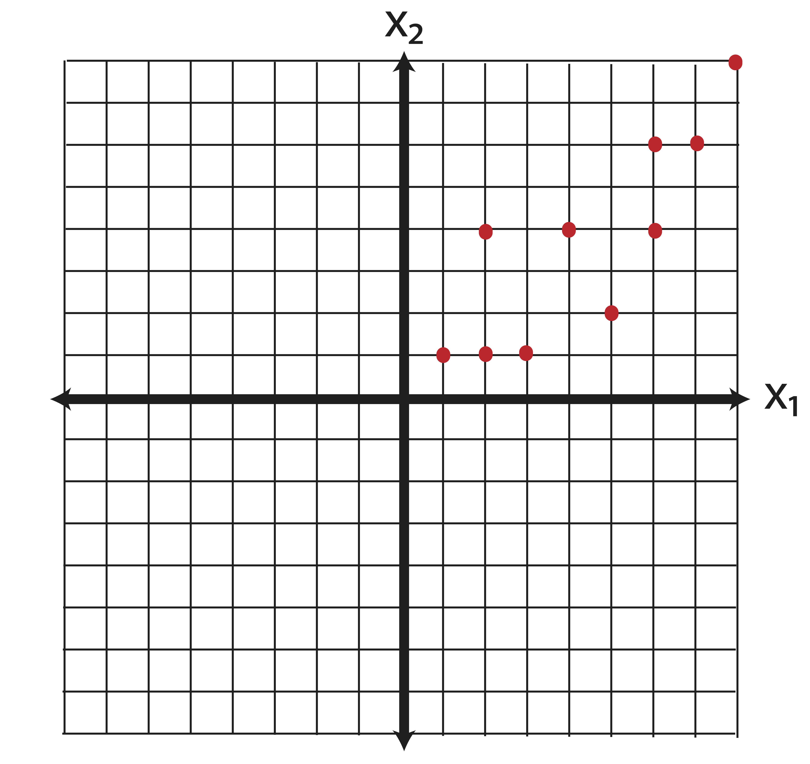
  
Our data matrix for these points is:
$$\X=\pm 1 & 1\\2&1\\2&4\\3&1\\4&4\\5&2\\6&4\\6&6\\7&6\\8&8 \mp$$
the means of the variables in $\X$ are:
$$\bar{\x}=\pm 4.4 \\ 3.7 \mp. $$
When thinking about variance directions, our first step should be to center the data so that it has mean zero. Eigenvectors measure the spread of data around the origin. Variance measures spread of data around the mean. Thus, we need to equate the mean with the origin. To center the data, we simply compute 
$$\X_c=\X-\e\bar{\x}^T = \pm 1 & 1\\2&1\\2&4\\3&1\\4&4\\5&2\\6&4\\6&6\\7&6\\8&8 \mp - \pm 4.4 & 3.7 \\4.4 & 3.7 \\4.4 & 3.7 \\4.4 & 3.7 \\4.4 & 3.7 \\4.4 & 3.7 \\4.4 & 3.7 \\4.4 & 3.7 \\4.4 & 3.7 \\4.4 & 3.7  \mp = \pm -3.4&-2.7\\-2.4&-2.7\\-2.4& 0.3\\-1.4&-2.7\\ -0.4&  0.3\\0.6&-1.7\\1.6& 0.3\\1.6& 2.3\\2.6& 2.3\\3.6&  4.3\mp.$$
Examining the new centered data, we find that we've only translated our data in the plane - we haven't distorted it in any fashion.

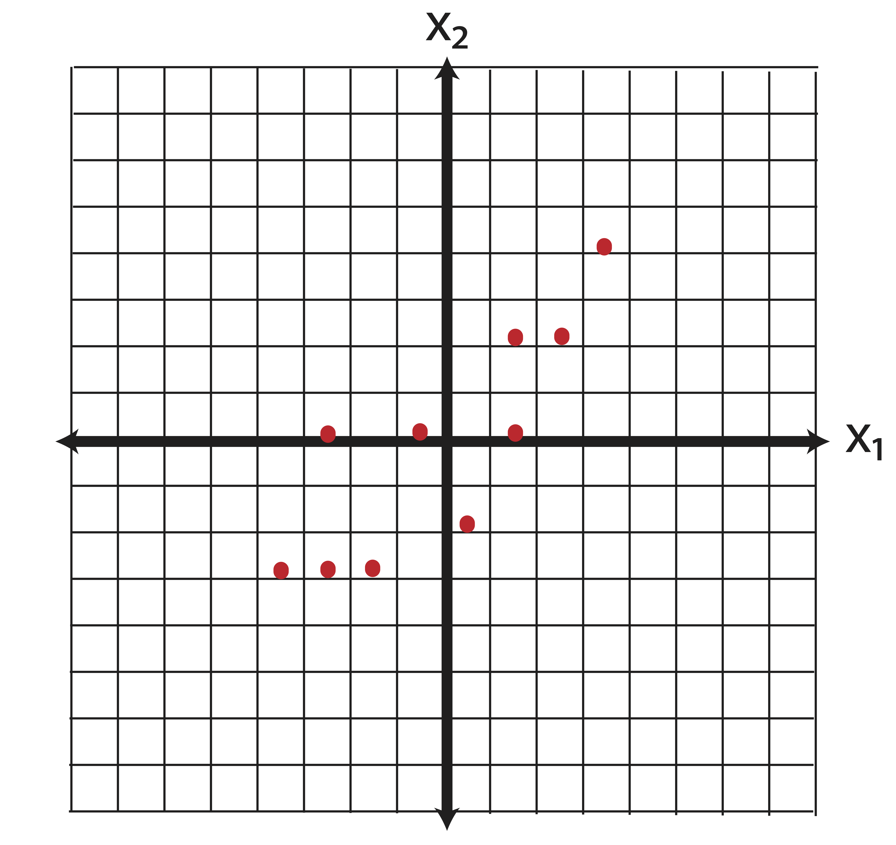

Thus the covariance matrix is:
$$\ssigma=\frac{1}{9}(\X_c^T\X_c)= \pm 5.6 & 4.8\\4.8&6.0111 \mp $$
The eigenvalue and eigenvector pairs of $\ssigma$ are (rounded to 2 decimal places) as follows:
$$(\lambda_1,\v_1)=\left( 10.6100 ,  \begin{bmatrix} 0.69 \\ 0.72 \end{bmatrix}\right) \mbox{  and  } (\lambda_2,\v_2)= \left( 1.0012,\begin{bmatrix}-0.72\\0.69 \end{bmatrix}\right)$$
Let's plot the eigenvector directions on the same graph:


The eigenvector $\v_1$ is called the **first principal component**. It is the direction along which the variance of the data is maximal. The eigenvector $\v_2$ is the **second principal component**.  In general, the second principal component is the direction, orthogonal to the first, along which the variance of the data is maximal (in two dimensions, there is only one direction possible.) 
:::

Why is this important? Let's consider what we've just done. We started with two variables, $\x_1$ and $\x_2$, which appeared to be correlated. We then derived *new variables*, $\v_1$ and $\v_2$, which are linear combinations of the original variables:
\begin{eqnarray}
\v_1 &=& 0.69\x_1 + 0.72\x_2 \\
(\#eq:pcacomb)
\v_2 &=& -0.72\x_1 + 0.69\x_2
\end{eqnarray}
 These new variables are completely uncorrelated. To see this, let's represent our data according to the new variables - i.e. let's change the basis from $\mathcal{B}_1=[\x_1,\x_2]$ to $\mathcal{B}_2=[\v_1,\v_2]$.  
 
:::{.example name='The Principal Component Basis' #pcabasis}
Let's express our data in the basis defined by the principal components. We want to find coordinates (in a $2\times 10$ matrix $\A$) such that our original (centered) data can be expressed in terms of principal components. This is done by solving for $\A$ in the following equation (see Chapter \@ref(basis) and note that the _rows_ of $\X$ define the points rather than the columns):
\begin{eqnarray}
 \X_c &=& \A \V^T \\
 \pm -3.4&-2.7\\-2.4&-2.7\\-2.4& 0.3\\-1.4&-2.7\\ -0.4&  0.3\\0.6&-1.7\\1.6& 0.3\\1.6& 2.3\\2.6& 2.3\\3.6&  4.3 \mp &=&  \pm a_{11} & a_{12} \\ a_{21} & a_{22} \\ a_{31} & a_{32}\\ a_{41} & a_{42}\\ a_{51} & a_{52}\\ a_{61} & a_{62}\\ a_{71} & a_{72}\\ a_{81} & a_{82}\\ a_{91} & a_{92}\\ a_{10,1} & a_{10,2} \mp \pm \v_1^T \\ \v_2^T \mp
\end{eqnarray}
 
 Conveniently, our new basis is orthonormal meaning that $\V$ is an orthogonal matrix, so
 $$\A=\X\V .$$
 The new data coordinates reflect a simple rotation of the data around the origin:
 
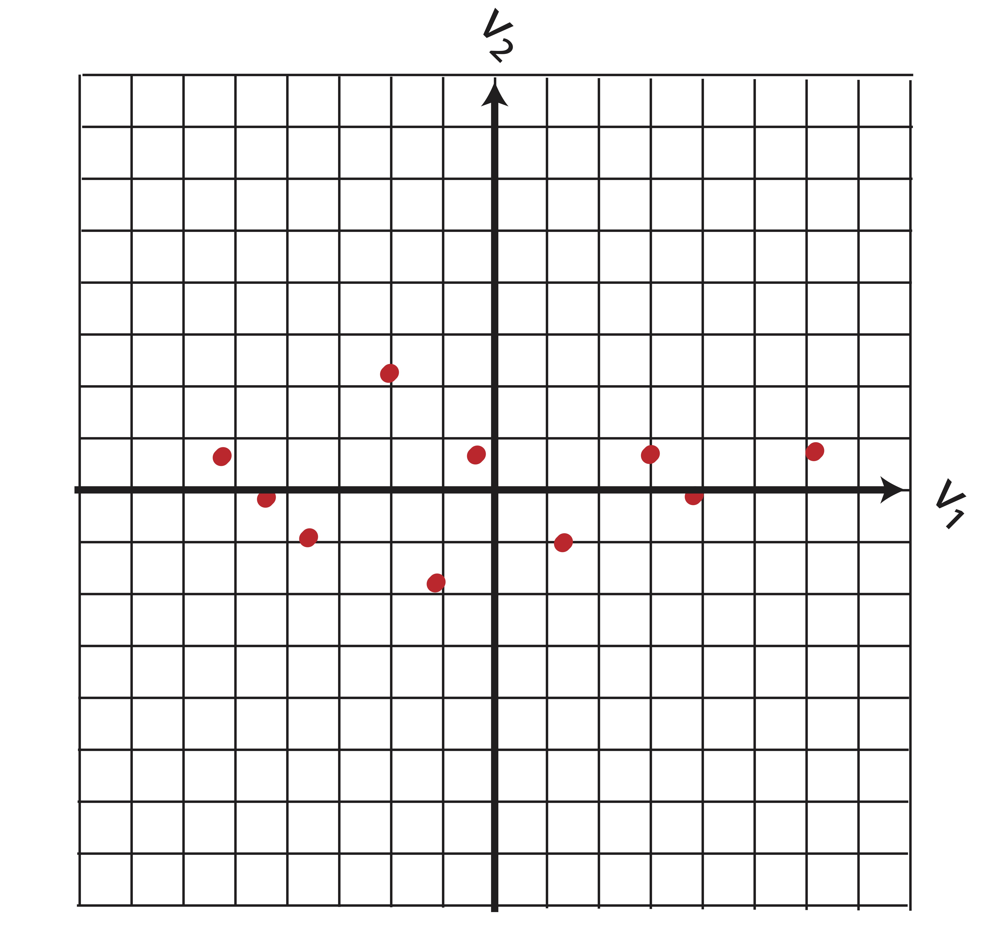
 
Visually, we can see that the new variables are uncorrelated. You may wish to confirm this by calculating the covariance. In fact, we can do this in a general sense. If $\A=\X_c\V$ is our new data, then the covariance matrix is diagonal:
\begin{eqnarray*}
\ssigma_A &=& \frac{1}{n-1}\A^T\A  \\ 
	&=& \frac{1}{n-1}(\X_c\V)^T(\X_c\V) \\
	&=& \frac{1}{n-1}\V^T((\X_c^T\X_c)\V\\
	&=&\frac{1}{n-1}\V^T((n-1)\ssigma_X)\V\\
	&=&\V^T(\ssigma_X)\V\\
	&=&\V^T(\V\D\V^T)\V\\
	&=& \D
\end{eqnarray*}
Where $\ssigma_X=\V\D\V^T$ comes from the diagonalization in Theorem \@ref(thm:eigsym).
By changing our variables to principal components, we have managed to **"hide"** the correlation between $\x_1$ and $\x_2$ while keeping the spacial relationships between data points in tact. Transformation _back_ to variables $\x_1$ and $\x_2$ is easily done by using the linear relationships in from Equation \@ref(eq:pcacomb).
:::
 
## Geometrical comparison with Least Squares

 In least squares regression, our objective is to maximize the amount of variance explained in our target variable. It may look as though the first principal component from Example \@ref(exm:coveigs) points in the direction of the regression line. This is not the case however. The first principal component points in the direction of a line which minimizes the sum of squared _orthogonal_ distances between the points and the line. Regressing $\x_2$ on $\x_1$, on the other hand, provides a line which minimizes the sum of squared _vertical_ distances between points and the line. This is illustrated in Figure \@ref(fig:pcvsreg).
 
 <div class="figure" style="text-align: center">
 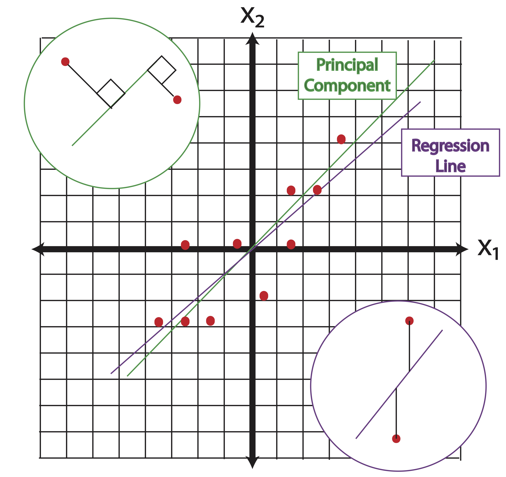
 <p class="caption">(\#fig:pcvsreg)Principal Components vs. Regression Lines</p>
 </div>


The first principal component about the mean of a set of points can be represented by that line which most closely approaches the data points. Let this not conjure up images of linear regression in your head, though.  In contrast, linear least squares tries to minimize the distance in a single direction only (the direction of your target variable axes). Thus, although the two use a similar error metric, linear least squares is a method that treats one dimension of the data preferentially, while PCA treats all dimensions equally.

You might be tempted to conclude from Figure \@ref(fig:pcvsreg) that the first principal component and the regression line "ought to be similar." This is a terrible conclusion if you consider a large multivariate dataset and the various regression lines that would predict each variable in that dataset. In PCA, there is no target variable and thus no single regression line that we'd be comparing to. 


## Covariance or Correlation Matrix?

Principal components analysis can involve eigenvectors of either the covariance matrix or the correlation matrix. When we perform this analysis on the covariance matrix, the geometric interpretation is simply centering the data and then determining the direction of maximal variance. When we perform this analysis on the correlation matrix, the interpretation is _standardizing_ the data and then determining the direction of maximal variance. The correlation matrix is simply a scaled form of the covariance matrix. In general, these two methods give different results, especially when the scales of the variables are different.

The covariance matrix is the default for (most) $\textsf{R}$ PCA functions. The correlation matrix is the default in SAS and the covariance matrix method is invoked by the option:

```
proc princomp data=X cov; 
var x1--x10;
run;
```

Choosing between the covariance and correlation matrix can sometimes pose problems. The rule of thumb is that the correlation matrix should be used when the scales of the variables vary greatly. In this case, the variables with the highest variance will dominate the first principal component.  The argument against automatically using correlation matrices is that it turns out to be quite a brutal way of standardizing your data - forcing all variables to contain the same amount of information (after all, don't we equate variance to information?) seems naive and counterintuitive when it is not absolutely necessary for differences in scale. We hope that the case studies outlined in Chapter \@ref(pcaapp) will give those who _always_ use the correlation option reason for pause, and we hope that, in the future, they will consider multiple presentations of the data and their corresponding low-rank representations of the data.  


## PCA in R

Let's find Principal Components using the iris dataset. This is a well-known dataset, often used to demonstrate the effect of clustering algorithms. It contains numeric measurements for 150 iris flowers along 4 dimensions. The fifth column in the dataset tells us what species of Iris the flower is. There are 3 species.

1. Sepal.Length
2. Sepal.Width
3. Petal.Length
4. Petal.Width
5. Species
 - Setosa
 - Versicolor
 - Virginica
 
Let's first take a look at the scatterplot matrix:


```r
pairs(~Sepal.Length+Sepal.Width+Petal.Length+Petal.Width,data=iris,col=c("red","green3","blue")[iris$Species])
```


It is apparent that some of our variables are correlated. We can confirm this by computing the correlation matrix with the `cor()` function. We can also check out the individual variances of the variables and the covariances between variables by examining the covariance matrix (`cov()` function). Remember - when looking at covariances, we can really only interpret the _sign_ of the number and not the magnitude as we can with the correlations.


```r
cor(iris[1:4])
```

```
##              Sepal.Length Sepal.Width Petal.Length Petal.Width
## Sepal.Length    1.0000000  -0.1175698    0.8717538   0.8179411
## Sepal.Width    -0.1175698   1.0000000   -0.4284401  -0.3661259
## Petal.Length    0.8717538  -0.4284401    1.0000000   0.9628654
## Petal.Width     0.8179411  -0.3661259    0.9628654   1.0000000
```

```r
cov(iris[1:4])
```

```
##              Sepal.Length Sepal.Width Petal.Length Petal.Width
## Sepal.Length    0.6856935  -0.0424340    1.2743154   0.5162707
## Sepal.Width    -0.0424340   0.1899794   -0.3296564  -0.1216394
## Petal.Length    1.2743154  -0.3296564    3.1162779   1.2956094
## Petal.Width     0.5162707  -0.1216394    1.2956094   0.5810063
```

We have relatively strong positive correlation between Petal Length, Petal Width and Sepal Length. It is also clear that Petal Length has more than 3 times the variance of the other 3 variables. How will this effect our analysis?

The scatter plots and correlation matrix provide useful information, but they don't give us a true sense for how the data looks when all 4 attributes are considered simultaneously.

In the next section we will compute the principal components directly from eigenvalues and eigenvectors of the covariance or correlation matrix. __It's important to note that this method of _computing_ principal components is not actually recommended - the answer provided is the same, but the numerical stability and efficiency of this method may be dubious for large datasets. The Singular Value Decomposition (SVD), which will be discussed in Chapter \@ref(svd), is generally a preferred route to computing principal components.__ Using both the covariance matrix and the correlation matrix, let's see what we can learn about the data. Let's start with the covariance matrix which is the default setting for the `prcomp()` function in R.

### Covariance PCA

 Let's start with the covariance matrix which is the default setting for the `prcomp` function in R. It's worth repeating that a dedicated principal component function like `prcomp()` is superior in numerical stability and efficiency to the lines of code in the next section. __The only reason for directly computing the covariance matrix and its eigenvalues and eigenvectors (as opposed to  `prcomp()`) is for edification. Computing a PCA in this manner, just this once, will help us grasp the exact mathematics of the situation and empower us to use built in functions with greater flexibility and understanding.__

### Principal Components, Loadings, and Variance Explained 


```r
covM = cov(iris[1:4])
eig=eigen(covM,symmetric=TRUE,only.values=FALSE)
c=colnames(iris[1:4])
eig$values
```

```
## [1] 4.22824171 0.24267075 0.07820950 0.02383509
```

```r
rownames(eig$vectors)=c(colnames(iris[1:4]))
eig$vectors
```

```
##                     [,1]        [,2]        [,3]       [,4]
## Sepal.Length  0.36138659 -0.65658877 -0.58202985  0.3154872
## Sepal.Width  -0.08452251 -0.73016143  0.59791083 -0.3197231
## Petal.Length  0.85667061  0.17337266  0.07623608 -0.4798390
## Petal.Width   0.35828920  0.07548102  0.54583143  0.7536574
```

The eigenvalues tell us how much of the total variance in the data is directed along each eigenvector. Thus, the amount of variance along $\mathbf{v}_1$ is $\lambda_1$ and the _proportion_ of variance explained by the first principal component is
$$\frac{\lambda_1}{\lambda_1+\lambda_2+\lambda_3+\lambda_4}$$


```r
eig$values[1]/sum(eig$values)
```

```
## [1] 0.9246187
```

Thus 92\% of the variation in the Iris data is explained by the first component alone. What if we consider the first and second principal component directions? Using this two dimensional representation (approximation/projection) we can capture the following proportion of variance:
$$\frac{\lambda_1+\lambda_2}{\lambda_1+\lambda_2+\lambda_3+\lambda_4}$$


```r
sum(eig$values[1:2])/sum(eig$values)
```

```
## [1] 0.9776852
```

With two dimensions, we explain 97.8% of the variance in these 4 variables! The entries in each eigenvector are called the **loadings** of the variables on the component. The loadings give us an idea how important each variable is to each component. For example, it seems that the third variable in our dataset (Petal Length) is dominating the first principal component. This should not come as too much of a shock - that variable had (by far) the largest amount of variation of the four. In order to capture the most amount of variance in a single dimension, we should certainly be considering this variable strongly. The variable with the next largest variance, Sepal Length, dominates the second principal component.

**Note:**  *Had Petal Length and Sepal Length been correlated, they would not have dominated separate principal components, they would have shared one. These two variables are not correlated and thus their variation cannot be captured along the same direction.*

### Scores and PCA Projection 

Lets plot the *projection* of the four-dimensional iris data onto the two dimensional space spanned by the first 2 principal components. To do this, we need coordinates. These coordinates are commonly called **scores** in statistical texts. We can find the coordinates of the data on the principal components by solving the system
$$\mathbf{X}=\mathbf{A}\mathbf{V}^T$$
where $\mathbf{X}$ is our original iris data **(centered to have mean = 0)** and $\mathbf{A}$ is a matrix of coordinates in the new principal component space, spanned by the eigenvectors in $\mathbf{V}$.

Solving this system is simple enough - since $\mathbf{V}$ is an orthogonal matrix. Let's confirm this:


```r
eig$vectors %*% t(eig$vectors)
```

```
##               Sepal.Length  Sepal.Width  Petal.Length   Petal.Width
## Sepal.Length  1.000000e+00 4.163336e-17 -2.775558e-17 -2.775558e-17
## Sepal.Width   4.163336e-17 1.000000e+00  1.665335e-16  1.942890e-16
## Petal.Length -2.775558e-17 1.665335e-16  1.000000e+00 -2.220446e-16
## Petal.Width  -2.775558e-17 1.942890e-16 -2.220446e-16  1.000000e+00
```

```r
t(eig$vectors) %*% eig$vectors
```

```
##               [,1]          [,2]         [,3]          [,4]
## [1,]  1.000000e+00 -2.289835e-16 0.000000e+00 -1.110223e-16
## [2,] -2.289835e-16  1.000000e+00 2.775558e-17 -1.318390e-16
## [3,]  0.000000e+00  2.775558e-17 1.000000e+00  1.110223e-16
## [4,] -1.110223e-16 -1.318390e-16 1.110223e-16  1.000000e+00
```

We'll have to settle for precision at 15 decimal places. Close enough!

So to find the scores, we simply subtract the means from our original variables to create the data matrix $\mathbf{X}$ and compute
$$\mathbf{A}=\mathbf{X}\mathbf{V}$$


```r
# The scale function centers and scales by default
X=scale(iris[1:4],center=TRUE,scale=FALSE)
# Create data.frame from matrix for plotting purposes.
scores=data.frame(X %*% eig$vectors)
# Change default variable names
colnames(scores)=c("Prin1","Prin2","Prin3","Prin4")
# Print coordinates/scores of first 10 observations
scores[1:10, ]
```

```
##        Prin1       Prin2       Prin3        Prin4
## 1  -2.684126 -0.31939725 -0.02791483  0.002262437
## 2  -2.714142  0.17700123 -0.21046427  0.099026550
## 3  -2.888991  0.14494943  0.01790026  0.019968390
## 4  -2.745343  0.31829898  0.03155937 -0.075575817
## 5  -2.728717 -0.32675451  0.09007924 -0.061258593
## 6  -2.280860 -0.74133045  0.16867766 -0.024200858
## 7  -2.820538  0.08946138  0.25789216 -0.048143106
## 8  -2.626145 -0.16338496 -0.02187932 -0.045297871
## 9  -2.886383  0.57831175  0.02075957 -0.026744736
## 10 -2.672756  0.11377425 -0.19763272 -0.056295401
```
 
To this point, we have simply computed coordinates (scores) on a new set of axis (principal components, eigenvectors, loadings). These axis are orthogonal and are aligned with the directions of maximal variance in the data. When we consider only a subset of principal components (like 2 components accounting for 97% of the variance), then we are projecting the data onto a lower dimensional space. Generally, this is one of the primary goals of PCA: Project the data down into a lower dimensional space (_onto the span of the principal components_) while keeping the maximum amount of information (i.e. variance).

Thus, we know that almost 98% of the data's variance can be seen in two-dimensions using the first two principal components. Let's go ahead and see what this looks like:


```r
plot(scores$Prin1, scores$Prin2, 
     main="Data Projected on First 2 Principal Components",
     xlab="First Principal Component", 
     ylab="Second Principal Component", 
     col=c("red","green3","blue")[iris$Species])
```


### PCA functions in R


```r
irispca=prcomp(iris[1:4])
# Variance Explained
summary(irispca)
```

```
## Importance of components:
##                           PC1     PC2    PC3     PC4
## Standard deviation     2.0563 0.49262 0.2797 0.15439
## Proportion of Variance 0.9246 0.05307 0.0171 0.00521
## Cumulative Proportion  0.9246 0.97769 0.9948 1.00000
```

```r
# Eigenvectors:
irispca$rotation
```

```
##                      PC1         PC2         PC3        PC4
## Sepal.Length  0.36138659 -0.65658877  0.58202985  0.3154872
## Sepal.Width  -0.08452251 -0.73016143 -0.59791083 -0.3197231
## Petal.Length  0.85667061  0.17337266 -0.07623608 -0.4798390
## Petal.Width   0.35828920  0.07548102 -0.54583143  0.7536574
```

```r
# Coordinates of first 10 observations along PCs:
irispca$x[1:10, ]
```

```
##             PC1         PC2         PC3          PC4
##  [1,] -2.684126 -0.31939725  0.02791483  0.002262437
##  [2,] -2.714142  0.17700123  0.21046427  0.099026550
##  [3,] -2.888991  0.14494943 -0.01790026  0.019968390
##  [4,] -2.745343  0.31829898 -0.03155937 -0.075575817
##  [5,] -2.728717 -0.32675451 -0.09007924 -0.061258593
##  [6,] -2.280860 -0.74133045 -0.16867766 -0.024200858
##  [7,] -2.820538  0.08946138 -0.25789216 -0.048143106
##  [8,] -2.626145 -0.16338496  0.02187932 -0.045297871
##  [9,] -2.886383  0.57831175 -0.02075957 -0.026744736
## [10,] -2.672756  0.11377425  0.19763272 -0.056295401
```

All of the information we computed using eigenvectors aligns with what we see here, except that the coordinates/scores and the loadings of Principal Component 3 are of the opposite sign. In light of what we know about eigenvectors representing _directions_, this should be no cause for alarm. The `prcomp` function arrived at the unit basis vector pointing in the negative direction of the one we found directly from the `eig` function - which should negate all the coordinates and leave us with an equivalent mirror image in all of our projections.

### The Biplot

One additional feature that R users have created is the **biplot**. The PCA biplot allows us to see where our original variables fall in the space of the principal components. Highly correlated variables will fall along the same direction (or exactly opposite directions) as a change in one of these variables correlates to a change in the other. Uncorrelated variables will appear further apart. The length of the variable vectors on the biplot tell us the degree to which variability in variable is explained in that direction. Shorter vectors have less variability than longer vectors. So in the biplot below, petal width and petal length point in the same direction indicating that these variables share a relatively high degree of correlation. However, the vector for petal width is much shorter than that of petal length, which means you can expect a higher degree of change in petal length as you proceed to the right along PC1. PC1 explains more of the variance in petal length than it does petal width. If we were to imagine a third PC orthogonal to the plane shown, petal width is likely to exist at much larger angle off the plane - here, it is being projected down from that 3-dimensional picture.


```r
biplot(irispca, col = c("gray", "blue"))
```


We can examine some of the outlying observations to see how they align with these projected variable directions. It helps to compare them to the quartiles of the data. Also keep in mind the direction of the arrows in the plot. If the arrow points down then the positive direction is down - indicating observations which are greater than the mean. Let's pick out observations 42 and 132 and see what the actual data points look like in comparison to the rest of the sample population.

```r
summary(iris[1:4])
```

```
##   Sepal.Length    Sepal.Width     Petal.Length    Petal.Width   
##  Min.   :4.300   Min.   :2.000   Min.   :1.000   Min.   :0.100  
##  1st Qu.:5.100   1st Qu.:2.800   1st Qu.:1.600   1st Qu.:0.300  
##  Median :5.800   Median :3.000   Median :4.350   Median :1.300  
##  Mean   :5.843   Mean   :3.057   Mean   :3.758   Mean   :1.199  
##  3rd Qu.:6.400   3rd Qu.:3.300   3rd Qu.:5.100   3rd Qu.:1.800  
##  Max.   :7.900   Max.   :4.400   Max.   :6.900   Max.   :2.500
```

```r
# Consider orientation of outlying observations:
iris[42, ]
```

```
##    Sepal.Length Sepal.Width Petal.Length Petal.Width Species
## 42          4.5         2.3          1.3         0.3  setosa
```

```r
iris[132, ]
```

```
##     Sepal.Length Sepal.Width Petal.Length Petal.Width   Species
## 132          7.9         3.8          6.4           2 virginica
```

## Variable Clustering with PCA

The direction arrows on the biplot are merely the coefficients of the original variables when combined to make principal components. Don't forget that principal components are simply linear combinations of the original variables.

For example, here we have the first principal component (the first column of $\V$), $\mathbf{v}_1$ as:


```r
eig$vectors[,1]
```

```
## Sepal.Length  Sepal.Width Petal.Length  Petal.Width 
##   0.36138659  -0.08452251   0.85667061   0.35828920
```

This means that the __coordinates of the data along__ the first principal component, which we'll denote here as $PC_1$ are given by a simple linear combination of our original variables after centering (for covariance PCA) or standardization (for correlation PCA)

$$PC_1 = 0.36Sepal.Length-0.08Sepal.Width+0.85Petal.Length +0.35Petal.Width$$
the same equation could be written for each of the vectors of coordinates along principal components, $PC_1,\dots, PC_4$.

Essentially, we have a system of equations telling us that the rows of $\V^T$ (i.e. the columns of $\V$) give us the weights of each variable for each principal component:
\begin{equation}
(\#eq:cpc1)
\begin{bmatrix} PC_1\\PC_2\\PC_3\\PC_4\end{bmatrix} = \mathbf{V}^T\begin{bmatrix}Sepal.Length\\Sepal.Width\\Petal.Length\\Petal.Width\end{bmatrix}
\end{equation}

Thus, if want the coordinates of our original variables in terms of Principal Components (so that we can plot them as we do in the biplot) we need to look no further than the rows of the matrix $\mathbf{V}$ as
\begin{equation}
(\#eq:cpc2)
\begin{bmatrix}Sepal.Length\\Sepal.Width\\Petal.Length\\Petal.Width\end{bmatrix} =\mathbf{V}\begin{bmatrix} PC_1\\PC_2\\PC_3\\PC_4\end{bmatrix}
\end{equation}

means that the rows of $\mathbf{V}$ give us the coordinates of our original variables in the PCA space. The transition from Equation \@ref(eq:cpc1) to Equation  \@ref(eq:cpc2) is provided by the orthogonality of the eigenvectors per Theorem \@ref(thm:eigsym).


```r
#First entry in each eigenvectors give coefficients for Variable 1:
eig$vectors[1,]
```

```
## [1]  0.3613866 -0.6565888 -0.5820299  0.3154872
```

$$Sepal.Length = 0.361 PC_1 - 0.657 PC_2 - 0.582 PC_3 + 0.315 PC_4$$
You can see this on the biplot. The vector shown for Sepal.Length is (0.361, -0.656), which is the two dimensional projection formed by throwing out components 3 and 4.

Variables which lie upon similar directions in the PCA space tend to change together in a similar fashion. We might consider Petal.Width and Petal.Length as a cluster of variables because they share a direction on the biplot, which means they represent much of the same information (the underlying construct being the "size of the petal" in this case).


### Correlation PCA

We can complete the same analysis using the correlation matrix. I'll leave it as an exercise to compute the Principal Component loadings and scores and variance explained directly from eigenvectors and eigenvalues. You should do this and compare your results to the R output. _(Beware: you must transform your data before solving for the scores. With the covariance version, this meant centering - for the correlation version, this means standardization as well)_


```r
irispca2=prcomp(iris[1:4], cor=TRUE)
```

```
## Warning: In prcomp.default(iris[1:4], cor = TRUE) :
##  extra argument 'cor' will be disregarded
```

```r
summary(irispca2)
```

```
## Importance of components:
##                           PC1     PC2    PC3     PC4
## Standard deviation     2.0563 0.49262 0.2797 0.15439
## Proportion of Variance 0.9246 0.05307 0.0171 0.00521
## Cumulative Proportion  0.9246 0.97769 0.9948 1.00000
```

```r
irispca2$rotation
```

```
##                      PC1         PC2         PC3        PC4
## Sepal.Length  0.36138659 -0.65658877  0.58202985  0.3154872
## Sepal.Width  -0.08452251 -0.73016143 -0.59791083 -0.3197231
## Petal.Length  0.85667061  0.17337266 -0.07623608 -0.4798390
## Petal.Width   0.35828920  0.07548102 -0.54583143  0.7536574
```

```r
irispca2$x[1:10,]
```

```
##             PC1         PC2         PC3          PC4
##  [1,] -2.684126 -0.31939725  0.02791483  0.002262437
##  [2,] -2.714142  0.17700123  0.21046427  0.099026550
##  [3,] -2.888991  0.14494943 -0.01790026  0.019968390
##  [4,] -2.745343  0.31829898 -0.03155937 -0.075575817
##  [5,] -2.728717 -0.32675451 -0.09007924 -0.061258593
##  [6,] -2.280860 -0.74133045 -0.16867766 -0.024200858
##  [7,] -2.820538  0.08946138 -0.25789216 -0.048143106
##  [8,] -2.626145 -0.16338496  0.02187932 -0.045297871
##  [9,] -2.886383  0.57831175 -0.02075957 -0.026744736
## [10,] -2.672756  0.11377425  0.19763272 -0.056295401
```

```r
plot(irispca2$x[,1],irispca2$x[,2],
     main="Data Projected on First 2  Principal Components",
     xlab="First Principal Component",
     ylab="Second Principal Component",
     col=c("red","green3","blue")[iris$Species])
```


```r
biplot(irispca2)
```


Here you can see the direction vectors of the original variables are relatively uniform in length in the PCA space. This is due to the standardization in the correlation matrix. However, the general message is the same: Petal.Width and Petal.Length Cluster together, and many of the same observations appear "on the fray" on the PCA space - although not all of them!

### Which Projection is Better? 

What do you think? It depends on the task, and it depends on the data. One flavor of PCA is not "better" than the other. Correlation PCA is appropriate when the scales of your attributes differ wildly, and covariance PCA would be inappropriate in that situation. But in all other scenarios, when the scales of our attributes are roughly the same, we should always consider both dimension reductions and make a decision based upon the resulting output (variance explained, projection plots, loadings). 

For the iris data, The results in terms of variable clustering are pretty much the same. For clustering/classifying the 3 species of flowers, we can see better separation in the covariance version.

### Beware of biplots 

Be careful not to draw improper conclusions from biplots. Particularly, be careful about situations where the first two principal components do not summarize the majority of the variance. If a large amount of variance is captured by the 3rd or 4th (or higher) principal components, then we must keep in mind that the variable projections on the first two principal components are flattened out versions of a higher dimensional picture. If a variable vector appears short in the 2-dimensional projection, it means one of two things:

- That variable has small variance
- That variable appears to have small variance when depicted in the space of the first two principal components, but truly has a larger variance which is represented by 3rd or higher principal components.


Let's take a look at an example of this. We'll generate 500 rows of data on 4 nearly independent normal random variables. Since these variables are uncorrelated, we might expect that the 4 orthogonal principal components will line up relatively close to the original variables. If this doesn't happen, then at the very least we can expect the biplot to show little to no correlation between the variables. We'll give variables $2$ and $3$ the largest variance. Multiple runs of this code will generate different results with similar implications.


```r
means=c(2,4,1,3)
sigmas=c(7,9,10,8)
sample.size=500
data=mapply(function(mu,sig){rnorm(mu,sig, n=sample.size)},mu=means,sig=sigmas)
cor(data)
```

```
##              [,1]        [,2]        [,3]         [,4]
## [1,]  1.000000000 -0.03400735 0.006137436 -0.004801481
## [2,] -0.034007355  1.00000000 0.058796304  0.017518225
## [3,]  0.006137436  0.05879630 1.000000000  0.020177108
## [4,] -0.004801481  0.01751823 0.020177108  1.000000000
```

```r
pc=prcomp(data,scale=TRUE)
summary(pc)
```

```
## Importance of components:
##                           PC1    PC2    PC3    PC4
## Standard deviation     1.0368 1.0033 0.9946 0.9640
## Proportion of Variance 0.2687 0.2517 0.2473 0.2323
## Cumulative Proportion  0.2687 0.5204 0.7677 1.0000
```

```r
pc$rotation
```

```
##             PC1        PC2        PC3         PC4
## [1,] -0.2785111  0.8650811 -0.1584574 -0.38595019
## [2,]  0.6734876 -0.1332105 -0.2354644 -0.68791418
## [3,]  0.5965359  0.4077061 -0.3179006  0.61388916
## [4,]  0.3361413  0.2601258  0.9046474 -0.03092939
```

```r
biplot(pc)
```

<div class="figure" style="text-align: center">

<p class="caption">(\#fig:unnamed-chunk-57)BiPlot of Iris Data</p>
</div>

Obviously, the wrong conclusion to make from this biplot is that Variables 1 and 4 are correlated. Variables 1 and 4 do not load highly on the first two principal components - in the _whole_ 4-dimensional principal component space they are nearly orthogonal to each other and to variables 1 and 2. Thus, their orthogonal projections appear near the origin of this 2-dimensional subspace.

The morals of the story: 
<ul>
<li> Always corroborate your results using the variable loadings and the amount of variation explained by each variable.
<li> When a variable shows up near the origin in a biplot, it is generally not well represented by your two-dimensional approximation of the data.
</ul>


<!--chapter:end:03-PCA.Rmd-->

# Applications of Principal Components {#pcaapp}

 Principal components have a number of applications across many areas of statistics. In the next sections, we will explore their usefulness in the context of dimension reduction.


## Dimension reduction

It is quite common for an analyst to have too many variables. There are two different solutions to this problem:

1. **Feature Selection**: Choose a subset of existing variables to be used in a model. 
2. **Feature Extraction**: Create a new set of features which are combinations of original variables.


### Feature Selection 

Let's think for a minute about feature selection. What are we really doing when we consider a subset of our existing variables? Take the two dimensional data in Example \@ref(ex:pcabasis) (while two-dimensions rarely necessitate dimension reduction, the geometrical interpretation extends to higher dimensions as usual!). The centered data appears as follows:


Now say we perform some kind of feature selection (there are a number of ways to do this, chi-square tests for instances) and we determine that the variable $\x_2$ is more important than $\x_1$. So we throw out $\x_2$ and we've reduced the dimensions from $p=2$ to $k=1$. Geometrically, what does our new data look like? By dropping $\x_1$ we set all of those horizontal coordinates to zero. In other words, we **project the data orthogonally** onto the $\x_2$ axis, as illustrated in Figure \@ref(fig:pcpointsselect).

(ref:pcpointscap) Geometrical Interpretation of Feature Selection: When we "drop" the variable $\x_1$ from our analysis, we are projecting the data onto the span($\x_2$)

<div class="figure" style="text-align: center">

<p class="caption">(\#fig:pcpointsselect)(ref:pcpointscap)</p>
</div>

Now, how much information (variance) did we lose with this projection? The total variance in the original data is 
$$\|\x_1\|^2+\|\x_2\|^2.$$
The variance of our data reduction is
$$\|\x_2\|^2.$$
Thus, the proportion of the total information (variance) we've kept is
$$\frac{\|\x_2\|^2}{\|\x_1\|^2+\|\x_2\|^2}=\frac{6.01}{5.6+6.01} = 51.7\%.$$
Our reduced dimensional data contains only 51.7\% of the variance of the original data. We've lost a lot of information!  

The fact that feature selection omits variance in our predictor variables does not make it a bad thing! Obviously, getting rid of variables which have no relationship to a target variable (in the case of _supervised_ modeling like prediction and classification) is a good thing. But, in the case of _unsupervised_ learning techniques, where there is no target variable involved, we must be extra careful when it comes to feature selection. In summary,

<ol>
<li> Feature Selection is important. Examples include:
<ul>
  <li> Removing variables which have little to no impact on a target variable in supervised modeling (forward/backward/stepwise selection).
  <li> Removing variables which have obvious strong correlation with other predictors.
  <li> Removing variables that are not interesting in unsupervised learning (For example, you may not want to use the words "the" and "of" when clustering text).
</ul>
<li> Feature Selection is an orthogonal projection of the original data onto the span of the variables you choose to keep.
<li> Feature selection should always be done with care and justification. 
<ul>
  <li> In regression, could create problems of endogeneity (errors correlated with predictors - omitted variable bias).
  <li> For unsupervised modelling, could lose important information. 
</ul>
<.ol>

### Feature Extraction 

PCA is the most common form of feature extraction. The rotation of the space shown in Example \@ref(ex:pcabasis) represents the creation of new features which are linear combinations of the original features. If we have $p$ potential variables for a model and want to reduce that number to $k$, then the first $k$ principal components combine the individual variables in such a way that is guaranteed to capture as much ``information'' (variance) as possible. Again, take our two-dimensional data as an example. When we reduce our data down to one-dimension using principal components, we essentially do the same orthogonal projection that we did in Feature Selection, only in this case we conduct that projection in the new basis of principal components. Recall that for this data, our first principal component $\v_1$ was $$\v_1 = \pm 0.69 \\0.73 \mp.$$
Projecting the data onto the first principal component is illustrated in Figure \@ref(fig:pcaproj).


<div class="figure" style="text-align: center">
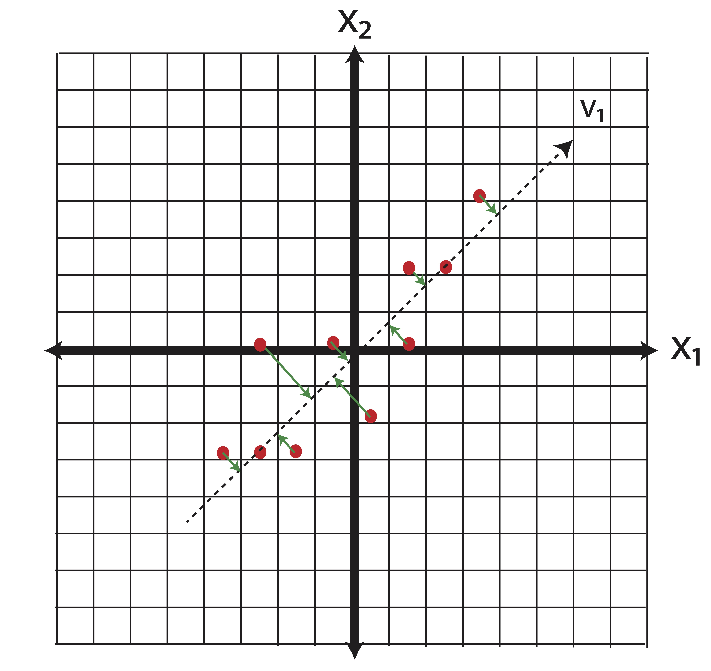
<p class="caption">(\#fig:pcaproj)Illustration of Feature Extraction via PCA</p>
</div>

 How much variance do we keep with $k$ principal components? The proportion of variance explained by each principal component is the ratio of the corresponding eigenvalue to the sum of the eigenvalues (which gives the total amount of variance in the data).


:::{theorem name='Proportion of Variance Explained' #pcpropvar}
The proportion of variance explained by the projection of the data onto principal component $\v_i$ is
$$\frac{\lambda_i}{\sum_{j=1}^p \lambda_j}.$$
Similarly, the proportion of variance explained by the projection of the data onto the first $k$ principal components ($k<j$) is
$$ \frac{\sum_{i=1}^k\lambda_i}{\sum_{j=1}^p \lambda_j}$$
:::

In our simple 2 dimensional example we were able to keep
$$\frac{\lambda_1}{\lambda_1+\lambda_2}=\frac{10.61}{10.61+1.00} = 91.38\%$$
of our variance in one dimension. 

## Exploratory Analysis

### UK Food Consumption

#### Explore the Data

The data for this example can be read directly from our course webpage. When we first examine the data, we will see that the rows correspond to different types of food/drink and the columns correspond to the 4 countries within the UK. Our first matter of business is transposing this data so that the 4 countries become our observations (i.e. rows).


```r
food=read.csv("http://birch.iaa.ncsu.edu/~slrace/LinearAlgebra2021/Code/ukfood.csv",
              header=TRUE,row.names=1)
```


```r
library(reshape2) #melt data matrix into 3 columns
library(ggplot2) #heatmap
head(food)
```

```
##               England Wales Scotland N.Ireland
## Cheese            105   103      103        66
## Carcass meat      245   227      242       267
## Other meat        685   803      750       586
## Fish              147   160      122        93
## Fats and oils     193   235      184       209
## Sugars            156   175      147       139
```

```r
food=as.data.frame(t(food))
head(food)
```

```
##           Cheese Carcass meat Other meat Fish Fats and oils Sugars
## England      105          245        685  147           193    156
## Wales        103          227        803  160           235    175
## Scotland     103          242        750  122           184    147
## N.Ireland     66          267        586   93           209    139
##           Fresh potatoes Fresh Veg Other Veg Processed potatoes Processed Veg
## England              720       253       488                198           360
## Wales                874       265       570                203           365
## Scotland             566       171       418                220           337
## N.Ireland           1033       143       355                187           334
##           Fresh fruit Cereals Beverages Soft drinks Alcoholic drinks
## England          1102    1472        57        1374              375
## Wales            1137    1582        73        1256              475
## Scotland          957    1462        53        1572              458
## N.Ireland         674    1494        47        1506              135
##           Confectionery
## England              54
## Wales                64
## Scotland             62
## N.Ireland            41
```

Next we will visualize the information in this data using a simple heat map. To do this we will standardize and then melt the data using the `reshape2` package, and then use a `ggplot()` heatmap.


```r
food.std = scale(food, center=T, scale = T)
food.melt = melt(food.std, id.vars = row.names(food.std), measure.vars = 1:17)
ggplot(data = food.melt, aes(x=Var1, y=Var2, fill=value)) + 
  geom_tile(color = "white")+
  scale_fill_gradient2(low = "blue", high = "red", mid = "white", 
                       midpoint = 0, limit = c(-2,2), space = "Lab" 
                       ) +  theme_minimal()+ 
  theme(axis.title.x = element_blank(),axis.title.y = element_blank(),
        axis.text.y = element_text(face = 'bold', size = 12, colour = 'black'),
        axis.text.x = element_text(angle = 45, vjust = 1, face = 'bold',
                                   size = 12, colour = 'black', hjust = 1))+coord_fixed()
```


<!-- \includegraphics[width=.4\textwidth]{heatmap.png} -->

#### ```prcomp()``` function for PCA

The ```prcomp()``` function is the one I most often recommend for reasonably sized principal component calculations in R. This function returns a list with class "prcomp" containing the following components (from help prcomp):

<ol>
<li> ```sdev```: the standard deviations of the principal components (i.e., the square roots of the eigenvalues of the covariance/correlation matrix, though the calculation is actually done with the singular values of the data matrix).
<li> ```rotation```: the matrix of _variable loadings_ (i.e., a matrix whose columns contain the eigenvectors). The function princomp returns this in the element loadings.
<li> ```x```:  if retx is true _the value of the rotated data (i.e. the scores)_ (the centred (and scaled if requested) data multiplied by the rotation matrix) is returned. Hence, cov(x) is the diagonal matrix $diag(sdev^2)$. For the formula method, napredict() is applied to handle the treatment of values omitted by the na.action.
<li> ```center```, ``` scale```: the centering and scaling used, or FALSE.
</ol>

The option `scale = TRUE` inside the `prcomp()` function instructs the program to use **orrelation PCA**. *The default is covariance PCA*. 


```r
pca=prcomp(food, scale = T) 
```

This first plot just looks at magnitudes of eigenvalues - it is essentially the screeplot in barchart form.


```r
summary(pca)
```

```
## Importance of components:
##                           PC1    PC2     PC3       PC4
## Standard deviation     3.4082 2.0562 1.07524 6.344e-16
## Proportion of Variance 0.6833 0.2487 0.06801 0.000e+00
## Cumulative Proportion  0.6833 0.9320 1.00000 1.000e+00
```

```r
plot(pca, main = "Bar-style Screeplot")
```


The next plot views our four datapoints (locations) projected onto the 2-dimensional subspace
 (from 17 dimensions) that captures as much information (i.e. variance) as possible.
 

```r
plot(pca$x, 
     xlab = "Principal Component 1",
     ylab = "Principal Component 2", 
     main = 'The four observations projected into 2-dimensional space')
text(pca$x[,1], pca$x[,2],row.names(food))
```


#### The BiPlot

Now we can also view our original variable axes projected down onto that same space!


```r
biplot(pca$x,pca$rotation, cex = c(1.5, 1), col = c('black','red'))#, 
```

<div class="figure" style="text-align: center">

<p class="caption">(\#fig:unnamed-chunk-66)BiPlot: The observations and variables projected onto the same plane.</p>
</div>

```r
      # xlim = c(-0.8,0.8), ylim = c(-0.6,0.7))
```
<!-- \includegraphics[width=\textwidth]{biplot.png} -->
<!-- \caption{} -->


#### Formatting the biplot for readability

I will soon introduce the `autoplot()` function from the `ggfortify` package, but for now I just want to show you that you can specify _which_ variables (and observations) to include in the biplot by directly specifying the loadings matrix and scores matrix of interest in the biplot function:


```r
desired.variables = c(2,4,6,8,10)
biplot(pca$x, pca$rotation[desired.variables,1:2], cex = c(1.5, 1), 
       col = c('black','red'), xlim = c(-6,5), ylim = c(-4,4))
```

<div class="figure" style="text-align: center">

<p class="caption">(\#fig:unnamed-chunk-67)Specify a Subset of Variables/Observations to Include in the Biplot </p>
</div>

#### What are all these axes?

Those numbers relate to the scores on PC1 and PC2 (sometimes normalized so that each new variable has variance 1 - and sometimes not) and the loadings on PC1 and PC2 (sometimes normalized so that each variable vector is a unit vector - and sometimes scaled by the eigenvalues or square roots of the eigenvalues in some fashion).

Generally, I've rarely found it useful to hunt down how each package is rendering the axes the biplot, as they should be providing the same information regardless of the scale of the _numbers_ on the axes. We don't actually use those numbers to help us draw conclusions. We use the directions of the arrows and the layout of the points in reference to those direction arrows. 


```r
vmax = varimax(pca$rotation[,1:2])
new.scores = pca$x[,1:2] %*% vmax$rotmat

biplot(new.scores, vmax$loadings[,1:2], 
       # xlim=c(-60,60),
       # ylim=c(-60,60),
       cex = c(1.5, 1),
       xlab = 'Rotated Axis 1',
       ylab = 'Rotated Axis 2')
```

<div class="figure" style="text-align: center">

<p class="caption">(\#fig:unnamed-chunk-68)Biplot with Rotated Loadings</p>
</div>

```r
vmax$loadings[,1:2]
```

```
##                            PC1         PC2
## Cheese              0.02571143  0.34751491
## Carcass meat       -0.16660468 -0.24450375
## Other meat          0.11243721  0.27569481
## Fish                0.22437069  0.17788300
## Fats and oils       0.35728064 -0.22128124
## Sugars              0.30247003  0.07908986
## Fresh potatoes      0.22174898 -0.40880955
## Fresh Veg           0.26432097  0.09953752
## Other Veg           0.27836185  0.11640174
## Processed potatoes -0.17545152  0.39011648
## Processed Veg       0.29583164  0.05084727
## Fresh fruit         0.15852128  0.24360131
## Cereals             0.34963293 -0.13363398
## Beverages           0.30030152  0.07604823
## Soft drinks        -0.36374762  0.07438738
## Alcoholic drinks    0.04243636  0.34240944
## Confectionery       0.05450175  0.32474821
```

<!--chapter:end:035-PCA_apps_ukfood.Rmd-->

## FIFA Soccer Players

#### Explore the Data

We begin by loading in the data and taking a quick look at the variables that we'll be using in our PCA for this exercise. You may need to install the packages from the following ```library()``` statements.


```r
library(reshape2) #melt correlation matrix into 3 columns
library(ggplot2) #correlation heatmap
library(ggfortify) #autoplot bi-plot
library(viridis) # magma palette
```

```
## Loading required package: viridisLite
```

```r
library(plotrix) # color.legend
```

Now we'll read the data directly from the web, take a peek at the first 5 rows, and explore some summary statistics.


```
##                Name Age                                           Photo
## 1 Cristiano Ronaldo  32  https://cdn.sofifa.org/48/18/players/20801.png
## 2          L. Messi  30 https://cdn.sofifa.org/48/18/players/158023.png
## 3            Neymar  25 https://cdn.sofifa.org/48/18/players/190871.png
## 4         L. Suárez  30 https://cdn.sofifa.org/48/18/players/176580.png
## 5          M. Neuer  31 https://cdn.sofifa.org/48/18/players/167495.png
## 6    R. Lewandowski  28 https://cdn.sofifa.org/48/18/players/188545.png
##   Nationality                                Flag Overall Potential
## 1    Portugal https://cdn.sofifa.org/flags/38.png      94        94
## 2   Argentina https://cdn.sofifa.org/flags/52.png      93        93
## 3      Brazil https://cdn.sofifa.org/flags/54.png      92        94
## 4     Uruguay https://cdn.sofifa.org/flags/60.png      92        92
## 5     Germany https://cdn.sofifa.org/flags/21.png      92        92
## 6      Poland https://cdn.sofifa.org/flags/37.png      91        91
##                  Club                                  Club.Logo  Value  Wage
## 1      Real Madrid CF https://cdn.sofifa.org/24/18/teams/243.png €95.5M €565K
## 2        FC Barcelona https://cdn.sofifa.org/24/18/teams/241.png  €105M €565K
## 3 Paris Saint-Germain  https://cdn.sofifa.org/24/18/teams/73.png  €123M €280K
## 4        FC Barcelona https://cdn.sofifa.org/24/18/teams/241.png   €97M €510K
## 5    FC Bayern Munich  https://cdn.sofifa.org/24/18/teams/21.png   €61M €230K
## 6    FC Bayern Munich  https://cdn.sofifa.org/24/18/teams/21.png   €92M €355K
##   Special Acceleration Aggression Agility Balance Ball.control Composure
## 1    2228           89         63      89      63           93        95
## 2    2154           92         48      90      95           95        96
## 3    2100           94         56      96      82           95        92
## 4    2291           88         78      86      60           91        83
## 5    1493           58         29      52      35           48        70
## 6    2143           79         80      78      80           89        87
##   Crossing Curve Dribbling Finishing Free.kick.accuracy GK.diving GK.handling
## 1       85    81        91        94                 76         7          11
## 2       77    89        97        95                 90         6          11
## 3       75    81        96        89                 84         9           9
## 4       77    86        86        94                 84        27          25
## 5       15    14        30        13                 11        91          90
## 6       62    77        85        91                 84        15           6
##   GK.kicking GK.positioning GK.reflexes Heading.accuracy Interceptions Jumping
## 1         15             14          11               88            29      95
## 2         15             14           8               71            22      68
## 3         15             15          11               62            36      61
## 4         31             33          37               77            41      69
## 5         95             91          89               25            30      78
## 6         12              8          10               85            39      84
##   Long.passing Long.shots Marking Penalties Positioning Reactions Short.passing
## 1           77         92      22        85          95        96            83
## 2           87         88      13        74          93        95            88
## 3           75         77      21        81          90        88            81
## 4           64         86      30        85          92        93            83
## 5           59         16      10        47          12        85            55
## 6           65         83      25        81          91        91            83
##   Shot.power Sliding.tackle Sprint.speed Stamina Standing.tackle Strength
## 1         94             23           91      92              31       80
## 2         85             26           87      73              28       59
## 3         80             33           90      78              24       53
## 4         87             38           77      89              45       80
## 5         25             11           61      44              10       83
## 6         88             19           83      79              42       84
##   Vision Volleys position
## 1     85      88        1
## 2     90      85        1
## 3     80      83        1
## 4     84      88        1
## 5     70      11        4
## 6     78      87        1
```

```
##   Acceleration     Aggression       Agility         Balance       Ball.control
##  Min.   :11.00   Min.   :11.00   Min.   :14.00   Min.   :11.00   Min.   : 8   
##  1st Qu.:56.00   1st Qu.:43.00   1st Qu.:55.00   1st Qu.:56.00   1st Qu.:53   
##  Median :67.00   Median :58.00   Median :65.00   Median :66.00   Median :62   
##  Mean   :64.48   Mean   :55.74   Mean   :63.25   Mean   :63.76   Mean   :58   
##  3rd Qu.:75.00   3rd Qu.:69.00   3rd Qu.:74.00   3rd Qu.:74.00   3rd Qu.:69   
##  Max.   :96.00   Max.   :96.00   Max.   :96.00   Max.   :96.00   Max.   :95   
##    Composure        Crossing        Curve        Dribbling       Finishing    
##  Min.   : 5.00   Min.   : 5.0   Min.   : 6.0   Min.   : 2.00   Min.   : 2.00  
##  1st Qu.:51.00   1st Qu.:37.0   1st Qu.:34.0   1st Qu.:48.00   1st Qu.:29.00  
##  Median :60.00   Median :54.0   Median :48.0   Median :60.00   Median :48.00  
##  Mean   :57.82   Mean   :49.7   Mean   :47.2   Mean   :54.94   Mean   :45.18  
##  3rd Qu.:67.00   3rd Qu.:64.0   3rd Qu.:62.0   3rd Qu.:68.00   3rd Qu.:61.00  
##  Max.   :96.00   Max.   :91.0   Max.   :92.0   Max.   :97.00   Max.   :95.00  
##  Free.kick.accuracy   GK.diving      GK.handling      GK.kicking   
##  Min.   : 4.00      Min.   : 1.00   Min.   : 1.00   Min.   : 1.00  
##  1st Qu.:31.00      1st Qu.: 8.00   1st Qu.: 8.00   1st Qu.: 8.00  
##  Median :42.00      Median :11.00   Median :11.00   Median :11.00  
##  Mean   :43.08      Mean   :16.78   Mean   :16.55   Mean   :16.42  
##  3rd Qu.:57.00      3rd Qu.:14.00   3rd Qu.:14.00   3rd Qu.:14.00  
##  Max.   :93.00      Max.   :91.00   Max.   :91.00   Max.   :95.00  
##  GK.positioning   GK.reflexes    Heading.accuracy Interceptions  
##  Min.   : 1.00   Min.   : 1.00   Min.   : 4.00    Min.   : 4.00  
##  1st Qu.: 8.00   1st Qu.: 8.00   1st Qu.:44.00    1st Qu.:26.00  
##  Median :11.00   Median :11.00   Median :55.00    Median :52.00  
##  Mean   :16.54   Mean   :16.91   Mean   :52.26    Mean   :46.53  
##  3rd Qu.:14.00   3rd Qu.:14.00   3rd Qu.:64.00    3rd Qu.:64.00  
##  Max.   :91.00   Max.   :90.00   Max.   :94.00    Max.   :92.00  
##     Jumping       Long.passing     Long.shots       Marking     
##  Min.   :15.00   Min.   : 7.00   Min.   : 3.00   Min.   : 4.00  
##  1st Qu.:58.00   1st Qu.:42.00   1st Qu.:32.00   1st Qu.:22.00  
##  Median :66.00   Median :56.00   Median :51.00   Median :48.00  
##  Mean   :64.84   Mean   :52.37   Mean   :47.11   Mean   :44.09  
##  3rd Qu.:73.00   3rd Qu.:64.00   3rd Qu.:62.00   3rd Qu.:63.00  
##  Max.   :95.00   Max.   :93.00   Max.   :92.00   Max.   :92.00  
##    Penalties      Positioning      Reactions     Short.passing  
##  Min.   : 5.00   Min.   : 2.00   Min.   :28.00   Min.   :10.00  
##  1st Qu.:39.00   1st Qu.:38.00   1st Qu.:55.00   1st Qu.:53.00  
##  Median :50.00   Median :54.00   Median :62.00   Median :62.00  
##  Mean   :48.92   Mean   :49.53   Mean   :61.85   Mean   :58.22  
##  3rd Qu.:61.00   3rd Qu.:64.00   3rd Qu.:68.00   3rd Qu.:68.00  
##  Max.   :92.00   Max.   :95.00   Max.   :96.00   Max.   :92.00  
##    Shot.power    Sliding.tackle   Sprint.speed      Stamina     
##  Min.   : 3.00   Min.   : 4.00   Min.   :11.00   Min.   :12.00  
##  1st Qu.:46.00   1st Qu.:24.00   1st Qu.:57.00   1st Qu.:56.00  
##  Median :59.00   Median :52.00   Median :67.00   Median :66.00  
##  Mean   :55.57   Mean   :45.56   Mean   :64.72   Mean   :63.13  
##  3rd Qu.:68.00   3rd Qu.:64.00   3rd Qu.:75.00   3rd Qu.:74.00  
##  Max.   :94.00   Max.   :91.00   Max.   :96.00   Max.   :95.00  
##  Standing.tackle    Strength         Vision         Volleys     
##  Min.   : 4.00   Min.   :20.00   Min.   :10.00   Min.   : 4.00  
##  1st Qu.:26.00   1st Qu.:58.00   1st Qu.:43.00   1st Qu.:30.00  
##  Median :54.00   Median :66.00   Median :54.00   Median :44.00  
##  Mean   :47.41   Mean   :65.24   Mean   :52.93   Mean   :43.13  
##  3rd Qu.:66.00   3rd Qu.:74.00   3rd Qu.:64.00   3rd Qu.:57.00  
##  Max.   :92.00   Max.   :98.00   Max.   :94.00   Max.   :91.00
```

These variables are scores on the scale of [0,100] that measure 34 key abilities of soccer players. No player has ever earned a score of 100 on any of these attributes - no player is _perfect_!

It would be natural to assume some correlation between these variables and indeed, we see lots of it in the following heatmap visualization of the correlation matrix.


```r
cor.matrix = cor(fifa[,13:46])
cor.matrix = melt(cor.matrix)
ggplot(data = cor.matrix, aes(x=Var1, y=Var2, fill=value)) + 
  geom_tile(color = "white")+
  scale_fill_gradient2(low = "blue", high = "red", mid = "white", 
   midpoint = 0, limit = c(-1,1), space = "Lab", 
    name="Correlation") +  theme_minimal()+ 
      theme(axis.title.x = element_blank(),axis.title.y = element_blank(),
            axis.text.x = element_text(angle = 45, vjust = 1, 
        size = 9, hjust = 1))+coord_fixed()
```

<div class="figure" style="text-align: center">

<p class="caption">(\#fig:unnamed-chunk-71)Heatmap of correlation matrix for 34 variables of interest</p>
</div>


What jumps out right away are the "GK" (Goal Keeping) abilities - these attributes have _very_ strong positive correlation with one another and negative correlation with the other abilities. After all, goal keepers are not traditionally well known for their dribbling, passing, and finishing abilities!

Outside of that, we see a lot of red in this correlation matrix -- many attributes share a lot of information. This is the type of situation where PCA shines.


#### Principal Components Analysis

Let's take a look at the principal components analysis. Since the variables are on the same scale, I'll start with **covariance PCA** (the default in R's ```prcomp()``` function). 


```r
fifa.pca = prcomp(fifa[,13:46] )
```

We can then print the summary of variance explained and the loadings on the first 3 components:


```r
summary(fifa.pca)
```

```
## Importance of components:
##                            PC1     PC2      PC3      PC4      PC5      PC6
## Standard deviation     74.8371 43.5787 23.28767 20.58146 16.12477 10.71539
## Proportion of Variance  0.5647  0.1915  0.05468  0.04271  0.02621  0.01158
## Cumulative Proportion   0.5647  0.7561  0.81081  0.85352  0.87973  0.89131
##                             PC7     PC8     PC9   PC10    PC11    PC12    PC13
## Standard deviation     10.17785 9.11852 8.98065 8.5082 8.41550 7.93741 7.15935
## Proportion of Variance  0.01044 0.00838 0.00813 0.0073 0.00714 0.00635 0.00517
## Cumulative Proportion   0.90175 0.91013 0.91827 0.9256 0.93270 0.93906 0.94422
##                           PC14    PC15    PC16    PC17    PC18    PC19    PC20
## Standard deviation     7.06502 6.68497 6.56406 6.50459 6.22369 6.08812 6.00578
## Proportion of Variance 0.00503 0.00451 0.00434 0.00427 0.00391 0.00374 0.00364
## Cumulative Proportion  0.94926 0.95376 0.95811 0.96237 0.96628 0.97001 0.97365
##                           PC21    PC22    PC23    PC24    PC25    PC26   PC27
## Standard deviation     5.91320 5.66946 5.45018 5.15051 4.86761 4.34786 4.1098
## Proportion of Variance 0.00353 0.00324 0.00299 0.00267 0.00239 0.00191 0.0017
## Cumulative Proportion  0.97718 0.98042 0.98341 0.98609 0.98848 0.99038 0.9921
##                           PC28    PC29    PC30    PC31   PC32    PC33    PC34
## Standard deviation     4.05716 3.46035 3.37936 3.31179 3.1429 3.01667 2.95098
## Proportion of Variance 0.00166 0.00121 0.00115 0.00111 0.0010 0.00092 0.00088
## Cumulative Proportion  0.99374 0.99495 0.99610 0.99721 0.9982 0.99912 1.00000
```

```r
fifa.pca$rotation[,1:3]
```

```
##                            PC1           PC2          PC3
## Acceleration       -0.13674335  0.0944478107 -0.141193842
## Aggression         -0.15322857 -0.2030537953  0.105372978
## Agility            -0.13598896  0.1196301737 -0.017763073
## Balance            -0.11474980  0.0865672989 -0.072629834
## Ball.control       -0.21256812  0.0585990154  0.038243802
## Composure          -0.13288575 -0.0005635262  0.163887637
## Crossing           -0.21347202  0.0458210228  0.124741235
## Curve              -0.20656129  0.1254947094  0.180634730
## Dribbling          -0.23090613  0.1259819707 -0.002905379
## Finishing          -0.19431248  0.2534086437  0.006524693
## Free.kick.accuracy -0.18528508  0.0960404650  0.219976709
## GK.diving           0.20757999  0.0480952942  0.326161934
## GK.handling         0.19811125  0.0464542553  0.314165622
## GK.kicking          0.19261876  0.0456942190  0.304722126
## GK.positioning      0.19889113  0.0456384196  0.317850121
## GK.reflexes         0.21081755  0.0489895700  0.332751195
## Heading.accuracy   -0.17218607 -0.1115416097 -0.125135161
## Interceptions      -0.15038835 -0.3669025376  0.162064432
## Jumping            -0.03805419 -0.0579221746  0.012263523
## Long.passing       -0.16849827 -0.0435009943  0.224584171
## Long.shots         -0.21415526  0.1677851237  0.157466462
## Marking            -0.14863254 -0.4076616902  0.078298039
## Penalties          -0.16328049  0.1407803994  0.024403976
## Positioning        -0.22053959  0.1797895382  0.020734699
## Reactions          -0.04780774  0.0001844959  0.250247098
## Short.passing      -0.18176636 -0.0033124240  0.118611543
## Shot.power         -0.19592137  0.0989340925  0.101707386
## Sliding.tackle     -0.14977558 -0.4024030355  0.069945935
## Sprint.speed       -0.13387287  0.0804847541 -0.146049405
## Stamina            -0.17231648 -0.0634639786 -0.016509650
## Standing.tackle    -0.15992073 -0.4039763876  0.086418583
## Strength           -0.02186264 -0.1151018222  0.096053864
## Vision             -0.13027169  0.1152237536  0.260985686
## Volleys            -0.18465028  0.1888480712  0.076974579
```

It's clear we can capture a large amount of the variance in this data with just a few components. In fact **just 2 components yield 76% of the variance!**

Now let's look at some projections of the players onto those 2 principal components. The scores are located in the ```fifa.pca$x``` matrix.


```r
plot(fifa.pca$x[,1],fifa.pca$x[,2], col=alpha(c('red','blue','green','black')[as.factor(fifa$position)],0.4), pch=16, xlab = 'Principal Component 1', ylab='Principal Component 2', main = 'Projection of Players onto 2 PCs, Colored by Position')
legend(125,-45, c('Forward','Defense','Midfield','GoalKeeper'), c('red','blue','green','black'), bty = 'n', cex=1.1)
```

<div class="figure" style="text-align: center">

<p class="caption">(\#fig:unnamed-chunk-75)Projection of the FIFA players' skill data into 2 dimensions. Player positions are evident.</p>
</div>

The plot easily separates the field players from the goal keepers, and the forwards from the defenders. As one might expect, midfielders are sandwiched by the forwards and defenders, as they play both roles on the field. The labeling of player position was imperfect and done using a list of the players' preferred positions, and it's likely we are seeing that in some of the players labeled as midfielders that appear above the cloud of red points. 

We can also attempt a 3-dimensional projection of this data:


```r
library(plotly)
library(processx)
colors=alpha(c('red','blue','green','black')[as.factor(fifa$position)],0.4)
graph = plot_ly(x = fifa.pca$x[,1], 
                y = fifa.pca$x[,2],
                z= fifa.pca$x[,3],
                type='scatter3d', 
                mode="markers",
                marker = list(color=colors))
graph
```

<div class="figure" style="text-align: center">
preserve0e0c621a52792b2a
<p class="caption">(\#fig:unnamed-chunk-76)Projection of the FIFA players' skill data into 3 dimensions. Player positions are evident.</p>
</div>

#### The BiPlot

BiPlots can be tricky when we have so much data and so many variables. As you will see, the default image leaves much to be desired, and will motivate our move to the ```ggfortify``` library to use the ```autoplot()``` function. The image takes too long to render and is practically unreadable with the whole dataset, so I demonstrate the default ```biplot()``` function with a sample of the observations.

(ref:fifabadplot) The default biplot function leaves much to be desired here


```r
biplot(fifa.pca$x[sample(1:16501,2000),],fifa.pca$rotation[,1:2], cex=0.5, arrow.len = 0.1)
```

<div class="figure" style="text-align: center">

<p class="caption">(\#fig:unnamed-chunk-77)(ref:fifabadplot)</p>
</div>


The autoplot function uses the `ggplot2``` package and is superior when we have more data.

(ref:fifagoodplot) The ```autoplot()``` biplot has many more options for readability.


```r
autoplot(fifa.pca, data = fifa, 
         colour = alpha(c('red','blue','green','orange')[as.factor(fifa$pos)],0.4),
         loadings = TRUE, loadings.colour = 'black',
         loadings.label = TRUE, loadings.label.size = 3.5, loadings.label.alpha = 1,
         loadings.label.fontface='bold',
         loadings.label.colour = 'black', 
         loadings.label.repel=T)
```

```
## Warning: `select_()` was deprecated in dplyr 0.7.0.
## Please use `select()` instead.
```

```
## Warning in if (value %in% columns) {: the condition has length > 1 and only the
## first element will be used
```

<div class="figure" style="text-align: center">

<p class="caption">(\#fig:unnamed-chunk-78)(ref:fifagoodplot)</p>
</div>


Many expected conclusions can be drawn from this biplot. The defenders tend to have stronger skills of _interception, slide tackling, standing tackling,_ and _marking_, while forwards are generally stronger when it comes to _finishing, long.shots, volleys, agility_ etc. Midfielders are likely to be stronger with _crossing, passing, ball.control,_ and _stamina._ 

#### Further Exploration

Let's see what happens if we color by the variable 'overall' which is designed to rank a player's overall quality of play.

(ref:fifaoverall) Projection of Players onto 2 PCs, Colored by "Overall" Ability


```r
palette(alpha(magma(100),0.6))

plot(fifa.pca$x[,1],fifa.pca$x[,2], col=fifa$Overall,pch=16, xlab = 'Principal Component 1', ylab='Principal Component 2')

color.legend(130,-100,220,-90,seq(0,100,50),alpha(magma(100),0.6),gradient="x")
```

<div class="figure" style="text-align: center">

<p class="caption">(\#fig:unnamed-chunk-79)(ref:fifaoverall)</p>
</div>

We can attempt to label some of the outliers, too. First, we'll look at the 0.001 and 0.999 quantiles to get a sense of what coordinates we want to highlight. Then we'll label any players outside of those bounds and surely find some familiar names.


```r
# This first chunk is identical to the chunk above. I have to reproduce the plot to label it.
palette(alpha(magma(100),0.6))
plot(fifa.pca$x[,1], fifa.pca$x[,2], col=fifa$Overall,pch=16, xlab = 'Principal Component 1', ylab='Principal Component 2',
     xlim=c(-175,250), ylim = c(-150,150))
color.legend(130,-100,220,-90,seq(0,100,50),alpha(magma(100),0.6),gradient="x")

# Identify quantiles (high/low) for each PC
(quant1h = quantile(fifa.pca$x[,1],0.9997))
```

```
##   99.97% 
## 215.4003
```

```r
(quant1l = quantile(fifa.pca$x[,1],0.0003))
```

```
##     0.03% 
## -130.1493
```

```r
(quant2h = quantile(fifa.pca$x[,2],0.9997))
```

```
##  99.97% 
## 100.208
```

```r
(quant2l = quantile(fifa.pca$x[,2],0.0003))
```

```
##     0.03% 
## -101.8846
```

```r
# Next I create a logical vector which identifies the outliers 
# (i.e. TRUE = outlier, FALSE = not outlier)
outliers = fifa.pca$x[,1] > quant1h | fifa.pca$x[,1] < quant1l |
                  fifa.pca$x[,2] > quant2h | fifa.pca$x[,2] < quant2l
# Here I label them by name, jittering the coordinates of the text so it's more readable
text(jitter(fifa.pca$x[outliers,1],factor=1), jitter(fifa.pca$x[outliers,2],factor=600), fifa$Name[outliers], cex=0.7)
```


What about by wage? First we need to convert their salary, denominated in Euros, to a numeric variable.


```r
# First, observe the problem with the Wage column as it stands
head(fifa$Wage)
```

```
## [1] "€565K" "€565K" "€280K" "€510K" "€230K" "€355K"
```

```r
# Use regular expressions to remove the Euro sign and K from the wage column
# then covert to numeric
fifa$Wage = as.numeric(gsub('[€K]', '', fifa$Wage))
# new data:
head(fifa$Wage)
```

```
## [1] 565 565 280 510 230 355
```

```r
palette(alpha(magma(100),0.6))

plot(fifa.pca$x[,1], fifa.pca$x[,2], col=fifa$Wage,pch=16, xlab = 'Principal Component 1', ylab='Principal Component 2')

color.legend(130,-100,220,-90,c(min(fifa$Wage),max(fifa$Wage)),alpha(magma(100),0.6),gradient="x")
```

<div class="figure" style="text-align: center">

<p class="caption">(\#fig:unnamed-chunk-81)Projection of Players onto 2 Principal Components, Colored by Wage</p>
</div>


#### Rotations of Principal Components

We might be able to align our axes more squarely with groups of original variables that are strongly correlated and tell a story. Perhaps we might be able to find latent variables that indicate the position specific ability of players. Let's see what falls out after varimax and quartimax rotation. Recall that in order to employ rotations, we have to first decide on a number of components. A quick look at a screeplot or cumulative proportion variance explained should help to that aim.
 

```r
plot(cumsum(fifa.pca$sdev^2)/sum(fifa.pca$sdev^2),
     type = 'b',
     cex=.75,
     xlab = "# of components",
     ylab = "% variance explained")
```

<div class="figure" style="text-align: center">

<p class="caption">(\#fig:unnamed-chunk-82)Cumulative proportion of variance explained by rank of the decomposition (i.e. the number of components)</p>
</div>

Let's use 3 components, since the marginal benefit of using additional components seems small. Once we rotate the loadings, we can try to use a heatmap to visualize what they might represent.


```r
vmax = varimax(fifa.pca$rotation[,1:3])
loadings = fifa.pca$rotation[,1:3]%*%vmax$rotmat
melt.loadings = melt(loadings)
ggplot(data = melt.loadings, aes(x=Var2, y=Var1, fill=value)) + 
  geom_tile(color = "white")+
  scale_fill_gradient2(low = "blue", high = "red", mid = "white", 
   midpoint = 0, limit = c(-1,1))
```


<!--chapter:end:036-PCA-fifa.Rmd-->

## Cancer Genetics

Read in the data. The load() function reads in a dataset that has 20532 columns and may take some time. You may want to save and clear your environment (or open a new RStudio window) if you have other work open.


```r
load('LAdata/geneCancerUCI.RData')
table(cancerlabels$Class)
```

```
## 
## BRCA COAD KIRC LUAD PRAD 
##  300   78  146  141  136
```

Original Source: _The cancer genome atlas pan-cancer analysis project_

- BRCA = Breast Invasive Carcinoma
- COAD = Colon Adenocarcinoma
- KIRC = Kidney Renal clear cell Carcinoma
- LUAD = Lung Adenocarcinoma
- PRAD = Prostate Adenocarcinoma

We are going to want to plot the data points according to their different classification labels. We should pick out a nice color palette for categorical attributes. We chose to assign palette `Dark2` but feel free to choose any categorical palette that attracts you in the code below!


```r
library(RColorBrewer)
display.brewer.all()
palette(brewer.pal(n = 8, name = "Dark2"))
```

The first step is typically to explore the data. Obviously we can't look at ALL the scatter plots of input variables. For the fun of it, let's look at a few of these scatter plots which we'll pick at random. First pick two column numbers at random, then draw the plot, coloring by the label. You could repeat this chunk several times to explore different combinations. Can you find one that does a good job of separating any of the types of cancer?


```r
par(mfrow=c(2,3))
for(i in 1:6){
randomColumns = sample(2:20532,2)
plot(cancer[,randomColumns],col = cancerlabels$Class)
}
```

<div class="figure" style="text-align: center">

<p class="caption">(\#fig:unnamed-chunk-86)Random 2-Dimensional Projections of Cancer Data</p>
</div>
To restore our plot window from that 3-by-2 grid, we run ``dev.off()``

```r
dev.off()
```

```
## null device 
##           1
```

### Computing the PCA

 The \blue{prcomp()} function is the one I most often recommend for reasonably sized principal component calculations in R. This function returns a list with class "prcomp" containing the following components (from help prcomp):


1. \red{sdev}: the standard deviations of the principal components (i.e., the square roots of the eigenvalues of the covariance/correlation matrix, though the calculation is actually done with the singular values of the data matrix).
2. \red{rotation}: the matrix of _variable loadings_ (i.e., a matrix whose columns contain the eigenvectors). The function princomp returns this in the element loadings.
3. \red{x}:  if retx is true _the value of the rotated data (i.e. the scores)_ (the centred (and scaled if requested) data multiplied by the rotation matrix) is returned. Hence, cov(x) is the diagonal matrix $diag(sdev^2)$. For the formula method, napredict() is applied to handle the treatment of values omitted by the na.action.
4. \red{center, scale}: the centering and scaling used, or FALSE.


The option \blue{scale = TRUE} inside the \blue{prcomp()} function instructs the program to use **correlation PCA**. The **default is covariance PCA**. 

Now let's compute the _first three_ principal components and examine the data projected onto the first 2 axes. We can then look in 3 dimensions.


```r
pcaOut = prcomp(cancer,rank = 3, scale = F)
```


```r
plot(pcaOut$x[,1], pcaOut$x[,2], 
     col = cancerlabels$Class, 
     xlab = "Principal Component 1",
     ylab = "Principal Component 2", 
     main = 'Genetic Samples Projected into 2-dimensions \n using COVARIANCE PCA')
```

<div class="figure" style="text-align: center">

<p class="caption">(\#fig:unnamed-chunk-90)Covariance PCA of genetic data</p>
</div>

### 3D plot with \blue{plotly} package 

Make sure the plotly package is installed for the 3d plot. To get the plot points colored by group, we need to execute the following command that creates a vector of colors (specifying a color for each observation).


```r
colors = factor(palette())
colors = colors[cancerlabels$Class]
table(colors, cancerlabels$Class)
```

```
##            
## colors      BRCA COAD KIRC LUAD PRAD
##   #00000499  300    0    0    0    0
##   #01010799    0   78    0    0    0
##   #02020B99    0    0  146    0    0
##   #03031199    0    0    0  141    0
##   #05041799    0    0    0    0  136
##   #07061C99    0    0    0    0    0
##   #09072199    0    0    0    0    0
##   #0C092699    0    0    0    0    0
##   #0F0B2C99    0    0    0    0    0
##   #120D3299    0    0    0    0    0
##   #150E3799    0    0    0    0    0
##   #180F3E99    0    0    0    0    0
##   #1C104499    0    0    0    0    0
##   #1F114A99    0    0    0    0    0
##   #22115099    0    0    0    0    0
##   #26125799    0    0    0    0    0
##   #2A115D99    0    0    0    0    0
##   #2F116399    0    0    0    0    0
##   #33106899    0    0    0    0    0
##   #38106C99    0    0    0    0    0
##   #3C0F7199    0    0    0    0    0
##   #400F7499    0    0    0    0    0
##   #45107799    0    0    0    0    0
##   #49107899    0    0    0    0    0
##   #4E117B99    0    0    0    0    0
##   #51127C99    0    0    0    0    0
##   #56147D99    0    0    0    0    0
##   #5A167E99    0    0    0    0    0
##   #5D177F99    0    0    0    0    0
##   #61198099    0    0    0    0    0
##   #661A8099    0    0    0    0    0
##   #6A1C8199    0    0    0    0    0
##   #6D1D8199    0    0    0    0    0
##   #721F8199    0    0    0    0    0
##   #76218199    0    0    0    0    0
##   #79228299    0    0    0    0    0
##   #7D248299    0    0    0    0    0
##   #82258199    0    0    0    0    0
##   #86278199    0    0    0    0    0
##   #8A298199    0    0    0    0    0
##   #8E2A8199    0    0    0    0    0
##   #922B8099    0    0    0    0    0
##   #962C8099    0    0    0    0    0
##   #9B2E7F99    0    0    0    0    0
##   #9F2F7F99    0    0    0    0    0
##   #A3307E99    0    0    0    0    0
##   #A7317D99    0    0    0    0    0
##   #AB337C99    0    0    0    0    0
##   #AF357B99    0    0    0    0    0
##   #B3367A99    0    0    0    0    0
##   #B8377999    0    0    0    0    0
##   #BC397899    0    0    0    0    0
##   #C03A7699    0    0    0    0    0
##   #C43C7599    0    0    0    0    0
##   #C83E7399    0    0    0    0    0
##   #CD407199    0    0    0    0    0
##   #D0416F99    0    0    0    0    0
##   #D5446D99    0    0    0    0    0
##   #D8456C99    0    0    0    0    0
##   #DC486999    0    0    0    0    0
##   #DF4B6899    0    0    0    0    0
##   #E34E6599    0    0    0    0    0
##   #E6516399    0    0    0    0    0
##   #E9556299    0    0    0    0    0
##   #EC586099    0    0    0    0    0
##   #EE5C5E99    0    0    0    0    0
##   #F1605D99    0    0    0    0    0
##   #F2655C99    0    0    0    0    0
##   #F4695C99    0    0    0    0    0
##   #F66D5C99    0    0    0    0    0
##   #F7735C99    0    0    0    0    0
##   #F9785D99    0    0    0    0    0
##   #F97C5D99    0    0    0    0    0
##   #FA815F99    0    0    0    0    0
##   #FB866199    0    0    0    0    0
##   #FC8A6299    0    0    0    0    0
##   #FC906599    0    0    0    0    0
##   #FCEFB199    0    0    0    0    0
##   #FCF4B699    0    0    0    0    0
##   #FCF8BA99    0    0    0    0    0
##   #FCFDBF99    0    0    0    0    0
##   #FD956799    0    0    0    0    0
##   #FD9A6A99    0    0    0    0    0
##   #FDDC9E99    0    0    0    0    0
##   #FDE1A299    0    0    0    0    0
##   #FDE5A799    0    0    0    0    0
##   #FDEBAB99    0    0    0    0    0
##   #FE9E6C99    0    0    0    0    0
##   #FEA36F99    0    0    0    0    0
##   #FEA87399    0    0    0    0    0
##   #FEAC7699    0    0    0    0    0
##   #FEB27A99    0    0    0    0    0
##   #FEB67D99    0    0    0    0    0
##   #FEBB8199    0    0    0    0    0
##   #FEC08599    0    0    0    0    0
##   #FEC48899    0    0    0    0    0
##   #FEC98D99    0    0    0    0    0
##   #FECD9099    0    0    0    0    0
##   #FED39599    0    0    0    0    0
##   #FED79999    0    0    0    0    0
```


```r
library(plotly)
graph = plot_ly(x = pcaOut$x[,1], 
                y = pcaOut$x[,2],
                z= pcaOut$x[,3],
                type='scatter3d', 
                mode="markers",
                marker = list(color=colors))
graph
```

### 3D plot with \blue{rgl} package

```r
library(rgl)
```

```
## 
## Attaching package: 'rgl'
```

```
## The following object is masked from 'package:plotrix':
## 
##     mtext3d
```

```r
knitr::knit_hooks$set(webgl = hook_webgl)
```

Make sure the rgl package is installed for the 3d plot.


```r
plot3d(x = pcaOut$x[,1],
       y = pcaOut$x[,2],
       z= pcaOut$x[,3],
       col = colors, 
       xlab = "Principal Component 1", 
       ylab = "Principal Component 2", 
       zlab = "Principal Component 3")
```

<script>/*
* Copyright (C) 2009 Apple Inc. All Rights Reserved.
*
* Redistribution and use in source and binary forms, with or without
* modification, are permitted provided that the following conditions
* are met:
* 1. Redistributions of source code must retain the above copyright
*    notice, this list of conditions and the following disclaimer.
* 2. Redistributions in binary form must reproduce the above copyright
*    notice, this list of conditions and the following disclaimer in the
*    documentation and/or other materials provided with the distribution.
*
* THIS SOFTWARE IS PROVIDED BY APPLE INC. ``AS IS'' AND ANY
* EXPRESS OR IMPLIED WARRANTIES, INCLUDING, BUT NOT LIMITED TO, THE
* IMPLIED WARRANTIES OF MERCHANTABILITY AND FITNESS FOR A PARTICULAR
* PURPOSE ARE DISCLAIMED.  IN NO EVENT SHALL APPLE INC. OR
* CONTRIBUTORS BE LIABLE FOR ANY DIRECT, INDIRECT, INCIDENTAL, SPECIAL,
* EXEMPLARY, OR CONSEQUENTIAL DAMAGES (INCLUDING, BUT NOT LIMITED TO,
* PROCUREMENT OF SUBSTITUTE GOODS OR SERVICES; LOSS OF USE, DATA, OR
* PROFITS; OR BUSINESS INTERRUPTION) HOWEVER CAUSED AND ON ANY THEORY
* OF LIABILITY, WHETHER IN CONTRACT, STRICT LIABILITY, OR TORT
* (INCLUDING NEGLIGENCE OR OTHERWISE) ARISING IN ANY WAY OUT OF THE USE
* OF THIS SOFTWARE, EVEN IF ADVISED OF THE POSSIBILITY OF SUCH DAMAGE.
* Copyright (2016) Duncan Murdoch - fixed CanvasMatrix4.ortho,
* cleaned up.
*/
/*
CanvasMatrix4 class
This class implements a 4x4 matrix. It has functions which
duplicate the functionality of the OpenGL matrix stack and
glut functions.
IDL:
[
Constructor(in CanvasMatrix4 matrix),           // copy passed matrix into new CanvasMatrix4
Constructor(in sequence<float> array)           // create new CanvasMatrix4 with 16 floats (row major)
Constructor()                                   // create new CanvasMatrix4 with identity matrix
]
interface CanvasMatrix4 {
attribute float m11;
attribute float m12;
attribute float m13;
attribute float m14;
attribute float m21;
attribute float m22;
attribute float m23;
attribute float m24;
attribute float m31;
attribute float m32;
attribute float m33;
attribute float m34;
attribute float m41;
attribute float m42;
attribute float m43;
attribute float m44;
void load(in CanvasMatrix4 matrix);                 // copy the values from the passed matrix
void load(in sequence<float> array);                // copy 16 floats into the matrix
sequence<float> getAsArray();                       // return the matrix as an array of 16 floats
WebGLFloatArray getAsCanvasFloatArray();           // return the matrix as a WebGLFloatArray with 16 values
void makeIdentity();                                // replace the matrix with identity
void transpose();                                   // replace the matrix with its transpose
void invert();                                      // replace the matrix with its inverse
void translate(in float x, in float y, in float z); // multiply the matrix by passed translation values on the right
void scale(in float x, in float y, in float z);     // multiply the matrix by passed scale values on the right
void rotate(in float angle,                         // multiply the matrix by passed rotation values on the right
in float x, in float y, in float z);    // (angle is in degrees)
void multRight(in CanvasMatrix matrix);             // multiply the matrix by the passed matrix on the right
void multLeft(in CanvasMatrix matrix);              // multiply the matrix by the passed matrix on the left
void ortho(in float left, in float right,           // multiply the matrix by the passed ortho values on the right
in float bottom, in float top,
in float near, in float far);
void frustum(in float left, in float right,         // multiply the matrix by the passed frustum values on the right
in float bottom, in float top,
in float near, in float far);
void perspective(in float fovy, in float aspect,    // multiply the matrix by the passed perspective values on the right
in float zNear, in float zFar);
void lookat(in float eyex, in float eyey, in float eyez,    // multiply the matrix by the passed lookat
in float ctrx, in float ctry, in float ctrz,    // values on the right
in float upx, in float upy, in float upz);
}
*/
CanvasMatrix4 = function(m)
{
if (typeof m == 'object') {
if ("length" in m && m.length >= 16) {
this.load(m[0], m[1], m[2], m[3], m[4], m[5], m[6], m[7], m[8], m[9], m[10], m[11], m[12], m[13], m[14], m[15]);
return;
}
else if (m instanceof CanvasMatrix4) {
this.load(m);
return;
}
}
this.makeIdentity();
};
CanvasMatrix4.prototype.load = function()
{
if (arguments.length == 1 && typeof arguments[0] == 'object') {
var matrix = arguments[0];
if ("length" in matrix && matrix.length == 16) {
this.m11 = matrix[0];
this.m12 = matrix[1];
this.m13 = matrix[2];
this.m14 = matrix[3];
this.m21 = matrix[4];
this.m22 = matrix[5];
this.m23 = matrix[6];
this.m24 = matrix[7];
this.m31 = matrix[8];
this.m32 = matrix[9];
this.m33 = matrix[10];
this.m34 = matrix[11];
this.m41 = matrix[12];
this.m42 = matrix[13];
this.m43 = matrix[14];
this.m44 = matrix[15];
return;
}
if (arguments[0] instanceof CanvasMatrix4) {
this.m11 = matrix.m11;
this.m12 = matrix.m12;
this.m13 = matrix.m13;
this.m14 = matrix.m14;
this.m21 = matrix.m21;
this.m22 = matrix.m22;
this.m23 = matrix.m23;
this.m24 = matrix.m24;
this.m31 = matrix.m31;
this.m32 = matrix.m32;
this.m33 = matrix.m33;
this.m34 = matrix.m34;
this.m41 = matrix.m41;
this.m42 = matrix.m42;
this.m43 = matrix.m43;
this.m44 = matrix.m44;
return;
}
}
this.makeIdentity();
};
CanvasMatrix4.prototype.getAsArray = function()
{
return [
this.m11, this.m12, this.m13, this.m14,
this.m21, this.m22, this.m23, this.m24,
this.m31, this.m32, this.m33, this.m34,
this.m41, this.m42, this.m43, this.m44
];
};
CanvasMatrix4.prototype.getAsWebGLFloatArray = function()
{
return new WebGLFloatArray(this.getAsArray());
};
CanvasMatrix4.prototype.makeIdentity = function()
{
this.m11 = 1;
this.m12 = 0;
this.m13 = 0;
this.m14 = 0;
this.m21 = 0;
this.m22 = 1;
this.m23 = 0;
this.m24 = 0;
this.m31 = 0;
this.m32 = 0;
this.m33 = 1;
this.m34 = 0;
this.m41 = 0;
this.m42 = 0;
this.m43 = 0;
this.m44 = 1;
};
CanvasMatrix4.prototype.transpose = function()
{
var tmp = this.m12;
this.m12 = this.m21;
this.m21 = tmp;
tmp = this.m13;
this.m13 = this.m31;
this.m31 = tmp;
tmp = this.m14;
this.m14 = this.m41;
this.m41 = tmp;
tmp = this.m23;
this.m23 = this.m32;
this.m32 = tmp;
tmp = this.m24;
this.m24 = this.m42;
this.m42 = tmp;
tmp = this.m34;
this.m34 = this.m43;
this.m43 = tmp;
};
CanvasMatrix4.prototype.invert = function()
{
// Calculate the 4x4 determinant
// If the determinant is zero,
// then the inverse matrix is not unique.
var det = this._determinant4x4();
if (Math.abs(det) < 1e-8)
return null;
this._makeAdjoint();
// Scale the adjoint matrix to get the inverse
this.m11 /= det;
this.m12 /= det;
this.m13 /= det;
this.m14 /= det;
this.m21 /= det;
this.m22 /= det;
this.m23 /= det;
this.m24 /= det;
this.m31 /= det;
this.m32 /= det;
this.m33 /= det;
this.m34 /= det;
this.m41 /= det;
this.m42 /= det;
this.m43 /= det;
this.m44 /= det;
};
CanvasMatrix4.prototype.translate = function(x,y,z)
{
if (x === undefined)
x = 0;
if (y === undefined)
y = 0;
if (z === undefined)
z = 0;
var matrix = new CanvasMatrix4();
matrix.m41 = x;
matrix.m42 = y;
matrix.m43 = z;
this.multRight(matrix);
};
CanvasMatrix4.prototype.scale = function(x,y,z)
{
if (x === undefined)
x = 1;
if (z === undefined) {
if (y === undefined) {
y = x;
z = x;
}
else
z = 1;
}
else if (y === undefined)
y = x;
var matrix = new CanvasMatrix4();
matrix.m11 = x;
matrix.m22 = y;
matrix.m33 = z;
this.multRight(matrix);
};
CanvasMatrix4.prototype.rotate = function(angle,x,y,z)
{
// angles are in degrees. Switch to radians
angle = angle / 180 * Math.PI;
angle /= 2;
var sinA = Math.sin(angle);
var cosA = Math.cos(angle);
var sinA2 = sinA * sinA;
// normalize
var length = Math.sqrt(x * x + y * y + z * z);
if (length === 0) {
// bad vector, just use something reasonable
x = 0;
y = 0;
z = 1;
} else if (length != 1) {
x /= length;
y /= length;
z /= length;
}
var mat = new CanvasMatrix4();
// optimize case where axis is along major axis
if (x == 1 && y === 0 && z === 0) {
mat.m11 = 1;
mat.m12 = 0;
mat.m13 = 0;
mat.m21 = 0;
mat.m22 = 1 - 2 * sinA2;
mat.m23 = 2 * sinA * cosA;
mat.m31 = 0;
mat.m32 = -2 * sinA * cosA;
mat.m33 = 1 - 2 * sinA2;
mat.m14 = mat.m24 = mat.m34 = 0;
mat.m41 = mat.m42 = mat.m43 = 0;
mat.m44 = 1;
} else if (x === 0 && y == 1 && z === 0) {
mat.m11 = 1 - 2 * sinA2;
mat.m12 = 0;
mat.m13 = -2 * sinA * cosA;
mat.m21 = 0;
mat.m22 = 1;
mat.m23 = 0;
mat.m31 = 2 * sinA * cosA;
mat.m32 = 0;
mat.m33 = 1 - 2 * sinA2;
mat.m14 = mat.m24 = mat.m34 = 0;
mat.m41 = mat.m42 = mat.m43 = 0;
mat.m44 = 1;
} else if (x === 0 && y === 0 && z == 1) {
mat.m11 = 1 - 2 * sinA2;
mat.m12 = 2 * sinA * cosA;
mat.m13 = 0;
mat.m21 = -2 * sinA * cosA;
mat.m22 = 1 - 2 * sinA2;
mat.m23 = 0;
mat.m31 = 0;
mat.m32 = 0;
mat.m33 = 1;
mat.m14 = mat.m24 = mat.m34 = 0;
mat.m41 = mat.m42 = mat.m43 = 0;
mat.m44 = 1;
} else {
var x2 = x*x;
var y2 = y*y;
var z2 = z*z;
mat.m11 = 1 - 2 * (y2 + z2) * sinA2;
mat.m12 = 2 * (x * y * sinA2 + z * sinA * cosA);
mat.m13 = 2 * (x * z * sinA2 - y * sinA * cosA);
mat.m21 = 2 * (y * x * sinA2 - z * sinA * cosA);
mat.m22 = 1 - 2 * (z2 + x2) * sinA2;
mat.m23 = 2 * (y * z * sinA2 + x * sinA * cosA);
mat.m31 = 2 * (z * x * sinA2 + y * sinA * cosA);
mat.m32 = 2 * (z * y * sinA2 - x * sinA * cosA);
mat.m33 = 1 - 2 * (x2 + y2) * sinA2;
mat.m14 = mat.m24 = mat.m34 = 0;
mat.m41 = mat.m42 = mat.m43 = 0;
mat.m44 = 1;
}
this.multRight(mat);
};
CanvasMatrix4.prototype.multRight = function(mat)
{
var m11 = (this.m11 * mat.m11 + this.m12 * mat.m21 +
this.m13 * mat.m31 + this.m14 * mat.m41);
var m12 = (this.m11 * mat.m12 + this.m12 * mat.m22 +
this.m13 * mat.m32 + this.m14 * mat.m42);
var m13 = (this.m11 * mat.m13 + this.m12 * mat.m23 +
this.m13 * mat.m33 + this.m14 * mat.m43);
var m14 = (this.m11 * mat.m14 + this.m12 * mat.m24 +
this.m13 * mat.m34 + this.m14 * mat.m44);
var m21 = (this.m21 * mat.m11 + this.m22 * mat.m21 +
this.m23 * mat.m31 + this.m24 * mat.m41);
var m22 = (this.m21 * mat.m12 + this.m22 * mat.m22 +
this.m23 * mat.m32 + this.m24 * mat.m42);
var m23 = (this.m21 * mat.m13 + this.m22 * mat.m23 +
this.m23 * mat.m33 + this.m24 * mat.m43);
var m24 = (this.m21 * mat.m14 + this.m22 * mat.m24 +
this.m23 * mat.m34 + this.m24 * mat.m44);
var m31 = (this.m31 * mat.m11 + this.m32 * mat.m21 +
this.m33 * mat.m31 + this.m34 * mat.m41);
var m32 = (this.m31 * mat.m12 + this.m32 * mat.m22 +
this.m33 * mat.m32 + this.m34 * mat.m42);
var m33 = (this.m31 * mat.m13 + this.m32 * mat.m23 +
this.m33 * mat.m33 + this.m34 * mat.m43);
var m34 = (this.m31 * mat.m14 + this.m32 * mat.m24 +
this.m33 * mat.m34 + this.m34 * mat.m44);
var m41 = (this.m41 * mat.m11 + this.m42 * mat.m21 +
this.m43 * mat.m31 + this.m44 * mat.m41);
var m42 = (this.m41 * mat.m12 + this.m42 * mat.m22 +
this.m43 * mat.m32 + this.m44 * mat.m42);
var m43 = (this.m41 * mat.m13 + this.m42 * mat.m23 +
this.m43 * mat.m33 + this.m44 * mat.m43);
var m44 = (this.m41 * mat.m14 + this.m42 * mat.m24 +
this.m43 * mat.m34 + this.m44 * mat.m44);
this.m11 = m11;
this.m12 = m12;
this.m13 = m13;
this.m14 = m14;
this.m21 = m21;
this.m22 = m22;
this.m23 = m23;
this.m24 = m24;
this.m31 = m31;
this.m32 = m32;
this.m33 = m33;
this.m34 = m34;
this.m41 = m41;
this.m42 = m42;
this.m43 = m43;
this.m44 = m44;
};
CanvasMatrix4.prototype.multLeft = function(mat)
{
var m11 = (mat.m11 * this.m11 + mat.m12 * this.m21 +
mat.m13 * this.m31 + mat.m14 * this.m41);
var m12 = (mat.m11 * this.m12 + mat.m12 * this.m22 +
mat.m13 * this.m32 + mat.m14 * this.m42);
var m13 = (mat.m11 * this.m13 + mat.m12 * this.m23 +
mat.m13 * this.m33 + mat.m14 * this.m43);
var m14 = (mat.m11 * this.m14 + mat.m12 * this.m24 +
mat.m13 * this.m34 + mat.m14 * this.m44);
var m21 = (mat.m21 * this.m11 + mat.m22 * this.m21 +
mat.m23 * this.m31 + mat.m24 * this.m41);
var m22 = (mat.m21 * this.m12 + mat.m22 * this.m22 +
mat.m23 * this.m32 + mat.m24 * this.m42);
var m23 = (mat.m21 * this.m13 + mat.m22 * this.m23 +
mat.m23 * this.m33 + mat.m24 * this.m43);
var m24 = (mat.m21 * this.m14 + mat.m22 * this.m24 +
mat.m23 * this.m34 + mat.m24 * this.m44);
var m31 = (mat.m31 * this.m11 + mat.m32 * this.m21 +
mat.m33 * this.m31 + mat.m34 * this.m41);
var m32 = (mat.m31 * this.m12 + mat.m32 * this.m22 +
mat.m33 * this.m32 + mat.m34 * this.m42);
var m33 = (mat.m31 * this.m13 + mat.m32 * this.m23 +
mat.m33 * this.m33 + mat.m34 * this.m43);
var m34 = (mat.m31 * this.m14 + mat.m32 * this.m24 +
mat.m33 * this.m34 + mat.m34 * this.m44);
var m41 = (mat.m41 * this.m11 + mat.m42 * this.m21 +
mat.m43 * this.m31 + mat.m44 * this.m41);
var m42 = (mat.m41 * this.m12 + mat.m42 * this.m22 +
mat.m43 * this.m32 + mat.m44 * this.m42);
var m43 = (mat.m41 * this.m13 + mat.m42 * this.m23 +
mat.m43 * this.m33 + mat.m44 * this.m43);
var m44 = (mat.m41 * this.m14 + mat.m42 * this.m24 +
mat.m43 * this.m34 + mat.m44 * this.m44);
this.m11 = m11;
this.m12 = m12;
this.m13 = m13;
this.m14 = m14;
this.m21 = m21;
this.m22 = m22;
this.m23 = m23;
this.m24 = m24;
this.m31 = m31;
this.m32 = m32;
this.m33 = m33;
this.m34 = m34;
this.m41 = m41;
this.m42 = m42;
this.m43 = m43;
this.m44 = m44;
};
CanvasMatrix4.prototype.ortho = function(left, right, bottom, top, near, far)
{
var tx = (left + right) / (left - right);
var ty = (top + bottom) / (bottom - top);
var tz = (far + near) / (near - far);
var matrix = new CanvasMatrix4();
matrix.m11 = 2 / (right - left);
matrix.m12 = 0;
matrix.m13 = 0;
matrix.m14 = 0;
matrix.m21 = 0;
matrix.m22 = 2 / (top - bottom);
matrix.m23 = 0;
matrix.m24 = 0;
matrix.m31 = 0;
matrix.m32 = 0;
matrix.m33 = -2 / (far - near);
matrix.m34 = 0;
matrix.m41 = tx;
matrix.m42 = ty;
matrix.m43 = tz;
matrix.m44 = 1;
this.multRight(matrix);
};
CanvasMatrix4.prototype.frustum = function(left, right, bottom, top, near, far)
{
var matrix = new CanvasMatrix4();
var A = (right + left) / (right - left);
var B = (top + bottom) / (top - bottom);
var C = -(far + near) / (far - near);
var D = -(2 * far * near) / (far - near);
matrix.m11 = (2 * near) / (right - left);
matrix.m12 = 0;
matrix.m13 = 0;
matrix.m14 = 0;
matrix.m21 = 0;
matrix.m22 = 2 * near / (top - bottom);
matrix.m23 = 0;
matrix.m24 = 0;
matrix.m31 = A;
matrix.m32 = B;
matrix.m33 = C;
matrix.m34 = -1;
matrix.m41 = 0;
matrix.m42 = 0;
matrix.m43 = D;
matrix.m44 = 0;
this.multRight(matrix);
};
CanvasMatrix4.prototype.perspective = function(fovy, aspect, zNear, zFar)
{
var top = Math.tan(fovy * Math.PI / 360) * zNear;
var bottom = -top;
var left = aspect * bottom;
var right = aspect * top;
this.frustum(left, right, bottom, top, zNear, zFar);
};
CanvasMatrix4.prototype.lookat = function(eyex, eyey, eyez, centerx, centery, centerz, upx, upy, upz)
{
var matrix = new CanvasMatrix4();
// Make rotation matrix
// Z vector
var zx = eyex - centerx;
var zy = eyey - centery;
var zz = eyez - centerz;
var mag = Math.sqrt(zx * zx + zy * zy + zz * zz);
if (mag) {
zx /= mag;
zy /= mag;
zz /= mag;
}
// Y vector
var yx = upx;
var yy = upy;
var yz = upz;
// X vector = Y cross Z
xx =  yy * zz - yz * zy;
xy = -yx * zz + yz * zx;
xz =  yx * zy - yy * zx;
// Recompute Y = Z cross X
yx = zy * xz - zz * xy;
yy = -zx * xz + zz * xx;
yx = zx * xy - zy * xx;
// cross product gives area of parallelogram, which is < 1.0 for
// non-perpendicular unit-length vectors; so normalize x, y here
mag = Math.sqrt(xx * xx + xy * xy + xz * xz);
if (mag) {
xx /= mag;
xy /= mag;
xz /= mag;
}
mag = Math.sqrt(yx * yx + yy * yy + yz * yz);
if (mag) {
yx /= mag;
yy /= mag;
yz /= mag;
}
matrix.m11 = xx;
matrix.m12 = xy;
matrix.m13 = xz;
matrix.m14 = 0;
matrix.m21 = yx;
matrix.m22 = yy;
matrix.m23 = yz;
matrix.m24 = 0;
matrix.m31 = zx;
matrix.m32 = zy;
matrix.m33 = zz;
matrix.m34 = 0;
matrix.m41 = 0;
matrix.m42 = 0;
matrix.m43 = 0;
matrix.m44 = 1;
matrix.translate(-eyex, -eyey, -eyez);
this.multRight(matrix);
};
// Support functions
CanvasMatrix4.prototype._determinant2x2 = function(a, b, c, d)
{
return a * d - b * c;
};
CanvasMatrix4.prototype._determinant3x3 = function(a1, a2, a3, b1, b2, b3, c1, c2, c3)
{
return a1 * this._determinant2x2(b2, b3, c2, c3) -
b1 * this._determinant2x2(a2, a3, c2, c3) +
c1 * this._determinant2x2(a2, a3, b2, b3);
};
CanvasMatrix4.prototype._determinant4x4 = function()
{
var a1 = this.m11;
var b1 = this.m12;
var c1 = this.m13;
var d1 = this.m14;
var a2 = this.m21;
var b2 = this.m22;
var c2 = this.m23;
var d2 = this.m24;
var a3 = this.m31;
var b3 = this.m32;
var c3 = this.m33;
var d3 = this.m34;
var a4 = this.m41;
var b4 = this.m42;
var c4 = this.m43;
var d4 = this.m44;
return a1 * this._determinant3x3(b2, b3, b4, c2, c3, c4, d2, d3, d4) -
b1 * this._determinant3x3(a2, a3, a4, c2, c3, c4, d2, d3, d4) +
c1 * this._determinant3x3(a2, a3, a4, b2, b3, b4, d2, d3, d4) -
d1 * this._determinant3x3(a2, a3, a4, b2, b3, b4, c2, c3, c4);
};
CanvasMatrix4.prototype._makeAdjoint = function()
{
var a1 = this.m11;
var b1 = this.m12;
var c1 = this.m13;
var d1 = this.m14;
var a2 = this.m21;
var b2 = this.m22;
var c2 = this.m23;
var d2 = this.m24;
var a3 = this.m31;
var b3 = this.m32;
var c3 = this.m33;
var d3 = this.m34;
var a4 = this.m41;
var b4 = this.m42;
var c4 = this.m43;
var d4 = this.m44;
// Row column labeling reversed since we transpose rows & columns
this.m11  =   this._determinant3x3(b2, b3, b4, c2, c3, c4, d2, d3, d4);
this.m21  = - this._determinant3x3(a2, a3, a4, c2, c3, c4, d2, d3, d4);
this.m31  =   this._determinant3x3(a2, a3, a4, b2, b3, b4, d2, d3, d4);
this.m41  = - this._determinant3x3(a2, a3, a4, b2, b3, b4, c2, c3, c4);
this.m12  = - this._determinant3x3(b1, b3, b4, c1, c3, c4, d1, d3, d4);
this.m22  =   this._determinant3x3(a1, a3, a4, c1, c3, c4, d1, d3, d4);
this.m32  = - this._determinant3x3(a1, a3, a4, b1, b3, b4, d1, d3, d4);
this.m42  =   this._determinant3x3(a1, a3, a4, b1, b3, b4, c1, c3, c4);
this.m13  =   this._determinant3x3(b1, b2, b4, c1, c2, c4, d1, d2, d4);
this.m23  = - this._determinant3x3(a1, a2, a4, c1, c2, c4, d1, d2, d4);
this.m33  =   this._determinant3x3(a1, a2, a4, b1, b2, b4, d1, d2, d4);
this.m43  = - this._determinant3x3(a1, a2, a4, b1, b2, b4, c1, c2, c4);
this.m14  = - this._determinant3x3(b1, b2, b3, c1, c2, c3, d1, d2, d3);
this.m24  =   this._determinant3x3(a1, a2, a3, c1, c2, c3, d1, d2, d3);
this.m34  = - this._determinant3x3(a1, a2, a3, b1, b2, b3, d1, d2, d3);
this.m44  =   this._determinant3x3(a1, a2, a3, b1, b2, b3, c1, c2, c3);
};</script>
<script>// To generate the help pages for this library, use
// jsdoc --destination ../../../doc/rglwidgetClass --template ~/node_modules/jsdoc-baseline rglClass.src.js
// To validate, use
// setwd(".../inst/htmlwidgets/lib/rglClass")
// hints <- js::jshint(readLines("rglClass.src.js"))
// hints[, c("line", "reason")]
/**
* The class of an rgl widget
* @class
*/
rglwidgetClass = function() {
this.canvas = null;
this.userMatrix = new CanvasMatrix4();
this.types = [];
this.prMatrix = new CanvasMatrix4();
this.mvMatrix = new CanvasMatrix4();
this.vp = null;
this.prmvMatrix = null;
this.origs = null;
this.gl = null;
this.scene = null;
this.select = {state: "inactive", subscene: null, region: {p1: {x:0, y:0}, p2: {x:0, y:0}}};
this.drawing = false;
};
/**
* Multiply matrix by vector
* @returns {number[]}
* @param M {number[][]} Left operand
* @param v {number[]} Right operand
*/
rglwidgetClass.prototype.multMV = function(M, v) {
return [ M.m11 * v[0] + M.m12 * v[1] + M.m13 * v[2] + M.m14 * v[3],
M.m21 * v[0] + M.m22 * v[1] + M.m23 * v[2] + M.m24 * v[3],
M.m31 * v[0] + M.m32 * v[1] + M.m33 * v[2] + M.m34 * v[3],
M.m41 * v[0] + M.m42 * v[1] + M.m43 * v[2] + M.m44 * v[3]
];
};
/**
* Multiply row vector by Matrix
* @returns {number[]}
* @param v {number[]} left operand
* @param M {number[][]} right operand
*/
rglwidgetClass.prototype.multVM = function(v, M) {
return [ M.m11 * v[0] + M.m21 * v[1] + M.m31 * v[2] + M.m41 * v[3],
M.m12 * v[0] + M.m22 * v[1] + M.m32 * v[2] + M.m42 * v[3],
M.m13 * v[0] + M.m23 * v[1] + M.m33 * v[2] + M.m43 * v[3],
M.m14 * v[0] + M.m24 * v[1] + M.m34 * v[2] + M.m44 * v[3]
];
};
/**
* Euclidean length of a vector
* @returns {number}
* @param v {number[]}
*/
rglwidgetClass.prototype.vlen = function(v) {
return Math.sqrt(this.dotprod(v, v));
};
/**
* Dot product of two vectors
* @instance rglwidgetClass
* @returns {number}
* @param a {number[]}
* @param b {number[]}
*/
rglwidgetClass.prototype.dotprod = function(a, b) {
return a[0]*b[0] + a[1]*b[1] + a[2]*b[2];
};
/**
* Cross product of two vectors
* @returns {number[]}
* @param a {number[]}
* @param b {number[]}
*/
rglwidgetClass.prototype.xprod = function(a, b) {
return [a[1]*b[2] - a[2]*b[1],
a[2]*b[0] - a[0]*b[2],
a[0]*b[1] - a[1]*b[0]];
};
/**
* Bind vectors or matrices by columns
* @returns {number[][]}
* @param a {number[]|number[][]}
* @param b {number[]|number[][]}
*/
rglwidgetClass.prototype.cbind = function(a, b) {
if (b.length < a.length)
b = this.repeatToLen(b, a.length);
else if (a.length < b.length)
a = this.repeatToLen(a, b.length);
return a.map(function(currentValue, index, array) {
return currentValue.concat(b[index]);
});
};
/**
* Swap elements
* @returns {any[]}
* @param a {any[]}
* @param i {number} Element to swap
* @param j {number} Other element to swap
*/
rglwidgetClass.prototype.swap = function(a, i, j) {
var temp = a[i];
a[i] = a[j];
a[j] = temp;
};
/**
* Flatten a matrix into a vector
* @returns {any[]}
* @param a {any[][]}
*/
rglwidgetClass.prototype.flatten = function(arr, result) {
var value;
if (typeof result === "undefined") result = [];
for (var i = 0, length = arr.length; i < length; i++) {
value = arr[i];
if (Array.isArray(value)) {
this.flatten(value, result);
} else {
result.push(value);
}
}
return result;
};
/**
* set element of 1d or 2d array as if it was flattened.
* Column major, zero based!
* @returns {any[]|any[][]}
* @param {any[]|any[][]} a - array
* @param {number} i - element
* @param {any} value
*/
rglwidgetClass.prototype.setElement = function(a, i, value) {
if (Array.isArray(a[0])) {
var dim = a.length,
col = Math.floor(i/dim),
row = i % dim;
a[row][col] = value;
} else {
a[i] = value;
}
};
/**
* Transpose an array
* @returns {any[][]}
* @param {any[][]} a
*/
rglwidgetClass.prototype.transpose = function(a) {
var newArray = [],
n = a.length,
m = a[0].length,
i;
for(i = 0; i < m; i++){
newArray.push([]);
}
for(i = 0; i < n; i++){
for(var j = 0; j < m; j++){
newArray[j].push(a[i][j]);
}
}
return newArray;
};
/**
* Calculate sum of squares of a numeric vector
* @returns {number}
* @param {number[]} x
*/
rglwidgetClass.prototype.sumsq = function(x) {
var result = 0, i;
for (i=0; i < x.length; i++)
result += x[i]*x[i];
return result;
};
/**
* Convert a matrix to a CanvasMatrix4
* @returns {CanvasMatrix4}
* @param {number[][]|number[]} mat
*/
rglwidgetClass.prototype.toCanvasMatrix4 = function(mat) {
if (mat instanceof CanvasMatrix4)
return mat;
var result = new CanvasMatrix4();
mat = this.flatten(this.transpose(mat));
result.load(mat);
return result;
};
/**
* Convert an R-style numeric colour string to an rgb vector
* @returns {number[]}
* @param {string} s
*/
rglwidgetClass.prototype.stringToRgb = function(s) {
s = s.replace("#", "");
var bigint = parseInt(s, 16);
return [((bigint >> 16) & 255)/255,
((bigint >> 8) & 255)/255,
(bigint & 255)/255];
};
/**
* Take a component-by-component product of two 3 vectors
* @returns {number[]}
* @param {number[]} x
* @param {number[]} y
*/
rglwidgetClass.prototype.componentProduct = function(x, y) {
if (typeof y === "undefined") {
this.alertOnce("Bad arg to componentProduct");
}
var result = new Float32Array(3), i;
for (i = 0; i<3; i++)
result[i] = x[i]*y[i];
return result;
};
/**
* Get next higher power of two
* @returns { number }
* @param { number } value - input value
*/
rglwidgetClass.prototype.getPowerOfTwo = function(value) {
var pow = 1;
while(pow<value) {
pow *= 2;
}
return pow;
};
/**
* Unique entries
* @returns { any[] }
* @param { any[] } arr - An array
*/
rglwidgetClass.prototype.unique = function(arr) {
arr = [].concat(arr);
return arr.filter(function(value, index, self) {
return self.indexOf(value) === index;
});
};
/**
* Shallow compare of arrays
* @returns { boolean }
* @param { any[] } a - An array
* @param { any[] } b - Another array
*/
rglwidgetClass.prototype.equalArrays = function(a, b) {
return a === b || (a && b &&
a.length === b.length &&
a.every(function(v, i) {return v === b[i];}));
};
/**
* Repeat an array to a desired length
* @returns {any[]}
* @param {any | any[]} arr The input array
* @param {number} len The desired output length
*/
rglwidgetClass.prototype.repeatToLen = function(arr, len) {
arr = [].concat(arr);
while (arr.length < len/2)
arr = arr.concat(arr);
return arr.concat(arr.slice(0, len - arr.length));
};
/**
* Give a single alert message, not to be repeated.
* @param {string} msg  The message to give.
*/
rglwidgetClass.prototype.alertOnce = function(msg) {
if (typeof this.alerted !== "undefined")
return;
this.alerted = true;
alert(msg);
};
rglwidgetClass.prototype.f_is_lit = 1;
rglwidgetClass.prototype.f_is_smooth = 2;
rglwidgetClass.prototype.f_has_texture = 4;
rglwidgetClass.prototype.f_depth_sort = 8;
rglwidgetClass.prototype.f_fixed_quads = 16;
rglwidgetClass.prototype.f_is_transparent = 32;
rglwidgetClass.prototype.f_is_lines = 64;
rglwidgetClass.prototype.f_sprites_3d = 128;
rglwidgetClass.prototype.f_sprite_3d = 256;
rglwidgetClass.prototype.f_is_subscene = 512;
rglwidgetClass.prototype.f_is_clipplanes = 1024;
rglwidgetClass.prototype.f_fixed_size = 2048;
rglwidgetClass.prototype.f_is_points = 4096;
rglwidgetClass.prototype.f_is_twosided = 8192;
rglwidgetClass.prototype.f_fat_lines = 16384;
rglwidgetClass.prototype.f_is_brush = 32768;
/**
* Which list does a particular id come from?
* @returns { string }
* @param {number} id The id to look up.
*/
rglwidgetClass.prototype.whichList = function(id) {
var obj = this.getObj(id),
flags = obj.flags;
if (obj.type === "light")
return "lights";
if (flags & this.f_is_subscene)
return "subscenes";
if (flags & this.f_is_clipplanes)
return "clipplanes";
if (flags & this.f_is_transparent)
return "transparent";
return "opaque";
};
/**
* Get an object by id number.
* @returns { Object }
* @param {number} id
*/
rglwidgetClass.prototype.getObj = function(id) {
if (typeof id !== "number") {
this.alertOnce("getObj id is "+typeof id);
}
return this.scene.objects[id];
};
/**
* Get ids of a particular type from a subscene or the whole scene
* @returns { number[] }
* @param {string} type What type of object?
* @param {number} subscene  Which subscene?  If not given, find in the whole scene
*/
rglwidgetClass.prototype.getIdsByType = function(type, subscene) {
var
result = [], i, self = this;
if (typeof subscene === "undefined") {
Object.keys(this.scene.objects).forEach(
function(key) {
key = parseInt(key, 10);
if (self.getObj(key).type === type)
result.push(key);
});
} else {
ids = this.getObj(subscene).objects;
for (i=0; i < ids.length; i++) {
if (this.getObj(ids[i]).type === type) {
result.push(ids[i]);
}
}
}
return result;
};
/**
* Get a particular material property for an id
* @returns { any }
* @param {number} id  Which object?
* @param {string} property Which material property?
*/
rglwidgetClass.prototype.getMaterial = function(id, property) {
var obj = this.getObj(id), mat;
if (typeof obj.material === "undefined")
console.error("material undefined");
mat = obj.material[property];
if (typeof mat === "undefined")
mat = this.scene.material[property];
return mat;
};
/**
* Is a particular id in a subscene?
* @returns { boolean }
* @param {number} id Which id?
* @param {number} subscene Which subscene id?
*/
rglwidgetClass.prototype.inSubscene = function(id, subscene) {
return this.getObj(subscene).objects.indexOf(id) > -1;
};
/**
* Add an id to a subscene.
* @param {number} id Which id?
* @param {number} subscene Which subscene id?
*/
rglwidgetClass.prototype.addToSubscene = function(id, subscene) {
var thelist,
thesub = this.getObj(subscene),
ids = [id],
obj = this.getObj(id), i;
if (typeof obj != "undefined" && typeof (obj.newIds) !== "undefined") {
ids = ids.concat(obj.newIds);
}
thesub.objects = [].concat(thesub.objects);
for (i = 0; i < ids.length; i++) {
id = ids[i];
if (thesub.objects.indexOf(id) == -1) {
thelist = this.whichList(id);
thesub.objects.push(id);
thesub[thelist].push(id);
}
}
};
/**
* Delete an id from a subscene
* @param { number } id - the id to add
* @param { number } subscene - the id of the subscene
*/
rglwidgetClass.prototype.delFromSubscene = function(id, subscene) {
var thelist,
thesub = this.getObj(subscene),
obj = this.getObj(id),
ids = [id], i;
if (typeof obj !== "undefined" && typeof (obj.newIds) !== "undefined")
ids = ids.concat(obj.newIds);
thesub.objects = [].concat(thesub.objects); // It might be a scalar
for (j=0; j<ids.length;j++) {
id = ids[j];
i = thesub.objects.indexOf(id);
if (i > -1) {
thesub.objects.splice(i, 1);
thelist = this.whichList(id);
i = thesub[thelist].indexOf(id);
thesub[thelist].splice(i, 1);
}
}
};
/**
* Set the ids in a subscene
* @param { number[] } ids - the ids to set
* @param { number } subsceneid - the id of the subscene
*/
rglwidgetClass.prototype.setSubsceneEntries = function(ids, subsceneid) {
var sub = this.getObj(subsceneid);
sub.objects = ids;
this.initSubscene(subsceneid);
};
/**
* Get the ids in a subscene
* @returns {number[]}
* @param { number } subscene - the id of the subscene
*/
rglwidgetClass.prototype.getSubsceneEntries = function(subscene) {
return this.getObj(subscene).objects;
};
/**
* Get the ids of the subscenes within a subscene
* @returns { number[] }
* @param { number } subscene - the id of the subscene
*/
rglwidgetClass.prototype.getChildSubscenes = function(subscene) {
return this.getObj(subscene).subscenes;
};
/**
* Start drawing
* @returns { boolean } Previous state
*/
rglwidgetClass.prototype.startDrawing = function() {
var value = this.drawing;
this.drawing = true;
return value;
};
/**
* Stop drawing and check for context loss
* @param { boolean } saved - Previous state
*/
rglwidgetClass.prototype.stopDrawing = function(saved) {
this.drawing = saved;
if (!saved && this.gl && this.gl.isContextLost())
this.restartCanvas();
};
/**
* Generate the vertex shader for an object
* @returns {string}
* @param { number } id - Id of object
*/
rglwidgetClass.prototype.getVertexShader = function(id) {
var obj = this.getObj(id),
userShader = obj.userVertexShader,
flags = obj.flags,
type = obj.type,
is_lit = flags & this.f_is_lit,
has_texture = flags & this.f_has_texture,
fixed_quads = flags & this.f_fixed_quads,
sprites_3d = flags & this.f_sprites_3d,
sprite_3d = flags & this.f_sprite_3d,
nclipplanes = this.countClipplanes(),
fixed_size = flags & this.f_fixed_size,
is_points = flags & this.f_is_points,
is_twosided = flags & this.f_is_twosided,
fat_lines = flags & this.f_fat_lines,
is_brush = flags & this.f_is_brush,
result;
if (type === "clipplanes" || sprites_3d) return;
if (typeof userShader !== "undefined") return userShader;
result = "  /* ****** "+type+" object "+id+" vertex shader ****** */\n"+
"  attribute vec3 aPos;\n"+
"  attribute vec4 aCol;\n"+
" uniform mat4 mvMatrix;\n"+
" uniform mat4 prMatrix;\n"+
" varying vec4 vCol;\n"+
" varying vec4 vPosition;\n";
if ((is_lit && !fixed_quads && !is_brush) || sprite_3d)
result = result + "  attribute vec3 aNorm;\n"+
" uniform mat4 normMatrix;\n"+
" varying vec3 vNormal;\n";
if (has_texture || type === "text")
result = result + " attribute vec2 aTexcoord;\n"+
" varying vec2 vTexcoord;\n";
if (fixed_size)
result = result + "  uniform vec2 textScale;\n";
if (fixed_quads)
result = result + "  attribute vec2 aOfs;\n";
else if (sprite_3d)
result = result + "  uniform vec3 uOrig;\n"+
"  uniform float uSize;\n"+
"  uniform mat4 usermat;\n";
if (is_twosided)
result = result + "  attribute vec3 aPos1;\n"+
"  attribute vec3 aPos2;\n"+
"  varying float normz;\n";
if (fat_lines) {
result = result +   "  attribute vec3 aNext;\n"+
"  attribute vec2 aPoint;\n"+
"  varying vec2 vPoint;\n"+
"  varying float vLength;\n"+
"  uniform float uAspect;\n"+
"  uniform float uLwd;\n";
}
result = result + "  void main(void) {\n";
if ((nclipplanes || (!fixed_quads && !sprite_3d)) && !is_brush)
result = result + "    vPosition = mvMatrix * vec4(aPos, 1.);\n";
if (!fixed_quads && !sprite_3d && !is_brush)
result = result + "    gl_Position = prMatrix * vPosition;\n";
if (is_points) {
var size = this.getMaterial(id, "size");
result = result + "    gl_PointSize = "+size.toFixed(1)+";\n";
}
result = result + "    vCol = aCol;\n";
if (is_lit && !fixed_quads && !sprite_3d && !is_brush)
result = result + "    vNormal = normalize((normMatrix * vec4(aNorm, 1.)).xyz);\n";
if (has_texture || type == "text")
result = result + "    vTexcoord = aTexcoord;\n";
if (fixed_size)
result = result + "    vec4 pos = prMatrix * mvMatrix * vec4(aPos, 1.);\n"+
"   pos = pos/pos.w;\n"+
"   gl_Position = pos + vec4(aOfs*textScale, 0.,0.);\n";
if (type == "sprites" && !fixed_size)
result = result + "    vec4 pos = mvMatrix * vec4(aPos, 1.);\n"+
"   pos = pos/pos.w + vec4(aOfs, 0., 0.);\n"+
"   gl_Position = prMatrix*pos;\n";
if (sprite_3d)
result = result + "   vNormal = normalize((normMatrix * vec4(aNorm, 1.)).xyz);\n"+
"   vec4 pos = mvMatrix * vec4(uOrig, 1.);\n"+
"   vPosition = pos/pos.w + vec4(uSize*(vec4(aPos, 1.)*usermat).xyz,0.);\n"+
"   gl_Position = prMatrix * vPosition;\n";
if (is_twosided)
result = result + "   vec4 pos1 = prMatrix*(mvMatrix*vec4(aPos1, 1.));\n"+
"   pos1 = pos1/pos1.w - gl_Position/gl_Position.w;\n"+
"   vec4 pos2 = prMatrix*(mvMatrix*vec4(aPos2, 1.));\n"+
"   pos2 = pos2/pos2.w - gl_Position/gl_Position.w;\n"+
"   normz = pos1.x*pos2.y - pos1.y*pos2.x;\n";
if (fat_lines) 
/* This code was inspired by Matt Deslauriers' code in https://mattdesl.svbtle.com/drawing-lines-is-hard */
result = result + "   vec2 aspectVec = vec2(uAspect, 1.0);\n"+
"   mat4 projViewModel = prMatrix * mvMatrix;\n"+
"   vec4 currentProjected = projViewModel * vec4(aPos, 1.0);\n"+
"   currentProjected = currentProjected/currentProjected.w;\n"+
"   vec4 nextProjected = projViewModel * vec4(aNext, 1.0);\n"+
"   vec2 currentScreen = currentProjected.xy * aspectVec;\n"+
"   vec2 nextScreen = (nextProjected.xy / nextProjected.w) * aspectVec;\n"+
"   float len = uLwd;\n"+
"   vec2 dir = vec2(1.0, 0.0);\n"+
"   vPoint = aPoint;\n"+
"   vLength = length(nextScreen - currentScreen)/2.0;\n"+
"   vLength = vLength/(vLength + len);\n"+
"   if (vLength > 0.0) {\n"+
"     dir = normalize(nextScreen - currentScreen);\n"+
"   }\n"+
"   vec2 normal = vec2(-dir.y, dir.x);\n"+
"   dir.x /= uAspect;\n"+
"   normal.x /= uAspect;\n"+
"   vec4 offset = vec4(len*(normal*aPoint.x*aPoint.y - dir), 0.0, 0.0);\n"+
"   gl_Position = currentProjected + offset;\n";
if (is_brush)
result = result + "   gl_Position = vec4(aPos, 1.);\n";
result = result + "  }\n";
// console.log(result);
return result;
};
/**
* Generate the fragment shader for an object
* @returns {string}
* @param { number } id - Id of object
*/
rglwidgetClass.prototype.getFragmentShader = function(id) {
var obj = this.getObj(id),
userShader = obj.userFragmentShader,
flags = obj.flags,
type = obj.type,
is_lit = flags & this.f_is_lit,
has_texture = flags & this.f_has_texture,
fixed_quads = flags & this.f_fixed_quads,
sprites_3d = flags & this.f_sprites_3d,
is_twosided = (flags & this.f_is_twosided) > 0,
fat_lines = flags & this.f_fat_lines,
is_transparent = flags & this.f_is_transparent,
nclipplanes = this.countClipplanes(), i,
texture_format, nlights,
result;
if (type === "clipplanes" || sprites_3d) return;
if (typeof userShader !== "undefined") return userShader;
if (has_texture)
texture_format = this.getMaterial(id, "textype");
result = "/* ****** "+type+" object "+id+" fragment shader ****** */\n"+
"#ifdef GL_ES\n"+
"#ifdef GL_FRAGMENT_PRECISION_HIGH\n"+
"  precision highp float;\n"+
"#else\n"+
"  precision mediump float;\n"+
"#endif\n"+
"#endif\n"+
"  varying vec4 vCol; // carries alpha\n"+
"  varying vec4 vPosition;\n";
if (has_texture || type === "text")
result = result + "  varying vec2 vTexcoord;\n"+
" uniform sampler2D uSampler;\n";
if (is_lit && !fixed_quads)
result = result + "  varying vec3 vNormal;\n";
for (i = 0; i < nclipplanes; i++)
result = result + "  uniform vec4 vClipplane"+i+";\n";
if (is_lit) {
nlights = this.countLights();
if (nlights)
result = result + "  uniform mat4 mvMatrix;\n";
else
is_lit = false;
}
if (is_lit) {
result = result + "   uniform vec3 emission;\n"+
"   uniform float shininess;\n";
for (i=0; i < nlights; i++) {
result = result + "   uniform vec3 ambient" + i + ";\n"+
"   uniform vec3 specular" + i +"; // light*material\n"+
"   uniform vec3 diffuse" + i + ";\n"+
"   uniform vec3 lightDir" + i + ";\n"+
"   uniform bool viewpoint" + i + ";\n"+
"   uniform bool finite" + i + ";\n";
}
}
if (is_twosided)
result = result + "   uniform bool front;\n"+
"   varying float normz;\n";
if (fat_lines)
result = result + "   varying vec2 vPoint;\n"+
"   varying float vLength;\n";
result = result + "  void main(void) {\n";
if (fat_lines) {
result = result + "    vec2 point = vPoint;\n"+
"    bool neg = point.y < 0.0;\n"+
"    point.y = neg ? "+
"      (point.y + vLength)/(1.0 - vLength) :\n"+
"     -(point.y - vLength)/(1.0 - vLength);\n";
if (is_transparent && type == "linestrip")
result = result+"    if (neg && length(point) <= 1.0) discard;\n";
result = result + "    point.y = min(point.y, 0.0);\n"+
"    if (length(point) > 1.0) discard;\n";
}
for (i=0; i < nclipplanes;i++)
result = result + "    if (dot(vPosition, vClipplane"+i+") < 0.0) discard;\n";
if (fixed_quads) {
result = result +   "    vec3 n = vec3(0., 0., 1.);\n";
} else if (is_lit) {
result = result +   "    vec3 n = normalize(vNormal);\n";
}
if (is_twosided) {
result = result +   "    if ((normz <= 0.) != front) discard;\n";
}
if (is_lit) {
result = result + "    vec3 eye = normalize(-vPosition.xyz);\n"+
"   vec3 lightdir;\n"+
"   vec4 colDiff;\n"+
"   vec3 halfVec;\n"+
"   vec4 lighteffect = vec4(emission, 0.);\n"+
"   vec3 col;\n"+
"   float nDotL;\n";
if (!fixed_quads) {
result = result +   "   n = -faceforward(n, n, eye);\n";
}
for (i=0; i < nlights; i++) {
result = result + "   colDiff = vec4(vCol.rgb * diffuse" + i + ", vCol.a);\n"+
"   lightdir = lightDir" + i + ";\n"+
"   if (!viewpoint" + i +")\n"+
"     lightdir = (mvMatrix * vec4(lightdir, 1.)).xyz;\n"+
"   if (!finite" + i + ") {\n"+
"     halfVec = normalize(lightdir + eye);\n"+
"   } else {\n"+
"     lightdir = normalize(lightdir - vPosition.xyz);\n"+
"     halfVec = normalize(lightdir + eye);\n"+
"   }\n"+
"    col = ambient" + i + ";\n"+
"   nDotL = dot(n, lightdir);\n"+
"   col = col + max(nDotL, 0.) * colDiff.rgb;\n"+
"   col = col + pow(max(dot(halfVec, n), 0.), shininess) * specular" + i + ";\n"+
"   lighteffect = lighteffect + vec4(col, colDiff.a);\n";
}
} else {
result = result +   "   vec4 colDiff = vCol;\n"+
"    vec4 lighteffect = colDiff;\n";
}
if (type === "text")
result = result +   "    vec4 textureColor = lighteffect*texture2D(uSampler, vTexcoord);\n";
if (has_texture) {
result = result + {
rgb:            "   vec4 textureColor = lighteffect*vec4(texture2D(uSampler, vTexcoord).rgb, 1.);\n",
rgba:           "   vec4 textureColor = lighteffect*texture2D(uSampler, vTexcoord);\n",
alpha:          "   vec4 textureColor = texture2D(uSampler, vTexcoord);\n"+
"   float luminance = dot(vec3(1.,1.,1.), textureColor.rgb)/3.;\n"+
"   textureColor =  vec4(lighteffect.rgb, lighteffect.a*luminance);\n",
luminance:      "   vec4 textureColor = vec4(lighteffect.rgb*dot(texture2D(uSampler, vTexcoord).rgb, vec3(1.,1.,1.))/3., lighteffect.a);\n",
"luminance.alpha":"    vec4 textureColor = texture2D(uSampler, vTexcoord);\n"+
"   float luminance = dot(vec3(1.,1.,1.),textureColor.rgb)/3.;\n"+
"   textureColor = vec4(lighteffect.rgb*luminance, lighteffect.a*textureColor.a);\n"
}[texture_format]+
"   gl_FragColor = textureColor;\n";
} else if (type === "text") {
result = result +   "    if (textureColor.a < 0.1)\n"+
"     discard;\n"+
"   else\n"+
"     gl_FragColor = textureColor;\n";
} else
result = result +   "   gl_FragColor = lighteffect;\n";
//if (fat_lines)
//  result = result +   "   gl_FragColor = vec4(0.0, abs(point.x), abs(point.y), 1.0);"
result = result + "  }\n";
// console.log(result);
return result;
};
/**
* Call gl functions to create and compile shader
* @returns {Object}
* @param { number } shaderType - gl code for shader type
* @param { string } code - code for the shader
*/
rglwidgetClass.prototype.getShader = function(shaderType, code) {
var gl = this.gl, shader;
shader = gl.createShader(shaderType);
gl.shaderSource(shader, code);
gl.compileShader(shader);
if (!gl.getShaderParameter(shader, gl.COMPILE_STATUS) && !gl.isContextLost())
alert(gl.getShaderInfoLog(shader));
return shader;
};
/**
* Handle a texture after its image has been loaded
* @param { Object } texture - the gl texture object
* @param { Object } textureCanvas - the canvas holding the image
*/
rglwidgetClass.prototype.handleLoadedTexture = function(texture, textureCanvas) {
var gl = this.gl || this.initGL();
gl.pixelStorei(gl.UNPACK_FLIP_Y_WEBGL, true);
gl.bindTexture(gl.TEXTURE_2D, texture);
gl.texImage2D(gl.TEXTURE_2D, 0, gl.RGBA, gl.RGBA, gl.UNSIGNED_BYTE, textureCanvas);
gl.texParameteri(gl.TEXTURE_2D, gl.TEXTURE_MAG_FILTER, gl.LINEAR);
gl.texParameteri(gl.TEXTURE_2D, gl.TEXTURE_MIN_FILTER, gl.LINEAR_MIPMAP_NEAREST);
gl.generateMipmap(gl.TEXTURE_2D);
gl.bindTexture(gl.TEXTURE_2D, null);
};
/**
* Get maximum dimension of texture in current browser.
* @returns {number}
*/
rglwidgetClass.prototype.getMaxTexSize = function() {
var gl = this.gl || this.initGL();	
return Math.min(4096, gl.getParameter(gl.MAX_TEXTURE_SIZE));
};
/**
* Load an image to a texture
* @param { string } uri - The image location
* @param { Object } texture - the gl texture object
*/
rglwidgetClass.prototype.loadImageToTexture = function(uri, texture) {
var canvas = this.textureCanvas,
ctx = canvas.getContext("2d"),
image = new Image(),
self = this;
image.onload = function() {
var w = image.width,
h = image.height,
canvasX = self.getPowerOfTwo(w),
canvasY = self.getPowerOfTwo(h),
gl = self.gl || self.initGL(),
maxTexSize = self.getMaxTexSize();
while (canvasX > 1 && canvasY > 1 && (canvasX > maxTexSize || canvasY > maxTexSize)) {
canvasX /= 2;
canvasY /= 2;
}
canvas.width = canvasX;
canvas.height = canvasY;
ctx.imageSmoothingEnabled = true;
ctx.drawImage(image, 0, 0, canvasX, canvasY);
self.handleLoadedTexture(texture, canvas);
self.drawScene();
};
image.src = uri;
};
/**
* Draw text to the texture canvas
* @returns { Object } object with text measurements
* @param { string } text - the text
* @param { number } cex - expansion
* @param { string } family - font family
* @param { number } font - font number
*/
rglwidgetClass.prototype.drawTextToCanvas = function(text, cex, family, font) {
var canvasX, canvasY,
textY,
scaling = 20,
textColour = "white",
backgroundColour = "rgba(0,0,0,0)",
canvas = this.textureCanvas,
ctx = canvas.getContext("2d"),
i, textHeight = 0, textHeights = [], width, widths = [], 
offsetx, offsety = 0, line, lines = [], offsetsx = [],
offsetsy = [], lineoffsetsy = [], fontStrings = [],
maxTexSize = this.getMaxTexSize(),
getFontString = function(i) {
textHeights[i] = scaling*cex[i];
var fontString = textHeights[i] + "px",
family0 = family[i],
font0 = font[i];
if (family0 === "sans")
family0 = "sans-serif";
else if (family0 === "mono")
family0 = "monospace";
fontString = fontString + " " + family0;
if (font0 === 2 || font0 === 4)
fontString = "bold " + fontString;
if (font0 === 3 || font0 === 4)
fontString = "italic " + fontString;
return fontString;
};
cex = this.repeatToLen(cex, text.length);
family = this.repeatToLen(family, text.length);
font = this.repeatToLen(font, text.length);
canvasX = 1;
line = -1;
offsetx = maxTexSize;
for (i = 0; i < text.length; i++)  {
ctx.font = fontStrings[i] = getFontString(i);
width = widths[i] = ctx.measureText(text[i]).width;
if (offsetx + width > maxTexSize) {
line += 1;
offsety = lineoffsetsy[line] = offsety + 2*textHeight;
if (offsety > maxTexSize)
console.error("Too many strings for texture.");
textHeight = 0;
offsetx = 0;
}
textHeight = Math.max(textHeight, textHeights[i]);
offsetsx[i] = offsetx;
offsetx += width;
canvasX = Math.max(canvasX, offsetx);
lines[i] = line;
}
offsety = lineoffsetsy[line] = offsety + 2*textHeight;
for (i = 0; i < text.length; i++) {
offsetsy[i] = lineoffsetsy[lines[i]];
}
canvasX = this.getPowerOfTwo(canvasX);
canvasY = this.getPowerOfTwo(offsety);
canvas.width = canvasX;
canvas.height = canvasY;
ctx.fillStyle = backgroundColour;
ctx.fillRect(0, 0, ctx.canvas.width, ctx.canvas.height);
ctx.textBaseline = "alphabetic";
for(i = 0; i < text.length; i++) {
ctx.font = fontStrings[i];
ctx.fillStyle = textColour;
ctx.textAlign = "left";
ctx.fillText(text[i], offsetsx[i],  offsetsy[i]);
}
return {canvasX:canvasX, canvasY:canvasY,
widths:widths, textHeights:textHeights,
offsetsx:offsetsx, offsetsy:offsetsy};
};
/**
* Set the gl viewport and scissor test
* @param { number } id - id of subscene
*/
rglwidgetClass.prototype.setViewport = function(id) {
var gl = this.gl || this.initGL(),
vp = this.getObj(id).par3d.viewport,
x = vp.x*this.canvas.width,
y = vp.y*this.canvas.height,
width = vp.width*this.canvas.width,
height = vp.height*this.canvas.height;
this.vp = {x:x, y:y, width:width, height:height};
gl.viewport(x, y, width, height);
gl.scissor(x, y, width, height);
gl.enable(gl.SCISSOR_TEST);
};
/**
* Set the projection matrix for a subscene
* @param { number } id - id of subscene
*/
rglwidgetClass.prototype.setprMatrix = function(id) {
var subscene = this.getObj(id),
embedding = subscene.embeddings.projection;
if (embedding === "replace")
this.prMatrix.makeIdentity();
else
this.setprMatrix(subscene.parent);
if (embedding === "inherit")
return;
// This is based on the Frustum::enclose code from geom.cpp
var bbox = subscene.par3d.bbox,
scale = subscene.par3d.scale,
ranges = [(bbox[1]-bbox[0])*scale[0]/2,
(bbox[3]-bbox[2])*scale[1]/2,
(bbox[5]-bbox[4])*scale[2]/2],
radius = Math.sqrt(this.sumsq(ranges))*1.1; // A bit bigger to handle labels
if (radius <= 0) radius = 1;
var observer = subscene.par3d.observer,
distance = observer[2],
FOV = subscene.par3d.FOV, ortho = FOV === 0,
t = ortho ? 1 : Math.tan(FOV*Math.PI/360),
near = distance - radius,
far = distance + radius,
hlen,
aspect = this.vp.width/this.vp.height,
z = subscene.par3d.zoom,
userProjection = subscene.par3d.userProjection;
if (far < 0.0)
far = 1.0;
if (near < far/100.0)
near = far/100.0;
hlen = t*near;
if (ortho) {
if (aspect > 1)
this.prMatrix.ortho(-hlen*aspect*z, hlen*aspect*z,
-hlen*z, hlen*z, near, far);
else
this.prMatrix.ortho(-hlen*z, hlen*z,
-hlen*z/aspect, hlen*z/aspect,
near, far);
} else {
if (aspect > 1)
this.prMatrix.frustum(-hlen*aspect*z, hlen*aspect*z,
-hlen*z, hlen*z, near, far);
else
this.prMatrix.frustum(-hlen*z, hlen*z,
-hlen*z/aspect, hlen*z/aspect,
near, far);
}
this.prMatrix.multRight(userProjection);
};
/**
* Set the model-view matrix for a subscene
* @param { number } id - id of the subscene
*/
rglwidgetClass.prototype.setmvMatrix = function(id) {
var observer = this.getObj(id).par3d.observer;
this.mvMatrix.makeIdentity();
this.setmodelMatrix(id);
this.mvMatrix.translate(-observer[0], -observer[1], -observer[2]);
};
/**
* Set the model matrix for a subscene
* @param { number } id - id of the subscene
*/
rglwidgetClass.prototype.setmodelMatrix = function(id) {
var subscene = this.getObj(id),
embedding = subscene.embeddings.model;
if (embedding !== "inherit") {
var scale = subscene.par3d.scale,
bbox = subscene.par3d.bbox,
center = [(bbox[0]+bbox[1])/2,
(bbox[2]+bbox[3])/2,
(bbox[4]+bbox[5])/2];
this.mvMatrix.translate(-center[0], -center[1], -center[2]);
this.mvMatrix.scale(scale[0], scale[1], scale[2]);
this.mvMatrix.multRight( subscene.par3d.userMatrix );
}
if (embedding !== "replace")
this.setmodelMatrix(subscene.parent);
};
/**
* Set the normals matrix for a subscene
* @param { number } subsceneid - id of the subscene
*/
rglwidgetClass.prototype.setnormMatrix = function(subsceneid) {
var self = this,
recurse = function(id) {
var sub = self.getObj(id),
embedding = sub.embeddings.model;
if (embedding !== "inherit") {
var scale = sub.par3d.scale;
self.normMatrix.scale(1/scale[0], 1/scale[1], 1/scale[2]);
self.normMatrix.multRight(sub.par3d.userMatrix);
}
if (embedding !== "replace")
recurse(sub.parent);
};
self.normMatrix.makeIdentity();
recurse(subsceneid);
};
/**
* Set the combined projection-model-view matrix
*/
rglwidgetClass.prototype.setprmvMatrix = function() {
this.prmvMatrix = new CanvasMatrix4( this.mvMatrix );
this.prmvMatrix.multRight( this.prMatrix );
};
/**
* Count clipping planes in a scene
* @returns {number}
*/
rglwidgetClass.prototype.countClipplanes = function() {
return this.countObjs("clipplanes");
};
/**
* Count lights in a scene
* @returns { number }
*/
rglwidgetClass.prototype.countLights = function() {
return this.countObjs("light");
};
/**
* Count objects of specific type in a scene
* @returns { number }
* @param { string } type - Type of object to count
*/
rglwidgetClass.prototype.countObjs = function(type) {
var self = this,
bound = 0;
Object.keys(this.scene.objects).forEach(
function(key) {
if (self.getObj(parseInt(key, 10)).type === type)
bound = bound + 1;
});
return bound;
};
/**
* Initialize a subscene
* @param { number } id - id of subscene.
*/
rglwidgetClass.prototype.initSubscene = function(id) {
var sub = this.getObj(id),
i, obj;
if (sub.type !== "subscene")
return;
sub.par3d.userMatrix = this.toCanvasMatrix4(sub.par3d.userMatrix);
sub.par3d.userProjection = this.toCanvasMatrix4(sub.par3d.userProjection);
sub.par3d.userProjection.transpose();
sub.par3d.listeners = [].concat(sub.par3d.listeners);
sub.backgroundId = undefined;
sub.subscenes = [];
sub.clipplanes = [];
sub.transparent = [];
sub.opaque = [];
sub.lights = [];
for (i=0; i < sub.objects.length; i++) {
obj = this.getObj(sub.objects[i]);
if (typeof obj === "undefined") {
sub.objects.splice(i, 1);
i--;
} else if (obj.type === "background")
sub.backgroundId = obj.id;
else
sub[this.whichList(obj.id)].push(obj.id);
}
};
/**
* Copy object
* @param { number } id - id of object to copy
* @param { string } reuse - Document id of scene to reuse
*/
rglwidgetClass.prototype.copyObj = function(id, reuse) {
var obj = this.getObj(id),
prev = document.getElementById(reuse);
if (prev !== null) {
prev = prev.rglinstance;
var
prevobj = prev.getObj(id),
fields = ["flags", "type",
"colors", "vertices", "centers",
"normals", "offsets",
"texts", "cex", "family", "font", "adj",
"material",
"radii",
"texcoords",
"userMatrix", "ids",
"dim",
"par3d", "userMatrix",
"viewpoint", "finite",
"pos"],
i;
for (i = 0; i < fields.length; i++) {
if (typeof prevobj[fields[i]] !== "undefined")
obj[fields[i]] = prevobj[fields[i]];
}
} else
console.warn("copyObj failed");
};
/**
* Update the triangles used to display a plane
* @param { number } id - id of the plane
* @param { Object } bbox - bounding box in which to display the plane
*/
rglwidgetClass.prototype.planeUpdateTriangles = function(id, bbox) {
var perms = [[0,0,1], [1,2,2], [2,1,0]],
x, xrow, elem, A, d, nhits, i, j, k, u, v, w, intersect, which, v0, v2, vx, reverse,
face1 = [], face2 = [], normals = [],
obj = this.getObj(id),
nPlanes = obj.normals.length;
obj.bbox = bbox;
obj.vertices = [];
obj.initialized = false;
for (elem = 0; elem < nPlanes; elem++) {
//    Vertex Av = normal.getRecycled(elem);
x = [];
A = obj.normals[elem];
d = obj.offsets[elem][0];
nhits = 0;
for (i=0; i<3; i++)
for (j=0; j<2; j++)
for (k=0; k<2; k++) {
u = perms[0][i];
v = perms[1][i];
w = perms[2][i];
if (A[w] !== 0.0) {
intersect = -(d + A[u]*bbox[j+2*u] + A[v]*bbox[k+2*v])/A[w];
if (bbox[2*w] < intersect && intersect < bbox[1+2*w]) {
xrow = [];
xrow[u] = bbox[j+2*u];
xrow[v] = bbox[k+2*v];
xrow[w] = intersect;
x.push(xrow);
face1[nhits] = j + 2*u;
face2[nhits] = k + 2*v;
nhits++;
}
}
}
if (nhits > 3) {
/* Re-order the intersections so the triangles work */
for (i=0; i<nhits-2; i++) {
which = 0; /* initialize to suppress warning */
for (j=i+1; j<nhits; j++) {
if (face1[i] == face1[j] || face1[i] == face2[j] ||
face2[i] == face1[j] || face2[i] == face2[j] ) {
which = j;
break;
}
}
if (which > i+1) {
this.swap(x, i+1, which);
this.swap(face1, i+1, which);
this.swap(face2, i+1, which);
}
}
}
if (nhits >= 3) {
/* Put in order so that the normal points out the FRONT of the faces */
v0 = [x[0][0] - x[1][0] , x[0][1] - x[1][1], x[0][2] - x[1][2]];
v2 = [x[2][0] - x[1][0] , x[2][1] - x[1][1], x[2][2] - x[1][2]];
/* cross-product */
vx = this.xprod(v0, v2);
reverse = this.dotprod(vx, A) > 0;
for (i=0; i<nhits-2; i++) {
obj.vertices.push(x[0]);
normals.push(A);
for (j=1; j<3; j++) {
obj.vertices.push(x[i + (reverse ? 3-j : j)]);
normals.push(A);
}
}
}
}
obj.pnormals = normals;
};
rglwidgetClass.prototype.getAdj = function (pos, offset, text) {
switch(pos) {
case 1: return [0.5, 1 + offset];
case 2: return [1 + offset/text.length, 0.5];
case 3: return [0.5, -offset];
case 4: return [-offset/text.length, 0.5];
}
}
/**
* Initialize object for display
* @param { number } id - id of object to initialize
*/
rglwidgetClass.prototype.initObj = function(id) {
var obj = this.getObj(id),
flags = obj.flags,
type = obj.type,
is_lit = flags & this.f_is_lit,
is_lines = flags & this.f_is_lines,
fat_lines = flags & this.f_fat_lines,
has_texture = flags & this.f_has_texture,
fixed_quads = flags & this.f_fixed_quads,
is_transparent = obj.is_transparent,
depth_sort = flags & this.f_depth_sort,
sprites_3d = flags & this.f_sprites_3d,
sprite_3d = flags & this.f_sprite_3d,
fixed_size = flags & this.f_fixed_size,
is_twosided = (flags & this.f_is_twosided) > 0,
is_brush = flags & this.f_is_brush,
gl = this.gl || this.initGL(),
polygon_offset,
texinfo, drawtype, nclipplanes, f, nrows, oldrows,
i,j,v,v1,v2, mat, uri, matobj, pass, passes, pmode,
dim, nx, nz, attr;
if (typeof id !== "number") {
this.alertOnce("initObj id is "+typeof id);
}
obj.initialized = true;
if (type === "bboxdeco" || type === "subscene")
return;
if (type === "light") {
obj.ambient = new Float32Array(obj.colors[0].slice(0,3));
obj.diffuse = new Float32Array(obj.colors[1].slice(0,3));
obj.specular = new Float32Array(obj.colors[2].slice(0,3));
obj.lightDir = new Float32Array(obj.vertices[0]);
return;
}
if (type === "clipplanes") {
obj.vClipplane = this.flatten(this.cbind(obj.normals, obj.offsets));
return;
}
if (type === "background" && typeof obj.ids !== "undefined") {
obj.quad = this.flatten([].concat(obj.ids));
return;
}
polygon_offset = this.getMaterial(id, "polygon_offset");
if (polygon_offset[0] != 0 || polygon_offset[1] != 0)
obj.polygon_offset = polygon_offset;
if (is_transparent) {
depth_sort = ["triangles", "quads", "surface",
"spheres", "sprites", "text"].indexOf(type) >= 0;
}
if (is_brush)
this.initSelection(id);
if (typeof obj.vertices === "undefined")
obj.vertices = [];
v = obj.vertices;
obj.vertexCount = v.length;
if (!obj.vertexCount) return;
if (is_twosided) {
if (typeof obj.userAttributes === "undefined")
obj.userAttributes = {};
v1 = Array(v.length);
v2 = Array(v.length);
if (obj.type == "triangles" || obj.type == "quads") {
if (obj.type == "triangles")
nrow = 3;
else
nrow = 4;
for (i=0; i<Math.floor(v.length/nrow); i++)
for (j=0; j<nrow; j++) {
v1[nrow*i + j] = v[nrow*i + ((j+1) % nrow)];
v2[nrow*i + j] = v[nrow*i + ((j+2) % nrow)];
}
} else if (obj.type == "surface") {
dim = obj.dim[0];
nx = dim[0];
nz = dim[1];
for (j=0; j<nx; j++) {
for (i=0; i<nz; i++) {
if (i+1 < nz && j+1 < nx) {
v2[j + nx*i] = v[j + nx*(i+1)];
v1[j + nx*i] = v[j+1 + nx*(i+1)];
} else if (i+1 < nz) {
v2[j + nx*i] = v[j-1 + nx*i];
v1[j + nx*i] = v[j + nx*(i+1)];
} else {
v2[j + nx*i] = v[j + nx*(i-1)];
v1[j + nx*i] = v[j-1 + nx*(i-1)];
}
}
}
}
obj.userAttributes.aPos1 = v1;
obj.userAttributes.aPos2 = v2;
}
if (!sprites_3d) {
if (gl.isContextLost()) return;
obj.prog = gl.createProgram();
gl.attachShader(obj.prog, this.getShader( gl.VERTEX_SHADER,
this.getVertexShader(id) ));
gl.attachShader(obj.prog, this.getShader( gl.FRAGMENT_SHADER,
this.getFragmentShader(id) ));
//  Force aPos to location 0, aCol to location 1
gl.bindAttribLocation(obj.prog, 0, "aPos");
gl.bindAttribLocation(obj.prog, 1, "aCol");
gl.linkProgram(obj.prog);
var linked = gl.getProgramParameter(obj.prog, gl.LINK_STATUS);
if (!linked) {
// An error occurred while linking
var lastError = gl.getProgramInfoLog(obj.prog);
console.warn("Error in program linking:" + lastError);
gl.deleteProgram(obj.prog);
return;
}
}
if (type === "text") {
texinfo = this.drawTextToCanvas(obj.texts,
this.flatten(obj.cex),
this.flatten(obj.family),
this.flatten(obj.family));
}
if (fixed_quads && !sprites_3d) {
obj.ofsLoc = gl.getAttribLocation(obj.prog, "aOfs");
}
if (sprite_3d) {
obj.origLoc = gl.getUniformLocation(obj.prog, "uOrig");
obj.sizeLoc = gl.getUniformLocation(obj.prog, "uSize");
obj.usermatLoc = gl.getUniformLocation(obj.prog, "usermat");
}
if (has_texture || type == "text") {
if (!obj.texture)
obj.texture = gl.createTexture();
obj.texLoc = gl.getAttribLocation(obj.prog, "aTexcoord");
obj.sampler = gl.getUniformLocation(obj.prog, "uSampler");
}
if (has_texture) {
mat = obj.material;
if (typeof mat.uri !== "undefined")
uri = mat.uri;
else if (typeof mat.uriElementId === "undefined") {
matobj = this.getObj(mat.uriId);
if (typeof matobj !== "undefined") {
uri = matobj.material.uri;
} else {
uri = "";
}
} else
uri = document.getElementById(mat.uriElementId).rglinstance.getObj(mat.uriId).material.uri;
this.loadImageToTexture(uri, obj.texture);
}
if (type === "text") {
this.handleLoadedTexture(obj.texture, this.textureCanvas);
}
var stride = 3, nc, cofs, nofs, radofs, oofs, tofs, vnew, fnew,
nextofs = -1, pointofs = -1, alias, colors, key, selection, filter, adj, pos, offset;
obj.alias = undefined;
colors = obj.colors;
j = this.scene.crosstalk.id.indexOf(id);
if (j >= 0) {
key = this.scene.crosstalk.key[j];
options = this.scene.crosstalk.options[j];
colors = colors.slice(0); 
for (i = 0; i < v.length; i++)
colors[i] = obj.colors[i % obj.colors.length].slice(0);
if ( (selection = this.scene.crosstalk.selection) &&
(selection.length || !options.selectedIgnoreNone) )
for (i = 0; i < v.length; i++) {
if (!selection.includes(key[i])) {
if (options.deselectedColor)
colors[i] = options.deselectedColor.slice(0);
colors[i][3] = colors[i][3]*options.deselectedFade;   /* default: mostly transparent if not selected */
} else if (options.selectedColor)
colors[i] = options.selectedColor.slice(0);
}
if ( (filter = this.scene.crosstalk.filter) )
for (i = 0; i < v.length; i++) 
if (!filter.includes(key[i])) {
if (options.filteredColor)
colors[i] = options.filteredColor.slice(0);
colors[i][3] = colors[i][3]*options.filteredFade;   /* default: completely hidden if filtered */
}
}  
nc = obj.colorCount = colors.length;
if (nc > 1) {
cofs = stride;
stride = stride + 4;
v = this.cbind(v, colors);
} else {
cofs = -1;
obj.onecolor = this.flatten(colors);
}
if (typeof obj.normals !== "undefined") {
nofs = stride;
stride = stride + 3;
v = this.cbind(v, typeof obj.pnormals !== "undefined" ? obj.pnormals : obj.normals);
} else
nofs = -1;
if (typeof obj.radii !== "undefined") {
radofs = stride;
stride = stride + 1;
// FIXME:  always concat the radii?
if (obj.radii.length === v.length) {
v = this.cbind(v, obj.radii);
} else if (obj.radii.length === 1) {
v = v.map(function(row, i, arr) { return row.concat(obj.radii[0]);});
}
} else
radofs = -1;
// Add default indices
f = Array(v.length);
for (i = 0; i < v.length; i++)
f[i] = i;
obj.f = [f,f];
if (type == "sprites" && !sprites_3d) {
tofs = stride;
stride += 2;
oofs = stride;
stride += 2;
vnew = new Array(4*v.length);
fnew = new Array(4*v.length);
alias = new Array(v.length);
var rescale = fixed_size ? 72 : 1,
size = obj.radii, s = rescale*size[0]/2;
last = v.length;
f = obj.f[0];
for (i=0; i < v.length; i++) {
if (size.length > 1)
s = rescale*size[i]/2;
vnew[i]  = v[i].concat([0,0,-s,-s]);
fnew[4*i] = f[i];
vnew[last]= v[i].concat([1,0, s,-s]);
fnew[4*i+1] = last++;
vnew[last]= v[i].concat([1,1, s, s]);
fnew[4*i+2] = last++;
vnew[last]= v[i].concat([0,1,-s, s]);
fnew[4*i+3] = last++;
alias[i] = [last-3, last-2, last-1];
}
v = vnew;
obj.vertexCount = v.length;
obj.f = [fnew, fnew];
} else if (type === "text") {
tofs = stride;
stride += 2;
oofs = stride;
stride += 2;
vnew = new Array(4*v.length);
f = obj.f[0];
fnew = new Array(4*f.length);
alias = new Array(v.length);
last = v.length;
adj = this.flatten(obj.adj);
if (typeof obj.pos !== "undefined") {
pos = this.flatten(obj.pos);
offset = adj[0];
}
for (i=0; i < v.length; i++) {
if (typeof pos !== "undefined")
adj = this.getAdj(pos[i % pos.length], offset, obj.texts[i]);
vnew[i]  = v[i].concat([0,-0.5]).concat(adj);
fnew[4*i] = f[i];
vnew[last] = v[i].concat([1,-0.5]).concat(adj);
fnew[4*i+1] = last++;
vnew[last] = v[i].concat([1, 1.5]).concat(adj);
fnew[4*i+2] = last++;
vnew[last] = v[i].concat([0, 1.5]).concat(adj);
fnew[4*i+3] = last++;
alias[i] = [last-3, last-2, last-1];
for (j=0; j < 4; j++) {
v1 = vnew[fnew[4*i+j]];
v1[tofs+2] = 2*(v1[tofs]-v1[tofs+2])*texinfo.widths[i];
v1[tofs+3] = 2*(v1[tofs+1]-v1[tofs+3])*texinfo.textHeights[i];
v1[tofs] = (texinfo.offsetsx[i] + v1[tofs]*texinfo.widths[i])/texinfo.canvasX;
v1[tofs+1] = 1.0-(texinfo.offsetsy[i] -
v1[tofs+1]*texinfo.textHeights[i])/texinfo.canvasY;
vnew[fnew[4*i+j]] = v1;
}
}
v = vnew;
obj.vertexCount = v.length;
obj.f = [fnew, fnew];
} else if (typeof obj.texcoords !== "undefined") {
tofs = stride;
stride += 2;
oofs = -1;
v = this.cbind(v, obj.texcoords);
} else {
tofs = -1;
oofs = -1;
}
obj.alias = alias;
if (typeof obj.userAttributes !== "undefined") {
obj.userAttribOffsets = {};
obj.userAttribLocations = {};
obj.userAttribSizes = {};
for (attr in obj.userAttributes) {
obj.userAttribLocations[attr] = gl.getAttribLocation(obj.prog, attr);
if (obj.userAttribLocations[attr] >= 0) { // Attribute may not have been used
obj.userAttribOffsets[attr] = stride;
v = this.cbind(v, obj.userAttributes[attr]);
stride = v[0].length;
obj.userAttribSizes[attr] = stride - obj.userAttribOffsets[attr];
}
}
}
if (typeof obj.userUniforms !== "undefined") {
obj.userUniformLocations = {};
for (attr in obj.userUniforms)
obj.userUniformLocations[attr] = gl.getUniformLocation(obj.prog, attr);
}
if (sprites_3d) {
obj.userMatrix = new CanvasMatrix4(obj.userMatrix);
obj.objects = this.flatten([].concat(obj.ids));
is_lit = false;
for (i=0; i < obj.objects.length; i++)
this.initObj(obj.objects[i]);
}
if (is_lit && !fixed_quads) {
obj.normLoc = gl.getAttribLocation(obj.prog, "aNorm");
}
nclipplanes = this.countClipplanes();
if (nclipplanes && !sprites_3d) {
obj.clipLoc = [];
for (i=0; i < nclipplanes; i++)
obj.clipLoc[i] = gl.getUniformLocation(obj.prog,"vClipplane" + i);
}
if (is_lit) {
obj.emissionLoc = gl.getUniformLocation(obj.prog, "emission");
obj.emission = new Float32Array(this.stringToRgb(this.getMaterial(id, "emission")));
obj.shininessLoc = gl.getUniformLocation(obj.prog, "shininess");
obj.shininess = this.getMaterial(id, "shininess");
obj.nlights = this.countLights();
obj.ambientLoc = [];
obj.ambient = new Float32Array(this.stringToRgb(this.getMaterial(id, "ambient")));
obj.specularLoc = [];
obj.specular = new Float32Array(this.stringToRgb(this.getMaterial(id, "specular")));
obj.diffuseLoc = [];
obj.lightDirLoc = [];
obj.viewpointLoc = [];
obj.finiteLoc = [];
for (i=0; i < obj.nlights; i++) {
obj.ambientLoc[i] = gl.getUniformLocation(obj.prog, "ambient" + i);
obj.specularLoc[i] = gl.getUniformLocation(obj.prog, "specular" + i);
obj.diffuseLoc[i] = gl.getUniformLocation(obj.prog, "diffuse" + i);
obj.lightDirLoc[i] = gl.getUniformLocation(obj.prog, "lightDir" + i);
obj.viewpointLoc[i] = gl.getUniformLocation(obj.prog, "viewpoint" + i);
obj.finiteLoc[i] = gl.getUniformLocation(obj.prog, "finite" + i);
}
}
obj.passes = is_twosided + 1;
obj.pmode = new Array(obj.passes);
for (pass = 0; pass < obj.passes; pass++) {
if (type === "triangles" || type === "quads" || type === "surface")
pmode = this.getMaterial(id, (pass === 0) ? "front" : "back");
else pmode = "filled";
obj.pmode[pass] = pmode;
}
obj.f.length = obj.passes;
for (pass = 0; pass < obj.passes; pass++) {
f = fnew = obj.f[pass];
pmode = obj.pmode[pass];
if (pmode === "culled")
f = [];
else if (pmode === "points") {
// stay with default
} else if ((type === "quads" || type === "text" ||
type === "sprites") && !sprites_3d) {
nrows = Math.floor(obj.vertexCount/4);
if (pmode === "filled") {
fnew = Array(6*nrows);
for (i=0; i < nrows; i++) {
fnew[6*i] = f[4*i];
fnew[6*i+1] = f[4*i + 1];
fnew[6*i+2] = f[4*i + 2];
fnew[6*i+3] = f[4*i];
fnew[6*i+4] = f[4*i + 2];
fnew[6*i+5] = f[4*i + 3];
}
} else {
fnew = Array(8*nrows);
for (i=0; i < nrows; i++) {
fnew[8*i] = f[4*i];
fnew[8*i+1] = f[4*i + 1];
fnew[8*i+2] = f[4*i + 1];
fnew[8*i+3] = f[4*i + 2];
fnew[8*i+4] = f[4*i + 2];
fnew[8*i+5] = f[4*i + 3];
fnew[8*i+6] = f[4*i + 3];
fnew[8*i+7] = f[4*i];
}
}
} else if (type === "triangles") {
nrows = Math.floor(obj.vertexCount/3);
if (pmode === "filled") {
fnew = Array(3*nrows);
for (i=0; i < fnew.length; i++) {
fnew[i] = f[i];
}
} else if (pmode === "lines") {
fnew = Array(6*nrows);
for (i=0; i < nrows; i++) {
fnew[6*i] = f[3*i];
fnew[6*i + 1] = f[3*i + 1];
fnew[6*i + 2] = f[3*i + 1];
fnew[6*i + 3] = f[3*i + 2];
fnew[6*i + 4] = f[3*i + 2];
fnew[6*i + 5] = f[3*i];
}
}
} else if (type === "spheres") {
// default
} else if (type === "surface") {
dim = obj.dim[0];
nx = dim[0];
nz = dim[1];
if (pmode === "filled") {
fnew = [];
for (j=0; j<nx-1; j++) {
for (i=0; i<nz-1; i++) {
fnew.push(f[j + nx*i],
f[j + nx*(i+1)],
f[j + 1 + nx*(i+1)],
f[j + nx*i],
f[j + 1 + nx*(i+1)],
f[j + 1 + nx*i]);
}
}
} else if (pmode === "lines") {
fnew = [];
for (j=0; j<nx; j++) {
for (i=0; i<nz; i++) {
if (i+1 < nz)
fnew.push(f[j + nx*i],
f[j + nx*(i+1)]);
if (j+1 < nx)
fnew.push(f[j + nx*i],
f[j+1 + nx*i]);
}
}
}
}
obj.f[pass] = fnew;
if (depth_sort) {
drawtype = "DYNAMIC_DRAW";
} else {
drawtype = "STATIC_DRAW";
}
}
if (fat_lines) {
alias = undefined;
obj.nextLoc = gl.getAttribLocation(obj.prog, "aNext");
obj.pointLoc = gl.getAttribLocation(obj.prog, "aPoint");
obj.aspectLoc = gl.getUniformLocation(obj.prog, "uAspect");
obj.lwdLoc = gl.getUniformLocation(obj.prog, "uLwd");
// Expand vertices to turn each segment into a pair of triangles
for (pass = 0; pass < obj.passes; pass++) {
f = obj.f[pass];	
oldrows = f.length;
if (obj.pmode[pass] === "lines") 
break;
}
if (type === "linestrip") 
nrows = 4*(oldrows - 1); 
else
nrows = 2*oldrows;
vnew = new Array(nrows);
fnew = new Array(1.5*nrows);
var fnext = new Array(nrows),
fpt = new Array(nrows), 
pt, start, gap = type === "linestrip" ? 3 : 1;
// We're going to turn each pair of vertices into 4 new ones, with the "next" and "pt" attributes
// added.
// We do this by copying the originals in the first pass, adding the new attributes, then in a 
// second pass add new vertices at the end.
for (i = 0; i < v.length; i++) {
vnew[i] = v[i].concat([0,0,0,0,0]); 
}
nextofs = stride;
pointofs = stride + 3;
stride = stride + 5;
// Now add the extras
last = v.length - 1;
ind = 0;
alias = new Array(f.length);
for (i = 0; i < f.length; i++)
alias[i] = [];
for (i = 0; i < f.length - 1; i++) {
if (type !== "linestrip" && i % 2 == 1)
continue;
k = ++last;
vnew[k] = vnew[f[i]].slice();
for (j=0; j<3; j++)
vnew[k][nextofs + j] = vnew[f[i+1]][j];
vnew[k][pointofs] = -1;
vnew[k][pointofs+1] = -1;
fnew[ind] = k;
last++;
vnew[last] = vnew[k].slice();
vnew[last][pointofs] = 1;
fnew[ind+1] = last;
alias[f[i]].push(last-1, last);
last++;
k = last;
vnew[k] = vnew[f[i+1]].slice();
for (j=0; j<3; j++)
vnew[k][nextofs + j] = vnew[f[i]][j];
vnew[k][pointofs] = -1;
vnew[k][pointofs+1] = 1;
fnew[ind+2] = k;
fnew[ind+3] = fnew[ind+1];
last++;
vnew[last] = vnew[k].slice();
vnew[last][pointofs] = 1;
fnew[ind+4] = last;
fnew[ind+5] = fnew[ind+2];
ind += 6;
alias[f[i+1]].push(last-1, last);
}
vnew.length = last+1;
v = vnew;
obj.vertexCount = v.length;
if (typeof alias !== "undefined" && typeof obj.alias !== "undefined") {  // Already have aliases from previous section?
var oldalias = obj.alias, newalias = Array(obj.alias.length);
for (i = 0; i < newalias.length; i++) {
newalias[i] = oldalias[i].slice();
for (j = 0; j < oldalias[i].length; j++)
Array.prototype.push.apply(newalias[i], alias[oldalias[j]]); // pushes each element 
}
obj.alias = newalias;
} else
obj.alias = alias;
for (pass = 0; pass < obj.passes; pass++)
if (type === "lines" || type === "linestrip" || obj.pmode[pass] == "lines") {
obj.f[pass] = fnew;
}
if (depth_sort) 
drawtype = "DYNAMIC_DRAW";
else
drawtype = "STATIC_DRAW";
}
for (pass = 0; pass < obj.passes; pass++) {
if (obj.vertexCount > 65535) {
if (this.index_uint) {
obj.f[pass] = new Uint32Array(obj.f[pass]);
obj.index_uint = true;
} else
this.alertOnce("Object has "+obj.vertexCount+" vertices, not supported in this browser.");
} else {
obj.f[pass] = new Uint16Array(obj.f[pass]);
obj.index_uint = false;
}
}
if (stride !== v[0].length) {
this.alertOnce("problem in stride calculation");
}
obj.vOffsets = {vofs:0, cofs:cofs, nofs:nofs, radofs:radofs, oofs:oofs, tofs:tofs,
nextofs:nextofs, pointofs:pointofs, stride:stride};
obj.values = new Float32Array(this.flatten(v));
if (type !== "spheres" && !sprites_3d) {
obj.buf = gl.createBuffer();
gl.bindBuffer(gl.ARRAY_BUFFER, obj.buf);
gl.bufferData(gl.ARRAY_BUFFER, obj.values, gl.STATIC_DRAW); //
obj.ibuf = Array(obj.passes);
obj.ibuf[0] = gl.createBuffer();
gl.bindBuffer(gl.ELEMENT_ARRAY_BUFFER, obj.ibuf[0]);
gl.bufferData(gl.ELEMENT_ARRAY_BUFFER, obj.f[0], gl[drawtype]);
if (is_twosided) {
obj.ibuf[1] = gl.createBuffer();
gl.bindBuffer(gl.ELEMENT_ARRAY_BUFFER, obj.ibuf[1]);
gl.bufferData(gl.ELEMENT_ARRAY_BUFFER, obj.f[1], gl[drawtype]);
}
}
if (!sprites_3d) {
obj.mvMatLoc = gl.getUniformLocation(obj.prog, "mvMatrix");
obj.prMatLoc = gl.getUniformLocation(obj.prog, "prMatrix");
}
if (fixed_size) {
obj.textScaleLoc = gl.getUniformLocation(obj.prog, "textScale");
}
if (is_lit && !sprites_3d) {
obj.normMatLoc = gl.getUniformLocation(obj.prog, "normMatrix");
}
if (is_twosided) {
obj.frontLoc = gl.getUniformLocation(obj.prog, "front");
}
};
/**
* Set gl depth test based on object's material
* @param { number } id - object to use
*/
rglwidgetClass.prototype.setDepthTest = function(id) {
var gl = this.gl || this.initGL(),
tests = {never: gl.NEVER,
less:  gl.LESS,
equal: gl.EQUAL,
lequal:gl.LEQUAL,
greater: gl.GREATER,
notequal: gl.NOTEQUAL,
gequal: gl.GEQUAL,
always: gl.ALWAYS},
test = tests[this.getMaterial(id, "depth_test")];
gl.depthFunc(test);
};
rglwidgetClass.prototype.mode4type = {points : "POINTS",
linestrip : "LINE_STRIP",
abclines : "LINES",
lines : "LINES",
sprites : "TRIANGLES",
planes : "TRIANGLES",
text : "TRIANGLES",
quads : "TRIANGLES",
surface : "TRIANGLES",
triangles : "TRIANGLES"};
/**
* Sort objects from back to front
* @returns { number[] }
* @param { Object } obj - object to sort
*/
rglwidgetClass.prototype.depthSort = function(obj) {
var n = obj.centers.length,
depths = new Float32Array(n),
result = new Array(n),
compare = function(i,j) { return depths[j] - depths[i]; },
z, w;
for(i=0; i<n; i++) {
z = this.prmvMatrix.m13*obj.centers[i][0] +
this.prmvMatrix.m23*obj.centers[i][1] +
this.prmvMatrix.m33*obj.centers[i][2] +
this.prmvMatrix.m43;
w = this.prmvMatrix.m14*obj.centers[i][0] +
this.prmvMatrix.m24*obj.centers[i][1] +
this.prmvMatrix.m34*obj.centers[i][2] +
this.prmvMatrix.m44;
depths[i] = z/w;
result[i] = i;
}
result.sort(compare);
return result;
};
rglwidgetClass.prototype.disableArrays = function(obj, enabled) {
var gl = this.gl || this.initGL(),
objLocs = ["normLoc", "texLoc", "ofsLoc", "pointLoc", "nextLoc"],
thisLocs = ["posLoc", "colLoc"], i, attr;
for (i = 0; i < objLocs.length; i++) 
if (enabled[objLocs[i]]) gl.disableVertexAttribArray(obj[objLocs[i]]);
for (i = 0; i < thisLocs.length; i++)
if (enabled[thisLocs[i]]) gl.disableVertexAttribArray(this[objLocs[i]]);
if (typeof obj.userAttributes !== "undefined") {
for (attr in obj.userAttribSizes) {  // Not all attributes may have been used
gl.disableVertexAttribArray( obj.userAttribLocations[attr] );
}
}
}
/**
* Draw an object in a subscene
* @param { number } id - object to draw
* @param { number } subsceneid - id of subscene
*/
rglwidgetClass.prototype.drawObj = function(id, subsceneid) {
var obj = this.getObj(id),
subscene = this.getObj(subsceneid),
flags = obj.flags,
type = obj.type,
is_lit = flags & this.f_is_lit,
has_texture = flags & this.f_has_texture,
fixed_quads = flags & this.f_fixed_quads,
is_transparent = flags & this.f_is_transparent,
depth_sort = flags & this.f_depth_sort,
sprites_3d = flags & this.f_sprites_3d,
sprite_3d = flags & this.f_sprite_3d,
is_lines = flags & this.f_is_lines,
fat_lines = flags & this.f_fat_lines,
is_points = flags & this.f_is_points,
fixed_size = flags & this.f_fixed_size,
is_twosided = (flags & this.f_is_twosided) > 0,
gl = this.gl || this.initGL(),
mat,
sphereMV, baseofs, ofs, sscale, i, count, light,
pass, mode, pmode, attr,
enabled = {};
if (typeof id !== "number") {
this.alertOnce("drawObj id is "+typeof id);
}
if (type === "planes") {
if (obj.bbox !== subscene.par3d.bbox || !obj.initialized) {
this.planeUpdateTriangles(id, subscene.par3d.bbox);
}
}
if (!obj.initialized)
this.initObj(id);
if (type === "clipplanes") {
count = obj.offsets.length;
var IMVClip = [];
for (i=0; i < count; i++) {
IMVClip[i] = this.multMV(this.invMatrix, obj.vClipplane.slice(4*i, 4*(i+1)));
}
obj.IMVClip = IMVClip;
return;
}
if (type === "light" || type === "bboxdeco" || !obj.vertexCount)
return;
if (!is_transparent &&
obj.someHidden) {
is_transparent = true;
depth_sort = ["triangles", "quads", "surface",
"spheres", "sprites", "text"].indexOf(type) >= 0;
}        
this.setDepthTest(id);
if (sprites_3d) {
var norigs = obj.vertices.length,
savenorm = new CanvasMatrix4(this.normMatrix);
this.origs = obj.vertices;
this.usermat = new Float32Array(obj.userMatrix.getAsArray());
this.radii = obj.radii;
this.normMatrix = subscene.spriteNormmat;
for (this.iOrig=0; this.iOrig < norigs; this.iOrig++) {
for (i=0; i < obj.objects.length; i++) {
this.drawObj(obj.objects[i], subsceneid);
}
}
this.normMatrix = savenorm;
return;
} else {
gl.useProgram(obj.prog);
}
if (typeof obj.polygon_offset !== "undefined") {
gl.polygonOffset(obj.polygon_offset[0],
obj.polygon_offset[1]);
gl.enable(gl.POLYGON_OFFSET_FILL);
}
if (sprite_3d) {
gl.uniform3fv(obj.origLoc, new Float32Array(this.origs[this.iOrig]));
if (this.radii.length > 1) {
gl.uniform1f(obj.sizeLoc, this.radii[this.iOrig][0]);
} else {
gl.uniform1f(obj.sizeLoc, this.radii[0][0]);
}
gl.uniformMatrix4fv(obj.usermatLoc, false, this.usermat);
}
if (type === "spheres") {
gl.bindBuffer(gl.ARRAY_BUFFER, this.sphere.buf);
} else {
gl.bindBuffer(gl.ARRAY_BUFFER, obj.buf);
}
gl.uniformMatrix4fv( obj.prMatLoc, false, new Float32Array(this.prMatrix.getAsArray()) );
gl.uniformMatrix4fv( obj.mvMatLoc, false, new Float32Array(this.mvMatrix.getAsArray()) );
var clipcheck = 0,
clipplaneids = subscene.clipplanes,
clip, j;
for (i=0; i < clipplaneids.length; i++) {
clip = this.getObj(clipplaneids[i]);
for (j=0; j < clip.offsets.length; j++) {
gl.uniform4fv(obj.clipLoc[clipcheck + j], clip.IMVClip[j]);
}
clipcheck += clip.offsets.length;
}
if (typeof obj.clipLoc !== "undefined")
for (i=clipcheck; i < obj.clipLoc.length; i++)
gl.uniform4f(obj.clipLoc[i], 0,0,0,0);
if (is_lit) {
gl.uniformMatrix4fv( obj.normMatLoc, false, new Float32Array(this.normMatrix.getAsArray()) );
gl.uniform3fv( obj.emissionLoc, obj.emission);
gl.uniform1f( obj.shininessLoc, obj.shininess);
for (i=0; i < subscene.lights.length; i++) {
light = this.getObj(subscene.lights[i]);
if (!light.initialized) this.initObj(subscene.lights[i]);
gl.uniform3fv( obj.ambientLoc[i], this.componentProduct(light.ambient, obj.ambient));
gl.uniform3fv( obj.specularLoc[i], this.componentProduct(light.specular, obj.specular));
gl.uniform3fv( obj.diffuseLoc[i], light.diffuse);
gl.uniform3fv( obj.lightDirLoc[i], light.lightDir);
gl.uniform1i( obj.viewpointLoc[i], light.viewpoint);
gl.uniform1i( obj.finiteLoc[i], light.finite);
}
for (i=subscene.lights.length; i < obj.nlights; i++) {
gl.uniform3f( obj.ambientLoc[i], 0,0,0);
gl.uniform3f( obj.specularLoc[i], 0,0,0);
gl.uniform3f( obj.diffuseLoc[i], 0,0,0);
}
}
if (fixed_size) {
gl.uniform2f( obj.textScaleLoc, 0.75/this.vp.width, 0.75/this.vp.height);
}
gl.enableVertexAttribArray( this.posLoc );
enabled.posLoc = true;
var nc = obj.colorCount;
count = obj.vertexCount;
if (type === "spheres") {
subscene = this.getObj(subsceneid);
var scale = subscene.par3d.scale,
scount = count, indices;
gl.vertexAttribPointer(this.posLoc,  3, gl.FLOAT, false, 4*this.sphere.vOffsets.stride,  0);
gl.enableVertexAttribArray(obj.normLoc );
enabled.normLoc = true;
gl.vertexAttribPointer(obj.normLoc,  3, gl.FLOAT, false, 4*this.sphere.vOffsets.stride,  0);
gl.disableVertexAttribArray( this.colLoc );
var sphereNorm = new CanvasMatrix4();
sphereNorm.scale(scale[0], scale[1], scale[2]);
sphereNorm.multRight(this.normMatrix);
gl.uniformMatrix4fv( obj.normMatLoc, false, new Float32Array(sphereNorm.getAsArray()) );
if (nc == 1) {
gl.vertexAttrib4fv( this.colLoc, new Float32Array(obj.onecolor));
}
if (has_texture) {
gl.enableVertexAttribArray( obj.texLoc );
enabled.texLoc = true;
gl.vertexAttribPointer(obj.texLoc, 2, gl.FLOAT, false, 4*this.sphere.vOffsets.stride,
4*this.sphere.vOffsets.tofs);
gl.activeTexture(gl.TEXTURE0);
gl.bindTexture(gl.TEXTURE_2D, obj.texture);
gl.uniform1i( obj.sampler, 0);
}
if (depth_sort)
indices = this.depthSort(obj);
for (i = 0; i < scount; i++) {
sphereMV = new CanvasMatrix4();
if (depth_sort) {
baseofs = indices[i]*obj.vOffsets.stride;
} else {
baseofs = i*obj.vOffsets.stride;
}
ofs = baseofs + obj.vOffsets.radofs;
sscale = obj.values[ofs];
sphereMV.scale(sscale/scale[0], sscale/scale[1], sscale/scale[2]);
sphereMV.translate(obj.values[baseofs],
obj.values[baseofs+1],
obj.values[baseofs+2]);
sphereMV.multRight(this.mvMatrix);
gl.uniformMatrix4fv( obj.mvMatLoc, false, new Float32Array(sphereMV.getAsArray()) );
if (nc > 1) {
ofs = baseofs + obj.vOffsets.cofs;
gl.vertexAttrib4f( this.colLoc, obj.values[ofs],
obj.values[ofs+1],
obj.values[ofs+2],
obj.values[ofs+3] );
}
gl.bindBuffer(gl.ELEMENT_ARRAY_BUFFER, this.sphere.ibuf);
gl.drawElements(gl.TRIANGLES, this.sphere.sphereCount, gl.UNSIGNED_SHORT, 0);
}
this.disableArrays(obj, enabled);
if (typeof obj.polygon_offset !== "undefined") 
gl.disable(gl.POLYGON_OFFSET_FILL);
return;
} else {
if (obj.colorCount === 1) {
gl.disableVertexAttribArray( this.colLoc );
gl.vertexAttrib4fv( this.colLoc, new Float32Array(obj.onecolor));
} else {
gl.enableVertexAttribArray( this.colLoc );
enabled.colLoc = true;
gl.vertexAttribPointer(this.colLoc, 4, gl.FLOAT, false, 4*obj.vOffsets.stride, 4*obj.vOffsets.cofs);
}
}
if (is_lit && obj.vOffsets.nofs > 0) {
gl.enableVertexAttribArray( obj.normLoc );
enabled.normLoc = true;
gl.vertexAttribPointer(obj.normLoc, 3, gl.FLOAT, false, 4*obj.vOffsets.stride, 4*obj.vOffsets.nofs);
}
if (has_texture || type === "text") {
gl.enableVertexAttribArray( obj.texLoc );
enabled.texLoc = true;
gl.vertexAttribPointer(obj.texLoc, 2, gl.FLOAT, false, 4*obj.vOffsets.stride, 4*obj.vOffsets.tofs);
gl.activeTexture(gl.TEXTURE0);
gl.bindTexture(gl.TEXTURE_2D, obj.texture);
gl.uniform1i( obj.sampler, 0);
}
if (fixed_quads) {
gl.enableVertexAttribArray( obj.ofsLoc );
enabled.ofsLoc = true;
gl.vertexAttribPointer(obj.ofsLoc, 2, gl.FLOAT, false, 4*obj.vOffsets.stride, 4*obj.vOffsets.oofs);
}
if (typeof obj.userAttributes !== "undefined") {
for (attr in obj.userAttribSizes) {  // Not all attributes may have been used
gl.enableVertexAttribArray( obj.userAttribLocations[attr] );
gl.vertexAttribPointer( obj.userAttribLocations[attr], obj.userAttribSizes[attr],
gl.FLOAT, false, 4*obj.vOffsets.stride, 4*obj.userAttribOffsets[attr]);
}
}
if (typeof obj.userUniforms !== "undefined") {
for (attr in obj.userUniformLocations) {
var loc = obj.userUniformLocations[attr];
if (loc !== null) {
var uniform = obj.userUniforms[attr];
if (typeof uniform.length === "undefined")
gl.uniform1f(loc, uniform);
else if (typeof uniform[0].length === "undefined") {
uniform = new Float32Array(uniform);
switch(uniform.length) {
case 2: gl.uniform2fv(loc, uniform); break;
case 3: gl.uniform3fv(loc, uniform); break;
case 4: gl.uniform4fv(loc, uniform); break;
default: console.warn("bad uniform length");
}
} else if (uniform.length == 4 && uniform[0].length == 4)
gl.uniformMatrix4fv(loc, false, new Float32Array(uniform.getAsArray()));
else
console.warn("unsupported uniform matrix");
}
}
}
for (pass = 0; pass < obj.passes; pass++) {
pmode = obj.pmode[pass];
if (pmode === "culled")
continue;
mode = fat_lines && (is_lines || pmode == "lines") ? "TRIANGLES" : this.mode4type[type];
if (depth_sort && pmode == "filled") {// Don't try depthsorting on wireframe or points
var faces = this.depthSort(obj),
nfaces = faces.length,
frowsize = Math.floor(obj.f[pass].length/nfaces);
if (type !== "spheres") {
var f = obj.index_uint ? new Uint32Array(obj.f[pass].length) : new Uint16Array(obj.f[pass].length);
for (i=0; i<nfaces; i++) {
for (j=0; j<frowsize; j++) {
f[frowsize*i + j] = obj.f[pass][frowsize*faces[i] + j];
}
}
gl.bindBuffer(gl.ELEMENT_ARRAY_BUFFER, obj.ibuf[pass]);
gl.bufferData(gl.ELEMENT_ARRAY_BUFFER, f, gl.DYNAMIC_DRAW);
}
}
if (is_twosided)
gl.uniform1i(obj.frontLoc, pass !== 0);
if (type !== "spheres") 
gl.bindBuffer(gl.ELEMENT_ARRAY_BUFFER, obj.ibuf[pass]);
if (type === "sprites" || type === "text" || type === "quads") {
count = count * 6/4;
} else if (type === "surface") {
count = obj.f[pass].length;
}
count = obj.f[pass].length;
if (!is_lines && pmode === "lines" && !fat_lines) {
mode = "LINES";
} else if (pmode === "points") {
mode = "POINTS";
}
if ((is_lines || pmode === "lines") && fat_lines) {
gl.enableVertexAttribArray(obj.pointLoc);
enabled.pointLoc = true;
gl.vertexAttribPointer(obj.pointLoc, 2, gl.FLOAT, false, 4*obj.vOffsets.stride, 4*obj.vOffsets.pointofs);
gl.enableVertexAttribArray(obj.nextLoc );
enabled.nextLoc = true;
gl.vertexAttribPointer(obj.nextLoc, 3, gl.FLOAT, false, 4*obj.vOffsets.stride, 4*obj.vOffsets.nextofs);
gl.uniform1f(obj.aspectLoc, this.vp.width/this.vp.height);
gl.uniform1f(obj.lwdLoc, this.getMaterial(id, "lwd")/this.vp.height);
}
gl.vertexAttribPointer(this.posLoc,  3, gl.FLOAT, false, 4*obj.vOffsets.stride,  4*obj.vOffsets.vofs);
gl.drawElements(gl[mode], count, obj.index_uint ? gl.UNSIGNED_INT : gl.UNSIGNED_SHORT, 0);
this.disableArrays(obj, enabled);
}
if (typeof obj.polygon_offset !== "undefined") 
gl.disable(gl.POLYGON_OFFSET_FILL);
};
/**
* Draw the background for a subscene
* @param { number } id - id of background object
* @param { number } subsceneid - id of subscene
*/
rglwidgetClass.prototype.drawBackground = function(id, subsceneid) {
var gl = this.gl || this.initGL(),
obj = this.getObj(id),
bg, i;
if (!obj.initialized)
this.initObj(id);
if (obj.colors.length) {
bg = obj.colors[0];
gl.clearColor(bg[0], bg[1], bg[2], bg[3]);
gl.depthMask(true);
gl.clear(gl.COLOR_BUFFER_BIT | gl.DEPTH_BUFFER_BIT);
}
if (typeof obj.quad !== "undefined") {
this.prMatrix.makeIdentity();
this.mvMatrix.makeIdentity();
gl.disable(gl.BLEND);
gl.disable(gl.DEPTH_TEST);
gl.depthMask(false);
for (i=0; i < obj.quad.length; i++)
this.drawObj(obj.quad[i], subsceneid);
}
};
/**
* Draw a subscene
* @param { number } subsceneid - id of subscene
* @param { boolean } opaquePass - is this the opaque drawing pass?
*/
rglwidgetClass.prototype.drawSubscene = function(subsceneid, opaquePass) {
var gl = this.gl || this.initGL(),
sub = this.getObj(subsceneid),
objects = this.scene.objects,
subids = sub.objects,
subscene_has_faces = false,
subscene_needs_sorting = false,
flags, i, obj;
if (sub.par3d.skipRedraw)
return;
for (i=0; i < subids.length; i++) {
obj = objects[subids[i]];
flags = obj.flags;
if (typeof flags !== "undefined") {
subscene_has_faces |= (flags & this.f_is_lit)
& !(flags & this.f_fixed_quads);
obj.is_transparent = (flags & this.f_is_transparent) || obj.someHidden;
subscene_needs_sorting |= (flags & this.f_depth_sort) || obj.is_transparent;
}
}
this.setViewport(subsceneid);
if (typeof sub.backgroundId !== "undefined" && opaquePass)
this.drawBackground(sub.backgroundId, subsceneid);
if (subids.length) {
this.setprMatrix(subsceneid);
this.setmvMatrix(subsceneid);
if (subscene_has_faces) {
this.setnormMatrix(subsceneid);
if ((sub.flags & this.f_sprites_3d) &&
typeof sub.spriteNormmat === "undefined") {
sub.spriteNormmat = new CanvasMatrix4(this.normMatrix);
}
}
if (subscene_needs_sorting)
this.setprmvMatrix();
var clipids = sub.clipplanes;
if (typeof clipids === "undefined") {
console.warn("bad clipids");
}
if (clipids.length > 0) {
this.invMatrix = new CanvasMatrix4(this.mvMatrix);
this.invMatrix.invert();
for (i = 0; i < clipids.length; i++)
this.drawObj(clipids[i], subsceneid);
}
subids = sub.opaque.concat(sub.transparent);
if (opaquePass) {
gl.enable(gl.DEPTH_TEST);
gl.depthMask(true);
gl.disable(gl.BLEND);
for (i = 0; i < subids.length; i++) {
if (!this.getObj(subids[i]).is_transparent)	
this.drawObj(subids[i], subsceneid);
}
} else {
gl.depthMask(false);
gl.blendFuncSeparate(gl.SRC_ALPHA, gl.ONE_MINUS_SRC_ALPHA,
gl.ONE, gl.ONE);
gl.enable(gl.BLEND);
for (i = 0; i < subids.length; i++) {
if (this.getObj(subids[i]).is_transparent)
this.drawObj(subids[i], subsceneid);
}
}
subids = sub.subscenes;
for (i = 0; i < subids.length; i++) {
this.drawSubscene(subids[i], opaquePass);
}
}
};
/**
* Respond to brush change
*/
rglwidgetClass.prototype.selectionChanged = function() {
var i, j, k, id, subid = this.select.subscene, subscene,
objids, obj,
p1 = this.select.region.p1, p2 = this.select.region.p2,
filter, selection = [], handle, keys, xmin, x, xmax, ymin, y, ymax, z, v,
someHidden;
if (!subid)
return;
subscene = this.getObj(subid);
objids = subscene.objects;
filter = this.scene.crosstalk.filter;
this.setmvMatrix(subid);
this.setprMatrix(subid);
this.setprmvMatrix();
xmin = Math.min(p1.x, p2.x);
xmax = Math.max(p1.x, p2.x);
ymin = Math.min(p1.y, p2.y);
ymax = Math.max(p1.y, p2.y);
for (i = 0; i < objids.length; i++) {
id = objids[i];
j = this.scene.crosstalk.id.indexOf(id);
if (j >= 0) {
keys = this.scene.crosstalk.key[j];
obj = this.getObj(id);
someHidden = false;
for (k = 0; k < keys.length; k++) {
if (filter && filter.indexOf(keys[k]) < 0) {
someHidden = true;
continue;
}
v = [].concat(obj.vertices[k]).concat(1.0);
v = this.multVM(v, this.prmvMatrix);
x = v[0]/v[3];
y = v[1]/v[3];
z = v[2]/v[3];
if (xmin <= x && x <= xmax && ymin <= y && y <= ymax && -1.0 <= z && z <= 1.0) {
selection.push(keys[k]);
} else
someHidden = true;
}
obj.someHidden = someHidden && (filter || selection.length);
obj.initialized = false;
/* Who should we notify?  Only shared data in the current subscene, or everyone? */
if (!this.equalArrays(selection, this.scene.crosstalk.selection)) {
handle = this.scene.crosstalk.sel_handle[j];
handle.set(selection, {rglSubsceneId: this.select.subscene});
}
}
}
};
/**
* Respond to selection or filter change from crosstalk
* @param { Object } event - crosstalk event
* @param { boolean } filter - filter or selection?
*/
rglwidgetClass.prototype.selection = function(event, filter) {
var i, j, ids, obj, keys, crosstalk = this.scene.crosstalk,
selection, someHidden;
// Record the message and find out if this event makes some objects have mixed values:
crosstalk = this.scene.crosstalk;
if (filter) {
filter = crosstalk.filter = event.value;
selection = crosstalk.selection;
} else {  
selection = crosstalk.selection = event.value;
filter = crosstalk.filter;
}
ids = crosstalk.id;
for (i = 0; i < ids.length ; i++) {
obj = this.getObj(ids[i]);
obj.initialized = false;
keys = crosstalk.key[i];
someHidden = false;
for (j = 0; j < keys.length && !someHidden; j++) {
if ((filter && filter.indexOf(keys[j]) < 0) ||
(selection.length && selection.indexOf(keys[j]) < 0))
someHidden = true;
}
obj.someHidden = someHidden;
}
this.drawScene();
};
/**
* Clear the selection brush
* @param { number } except - Subscene that should ignore this request
*/
rglwidgetClass.prototype.clearBrush = function(except) {
if (this.select.subscene != except) {
this.select.state = "inactive";
this.delFromSubscene(this.scene.brushId, this.select.subscene);
}
this.drawScene();
};
/**
* Compute mouse coordinates relative to current canvas
* @returns { Object }
* @param { Object } event - event object from mouse click
*/
rglwidgetClass.prototype.relMouseCoords = function(event) {
var totalOffsetX = 0,
totalOffsetY = 0,
currentElement = this.canvas;
do {
totalOffsetX += currentElement.offsetLeft;
totalOffsetY += currentElement.offsetTop;
currentElement = currentElement.offsetParent;
}
while(currentElement);
var canvasX = event.pageX - totalOffsetX,
canvasY = event.pageY - totalOffsetY;
return {x:canvasX, y:canvasY};
};
/**
* Set mouse handlers for the scene
*/
rglwidgetClass.prototype.setMouseHandlers = function() {
var self = this, activeSubscene, handler,
handlers = {}, drag = 0;
handlers.rotBase = 0;
this.screenToVector = function(x, y) {
var viewport = this.getObj(activeSubscene).par3d.viewport,
width = viewport.width*this.canvas.width,
height = viewport.height*this.canvas.height,
radius = Math.max(width, height)/2.0,
cx = width/2.0,
cy = height/2.0,
px = (x-cx)/radius,
py = (y-cy)/radius,
plen = Math.sqrt(px*px+py*py);
if (plen > 1.e-6) {
px = px/plen;
py = py/plen;
}
var angle = (Math.SQRT2 - plen)/Math.SQRT2*Math.PI/2,
z = Math.sin(angle),
zlen = Math.sqrt(1.0 - z*z);
px = px * zlen;
py = py * zlen;
return [px, py, z];
};
handlers.trackballdown = function(x,y) {
var activeSub = this.getObj(activeSubscene),
activeModel = this.getObj(this.useid(activeSub.id, "model")),
i, l = activeModel.par3d.listeners;
handlers.rotBase = this.screenToVector(x, y);
this.saveMat = [];
for (i = 0; i < l.length; i++) {
activeSub = this.getObj(l[i]);
activeSub.saveMat = new CanvasMatrix4(activeSub.par3d.userMatrix);
}
};
handlers.trackballmove = function(x,y) {
var rotCurrent = this.screenToVector(x,y),
rotBase = handlers.rotBase,
dot = rotBase[0]*rotCurrent[0] +
rotBase[1]*rotCurrent[1] +
rotBase[2]*rotCurrent[2],
angle = Math.acos( dot/this.vlen(rotBase)/this.vlen(rotCurrent) )*180.0/Math.PI,
axis = this.xprod(rotBase, rotCurrent),
objects = this.scene.objects,
activeSub = this.getObj(activeSubscene),
activeModel = this.getObj(this.useid(activeSub.id, "model")),
l = activeModel.par3d.listeners,
i;
for (i = 0; i < l.length; i++) {
activeSub = this.getObj(l[i]);
activeSub.par3d.userMatrix.load(objects[l[i]].saveMat);
activeSub.par3d.userMatrix.rotate(angle, axis[0], axis[1], axis[2]);
}
this.drawScene();
};
handlers.trackballend = 0;
this.clamp = function(x, lo, hi) {
return Math.max(lo, Math.min(x, hi));
};
this.screenToPolar = function(x,y) {
var viewport = this.getObj(activeSubscene).par3d.viewport,
width = viewport.width*this.canvas.width,
height = viewport.height*this.canvas.height,
r = Math.min(width, height)/2,
dx = this.clamp(x - width/2, -r, r),
dy = this.clamp(y - height/2, -r, r);
return [Math.asin(dx/r), Math.asin(-dy/r)];
};
handlers.polardown = function(x,y) {
var activeSub = this.getObj(activeSubscene),
activeModel = this.getObj(this.useid(activeSub.id, "model")),
i, l = activeModel.par3d.listeners;
handlers.dragBase = this.screenToPolar(x, y);
this.saveMat = [];
for (i = 0; i < l.length; i++) {
activeSub = this.getObj(l[i]);
activeSub.saveMat = new CanvasMatrix4(activeSub.par3d.userMatrix);
activeSub.camBase = [-Math.atan2(activeSub.saveMat.m13, activeSub.saveMat.m11),
Math.atan2(activeSub.saveMat.m32, activeSub.saveMat.m22)];
}
};
handlers.polarmove = function(x,y) {
var dragCurrent = this.screenToPolar(x,y),
activeSub = this.getObj(activeSubscene),
activeModel = this.getObj(this.useid(activeSub.id, "model")),
objects = this.scene.objects,
l = activeModel.par3d.listeners,
i, changepos = [];
for (i = 0; i < l.length; i++) {
activeSub = this.getObj(l[i]);
for (j=0; j<2; j++)
changepos[j] = -(dragCurrent[j] - handlers.dragBase[j]);
activeSub.par3d.userMatrix.makeIdentity();
activeSub.par3d.userMatrix.rotate(changepos[0]*180/Math.PI, 0,-1,0);
activeSub.par3d.userMatrix.multRight(objects[l[i]].saveMat);
activeSub.par3d.userMatrix.rotate(changepos[1]*180/Math.PI, -1,0,0);
}
this.drawScene();
};
handlers.polarend = 0;
handlers.axisdown = function(x,y) {
handlers.rotBase = this.screenToVector(x, this.canvas.height/2);
var activeSub = this.getObj(activeSubscene),
activeModel = this.getObj(this.useid(activeSub.id, "model")),
i, l = activeModel.par3d.listeners;
for (i = 0; i < l.length; i++) {
activeSub = this.getObj(l[i]);
activeSub.saveMat = new CanvasMatrix4(activeSub.par3d.userMatrix);
}
};
handlers.axismove = function(x,y) {
var rotCurrent = this.screenToVector(x, this.canvas.height/2),
rotBase = handlers.rotBase,
angle = (rotCurrent[0] - rotBase[0])*180/Math.PI,
rotMat = new CanvasMatrix4();
rotMat.rotate(angle, handlers.axis[0], handlers.axis[1], handlers.axis[2]);
var activeSub = this.getObj(activeSubscene),
activeModel = this.getObj(this.useid(activeSub.id, "model")),
i, l = activeModel.par3d.listeners;
for (i = 0; i < l.length; i++) {
activeSub = this.getObj(l[i]);
activeSub.par3d.userMatrix.load(activeSub.saveMat);
activeSub.par3d.userMatrix.multLeft(rotMat);
}
this.drawScene();
};
handlers.axisend = 0;
handlers.y0zoom = 0;
handlers.zoom0 = 0;
handlers.zoomdown = function(x, y) {
var activeSub = this.getObj(activeSubscene),
activeProjection = this.getObj(this.useid(activeSub.id, "projection")),
i, l = activeProjection.par3d.listeners;
handlers.y0zoom = y;
for (i = 0; i < l.length; i++) {
activeSub = this.getObj(l[i]);
activeSub.zoom0 = Math.log(activeSub.par3d.zoom);
}
};
handlers.zoommove = function(x, y) {
var activeSub = this.getObj(activeSubscene),
activeProjection = this.getObj(this.useid(activeSub.id, "projection")),
i, l = activeProjection.par3d.listeners;
for (i = 0; i < l.length; i++) {
activeSub = this.getObj(l[i]);
activeSub.par3d.zoom = Math.exp(activeSub.zoom0 + (y-handlers.y0zoom)/this.canvas.height);
}
this.drawScene();
};
handlers.zoomend = 0;
handlers.y0fov = 0;
handlers.fovdown = function(x, y) {
handlers.y0fov = y;
var activeSub = this.getObj(activeSubscene),
activeProjection = this.getObj(this.useid(activeSub.id, "projection")),
i, l = activeProjection.par3d.listeners;
for (i = 0; i < l.length; i++) {
activeSub = this.getObj(l[i]);
activeSub.fov0 = activeSub.par3d.FOV;
}
};
handlers.fovmove = function(x, y) {
var activeSub = this.getObj(activeSubscene),
activeProjection = this.getObj(this.useid(activeSub.id, "projection")),
i, l = activeProjection.par3d.listeners;
for (i = 0; i < l.length; i++) {
activeSub = this.getObj(l[i]);
activeSub.par3d.FOV = Math.max(1, Math.min(179, activeSub.fov0 +
180*(y-handlers.y0fov)/this.canvas.height));
}
this.drawScene();
};
handlers.fovend = 0;
handlers.selectingdown = function(x, y) {
var viewport = this.getObj(activeSubscene).par3d.viewport,
width = viewport.width*this.canvas.width,
height = viewport.height*this.canvas.height, 
p = {x: 2.0*x/width - 1.0, y: 2.0*y/height - 1.0};
this.select.region = {p1: p, p2: p};
if (this.select.subscene && this.select.subscene != activeSubscene)
this.delFromSubscene(this.scene.brushId, this.select.subscene);
this.select.subscene = activeSubscene;
this.addToSubscene(this.scene.brushId, activeSubscene);
this.select.state = "changing";
if (typeof this.scene.brushId !== "undefined")
this.getObj(this.scene.brushId).initialized = false;
this.drawScene();
};
handlers.selectingmove = function(x, y) {
var viewport = this.getObj(activeSubscene).par3d.viewport,
width = viewport.width*this.canvas.width,
height = viewport.height*this.canvas.height;
if (this.select.state === "inactive") 
return;
this.select.region.p2 = {x: 2.0*x/width - 1.0, y: 2.0*y/height - 1.0};
if (typeof this.scene.brushId !== "undefined")
this.getObj(this.scene.brushId).initialized = false;
this.drawScene();
};
handlers.selectingend = 0;
this.canvas.onmousedown = function ( ev ){
if (!ev.which) // Use w3c defns in preference to MS
switch (ev.button) {
case 0: ev.which = 1; break;
case 1:
case 4: ev.which = 2; break;
case 2: ev.which = 3;
}
drag = ["left", "middle", "right"][ev.which-1];
var coords = self.relMouseCoords(ev);
coords.y = self.canvas.height-coords.y;
activeSubscene = self.whichSubscene(coords);
var sub = self.getObj(activeSubscene), f;
handler = sub.par3d.mouseMode[drag];
switch (handler) {
case "xAxis":
handler = "axis";
handlers.axis = [1.0, 0.0, 0.0];
break;
case "yAxis":
handler = "axis";
handlers.axis = [0.0, 1.0, 0.0];
break;
case "zAxis":
handler = "axis";
handlers.axis = [0.0, 0.0, 1.0];
break;
}
f = handlers[handler + "down"];
if (f) {
coords = self.translateCoords(activeSubscene, coords);
f.call(self, coords.x, coords.y);
ev.preventDefault();
} else
console.warn("Mouse handler '" + handler + "' is not implemented.");
};
this.canvas.onmouseup = function ( ev ){
if ( drag === 0 ) return;
var f = handlers[handler + "end"];
if (f) {
f.call(self);
ev.preventDefault();
}
drag = 0;
};
this.canvas.onmouseout = this.canvas.onmouseup;
this.canvas.onmousemove = function ( ev ) {
if ( drag === 0 ) return;
var f = handlers[handler + "move"];
if (f) {
var coords = self.relMouseCoords(ev);
coords.y = self.canvas.height - coords.y;
coords = self.translateCoords(activeSubscene, coords);
f.call(self, coords.x, coords.y);
}
};
handlers.wheelHandler = function(ev) {
var del = 1.02, i;
if (ev.shiftKey) del = 1.002;
var ds = ((ev.detail || ev.wheelDelta) > 0) ? del : (1 / del);
if (typeof activeSubscene === "undefined")
activeSubscene = self.scene.rootSubscene;
var activeSub = self.getObj(activeSubscene),
activeProjection = self.getObj(self.useid(activeSub.id, "projection")),
l = activeProjection.par3d.listeners;
for (i = 0; i < l.length; i++) {
activeSub = self.getObj(l[i]);
activeSub.par3d.zoom *= ds;
}
self.drawScene();
ev.preventDefault();
};
this.canvas.addEventListener("DOMMouseScroll", handlers.wheelHandler, false);
this.canvas.addEventListener("mousewheel", handlers.wheelHandler, false);
};
/**
* Find a particular subscene by inheritance
* @returns { number } id of subscene to use
* @param { number } subsceneid - child subscene
* @param { string } type - type of inheritance:  "projection" or "model"
*/
rglwidgetClass.prototype.useid = function(subsceneid, type) {
var sub = this.getObj(subsceneid);
if (sub.embeddings[type] === "inherit")
return(this.useid(sub.parent, type));
else
return subsceneid;
};
/**
* Check whether point is in viewport of subscene
* @returns {boolean}
* @param { Object } coords - screen coordinates of point
* @param { number } subsceneid - subscene to check
*/
rglwidgetClass.prototype.inViewport = function(coords, subsceneid) {
var viewport = this.getObj(subsceneid).par3d.viewport,
x0 = coords.x - viewport.x*this.canvas.width,
y0 = coords.y - viewport.y*this.canvas.height;
return 0 <= x0 && x0 <= viewport.width*this.canvas.width &&
0 <= y0 && y0 <= viewport.height*this.canvas.height;
};
/**
* Find which subscene contains a point
* @returns { number } subscene id
* @param { Object } coords - coordinates of point
*/
rglwidgetClass.prototype.whichSubscene = function(coords) {
var self = this,
recurse = function(subsceneid) {
var subscenes = self.getChildSubscenes(subsceneid), i, id;
for (i=0; i < subscenes.length; i++) {
id = recurse(subscenes[i]);
if (typeof(id) !== "undefined")
return(id);
}
if (self.inViewport(coords, subsceneid))
return(subsceneid);
else
return undefined;
},
rootid = this.scene.rootSubscene,
result = recurse(rootid);
if (typeof(result) === "undefined")
result = rootid;
return result;
};
/**
* Translate from window coordinates to viewport coordinates
* @returns { Object } translated coordinates
* @param { number } subsceneid - which subscene to use?
* @param { Object } coords - point to translate
*/
rglwidgetClass.prototype.translateCoords = function(subsceneid, coords) {
var viewport = this.getObj(subsceneid).par3d.viewport;
return {x: coords.x - viewport.x*this.canvas.width,
y: coords.y - viewport.y*this.canvas.height};
};
/**
* Initialize the sphere object
*/
rglwidgetClass.prototype.initSphere = function() {
var verts = this.scene.sphereVerts,
reuse = verts.reuse, result;
if (typeof reuse !== "undefined") {
var prev = document.getElementById(reuse).rglinstance.sphere;
result = {values: prev.values, vOffsets: prev.vOffsets, it: prev.it};
} else
result = {values: new Float32Array(this.flatten(this.cbind(this.transpose(verts.vb),
this.transpose(verts.texcoords)))),
it: new Uint16Array(this.flatten(this.transpose(verts.it))),
vOffsets: {vofs:0, cofs:-1, nofs:-1, radofs:-1, oofs:-1,
tofs:3, nextofs:-1, pointofs:-1, stride:5}};
result.sphereCount = result.it.length;
this.sphere = result;
};
/**
* Set the vertices in the selection box object
*/
rglwidgetClass.prototype.initSelection = function(id) {
if (typeof this.select.region === "undefined")
return;
var obj = this.getObj(id),
width = this.canvas.width,
height = this.canvas.height, 
p1 = this.select.region.p1,
p2 = this.select.region.p2;
obj.vertices = [[p1.x, p1.y, 0.0],
[p2.x, p1.y, 0.0],
[p2.x, p2.y, 0.0],
[p1.x, p2.y, 0.0],
[p1.x, p1.y, 0.0]];
};
/**
* Do the gl part of initializing the sphere
*/
rglwidgetClass.prototype.initSphereGL = function() {
var gl = this.gl || this.initGL(), sphere = this.sphere;
if (gl.isContextLost()) return;
sphere.buf = gl.createBuffer();
gl.bindBuffer(gl.ARRAY_BUFFER, sphere.buf);
gl.bufferData(gl.ARRAY_BUFFER, sphere.values, gl.STATIC_DRAW);
sphere.ibuf = gl.createBuffer();
gl.bindBuffer(gl.ELEMENT_ARRAY_BUFFER, sphere.ibuf);
gl.bufferData(gl.ELEMENT_ARRAY_BUFFER, sphere.it, gl.STATIC_DRAW);
return;
};
/**
* Initialize the DOM object
* @param { Object } el - the DOM object
* @param { Object } x - the scene data sent by JSON from R
*/
rglwidgetClass.prototype.initialize = function(el, x) {
this.textureCanvas = document.createElement("canvas");
this.textureCanvas.style.display = "block";
this.scene = x;
this.normMatrix = new CanvasMatrix4();
this.saveMat = {};
this.distance = null;
this.posLoc = 0;
this.colLoc = 1;
if (el) {
el.rglinstance = this;
this.el = el;
this.webGLoptions = el.rglinstance.scene.webGLoptions;
this.initCanvas();
}
if (typeof Shiny !== "undefined") {
var self = this;
Shiny.addCustomMessageHandler("shinyGetPar3d",
function(message) {
var i, param, 
subscene = self.getObj(message.subscene),
parameters = [].concat(message.parameters),
result = {tag: message.tag, subscene: message.subscene};
if (typeof subscene !== "undefined") {
for (i = 0; i < parameters.length; i++) {
param = parameters[i];
result[param] = subscene.par3d[param];
};
} else {
console.log("subscene "+message.subscene+" undefined.")
}
Shiny.setInputValue("par3d:shinyPar3d", result, {priority: "event"});
});
Shiny.addCustomMessageHandler("shinySetPar3d",
function(message) {
var param = message.parameter, 
subscene = self.getObj(message.subscene);
if (typeof subscene !== "undefined") {
subscene.par3d[param] = message.value;
subscene.initialized = false;
self.drawScene();
} else {
console.log("subscene "+message.subscene+" undefined.")
}
})
}
};
/**
* Restart the WebGL canvas
*/
rglwidgetClass.prototype.restartCanvas = function() {
var newcanvas = document.createElement("canvas"),
self = this;
newcanvas.width = this.el.width;
newcanvas.height = this.el.height;
newcanvas.addEventListener("webglcontextrestored",
this.onContextRestored, false);
newcanvas.addEventListener("webglcontextlost",
this.onContextLost, false);
while (this.el.firstChild) {
this.el.removeChild(this.el.firstChild);
}
this.el.appendChild(newcanvas);
this.canvas = newcanvas;
this.setMouseHandlers();
if (this.gl) 
Object.keys(this.scene.objects).forEach(function(key){
self.getObj(parseInt(key, 10)).texture = undefined; 
});
this.gl = null;
};
/**
* Initialize the WebGL canvas
*/
rglwidgetClass.prototype.initCanvas = function() {
this.restartCanvas();
var objs = this.scene.objects,
self = this;
Object.keys(objs).forEach(function(key){
var id = parseInt(key, 10),
obj = self.getObj(id);
if (typeof obj.reuse !== "undefined")
self.copyObj(id, obj.reuse);
});
Object.keys(objs).forEach(function(key){
self.initSubscene(parseInt(key, 10));
});
this.setMouseHandlers();
this.initSphere();
this.onContextRestored = function(event) {
self.initGL();
self.drawScene();
};
this.onContextLost = function(event) {
if (!self.drawing)
this.gl = null;
event.preventDefault();
};
this.initGL0();
this.lazyLoadScene = function() {
if (typeof self.slide === "undefined")
self.slide = self.getSlide();
if (self.isInBrowserViewport()) {
if (!self.gl || self.gl.isContextLost())
self.initGL();
self.drawScene();
}
};
window.addEventListener("DOMContentLoaded", this.lazyLoadScene, false);
window.addEventListener("load", this.lazyLoadScene, false);
window.addEventListener("resize", this.lazyLoadScene, false);
window.addEventListener("scroll", this.lazyLoadScene, false);
this.slide = this.getSlide();
if (this.slide) {
if (typeof this.slide.rgl === "undefined")
this.slide.rgl = [this];
else
this.slide.rgl.push(this);
if (this.scene.context.rmarkdown) 
if (this.scene.context.rmarkdown === "ioslides_presentation") {
this.slide.setAttribute("slideenter", "this.rgl.forEach(function(scene) { scene.lazyLoadScene.call(window);})");
} else if (this.scene.context.rmarkdown === "slidy_presentation") {
// This method would also work in ioslides, but it gets triggered
// something like 5 times per slide for every slide change, so
// you'd need a quicker function than lazyLoadScene.
var MutationObserver = window.MutationObserver || window.WebKitMutationObserver || window.MozMutationObserver,
observer = new MutationObserver(function(mutations) {
mutations.forEach(function(mutation) {
self.slide.rgl.forEach(function(scene) { scene.lazyLoadScene.call(window); });});});
observer.observe(this.slide, { attributes: true, attributeFilter:["class"] });
}
}
};
/**
* Start the writeWebGL scene. This is only used by writeWebGL; rglwidget has
no debug element and does the drawing in rglwidget.js.
*/
rglwidgetClass.prototype.start = function() {
if (typeof this.prefix !== "undefined") {
this.debugelement = document.getElementById(this.prefix + "debug");
this.debug("");
}
this.drag = 0;
this.drawScene();
};
/**
* Display a debug message
* @param { string } msg - The message to display
* @param { Object } [img] - Image to insert before message
*/
rglwidgetClass.prototype.debug = function(msg, img) {
if (typeof this.debugelement !== "undefined" && this.debugelement !== null) {
this.debugelement.innerHTML = msg;
if (typeof img !== "undefined") {
this.debugelement.insertBefore(img, this.debugelement.firstChild);
}
} else if (msg !== "")
alert(msg);
};
/**
* Get the snapshot image of this scene
* @returns { Object } The img DOM element
*/
rglwidgetClass.prototype.getSnapshot = function() {
var img;
if (typeof this.scene.snapshot !== "undefined") {
img = document.createElement("img");
img.src = this.scene.snapshot;
img.alt = "Snapshot";
}
return img;
};
/**
* Initial test for WebGL
*/
rglwidgetClass.prototype.initGL0 = function() {
if (!window.WebGLRenderingContext){
alert("Your browser does not support WebGL. See http://get.webgl.org");
return;
}
};
/**
* If we are in an ioslides or slidy presentation, get the
* DOM element of the current slide
* @returns { Object }
*/
rglwidgetClass.prototype.getSlide = function() {
var result = this.el, done = false;
while (result && !done && this.scene.context.rmarkdown) {
switch(this.scene.context.rmarkdown) {
case "ioslides_presentation":
if (result.tagName === "SLIDE") return result;
break;
case "slidy_presentation":
if (result.tagName === "DIV" && result.classList.contains("slide"))
return result;
break;
default: return null;
}
result = result.parentElement;
}
return null;
};
/**
* Is this scene visible in the browser?
* @returns { boolean }
*/
rglwidgetClass.prototype.isInBrowserViewport = function() {
var rect = this.canvas.getBoundingClientRect(),
windHeight = (window.innerHeight || document.documentElement.clientHeight),
windWidth = (window.innerWidth || document.documentElement.clientWidth);
if (this.scene.context && this.scene.context.rmarkdown !== null) {
if (this.slide)
return (this.scene.context.rmarkdown === "ioslides_presentation" &&
this.slide.classList.contains("current")) ||
(this.scene.context.rmarkdown === "slidy_presentation" &&
!this.slide.classList.contains("hidden"));
}
return (
rect.top >= -windHeight &&
rect.left >= -windWidth &&
rect.bottom <= 2*windHeight &&
rect.right <= 2*windWidth);
};
/**
* Initialize WebGL
* @returns { Object } the WebGL context
*/
rglwidgetClass.prototype.initGL = function() {
var self = this;
if (this.gl) {
if (!this.drawing && this.gl.isContextLost())
this.restartCanvas();
else
return this.gl;
}
// if (!this.isInBrowserViewport()) return; Return what??? At this point we know this.gl is null.
this.canvas.addEventListener("webglcontextrestored",
this.onContextRestored, false);
this.canvas.addEventListener("webglcontextlost",
this.onContextLost, false);
this.gl = this.canvas.getContext("webgl", this.webGLoptions) ||
this.canvas.getContext("experimental-webgl", this.webGLoptions);
this.index_uint = this.gl.getExtension("OES_element_index_uint");
var save = this.startDrawing();
this.initSphereGL();
Object.keys(this.scene.objects).forEach(function(key){
self.initObj(parseInt(key, 10));
});
this.stopDrawing(save);
return this.gl;
};
/**
* Resize the display to match element
* @param { Object } el - DOM element to match
*/
rglwidgetClass.prototype.resize = function(el) {
this.canvas.width = el.width;
this.canvas.height = el.height;
};
/**
* Draw the whole scene
*/
rglwidgetClass.prototype.drawScene = function() {
var gl = this.gl || this.initGL(),
wasDrawing = this.startDrawing();
if (!wasDrawing) {
if (this.select.state !== "inactive")
this.selectionChanged();
gl.enable(gl.DEPTH_TEST);
gl.depthFunc(gl.LEQUAL);
gl.clearDepth(1.0);
gl.clearColor(1,1,1,1);
gl.depthMask(true); // Must be true before clearing depth buffer
gl.clear(gl.COLOR_BUFFER_BIT | gl.DEPTH_BUFFER_BIT);
this.drawSubscene(this.scene.rootSubscene, true);
this.drawSubscene(this.scene.rootSubscene, false);
}
this.stopDrawing(wasDrawing);
};
/**
* Change the displayed subset
* @param { Object } el - Element of the control; not used.
* @param { Object } control - The subset control data.
*/
rglwidgetClass.prototype.subsetSetter = function(el, control) {
if (typeof control.subscenes === "undefined" ||
control.subscenes === null)
control.subscenes = this.scene.rootSubscene;
var value = Math.round(control.value),
subscenes = [].concat(control.subscenes),
fullset = [].concat(control.fullset),
i, j, entries, subsceneid,
adds = [], deletes = [],
ismissing = function(x) {
return fullset.indexOf(x) < 0;
},
tointeger = function(x) {
return parseInt(x, 10);
};
if (isNaN(value))
value = control.value = 0;
if (control.accumulate)
for (i=0; i <= value; i++)
adds = adds.concat(control.subsets[i]);
else
adds = adds.concat(control.subsets[value]);
deletes = fullset.filter(function(x) { return adds.indexOf(x) < 0; });
for (i = 0; i < subscenes.length; i++) {
subsceneid = subscenes[i];
if (typeof this.getObj(subsceneid) === "undefined")
this.alertOnce("typeof object is undefined");
for (j = 0; j < adds.length; j++)
this.addToSubscene(adds[j], subsceneid);
for (j = 0; j < deletes.length; j++)
this.delFromSubscene(deletes[j], subsceneid);
}
};
/**
* Change the requested property
* @param { Object } el - Element of the control; not used.
* @param { Object } control - The property setter control data.
*/
rglwidgetClass.prototype.propertySetter = function(el, control)  {
var value = control.value,
values = [].concat(control.values),
svals = [].concat(control.param),
direct = values[0] === null,
entries = [].concat(control.entries),
ncol = entries.length,
nrow = values.length/ncol,
properties = this.repeatToLen(control.properties, ncol),
objids = this.repeatToLen(control.objids, ncol),
property, objid = objids[0],
obj = this.getObj(objid),
propvals, i, v1, v2, p, entry, gl, needsBinding,
newprop, newid,
getPropvals = function() {
if (property === "userMatrix")
return obj.par3d.userMatrix.getAsArray();
else if (property === "scale" || property === "FOV" || property === "zoom")
return [].concat(obj.par3d[property]);
else
return [].concat(obj[property]);
};
putPropvals = function(newvals) {
if (newvals.length == 1)
newvals = newvals[0];
if (property === "userMatrix")
obj.par3d.userMatrix.load(newvals);
else if (property === "scale" || property === "FOV" || property === "zoom")
obj.par3d[property] = newvals;
else
obj[property] = newvals;
};
if (direct && typeof value === "undefined")
return;
if (control.interp) {
values = values.slice(0, ncol).concat(values).
concat(values.slice(ncol*(nrow-1), ncol*nrow));
svals = [-Infinity].concat(svals).concat(Infinity);
for (i = 1; i < svals.length; i++) {
if (value <= svals[i]) {
if (svals[i] === Infinity)
p = 1;
else
p = (svals[i] - value)/(svals[i] - svals[i-1]);
break;
}
}
} else if (!direct) {
value = Math.round(value);
}
for (j=0; j<entries.length; j++) {
entry = entries[j];
newprop = properties[j];
newid = objids[j];
if (newprop !== property || newid != objid) {
if (typeof property !== "undefined")
putPropvals(propvals);
property = newprop;
objid = newid;
obj = this.getObj(objid);
propvals = getPropvals();
}
if (control.interp) {
v1 = values[ncol*(i-1) + j];
v2 = values[ncol*i + j];
this.setElement(propvals, entry, p*v1 + (1-p)*v2);
} else if (!direct) {
this.setElement(propvals, entry, values[ncol*value + j]);
} else {
this.setElement(propvals, entry, value[j]);
}
}
putPropvals(propvals);
needsBinding = [];
for (j=0; j < entries.length; j++) {
if (properties[j] === "values" &&
needsBinding.indexOf(objids[j]) === -1) {
needsBinding.push(objids[j]);
}
}
for (j=0; j < needsBinding.length; j++) {
gl = this.gl || this.initGL();
obj = this.getObj(needsBinding[j]);
gl.bindBuffer(gl.ARRAY_BUFFER, obj.buf);
gl.bufferData(gl.ARRAY_BUFFER, obj.values, gl.STATIC_DRAW);
}
};
/**
* Change the requested vertices
* @param { Object } el - Element of the control; not used.
* @param { Object } control - The vertext setter control data.
*/
rglwidgetClass.prototype.vertexSetter = function(el, control)  {
var svals = [].concat(control.param),
j, k, p, a, propvals, stride, ofs, obj, entry,
attrib,
ofss    = {x:"vofs", y:"vofs", z:"vofs",
red:"cofs", green:"cofs", blue:"cofs",
alpha:"cofs", radii:"radofs",
nx:"nofs", ny:"nofs", nz:"nofs",
ox:"oofs", oy:"oofs", oz:"oofs",
ts:"tofs", tt:"tofs"},
pos     = {x:0, y:1, z:2,
red:0, green:1, blue:2,
alpha:3,radii:0,
nx:0, ny:1, nz:2,
ox:0, oy:1, oz:2,
ts:0, tt:1},
values = control.values,
direct = values === null,
ncol,
interp = control.interp,
vertices = [].concat(control.vertices),
attributes = [].concat(control.attributes),
value = control.value, newval, aliases, alias;
ncol = Math.max(vertices.length, attributes.length);
if (!ncol)
return;
vertices = this.repeatToLen(vertices, ncol);
attributes = this.repeatToLen(attributes, ncol);
if (direct)
interp = false;
/* JSON doesn't pass Infinity */
svals[0] = -Infinity;
svals[svals.length - 1] = Infinity;
for (j = 1; j < svals.length; j++) {
if (value <= svals[j]) {
if (interp) {
if (svals[j] === Infinity)
p = 1;
else
p = (svals[j] - value)/(svals[j] - svals[j-1]);
} else {
if (svals[j] - value > value - svals[j-1])
j = j - 1;
}
break;
}
}
obj = this.getObj(control.objid);
// First, make sure color attributes vary in original
if (typeof obj.vOffsets !== "undefined") {
varies = true;
for (k = 0; k < ncol; k++) {
attrib = attributes[k];
if (typeof attrib !== "undefined") {
ofs = obj.vOffsets[ofss[attrib]];
if (ofs < 0) {
switch(attrib) {
case "alpha":
case "red":
case "green":
case "blue":
obj.colors = [obj.colors[0], obj.colors[0]];
break;
}
varies = false;
}
}
}
if (!varies)
this.initObj(control.objid);
}
propvals = obj.values;
aliases = obj.alias;
if (typeof aliases === "undefined")
aliases = [];
for (k=0; k<ncol; k++) {
if (direct) {
newval = value;
} else if (interp) {
newval = p*values[j-1][k] + (1-p)*values[j][k];
} else {
newval = values[j][k];
}      	
attrib = attributes[k];
vertex = vertices[k];
alias = aliases[vertex];
if (obj.type === "planes" || obj.type === "clipplanes") {
ofs = ["nx", "ny", "nz", "offset"].indexOf(attrib);
if (ofs >= 0) {
if (ofs < 3) {
if (obj.normals[vertex][ofs] != newval) {  // Assume no aliases here...
obj.normals[vertex][ofs] = newval;
obj.initialized = false;
}
} else {
if (obj.offsets[vertex][0] != newval) {
obj.offsets[vertex][0] = newval;
obj.initialized = false;
}
}
continue;
}
}
// Not a plane setting...
ofs = obj.vOffsets[ofss[attrib]];
if (ofs < 0)
this.alertOnce("Attribute '"+attrib+"' not found in object "+control.objid);
else {
stride = obj.vOffsets.stride;
ofs = ofs + pos[attrib];
entry = vertex*stride + ofs;
propvals[entry] = newval;
if (typeof alias !== "undefined")
for (a = 0; a < alias.length; a++)
propvals[alias[a]*stride + ofs] = newval;
}
}
if (typeof obj.buf !== "undefined") {
var gl = this.gl || this.initGL();
gl.bindBuffer(gl.ARRAY_BUFFER, obj.buf);
gl.bufferData(gl.ARRAY_BUFFER, propvals, gl.STATIC_DRAW);
}
};
/**
* Change the requested vertex properties by age
* @param { Object } el - Element of the control; not used.
* @param { Object } control - The age setter control data.
*/
rglwidgetClass.prototype.ageSetter = function(el, control) {
var objids = [].concat(control.objids),
nobjs = objids.length,
time = control.value,
births = [].concat(control.births),
ages = [].concat(control.ages),
steps = births.length,
j = Array(steps),
p = Array(steps),
i, k, age, j0, propvals, stride, ofs, objid, obj,
attrib, dim, varies, alias, aliases, a, d,
attribs = ["colors", "alpha", "radii", "vertices",
"normals", "origins", "texcoords",
"x", "y", "z",
"red", "green", "blue"],
ofss    = ["cofs", "cofs", "radofs", "vofs",
"nofs", "oofs", "tofs",
"vofs", "vofs", "vofs",
"cofs", "cofs", "cofs"],
dims    = [3,1,1,3,
3,2,2,
1,1,1,
1,1,1],
pos     = [0,3,0,0,
0,0,0,
0,1,2,
0,1,2];
/* Infinity doesn't make it through JSON */
ages[0] = -Infinity;
ages[ages.length-1] = Infinity;
for (i = 0; i < steps; i++) {
if (births[i] !== null) {  // NA in R becomes null
age = time - births[i];
for (j0 = 1; age > ages[j0]; j0++);
if (ages[j0] == Infinity)
p[i] = 1;
else if (ages[j0] > ages[j0-1])
p[i] = (ages[j0] - age)/(ages[j0] - ages[j0-1]);
else
p[i] = 0;
j[i] = j0;
}
}
// First, make sure color attributes vary in original
for (l = 0; l < nobjs; l++) {
objid = objids[l];
obj = this.getObj(objid);
varies = true;
if (typeof obj.vOffsets === "undefined")
continue;
for (k = 0; k < attribs.length; k++) {
attrib = control[attribs[k]];
if (typeof attrib !== "undefined") {
ofs = obj.vOffsets[ofss[k]];
if (ofs < 0) {
switch(attribs[k]) {
case "colors":
case "alpha":
case "red":
case "green":
case "blue":
obj.colors = [obj.colors[0], obj.colors[0]];
break;
}
varies = false;
}
}
}
if (!varies)
this.initObj(objid);
}
for (l = 0; l < nobjs; l++) {
objid = objids[l];
obj = this.getObj(objid);
if (typeof obj.vOffsets === "undefined")
continue;
aliases = obj.alias;
if (typeof aliases === "undefined")
aliases = [];
propvals = obj.values;
stride = obj.vOffsets.stride;
for (k = 0; k < attribs.length; k++) {
attrib = control[attribs[k]];
if (typeof attrib !== "undefined") {
ofs = obj.vOffsets[ofss[k]];
if (ofs >= 0) {
dim = dims[k];
ofs = ofs + pos[k];
for (i = 0; i < steps; i++) {
alias = aliases[i];
if (births[i] !== null) {
for (d=0; d < dim; d++) {
propvals[i*stride + ofs + d] = p[i]*attrib[dim*(j[i]-1) + d] + (1-p[i])*attrib[dim*j[i] + d];
if (typeof alias !== "undefined")
for (a=0; a < alias.length; a++)
propvals[alias[a]*stride + ofs + d] = propvals[i*stride + ofs + d];
}
}
}
} else
this.alertOnce("\'"+attribs[k]+"\' property not found in object "+objid);
}
}
obj.values = propvals;
if (typeof obj.buf !== "undefined") {
gl = this.gl || this.initGL();
gl.bindBuffer(gl.ARRAY_BUFFER, obj.buf);
gl.bufferData(gl.ARRAY_BUFFER, obj.values, gl.STATIC_DRAW);
}
}
};
/**
* Bridge to old style control
* @param { Object } el - Element of the control; not used.
* @param { Object } control - The bridge control data.
*/
rglwidgetClass.prototype.oldBridge = function(el, control) {
var attrname, global = window[control.prefix + "rgl"];
if (global)
for (attrname in global)
this[attrname] = global[attrname];
window[control.prefix + "rgl"] = this;
};
/**
* Set up a player control
* @param { Object } el - The player control element
* @param { Object } control - The player data.
*/
rglwidgetClass.prototype.Player = function(el, control) {
var
self = this,
components = [].concat(control.components),
buttonLabels = [].concat(control.buttonLabels),
Tick = function() { /* "this" will be a timer */
var i,
nominal = this.value,
slider = this.Slider,
labels = this.outputLabels,
output = this.Output,
step;
if (typeof slider !== "undefined" && nominal != slider.value)
slider.value = nominal;
if (typeof output !== "undefined") {
step = Math.round((nominal - output.sliderMin)/output.sliderStep);
if (labels !== null) {
output.innerHTML = labels[step];
} else {
step = step*output.sliderStep + output.sliderMin;
output.innerHTML = step.toPrecision(output.outputPrecision);
}
}
for (i=0; i < this.actions.length; i++) {
this.actions[i].value = nominal;
}
self.applyControls(el, this.actions, false);
self.drawScene();
},
OnSliderInput = function() { /* "this" will be the slider */
this.rgltimer.value = Number(this.value);
this.rgltimer.Tick();
},
addSlider = function(min, max, step, value) {
var slider = document.createElement("input");
slider.type = "range";
slider.min = min;
slider.max = max;
slider.step = step;
slider.value = value;
slider.oninput = OnSliderInput;
slider.sliderActions = control.actions;
slider.sliderScene = this;
slider.className = "rgl-slider";
slider.id = el.id + "-slider";
el.rgltimer.Slider = slider;
slider.rgltimer = el.rgltimer;
el.appendChild(slider);
},
addLabel = function(labels, min, step, precision) {
var output = document.createElement("output");
output.sliderMin = min;
output.sliderStep = step;
output.outputPrecision = precision;
output.className = "rgl-label";
output.id = el.id + "-label";
el.rgltimer.Output = output;
el.rgltimer.outputLabels = labels;
el.appendChild(output);
},
addButton = function(which, label, active) {
var button = document.createElement("input"),
onclicks = {Reverse: function() { this.rgltimer.reverse();},
Play: function() { this.rgltimer.play();
this.value = this.rgltimer.enabled ? this.inactiveValue : this.activeValue; },
Slower: function() { this.rgltimer.slower(); },
Faster: function() { this.rgltimer.faster(); },
Reset: function() { this.rgltimer.reset(); },
Step:  function() { this.rgltimer.step(); }
};
button.rgltimer = el.rgltimer;
button.type = "button";
button.value = label;
button.activeValue = label;
button.inactiveValue = active;
if (which === "Play")
button.rgltimer.PlayButton = button;
button.onclick = onclicks[which];
button.className = "rgl-button";
button.id = el.id + "-" + which;
el.appendChild(button);
};
if (typeof control.reinit !== "undefined" && control.reinit !== null) {
control.actions.reinit = control.reinit;
}
el.rgltimer = new rgltimerClass(Tick, control.start, control.interval, control.stop,
control.step, control.value, control.rate, control.loop, control.actions);
for (var i=0; i < components.length; i++) {
switch(components[i]) {
case "Slider": addSlider(control.start, control.stop,
control.step, control.value);
break;
case "Label": addLabel(control.labels, control.start,
control.step, control.precision);
break;
default:
addButton(components[i], buttonLabels[i], control.pause);
}
}
el.rgltimer.Tick();
};
/**
* Apply all registered controls
* @param { Object } el - DOM element of the control
* @param { Object } x - List of actions to apply
* @param { boolean } [draw=true] - Whether to redraw after applying
*/
rglwidgetClass.prototype.applyControls = function(el, x, draw) {
var self = this, reinit = x.reinit, i, control, type;
for (i = 0; i < x.length; i++) {
control = x[i];
type = control.type;
self[type](el, control);
}
if (typeof reinit !== "undefined" && reinit !== null) {
reinit = [].concat(reinit);
for (i = 0; i < reinit.length; i++)
self.getObj(reinit[i]).initialized = false;
}
if (typeof draw === "undefined" || draw)
self.drawScene();
};
/**
* Handler for scene change
* @param { Object } message - What sort of scene change to do?
*/
rglwidgetClass.prototype.sceneChangeHandler = function(message) {
var self = document.getElementById(message.elementId).rglinstance,
objs = message.objects, mat = message.material,
root = message.rootSubscene,
initSubs = message.initSubscenes,
redraw = message.redrawScene,
skipRedraw = message.skipRedraw,
deletes, subs, allsubs = [], i,j;
if (typeof message.delete !== "undefined") {
deletes = [].concat(message.delete);
if (typeof message.delfromSubscenes !== "undefined")
subs = [].concat(message.delfromSubscenes);
else
subs = [];
for (i = 0; i < deletes.length; i++) {
for (j = 0; j < subs.length; j++) {
self.delFromSubscene(deletes[i], subs[j]);
}
delete self.scene.objects[deletes[i]];
}
}
if (typeof objs !== "undefined") {
Object.keys(objs).forEach(function(key){
key = parseInt(key, 10);
self.scene.objects[key] = objs[key];
self.initObj(key);
var obj = self.getObj(key),
subs = [].concat(obj.inSubscenes), k;
allsubs = allsubs.concat(subs);
for (k = 0; k < subs.length; k++)
self.addToSubscene(key, subs[k]);
});
}
if (typeof mat !== "undefined") {
self.scene.material = mat;
}
if (typeof root !== "undefined") {
self.scene.rootSubscene = root;
}
if (typeof initSubs !== "undefined")
allsubs = allsubs.concat(initSubs);
allsubs = self.unique(allsubs);
for (i = 0; i < allsubs.length; i++) {
self.initSubscene(allsubs[i]);
}
if (typeof skipRedraw !== "undefined") {
root = self.getObj(self.scene.rootSubscene);
root.par3d.skipRedraw = skipRedraw;
}
if (redraw)
self.drawScene();
};
/**
* Set mouse mode for a subscene
* @param { string } mode - name of mode
* @param { number } button - button number (1 to 3)
* @param { number } subscene - subscene id number
* @param { number } stayActive - if truthy, don't clear brush
*/
rglwidgetClass.prototype.setMouseMode = function(mode, button, subscene, stayActive) {
var sub = this.getObj(subscene),
which = ["left", "right", "middle"][button - 1];
if (!stayActive && sub.par3d.mouseMode[which] === "selecting")
this.clearBrush(null);
sub.par3d.mouseMode[which] = mode;
};
/**
* The class of an rgl timer object
* @class
*/
/**
* Construct an rgltimerClass object
* @constructor
* @param { function } Tick - action when timer fires
* @param { number } startTime - nominal start time in seconds
* @param { number } interval - seconds between updates
* @param { number } stopTime - nominal stop time in seconds
* @param { number } stepSize - nominal step size
* @param { number } value - current nominal time
* @param { number } rate - nominal units per second
* @param { string } loop - "none", "cycle" or "oscillate"
* @param { Object } actions - list of actions
*/
rgltimerClass = function(Tick, startTime, interval, stopTime, stepSize, value, rate, loop, actions) {
this.enabled = false;
this.timerId = 0;
/** nominal start time in seconds */
this.startTime = startTime;   
/** current nominal time */      
this.value = value;
/** seconds between updates */                 
this.interval = interval;
/** nominal stop time */           
this.stopTime = stopTime;
/** nominal step size */           
this.stepSize = stepSize;
/** nominal units per second */           
this.rate = rate;
/** "none", "cycle", or "oscillate" */                   
this.loop = loop;
/** real world start time */                   
this.realStart = undefined;
/** multiplier for fast-forward or reverse */         
this.multiplier = 1;                
this.actions = actions;
this.Tick = Tick;
};
/**
* Start playing timer object
*/
rgltimerClass.prototype.play = function() {
if (this.enabled) {
this.enabled = false;
window.clearInterval(this.timerId);
this.timerId = 0;
return;
}
var tick = function(self) {
var now = new Date();
self.value = self.multiplier*self.rate*(now - self.realStart)/1000 + self.startTime;
self.forceToRange();
if (typeof self.Tick !== "undefined") {
self.Tick(self.value);
}
};
this.realStart = new Date() - 1000*(this.value - this.startTime)/this.rate/this.multiplier;
this.timerId = window.setInterval(tick, 1000*this.interval, this);
this.enabled = true;
};
/**
* Force value into legal range
*/
rgltimerClass.prototype.forceToRange = function() {
if (this.value > this.stopTime + this.stepSize/2 || this.value < this.startTime - this.stepSize/2) {
if (!this.loop) {
this.reset();
} else {
var cycle = this.stopTime - this.startTime + this.stepSize,
newval = (this.value - this.startTime) % cycle + this.startTime;
if (newval < this.startTime) {
newval += cycle;
}
this.realStart += (this.value - newval)*1000/this.multiplier/this.rate;
this.value = newval;
}
}
};
/**
* Reset to start values
*/
rgltimerClass.prototype.reset = function() {
this.value = this.startTime;
this.newmultiplier(1);
if (typeof this.Tick !== "undefined") {
this.Tick(this.value);
}
if (this.enabled)
this.play();  /* really pause... */
if (typeof this.PlayButton !== "undefined")
this.PlayButton.value = "Play";
};
/**
* Increase the multiplier to play faster
*/
rgltimerClass.prototype.faster = function() {
this.newmultiplier(Math.SQRT2*this.multiplier);
};
/**
* Decrease the multiplier to play slower
*/
rgltimerClass.prototype.slower = function() {
this.newmultiplier(this.multiplier/Math.SQRT2);
};
/**
* Change sign of multiplier to reverse direction
*/
rgltimerClass.prototype.reverse = function() {
this.newmultiplier(-this.multiplier);
};
/**
* Set multiplier for play speed
* @param { number } newmult - new value
*/
rgltimerClass.prototype.newmultiplier = function(newmult) {
if (newmult != this.multiplier) {
this.realStart += 1000*(this.value - this.startTime)/this.rate*(1/this.multiplier - 1/newmult);
this.multiplier = newmult;
}
};
/**
* Take one step
*/
rgltimerClass.prototype.step = function() {
this.value += this.rate*this.multiplier;
this.forceToRange();
if (typeof this.Tick !== "undefined")
this.Tick(this.value);
};</script>
<div id="unnamed_chunk_93div" class="rglWebGL"></div>
<script type="text/javascript">
var unnamed_chunk_93div = document.getElementById("unnamed_chunk_93div"),
unnamed_chunk_93rgl = new rglwidgetClass();
unnamed_chunk_93div.width = 673;
unnamed_chunk_93div.height = 481;
unnamed_chunk_93rgl.initialize(unnamed_chunk_93div,
{"material":{"color":"#000000","alpha":1,"lit":true,"ambient":"#000000","specular":"#FFFFFF","emission":"#000000","shininess":50,"smooth":true,"front":"filled","back":"filled","size":3,"lwd":1,"fog":false,"point_antialias":false,"line_antialias":false,"texture":null,"textype":"rgb","texmipmap":false,"texminfilter":"linear","texmagfilter":"linear","texenvmap":false,"depth_mask":true,"depth_test":"less","isTransparent":false,"polygon_offset":[0,0]},"rootSubscene":6,"objects":{"12":{"id":12,"type":"points","material":{"lit":false},"vertices":[[-62.75542,94.07198,89.51983],[-2.432896,-90.58584,-1.067308],[-71.26685,8.064608,66.11246],[-84.77078,73.24457,74.181],[-69.56017,9.61294,-67.49755],[-36.37532,101.3512,53.93197],[85.06102,43.28692,4.700781],[-17.29448,114.8563,41.23814],[-26.81081,-27.29668,-52.64066],[-62.88201,114.7202,70.84338],[-56.95938,23.49365,-62.22215],[175.4907,21.67069,-13.34559],[-34.73292,91.65868,59.55945],[-62.37755,-23.67852,-28.3213],[-77.82496,-8.142553,-56.75523],[-44.81211,18.36165,-86.82122],[8.281098,-60.89168,7.042402],[147.7674,34.36503,-2.975601],[149.211,22.94923,-8.862924],[-60.97253,74.48611,76.5303],[-46.4666,-14.85795,-85.35406],[93.83027,-30.58132,3.098672],[3.361048,-41.1666,9.974472],[-86.24841,-31.19573,-44.22644],[176.6309,21.40542,-4.125311],[14.81682,-14.3975,2.107108],[-14.52115,-102.6643,98.80268],[-55.31823,5.070459,-57.84626],[-31.49063,-36.03561,-24.92793],[-51.65034,-9.595571,-7.621815],[-51.30488,-16.95635,-68.5501],[-61.77544,-4.833272,-83.08013],[130.9917,8.21373,-28.95741],[-32.46906,12.52489,-46.25039],[-54.64653,96.59763,63.39301],[-63.32528,-7.387336,-69.51511],[106.7434,40.37995,-0.3369423],[8.131987,-3.217448,1.283124],[-56.63015,-2.165738,-64.1329],[-59.49628,-11.45245,-35.43032],[168.3951,37.82302,-23.31695],[-61.10731,126.4616,91.80428],[-45.07998,90.24365,59.4714],[168.4928,31.45511,3.350518],[178.3475,34.61097,-5.14301],[-51.0589,-7.209909,-85.2295],[-44.178,124.3719,84.38613],[-38.56791,-133.6247,121.3203],[-55.02092,-22.24537,-79.53551],[-10.33001,-56.0827,10.30637],[-55.17892,2.263673,-71.81049],[-4.668371,-59.58064,46.22733],[-44.03553,-44.14089,-24.13651],[-48.88637,117.545,77.66454],[-35.34189,-126.7741,105.5862],[-54.72654,-50.0709,-1.835785],[-62.85637,-5.646218,-81.57938],[3.572745,-93.40186,64.38242],[148.763,35.16958,13.19975],[-45.34843,40.85137,-57.84766],[-3.888372,-64.05189,10.86923],[35.05441,2.086866,-17.51242],[-25.15508,27.54643,-85.50064],[6.463398,-39.08968,15.78489],[-75.34246,79.64014,86.31324],[-11.05434,-125.8739,94.41685],[-28.27792,30.63134,-50.29709],[-66.8698,116.4055,87.95477],[164.1032,17.79717,-8.672729],[-24.99289,-25.30218,-34.26011],[173.2683,17.56976,2.353981],[-40.89114,19.2857,-65.92233],[-47.84233,9.106007,-53.8437],[6.474413,-26.96283,27.25519],[-25.7497,-34.69393,-45.09432],[-12.85613,-81.33337,8.445231],[-42.45773,22.57991,-80.52196],[109.6053,-14.36951,16.39031],[-61.42336,101.6712,75.94524],[-22.10828,-104.3109,103.3694],[-55.36071,-15.46484,-71.47009],[-53.63959,96.74008,85.23214],[-64.53221,12.05588,-41.64358],[-51.17894,0.4983717,-78.06954],[-43.83986,110.9631,81.37189],[-52.57578,108.535,87.49281],[-56.67352,-33.48166,-49.7609],[-72.88708,4.905318,-73.31683],[175.6364,35.54252,11.64265],[-29.09067,-48.10265,-35.94415],[-63.79116,101.9518,79.47811],[-65.01722,100.2915,87.41172],[-21.11811,9.469407,-79.89854],[-42.62078,13.99407,-44.89823],[-57.04871,13.29638,-79.6403],[-70.77428,120.7582,94.18856],[-12.6675,-124.5015,92.71474],[-59.66513,-1.543072,-82.17086],[-41.98879,108.6746,65.19814],[-34.18946,-3.746316,-74.70872],[-51.45255,2.915987,-62.9795],[168.3113,37.37752,-4.084766],[-49.43015,11.1456,-64.12082],[173.1046,21.69665,2.6018],[-9.354,-59.76062,16.05465],[171.47,29.8674,-13.69297],[9.181129,-73.85863,19.10484],[-16.11311,-99.82968,84.10316],[-15.52067,-58.18255,6.751375],[-1.534922,-50.84909,5.007667],[-69.69164,89.32314,104.9638],[-43.35271,24.76018,-74.48579],[-16.78638,-46.16525,-0.8576218],[-54.08254,89.37665,77.09],[-56.05508,0.8742946,-64.9268],[181.7904,34.41794,3.976703],[172.2707,8.449766,-5.220393],[163.8116,38.97107,-7.355855],[-31.12905,-6.029666,-88.7685],[-55.60916,-8.023322,-56.17735],[16.26807,-68.80814,12.38774],[166.3865,0.942341,-0.4423971],[-14.52604,-56.57649,16.84053],[-71.07664,0.8582003,-56.71775],[-52.98253,104.4823,63.47831],[-34.93973,106.3911,58.49337],[-61.94568,101.8299,87.71529],[-46.1571,27.14045,-72.28382],[173.2613,43.5881,3.966805],[-42.50272,-52.17332,8.085643],[-15.57646,-123.3683,79.7818],[-47.18966,-27.70005,-7.567743],[-15.57247,-150.9968,137.9557],[-40.55935,-28.08346,-45.88084],[-66.30081,-19.5611,-61.67335],[170.683,12.49897,-1.802853],[31.74796,-16.96751,2.252347],[-53.84205,-2.043611,-56.56187],[119.6317,20.87131,-17.39926],[-14.68435,-132.4264,89.793],[-49.62901,9.758905,-78.74676],[-70.02472,119.036,92.69476],[-43.42468,33.7057,-84.67889],[117.9858,-24.01905,2.556262],[7.892595,-27.85253,-20.44548],[-27.7904,-135.6737,124.1956],[-17.77265,100.2271,55.52473],[-43.5858,9.577222,-63.90888],[8.212486,-44.17395,38.0445],[-1.060464,-59.12559,45.80805],[12.90343,-56.33337,-14.27219],[-5.400278,-71.05809,27.89923],[-76.80154,-17.86481,-71.1565],[-53.88892,-3.806791,-85.01414],[28.64811,-38.57713,-25.8116],[-48.98807,15.14786,-58.62808],[-42.71741,2.285204,-79.21332],[-46.57422,76.90252,54.68683],[-47.85226,96.91494,71.05459],[16.05372,-29.98437,6.932292],[-52.80476,107.9174,92.6394],[-10.09471,-19.55313,16.14705],[158.0577,37.7255,-15.11248],[-44.61355,24.61786,-56.66932],[-44.61202,112.4857,59.9042],[-4.782485,-50.41778,-1.891087],[-27.84771,-136.0657,91.6526],[167.1722,32.08003,-3.388095],[9.455933,-61.90701,15.44912],[-40.97202,40.31614,-81.70609],[152.5205,35.28028,-14.22855],[1.821043,-35.63712,3.178415],[-60.34,-18.56043,-65.8351],[-12.9405,-68.51808,38.34859],[-43.61022,25.12676,-77.86665],[-51.2935,12.34534,-38.3927],[-55.05938,22.97377,-55.13811],[-41.87915,83.43773,46.73719],[-53.77299,17.28116,-68.89179],[158.0373,44.13525,-14.31056],[-29.72957,-135.3069,108.0734],[121.7386,28.6195,-29.34169],[-40.17773,7.376225,-71.49197],[-34.19378,112.2117,55.33316],[-83.35664,96.37155,94.72642],[-25.88187,89.94965,61.39379],[-7.743839,-63.56557,14.50233],[14.08154,-58.22204,1.756888],[-40.3242,-6.300297,-65.35601],[5.197701,-78.9161,60.24824],[10.59454,-18.39992,31.4483],[157.0515,14.97451,-15.59297],[-13.89049,-74.95578,50.17704],[-62.37089,85.89703,74.00439],[4.167751,-30.75633,18.74776],[-19.91116,46.05459,-73.97771],[-50.49009,-25.71085,-28.76171],[-57.0691,-5.378454,-78.89159],[1.200289,-76.78849,6.011837],[2.757505,-51.92176,-0.1294159],[-8.036095,21.78093,-89.13139],[171.689,23.34921,3.849509],[170.6524,32.13584,-9.72915],[136.6286,-5.117547,-22.01632],[172.0722,15.97321,1.725324],[-63.37096,102.9868,69.62976],[-53.81973,-44.20122,-6.107713],[-78.96974,77.79472,76.52442],[-35.15731,-2.875651,-32.93214],[17.75026,-56.33106,0.9701894],[11.87142,-40.00084,-12.87469],[-37.96898,-18.2577,-60.95597],[-47.78009,95.09252,69.73112],[-62.85325,-11.09398,-66.3165],[-45.43651,118.7325,74.42934],[-30.33552,24.59572,-73.06695],[-58.3591,-15.09613,-66.02522],[-30.28886,5.093499,-69.13274],[15.86702,-39.54937,2.211232],[-40.53419,3.858041,-72.28383],[156.9336,22.0586,-5.610614],[-0.1946515,-42.42821,3.1794],[178.6381,36.65392,-9.284242],[176.5767,16.11433,-8.175027],[19.02551,-59.3035,-10.74567],[-12.80801,35.16554,-93.81154],[170.8777,21.96836,-10.13056],[-66.14677,106.1182,92.30429],[-30.08152,16.12364,-78.30447],[4.363556,-66.13453,-2.663838],[-0.0491553,-72.0424,53.3811],[-46.20221,84.13718,55.95052],[-32.51964,-140.2825,105.8581],[-66.38717,-15.14641,-41.39763],[177.4324,31.30627,-0.7393512],[-33.21798,115.1598,55.63334],[140.0856,23.14846,-13.53325],[-6.033837,-103.6907,95.45409],[-36.56811,-3.765066,-41.81567],[166.806,34.43696,0.6189874],[164.6504,22.04165,5.431439],[-9.543504,-64.93423,-8.507735],[-69.79934,101.4153,92.14986],[-14.04999,60.11163,11.45381],[20.61017,-16.38572,10.71285],[-4.176764,-54.57595,29.35577],[176.9554,33.58747,0.2509339],[-28.97984,13.53408,-73.23278],[-16.31457,-30.42704,-36.63771],[-16.31271,-103.4182,79.7616],[-37.8527,-30.52784,-14.90542],[-64.43759,113.5923,92.91597],[6.027593,-29.28084,43.10653],[-46.56068,20.4511,-64.93233],[-63.86859,98.37887,73.42893],[174.2612,31.69853,-1.35108],[-35.19207,94.03217,82.89945],[-62.22859,110.521,73.04041],[-52.15466,102.0306,73.13547],[-38.21869,8.983154,-87.63808],[-1.481036,-83.10664,75.81176],[-28.1964,-98.85948,83.79271],[3.004133,-50.19247,-14.39417],[-18.12765,-103.5869,64.38907],[-11.42694,-102.8432,81.63094],[-75.49321,104.1434,99.31423],[-9.243269,-25.32519,12.39909],[-56.22198,-75.5937,-12.9741],[-21.72113,6.367203,-56.53221],[137.5715,30.85064,-13.53086],[159.5756,31.92836,-4.065125],[-65.18243,-20.89327,-59.49452],[-25.26059,-137.4794,117.7364],[-50.0649,81.18488,99.56438],[168.8544,23.29225,4.223951],[-46.784,91.93655,70.6494],[-41.99838,4.100281,-74.49114],[-75.04077,-14.46719,-46.22739],[155.3528,33.94571,-19.87299],[-47.1601,1.065468,-78.15954],[-29.22954,-27.75164,-43.18918],[-39.49879,-24.9619,-38.14698],[-74.25905,6.621536,-17.06356],[-3.173276,-29.90948,27.09492],[-1.594617,-65.63317,15.07059],[-51.04161,19.32034,-65.30508],[-45.52827,30.02845,-72.13758],[-45.80929,-6.064879,-74.77026],[117.7143,39.71642,15.72658],[154.1248,31.24325,-14.96551],[157.6684,17.42121,-10.33344],[166.5387,23.04389,-14.964],[-44.8853,1.549636,-52.0921],[-24.19115,-16.87944,-63.0397],[-58.39759,3.680005,-43.23151],[146.4483,40.02952,-13.81253],[-54.07471,33.67988,-81.01946],[-52.6632,36.09238,-64.06239],[6.052528,-79.21258,7.274902],[-45.84317,84.30083,68.99123],[-49.89241,36.01601,-43.67874],[-47.63979,37.26424,-78.34333],[-36.21173,-109.8621,100.3906],[-4.332297,-71.76379,12.16385],[-50.90434,104.7795,82.82514],[-57.94952,3.949469,-87.81809],[-49.55668,9.322347,-76.3271],[-29.05002,0.542196,-62.10047],[-39.20395,-142.1579,125.8473],[-32.19758,15.20487,-63.08576],[-41.37711,109.4853,60.17805],[-32.01637,29.81773,-67.51514],[-8.862589,-120.6458,70.43221],[-18.18484,-77.70551,63.2393],[9.735977,-77.20382,-4.744589],[-70.17547,106.1728,82.53253],[170.7659,34.67709,-16.09179],[-53.60008,13.24285,-58.19946],[158.933,45.22942,-7.838642],[168.1168,28.17896,-5.778601],[9.602439,-32.07258,-18.80938],[-2.113763,-84.49737,71.9297],[67.17126,26.53502,5.183508],[-48.42135,28.5091,-87.72444],[-58.8481,14.93198,-84.61852],[-38.44432,-55.19947,-31.84141],[21.32741,-19.42376,-62.41185],[165.6104,23.58931,-8.353247],[-40.49601,2.115678,-69.66325],[-56.70093,14.38845,-86.22655],[-70.22799,111.5604,90.4186],[-27.88924,-61.12968,-28.8187],[168.6824,33.47352,-11.15738],[-47.08458,-7.401317,-78.15256],[28.67114,-27.13009,-15.85768],[-41.82108,87.89351,73.46793],[128.6168,32.30679,4.101613],[-47.20892,-20.56849,-75.52637],[-61.96711,29.62881,64.5042],[-14.54101,-108.2729,98.38092],[-29.24768,22.52271,-61.76962],[-38.94277,13.86216,-63.24075],[-63.62852,-11.10549,-60.13862],[-7.610407,-70.27173,-1.024809],[-2.900736,-93.63235,31.00097],[6.226847,-42.4917,9.312174],[-42.71901,-16.67663,-68.96703],[-43.5867,-10.06918,-73.45301],[-47.30521,121.1222,69.45084],[4.27154,-42.7773,8.905729],[-58.03158,25.16496,-88.77683],[164.1999,13.06344,-11.01913],[-45.79361,0.07483342,-74.62045],[-11.61604,-120.8847,117.3351],[2.721931,-66.91414,60.64916],[2.171129,-51.3316,9.808102],[-59.0878,1.50183,-74.49664],[174.5485,42.02186,9.580628],[-42.26014,4.571075,-75.97855],[-56.17556,-24.02773,-69.55143],[-45.38213,-26.49833,-43.95633],[-22.97079,-121.5168,98.48264],[4.901969,-66.80058,25.25818],[-8.378467,-106.0484,88.13434],[99.80488,12.51014,21.80184],[-52.3349,110.3051,80.41931],[149.1519,40.34991,-10.46664],[-27.47791,-11.19765,-52.63904],[-28.20591,26.80179,-77.48816],[175.6453,24.33683,5.206428],[-11.85451,-11.69106,-46.85907],[-30.25964,-142.1918,114.6211],[-63.18047,104.7581,81.5223],[-6.225171,-69.75163,22.80067],[-71.84317,112.7295,92.93684],[-50.68872,-12.38745,-41.0772],[155.6311,24.28472,-11.38801],[-61.85359,96.8591,73.80364],[-42.69191,-5.605145,-60.11189],[-13.2632,-137.5586,95.74084],[159.594,8.719285,-9.760565],[163.9558,25.76094,1.793159],[-13.55641,-127.714,113.8845],[-26.16015,-113.1369,113.9925],[-57.23026,90.17083,68.80692],[-56.64579,-2.942787,-71.34043],[-63.5092,-11.86993,-34.02361],[-17.75091,-49.12103,93.41964],[165.971,14.37003,3.945918],[-25.43241,-37.61567,7.211876],[-44.51065,108.3014,77.02411],[-50.98988,-46.52534,-17.84591],[-49.10348,-6.271181,-61.30056],[-38.97208,-1.776489,-78.73381],[25.35548,-6.085716,6.274775],[-3.230816,-51.53575,3.604378],[172.262,16.10838,-28.88906],[20.57991,-40.46289,8.417511],[-11.20436,-41.86483,-50.69316],[163.7191,11.15637,-2.312468],[-10.66551,-120.4335,99.65813],[-41.0249,59.40479,40.61987],[-63.67169,-5.869774,-59.60815],[4.354912,-75.02258,30.52802],[-52.87688,104.5411,74.04197],[-61.19348,19.76148,-58.89797],[-45.4348,-36.58523,5.525857],[-61.67028,30.10736,-69.48573],[-5.507451,-54.71317,30.80554],[-43.20852,9.006715,-93.95902],[-50.71602,-56.17805,-9.002638],[-34.73263,80.13451,55.9914],[-52.58706,-6.982668,-47.75879],[-64.9371,115.3617,81.37132],[-2.348909,-110.0524,99.98798],[-48.22549,-4.501574,-79.23213],[-25.98166,-67.64473,10.85277],[-69.99264,-41.47355,-39.47302],[-38.90035,-62.54668,-33.60635],[7.318798,-51.94744,2.733053],[-53.77975,-6.409425,-81.36485],[-27.59044,3.824729,-74.55398],[-48.0188,30.94045,-92.80149],[145.0883,27.32877,4.519045],[1.558802,-34.48398,30.37808],[-59.9406,111.9792,75.65346],[-50.76343,2.77026,-55.31176],[-51.20852,94.92714,62.91677],[150.9191,21.99791,3.553325],[-55.12332,9.932753,-51.32818],[174.1176,33.45292,-8.307733],[-19.35478,-128.5388,92.56815],[-52.08332,-24.92086,-78.36746],[-67.23364,101.9893,90.24466],[-4.409532,-53.06546,-16.75127],[136.7763,35.731,-8.423839],[-67.39214,-9.608287,-56.32549],[-37.75847,-21.31316,-66.65537],[139.4129,6.977854,6.677105],[-38.33558,-16.51084,-56.54101],[0.3325812,-43.41473,-12.80675],[-35.79958,-38.89302,-18.21923],[-29.75769,-28.47392,-47.7203],[-60.71125,91.22279,65.55179],[-40.00671,-126.7735,108.7185],[-60.29441,0.241026,-59.46022],[87.64801,13.72665,-1.46215],[-0.9556186,-43.94225,-4.013913],[-62.92296,86.58009,93.69811],[-63.96441,-36.69847,-29.81195],[-70.56276,58.80494,78.41714],[-45.48833,15.58894,-76.36789],[-51.22345,28.19501,-76.09966],[-11.25282,-26.1189,-56.6981],[-47.61065,-2.445796,-77.18941],[134.7208,23.64366,-9.684872],[16.38703,-9.687838,-13.65235],[-31.81681,19.84154,-72.62377],[170.5446,31.01414,3.679761],[-46.9079,10.58743,-76.43939],[-49.71223,2.935093,-75.60503],[-12.14801,-78.15952,12.70529],[16.47243,-29.83173,-5.267205],[136.2947,-2.026842,-12.36166],[-0.8627254,-89.37621,74.9479],[-59.33144,112.7902,72.82967],[-25.52917,-118.8182,102.5447],[-51.22211,7.980812,-75.76601],[176.8921,28.27716,-10.80127],[151.3393,50.6379,-10.69326],[-49.42253,7.838294,-43.42596],[-42.75616,111.9525,66.40556],[166.2105,32.33198,-16.13258],[5.807307,-67.92383,67.10992],[24.80755,-36.06455,25.10011],[0.9773918,-40.52328,24.67305],[-65.7239,-18.05123,-42.16352],[-59.23057,122.1753,83.40198],[-59.45265,91.72958,79.50802],[-27.77521,-24.41757,-34.57761],[-61.05074,86.15988,60.48068],[13.56873,-49.10178,10.0722],[151.8383,21.98173,2.954525],[-50.16884,86.63325,48.69099],[-48.76646,15.56178,-50.42521],[-17.07816,-57.81118,29.48239],[-55.32331,82.63686,66.22529],[-29.66553,-60.241,29.87534],[-38.68859,23.29729,-74.54608],[-46.65794,-10.54351,-50.79096],[-6.918917,-131.399,104.1362],[3.127557,-72.21569,2.517309],[167.4447,30.69172,-15.45901],[-8.443797,-122.1982,86.20956],[-5.023694,-62.8581,20.32369],[-65.54379,3.385092,-63.41081],[-69.55275,108.8769,90.76212],[6.329937,-1.345679,-25.24473],[-18.82216,15.0229,-69.77674],[-51.41642,106.3796,64.4609],[-56.34676,21.34218,-84.26859],[-27.13286,-104.027,106.5645],[-40.71183,9.60236,-71.27319],[-21.76809,-150.0272,107.9549],[167.8725,13.42908,-4.276697],[-67.4985,14.22666,-75.63814],[-56.63964,14.70196,-72.67589],[-32.85063,-79.36776,19.54598],[-19.39354,-58.41324,26.839],[9.542327,-42.21363,-11.28229],[-2.349578,-96.839,41.95174],[143.436,27.78775,-24.19951],[0.8503582,-56.42092,10.51882],[-2.682239,-54.8433,12.50732],[-50.15675,19.95724,-84.88224],[-45.01534,14.35105,-81.14745],[59.90984,43.15194,12.30394],[-46.53056,115.4682,61.79587],[-16.25122,-66.45309,13.59701],[-50.18192,110.5834,71.75756],[-60.30436,19.50229,-53.98581],[177.7677,35.047,-14.15896],[-86.80698,-24.90277,-37.36032],[115.4008,13.45949,-13.41036],[127.5234,44.74752,1.370175],[-45.99481,77.27962,57.70367],[-47.77628,91.68169,76.32398],[10.84373,-44.32774,-1.018178],[-31.43573,2.974503,-57.64358],[114.2096,13.84238,17.18269],[-31.77588,-111.49,126.888],[-0.753925,-115.2882,82.38068],[-41.91167,-41.68152,-62.74865],[175.0626,29.02229,-7.532745],[156.4037,23.50683,-17.75796],[-35.2748,34.30542,-86.58539],[-29.34923,-7.326562,-59.54344],[-45.2516,82.3263,59.15266],[138.9246,-19.78991,7.848586],[-5.28241,-88.81901,72.85626],[-24.30841,12.78665,-62.10175],[-33.6598,-29.6534,-32.54174],[-12.57354,-102.9383,81.50311],[13.12809,-62.90425,19.74847],[-42.25033,21.70769,-73.81946],[-30.91117,21.61841,-54.6948],[-54.89563,-11.30556,-75.44904],[184.2032,26.32788,-11.32098],[-67.5858,95.80722,78.72672],[-26.04927,-35.62584,9.375789],[6.967177,-34.01236,12.77784],[-71.13844,-29.29014,-48.29115],[150.6853,28.11746,-3.682868],[-25.15263,-114.7923,90.35331],[160.2284,13.82699,-14.03654],[175.0221,36.05054,-10.97856],[-64.47461,5.255641,-52.96712],[-44.74342,91.3607,69.04751],[2.23476,-83.24928,15.98792],[163.093,33.4409,-11.61925],[-66.56941,-43.9696,-46.47052],[-25.82116,-108.6188,92.77995],[-5.682576,-60.81491,22.04068],[3.358055,-21.7717,16.40303],[-1.434123,-73.23943,-3.185368],[-47.99558,113.7782,61.61889],[2.733562,-48.8663,6.130889],[169.3246,29.86362,5.699814],[-45.02943,4.618576,-63.22563],[-22.0721,31.04778,-78.04041],[-19.30649,-117.7196,96.09087],[-33.04833,104.4485,66.06591],[-10.27488,-53.63202,-23.95692],[-24.02592,42.23158,-73.28295],[-35.81567,-51.84806,-29.28391],[155.8378,37.5516,-24.14228],[13.64443,-53.91251,3.179296],[-11.91833,-48.69874,7.577085],[-44.04153,-46.39281,-33.84459],[-67.58902,104.9908,68.82233],[-20.16906,-63.96185,9.492386],[1.836986,-56.97406,5.549716],[-51.75618,-4.889527,-71.15829],[175.4067,32.29597,-14.09627],[-72.31898,106.348,85.09206],[-19.11189,-121.7031,112.9191],[21.75735,-81.36754,12.03403],[-34.14102,92.8167,54.62014],[-19.63775,-133.5247,77.74306],[-5.349717,-1.831769,32.1243],[-12.51338,-122.8652,119.1382],[146.7782,19.53012,-14.13173],[131.5887,9.552529,-7.115838],[-24.07392,-70.65096,-34.55381],[-67.47407,0.1259228,-66.41343],[165.4405,34.79908,-0.6961065],[146.6281,7.764892,2.359153],[-8.57527,-94.16026,69.33688],[-35.03535,-0.2118587,-62.94709],[13.10963,-49.9299,-12.26142],[-53.86364,88.53362,70.66808],[-75.73538,82.91839,83.58341],[146.9422,38.29922,-26.84729],[-66.40859,-11.42373,-65.92891],[7.396857,-42.0396,36.22611],[3.795559,-23.73244,-52.42621],[-13.96727,16.05067,-77.883],[-17.60172,-115.6484,89.98656],[-43.79327,20.17007,-69.29601],[-76.99973,109.9594,109.4856],[-58.68992,111.7906,85.97767],[-0.6582771,-36.63354,-42.42838],[-47.91389,16.805,-94.64858],[-24.43843,-142.4078,100.4659],[-63.09316,0.4422735,-63.90092],[133.0415,11.39118,-7.031246],[-24.30117,-56.34081,-29.641],[-15.75623,-14.50218,-45.62262],[4.477701,-77.68866,72.0875],[-43.46295,31.08632,-61.47208],[-34.05738,84.70794,54.56224],[-52.10207,5.466624,-53.07019],[-24.92951,-66.9546,-37.67664],[146.4646,-0.1871418,26.33868],[-71.61236,97.15807,90.77605],[-2.805526,-65.79949,35.76622],[-22.73955,13.71224,-78.21318],[-51.66584,4.416136,-63.06833],[132.528,12.85704,10.5231],[-22.01317,-53.52443,-36.11177],[-52.78639,8.087606,-83.06387],[-30.10538,31.33687,-48.50519],[-25.00357,48.71284,-70.16302],[-89.76369,-40.07071,-21.93802],[-6.716002,-118.8833,87.31078],[21.27899,-11.90982,21.86228],[-1.786925,-51.60543,22.5713],[-18.66358,-42.97114,-27.02709],[-56.54412,-4.583752,-74.71466],[-42.84497,-58.06228,-37.44977],[-48.14391,115.657,80.24138],[-45.858,-26.83221,-22.73171],[-51.5132,-3.870047,-54.7955],[168.3424,34.72011,-11.40979],[1.748422,-30.49674,36.63119],[3.674348,-27.30793,0.05669216],[156.0721,36.99181,-9.063364],[180.9365,22.6187,-1.812029],[10.68838,-52.82355,-0.4787757],[119.4389,4.954432,10.14411],[-20.80321,-125.2176,124.2808],[-39.46524,42.62709,-66.01917],[-24.60225,-131.8535,102.6869],[166.1442,56.83868,-16.38864],[-61.13268,15.86826,-84.40495],[-52.35205,8.040771,-83.66585],[-46.25683,98.82065,66.04105],[-56.13759,98.09032,65.66703],[-81.74457,88.92786,95.44514],[6.357502,-40.85879,-9.788704],[-59.65166,111.2151,88.696],[-70.51221,112.6846,86.57908],[-27.98007,-128.7375,103.1767],[-68.30259,5.637142,-37.32455],[-33.95645,23.82191,-76.73275],[-7.729535,-100.4607,89.67833],[-6.526251,-39.69289,35.51657],[138.623,7.037177,-14.11128],[-41.49635,10.81276,-78.1164],[145.9481,9.632672,-7.176719],[-25.31111,-109.5177,113.547],[-28.96753,28.45218,-74.9678],[-44.90662,16.92469,-88.53994],[-34.80765,10.06643,-56.54572],[-57.16276,110.3971,68.09929],[11.1145,-26.71608,20.81976],[129.3773,13.37262,-26.24843],[-55.65433,15.83059,-82.19476],[-25.58485,56.13759,27.06389],[109.6191,-25.69679,3.768908],[-62.27802,91.46569,65.92914],[-38.83078,25.53742,-82.15942],[15.52074,-57.58575,0.6998113],[152.9263,21.01877,-3.793617],[-61.98214,98.72048,83.25029],[22.00312,-21.56702,14.29282],[-46.08609,96.09776,60.98751],[-35.69476,98.82484,53.60226],[-56.10433,-47.12761,5.483956],[158.4122,34.89803,-11.71519],[-47.03185,114.7067,84.95387],[9.310649,-46.73558,6.756727],[-13.99511,-117.1445,76.45979],[-8.641252,-96.92645,86.60352],[-54.95285,13.41339,-82.09214],[-40.14177,14.76644,-74.53889],[-56.67165,-8.470753,-83.59319],[-8.5224,-55.8603,26.28689],[140.5347,23.08072,-26.16452],[128.4492,24.39091,2.49972],[137.377,29.39579,-9.428175],[-65.62986,6.343258,-72.32163],[-2.544152,-54.40176,0.1982074],[173.2566,38.34647,-8.7964],[-55.9208,107.1014,62.88293],[-46.45976,25.5573,-62.96459],[-2.250163,-42.69561,-4.06193],[-69.08968,106.0873,104.2525],[-32.72303,21.00219,-90.9581],[-69.15292,77.68437,81.4411],[-63.4297,-29.46968,-62.44925],[141.4643,22.28506,5.824355],[-29.57674,-45.16407,-40.60723],[15.6895,-29.58885,37.3428],[-59.90058,109.944,74.40357],[-37.05224,87.24931,75.83302],[163.9198,44.19572,-14.37593],[-31.60172,83.37231,51.73524],[128.4287,-4.438145,5.897785],[-45.05259,-9.223648,-79.61167],[5.325252,-47.92772,13.82778],[8.835163,-60.38396,-4.019912],[-42.57378,-31.84933,-48.16885],[-40.92422,-0.5080971,-11.65279],[153.9644,17.56136,-6.19757],[-42.55041,-8.250334,-79.38625],[-65.3681,-4.554496,-57.90518],[-23.6291,45.82302,-49.29707],[-52.28069,-30.68465,-57.83703],[159.3325,33.13112,-2.719456],[141.1245,16.10447,5.00385],[-42.67448,108.5506,66.28401],[-18.45885,-98.53812,86.58274],[169.594,35.11042,-8.516448],[-20.83821,-50.53344,-31.0132],[-27.97133,7.84505,-41.14238],[127.6768,-9.627019,-0.232213],[-43.91531,-7.391396,-70.71544],[21.27599,-53.2171,4.468545],[-40.4786,-37.71001,-20.38027],[-58.21666,-12.50525,-65.55038],[-33.97272,101.3522,45.08239],[-37.73566,12.49621,-38.60593],[-71.16277,96.86165,92.2073],[-56.94084,11.7024,-68.90054],[-32.06371,-143.3494,107.3737],[-45.83144,11.46374,-58.65191],[-62.22179,-3.631747,-64.04865],[131.8418,8.473859,-16.6388],[-13.34291,-49.79067,12.54104],[-60.18028,-12.44653,-48.70762],[-30.12206,-33.29755,-37.90598],[-50.56187,122.8621,80.9238],[-51.3209,-6.245308,-77.22153],[-56.06293,90.15755,65.64622],[21.03652,-79.38144,39.12162],[-61.40718,3.260181,-71.9077],[-39.82673,4.975126,-53.99438],[-44.05257,22.75473,-68.37354],[12.3221,-47.08997,-1.526622],[-46.65168,-31.4642,-69.36423],[-13.27004,-47.41063,10.76169],[-38.86512,-13.91814,-55.24236],[-9.49716,-36.64817,18.62272],[147.4988,11.961,8.346078],[171.7177,27.68795,-17.81438],[-12.22698,-102.3148,80.19199],[-7.800049,-77.48345,66.35669],[-45.56111,27.07765,-87.02413],[-18.47627,42.55945,-83.59927],[-57.19019,4.024642,-54.10881],[-32.32416,-63.08367,18.31844],[-26.25716,32.98741,-70.37985],[-0.6076313,-45.04803,20.92758],[112.3302,-20.85438,19.92414],[-32.97874,-7.917029,-65.64065],[15.64575,-63.92722,2.502424],[157.2163,23.84678,18.61755],[-16.95452,-75.8125,30.35011],[0.5865785,-61.01347,18.84306],[-21.35529,-76.39184,8.145018],[168.2856,28.32742,-7.350271],[-21.08135,5.783195,-85.94209],[-88.60803,70.19186,112.2234],[-33.88591,-57.85963,-25.73217],[-53.59483,-6.978814,-52.84119],[145.3305,15.67589,-15.71461],[-73.66547,-10.93033,-71.80627],[-66.20324,82.5269,64.21341],[69.58022,2.048424,37.07157],[-45.5789,-11.77395,-66.80384],[-40.09136,0.8706118,-91.22149],[-64.73328,0.914849,-62.12349],[-66.48156,2.564274,-74.22053],[-58.4863,104.059,65.72444],[13.04636,-37.37015,10.94016],[-60.86188,22.27863,-80.92717],[-14.46543,-53.39219,38.1539],[10.48626,-21.57059,41.34588],[-55.06361,92.39478,80.05004],[-49.10303,50.99764,40.50375]],"colors":[[0.01960784,0.01568628,0.09019608,1],[0.01176471,0.01176471,0.06666667,1],[0.01960784,0.01568628,0.09019608,1],[0.01960784,0.01568628,0.09019608,1],[0,0,0.01568628,1],[0.01960784,0.01568628,0.09019608,1],[0.007843138,0.007843138,0.04313726,1],[0.01960784,0.01568628,0.09019608,1],[0,0,0.01568628,1],[0.01960784,0.01568628,0.09019608,1],[0,0,0.01568628,1],[0.007843138,0.007843138,0.04313726,1],[0.01960784,0.01568628,0.09019608,1],[0,0,0.01568628,1],[0,0,0.01568628,1],[0,0,0.01568628,1],[0.01176471,0.01176471,0.06666667,1],[0.007843138,0.007843138,0.04313726,1],[0.007843138,0.007843138,0.04313726,1],[0.01960784,0.01568628,0.09019608,1],[0,0,0.01568628,1],[0.007843138,0.007843138,0.04313726,1],[0.01176471,0.01176471,0.06666667,1],[0,0,0.01568628,1],[0.007843138,0.007843138,0.04313726,1],[0.01176471,0.01176471,0.06666667,1],[0.003921569,0.003921569,0.02745098,1],[0,0,0.01568628,1],[0,0,0.01568628,1],[0,0,0.01568628,1],[0,0,0.01568628,1],[0,0,0.01568628,1],[0.007843138,0.007843138,0.04313726,1],[0,0,0.01568628,1],[0.01960784,0.01568628,0.09019608,1],[0,0,0.01568628,1],[0.007843138,0.007843138,0.04313726,1],[0.01176471,0.01176471,0.06666667,1],[0,0,0.01568628,1],[0,0,0.01568628,1],[0.007843138,0.007843138,0.04313726,1],[0.01960784,0.01568628,0.09019608,1],[0.01960784,0.01568628,0.09019608,1],[0.007843138,0.007843138,0.04313726,1],[0.007843138,0.007843138,0.04313726,1],[0,0,0.01568628,1],[0.01960784,0.01568628,0.09019608,1],[0.003921569,0.003921569,0.02745098,1],[0,0,0.01568628,1],[0.01176471,0.01176471,0.06666667,1],[0,0,0.01568628,1],[0.01176471,0.01176471,0.06666667,1],[0,0,0.01568628,1],[0.01960784,0.01568628,0.09019608,1],[0.003921569,0.003921569,0.02745098,1],[0,0,0.01568628,1],[0,0,0.01568628,1],[0.003921569,0.003921569,0.02745098,1],[0.007843138,0.007843138,0.04313726,1],[0,0,0.01568628,1],[0.01176471,0.01176471,0.06666667,1],[0.007843138,0.007843138,0.04313726,1],[0,0,0.01568628,1],[0.01176471,0.01176471,0.06666667,1],[0.01960784,0.01568628,0.09019608,1],[0.003921569,0.003921569,0.02745098,1],[0,0,0.01568628,1],[0.01960784,0.01568628,0.09019608,1],[0.007843138,0.007843138,0.04313726,1],[0,0,0.01568628,1],[0.007843138,0.007843138,0.04313726,1],[0,0,0.01568628,1],[0,0,0.01568628,1],[0.01176471,0.01176471,0.06666667,1],[0,0,0.01568628,1],[0.01176471,0.01176471,0.06666667,1],[0,0,0.01568628,1],[0.007843138,0.007843138,0.04313726,1],[0.01960784,0.01568628,0.09019608,1],[0.003921569,0.003921569,0.02745098,1],[0,0,0.01568628,1],[0.01960784,0.01568628,0.09019608,1],[0,0,0.01568628,1],[0,0,0.01568628,1],[0.01960784,0.01568628,0.09019608,1],[0.01960784,0.01568628,0.09019608,1],[0,0,0.01568628,1],[0,0,0.01568628,1],[0.007843138,0.007843138,0.04313726,1],[0,0,0.01568628,1],[0.01960784,0.01568628,0.09019608,1],[0.01960784,0.01568628,0.09019608,1],[0,0,0.01568628,1],[0,0,0.01568628,1],[0,0,0.01568628,1],[0.01960784,0.01568628,0.09019608,1],[0.003921569,0.003921569,0.02745098,1],[0,0,0.01568628,1],[0.01960784,0.01568628,0.09019608,1],[0,0,0.01568628,1],[0,0,0.01568628,1],[0.007843138,0.007843138,0.04313726,1],[0,0,0.01568628,1],[0.007843138,0.007843138,0.04313726,1],[0.01176471,0.01176471,0.06666667,1],[0.007843138,0.007843138,0.04313726,1],[0.01176471,0.01176471,0.06666667,1],[0.003921569,0.003921569,0.02745098,1],[0.01176471,0.01176471,0.06666667,1],[0.01176471,0.01176471,0.06666667,1],[0.01960784,0.01568628,0.09019608,1],[0,0,0.01568628,1],[0.01176471,0.01176471,0.06666667,1],[0.01960784,0.01568628,0.09019608,1],[0,0,0.01568628,1],[0.007843138,0.007843138,0.04313726,1],[0.007843138,0.007843138,0.04313726,1],[0.007843138,0.007843138,0.04313726,1],[0,0,0.01568628,1],[0,0,0.01568628,1],[0.01176471,0.01176471,0.06666667,1],[0.007843138,0.007843138,0.04313726,1],[0.01176471,0.01176471,0.06666667,1],[0,0,0.01568628,1],[0.01960784,0.01568628,0.09019608,1],[0.01960784,0.01568628,0.09019608,1],[0.01960784,0.01568628,0.09019608,1],[0,0,0.01568628,1],[0.007843138,0.007843138,0.04313726,1],[0.01176471,0.01176471,0.06666667,1],[0.003921569,0.003921569,0.02745098,1],[0,0,0.01568628,1],[0.003921569,0.003921569,0.02745098,1],[0,0,0.01568628,1],[0,0,0.01568628,1],[0.007843138,0.007843138,0.04313726,1],[0.01176471,0.01176471,0.06666667,1],[0,0,0.01568628,1],[0.007843138,0.007843138,0.04313726,1],[0.003921569,0.003921569,0.02745098,1],[0,0,0.01568628,1],[0.01960784,0.01568628,0.09019608,1],[0,0,0.01568628,1],[0.007843138,0.007843138,0.04313726,1],[0.01176471,0.01176471,0.06666667,1],[0.003921569,0.003921569,0.02745098,1],[0.01960784,0.01568628,0.09019608,1],[0,0,0.01568628,1],[0.01176471,0.01176471,0.06666667,1],[0.01176471,0.01176471,0.06666667,1],[0.01176471,0.01176471,0.06666667,1],[0.01176471,0.01176471,0.06666667,1],[0,0,0.01568628,1],[0,0,0.01568628,1],[0.01176471,0.01176471,0.06666667,1],[0,0,0.01568628,1],[0,0,0.01568628,1],[0.01960784,0.01568628,0.09019608,1],[0.01960784,0.01568628,0.09019608,1],[0.01176471,0.01176471,0.06666667,1],[0.01960784,0.01568628,0.09019608,1],[0.01176471,0.01176471,0.06666667,1],[0.007843138,0.007843138,0.04313726,1],[0,0,0.01568628,1],[0.01960784,0.01568628,0.09019608,1],[0.01176471,0.01176471,0.06666667,1],[0.003921569,0.003921569,0.02745098,1],[0.007843138,0.007843138,0.04313726,1],[0.01176471,0.01176471,0.06666667,1],[0,0,0.01568628,1],[0.007843138,0.007843138,0.04313726,1],[0.01176471,0.01176471,0.06666667,1],[0,0,0.01568628,1],[0.01176471,0.01176471,0.06666667,1],[0,0,0.01568628,1],[0,0,0.01568628,1],[0,0,0.01568628,1],[0.01960784,0.01568628,0.09019608,1],[0,0,0.01568628,1],[0.007843138,0.007843138,0.04313726,1],[0.003921569,0.003921569,0.02745098,1],[0.007843138,0.007843138,0.04313726,1],[0,0,0.01568628,1],[0.01960784,0.01568628,0.09019608,1],[0.01960784,0.01568628,0.09019608,1],[0.01960784,0.01568628,0.09019608,1],[0.01176471,0.01176471,0.06666667,1],[0.01176471,0.01176471,0.06666667,1],[0,0,0.01568628,1],[0.01176471,0.01176471,0.06666667,1],[0.01176471,0.01176471,0.06666667,1],[0.007843138,0.007843138,0.04313726,1],[0.01176471,0.01176471,0.06666667,1],[0.01960784,0.01568628,0.09019608,1],[0.01176471,0.01176471,0.06666667,1],[0,0,0.01568628,1],[0,0,0.01568628,1],[0,0,0.01568628,1],[0.01176471,0.01176471,0.06666667,1],[0.01176471,0.01176471,0.06666667,1],[0,0,0.01568628,1],[0.007843138,0.007843138,0.04313726,1],[0.007843138,0.007843138,0.04313726,1],[0.007843138,0.007843138,0.04313726,1],[0.007843138,0.007843138,0.04313726,1],[0.01960784,0.01568628,0.09019608,1],[0,0,0.01568628,1],[0.01960784,0.01568628,0.09019608,1],[0,0,0.01568628,1],[0.01176471,0.01176471,0.06666667,1],[0.01176471,0.01176471,0.06666667,1],[0,0,0.01568628,1],[0.01960784,0.01568628,0.09019608,1],[0,0,0.01568628,1],[0.01960784,0.01568628,0.09019608,1],[0,0,0.01568628,1],[0,0,0.01568628,1],[0,0,0.01568628,1],[0.01176471,0.01176471,0.06666667,1],[0,0,0.01568628,1],[0.007843138,0.007843138,0.04313726,1],[0.01176471,0.01176471,0.06666667,1],[0.007843138,0.007843138,0.04313726,1],[0.007843138,0.007843138,0.04313726,1],[0.01176471,0.01176471,0.06666667,1],[0,0,0.01568628,1],[0.007843138,0.007843138,0.04313726,1],[0.01960784,0.01568628,0.09019608,1],[0,0,0.01568628,1],[0.01176471,0.01176471,0.06666667,1],[0.01176471,0.01176471,0.06666667,1],[0.01960784,0.01568628,0.09019608,1],[0.003921569,0.003921569,0.02745098,1],[0,0,0.01568628,1],[0.007843138,0.007843138,0.04313726,1],[0.01960784,0.01568628,0.09019608,1],[0.007843138,0.007843138,0.04313726,1],[0.003921569,0.003921569,0.02745098,1],[0,0,0.01568628,1],[0.007843138,0.007843138,0.04313726,1],[0.007843138,0.007843138,0.04313726,1],[0.01176471,0.01176471,0.06666667,1],[0.01960784,0.01568628,0.09019608,1],[0.01960784,0.01568628,0.09019608,1],[0.01176471,0.01176471,0.06666667,1],[0.01176471,0.01176471,0.06666667,1],[0.007843138,0.007843138,0.04313726,1],[0,0,0.01568628,1],[0,0,0.01568628,1],[0.003921569,0.003921569,0.02745098,1],[0,0,0.01568628,1],[0.01960784,0.01568628,0.09019608,1],[0.003921569,0.003921569,0.02745098,1],[0,0,0.01568628,1],[0.01960784,0.01568628,0.09019608,1],[0.007843138,0.007843138,0.04313726,1],[0.01960784,0.01568628,0.09019608,1],[0.01960784,0.01568628,0.09019608,1],[0.01960784,0.01568628,0.09019608,1],[0,0,0.01568628,1],[0.003921569,0.003921569,0.02745098,1],[0.003921569,0.003921569,0.02745098,1],[0.01176471,0.01176471,0.06666667,1],[0.003921569,0.003921569,0.02745098,1],[0.003921569,0.003921569,0.02745098,1],[0.01960784,0.01568628,0.09019608,1],[0.01176471,0.01176471,0.06666667,1],[0,0,0.01568628,1],[0,0,0.01568628,1],[0.007843138,0.007843138,0.04313726,1],[0.007843138,0.007843138,0.04313726,1],[0,0,0.01568628,1],[0.003921569,0.003921569,0.02745098,1],[0.01960784,0.01568628,0.09019608,1],[0.007843138,0.007843138,0.04313726,1],[0.01960784,0.01568628,0.09019608,1],[0,0,0.01568628,1],[0,0,0.01568628,1],[0.007843138,0.007843138,0.04313726,1],[0,0,0.01568628,1],[0,0,0.01568628,1],[0,0,0.01568628,1],[0,0,0.01568628,1],[0.01176471,0.01176471,0.06666667,1],[0.01176471,0.01176471,0.06666667,1],[0,0,0.01568628,1],[0,0,0.01568628,1],[0,0,0.01568628,1],[0.007843138,0.007843138,0.04313726,1],[0.007843138,0.007843138,0.04313726,1],[0.007843138,0.007843138,0.04313726,1],[0.007843138,0.007843138,0.04313726,1],[0,0,0.01568628,1],[0,0,0.01568628,1],[0,0,0.01568628,1],[0.007843138,0.007843138,0.04313726,1],[0,0,0.01568628,1],[0,0,0.01568628,1],[0.01176471,0.01176471,0.06666667,1],[0.01960784,0.01568628,0.09019608,1],[0,0,0.01568628,1],[0,0,0.01568628,1],[0.003921569,0.003921569,0.02745098,1],[0.01176471,0.01176471,0.06666667,1],[0.01960784,0.01568628,0.09019608,1],[0,0,0.01568628,1],[0,0,0.01568628,1],[0,0,0.01568628,1],[0.003921569,0.003921569,0.02745098,1],[0,0,0.01568628,1],[0.01960784,0.01568628,0.09019608,1],[0,0,0.01568628,1],[0.003921569,0.003921569,0.02745098,1],[0.01176471,0.01176471,0.06666667,1],[0.01176471,0.01176471,0.06666667,1],[0.01960784,0.01568628,0.09019608,1],[0.007843138,0.007843138,0.04313726,1],[0,0,0.01568628,1],[0.007843138,0.007843138,0.04313726,1],[0.007843138,0.007843138,0.04313726,1],[0.01176471,0.01176471,0.06666667,1],[0.003921569,0.003921569,0.02745098,1],[0.007843138,0.007843138,0.04313726,1],[0,0,0.01568628,1],[0,0,0.01568628,1],[0,0,0.01568628,1],[0,0,0.01568628,1],[0.007843138,0.007843138,0.04313726,1],[0,0,0.01568628,1],[0,0,0.01568628,1],[0.01960784,0.01568628,0.09019608,1],[0,0,0.01568628,1],[0.007843138,0.007843138,0.04313726,1],[0,0,0.01568628,1],[0.01176471,0.01176471,0.06666667,1],[0.01960784,0.01568628,0.09019608,1],[0.007843138,0.007843138,0.04313726,1],[0,0,0.01568628,1],[0.01960784,0.01568628,0.09019608,1],[0.003921569,0.003921569,0.02745098,1],[0,0,0.01568628,1],[0,0,0.01568628,1],[0,0,0.01568628,1],[0.01176471,0.01176471,0.06666667,1],[0.01176471,0.01176471,0.06666667,1],[0.01176471,0.01176471,0.06666667,1],[0,0,0.01568628,1],[0,0,0.01568628,1],[0.01960784,0.01568628,0.09019608,1],[0.01176471,0.01176471,0.06666667,1],[0,0,0.01568628,1],[0.007843138,0.007843138,0.04313726,1],[0,0,0.01568628,1],[0.003921569,0.003921569,0.02745098,1],[0.003921569,0.003921569,0.02745098,1],[0.01176471,0.01176471,0.06666667,1],[0,0,0.01568628,1],[0.007843138,0.007843138,0.04313726,1],[0,0,0.01568628,1],[0,0,0.01568628,1],[0,0,0.01568628,1],[0.003921569,0.003921569,0.02745098,1],[0.01176471,0.01176471,0.06666667,1],[0.003921569,0.003921569,0.02745098,1],[0.007843138,0.007843138,0.04313726,1],[0.01960784,0.01568628,0.09019608,1],[0.007843138,0.007843138,0.04313726,1],[0,0,0.01568628,1],[0,0,0.01568628,1],[0.007843138,0.007843138,0.04313726,1],[0,0,0.01568628,1],[0.003921569,0.003921569,0.02745098,1],[0.01960784,0.01568628,0.09019608,1],[0.01176471,0.01176471,0.06666667,1],[0.01960784,0.01568628,0.09019608,1],[0,0,0.01568628,1],[0.007843138,0.007843138,0.04313726,1],[0.01960784,0.01568628,0.09019608,1],[0,0,0.01568628,1],[0.003921569,0.003921569,0.02745098,1],[0.007843138,0.007843138,0.04313726,1],[0.007843138,0.007843138,0.04313726,1],[0.003921569,0.003921569,0.02745098,1],[0.003921569,0.003921569,0.02745098,1],[0.01960784,0.01568628,0.09019608,1],[0,0,0.01568628,1],[0,0,0.01568628,1],[0.003921569,0.003921569,0.02745098,1],[0.007843138,0.007843138,0.04313726,1],[0,0,0.01568628,1],[0.01960784,0.01568628,0.09019608,1],[0,0,0.01568628,1],[0,0,0.01568628,1],[0,0,0.01568628,1],[0.01176471,0.01176471,0.06666667,1],[0.01176471,0.01176471,0.06666667,1],[0.007843138,0.007843138,0.04313726,1],[0.01176471,0.01176471,0.06666667,1],[0,0,0.01568628,1],[0.007843138,0.007843138,0.04313726,1],[0.003921569,0.003921569,0.02745098,1],[0.01960784,0.01568628,0.09019608,1],[0,0,0.01568628,1],[0.01176471,0.01176471,0.06666667,1],[0.01960784,0.01568628,0.09019608,1],[0,0,0.01568628,1],[0,0,0.01568628,1],[0,0,0.01568628,1],[0.01176471,0.01176471,0.06666667,1],[0,0,0.01568628,1],[0,0,0.01568628,1],[0.01960784,0.01568628,0.09019608,1],[0,0,0.01568628,1],[0.01960784,0.01568628,0.09019608,1],[0.003921569,0.003921569,0.02745098,1],[0,0,0.01568628,1],[0.01176471,0.01176471,0.06666667,1],[0,0,0.01568628,1],[0,0,0.01568628,1],[0.01176471,0.01176471,0.06666667,1],[0,0,0.01568628,1],[0,0,0.01568628,1],[0,0,0.01568628,1],[0.007843138,0.007843138,0.04313726,1],[0.01176471,0.01176471,0.06666667,1],[0.01960784,0.01568628,0.09019608,1],[0,0,0.01568628,1],[0.01960784,0.01568628,0.09019608,1],[0.007843138,0.007843138,0.04313726,1],[0,0,0.01568628,1],[0.007843138,0.007843138,0.04313726,1],[0.003921569,0.003921569,0.02745098,1],[0,0,0.01568628,1],[0.01960784,0.01568628,0.09019608,1],[0.01176471,0.01176471,0.06666667,1],[0.007843138,0.007843138,0.04313726,1],[0,0,0.01568628,1],[0,0,0.01568628,1],[0.007843138,0.007843138,0.04313726,1],[0,0,0.01568628,1],[0.01176471,0.01176471,0.06666667,1],[0,0,0.01568628,1],[0,0,0.01568628,1],[0.01960784,0.01568628,0.09019608,1],[0.003921569,0.003921569,0.02745098,1],[0,0,0.01568628,1],[0.007843138,0.007843138,0.04313726,1],[0.01176471,0.01176471,0.06666667,1],[0.01960784,0.01568628,0.09019608,1],[0,0,0.01568628,1],[0.01960784,0.01568628,0.09019608,1],[0,0,0.01568628,1],[0,0,0.01568628,1],[0,0,0.01568628,1],[0,0,0.01568628,1],[0.007843138,0.007843138,0.04313726,1],[0.01176471,0.01176471,0.06666667,1],[0,0,0.01568628,1],[0.007843138,0.007843138,0.04313726,1],[0,0,0.01568628,1],[0,0,0.01568628,1],[0.01176471,0.01176471,0.06666667,1],[0.01176471,0.01176471,0.06666667,1],[0.007843138,0.007843138,0.04313726,1],[0.003921569,0.003921569,0.02745098,1],[0.01960784,0.01568628,0.09019608,1],[0.003921569,0.003921569,0.02745098,1],[0,0,0.01568628,1],[0.007843138,0.007843138,0.04313726,1],[0.007843138,0.007843138,0.04313726,1],[0,0,0.01568628,1],[0.01960784,0.01568628,0.09019608,1],[0.007843138,0.007843138,0.04313726,1],[0.003921569,0.003921569,0.02745098,1],[0.01176471,0.01176471,0.06666667,1],[0.01176471,0.01176471,0.06666667,1],[0,0,0.01568628,1],[0.01960784,0.01568628,0.09019608,1],[0.01960784,0.01568628,0.09019608,1],[0,0,0.01568628,1],[0.01960784,0.01568628,0.09019608,1],[0.01176471,0.01176471,0.06666667,1],[0.007843138,0.007843138,0.04313726,1],[0.01960784,0.01568628,0.09019608,1],[0,0,0.01568628,1],[0.01176471,0.01176471,0.06666667,1],[0.01960784,0.01568628,0.09019608,1],[0.01176471,0.01176471,0.06666667,1],[0,0,0.01568628,1],[0,0,0.01568628,1],[0.003921569,0.003921569,0.02745098,1],[0.01176471,0.01176471,0.06666667,1],[0.007843138,0.007843138,0.04313726,1],[0.003921569,0.003921569,0.02745098,1],[0.01176471,0.01176471,0.06666667,1],[0,0,0.01568628,1],[0.01960784,0.01568628,0.09019608,1],[0,0,0.01568628,1],[0,0,0.01568628,1],[0.01960784,0.01568628,0.09019608,1],[0,0,0.01568628,1],[0.003921569,0.003921569,0.02745098,1],[0,0,0.01568628,1],[0.003921569,0.003921569,0.02745098,1],[0.007843138,0.007843138,0.04313726,1],[0,0,0.01568628,1],[0,0,0.01568628,1],[0.01176471,0.01176471,0.06666667,1],[0.01176471,0.01176471,0.06666667,1],[0.01176471,0.01176471,0.06666667,1],[0.003921569,0.003921569,0.02745098,1],[0.007843138,0.007843138,0.04313726,1],[0.01176471,0.01176471,0.06666667,1],[0.01176471,0.01176471,0.06666667,1],[0,0,0.01568628,1],[0,0,0.01568628,1],[0.007843138,0.007843138,0.04313726,1],[0.01960784,0.01568628,0.09019608,1],[0.01176471,0.01176471,0.06666667,1],[0.01960784,0.01568628,0.09019608,1],[0,0,0.01568628,1],[0.007843138,0.007843138,0.04313726,1],[0,0,0.01568628,1],[0.007843138,0.007843138,0.04313726,1],[0.007843138,0.007843138,0.04313726,1],[0.01960784,0.01568628,0.09019608,1],[0.01960784,0.01568628,0.09019608,1],[0.01176471,0.01176471,0.06666667,1],[0,0,0.01568628,1],[0.007843138,0.007843138,0.04313726,1],[0.003921569,0.003921569,0.02745098,1],[0.003921569,0.003921569,0.02745098,1],[0,0,0.01568628,1],[0.007843138,0.007843138,0.04313726,1],[0.007843138,0.007843138,0.04313726,1],[0,0,0.01568628,1],[0,0,0.01568628,1],[0.01960784,0.01568628,0.09019608,1],[0.007843138,0.007843138,0.04313726,1],[0.003921569,0.003921569,0.02745098,1],[0,0,0.01568628,1],[0,0,0.01568628,1],[0.003921569,0.003921569,0.02745098,1],[0.01176471,0.01176471,0.06666667,1],[0,0,0.01568628,1],[0,0,0.01568628,1],[0,0,0.01568628,1],[0.007843138,0.007843138,0.04313726,1],[0.01960784,0.01568628,0.09019608,1],[0.01176471,0.01176471,0.06666667,1],[0.01176471,0.01176471,0.06666667,1],[0,0,0.01568628,1],[0.007843138,0.007843138,0.04313726,1],[0.003921569,0.003921569,0.02745098,1],[0.007843138,0.007843138,0.04313726,1],[0.007843138,0.007843138,0.04313726,1],[0,0,0.01568628,1],[0.01960784,0.01568628,0.09019608,1],[0.01176471,0.01176471,0.06666667,1],[0.007843138,0.007843138,0.04313726,1],[0,0,0.01568628,1],[0.003921569,0.003921569,0.02745098,1],[0.01176471,0.01176471,0.06666667,1],[0.01176471,0.01176471,0.06666667,1],[0.01176471,0.01176471,0.06666667,1],[0.01960784,0.01568628,0.09019608,1],[0.01176471,0.01176471,0.06666667,1],[0.007843138,0.007843138,0.04313726,1],[0,0,0.01568628,1],[0,0,0.01568628,1],[0.003921569,0.003921569,0.02745098,1],[0.01960784,0.01568628,0.09019608,1],[0,0,0.01568628,1],[0,0,0.01568628,1],[0,0,0.01568628,1],[0.007843138,0.007843138,0.04313726,1],[0.01176471,0.01176471,0.06666667,1],[0.01176471,0.01176471,0.06666667,1],[0,0,0.01568628,1],[0.01960784,0.01568628,0.09019608,1],[0.01176471,0.01176471,0.06666667,1],[0.01176471,0.01176471,0.06666667,1],[0,0,0.01568628,1],[0.007843138,0.007843138,0.04313726,1],[0.01960784,0.01568628,0.09019608,1],[0.003921569,0.003921569,0.02745098,1],[0.01176471,0.01176471,0.06666667,1],[0.01960784,0.01568628,0.09019608,1],[0.003921569,0.003921569,0.02745098,1],[0.01176471,0.01176471,0.06666667,1],[0.003921569,0.003921569,0.02745098,1],[0.007843138,0.007843138,0.04313726,1],[0.007843138,0.007843138,0.04313726,1],[0,0,0.01568628,1],[0,0,0.01568628,1],[0.007843138,0.007843138,0.04313726,1],[0.007843138,0.007843138,0.04313726,1],[0.003921569,0.003921569,0.02745098,1],[0,0,0.01568628,1],[0.01176471,0.01176471,0.06666667,1],[0.01960784,0.01568628,0.09019608,1],[0.01960784,0.01568628,0.09019608,1],[0.007843138,0.007843138,0.04313726,1],[0,0,0.01568628,1],[0.01176471,0.01176471,0.06666667,1],[0,0,0.01568628,1],[0,0,0.01568628,1],[0.003921569,0.003921569,0.02745098,1],[0,0,0.01568628,1],[0.01960784,0.01568628,0.09019608,1],[0.01960784,0.01568628,0.09019608,1],[0,0,0.01568628,1],[0,0,0.01568628,1],[0.003921569,0.003921569,0.02745098,1],[0,0,0.01568628,1],[0.007843138,0.007843138,0.04313726,1],[0,0,0.01568628,1],[0,0,0.01568628,1],[0.003921569,0.003921569,0.02745098,1],[0,0,0.01568628,1],[0.01960784,0.01568628,0.09019608,1],[0,0,0.01568628,1],[0,0,0.01568628,1],[0.007843138,0.007843138,0.04313726,1],[0.01960784,0.01568628,0.09019608,1],[0.01176471,0.01176471,0.06666667,1],[0,0,0.01568628,1],[0,0,0.01568628,1],[0.007843138,0.007843138,0.04313726,1],[0,0,0.01568628,1],[0,0,0.01568628,1],[0,0,0.01568628,1],[0,0,0.01568628,1],[0,0,0.01568628,1],[0.003921569,0.003921569,0.02745098,1],[0.01176471,0.01176471,0.06666667,1],[0.01176471,0.01176471,0.06666667,1],[0,0,0.01568628,1],[0,0,0.01568628,1],[0,0,0.01568628,1],[0.01960784,0.01568628,0.09019608,1],[0,0,0.01568628,1],[0,0,0.01568628,1],[0.007843138,0.007843138,0.04313726,1],[0.01176471,0.01176471,0.06666667,1],[0.01176471,0.01176471,0.06666667,1],[0.007843138,0.007843138,0.04313726,1],[0.007843138,0.007843138,0.04313726,1],[0.01176471,0.01176471,0.06666667,1],[0.007843138,0.007843138,0.04313726,1],[0.003921569,0.003921569,0.02745098,1],[0,0,0.01568628,1],[0.003921569,0.003921569,0.02745098,1],[0.007843138,0.007843138,0.04313726,1],[0,0,0.01568628,1],[0,0,0.01568628,1],[0.01960784,0.01568628,0.09019608,1],[0.01960784,0.01568628,0.09019608,1],[0.01960784,0.01568628,0.09019608,1],[0.01176471,0.01176471,0.06666667,1],[0.01960784,0.01568628,0.09019608,1],[0.01960784,0.01568628,0.09019608,1],[0.003921569,0.003921569,0.02745098,1],[0,0,0.01568628,1],[0,0,0.01568628,1],[0.003921569,0.003921569,0.02745098,1],[0.01176471,0.01176471,0.06666667,1],[0.007843138,0.007843138,0.04313726,1],[0,0,0.01568628,1],[0.007843138,0.007843138,0.04313726,1],[0.003921569,0.003921569,0.02745098,1],[0,0,0.01568628,1],[0,0,0.01568628,1],[0,0,0.01568628,1],[0.01960784,0.01568628,0.09019608,1],[0.01176471,0.01176471,0.06666667,1],[0.007843138,0.007843138,0.04313726,1],[0,0,0.01568628,1],[0.01960784,0.01568628,0.09019608,1],[0.007843138,0.007843138,0.04313726,1],[0.01960784,0.01568628,0.09019608,1],[0,0,0.01568628,1],[0.01176471,0.01176471,0.06666667,1],[0.007843138,0.007843138,0.04313726,1],[0.01960784,0.01568628,0.09019608,1],[0.01176471,0.01176471,0.06666667,1],[0.01960784,0.01568628,0.09019608,1],[0.01960784,0.01568628,0.09019608,1],[0,0,0.01568628,1],[0.007843138,0.007843138,0.04313726,1],[0.01960784,0.01568628,0.09019608,1],[0.01176471,0.01176471,0.06666667,1],[0.003921569,0.003921569,0.02745098,1],[0.003921569,0.003921569,0.02745098,1],[0,0,0.01568628,1],[0,0,0.01568628,1],[0,0,0.01568628,1],[0.01176471,0.01176471,0.06666667,1],[0.007843138,0.007843138,0.04313726,1],[0.007843138,0.007843138,0.04313726,1],[0.007843138,0.007843138,0.04313726,1],[0,0,0.01568628,1],[0.01176471,0.01176471,0.06666667,1],[0.007843138,0.007843138,0.04313726,1],[0.01960784,0.01568628,0.09019608,1],[0,0,0.01568628,1],[0.01176471,0.01176471,0.06666667,1],[0.01960784,0.01568628,0.09019608,1],[0,0,0.01568628,1],[0.01960784,0.01568628,0.09019608,1],[0,0,0.01568628,1],[0.007843138,0.007843138,0.04313726,1],[0,0,0.01568628,1],[0.003921569,0.003921569,0.02745098,1],[0.01960784,0.01568628,0.09019608,1],[0.01960784,0.01568628,0.09019608,1],[0.007843138,0.007843138,0.04313726,1],[0.01960784,0.01568628,0.09019608,1],[0.007843138,0.007843138,0.04313726,1],[0,0,0.01568628,1],[0.01176471,0.01176471,0.06666667,1],[0.01176471,0.01176471,0.06666667,1],[0,0,0.01568628,1],[0,0,0.01568628,1],[0.007843138,0.007843138,0.04313726,1],[0,0,0.01568628,1],[0,0,0.01568628,1],[0,0,0.01568628,1],[0,0,0.01568628,1],[0.007843138,0.007843138,0.04313726,1],[0.007843138,0.007843138,0.04313726,1],[0.01960784,0.01568628,0.09019608,1],[0.003921569,0.003921569,0.02745098,1],[0.007843138,0.007843138,0.04313726,1],[0,0,0.01568628,1],[0,0,0.01568628,1],[0.007843138,0.007843138,0.04313726,1],[0,0,0.01568628,1],[0.01176471,0.01176471,0.06666667,1],[0,0,0.01568628,1],[0,0,0.01568628,1],[0.01960784,0.01568628,0.09019608,1],[0,0,0.01568628,1],[0.01960784,0.01568628,0.09019608,1],[0,0,0.01568628,1],[0.003921569,0.003921569,0.02745098,1],[0,0,0.01568628,1],[0,0,0.01568628,1],[0.007843138,0.007843138,0.04313726,1],[0.01176471,0.01176471,0.06666667,1],[0,0,0.01568628,1],[0,0,0.01568628,1],[0.01960784,0.01568628,0.09019608,1],[0,0,0.01568628,1],[0.01960784,0.01568628,0.09019608,1],[0.003921569,0.003921569,0.02745098,1],[0,0,0.01568628,1],[0,0,0.01568628,1],[0,0,0.01568628,1],[0.01176471,0.01176471,0.06666667,1],[0,0,0.01568628,1],[0.01176471,0.01176471,0.06666667,1],[0,0,0.01568628,1],[0.01176471,0.01176471,0.06666667,1],[0.007843138,0.007843138,0.04313726,1],[0.007843138,0.007843138,0.04313726,1],[0.003921569,0.003921569,0.02745098,1],[0.003921569,0.003921569,0.02745098,1],[0,0,0.01568628,1],[0,0,0.01568628,1],[0,0,0.01568628,1],[0.01176471,0.01176471,0.06666667,1],[0,0,0.01568628,1],[0.01176471,0.01176471,0.06666667,1],[0.007843138,0.007843138,0.04313726,1],[0,0,0.01568628,1],[0.01176471,0.01176471,0.06666667,1],[0.007843138,0.007843138,0.04313726,1],[0.01176471,0.01176471,0.06666667,1],[0.01176471,0.01176471,0.06666667,1],[0.01176471,0.01176471,0.06666667,1],[0.007843138,0.007843138,0.04313726,1],[0,0,0.01568628,1],[0.01960784,0.01568628,0.09019608,1],[0,0,0.01568628,1],[0,0,0.01568628,1],[0.007843138,0.007843138,0.04313726,1],[0,0,0.01568628,1],[0.01960784,0.01568628,0.09019608,1],[0.007843138,0.007843138,0.04313726,1],[0,0,0.01568628,1],[0,0,0.01568628,1],[0,0,0.01568628,1],[0,0,0.01568628,1],[0.01960784,0.01568628,0.09019608,1],[0.01176471,0.01176471,0.06666667,1],[0,0,0.01568628,1],[0.01176471,0.01176471,0.06666667,1],[0.003921569,0.003921569,0.02745098,1],[0.01960784,0.01568628,0.09019608,1],[0.01960784,0.01568628,0.09019608,1]],"centers":[[-62.75542,94.07198,89.51983],[-2.432896,-90.58584,-1.067308],[-71.26685,8.064608,66.11246],[-84.77078,73.24457,74.181],[-69.56017,9.61294,-67.49755],[-36.37532,101.3512,53.93197],[85.06102,43.28692,4.700781],[-17.29448,114.8563,41.23814],[-26.81081,-27.29668,-52.64066],[-62.88201,114.7202,70.84338],[-56.95938,23.49365,-62.22215],[175.4907,21.67069,-13.34559],[-34.73292,91.65868,59.55945],[-62.37755,-23.67852,-28.3213],[-77.82496,-8.142553,-56.75523],[-44.81211,18.36165,-86.82122],[8.281098,-60.89168,7.042402],[147.7674,34.36503,-2.975601],[149.211,22.94923,-8.862924],[-60.97253,74.48611,76.5303],[-46.4666,-14.85795,-85.35406],[93.83027,-30.58132,3.098672],[3.361048,-41.1666,9.974472],[-86.24841,-31.19573,-44.22644],[176.6309,21.40542,-4.125311],[14.81682,-14.3975,2.107108],[-14.52115,-102.6643,98.80268],[-55.31823,5.070459,-57.84626],[-31.49063,-36.03561,-24.92793],[-51.65034,-9.595571,-7.621815],[-51.30488,-16.95635,-68.5501],[-61.77544,-4.833272,-83.08013],[130.9917,8.21373,-28.95741],[-32.46906,12.52489,-46.25039],[-54.64653,96.59763,63.39301],[-63.32528,-7.387336,-69.51511],[106.7434,40.37995,-0.3369423],[8.131987,-3.217448,1.283124],[-56.63015,-2.165738,-64.1329],[-59.49628,-11.45245,-35.43032],[168.3951,37.82302,-23.31695],[-61.10731,126.4616,91.80428],[-45.07998,90.24365,59.4714],[168.4928,31.45511,3.350518],[178.3475,34.61097,-5.14301],[-51.0589,-7.209909,-85.2295],[-44.178,124.3719,84.38613],[-38.56791,-133.6247,121.3203],[-55.02092,-22.24537,-79.53551],[-10.33001,-56.0827,10.30637],[-55.17892,2.263673,-71.81049],[-4.668371,-59.58064,46.22733],[-44.03553,-44.14089,-24.13651],[-48.88637,117.545,77.66454],[-35.34189,-126.7741,105.5862],[-54.72654,-50.0709,-1.835785],[-62.85637,-5.646218,-81.57938],[3.572745,-93.40186,64.38242],[148.763,35.16958,13.19975],[-45.34843,40.85137,-57.84766],[-3.888372,-64.05189,10.86923],[35.05441,2.086866,-17.51242],[-25.15508,27.54643,-85.50064],[6.463398,-39.08968,15.78489],[-75.34246,79.64014,86.31324],[-11.05434,-125.8739,94.41685],[-28.27792,30.63134,-50.29709],[-66.8698,116.4055,87.95477],[164.1032,17.79717,-8.672729],[-24.99289,-25.30218,-34.26011],[173.2683,17.56976,2.353981],[-40.89114,19.2857,-65.92233],[-47.84233,9.106007,-53.8437],[6.474413,-26.96283,27.25519],[-25.7497,-34.69393,-45.09432],[-12.85613,-81.33337,8.445231],[-42.45773,22.57991,-80.52196],[109.6053,-14.36951,16.39031],[-61.42336,101.6712,75.94524],[-22.10828,-104.3109,103.3694],[-55.36071,-15.46484,-71.47009],[-53.63959,96.74008,85.23214],[-64.53221,12.05588,-41.64358],[-51.17894,0.4983717,-78.06954],[-43.83986,110.9631,81.37189],[-52.57578,108.535,87.49281],[-56.67352,-33.48166,-49.7609],[-72.88708,4.905318,-73.31683],[175.6364,35.54252,11.64265],[-29.09067,-48.10265,-35.94415],[-63.79116,101.9518,79.47811],[-65.01722,100.2915,87.41172],[-21.11811,9.469407,-79.89854],[-42.62078,13.99407,-44.89823],[-57.04871,13.29638,-79.6403],[-70.77428,120.7582,94.18856],[-12.6675,-124.5015,92.71474],[-59.66513,-1.543072,-82.17086],[-41.98879,108.6746,65.19814],[-34.18946,-3.746316,-74.70872],[-51.45255,2.915987,-62.9795],[168.3113,37.37752,-4.084766],[-49.43015,11.1456,-64.12082],[173.1046,21.69665,2.6018],[-9.354,-59.76062,16.05465],[171.47,29.8674,-13.69297],[9.181129,-73.85863,19.10484],[-16.11311,-99.82968,84.10316],[-15.52067,-58.18255,6.751375],[-1.534922,-50.84909,5.007667],[-69.69164,89.32314,104.9638],[-43.35271,24.76018,-74.48579],[-16.78638,-46.16525,-0.8576218],[-54.08254,89.37665,77.09],[-56.05508,0.8742946,-64.9268],[181.7904,34.41794,3.976703],[172.2707,8.449766,-5.220393],[163.8116,38.97107,-7.355855],[-31.12905,-6.029666,-88.7685],[-55.60916,-8.023322,-56.17735],[16.26807,-68.80814,12.38774],[166.3865,0.942341,-0.4423971],[-14.52604,-56.57649,16.84053],[-71.07664,0.8582003,-56.71775],[-52.98253,104.4823,63.47831],[-34.93973,106.3911,58.49337],[-61.94568,101.8299,87.71529],[-46.1571,27.14045,-72.28382],[173.2613,43.5881,3.966805],[-42.50272,-52.17332,8.085643],[-15.57646,-123.3683,79.7818],[-47.18966,-27.70005,-7.567743],[-15.57247,-150.9968,137.9557],[-40.55935,-28.08346,-45.88084],[-66.30081,-19.5611,-61.67335],[170.683,12.49897,-1.802853],[31.74796,-16.96751,2.252347],[-53.84205,-2.043611,-56.56187],[119.6317,20.87131,-17.39926],[-14.68435,-132.4264,89.793],[-49.62901,9.758905,-78.74676],[-70.02472,119.036,92.69476],[-43.42468,33.7057,-84.67889],[117.9858,-24.01905,2.556262],[7.892595,-27.85253,-20.44548],[-27.7904,-135.6737,124.1956],[-17.77265,100.2271,55.52473],[-43.5858,9.577222,-63.90888],[8.212486,-44.17395,38.0445],[-1.060464,-59.12559,45.80805],[12.90343,-56.33337,-14.27219],[-5.400278,-71.05809,27.89923],[-76.80154,-17.86481,-71.1565],[-53.88892,-3.806791,-85.01414],[28.64811,-38.57713,-25.8116],[-48.98807,15.14786,-58.62808],[-42.71741,2.285204,-79.21332],[-46.57422,76.90252,54.68683],[-47.85226,96.91494,71.05459],[16.05372,-29.98437,6.932292],[-52.80476,107.9174,92.6394],[-10.09471,-19.55313,16.14705],[158.0577,37.7255,-15.11248],[-44.61355,24.61786,-56.66932],[-44.61202,112.4857,59.9042],[-4.782485,-50.41778,-1.891087],[-27.84771,-136.0657,91.6526],[167.1722,32.08003,-3.388095],[9.455933,-61.90701,15.44912],[-40.97202,40.31614,-81.70609],[152.5205,35.28028,-14.22855],[1.821043,-35.63712,3.178415],[-60.34,-18.56043,-65.8351],[-12.9405,-68.51808,38.34859],[-43.61022,25.12676,-77.86665],[-51.2935,12.34534,-38.3927],[-55.05938,22.97377,-55.13811],[-41.87915,83.43773,46.73719],[-53.77299,17.28116,-68.89179],[158.0373,44.13525,-14.31056],[-29.72957,-135.3069,108.0734],[121.7386,28.6195,-29.34169],[-40.17773,7.376225,-71.49197],[-34.19378,112.2117,55.33316],[-83.35664,96.37155,94.72642],[-25.88187,89.94965,61.39379],[-7.743839,-63.56557,14.50233],[14.08154,-58.22204,1.756888],[-40.3242,-6.300297,-65.35601],[5.197701,-78.9161,60.24824],[10.59454,-18.39992,31.4483],[157.0515,14.97451,-15.59297],[-13.89049,-74.95578,50.17704],[-62.37089,85.89703,74.00439],[4.167751,-30.75633,18.74776],[-19.91116,46.05459,-73.97771],[-50.49009,-25.71085,-28.76171],[-57.0691,-5.378454,-78.89159],[1.200289,-76.78849,6.011837],[2.757505,-51.92176,-0.1294159],[-8.036095,21.78093,-89.13139],[171.689,23.34921,3.849509],[170.6524,32.13584,-9.72915],[136.6286,-5.117547,-22.01632],[172.0722,15.97321,1.725324],[-63.37096,102.9868,69.62976],[-53.81973,-44.20122,-6.107713],[-78.96974,77.79472,76.52442],[-35.15731,-2.875651,-32.93214],[17.75026,-56.33106,0.9701894],[11.87142,-40.00084,-12.87469],[-37.96898,-18.2577,-60.95597],[-47.78009,95.09252,69.73112],[-62.85325,-11.09398,-66.3165],[-45.43651,118.7325,74.42934],[-30.33552,24.59572,-73.06695],[-58.3591,-15.09613,-66.02522],[-30.28886,5.093499,-69.13274],[15.86702,-39.54937,2.211232],[-40.53419,3.858041,-72.28383],[156.9336,22.0586,-5.610614],[-0.1946515,-42.42821,3.1794],[178.6381,36.65392,-9.284242],[176.5767,16.11433,-8.175027],[19.02551,-59.3035,-10.74567],[-12.80801,35.16554,-93.81154],[170.8777,21.96836,-10.13056],[-66.14677,106.1182,92.30429],[-30.08152,16.12364,-78.30447],[4.363556,-66.13453,-2.663838],[-0.0491553,-72.0424,53.3811],[-46.20221,84.13718,55.95052],[-32.51964,-140.2825,105.8581],[-66.38717,-15.14641,-41.39763],[177.4324,31.30627,-0.7393512],[-33.21798,115.1598,55.63334],[140.0856,23.14846,-13.53325],[-6.033837,-103.6907,95.45409],[-36.56811,-3.765066,-41.81567],[166.806,34.43696,0.6189874],[164.6504,22.04165,5.431439],[-9.543504,-64.93423,-8.507735],[-69.79934,101.4153,92.14986],[-14.04999,60.11163,11.45381],[20.61017,-16.38572,10.71285],[-4.176764,-54.57595,29.35577],[176.9554,33.58747,0.2509339],[-28.97984,13.53408,-73.23278],[-16.31457,-30.42704,-36.63771],[-16.31271,-103.4182,79.7616],[-37.8527,-30.52784,-14.90542],[-64.43759,113.5923,92.91597],[6.027593,-29.28084,43.10653],[-46.56068,20.4511,-64.93233],[-63.86859,98.37887,73.42893],[174.2612,31.69853,-1.35108],[-35.19207,94.03217,82.89945],[-62.22859,110.521,73.04041],[-52.15466,102.0306,73.13547],[-38.21869,8.983154,-87.63808],[-1.481036,-83.10664,75.81176],[-28.1964,-98.85948,83.79271],[3.004133,-50.19247,-14.39417],[-18.12765,-103.5869,64.38907],[-11.42694,-102.8432,81.63094],[-75.49321,104.1434,99.31423],[-9.243269,-25.32519,12.39909],[-56.22198,-75.5937,-12.9741],[-21.72113,6.367203,-56.53221],[137.5715,30.85064,-13.53086],[159.5756,31.92836,-4.065125],[-65.18243,-20.89327,-59.49452],[-25.26059,-137.4794,117.7364],[-50.0649,81.18488,99.56438],[168.8544,23.29225,4.223951],[-46.784,91.93655,70.6494],[-41.99838,4.100281,-74.49114],[-75.04077,-14.46719,-46.22739],[155.3528,33.94571,-19.87299],[-47.1601,1.065468,-78.15954],[-29.22954,-27.75164,-43.18918],[-39.49879,-24.9619,-38.14698],[-74.25905,6.621536,-17.06356],[-3.173276,-29.90948,27.09492],[-1.594617,-65.63317,15.07059],[-51.04161,19.32034,-65.30508],[-45.52827,30.02845,-72.13758],[-45.80929,-6.064879,-74.77026],[117.7143,39.71642,15.72658],[154.1248,31.24325,-14.96551],[157.6684,17.42121,-10.33344],[166.5387,23.04389,-14.964],[-44.8853,1.549636,-52.0921],[-24.19115,-16.87944,-63.0397],[-58.39759,3.680005,-43.23151],[146.4483,40.02952,-13.81253],[-54.07471,33.67988,-81.01946],[-52.6632,36.09238,-64.06239],[6.052528,-79.21258,7.274902],[-45.84317,84.30083,68.99123],[-49.89241,36.01601,-43.67874],[-47.63979,37.26424,-78.34333],[-36.21173,-109.8621,100.3906],[-4.332297,-71.76379,12.16385],[-50.90434,104.7795,82.82514],[-57.94952,3.949469,-87.81809],[-49.55668,9.322347,-76.3271],[-29.05002,0.542196,-62.10047],[-39.20395,-142.1579,125.8473],[-32.19758,15.20487,-63.08576],[-41.37711,109.4853,60.17805],[-32.01637,29.81773,-67.51514],[-8.862589,-120.6458,70.43221],[-18.18484,-77.70551,63.2393],[9.735977,-77.20382,-4.744589],[-70.17547,106.1728,82.53253],[170.7659,34.67709,-16.09179],[-53.60008,13.24285,-58.19946],[158.933,45.22942,-7.838642],[168.1168,28.17896,-5.778601],[9.602439,-32.07258,-18.80938],[-2.113763,-84.49737,71.9297],[67.17126,26.53502,5.183508],[-48.42135,28.5091,-87.72444],[-58.8481,14.93198,-84.61852],[-38.44432,-55.19947,-31.84141],[21.32741,-19.42376,-62.41185],[165.6104,23.58931,-8.353247],[-40.49601,2.115678,-69.66325],[-56.70093,14.38845,-86.22655],[-70.22799,111.5604,90.4186],[-27.88924,-61.12968,-28.8187],[168.6824,33.47352,-11.15738],[-47.08458,-7.401317,-78.15256],[28.67114,-27.13009,-15.85768],[-41.82108,87.89351,73.46793],[128.6168,32.30679,4.101613],[-47.20892,-20.56849,-75.52637],[-61.96711,29.62881,64.5042],[-14.54101,-108.2729,98.38092],[-29.24768,22.52271,-61.76962],[-38.94277,13.86216,-63.24075],[-63.62852,-11.10549,-60.13862],[-7.610407,-70.27173,-1.024809],[-2.900736,-93.63235,31.00097],[6.226847,-42.4917,9.312174],[-42.71901,-16.67663,-68.96703],[-43.5867,-10.06918,-73.45301],[-47.30521,121.1222,69.45084],[4.27154,-42.7773,8.905729],[-58.03158,25.16496,-88.77683],[164.1999,13.06344,-11.01913],[-45.79361,0.07483342,-74.62045],[-11.61604,-120.8847,117.3351],[2.721931,-66.91414,60.64916],[2.171129,-51.3316,9.808102],[-59.0878,1.50183,-74.49664],[174.5485,42.02186,9.580628],[-42.26014,4.571075,-75.97855],[-56.17556,-24.02773,-69.55143],[-45.38213,-26.49833,-43.95633],[-22.97079,-121.5168,98.48264],[4.901969,-66.80058,25.25818],[-8.378467,-106.0484,88.13434],[99.80488,12.51014,21.80184],[-52.3349,110.3051,80.41931],[149.1519,40.34991,-10.46664],[-27.47791,-11.19765,-52.63904],[-28.20591,26.80179,-77.48816],[175.6453,24.33683,5.206428],[-11.85451,-11.69106,-46.85907],[-30.25964,-142.1918,114.6211],[-63.18047,104.7581,81.5223],[-6.225171,-69.75163,22.80067],[-71.84317,112.7295,92.93684],[-50.68872,-12.38745,-41.0772],[155.6311,24.28472,-11.38801],[-61.85359,96.8591,73.80364],[-42.69191,-5.605145,-60.11189],[-13.2632,-137.5586,95.74084],[159.594,8.719285,-9.760565],[163.9558,25.76094,1.793159],[-13.55641,-127.714,113.8845],[-26.16015,-113.1369,113.9925],[-57.23026,90.17083,68.80692],[-56.64579,-2.942787,-71.34043],[-63.5092,-11.86993,-34.02361],[-17.75091,-49.12103,93.41964],[165.971,14.37003,3.945918],[-25.43241,-37.61567,7.211876],[-44.51065,108.3014,77.02411],[-50.98988,-46.52534,-17.84591],[-49.10348,-6.271181,-61.30056],[-38.97208,-1.776489,-78.73381],[25.35548,-6.085716,6.274775],[-3.230816,-51.53575,3.604378],[172.262,16.10838,-28.88906],[20.57991,-40.46289,8.417511],[-11.20436,-41.86483,-50.69316],[163.7191,11.15637,-2.312468],[-10.66551,-120.4335,99.65813],[-41.0249,59.40479,40.61987],[-63.67169,-5.869774,-59.60815],[4.354912,-75.02258,30.52802],[-52.87688,104.5411,74.04197],[-61.19348,19.76148,-58.89797],[-45.4348,-36.58523,5.525857],[-61.67028,30.10736,-69.48573],[-5.507451,-54.71317,30.80554],[-43.20852,9.006715,-93.95902],[-50.71602,-56.17805,-9.002638],[-34.73263,80.13451,55.9914],[-52.58706,-6.982668,-47.75879],[-64.9371,115.3617,81.37132],[-2.348909,-110.0524,99.98798],[-48.22549,-4.501574,-79.23213],[-25.98166,-67.64473,10.85277],[-69.99264,-41.47355,-39.47302],[-38.90035,-62.54668,-33.60635],[7.318798,-51.94744,2.733053],[-53.77975,-6.409425,-81.36485],[-27.59044,3.824729,-74.55398],[-48.0188,30.94045,-92.80149],[145.0883,27.32877,4.519045],[1.558802,-34.48398,30.37808],[-59.9406,111.9792,75.65346],[-50.76343,2.77026,-55.31176],[-51.20852,94.92714,62.91677],[150.9191,21.99791,3.553325],[-55.12332,9.932753,-51.32818],[174.1176,33.45292,-8.307733],[-19.35478,-128.5388,92.56815],[-52.08332,-24.92086,-78.36746],[-67.23364,101.9893,90.24466],[-4.409532,-53.06546,-16.75127],[136.7763,35.731,-8.423839],[-67.39214,-9.608287,-56.32549],[-37.75847,-21.31316,-66.65537],[139.4129,6.977854,6.677105],[-38.33558,-16.51084,-56.54101],[0.3325812,-43.41473,-12.80675],[-35.79958,-38.89302,-18.21923],[-29.75769,-28.47392,-47.7203],[-60.71125,91.22279,65.55179],[-40.00671,-126.7735,108.7185],[-60.29441,0.241026,-59.46022],[87.64801,13.72665,-1.46215],[-0.9556186,-43.94225,-4.013913],[-62.92296,86.58009,93.69811],[-63.96441,-36.69847,-29.81195],[-70.56276,58.80494,78.41714],[-45.48833,15.58894,-76.36789],[-51.22345,28.19501,-76.09966],[-11.25282,-26.1189,-56.6981],[-47.61065,-2.445796,-77.18941],[134.7208,23.64366,-9.684872],[16.38703,-9.687838,-13.65235],[-31.81681,19.84154,-72.62377],[170.5446,31.01414,3.679761],[-46.9079,10.58743,-76.43939],[-49.71223,2.935093,-75.60503],[-12.14801,-78.15952,12.70529],[16.47243,-29.83173,-5.267205],[136.2947,-2.026842,-12.36166],[-0.8627254,-89.37621,74.9479],[-59.33144,112.7902,72.82967],[-25.52917,-118.8182,102.5447],[-51.22211,7.980812,-75.76601],[176.8921,28.27716,-10.80127],[151.3393,50.6379,-10.69326],[-49.42253,7.838294,-43.42596],[-42.75616,111.9525,66.40556],[166.2105,32.33198,-16.13258],[5.807307,-67.92383,67.10992],[24.80755,-36.06455,25.10011],[0.9773918,-40.52328,24.67305],[-65.7239,-18.05123,-42.16352],[-59.23057,122.1753,83.40198],[-59.45265,91.72958,79.50802],[-27.77521,-24.41757,-34.57761],[-61.05074,86.15988,60.48068],[13.56873,-49.10178,10.0722],[151.8383,21.98173,2.954525],[-50.16884,86.63325,48.69099],[-48.76646,15.56178,-50.42521],[-17.07816,-57.81118,29.48239],[-55.32331,82.63686,66.22529],[-29.66553,-60.241,29.87534],[-38.68859,23.29729,-74.54608],[-46.65794,-10.54351,-50.79096],[-6.918917,-131.399,104.1362],[3.127557,-72.21569,2.517309],[167.4447,30.69172,-15.45901],[-8.443797,-122.1982,86.20956],[-5.023694,-62.8581,20.32369],[-65.54379,3.385092,-63.41081],[-69.55275,108.8769,90.76212],[6.329937,-1.345679,-25.24473],[-18.82216,15.0229,-69.77674],[-51.41642,106.3796,64.4609],[-56.34676,21.34218,-84.26859],[-27.13286,-104.027,106.5645],[-40.71183,9.60236,-71.27319],[-21.76809,-150.0272,107.9549],[167.8725,13.42908,-4.276697],[-67.4985,14.22666,-75.63814],[-56.63964,14.70196,-72.67589],[-32.85063,-79.36776,19.54598],[-19.39354,-58.41324,26.839],[9.542327,-42.21363,-11.28229],[-2.349578,-96.839,41.95174],[143.436,27.78775,-24.19951],[0.8503582,-56.42092,10.51882],[-2.682239,-54.8433,12.50732],[-50.15675,19.95724,-84.88224],[-45.01534,14.35105,-81.14745],[59.90984,43.15194,12.30394],[-46.53056,115.4682,61.79587],[-16.25122,-66.45309,13.59701],[-50.18192,110.5834,71.75756],[-60.30436,19.50229,-53.98581],[177.7677,35.047,-14.15896],[-86.80698,-24.90277,-37.36032],[115.4008,13.45949,-13.41036],[127.5234,44.74752,1.370175],[-45.99481,77.27962,57.70367],[-47.77628,91.68169,76.32398],[10.84373,-44.32774,-1.018178],[-31.43573,2.974503,-57.64358],[114.2096,13.84238,17.18269],[-31.77588,-111.49,126.888],[-0.753925,-115.2882,82.38068],[-41.91167,-41.68152,-62.74865],[175.0626,29.02229,-7.532745],[156.4037,23.50683,-17.75796],[-35.2748,34.30542,-86.58539],[-29.34923,-7.326562,-59.54344],[-45.2516,82.3263,59.15266],[138.9246,-19.78991,7.848586],[-5.28241,-88.81901,72.85626],[-24.30841,12.78665,-62.10175],[-33.6598,-29.6534,-32.54174],[-12.57354,-102.9383,81.50311],[13.12809,-62.90425,19.74847],[-42.25033,21.70769,-73.81946],[-30.91117,21.61841,-54.6948],[-54.89563,-11.30556,-75.44904],[184.2032,26.32788,-11.32098],[-67.5858,95.80722,78.72672],[-26.04927,-35.62584,9.375789],[6.967177,-34.01236,12.77784],[-71.13844,-29.29014,-48.29115],[150.6853,28.11746,-3.682868],[-25.15263,-114.7923,90.35331],[160.2284,13.82699,-14.03654],[175.0221,36.05054,-10.97856],[-64.47461,5.255641,-52.96712],[-44.74342,91.3607,69.04751],[2.23476,-83.24928,15.98792],[163.093,33.4409,-11.61925],[-66.56941,-43.9696,-46.47052],[-25.82116,-108.6188,92.77995],[-5.682576,-60.81491,22.04068],[3.358055,-21.7717,16.40303],[-1.434123,-73.23943,-3.185368],[-47.99558,113.7782,61.61889],[2.733562,-48.8663,6.130889],[169.3246,29.86362,5.699814],[-45.02943,4.618576,-63.22563],[-22.0721,31.04778,-78.04041],[-19.30649,-117.7196,96.09087],[-33.04833,104.4485,66.06591],[-10.27488,-53.63202,-23.95692],[-24.02592,42.23158,-73.28295],[-35.81567,-51.84806,-29.28391],[155.8378,37.5516,-24.14228],[13.64443,-53.91251,3.179296],[-11.91833,-48.69874,7.577085],[-44.04153,-46.39281,-33.84459],[-67.58902,104.9908,68.82233],[-20.16906,-63.96185,9.492386],[1.836986,-56.97406,5.549716],[-51.75618,-4.889527,-71.15829],[175.4067,32.29597,-14.09627],[-72.31898,106.348,85.09206],[-19.11189,-121.7031,112.9191],[21.75735,-81.36754,12.03403],[-34.14102,92.8167,54.62014],[-19.63775,-133.5247,77.74306],[-5.349717,-1.831769,32.1243],[-12.51338,-122.8652,119.1382],[146.7782,19.53012,-14.13173],[131.5887,9.552529,-7.115838],[-24.07392,-70.65096,-34.55381],[-67.47407,0.1259228,-66.41343],[165.4405,34.79908,-0.6961065],[146.6281,7.764892,2.359153],[-8.57527,-94.16026,69.33688],[-35.03535,-0.2118587,-62.94709],[13.10963,-49.9299,-12.26142],[-53.86364,88.53362,70.66808],[-75.73538,82.91839,83.58341],[146.9422,38.29922,-26.84729],[-66.40859,-11.42373,-65.92891],[7.396857,-42.0396,36.22611],[3.795559,-23.73244,-52.42621],[-13.96727,16.05067,-77.883],[-17.60172,-115.6484,89.98656],[-43.79327,20.17007,-69.29601],[-76.99973,109.9594,109.4856],[-58.68992,111.7906,85.97767],[-0.6582771,-36.63354,-42.42838],[-47.91389,16.805,-94.64858],[-24.43843,-142.4078,100.4659],[-63.09316,0.4422735,-63.90092],[133.0415,11.39118,-7.031246],[-24.30117,-56.34081,-29.641],[-15.75623,-14.50218,-45.62262],[4.477701,-77.68866,72.0875],[-43.46295,31.08632,-61.47208],[-34.05738,84.70794,54.56224],[-52.10207,5.466624,-53.07019],[-24.92951,-66.9546,-37.67664],[146.4646,-0.1871418,26.33868],[-71.61236,97.15807,90.77605],[-2.805526,-65.79949,35.76622],[-22.73955,13.71224,-78.21318],[-51.66584,4.416136,-63.06833],[132.528,12.85704,10.5231],[-22.01317,-53.52443,-36.11177],[-52.78639,8.087606,-83.06387],[-30.10538,31.33687,-48.50519],[-25.00357,48.71284,-70.16302],[-89.76369,-40.07071,-21.93802],[-6.716002,-118.8833,87.31078],[21.27899,-11.90982,21.86228],[-1.786925,-51.60543,22.5713],[-18.66358,-42.97114,-27.02709],[-56.54412,-4.583752,-74.71466],[-42.84497,-58.06228,-37.44977],[-48.14391,115.657,80.24138],[-45.858,-26.83221,-22.73171],[-51.5132,-3.870047,-54.7955],[168.3424,34.72011,-11.40979],[1.748422,-30.49674,36.63119],[3.674348,-27.30793,0.05669216],[156.0721,36.99181,-9.063364],[180.9365,22.6187,-1.812029],[10.68838,-52.82355,-0.4787757],[119.4389,4.954432,10.14411],[-20.80321,-125.2176,124.2808],[-39.46524,42.62709,-66.01917],[-24.60225,-131.8535,102.6869],[166.1442,56.83868,-16.38864],[-61.13268,15.86826,-84.40495],[-52.35205,8.040771,-83.66585],[-46.25683,98.82065,66.04105],[-56.13759,98.09032,65.66703],[-81.74457,88.92786,95.44514],[6.357502,-40.85879,-9.788704],[-59.65166,111.2151,88.696],[-70.51221,112.6846,86.57908],[-27.98007,-128.7375,103.1767],[-68.30259,5.637142,-37.32455],[-33.95645,23.82191,-76.73275],[-7.729535,-100.4607,89.67833],[-6.526251,-39.69289,35.51657],[138.623,7.037177,-14.11128],[-41.49635,10.81276,-78.1164],[145.9481,9.632672,-7.176719],[-25.31111,-109.5177,113.547],[-28.96753,28.45218,-74.9678],[-44.90662,16.92469,-88.53994],[-34.80765,10.06643,-56.54572],[-57.16276,110.3971,68.09929],[11.1145,-26.71608,20.81976],[129.3773,13.37262,-26.24843],[-55.65433,15.83059,-82.19476],[-25.58485,56.13759,27.06389],[109.6191,-25.69679,3.768908],[-62.27802,91.46569,65.92914],[-38.83078,25.53742,-82.15942],[15.52074,-57.58575,0.6998113],[152.9263,21.01877,-3.793617],[-61.98214,98.72048,83.25029],[22.00312,-21.56702,14.29282],[-46.08609,96.09776,60.98751],[-35.69476,98.82484,53.60226],[-56.10433,-47.12761,5.483956],[158.4122,34.89803,-11.71519],[-47.03185,114.7067,84.95387],[9.310649,-46.73558,6.756727],[-13.99511,-117.1445,76.45979],[-8.641252,-96.92645,86.60352],[-54.95285,13.41339,-82.09214],[-40.14177,14.76644,-74.53889],[-56.67165,-8.470753,-83.59319],[-8.5224,-55.8603,26.28689],[140.5347,23.08072,-26.16452],[128.4492,24.39091,2.49972],[137.377,29.39579,-9.428175],[-65.62986,6.343258,-72.32163],[-2.544152,-54.40176,0.1982074],[173.2566,38.34647,-8.7964],[-55.9208,107.1014,62.88293],[-46.45976,25.5573,-62.96459],[-2.250163,-42.69561,-4.06193],[-69.08968,106.0873,104.2525],[-32.72303,21.00219,-90.9581],[-69.15292,77.68437,81.4411],[-63.4297,-29.46968,-62.44925],[141.4643,22.28506,5.824355],[-29.57674,-45.16407,-40.60723],[15.6895,-29.58885,37.3428],[-59.90058,109.944,74.40357],[-37.05224,87.24931,75.83302],[163.9198,44.19572,-14.37593],[-31.60172,83.37231,51.73524],[128.4287,-4.438145,5.897785],[-45.05259,-9.223648,-79.61167],[5.325252,-47.92772,13.82778],[8.835163,-60.38396,-4.019912],[-42.57378,-31.84933,-48.16885],[-40.92422,-0.5080971,-11.65279],[153.9644,17.56136,-6.19757],[-42.55041,-8.250334,-79.38625],[-65.3681,-4.554496,-57.90518],[-23.6291,45.82302,-49.29707],[-52.28069,-30.68465,-57.83703],[159.3325,33.13112,-2.719456],[141.1245,16.10447,5.00385],[-42.67448,108.5506,66.28401],[-18.45885,-98.53812,86.58274],[169.594,35.11042,-8.516448],[-20.83821,-50.53344,-31.0132],[-27.97133,7.84505,-41.14238],[127.6768,-9.627019,-0.232213],[-43.91531,-7.391396,-70.71544],[21.27599,-53.2171,4.468545],[-40.4786,-37.71001,-20.38027],[-58.21666,-12.50525,-65.55038],[-33.97272,101.3522,45.08239],[-37.73566,12.49621,-38.60593],[-71.16277,96.86165,92.2073],[-56.94084,11.7024,-68.90054],[-32.06371,-143.3494,107.3737],[-45.83144,11.46374,-58.65191],[-62.22179,-3.631747,-64.04865],[131.8418,8.473859,-16.6388],[-13.34291,-49.79067,12.54104],[-60.18028,-12.44653,-48.70762],[-30.12206,-33.29755,-37.90598],[-50.56187,122.8621,80.9238],[-51.3209,-6.245308,-77.22153],[-56.06293,90.15755,65.64622],[21.03652,-79.38144,39.12162],[-61.40718,3.260181,-71.9077],[-39.82673,4.975126,-53.99438],[-44.05257,22.75473,-68.37354],[12.3221,-47.08997,-1.526622],[-46.65168,-31.4642,-69.36423],[-13.27004,-47.41063,10.76169],[-38.86512,-13.91814,-55.24236],[-9.49716,-36.64817,18.62272],[147.4988,11.961,8.346078],[171.7177,27.68795,-17.81438],[-12.22698,-102.3148,80.19199],[-7.800049,-77.48345,66.35669],[-45.56111,27.07765,-87.02413],[-18.47627,42.55945,-83.59927],[-57.19019,4.024642,-54.10881],[-32.32416,-63.08367,18.31844],[-26.25716,32.98741,-70.37985],[-0.6076313,-45.04803,20.92758],[112.3302,-20.85438,19.92414],[-32.97874,-7.917029,-65.64065],[15.64575,-63.92722,2.502424],[157.2163,23.84678,18.61755],[-16.95452,-75.8125,30.35011],[0.5865785,-61.01347,18.84306],[-21.35529,-76.39184,8.145018],[168.2856,28.32742,-7.350271],[-21.08135,5.783195,-85.94209],[-88.60803,70.19186,112.2234],[-33.88591,-57.85963,-25.73217],[-53.59483,-6.978814,-52.84119],[145.3305,15.67589,-15.71461],[-73.66547,-10.93033,-71.80627],[-66.20324,82.5269,64.21341],[69.58022,2.048424,37.07157],[-45.5789,-11.77395,-66.80384],[-40.09136,0.8706118,-91.22149],[-64.73328,0.914849,-62.12349],[-66.48156,2.564274,-74.22053],[-58.4863,104.059,65.72444],[13.04636,-37.37015,10.94016],[-60.86188,22.27863,-80.92717],[-14.46543,-53.39219,38.1539],[10.48626,-21.57059,41.34588],[-55.06361,92.39478,80.05004],[-49.10303,50.99764,40.50375]],"ignoreExtent":false,"flags":4096},"14":{"id":14,"type":"text","material":{"lit":false},"vertices":[[47.21975,-198.026,-134.075]],"colors":[[0,0,0,1]],"texts":[["Principal Component 1"]],"cex":[[1]],"adj":[[0.5,0.5]],"centers":[[47.21975,-198.026,-134.075]],"family":[["sans"]],"font":[[1]],"ignoreExtent":true,"flags":2064},"15":{"id":15,"type":"text","material":{"lit":false},"vertices":[[-136.2011,-12.26757,-134.075]],"colors":[[0,0,0,1]],"texts":[["Principal Component 2"]],"cex":[[1]],"adj":[[0.5,0.5]],"centers":[[-136.2011,-12.26757,-134.075]],"family":[["sans"]],"font":[[1]],"ignoreExtent":true,"flags":2064},"16":{"id":16,"type":"text","material":{"lit":false},"vertices":[[-136.2011,-198.026,21.65355]],"colors":[[0,0,0,1]],"texts":[["Principal Component 3"]],"cex":[[1]],"adj":[[0.5,0.5]],"centers":[[-136.2011,-198.026,21.65355]],"family":[["sans"]],"font":[[1]],"ignoreExtent":true,"flags":2064},"10":{"id":10,"type":"light","vertices":[[0,0,1]],"colors":[[1,1,1,1],[1,1,1,1],[1,1,1,1]],"viewpoint":true,"finite":false},"9":{"id":9,"type":"background","material":{"fog":true},"colors":[[0.2980392,0.2980392,0.2980392,1]],"centers":[[0,0,0]],"sphere":false,"fogtype":"none","flags":0},"11":{"id":11,"type":"background","material":{"lit":false,"back":"lines"},"colors":[[1,1,1,1]],"centers":[[0,0,0]],"sphere":false,"fogtype":"none","flags":0},"13":{"id":13,"type":"bboxdeco","material":{"front":"lines","back":"lines"},"vertices":[[-50,"NA","NA"],[0,"NA","NA"],[50,"NA","NA"],[100,"NA","NA"],[150,"NA","NA"],["NA",-150,"NA"],["NA",-100,"NA"],["NA",-50,"NA"],["NA",0,"NA"],["NA",50,"NA"],["NA",100,"NA"],["NA","NA",-50],["NA","NA",0],["NA","NA",50],["NA","NA",100]],"colors":[[0,0,0,1]],"draw_front":true,"newIds":[24,25,26,27,28,29,30]},"6":{"id":6,"type":"subscene","par3d":{"antialias":16,"FOV":30,"ignoreExtent":false,"listeners":6,"mouseMode":{"left":"trackball","right":"zoom","middle":"fov","wheel":"pull"},"observer":[0,0,1111.024],"modelMatrix":[[0.9568163,0,0,-45.18062],[0,0.3231323,1.058997,-18.967],[0,-0.8877987,0.3854434,-1130.261],[0,0,0,1]],"projMatrix":[[2.665751,0,0,0],[0,3.732051,0,0],[0,0,-3.863704,-4005.113],[0,0,-1,0]],"skipRedraw":false,"userMatrix":[[1,0,0,0],[0,0.3420201,0.9396926,0],[0,-0.9396926,0.3420201,0],[0,0,0,1]],"userProjection":[[1,0,0,0],[0,1,0,0],[0,0,1,0],[0,0,0,1]],"scale":[0.9568163,0.9447756,1.126961],"viewport":{"x":0,"y":0,"width":1,"height":1},"zoom":1,"bbox":[-89.76369,184.2032,-150.9968,126.4616,-94.64858,137.9557],"windowRect":[0,138,672,618],"family":"sans","font":1,"cex":1,"useFreeType":true,"fontname":"/Library/Frameworks/R.framework/Versions/4.0/Resources/library/rgl/fonts/FreeSans.ttf","maxClipPlanes":6,"glVersion":2.1,"activeSubscene":0},"embeddings":{"viewport":"replace","projection":"replace","model":"replace","mouse":"replace"},"objects":[11,13,12,14,15,16,10,24,25,26,27,28,29,30],"subscenes":[],"flags":6736},"24":{"id":24,"type":"lines","material":{"lit":false},"vertices":[[-50,-155.1587,-98.13765],[150,-155.1587,-98.13765],[-50,-155.1587,-98.13765],[-50,-162.3032,-104.1272],[0,-155.1587,-98.13765],[0,-162.3032,-104.1272],[50,-155.1587,-98.13765],[50,-162.3032,-104.1272],[100,-155.1587,-98.13765],[100,-162.3032,-104.1272],[150,-155.1587,-98.13765],[150,-162.3032,-104.1272]],"colors":[[0,0,0,1]],"centers":[[50,-155.1587,-98.13765],[-50,-158.7309,-101.1324],[0,-158.7309,-101.1324],[50,-158.7309,-101.1324],[100,-158.7309,-101.1324],[150,-158.7309,-101.1324]],"ignoreExtent":true,"origId":13,"flags":64},"25":{"id":25,"type":"text","material":{"lit":false},"vertices":[[-50,-176.5923,-116.1063],[0,-176.5923,-116.1063],[50,-176.5923,-116.1063],[100,-176.5923,-116.1063],[150,-176.5923,-116.1063]],"colors":[[0,0,0,1]],"texts":[["-50"],["0"],["50"],["100"],["150"]],"cex":[[1]],"adj":[[0.5,0.5]],"centers":[[-50,-176.5923,-116.1063],[0,-176.5923,-116.1063],[50,-176.5923,-116.1063],[100,-176.5923,-116.1063],[150,-176.5923,-116.1063]],"family":[["sans"]],"font":[[1]],"ignoreExtent":true,"origId":13,"flags":2064},"26":{"id":26,"type":"lines","material":{"lit":false},"vertices":[[-93.87319,-150,-98.13765],[-93.87319,100,-98.13765],[-93.87319,-150,-98.13765],[-100.9278,-150,-104.1272],[-93.87319,-100,-98.13765],[-100.9278,-100,-104.1272],[-93.87319,-50,-98.13765],[-100.9278,-50,-104.1272],[-93.87319,0,-98.13765],[-100.9278,0,-104.1272],[-93.87319,50,-98.13765],[-100.9278,50,-104.1272],[-93.87319,100,-98.13765],[-100.9278,100,-104.1272]],"colors":[[0,0,0,1]],"centers":[[-93.87319,-25,-98.13765],[-97.40051,-150,-101.1324],[-97.40051,-100,-101.1324],[-97.40051,-50,-101.1324],[-97.40051,0,-101.1324],[-97.40051,50,-101.1324],[-97.40051,100,-101.1324]],"ignoreExtent":true,"origId":13,"flags":64},"27":{"id":27,"type":"text","material":{"lit":false},"vertices":[[-115.0371,-150,-116.1063],[-115.0371,-100,-116.1063],[-115.0371,-50,-116.1063],[-115.0371,0,-116.1063],[-115.0371,50,-116.1063],[-115.0371,100,-116.1063]],"colors":[[0,0,0,1]],"texts":[["-150"],["-100"],["-50"],["0"],["50"],["100"]],"cex":[[1]],"adj":[[0.5,0.5]],"centers":[[-115.0371,-150,-116.1063],[-115.0371,-100,-116.1063],[-115.0371,-50,-116.1063],[-115.0371,0,-116.1063],[-115.0371,50,-116.1063],[-115.0371,100,-116.1063]],"family":[["sans"]],"font":[[1]],"ignoreExtent":true,"origId":13,"flags":2064},"28":{"id":28,"type":"lines","material":{"lit":false},"vertices":[[-93.87319,-155.1587,-50],[-93.87319,-155.1587,100],[-93.87319,-155.1587,-50],[-100.9278,-162.3032,-50],[-93.87319,-155.1587,0],[-100.9278,-162.3032,0],[-93.87319,-155.1587,50],[-100.9278,-162.3032,50],[-93.87319,-155.1587,100],[-100.9278,-162.3032,100]],"colors":[[0,0,0,1]],"centers":[[-93.87319,-155.1587,25],[-97.40051,-158.7309,-50],[-97.40051,-158.7309,0],[-97.40051,-158.7309,50],[-97.40051,-158.7309,100]],"ignoreExtent":true,"origId":13,"flags":64},"29":{"id":29,"type":"text","material":{"lit":false},"vertices":[[-115.0371,-176.5923,-50],[-115.0371,-176.5923,0],[-115.0371,-176.5923,50],[-115.0371,-176.5923,100]],"colors":[[0,0,0,1]],"texts":[["-50"],["0"],["50"],["100"]],"cex":[[1]],"adj":[[0.5,0.5]],"centers":[[-115.0371,-176.5923,-50],[-115.0371,-176.5923,0],[-115.0371,-176.5923,50],[-115.0371,-176.5923,100]],"family":[["sans"]],"font":[[1]],"ignoreExtent":true,"origId":13,"flags":2064},"30":{"id":30,"type":"lines","material":{"lit":false},"vertices":[[-93.87319,-155.1587,-98.13765],[-93.87319,130.6235,-98.13765],[-93.87319,-155.1587,141.4447],[-93.87319,130.6235,141.4447],[-93.87319,-155.1587,-98.13765],[-93.87319,-155.1587,141.4447],[-93.87319,130.6235,-98.13765],[-93.87319,130.6235,141.4447],[-93.87319,-155.1587,-98.13765],[188.3127,-155.1587,-98.13765],[-93.87319,-155.1587,141.4447],[188.3127,-155.1587,141.4447],[-93.87319,130.6235,-98.13765],[188.3127,130.6235,-98.13765],[-93.87319,130.6235,141.4447],[188.3127,130.6235,141.4447],[188.3127,-155.1587,-98.13765],[188.3127,130.6235,-98.13765],[188.3127,-155.1587,141.4447],[188.3127,130.6235,141.4447],[188.3127,-155.1587,-98.13765],[188.3127,-155.1587,141.4447],[188.3127,130.6235,-98.13765],[188.3127,130.6235,141.4447]],"colors":[[0,0,0,1]],"centers":[[-93.87319,-12.26757,-98.13765],[-93.87319,-12.26757,141.4447],[-93.87319,-155.1587,21.65355],[-93.87319,130.6235,21.65355],[47.21975,-155.1587,-98.13765],[47.21975,-155.1587,141.4447],[47.21975,130.6235,-98.13765],[47.21975,130.6235,141.4447],[188.3127,-12.26757,-98.13765],[188.3127,-12.26757,141.4447],[188.3127,-155.1587,21.65355],[188.3127,130.6235,21.65355]],"ignoreExtent":true,"origId":13,"flags":64}},"snapshot":"","width":673,"height":481,"sphereVerts":{"vb":[[0,0,0,0,0,0,0,0,0,0,0,0,0,0,0,0,0,0,0.07465783,0.1464466,0.2126075,0.2705981,0.3181896,0.3535534,0.3753303,0.3826834,0.3753303,0.3535534,0.3181896,0.2705981,0.2126075,0.1464466,0.07465783,0,0,0.1379497,0.2705981,0.3928475,0.5,0.5879378,0.6532815,0.6935199,0.7071068,0.6935199,0.6532815,0.5879378,0.5,0.3928475,0.2705981,0.1379497,0,0,0.18024,0.3535534,0.51328,0.6532815,0.7681778,0.8535534,0.9061274,0.9238795,0.9061274,0.8535534,0.7681778,0.6532815,0.51328,0.3535534,0.18024,0,0,0.1950903,0.3826834,0.5555702,0.7071068,0.8314696,0.9238795,0.9807853,1,0.9807853,0.9238795,0.8314696,0.7071068,0.5555702,0.3826834,0.1950903,0,0,0.18024,0.3535534,0.51328,0.6532815,0.7681778,0.8535534,0.9061274,0.9238795,0.9061274,0.8535534,0.7681778,0.6532815,0.51328,0.3535534,0.18024,0,0,0.1379497,0.2705981,0.3928475,0.5,0.5879378,0.6532815,0.6935199,0.7071068,0.6935199,0.6532815,0.5879378,0.5,0.3928475,0.2705981,0.1379497,0,0,0.07465783,0.1464466,0.2126075,0.2705981,0.3181896,0.3535534,0.3753303,0.3826834,0.3753303,0.3535534,0.3181896,0.2705981,0.2126075,0.1464466,0.07465783,0,0,0,0,0,0,0,0,0,0,0,0,0,0,0,0,0,0,-0,-0.07465783,-0.1464466,-0.2126075,-0.2705981,-0.3181896,-0.3535534,-0.3753303,-0.3826834,-0.3753303,-0.3535534,-0.3181896,-0.2705981,-0.2126075,-0.1464466,-0.07465783,-0,-0,-0.1379497,-0.2705981,-0.3928475,-0.5,-0.5879378,-0.6532815,-0.6935199,-0.7071068,-0.6935199,-0.6532815,-0.5879378,-0.5,-0.3928475,-0.2705981,-0.1379497,-0,-0,-0.18024,-0.3535534,-0.51328,-0.6532815,-0.7681778,-0.8535534,-0.9061274,-0.9238795,-0.9061274,-0.8535534,-0.7681778,-0.6532815,-0.51328,-0.3535534,-0.18024,-0,-0,-0.1950903,-0.3826834,-0.5555702,-0.7071068,-0.8314696,-0.9238795,-0.9807853,-1,-0.9807853,-0.9238795,-0.8314696,-0.7071068,-0.5555702,-0.3826834,-0.1950903,-0,-0,-0.18024,-0.3535534,-0.51328,-0.6532815,-0.7681778,-0.8535534,-0.9061274,-0.9238795,-0.9061274,-0.8535534,-0.7681778,-0.6532815,-0.51328,-0.3535534,-0.18024,-0,-0,-0.1379497,-0.2705981,-0.3928475,-0.5,-0.5879378,-0.6532815,-0.6935199,-0.7071068,-0.6935199,-0.6532815,-0.5879378,-0.5,-0.3928475,-0.2705981,-0.1379497,-0,-0,-0.07465783,-0.1464466,-0.2126075,-0.2705981,-0.3181896,-0.3535534,-0.3753303,-0.3826834,-0.3753303,-0.3535534,-0.3181896,-0.2705981,-0.2126075,-0.1464466,-0.07465783,-0,0,0,0,0,0,0,0,0,0,0,0,0,0,0,0,0,0],[-1,-0.9807853,-0.9238795,-0.8314696,-0.7071068,-0.5555702,-0.3826834,-0.1950903,0,0.1950903,0.3826834,0.5555702,0.7071068,0.8314696,0.9238795,0.9807853,1,-1,-0.9807853,-0.9238795,-0.8314696,-0.7071068,-0.5555702,-0.3826834,-0.1950903,0,0.1950903,0.3826834,0.5555702,0.7071068,0.8314696,0.9238795,0.9807853,1,-1,-0.9807853,-0.9238795,-0.8314696,-0.7071068,-0.5555702,-0.3826834,-0.1950903,0,0.1950903,0.3826834,0.5555702,0.7071068,0.8314696,0.9238795,0.9807853,1,-1,-0.9807853,-0.9238795,-0.8314696,-0.7071068,-0.5555702,-0.3826834,-0.1950903,0,0.1950903,0.3826834,0.5555702,0.7071068,0.8314696,0.9238795,0.9807853,1,-1,-0.9807853,-0.9238795,-0.8314696,-0.7071068,-0.5555702,-0.3826834,-0.1950903,0,0.1950903,0.3826834,0.5555702,0.7071068,0.8314696,0.9238795,0.9807853,1,-1,-0.9807853,-0.9238795,-0.8314696,-0.7071068,-0.5555702,-0.3826834,-0.1950903,0,0.1950903,0.3826834,0.5555702,0.7071068,0.8314696,0.9238795,0.9807853,1,-1,-0.9807853,-0.9238795,-0.8314696,-0.7071068,-0.5555702,-0.3826834,-0.1950903,0,0.1950903,0.3826834,0.5555702,0.7071068,0.8314696,0.9238795,0.9807853,1,-1,-0.9807853,-0.9238795,-0.8314696,-0.7071068,-0.5555702,-0.3826834,-0.1950903,0,0.1950903,0.3826834,0.5555702,0.7071068,0.8314696,0.9238795,0.9807853,1,-1,-0.9807853,-0.9238795,-0.8314696,-0.7071068,-0.5555702,-0.3826834,-0.1950903,0,0.1950903,0.3826834,0.5555702,0.7071068,0.8314696,0.9238795,0.9807853,1,-1,-0.9807853,-0.9238795,-0.8314696,-0.7071068,-0.5555702,-0.3826834,-0.1950903,0,0.1950903,0.3826834,0.5555702,0.7071068,0.8314696,0.9238795,0.9807853,1,-1,-0.9807853,-0.9238795,-0.8314696,-0.7071068,-0.5555702,-0.3826834,-0.1950903,0,0.1950903,0.3826834,0.5555702,0.7071068,0.8314696,0.9238795,0.9807853,1,-1,-0.9807853,-0.9238795,-0.8314696,-0.7071068,-0.5555702,-0.3826834,-0.1950903,0,0.1950903,0.3826834,0.5555702,0.7071068,0.8314696,0.9238795,0.9807853,1,-1,-0.9807853,-0.9238795,-0.8314696,-0.7071068,-0.5555702,-0.3826834,-0.1950903,0,0.1950903,0.3826834,0.5555702,0.7071068,0.8314696,0.9238795,0.9807853,1,-1,-0.9807853,-0.9238795,-0.8314696,-0.7071068,-0.5555702,-0.3826834,-0.1950903,0,0.1950903,0.3826834,0.5555702,0.7071068,0.8314696,0.9238795,0.9807853,1,-1,-0.9807853,-0.9238795,-0.8314696,-0.7071068,-0.5555702,-0.3826834,-0.1950903,0,0.1950903,0.3826834,0.5555702,0.7071068,0.8314696,0.9238795,0.9807853,1,-1,-0.9807853,-0.9238795,-0.8314696,-0.7071068,-0.5555702,-0.3826834,-0.1950903,0,0.1950903,0.3826834,0.5555702,0.7071068,0.8314696,0.9238795,0.9807853,1,-1,-0.9807853,-0.9238795,-0.8314696,-0.7071068,-0.5555702,-0.3826834,-0.1950903,0,0.1950903,0.3826834,0.5555702,0.7071068,0.8314696,0.9238795,0.9807853,1],[0,0.1950903,0.3826834,0.5555702,0.7071068,0.8314696,0.9238795,0.9807853,1,0.9807853,0.9238795,0.8314696,0.7071068,0.5555702,0.3826834,0.1950903,0,0,0.18024,0.3535534,0.51328,0.6532815,0.7681778,0.8535534,0.9061274,0.9238795,0.9061274,0.8535534,0.7681778,0.6532815,0.51328,0.3535534,0.18024,0,0,0.1379497,0.2705981,0.3928475,0.5,0.5879378,0.6532815,0.6935199,0.7071068,0.6935199,0.6532815,0.5879378,0.5,0.3928475,0.2705981,0.1379497,0,0,0.07465783,0.1464466,0.2126075,0.2705981,0.3181896,0.3535534,0.3753303,0.3826834,0.3753303,0.3535534,0.3181896,0.2705981,0.2126075,0.1464466,0.07465783,0,0,0,0,0,0,0,0,0,0,0,0,0,0,0,0,0,0,-0,-0.07465783,-0.1464466,-0.2126075,-0.2705981,-0.3181896,-0.3535534,-0.3753303,-0.3826834,-0.3753303,-0.3535534,-0.3181896,-0.2705981,-0.2126075,-0.1464466,-0.07465783,-0,-0,-0.1379497,-0.2705981,-0.3928475,-0.5,-0.5879378,-0.6532815,-0.6935199,-0.7071068,-0.6935199,-0.6532815,-0.5879378,-0.5,-0.3928475,-0.2705981,-0.1379497,-0,-0,-0.18024,-0.3535534,-0.51328,-0.6532815,-0.7681778,-0.8535534,-0.9061274,-0.9238795,-0.9061274,-0.8535534,-0.7681778,-0.6532815,-0.51328,-0.3535534,-0.18024,-0,-0,-0.1950903,-0.3826834,-0.5555702,-0.7071068,-0.8314696,-0.9238795,-0.9807853,-1,-0.9807853,-0.9238795,-0.8314696,-0.7071068,-0.5555702,-0.3826834,-0.1950903,-0,-0,-0.18024,-0.3535534,-0.51328,-0.6532815,-0.7681778,-0.8535534,-0.9061274,-0.9238795,-0.9061274,-0.8535534,-0.7681778,-0.6532815,-0.51328,-0.3535534,-0.18024,-0,-0,-0.1379497,-0.2705981,-0.3928475,-0.5,-0.5879378,-0.6532815,-0.6935199,-0.7071068,-0.6935199,-0.6532815,-0.5879378,-0.5,-0.3928475,-0.2705981,-0.1379497,-0,-0,-0.07465783,-0.1464466,-0.2126075,-0.2705981,-0.3181896,-0.3535534,-0.3753303,-0.3826834,-0.3753303,-0.3535534,-0.3181896,-0.2705981,-0.2126075,-0.1464466,-0.07465783,-0,0,0,0,0,0,0,0,0,0,0,0,0,0,0,0,0,0,0,0.07465783,0.1464466,0.2126075,0.2705981,0.3181896,0.3535534,0.3753303,0.3826834,0.3753303,0.3535534,0.3181896,0.2705981,0.2126075,0.1464466,0.07465783,0,0,0.1379497,0.2705981,0.3928475,0.5,0.5879378,0.6532815,0.6935199,0.7071068,0.6935199,0.6532815,0.5879378,0.5,0.3928475,0.2705981,0.1379497,0,0,0.18024,0.3535534,0.51328,0.6532815,0.7681778,0.8535534,0.9061274,0.9238795,0.9061274,0.8535534,0.7681778,0.6532815,0.51328,0.3535534,0.18024,0,0,0.1950903,0.3826834,0.5555702,0.7071068,0.8314696,0.9238795,0.9807853,1,0.9807853,0.9238795,0.8314696,0.7071068,0.5555702,0.3826834,0.1950903,0]],"it":[[0,1,2,3,4,5,6,7,8,9,10,11,12,13,14,15,17,18,19,20,21,22,23,24,25,26,27,28,29,30,31,32,34,35,36,37,38,39,40,41,42,43,44,45,46,47,48,49,51,52,53,54,55,56,57,58,59,60,61,62,63,64,65,66,68,69,70,71,72,73,74,75,76,77,78,79,80,81,82,83,85,86,87,88,89,90,91,92,93,94,95,96,97,98,99,100,102,103,104,105,106,107,108,109,110,111,112,113,114,115,116,117,119,120,121,122,123,124,125,126,127,128,129,130,131,132,133,134,136,137,138,139,140,141,142,143,144,145,146,147,148,149,150,151,153,154,155,156,157,158,159,160,161,162,163,164,165,166,167,168,170,171,172,173,174,175,176,177,178,179,180,181,182,183,184,185,187,188,189,190,191,192,193,194,195,196,197,198,199,200,201,202,204,205,206,207,208,209,210,211,212,213,214,215,216,217,218,219,221,222,223,224,225,226,227,228,229,230,231,232,233,234,235,236,238,239,240,241,242,243,244,245,246,247,248,249,250,251,252,253,255,256,257,258,259,260,261,262,263,264,265,266,267,268,269,270,0,1,2,3,4,5,6,7,8,9,10,11,12,13,14,15,17,18,19,20,21,22,23,24,25,26,27,28,29,30,31,32,34,35,36,37,38,39,40,41,42,43,44,45,46,47,48,49,51,52,53,54,55,56,57,58,59,60,61,62,63,64,65,66,68,69,70,71,72,73,74,75,76,77,78,79,80,81,82,83,85,86,87,88,89,90,91,92,93,94,95,96,97,98,99,100,102,103,104,105,106,107,108,109,110,111,112,113,114,115,116,117,119,120,121,122,123,124,125,126,127,128,129,130,131,132,133,134,136,137,138,139,140,141,142,143,144,145,146,147,148,149,150,151,153,154,155,156,157,158,159,160,161,162,163,164,165,166,167,168,170,171,172,173,174,175,176,177,178,179,180,181,182,183,184,185,187,188,189,190,191,192,193,194,195,196,197,198,199,200,201,202,204,205,206,207,208,209,210,211,212,213,214,215,216,217,218,219,221,222,223,224,225,226,227,228,229,230,231,232,233,234,235,236,238,239,240,241,242,243,244,245,246,247,248,249,250,251,252,253,255,256,257,258,259,260,261,262,263,264,265,266,267,268,269,270],[17,18,19,20,21,22,23,24,25,26,27,28,29,30,31,32,34,35,36,37,38,39,40,41,42,43,44,45,46,47,48,49,51,52,53,54,55,56,57,58,59,60,61,62,63,64,65,66,68,69,70,71,72,73,74,75,76,77,78,79,80,81,82,83,85,86,87,88,89,90,91,92,93,94,95,96,97,98,99,100,102,103,104,105,106,107,108,109,110,111,112,113,114,115,116,117,119,120,121,122,123,124,125,126,127,128,129,130,131,132,133,134,136,137,138,139,140,141,142,143,144,145,146,147,148,149,150,151,153,154,155,156,157,158,159,160,161,162,163,164,165,166,167,168,170,171,172,173,174,175,176,177,178,179,180,181,182,183,184,185,187,188,189,190,191,192,193,194,195,196,197,198,199,200,201,202,204,205,206,207,208,209,210,211,212,213,214,215,216,217,218,219,221,222,223,224,225,226,227,228,229,230,231,232,233,234,235,236,238,239,240,241,242,243,244,245,246,247,248,249,250,251,252,253,255,256,257,258,259,260,261,262,263,264,265,266,267,268,269,270,272,273,274,275,276,277,278,279,280,281,282,283,284,285,286,287,18,19,20,21,22,23,24,25,26,27,28,29,30,31,32,33,35,36,37,38,39,40,41,42,43,44,45,46,47,48,49,50,52,53,54,55,56,57,58,59,60,61,62,63,64,65,66,67,69,70,71,72,73,74,75,76,77,78,79,80,81,82,83,84,86,87,88,89,90,91,92,93,94,95,96,97,98,99,100,101,103,104,105,106,107,108,109,110,111,112,113,114,115,116,117,118,120,121,122,123,124,125,126,127,128,129,130,131,132,133,134,135,137,138,139,140,141,142,143,144,145,146,147,148,149,150,151,152,154,155,156,157,158,159,160,161,162,163,164,165,166,167,168,169,171,172,173,174,175,176,177,178,179,180,181,182,183,184,185,186,188,189,190,191,192,193,194,195,196,197,198,199,200,201,202,203,205,206,207,208,209,210,211,212,213,214,215,216,217,218,219,220,222,223,224,225,226,227,228,229,230,231,232,233,234,235,236,237,239,240,241,242,243,244,245,246,247,248,249,250,251,252,253,254,256,257,258,259,260,261,262,263,264,265,266,267,268,269,270,271,273,274,275,276,277,278,279,280,281,282,283,284,285,286,287,288],[18,19,20,21,22,23,24,25,26,27,28,29,30,31,32,33,35,36,37,38,39,40,41,42,43,44,45,46,47,48,49,50,52,53,54,55,56,57,58,59,60,61,62,63,64,65,66,67,69,70,71,72,73,74,75,76,77,78,79,80,81,82,83,84,86,87,88,89,90,91,92,93,94,95,96,97,98,99,100,101,103,104,105,106,107,108,109,110,111,112,113,114,115,116,117,118,120,121,122,123,124,125,126,127,128,129,130,131,132,133,134,135,137,138,139,140,141,142,143,144,145,146,147,148,149,150,151,152,154,155,156,157,158,159,160,161,162,163,164,165,166,167,168,169,171,172,173,174,175,176,177,178,179,180,181,182,183,184,185,186,188,189,190,191,192,193,194,195,196,197,198,199,200,201,202,203,205,206,207,208,209,210,211,212,213,214,215,216,217,218,219,220,222,223,224,225,226,227,228,229,230,231,232,233,234,235,236,237,239,240,241,242,243,244,245,246,247,248,249,250,251,252,253,254,256,257,258,259,260,261,262,263,264,265,266,267,268,269,270,271,273,274,275,276,277,278,279,280,281,282,283,284,285,286,287,288,1,2,3,4,5,6,7,8,9,10,11,12,13,14,15,16,18,19,20,21,22,23,24,25,26,27,28,29,30,31,32,33,35,36,37,38,39,40,41,42,43,44,45,46,47,48,49,50,52,53,54,55,56,57,58,59,60,61,62,63,64,65,66,67,69,70,71,72,73,74,75,76,77,78,79,80,81,82,83,84,86,87,88,89,90,91,92,93,94,95,96,97,98,99,100,101,103,104,105,106,107,108,109,110,111,112,113,114,115,116,117,118,120,121,122,123,124,125,126,127,128,129,130,131,132,133,134,135,137,138,139,140,141,142,143,144,145,146,147,148,149,150,151,152,154,155,156,157,158,159,160,161,162,163,164,165,166,167,168,169,171,172,173,174,175,176,177,178,179,180,181,182,183,184,185,186,188,189,190,191,192,193,194,195,196,197,198,199,200,201,202,203,205,206,207,208,209,210,211,212,213,214,215,216,217,218,219,220,222,223,224,225,226,227,228,229,230,231,232,233,234,235,236,237,239,240,241,242,243,244,245,246,247,248,249,250,251,252,253,254,256,257,258,259,260,261,262,263,264,265,266,267,268,269,270,271]],"material":[],"normals":null,"texcoords":[[0,0,0,0,0,0,0,0,0,0,0,0,0,0,0,0,0,0.0625,0.0625,0.0625,0.0625,0.0625,0.0625,0.0625,0.0625,0.0625,0.0625,0.0625,0.0625,0.0625,0.0625,0.0625,0.0625,0.0625,0.125,0.125,0.125,0.125,0.125,0.125,0.125,0.125,0.125,0.125,0.125,0.125,0.125,0.125,0.125,0.125,0.125,0.1875,0.1875,0.1875,0.1875,0.1875,0.1875,0.1875,0.1875,0.1875,0.1875,0.1875,0.1875,0.1875,0.1875,0.1875,0.1875,0.1875,0.25,0.25,0.25,0.25,0.25,0.25,0.25,0.25,0.25,0.25,0.25,0.25,0.25,0.25,0.25,0.25,0.25,0.3125,0.3125,0.3125,0.3125,0.3125,0.3125,0.3125,0.3125,0.3125,0.3125,0.3125,0.3125,0.3125,0.3125,0.3125,0.3125,0.3125,0.375,0.375,0.375,0.375,0.375,0.375,0.375,0.375,0.375,0.375,0.375,0.375,0.375,0.375,0.375,0.375,0.375,0.4375,0.4375,0.4375,0.4375,0.4375,0.4375,0.4375,0.4375,0.4375,0.4375,0.4375,0.4375,0.4375,0.4375,0.4375,0.4375,0.4375,0.5,0.5,0.5,0.5,0.5,0.5,0.5,0.5,0.5,0.5,0.5,0.5,0.5,0.5,0.5,0.5,0.5,0.5625,0.5625,0.5625,0.5625,0.5625,0.5625,0.5625,0.5625,0.5625,0.5625,0.5625,0.5625,0.5625,0.5625,0.5625,0.5625,0.5625,0.625,0.625,0.625,0.625,0.625,0.625,0.625,0.625,0.625,0.625,0.625,0.625,0.625,0.625,0.625,0.625,0.625,0.6875,0.6875,0.6875,0.6875,0.6875,0.6875,0.6875,0.6875,0.6875,0.6875,0.6875,0.6875,0.6875,0.6875,0.6875,0.6875,0.6875,0.75,0.75,0.75,0.75,0.75,0.75,0.75,0.75,0.75,0.75,0.75,0.75,0.75,0.75,0.75,0.75,0.75,0.8125,0.8125,0.8125,0.8125,0.8125,0.8125,0.8125,0.8125,0.8125,0.8125,0.8125,0.8125,0.8125,0.8125,0.8125,0.8125,0.8125,0.875,0.875,0.875,0.875,0.875,0.875,0.875,0.875,0.875,0.875,0.875,0.875,0.875,0.875,0.875,0.875,0.875,0.9375,0.9375,0.9375,0.9375,0.9375,0.9375,0.9375,0.9375,0.9375,0.9375,0.9375,0.9375,0.9375,0.9375,0.9375,0.9375,0.9375,1,1,1,1,1,1,1,1,1,1,1,1,1,1,1,1,1],[0,0.0625,0.125,0.1875,0.25,0.3125,0.375,0.4375,0.5,0.5625,0.625,0.6875,0.75,0.8125,0.875,0.9375,1,0,0.0625,0.125,0.1875,0.25,0.3125,0.375,0.4375,0.5,0.5625,0.625,0.6875,0.75,0.8125,0.875,0.9375,1,0,0.0625,0.125,0.1875,0.25,0.3125,0.375,0.4375,0.5,0.5625,0.625,0.6875,0.75,0.8125,0.875,0.9375,1,0,0.0625,0.125,0.1875,0.25,0.3125,0.375,0.4375,0.5,0.5625,0.625,0.6875,0.75,0.8125,0.875,0.9375,1,0,0.0625,0.125,0.1875,0.25,0.3125,0.375,0.4375,0.5,0.5625,0.625,0.6875,0.75,0.8125,0.875,0.9375,1,0,0.0625,0.125,0.1875,0.25,0.3125,0.375,0.4375,0.5,0.5625,0.625,0.6875,0.75,0.8125,0.875,0.9375,1,0,0.0625,0.125,0.1875,0.25,0.3125,0.375,0.4375,0.5,0.5625,0.625,0.6875,0.75,0.8125,0.875,0.9375,1,0,0.0625,0.125,0.1875,0.25,0.3125,0.375,0.4375,0.5,0.5625,0.625,0.6875,0.75,0.8125,0.875,0.9375,1,0,0.0625,0.125,0.1875,0.25,0.3125,0.375,0.4375,0.5,0.5625,0.625,0.6875,0.75,0.8125,0.875,0.9375,1,0,0.0625,0.125,0.1875,0.25,0.3125,0.375,0.4375,0.5,0.5625,0.625,0.6875,0.75,0.8125,0.875,0.9375,1,0,0.0625,0.125,0.1875,0.25,0.3125,0.375,0.4375,0.5,0.5625,0.625,0.6875,0.75,0.8125,0.875,0.9375,1,0,0.0625,0.125,0.1875,0.25,0.3125,0.375,0.4375,0.5,0.5625,0.625,0.6875,0.75,0.8125,0.875,0.9375,1,0,0.0625,0.125,0.1875,0.25,0.3125,0.375,0.4375,0.5,0.5625,0.625,0.6875,0.75,0.8125,0.875,0.9375,1,0,0.0625,0.125,0.1875,0.25,0.3125,0.375,0.4375,0.5,0.5625,0.625,0.6875,0.75,0.8125,0.875,0.9375,1,0,0.0625,0.125,0.1875,0.25,0.3125,0.375,0.4375,0.5,0.5625,0.625,0.6875,0.75,0.8125,0.875,0.9375,1,0,0.0625,0.125,0.1875,0.25,0.3125,0.375,0.4375,0.5,0.5625,0.625,0.6875,0.75,0.8125,0.875,0.9375,1,0,0.0625,0.125,0.1875,0.25,0.3125,0.375,0.4375,0.5,0.5625,0.625,0.6875,0.75,0.8125,0.875,0.9375,1]],"meshColor":"vertices"},"context":{"shiny":false,"rmarkdown":null},"crosstalk":{"key":[],"group":[],"id":[],"options":[]}});
unnamed_chunk_93rgl.prefix = "unnamed_chunk_93";
</script>
<p id="unnamed_chunk_93debug">
You must enable Javascript to view this page properly.</p>
<script>unnamed_chunk_93rgl.start();</script>


### Variance explained

Proportion of Variance explained by 2,3 components:

```r
summary(pcaOut)
```

```
## Importance of first k=3 (out of 801) components:
##                            PC1     PC2      PC3
## Standard deviation     75.7407 61.6805 58.57297
## Proportion of Variance  0.1584  0.1050  0.09472
## Cumulative Proportion   0.1584  0.2634  0.35815
```

```r
# Alternatively, if you had computed the ALL the principal components (omitted the rank=3 option) then 
# you could directly compute the proportions of variance explained using what we know about the 
# eigenvalues:

# sum(pcaOut$sdev[1:2]^2)/sum(pcaOut$sdev^2)
# sum(pcaOut$sdev[1:3]^2)/sum(pcaOut$sdev^2)
```

### Using Correlation PCA

The data involved in this exercise are actually on the same scale, and normalizing them may not be in your best interest because of this. However, it's always a good idea to explore both decompositions if you have time. 


```r
pca.cor = prcomp(cancer, rank=3, scale =T)
```

An error message! Cannot rescale a constant/zero column to unit variance. Solution: check for columns with zero variance and remove them. Then, re-check dimensions of the matrix to see how many columns we lost.


```r
cancer = cancer[,apply(cancer, 2, sd)>0 ]
dim(cancer)
```

```
## [1]   801 20264
```


Once we've taken care of those zero-variance columns, we can proceed to compute the correlation PCA:


```r
pca.cor = prcomp(cancer, rank=3, scale =T)
```


```r
plot(pca.cor$x[,1], pca.cor$x[,2], 
     col = cancerlabels$Class, 
     xlab = "Principal Component 1",
     ylab = "Principal Component 2", 
     main = 'Genetic Samples Projected into 2-dimensions \n using CORRELATION PCA')
```

<div class="figure" style="text-align: center">

<p class="caption">(\#fig:unnamed-chunk-99)Correlation PCA of genetic data</p>
</div>

And it's clear just from the 2-dimensional projection that correlation PCA does not seem to work as well as covariance PCA when it comes to separating the 4 different types of cancer. 

Indeed, we can confirm this from the proportion of variance explained, which is substantially lower than that of covariance PCA:

```r
summary(pca.cor)
```

```
## Importance of first k=3 (out of 801) components:
##                            PC1      PC2     PC3
## Standard deviation     46.2145 42.11838 39.7823
## Proportion of Variance  0.1054  0.08754  0.0781
## Cumulative Proportion   0.1054  0.19294  0.2710
```

### Range standardization as an alternative to covariance PCA

We can also put all the variables on a scale of 0 to 1 if we're concerned about issues with scale (in this case, scale wasn't an issue - but the following approach still might be provide interesting projections in some datasets). This transformation would be as follows for each variable $\mathbf{x}$:
$$\frac{\mathbf{x} - \min(\mathbf{x})}{\max(\mathbf{x})-\min(\mathbf{x})}$$


```r
cancer = cancer[,apply(cancer,2,sd)>0]

min = apply(cancer,2,min)
range =   apply(cancer,2, function(x){max(x)-min(x)})
minmax.cancer=scale(cancer,center=min,scale=range)  
```


Then we can compute the covariance PCA of that range-standardized data without concern:


```r
minmax.pca = prcomp(minmax.cancer, rank=3, scale=F )  
```


```r
plot(minmax.pca$x[,1],minmax.pca$x[,2],col = cancerlabels$Class, xlab = "Principal Component 1", ylab = "Principal Component 2")
```

<div class="figure" style="text-align: center">

<p class="caption">(\#fig:unnamed-chunk-104)Covariance PCA of range standardized genetic data</p>
</div>

<!--chapter:end:037-cancer.Rmd-->

# The Singular Value Decomposition (SVD) {#svd}

The Singular Value Decomposition (SVD) is one of the most important concepts in applied mathematics. It is used for a number of application including dimension reduction and data analysis. Principal Components Analysis (PCA) is a special case of the SVD. Let's start with the formal definition, and then see how PCA relates to that definition.

:::{.definition name='Singular Value Decomposition' #svddef}
For any $m\times n$ matrix $\A$ with $rank(\A)=r$, there are orthogonal matrices $\U_{m\times m}$ and $\V_{n\times n}$ and a diagonal matrix $\D_{r\times r}=diag(\sigma_1,\sigma_2,\dots,\sigma_r)$ such that
\begin{equation}
(\#eq:svd)
\A = \U \underbrace{\pm \D & \bo{0} \\\bo{0}&\bo{0} \mp}_{\text{$m\times n$}} \V^T \quad \mbox{with}\quad \sigma_1 \geq \sigma_2 \geq \dots \geq \sigma_r\geq 0
\end{equation}
The $\sigma_i$'s are called the nonzero __singular values__ of $\A$. (When $r<p=\min\{m,n\}$ (i.e. when $\A$ is not full-rank), $\A$ is said to have an additional $p-r$ zero singular values). This factorization is called a __singular value decomposition__ of $\A$, and the columns of $\U$ and $\V$ are called the left- and right-hand __singular vectors__ for $\A$, respectively.\

__Properties of the SVD__
1. The left-hand singular vectors are a set of orthonormal eigenvectors for $\A\A^T$.\
2. The right-hand singular vectors are a set of orthonormal eigenvectors for $\A^T\A$.\
3. The singular values are the square roots of the eigenvalues for $\A^T\A \mbox{  and  } \A\A^T$, as these matrices have the same eigenvalues.\
4. The first singular value is equal to the matrix two-norm:
   $$\sigma_1 = \max_{\|\x\|=1} \|\A\x\|_2 = \|\A\|_2$$
5. The Frobenius norm of the matrix is also related to the singular values:
     $$\|\A\|_F = \sqrt{\sum_{i,j} A_{ij}^2} = \sqrt{\sum_{i=1}^r \sigma_i^2}$$
6. Singular values represent distances to lower rank matrices.  
   $$\sigma_{k+1}=\min_{rank(\bo{B})=k} \|\A-\bo{B}\|_2$$
7. The _truncated SVD_ (Equation \@ref(eq:truncsvd)) provides the _closest_ rank k approximation to our original matrix in the Euclidean sense. \
 
:::

When we studied PCA, one of the goals was to find the new coordinates, or _scores_, of the data in the principal components basis. If our original (centered or standardized) data was contained in the matrix $\X$ and the eigenvectors of the covariance/correlation matrix ($\X^T\X$) were columns of a matrix $\V$, then to find the scores (call these $\mathbf{S}$) of the observations on the eigenvectors we used the following equation (which is the transpose of Equation \@ref(eq:cpc2)):
$$\X=\mathbf{S}\V^T.$$
This equation mimics Equation \@ref(eq:svd) because the matrix $\V^T$ in Equation \ref(eq:svd) is also a matrix of eigenvectors for $\A^T\A$. This means that the principal component scores $\mathbf{S}$ are actually a set of unit eigenvectors for $\A\A^T$ scaled by the singular values in $\D$:
$$\mathbf{S}=\U \pm \D & \bo{0} \\ \bo{0}&\bo{0} \mp .$$

## Resolving a Matrix into Components

One of the primary goals of the singular value decomposition is to resolve the data in $\A$ into $r$ mutually orthogonal components by writing the matrix factorization as a sum of outer products using the corresponding columns of $\U$ and rows of $\V^T$:

$$\A = \U \pm \D & \bo{0} \\\bo{0}&\bo{0} \mp\V^T = \pm \u_1 & \u_2 & \dots &\u_m \mp \pm \sigma_1 & 0 & \dots & 0 & 0 \\ 0 & \ddots & 0 & \vdots & 0 \\ \vdots & 0& \sigma_r  & 0 & \vdots \\ 0 & 0 & 0 & 0 &0\\ \vdots & \vdots & \vdots & \vdots & \vdots\\ 0 & 0 & 0 & 0 &0 \mp \pm \v_1^T \\ \v_2^T \\ \vdots \\ \v_n^T \mp$$

$$= \sigma_1\u_1\v_1^T+\sigma_2\u_2\v_2^T+\dots+\sigma_r\u_r\v_r^T.$$
$$\sigma_1 \geq \sigma_2 \geq \dots \sigma_r$$
For simplicity, let $\Z_i=\u_i\v_i^T$ act as basis matrices for this expansion, so we have
\begin{equation}
(\#eq:svdsum)
\A=\sum_{i=1}^r \sigma_i \Z_i.
\end{equation}

This representation can be regarded as a Fourier expansion. The coefficient (singular value) $\sigma_i$ can be interpreted as the proportion of $\A$ lying in the "direction" of $\Z_i$. When $\sigma_i$ is small, omitting that term from the expansion will cause only a small amount of the information in $\A$ to be lost. This fact has important consequences for compression and noise reduction.

## Data Compression

We've already seen how PCA can be used to reduce the dimensions of our data while keeping the most amount of variance. The way this is done is by simply ignoring those components for which the proportion of variance is small. Supposing we keep $k$ principal components, this amounts to truncating the sum in Equation \@ref(eq:svdsum) after $k$ terms:
\begin{equation}
(\#eq:truncsvd)
\A \approx \sum_{i=1}^{k} \sigma_i \Z_i.
\end{equation}
As it turns out, this truncation has important consequences in many applications. One example is that of image compression. An image is simply an array of pixels. Supposing the image size is $m$ pixels tall by $n$ pixels wide, we can capture this information in an $m\times n$ matrix if the image is in grayscale, or an $m\times 3n$ matrix for a [r,g,b] color image (we'd need 3 values for each pixel to recreate the pixel's color). These matrices can get very large (a 6 megapixel photo is 6 million pixels). 

Rather than store the entire matrix, we can store an approximation to the matrix using only a few (well, more than a _few_) singular values and singular vectors.

This is the basis of image compression. An approximated photo will not be as crisp as the original - some information will be lost - but most of the time we can store much less than the original matrix and still get a good depiction of the image.

## Noise Reduction
Many applications arise where the relevant information contained in a matrix is contaminated by a certain level of noise. This is particularly common with video and audio signals, but also arises in text data and other types of (usually high dimensional) data. The __truncated SVD__ (Equation \@ref(eq:truncsvd)) can actually reduce the amount of noise in data and increase the overall __signal-to-noise__ ratio under certain conditions.

Let's suppose, for instance, that our matrix $\A_{m\times n}$ contains data which is contaminated by noise.  If that noise is assumed to be random (or nondirectional) in the sense that the noise is distributed more or less uniformly across the components $\Z_i$, then there is just as much noise "in the direction" of one $\Z_i$ as there is in the other. If the amount of noise along each direction is approximately the same, and the $\sigma_i$'s tell us how much (relevant) information in $\A$ is directed along each component $\Z_i$, then it must be that the ratio of "signal" (relevant information) to noise is decreasing across the ordered components, since
$$\sigma_1 \geq \sigma_2\geq \dots \geq \sigma_r$$
implies that the signal is greater in earlier components. So letting $SNR(\sigma_i\Z_i)$ denote the signal-to-noise ratio of each component, we have
$$SNR(\sigma_1\Z_1) \geq SNR(\sigma_2\Z_2)\geq \dots \geq SNR(\sigma_r\Z_r)$$

This explains why the __truncated SVD__, 
$$\A \approx \sum_{i=1}^{k} \sigma_i \Z_i \quad \mbox{where}\quad k<r$$
can, in many scenarios, filter out some of the noise without losing much of the significant information in $\A$.


<!--chapter:end:0399-SVD-text.Rmd-->

# Applications of SVD {#svdapp}

## Text Mining {#tm}

Text mining is another area where the SVD is used heavily. In text mining, our data structure is generally known as a __Term-Document Matrix__.  The _documents_ are any individual pieces of text that we wish to analyze, cluster, summarize or discover topics from. They could be sentences, abstracts, webpages, or social media updates. The _terms_ are the words contained in these documents. The term-document matrix represents what's called the "bag-of-words" approach - the order of the words is removed and the data becomes unstructured in the sense that each document is represented by the words it contains, not the order or context in which they appear. The $(i,j)$ entry in this matrix is the number of times term $j$ appears in document $i$.

:::{.definition name='Term-Document Matrix' #tdm}
 Let $m$ be the number of documents in a collection and $n$ be the number of terms appearing in that collection, then we create our __term-document matrix__ $\A$ as follows:
\begin{equation}
    \begin{array}{ccc}
        & & \text{term 1} \quad \text{term $j$} \,\, \text{term $n$} \\
        \A_{m\times n} = & \begin{array}{c}
            \hbox{Doc 1} \\
            \\
            \\
            \hbox{Doc $i$} \\
            \\
            \hbox{Doc $m$} \\
        \end{array} &
        \left(
        \begin{array}{ccccccc}
            & & & |&  & & \\
            & & & |&  & & \\
            & & & |&  & & \\
            & - & - &f_{ij}  &  & & \\
            & & & & & & \\
            & & & & & & \\
        \end{array}
        \right)
    \end{array}
\nonumber
\end{equation}
where $f_{ij}$ is the frequency of term $j$ in document $i$.  A __binary__ term-document matrix will simply have $\A_{ij}=1$ if term $j$ is contained in document $i$.
:::

### Note About Rows vs. Columns 

You might be asking yourself, "__Hey, wait a minute. Why do we have documents as columns in this matrix? Aren't the documents like our observations?__" Sure! Many data scientists insist on having the documents on the rows of this matrix. _But_, before you do that, you should realize something. Many SVD and PCA routines are created in a way that is more efficient when your data is long vs. wide, and text data commonly has more terms than documents. The equivalence of the two presentations should be easy to see in all matrix factorization applications. If we have 
$$\A = \U\mathbf{D}\V^T$$ then,
$$\A^T = \V\mathbf{D}\U^T$$
so we merely need to switch our interpretations of the left- and right-singular vectors to switch from document columns to document rows. 

Beyond any computational efficiency argument, we prefer to keep our documents on the columns here because of the emphasis placed earlier in this text regarding matrix multiplication viewed as a linear combination of columns. The animation in Figure \@ref(fig:multlincombanim) is a good thing to be clear on before proceeding here. 

### Term Weighting

Term-document matrices tend to be large and sparse. Term-weighting schemes are often used to downplay the effect of commonly used words and bolster the effect of rare but semantically important words \cite{termweighting, berryCIR}.  The most popular weighting method is known as  __Term Frequency-Inverse Document Frequency (TF-IDF)__. For this method, the raw term-frequencies $f_{ij}$ in the matrix $\A$ are multiplied by global weights called _inverse document frequencies_, $w_i$, for each term. These weights reflect the commonality of each term across the entire collection and ultimately quantify a term's ability to narrow one's search results (the foundations of text analysis were, after all, dominated by search technology). The inverse document frequency of term $i$ is:
$$w_i = \log \left( \frac{\mbox{total # of documents}}{\mbox{# documents containing term  } i} \right)$$
To put this weight in perspective, for a collection of $n=10,000$ documents we have $0\leq w_j \leq 9.2$, where $w_j=0$ means the word is contained in every document (rendering it useless for search) and $w_j=9.2$ means the word is contained in only 1 document (making it very useful for search). The document vectors are often normalized to have unit 2-norm, since their directions (not their lengths) in the term-space is what characterizes them semantically.\

### Other Considerations

In dealing with text, we want to do as much as we can do minimize the size of the dictionary (the collection of terms which enumerate the rows of our term-document matrix) for both computational and practical reasons.  The first effort we'll make toward this goal is to remove so-called __stop words__, or very common words that appear in a great many sentences like articles ("a", "an", "the") and prepositions ("about", "for", "at") among others. Many projects also contain domain-specific stop words. For example, one might remove the word "Reuters" from a corpus of [Reuters' newswires](https://shainarace.github.io/Reuters/). The second effort we'll often make is to apply a __stemming__ algorithm which reduces words to their _stem._ For example, the words "swimmer" and "swimming" would both be reduced to their stem, "swim". Stemming and stop word removal can greatly reduce the size of the dictionary and also help draw meaningful connections between documents.

### Latent Semantic Indexing

The noise-reduction property of the SVD was extended to text processing in 1990 by Susan Dumais et al, who named the effect _Latent Semantic Indexing (LSI)_. LSI involves the singular value decomposition of the term-document matrix defined in Definition \@ref(def:tdm). In other words, it is like a principal components analysis using the unscaled, uncentered inner-product matrix $\A^T\A$. If the documents are normalized to have unit length, this is a matrix of __cosine similarities__ (see Chapter \@ref(norms)). Cosine similarity is the most common measure of similarity between documents for text mining. If the term-document matrix is binary, this is often called the co-occurrence matrix because each entry gives the number of times two words occur in the same document.

 It certainly seems logical to view text data in this context as it contains both an informative signal and semantic noise.  LSI quickly grew roots in the information retrieval community, where it is often used for query processing. The idea is to remove semantic noise, due to variation and ambiguity in vocabulary and presentation style, without losing significant amounts of information. For example, a human may not differentiate between the words "car" and "automobile", but indeed the words will become two separate entities in the raw term-document matrix.  The main idea in LSI is that the realignment of the data into fewer directions should force related documents (like those containing "car" and "automobile") closer together in an angular sense, thus revealing latent semantic connections.
 
Purveyors of LSI suggest that the use of the Singular Value Decomposition to project the documents into a lower-dimensional space results in a representation which reflects the major associative patterns of the data while ignoring less important influences.  This projection is done with the simple truncation of the SVD shown in Equation \@ref(eq:truncsvd). 

As we have seen with other types of data, the very nature of dimension reduction makes possible for two documents with similar semantic properties to be mapped closer together. Unfortunately, the mixture of signs (positive and negative) in the singular vectors (think principal components) makes the decomposition difficult to interpret.  While the major claims of LSI are legitimate, this lack of interpretability is still conceptually problematic for some folks. In order to make this point as clear as possible, consider the original "term basis" representation for the data, where each document (from a collection containing $m$ total terms in the dictionary) could be written as:
$$\A_j = \sum_{i=1}^{m} f_{ij}\e_i$$
where $f_{ij}$ is the frequency of term $i$ in the document, and $\e_i$ is the $i^{th}$ column of the $m\times m$ identity matrix. The truncated SVD gives us a new set of coordinates (scores) and basis vectors (principal component features):
$$\A_j \approx \sum_{i=1}^r \alpha_i \u_i$$
but the features $\u_i$ live in the term space, and thus ought to be interpretable as a linear combinations of the original "term basis." However the linear combinations, having both positive and negative coefficients, tends to be semantically obscure in practice - These new features do not often form meaningful _topics_ for the text, although they often do organize in a meaningful way as we will demonstrate in the next section.

### Example

Let's consider a corpus of short documents, perhaps status updates from social media sites. We'll keep this corpus as minimal as possible to demonstrate the utility of the SVD for text. 

<div class="figure" style="text-align: center">
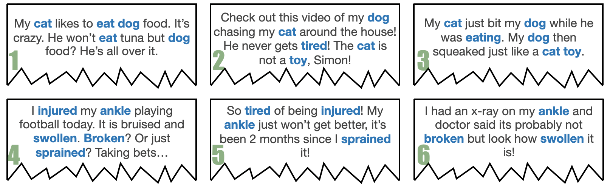
<p class="caption">(\#fig:studentgraph)A corpus of 6 documents. Words occurring in more than one document appear in bold. Stop words removed, stemming utilized. Document numbers correspond to term-document matrix below.</p>
</div>
\begin{equation*}
    \begin{array}{cc}
         & \begin{array}{cccccc} \;doc_1\; & \;doc_2\;& \;doc_3\;& \;doc_4\;& \;doc_5\;& \;doc_6\; \end{array}\\
          \begin{array}{c}
            \hbox{cat} \\
            \hbox{dog}\\
            \hbox{eat}\\
            \hbox{tired} \\
            \hbox{toy}\\
            \hbox{injured} \\
            \hbox{ankle} \\
            \hbox{broken} \\
            \hbox{swollen} \\
            \hbox{sprained} \\
        \end{array} &
\left(
\begin{array}{cccccc}
\quad 1\quad   &  \quad 2\quad   &  \quad 2\quad   &  \quad 0\quad   &  \quad 0\quad   &  \quad 0\quad  \\
\quad 2\quad   &  \quad 3\quad   &  \quad 2\quad   &  \quad 0\quad   &  \quad 0\quad   &  \quad 0\quad  \\
\quad 2\quad   &  \quad 0\quad   &  \quad 1\quad   &  \quad 0\quad   &  \quad 0\quad   &  \quad 0\quad  \\
\quad 0\quad   &  \quad 1\quad   &  \quad 0\quad   &  \quad 0\quad   &  \quad 1\quad   &  \quad 0\quad  \\
\quad 0\quad   &  \quad 1\quad   &  \quad 1\quad   &  \quad 0\quad   &  \quad 0\quad   &  \quad 0\quad  \\
\quad 0\quad   &  \quad 0\quad   &  \quad 0\quad   &  \quad 1\quad   &  \quad 1\quad   &  \quad 0\quad  \\
\quad 0\quad   &  \quad 0\quad   &  \quad 0\quad   &  \quad 1\quad   &  \quad 1\quad   &  \quad 1\quad  \\
\quad 0\quad   &  \quad 0\quad   &  \quad 0\quad   &  \quad 1\quad   &  \quad 0\quad   &  \quad 1\quad  \\
\quad 0\quad   &  \quad 0\quad   &  \quad 0\quad   &  \quad 1\quad   &  \quad 0\quad   &  \quad 1\quad  \\
\quad 0\quad   &  \quad 0\quad   &  \quad 0\quad   &  \quad 1\quad   &  \quad 1\quad   &  \quad 0\quad  \\
\end{array}\right)
\end{array}
\end{equation*}
 
We'll start by entering this matrix into R. Of course the process of parsing a collection of documents and creating a term-document matrix is generally more automatic. The `tm` text mining library is recommended for creating a term-document matrix in practice. 


```r
A=matrix(c(1,2,2,0,0,0,
           2,3,2,0,0,0,
           2,0,1,0,0,0,
           0,1,0,0,1,0,
           0,1,1,0,0,0,
           0,0,0,1,1,0,
           0,0,0,1,1,1,
           0,0,0,1,0,1,
           0,0,0,1,0,1,
           0,0,0,1,1,0), 
         nrow=10, byrow=T)
A
```

```
##       [,1] [,2] [,3] [,4] [,5] [,6]
##  [1,]    1    2    2    0    0    0
##  [2,]    2    3    2    0    0    0
##  [3,]    2    0    1    0    0    0
##  [4,]    0    1    0    0    1    0
##  [5,]    0    1    1    0    0    0
##  [6,]    0    0    0    1    1    0
##  [7,]    0    0    0    1    1    1
##  [8,]    0    0    0    1    0    1
##  [9,]    0    0    0    1    0    1
## [10,]    0    0    0    1    1    0
```

Because our corpus is so small, we'll skip the step of term-weighting, but we _will_ normalize the documents to have equal length. In other words, we'll divide each document vector by its two-norm so that it becomes a unit vector:


```r
A_norm = apply(A, 2, function(x){x/c(sqrt(t(x)%*%x))})
A_norm
```

```
##            [,1]      [,2]      [,3]      [,4] [,5]      [,6]
##  [1,] 0.3333333 0.5163978 0.6324555 0.0000000  0.0 0.0000000
##  [2,] 0.6666667 0.7745967 0.6324555 0.0000000  0.0 0.0000000
##  [3,] 0.6666667 0.0000000 0.3162278 0.0000000  0.0 0.0000000
##  [4,] 0.0000000 0.2581989 0.0000000 0.0000000  0.5 0.0000000
##  [5,] 0.0000000 0.2581989 0.3162278 0.0000000  0.0 0.0000000
##  [6,] 0.0000000 0.0000000 0.0000000 0.4472136  0.5 0.0000000
##  [7,] 0.0000000 0.0000000 0.0000000 0.4472136  0.5 0.5773503
##  [8,] 0.0000000 0.0000000 0.0000000 0.4472136  0.0 0.5773503
##  [9,] 0.0000000 0.0000000 0.0000000 0.4472136  0.0 0.5773503
## [10,] 0.0000000 0.0000000 0.0000000 0.4472136  0.5 0.0000000
```

We then compute the SVD of `A_norm` and observe the left- and right-singular vectors. Since the matrix $\A$ is term-by-document, you might consider the terms as being the "units" of the rows of $\A$ and the documents as being the "units" of the columns. For example, $\A_{23}=2$ could logically be interpreted as "there are 2 units of the word _dog_ per _document number 3_". In this mentality, any factorization of the matrix should preserve those units. Similar to any ["Change of Units Railroad"](https://www.katmarsoftware.com/articles/railroad-track-unit-conversion.htm), matrix factorization can be considered in terms of units assigned to both rows and columns:
$$\A_{\text{term} \times \text{doc}} = \U_{\text{term} \times \text{factor}}\mathbf{D}_{\text{factor} \times \text{factor}}\V^T_{\text{factor} \times \text{doc}}$$
Thus, when we examine the rows of the matrix $\U$, we're looking at information about each term and how it contributes to each factor (i.e. the "factors" are just linear combinations of our elementary term vectors); When we examine the columns of the matrix $\V^T$, we're looking at information about how each document is related to each factor (i.e. the documents are linear combinations of these factors with weights corresponding to the elements of $\V^T$). And what about $\mathbf{D}?$ Well, in classical factor analysis the matrix $\mathbf{D}$ is often combined with either $\U$ or $\V^T$ to obtain a two-matrix factorization. $\mathbf{D}$ describes how much information or signal from our original matrix exists along each of the singular components.  It is common to use a __screeplot__, a simple line plot of the singular values in $\mathbf{D}$, to determine an appropriate _rank_ for the truncation in Equation \@ref(eq:truncsvd).


```r
out = svd(A_norm)
plot(out$d, ylab = 'Singular Values of A_norm')
```

<div class="figure" style="text-align: center">

<p class="caption">(\#fig:screetext)Screeplot for the Toy Text Dataset</p>
</div>
Noticing the gap, or "elbow" in the screeplot at an index of 2 lets us know that the first two singular components contain notably more information than the components to follow - A major proportion of pattern or signal in this matrix lies long 2 components, i.e. __there are 2 major topics that might provide a reasonable approximation to the data__. What's a "topic" in a vector space model? A linear combination of terms! It's just a column vector in the term space! Let's first examine the left-singular vectors in $\U$. Remember, the _rows_ of this matrix describe how the terms load onto factors, and the columns are those mysterious "factors" themselves. 


```r
out$u
```

```
##              [,1]        [,2]        [,3]        [,4]        [,5]        [,6]
##  [1,] -0.52980742 -0.04803212  0.01606507 -0.24737747  0.23870207  0.45722153
##  [2,] -0.73429739 -0.06558224  0.02165167 -0.08821632 -0.09484667 -0.56183983
##  [3,] -0.34442976 -0.03939120  0.10670326  0.83459702 -0.14778574  0.25277609
##  [4,] -0.11234648  0.16724740 -0.47798864 -0.22995963 -0.59187851 -0.07506297
##  [5,] -0.20810051 -0.01743101 -0.01281893 -0.34717811  0.23948814  0.42758997
##  [6,] -0.03377822  0.36991575 -0.41154158  0.15837732  0.39526231 -0.10648584
##  [7,] -0.04573569  0.58708873  0.01651849 -0.01514815 -0.42604773  0.38615891
##  [8,] -0.02427277  0.41546131  0.45839081 -0.07300613  0.07255625 -0.15988106
##  [9,] -0.02427277  0.41546131  0.45839081 -0.07300613  0.07255625 -0.15988106
## [10,] -0.03377822  0.36991575 -0.41154158  0.15837732  0.39526231 -0.10648584
```


So the first "factor" of SVD is as follows:

$$\text{factor}_1 = 
 -0.530 \text{cat} -0.734 \text{dog}-0.344 \text{eat}-0.112 \text{tired} -0.208 \text{toy}-0.034 \text{injured} -0.046 \text{ankle}-0.024 \text{broken} -0.024 \text{swollen} -0.034 \text{sprained} $$
 We can immediately see why people had trouble with LSI as a topic model -- it's hard to intuit how you might treat a mix of positive and negative coefficients in the output.  If we ignore the signs and only investigate the absolute values, we can certainly see some meaningful topic information in this first factor: the largest magnitude weights all go to the words from the documents about pets. You might like to say that negative entries mean a topic is _anticorrelated_ with that word, and to some extent this is correct. That logic works nicely, in fact, for factor 2:   

$$\text{factor}_2 = -0.048\text{cat}-0.066\text{dog}-0.039\text{eat}+ 0.167\text{tired} -0.017\text{toy} 0.370\text{injured}+ 0.587\text{ankle}  +0.415\text{broken} + 0.415\text{swollen} + 0.370\text{sprained}$$
However, circling back to factor 1 then leaves us wanting to see different signs for the two groups of words. Nevertheless, the information separating the words is most certainly present. Take a look at the plot of the words' loadings along the first two factors in Figure \@ref(fig:lsiwords).

<div class="figure" style="text-align: center">
preserve3e7910c341cee1d3
<p class="caption">(\#fig:lsiwords)Projection of the Terms onto First two Singular Dimensions</p>
</div>

Moving on to the documents, we can see a similar clustering pattern in the columns of $\V^T$ which are the rows of $\V$, shown below:


```r
out$v
```

```
##             [,1]        [,2]        [,3]        [,4]       [,5]       [,6]
## [1,] -0.55253068 -0.05828903  0.10665606  0.74609663 -0.2433982 -0.2530492
## [2,] -0.57064141 -0.02502636 -0.11924683 -0.62022594 -0.1219825 -0.5098650
## [3,] -0.60092838 -0.06088635  0.06280655 -0.10444424  0.3553232  0.7029012
## [4,] -0.04464392  0.65412158  0.05781835  0.12506090  0.6749109 -0.3092635
## [5,] -0.06959068  0.50639918 -0.75339800  0.06438433 -0.3367244  0.2314730
## [6,] -0.03357626  0.55493581  0.63206685 -0.16722869 -0.4803488  0.1808591
```
In fact, the ability to separate the documents with the first two singular vectors is rather magical here, as shown visually in Figure \@ref(fig:lsidocs). 

<div class="figure" style="text-align: center">
preservefe5ad89d7e17cca5
<p class="caption">(\#fig:lsidocs)Projection of the Docuemnts onto First two Singular Dimensions</p>
</div>

Figure \@ref(fig:lsidocs) demonstrates how documents that live in a 10-dimensional term space can be compressed down to 2-dimensions in a way that captures the major information of interest. If we were to take that 2-truncated SVD of our term-document matrix and multiply it back together, we'd see an _approximation_ of our original term-document matrix, and we could calculate the error involved in that approximation. We could equivalently calculate that error by using the singular values. 


```r
A_approx = out$u[,1:2]%*% diag(out$d[1:2])%*%t(out$v[,1:2])
# Sum of element-wise squared error 
(norm(A-A_approx,'F'))^2
```

```
## [1] 24.44893
```

```r
# Sum of squared singular values truncated
(sum(out$d[3:6]^2))
```

```
## [1] 1.195292
```

However, multiplying back to the original data is not generally an action of interest to data scientists. What we are after in the SVD is the dimensionality reduced data contained in the columns of $\V^T$ (or, if you've created a document-term matrix, the rows of $\U$. 

## Image Compression {#rappasvd}

While multiplying back to the original data is not generally something we'd like to do, it does provide a nice illustration of noise-reduction and signal-compression when working with images. The following example is not designed to teach you how to work with images for the purposes of data science. It is merely a nice visual way to _see_ what's happening when we truncate the SVD and omit these directions that have "minimal signal." 


### Image data in R

Let's take an image of a leader that we all know and respect:

<div class="figure" style="text-align: center">

<p class="caption">(\#fig:unnamed-chunk-110)Michael Rappa, PhD, Founding Director of the Institute for Advanced Analytics and Distinguished Professor at NC State</p>
</div>
This image can be downloaded from the IAA website, after clicking on the link on the left hand side "Michael Rappa / Founding Director."

Let's read this image into R. You'll need to install the pixmap package:

```r
#install.packages("pixmap")
library(pixmap)
```
Download the image to your computer and then set your working directory in R as the same place you have saved the image:

```r
setwd("/Users/shaina/Desktop/lin-alg")
```
The first thing we will do is examine the image as an [R,G,B] (extension .ppm) and as a grayscale (extension .pgm). Let's start with the [R,G,B] image and see what the data looks like in R:

```r
rappa = read.pnm("LAdata/rappa.ppm")
```

```
## Warning in rep(cellres, length = 2): 'x' is NULL so the result will be NULL
```

```r
#Show the type of the information contained in our data:
str(rappa)
```

```
## Formal class 'pixmapRGB' [package "pixmap"] with 8 slots
##   ..@ red     : num [1:160, 1:250] 1 1 1 1 1 1 1 1 1 1 ...
##   ..@ green   : num [1:160, 1:250] 1 1 1 1 1 1 1 1 1 1 ...
##   ..@ blue    : num [1:160, 1:250] 1 1 1 1 1 1 1 1 1 1 ...
##   ..@ channels: chr [1:3] "red" "green" "blue"
##   ..@ size    : int [1:2] 160 250
##   ..@ cellres : num [1:2] 1 1
##   ..@ bbox    : num [1:4] 0 0 250 160
##   ..@ bbcent  : logi FALSE
```
You can see we have 3 matrices - one for each of the colors: red, green, and blue.
Rather than a traditional data frame, when working with an image, we have to refer to the elements in this data set with @ rather than with $.

```r
rappa@size
```

```
## [1] 160 250
```
We can then display a heat map showing the intensity of each individual color in each pixel:

```r
rappa.red=rappa@red
rappa.green=rappa@green
rappa.blue=rappa@blue
image(rappa.green)
```

<div class="figure" style="text-align: center">

<p class="caption">(\#fig:unnamed-chunk-115)Intensity of green in each pixel of the original image</p>
</div>

Oops! Dr. Rappa is sideways. To rotate the graphic, we actually have to rotate our coordinate system. There is an easy way to do this (with a little bit of matrix experience), we simply transpose the matrix and then reorder the columns so the last one is first: (note that ``` nrow(rappa.green)``` gives the number of columns in the transposed matrix)


```r
rappa.green=t(rappa.green)[,nrow(rappa.green):1]
image(rappa.green)
```


Rather than compressing the colors individually, let's work with the grayscale image:


```r
greyrappa = read.pnm("LAdata/rappa.pgm")
```

```
## Warning in rep(cellres, length = 2): 'x' is NULL so the result will be NULL
```

```r
str(greyrappa)
```

```
## Formal class 'pixmapGrey' [package "pixmap"] with 6 slots
##   ..@ grey    : num [1:160, 1:250] 1 1 1 1 1 1 1 1 1 1 ...
##   ..@ channels: chr "grey"
##   ..@ size    : int [1:2] 160 250
##   ..@ cellres : num [1:2] 1 1
##   ..@ bbox    : num [1:4] 0 0 250 160
##   ..@ bbcent  : logi FALSE
```

```r
rappa.grey=greyrappa@grey
#again, rotate 90 degrees
rappa.grey=t(rappa.grey)[,nrow(rappa.grey):1]
```


```r
image(rappa.grey, col=grey((0:1000)/1000))
```

<div class="figure">

<p class="caption">(\#fig:unnamed-chunk-118)Greyscale representation of original image</p>
</div>

### Computing the SVD of Dr. Rappa

Now, let's use what we know about the SVD to compress this image. First, let's compute the SVD and save the individual components. Remember that the rows of $\mathbf{v}^T$ are the right singular vectors. R outputs the matrix $\mathbf{v}$ which has the singular vectors in columns.


```r
rappasvd=svd(rappa.grey)
U=rappasvd$u
d=rappasvd$d
Vt=t(rappasvd$v)
```

Now let's compute some approximations of rank 3, 10 and 50:

```r
rappaR3=U[ ,1:3]%*%diag(d[1:3])%*%Vt[1:3, ]
image(rappaR3, col=grey((0:1000)/1000))
```

<div class="figure" style="text-align: center">

<p class="caption">(\#fig:unnamed-chunk-120)Rank 3 approximation of the image data</p>
</div>

```r
rappaR10=U[ ,1:10]%*%diag(d[1:10])%*%Vt[1:10, ]
image(rappaR10, col=grey((0:1000)/1000))
```

<div class="figure" style="text-align: center">

<p class="caption">(\#fig:unnamed-chunk-121)Rank 10 approximation of the image data</p>
</div>

```r
rappaR25=U[ ,1:25]%*%diag(d[1:25])%*%Vt[1:25, ]
image(rappaR25, col=grey((0:1000)/1000))
```

<div class="figure" style="text-align: center">

<p class="caption">(\#fig:unnamed-chunk-122)Rank 50 approximation of the image data</p>
</div>

How many singular vectors does it take to recognize Dr. Rappa? Certainly 25 is sufficient. Can you recognize him with even fewer? You can play around with this and see how the image changes.

### The Noise

One of the main benefits of the SVD is that the _signal-to-noise_ ratio of each component decreases as we move towards the right end of the SVD sum. If $\mathbf{x}$ is our data matrix (in this example, it is a matrix of pixel data to create an image) then,

\begin{equation}
\mathbf{X}= \sigma_1\mathbf{u}_1\mathbf{v}_1^T + \sigma_2\mathbf{u}_2\mathbf{v}_2^T + \sigma_3\mathbf{u}_3\mathbf{v}_3^T + \dots + \sigma_r\mathbf{u}_r\mathbf{v}_r^T
(\#eq:svdsum)
\end{equation}

where $r$ is the rank of the matrix. Our image matrix is full rank, $r=160$. This is the number of nonzero singular values, $\sigma_i$. But, upon examinination, we see many of the singular values are nearly 0. Let's examine the last 20 singular values:


```r
d[140:160]
```

```
##  [1] 0.035731961 0.033644986 0.033030189 0.028704912 0.027428124 0.025370919
##  [7] 0.024289497 0.022991926 0.020876657 0.020060538 0.018651373 0.018011032
## [13] 0.016299834 0.015668836 0.013928107 0.013046327 0.011403096 0.010763141
## [19] 0.009210187 0.008421977 0.004167310
```

We can think of these values as the amount of "information" directed along those last 20 singular components. If we assume the noise in the image or data is uniformly distributed along each orthogonal component $\mathbf{u}_i\mathbf{v}_i^T$, then there is just as much noise in the component $\sigma_1\mathbf{u}_1\mathbf{v}_1^T$ as there is in the component $\sigma_{160}\mathbf{u}_{160}\mathbf{v}_{160}^T$. But, as we've just shown, there is far less information in the component $\sigma_{160}\mathbf{u}_{160}\mathbf{v}_{160}^T$ than there is in the component $\sigma_1\mathbf{u}_1\mathbf{v}_1^T$. This means that the later components are primarily noise. Let's see if we can illustrate this using our image. We'll construct the parts of the image that are represented on the last few singular components

(ref:last25) The last 25 components, or the sum of the last 25 terms in equation \@ref(eq:svdsum)


```r
# Using the last 25 components:

rappa_bad25=U[ ,135:160]%*%diag(d[135:160])%*%Vt[135:160, ]
image(rappa_bad25, col=grey((0:1000)/1000))
```

<div class="figure" style="text-align: center">

<p class="caption">(\#fig:unnamed-chunk-124)(ref:last25)</p>
</div>

(ref:last50) The last 50 components, or the sum of the last 50 terms in equation \@ref(eq:svdsum)


```r
# Using the last 50 components:

rappa_bad50=U[ ,110:160]%*%diag(d[110:160])%*%Vt[110:160, ]
image(rappa_bad50, col=grey((0:1000)/1000))
```

<div class="figure" style="text-align: center">

<p class="caption">(\#fig:unnamed-chunk-125)(ref:last50)</p>
</div>

(ref:last100) The last 100 components, or the sum of the last 100 terms in equation \@ref(eq:svdsum)


```r
# Using the last 100 components: (4 times as many components as it took us to recognize the face on the front end)

rappa_bad100=U[ ,61:160]%*%diag(d[61:160])%*%Vt[61:160, ]
image(rappa_bad100, col=grey((0:1000)/1000))
```

<div class="figure" style="text-align: center">

<p class="caption">(\#fig:unnamed-chunk-126)(ref:last100)</p>
</div>

Mostly noise. In the last of these images, we see the outline of Dr. Rappa. One of the first things to go when images are compressed are the crisp outlines of objects. This is something you may have witnessed in your own experience, particularly when changing the format of a picture to one that compresses the size.

<!--chapter:end:04-SVD.Rmd-->

# Factor Analysis {#fa}

Factor Analysis is about looking for underlying _relationships_ or _associations_.  In that way, factor analysis is a correlational study of variables, aiming to group or cluster variables along dimensions. It may also be used to provide an estimate (factor score) of a latent construct which is a linear combination of variables. For example, a standardized test might ask hundreds of questions on a variety of quantitative and verbal subjects. Each of these questions could be viewed as a variable. However, the quantitative questions collectively are meant to measure some _latent_ factor, that is the individual's _quantitative reasoning_. A Factor Analysis might be able to reveal these two latent factors (quantitative reasoning and verbal ability) and then also provide an estimate (score) for each individual on each factor.

Any attempt to use factor analysis to summarize or reduce a set to data should be based on a conceptual foundation or hypothesis. It should be remembered that factor analysis will produce factors for most sets of data. Thus, if you simply analyze a large number of variables in the hopes that the technique will "figure it out", your results may look as though they are grasping at straws. The quality or meaning/interpretation of the derived factors is best when related to a conceptual foundation that existed prior to the analysis.


## Assumptions of Factor Analysis

<ol>
<li> No outliers in the data set
<li> Adequate sample size 
<ul>
  <li> As a rule of thumb, maintain a ratio of variables to factors of at least 3 (some say 5). This depends on the application.
  <li> You should have at least 10 observations for each variable (some say 20). This often depends on what value of factor loading you want to declare as significant. See Table \@ref(tab:factorsig) for the details on this.
<\ul>
<li> No perfect multicollinearity
<li> Homoskedasticity _not_ required between variables (all variances _not_ required to be equal)
<li> Linearity of variables desired - only models linear correlation between variables
<li> Interval data (as opposed to nominal)
<li> Measurement error on the variables/observations has constant variance and is, on average, 0
<li> Normality is not required
</ol>

|Sample Size<br> Needed for Significance| Factor Loading |
|:-----------------------:|:---------------------:|
|350       |    .30|
|   250    |    .35|
|   200    |    .40|
|   150    |    .45|
|   120    |    .50|
|   100    |    .55|
|     85   |    .60|
|     70   |    .65|
|     60   |    .70|
|     50   |    .75|

Table: Factor loadings are the correlation of each variable and the factor. This table is a guide for the sample sizes necessary to consider a factor loading significant. For example, in a sample of 100, factor loadings of 0.55 are considered significant. In a sample size of 70, however, factor loadings must reach 0.65 to be considered significant. Significance based on 0.05 level, a power level of 80 percent. Source: _Computations made with SOLO Power Analysis, BMDP Statistical Software, Inc., 1993_


## Determining Factorability

Before we even begin the process of factor analysis, we have to do some preliminary work to determine whether or not the data even lends itself to this technique. If none of our variables are correlated, then we cannot group them together in any meaningful way! Bartlett's Sphericity Test and the KMO index are two statistical tests for whether or not a set of variables can be factored. These tests _do not_ provide information about the appropriate number of factors, only whether or not such factors even exist.

### Visual Examination of Correlation Matrix

Depending on how many variables you are working with, you may be able to determine whether or not to proceed with factor analysis by simply examining the correlation matrix. With this examination, we are looking for two things:

1. Correlations that are significant at the 0.01 level of significance. At least half of the correlations should be significant in order to proceed to the next step.
2. Correlations are "sufficient" to justify applying factor analysis. As a rule of thumb, at least half of the correlations should be greater than 0.30.


### Barlett's Sphericity Test

Barlett's sphericity test checks if the observed correlation matrix is significantly different from the identity matrix. Recall that the correlation of two variables is equal to 0 if and only if they are orthogonal (and thus completely uncorrelated). When this is the case, we cannot reduce the number of variables any further, neither PCA nor Factor Analysis will be able to compress the information reliably into fewer dimensions. For Barlett's test,
$$H_0 = \mbox{ The variables are orthogonal} $$
Which implies that there are no underlying factors to be uncovered. Obviously, we must be able to reject this hypothesis for a meaningful result in PCA.

### Kaiser-Meyer-Olkin (KMO) Measure of Sampling Adequacy

The goal of the Kaiser-Meyer-Olkin (KMO) measure of sampling adequacy is similar to that of Bartlett's test in that it checks if we can factorize the original variables efficiently. However, the KMO measure is based on the idea of _partial correlation_ [@kmo]. The correlation matrix is always the starting point. We know that the variables are more or less correlated, but the correlation between two variables can be influenced by the others. So, we use the partial correlation in order to measure the relation between two variables by removing the effect of the remaining variables. The KMO index compares the raw values of correlations between variables and those of the partial correlations. If the KMO index is high ($\approx 1$), then PCA can act efficiently; if the KMO index is low ($\approx 0$), then PCA is not relevant. Generally a KMO index greater than 0.5 is considered acceptable to proceed with factor analysis. Table \@ref(tab:KMO) contains the information about interpretting KMO results that was provided in the original 1974 paper.


<table>
<tr>
<td> KMO value <td>Degree of <br> Common Variance</td>
<td>0.90 to 1.00  <td>Marvelous</td>
<td>0.80 to 0.89  <td>Middling</td>
<td>0.60 to 0.69   <td>Mediocre</td>
<td>0.50 to 0.59    <td>Miserable</td>
<td>0.00 to 0.49   <td>Don't Factor</td>
</table>
<caption>(\#tab:KMO) Interpretting the KMO value. [@kmo] </caption>


So, for example, if you have a survey with 100 questions/variables and you obtained a KMO index of 0.61, this tells you that the degree of common variance between your variables is mediocre, on the border of being miserable. While factor analysis may still be appropriate in this case, you will find that such an analysis will not account for a substantial amount of variance in your data. It may still account for enough to draw some meaningful conclusions, however.


## Communalities


You can think of **communalities** as multiple $R^2$ values for regression models predicting the variables of interest from the factors (the reduced number of factors that your model uses). The communality for a given variable can be interpreted as the proportion of variation in that variable explained by the chosen factors.

Take for example the SAS output for factor analysis on the Iris dataset shown in Figure \@ref(fig:factorOUT). The factor model (which settles on only one single factor) explains 98% of the variability in _petal length_. In other words, if you were to use this factor in a simple linear regression model to predict petal length, the associated $R^2$ value should be 0.98. Indeed you can verify that this is true. The results indicate that this single factor model will do the best job explaining variability in _petal length, petal width, and sepal length_.

(ref:factorOUT) SAS output for PROC FACTOR using Iris Dataset

<div class="figure" style="text-align: center">

<p class="caption">(\#fig:unnamed-chunk-127)(ref:factorOUT)</p>
</div>


One assessment of how well a factor model is doing can be obtained from the communalities. What you want to see is values that are close to one. This would indicate that the model explains most of the variation for those variables. In this case, the model does better for some variables than it does for others. 

If you take all of the communality values, $c_i$ and add them up you can get a total communality value:

$$\sum_{i=1}^p \widehat{c_i} = \sum_{i=1}^k \widehat{\lambda_i}$$


Here, the total communality is 2.918. The proportion of the total variation explained by the three factors is
$$\frac{2.918}{4}\approx 0.75.$$
The denominator in that fraction comes from the fact that the correlation matrix is used by default and our dataset has 4 variables. Standardized variables have variance of 1 so the total variance is 4. This gives us the percentage of variation explained in our model. This might be looked at as an overall assessment of the performance of the model. The individual communalities tell how well the model is working for the individual variables, and the total communality gives an overall assessment of performance. 

## Number of Factors

A good rule of thumb for determining the number of factors is to only choose factors with associated eigenvalue (or variance) greater than 1. Since the correlation matrix is used for factor analysis, we want our factors to explain more variance than any individual variable from our dataset. If this rule of thumb produces too many factors, it is reasonable to raise that limiting condition only if the number of factors still explains a reasonable amount of the total variance.


## Rotation of Factors

The purpose of rotating factors is to make them more interpretable. If factor loadings are relatively constant across variables, they don't help us find latent structure or clusters of variables. This will often happen in PCA when the goal is only to find directions of maximal variance. Thus, once the number of components/factors is fixed and a projection of the data onto a lower-dimensional subspace is done, we are free to rotate the axes of the result without losing any variance. The axes will no longer be principal components! The amount of variance explained by each factor will change, but the total amount of variance in the reduced data will stay the same because all we have done is rotate the basis. The goal is to rotate the factors in such a way that the loading matrix develops a more _sparse_ structure. A sparse loading matrix (one with lots of very small entries and few large entries) is far easier to interpret in terms of finding latent variable groups.

The two most common rotations are **varimax** and **quartimax**. The goal of _varimax_ rotation is to maximize the squared factor loadings in each factor, i.e. to simplify the columns of the factor matrix. In each factor, the large loadings are increased and the small loadings are decreased so that each factor has only a few variables with large loadings. In contrast, the goal of _quartimax_ rotation is to simply the rows of the factor matrix. In each variable the large loadings are increased and the small loadings are decreased so that each variable will only load on a few factors. Which of these factor rotations is appropriate 

<!--chapter:end:05-FA.Rmd-->

## Methods of Factor Analysis {#fa-apps}


Factor Analysis is much like PCA in that it attempts to find some latent variables (linear combinations of original variables) which can describe large portions of the total variance in data. There are numerous ways to compute factors for factor analysis, the two most common methods are:

1. The _principal axis_ method (i.e. PCA) and
2. Maximum Likelihood Estimation.

In fact, the default method for PROC FACTOR with no additional options is merely PCA. For some reason, the scores and factors may be scaled differently, involving the standard deviations of each factor, but nonetheless, there is absolutely nothing different between PROC FACTOR defaults and PROC PRINCOMP.

The difference between Factor Analysis and PCA is two-fold:

1. In factor analysis, the factors are usually rotated to obtain a more sparse (i.e. interprettable) structure _varimax_ rotation is the most common rotation. Others include _promax_, and _quartimax_.)
2. The factors try to only explain the "common variance" between variables. In other words, Factor Analysis tries to estimate how much of each variable's variance is specific to that variable and not "covarying" (for lack of a better word) with any other variables. This specific variance is then subtracted from the diagonal of the covariance matrix before factors or components are found.


We'll talk more about the first difference than the second because it generally carries more advantages.

### PCA Rotations
Let's first talk about the motivation behind principal component rotations. Compare the following sets of (fabricated) factors, both using the variables from the iris dataset. Listed below are the loadings of each variable on two factors. Which set of factors is more easily interpretted? 

<!-- \mathbf{b}egin{center} -->
<!-- \mathbf{b}egin{minipage}{\textwidth} -->
<!--   \mathbf{b}egin{minipage}[b]{0.47\textwidth} -->

<!-- \captionof*{table}{Factor Set 1} -->
<!-- \mathbf{b}egin{tabular}{c|c|c|} -->
<!--  Variable             & P1 & P2\\ -->
<!--               \hline -->
<!-- Sepal.Length  & -.3 & .7 \\ -->
<!-- Sepal.Width   & -.5 & .4 \\ -->
<!-- Petal.Length  & .7 & .3  \\ -->
<!-- Petal.Width   & .4 & -.5 \\ -->
<!-- \end{tabular} -->
<!-- \end{minipage} -->
<!-- \hfill -->
<!--   \mathbf{b}egin{minipage}[b]{0.47\textwidth} -->
<!-- \captionof*{table}{Factor Set 2} -->
<!-- \mathbf{b}egin{tabular}{c|c|c|} -->
<!--    Variable           & F1 & F2\\ -->
<!--               \hline -->
<!-- Sepal.Length  & 0 & .9 \\ -->
<!-- Sepal.Width   & -.9 & 0 \\ -->
<!-- Petal.Length  & .8 & 0  \\ -->
<!-- Petal.Width   & .1 & -.9 \\ -->
<!-- \end{tabular} -->
<!-- \end{minipage} -->
<!-- \end{minipage} -->
<!-- \end{center} -->

The difference between these factors might be described as ``sparsity". Factor Set 2 has more zero loadings than Factor Set 1. It also has entries which are comparitively larger in magnitude. This makes Factor Set 2 much easier to interpret! Clearly F1 is dominated by the variables Sepal.Width (positively correlated) and Petal.Length (negatively correlated), whereas F2 is dominated by the variables Sepal.Length (positively) and Petal.Width (negatively). Factor interpretation doesn't get much easier than that! With the first set of factors, the story is not so clear.

This is the whole purpose of factor rotation, to increase the interpretability of factors by encouraging sparsity. Geometrically, factor rotation tries to rotate a given set of factors (like those derived from PCA) to be more closely aligned with the original variables once the dimensions of the space have been reduced and the variables have been pushed closer together in the factor space. Let's take a look at the actual principal components from the iris data and then rotate them using a varimax rotation. In order to rotate the factors, we have to decide on some number of factors to use. If we rotated all 4 orthogonal components to find sparsity, we'd just end up with our original variables again!


```r
irispca = princomp(iris[,1:4],scale=T)
```

```
## Warning: In princomp.default(iris[, 1:4], scale = T) :
##  extra argument 'scale' will be disregarded
```

```r
summary(irispca)
```

```
## Importance of components:
##                           Comp.1     Comp.2     Comp.3      Comp.4
## Standard deviation     2.0494032 0.49097143 0.27872586 0.153870700
## Proportion of Variance 0.9246187 0.05306648 0.01710261 0.005212184
## Cumulative Proportion  0.9246187 0.97768521 0.99478782 1.000000000
```

```r
irispca$loadings
```

```
## 
## Loadings:
##              Comp.1 Comp.2 Comp.3 Comp.4
## Sepal.Length  0.361  0.657  0.582  0.315
## Sepal.Width          0.730 -0.598 -0.320
## Petal.Length  0.857 -0.173        -0.480
## Petal.Width   0.358        -0.546  0.754
## 
##                Comp.1 Comp.2 Comp.3 Comp.4
## SS loadings      1.00   1.00   1.00   1.00
## Proportion Var   0.25   0.25   0.25   0.25
## Cumulative Var   0.25   0.50   0.75   1.00
```

```r
# Since 2 components explain a large proportion of the variation, lets settle on those two:
rotatedpca = varimax(irispca$loadings[,1:2])
rotatedpca$loadings
```

```
## 
## Loadings:
##              Comp.1 Comp.2
## Sepal.Length  0.223  0.716
## Sepal.Width  -0.229  0.699
## Petal.Length  0.874       
## Petal.Width   0.366       
## 
##                Comp.1 Comp.2
## SS loadings      1.00   1.00
## Proportion Var   0.25   0.25
## Cumulative Var   0.25   0.50
```

```r
# Not a drastic amount of difference, but clearly an attempt has been made to encourage
# sparsity in the vectors of loadings.

# NOTE: THE ROTATED FACTORS EXPLAIN THE SAME AMOUNT OF VARIANCE AS THE FIRST TWO PCS
# AFTER PROJECTING THE DATA INTO TWO DIMENSIONS (THE BIPLOT) ALL WE DID WAS ROTATE THOSE
# ORTHOGONAL AXIS. THIS CHANGES THE PROPORTION EXPLAINED BY *EACH* AXIS, BUT NOT THE TOTAL
# AMOUNT EXPLAINED BY THE TWO TOGETHER.

# The output from varimax can't tell you about proportion of variance in the original data
# because you didn't even tell it what the original data was!
```

## Case Study: Personality Tests

In this example, we'll use a publicly available dataset that describes personality traits of nearly 
Read in the Big5 Personality test dataset, which contains likert scale responses (five point scale where 1=Disagree, 3=Neutral, 5=Agree. 0 = missing) on 50 different questions in columns 8 through 57. The questions, labeled E1-E10 (E=extroversion), N1-N10 (N=neuroticism), A1-A10 (A=agreeableness), C1-C10 (C=conscientiousness), and O1-O10 (O=openness) all attempt to measure 5 key angles of human personality. The first 7 columns contain demographic information coded as follows:
<ol>
<li> **Race**	Chosen from a drop down menu. 
<ul>
<li> 1=Mixed Race
<li> 2=Arctic (Siberian, Eskimo)
<li> 3=Caucasian (European)
<li> 4=Caucasian (Indian)
<li> 5=Caucasian (Middle East)
<li> 6=Caucasian (North African, Other)
<li> 7=Indigenous Australian
<li> 8=Native American
<li> 9=North East Asian (Mongol, Tibetan, Korean Japanese, etc)
<li> 10=Pacific (Polynesian, Micronesian, etc)
<li> 11=South East Asian (Chinese, Thai, Malay, Filipino, etc)
<li> 12=West African, Bushmen, Ethiopian
<li> 13=Other (0=missed)
</ul>
<li> **Age**	Entered as text (individuals reporting age < 13 were not recorded)
<li> **Engnat**	Response to "is English your native language?"
<ul>
<li> 1=yes
<li> 2=no
<li> 0=missing
</ul>
<li> **Gender**	Chosen from a drop down menu
<ul>
<li> 1=Male
<li> 2=Female
<li> 3=Other
<li> 0=missing
</ul>
<li> **Hand**	"What hand do you use to write with?"
<ul>
<li> 1=Right
<li> 2=Left
<li> 3=Both
<li> 0=missing
</ul>
</ol>


```r
options(digits=2)
big5 = read.csv('http://birch.iaa.ncsu.edu/~slrace/LinearAlgebra2021/Code/big5.csv')
```

To perform the same analysis we did in SAS, we want to use Correlation PCA and rotate the axes with a varimax transformation. We will start by performing the PCA. We need to set the option ```scale=T} to perform PCA on the correlation matrix rather than the default covariance matrix. We will only compute the first 5 principal components because we have 5 personality traits we are trying to measure. We could also compute more than 5 and take the number of components with eigenvalues >1 to match the default output in SAS (without n=5 option).

### Raw PCA Factors


```r
options(digits=5)
pca.out = prcomp(big5[,8:57], rank = 5, scale = T)
```

Remember the only difference between the default PROC PRINCOMP output and the default PROC FACTOR output in SAS was the fact that the eigenvectors in PROC PRINCOMP were normalized to be unit vectors and the factor vectors in PROC FACTOR were those same eigenvectors scaled by the square roots of the eigenvalues. So we want to multiply each eigenvector column output in ```pca.out$rotation``` (recall this is the loading matrix or matrix of eigenvectors) by the square root of the corresponding eigenvalue given in ```pca.out$sdev```. You'll recall that multiplying a matrix by a diagonal matrix on the right has the effect of scaling the columns of the matrix. So we'll just make a diagonal matrix, $\textbf{S}$ with diagonal elements from the ```pca.out$sdev``` vector and scale the columns of the ```pca.out$rotation``` matrix.  Similarly, the coordinates of the data along each component then need to be _divided_ by the standard deviation to cancel out this effect of lengthening the axis. So again we will multiply by a diagonal matrix to perform this scaling, but this time, we use the diagonal matrix $\textbf{S}^{-1}=$ ```diag(1/(pca.out$sdev))```. \\

Matrix multiplication in R is performed with the ```\%\*\%``` operator.


```r
fact.loadings = pca.out$rotation[,1:5] %*% diag(pca.out$sdev[1:5])
fact.scores = pca.out$x[,1:5] %*%diag(1/pca.out$sdev[1:5])
# PRINT OUT THE FIRST 5 ROWS OF EACH MATRIX FOR CONFIRMATION.
fact.loadings[1:5,1:5]
```

```
##        [,1]     [,2]     [,3]     [,4]     [,5]
## E1 -0.52057  0.27735 -0.29183  0.13456 -0.25072
## E2  0.51025 -0.35942  0.26959 -0.14223  0.21649
## E3 -0.70998  0.15791 -0.11623  0.21768 -0.11303
## E4  0.58361 -0.20341  0.31433 -0.17833  0.22788
## E5 -0.65751  0.31924 -0.16404  0.12496 -0.21810
```

```r
fact.scores[1:5,1:5]
```

```
##          [,1]     [,2]     [,3]      [,4]      [,5]
## [1,] -2.53286 -1.16617 0.276244  0.043229 -0.069518
## [2,]  0.70216 -1.22761 1.095383  1.615919 -0.562371
## [3,] -0.12575  1.33180 1.525208 -1.163062 -2.949501
## [4,]  1.29926  1.17736 0.044168 -0.784411  0.148903
## [5,] -0.37359  0.47716 0.292680  1.233652  0.406582
```

This should match the output from SAS and it does. Remember these columns are unique up to a sign, so you'll see factor 4 does not have the same sign in both software outputs. This is not cause for concern.

(ref:loads) Default (Unrotated) Factor Loadings Output by SAS

<div class="figure" style="text-align: center">

<p class="caption">(\#fig:unnamed-chunk-133)(ref:loads)</p>
</div>

(ref:scores) Default (Unrotated) Factor Scores Output by SAS

<div class="figure" style="text-align: center">
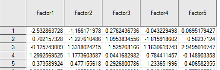
<p class="caption">(\#fig:unnamed-chunk-134)(ref:scores)</p>
</div>


### Rotated Principal Components

The next task we may want to undertake is a rotation of the factor axes according to the varimax procedure. The most simple way to go about this is to use the `varimax()` function to find the optimal rotation of the eigenvectors in the matrix `pca.out$rotation`. The `varimax()` function outputs both the new set of axes in the matrix called `loadings` and the rotation matrix (`rotmat`) which performs the rotation from the original principal component axes to the new axes. (i.e. if $\textbf{V}$ contains the old axes as columns and $\hat{\textbf{V}}$ contains the new axes and $\textbf{R}$ is the rotation matrix then $\hat{\textbf{V}} = \textbf{V}\textbf{R}$.) That rotation matrix can be used to perform the same rotation on the scores of the observations. If the matrix $\textbf{U}$ contains the scores for each observation, then the rotated scores $\hat{\textbf{U}}$ are found by $\hat{\textbf{U}} = \textbf{U}\textbf{R}$


```r
varimax.out = varimax(fact.loadings)
rotated.fact.loadings = fact.loadings %*% varimax.out$rotmat
rotated.fact.scores = fact.scores %*% varimax.out$rotmat
# PRINT OUT THE FIRST 5 ROWS OF EACH MATRIX FOR CONFIRMATION.
rotated.fact.loadings[1:5,]
```

```
##        [,1]       [,2]      [,3]        [,4]      [,5]
## E1 -0.71232 -0.0489043  0.010596 -0.03206926  0.055858
## E2  0.71592 -0.0031185  0.028946  0.03504236 -0.121241
## E3 -0.66912 -0.2604049  0.131609  0.01704690  0.263679
## E4  0.73332  0.1528552 -0.023367  0.00094685 -0.053219
## E5 -0.74534 -0.0757539  0.100875 -0.07140722  0.218602
```

```r
rotated.fact.scores[1:5,]
```

```
##          [,1]     [,2]     [,3]     [,4]       [,5]
## [1,] -1.09083 -2.04516  1.40699 -0.38254  0.5998386
## [2,]  0.85718 -0.19268  1.07708  2.03665 -0.2178616
## [3,] -0.92344  2.58761  2.43566 -0.80840 -0.1833138
## [4,]  0.61935  1.53087 -0.79225 -0.59901 -0.0064665
## [5,] -0.39495 -0.10893 -0.24892  0.99744  0.9567712
```

And again we can see that these line up with our SAS Rotated output, **however** the order does not have to be the same! SAS conveniently reorders the columns according to the variance of the data along that new direction. Since we have not done that in R, the order of the columns is not the same! Factors 1 and 2 are the same in both outputs, but SAS Factor 3 = R Factor 4 and SAS Factor 5 = (-1)* R Factor 4. The coordinates are switched too so nothing changes in our interpretation. Remember, when you rotate factors, you no longer keep the notion that the "first vector" explains the most variance unless you reorder them so that is true (like SAS does).


<div class="figure" style="text-align: center">
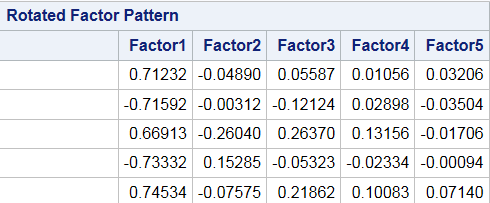
<p class="caption">(\#fig:rotloads)Rotated Factor Loadings Output by SAS</p>
</div>


```r
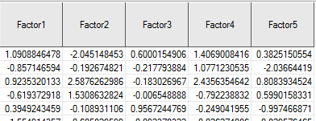
```

<div class="figure" style="text-align: center">

<p class="caption">(\#fig:rotscores)Rotated Factor Scores Output by SAS</p>
</div>


### Visualizing Rotation via BiPlots

Let's start with a peek at BiPlots of the first 2 \textit{pairs} of principal component loadings, prior to rotation. Notice that here I'm not going to bother with any scaling of the factor loadings as I'm not interested in forcing my output to look like SAS's output. I'm also downsampling the observations because 20,000 is far to many to plot. 


```r
biplot(pca.out$x[sample(1:19719,1000),1:2], 
       pca.out$rotation[,1:2],
       cex=c(0.2,1))
```

<div class="figure" style="text-align: center">

<p class="caption">(\#fig:unnamed-chunk-136)BiPlot of Projection onto PC1 and PC2</p>
</div>


```r
biplot(pca.out$x[sample(1:19719,1000),3:4], 
       pca.out$rotation[,3:4],
       cex=c(0.2,1))
```

<div class="figure" style="text-align: center">

<p class="caption">(\#fig:unnamed-chunk-137)BiPlot of Projection onto PC3 and PC4</p>
</div>


Let's see what happens to these biplots after rotation:


```r
vmax = varimax(pca.out$rotation)
newscores = pca.out$x%*%vmax$rotmat
biplot(newscores[sample(1:19719,1000),1:2], 
       vmax$loadings[,1:2],
       cex=c(0.2,1),
       xlab = 'Rotated Axis 1',
       ylab = 'Rotated Axis 2')
```

<div class="figure" style="text-align: center">

<p class="caption">(\#fig:unnamed-chunk-138)BiPlot of Projection onto Rotated Axes 1,2. Extroversion questions align with axis 1, Neuroticism with Axis 2</p>
</div>


```r
biplot(newscores[sample(1:19719,1000),3:4], 
       vmax$loadings[,3:4],
       cex=c(0.2,1),
       xlab = 'Rotated Axis 3',
       ylab = 'Rotated Axis 4')
```

<div class="figure" style="text-align: center">

<p class="caption">(\#fig:unnamed-chunk-139)BiPlot of Projection onto Rotated Axes 3,4. Agreeableness questions align with axis 3, Openness with Axis 4.</p>
</div>


After the rotation, we can see the BiPlots tell a more distinct story. The extroversion questions line up along rotated axes 1, neuroticism along rotated axes 2, and agreeableness and openness are reflected in rotated axes 3 and 4 respectively. The fifth rotated component can be confirmed to represent the last remaining category which is conscientiousness. 


<!--chapter:end:051-FA_apps.Rmd-->

# Dimension Reduction for Visualization {#otherdimred}

## Multidimensional Scaling

Multidimensional scaling is a technique which aims to represent higher-dimensional data in a lower-dimensional space while keeping the pairwise distances between points as close to their original distances as possible. It takes as input a distance matrix, $\D$ where $\D_{ij}$ is some measure of distance between observation $i$ and observation $j$ (most often Euclidean distance). The original observations may involve many variables and thus exist in a high-dimensional space. The output of MDS is a set of coordinates, usually in 2-dimensions for the purposes of visualization, such that the Euclidean distance between observation $i$ and observation $j$ in the new lower-dimensional representation is an approximation to $\D_{ij}$.

One of the outputs in R will be a measure that is akin to the "percentage of variation explained" by PCs. The difference is that the matrix we are representing is _not_ a covariance matrix, so this ratio is _not_ a percentage of variation. It can, however, be used to judge how much information is retained by the lower dimensional representation. This is output in the `GOF` vector (presumably standing for _Goodness of Fit_). The first entry in `GOF` gives the ratio of the sum of the $k$ largest eigenvalues to the sum of the absolute values of all the eigenvalues, and the second entry in `GOF` gives the ratio of the sum of the $k$ largest eigenvalues to the sum of only the positive eigenvalues.

$$GOF[1] = \frac{\sum_{i=1}^k \lambda_i}{\sum_{i=1}^n |\lambda_i|}$$
and
$$GOF[2] = \frac{\sum_{i=1}^k \lambda_i}{\sum_{i=1}^n \max(\lambda_i,0)}$$

### MDS of Iris Data

Let's take a dataset we've already worked with, like the iris dataset, and see how this is done. Recall that the iris data contains measurements of 150 flowers (50 each from 3 different species) on 4 variables: Sepal.Length, Sepal.Width, Petal.Length, and Petal.Width. To examine a 2-dimensional representation of this data via Multidimensional Scaling, we simply compute a distance matrix and run the MDS procedure:


```r
D = dist(iris[,1:4])
fit = cmdscale(D, eig=TRUE, k=2) # k is the number of dimensions desired
fit$eig[1:12] # view first dozen eigenvalues
```

```
##  [1] 6.3001e+02 3.6158e+01 1.1653e+01 3.5514e+00 3.4866e-13 3.1863e-13
##  [7] 2.0112e-13 1.3770e-13 7.7470e-14 3.2881e-14 3.0740e-14 2.1786e-14
```

```r
fit$GOF # view the Goodness of Fit measures
```

```
## [1] 0.97769 0.97769
```

```r
# plot the solution, colored by iris species:
x = fit$points[,1]
y = fit$points[,2]
# The pch= option controls the symbol output. 16=filled circles.
plot(x,y,col=c("red","green3","blue")[iris$Species], pch=16,
     xlab='Coordinate 1', ylab='Coordinate 2')
```

<div class="figure" style="text-align: center">

<p class="caption">(\#fig:unnamed-chunk-140)Multidimensional Scaling of the Iris Data</p>
</div>

We can tell from the eigenvalues alone that two dimensions should be relatively sufficient to summarize this data. After two large eigenvalues, the remainder drop off and become small,  signifying a lack of further information. Indeed, the Goodness of Fit measurements back up this intuition: values close to 1 indicate a good fit with minimal error.

### MDS of Leukemia dataset

Let's take a look at another example, this time using the Leukemia dataset which has 5000 variables. It is unreasonable to expect that we can get as good of a fit of this data using only two dimensions! There will obviously be much more error. However, we can still get a visualization that should at least show us which observations are close to each other and which are far away.


```r
leuk=read.csv('http://birch.iaa.ncsu.edu/~slrace/Code/leukemia.csv')
```


As you may recall, this data has some variables with 0 variance; those entire columns are constant. To determine which ones, we first remove the last column which is a character vector that identifies the type of leukemia.


```r
type = leuk[ , 5001]
leuk = leuk[,1:5000]
# If desired, could supply names of columns that have 0 variance with
# names(leuk[, sapply(leuk, function(v) var(v, na.rm=TRUE)==0)])
# The na.rm=T would allow us to keep any missing information and still compute
# the variance using the non-missing values. In this instance, it is not necessary
# because we have no missing values.

# We can remove these columns from the data with:
leuk=leuk[,apply(leuk, 2, var, na.rm=TRUE) != 0]

# compute distances matrix
t=dist(leuk)
fit=cmdscale(t,eig=TRUE, k=2)

fit$GOF
```

```
## [1] 0.35822 0.35822
```

```r
x = fit$points[,1]
y = fit$points[,2]
#The cex= controls the size of the circles in the plot function.
plot(x,y,col=c("red","green","blue")[factor(type)], cex=3,
     xlab='Coordinate 1', ylab='Coordinate 2',
     main = 'Multidimensional Scaling of Raw Leukemia Data')
text(x,y,labels=row.names(leuk))
```

<div class="figure" style="text-align: center">

<p class="caption">(\#fig:unnamed-chunk-143)Multidimensional Scaling of the Leukemia Data</p>
</div>


What if we standardize our data before running the MDS procedure? Will that effect our results? Let's see how it looks on the standardized version of the leukemia data.


```r
# We can experiment with standardization to see how it
# effects our results:

leuk2=scale(leuk,center=TRUE, scale=TRUE)
t2=dist(leuk2)
fit2=cmdscale(t2,eig=TRUE,k=2)
fit2$GOF
```

```
## [1] 0.21287 0.21287
```

```r
x2 = fit2$points[,1]
y2 = fit2$points[,2]
#The cex= controls the size of the circles in the plot function.
plot(x2,y2,col=c("red","green","blue")[factor(type)], cex=3,
     xlab='Coordinate 1', ylab='Coordinate 2',
     main = 'Multidimensional Scaling of Standardized Leukemia Data')
text(x2,y2,labels=row.names(leuk))
```


### A note on standardization {-}

Clearly, things have changed substantially. We shouldn't give to much creedence to the decreased Goodness of Fit statistics. I don't necessarily believe that we are explaining less information just because we scaled our data, the fact that this number has changed should likely be attributed to the fact that we have significantly decreased all of the eigenvalues of the matrix, and not in any predictable or meaningful way. It's more important to focus on what we are trying to represent and that is differences between samples. Perhaps if there are some genes for which values vary wildly between the different leukemia types, and other genes which don't show much variation, then we should keep this information in the data. By standardizing the data, we're making the variation of every gene equal to 1 - which stands to wash out some of the bigger, more discriminating factors in the distance calculations. This consideration is something that will need to be made for each dataset on a case-by-case basis. If our dataset had variables with wide scale variations (like income and number of cars) then standardization is a much more reasonable approach! 


There are several things to keep in mind when studying an MDS map.

1. The axis are, by themselves, meaningless.
2. The orientation of the picture is completely arbitrary.
3. All that matters is the relative proximity of the points in the map. Are they close? Are they far apart?


<!--chapter:end:06-OtherDimRed.Rmd-->

# Social Network Analysis {#sna}

## Working with Network Data

We'll use the popular ``igraph`` package to explore the student slack network in R. The data has been anonymized for use in this text. First, we load the two data frames that contain the information for our network: 
- ``SlackNetwork``  contains the interactions between pairs of students. An interaction between students was defined as either an emoji-reaction or threaded reply to a post. The _source_ of the interaction is the individual reacting or replying and the _target_ of the interaction is the user who originated the post. This data frame also contains the channel in which the interaction takes place, and 9 binary flags indicating the presence or absence of certain keywords or phrases of interest.
- ``users`` contains user-level attributes like the cohort to which a student belongs ('blue' or 'orange').


```r
library(igraph)
load('LAdata/slackanon2021.RData')
```


```r
head(SlackNetwork)
```

```
##        source      target channel notes study howdoyou python     R   SAS  beer
## 1 U0130T4056Y U0130T30B36  random FALSE FALSE    FALSE  FALSE FALSE FALSE FALSE
## 2 U012UMSH7FC U0130T30B36  random FALSE FALSE    FALSE  FALSE FALSE FALSE FALSE
## 3 U012N097BUN U0130T30B36  random FALSE FALSE    FALSE  FALSE FALSE FALSE FALSE
## 4 U012E0B3YBZ U0130T30B36  random FALSE FALSE    FALSE  FALSE FALSE FALSE FALSE
## 5 U0130T1GKMJ U0130T30B36  random FALSE FALSE    FALSE  FALSE FALSE FALSE FALSE
## 6 U0130T486SY U0130T30B36  random FALSE FALSE    FALSE  FALSE FALSE FALSE FALSE
##    food snack edgeID
## 1 FALSE FALSE      1
## 2 FALSE FALSE      2
## 3 FALSE FALSE      3
## 4 FALSE FALSE      4
## 5 FALSE FALSE      5
## 6 FALSE FALSE      6
```

```r
head(users)
```

```
##        userID Cohort
## 1 U012E07QP1D      o
## 2 U012E08EWTZ      b
## 3 U012E08R0CX      o
## 4 U012E08TYMV      b
## 5 U012E096VF1      o
## 6 U012E09JRAB      o
```

Using this information, we can create an igraph network object using the ``graph_from_data_frame()`` function. We can then apply some functions from the igraph package to discover the underlying data as we've already seen it. Because this network has almost 42,000 edges overall, we'll subset the data and only look at interactions from the general channel.

## Network Visualization - ``igraph`` package


```r
SlackNetworkSubset = SlackNetwork[SlackNetwork$channel=='general',]
slack = graph_from_data_frame(SlackNetworkSubset, directed = TRUE, vertices = users)
plot(slack)
```


The default plots certainly leave room for improvement. We notice that one user is not connected to the rest of the network in the general channel, signifying that this user has not reacted or replied in a threaded fashion to any posts in this channel, nor have they created a post that received any interaction. We can delete this vertex from the network by taking advantage of the `delete.vertices()` function specifying that we want to remove all vertices with degree equal to zero. You'll recall that the degree of a vertex is the number of edges that connect to it.


```r
slack=delete.vertices(slack,degree(slack)==0)
```

There are various ways that we can improve the network visualization, but we will soon see that _layout_ is, by far, the most important. First, let's explore how we can use the plot options to change the line weight, size, and color of the nodes and edges to improve the visualization in the following chunk. 


```r
plot(slack, edge.arrow.size = .3, vertex.label=NA,vertex.size=10,
     vertex.color='gray',edge.color='blue')
```


### Layout algorithms for ``igraph`` package

The igraph package has many different layout algorithms available; type `?igraph::layout` for a list of them. By clicking on each layout in the help menu, you'll be able to distinguish which of the layouts are force-directed and which are not. Force-directed layouts generally provide the highest quality network visualizations. The Davidson-Harel (``layout_with_dh``), Fruchterman-Reingold  (``layout_with_fr``), DrL (``layout_with_drl``) and multidimensional scaling algorithms (``layout_with_mds``) are probably the most well-known algorithms available in this package.

We recommend that you compute the layout outside of the plot function so that you may use it again without re-computing it. After all, a layout is just a two dimensional array of coordinates that specifies where each node should be placed. If you compute the layout inside the plot function then every time you make a small adjustment like color or edge arrow size, you will have to your computer will have to re-compute the layout algorithm.

The following code chunk computes 4 different layouts and then plots the resulting networks on a 2x2 grid for comparison. We encourage you to substitute four _different_ layouts (listed in the help document at the bottom) in place of the ones chosen here as part of your exploration.


```r
#?igraph::layout
l = layout_with_lgl(slack)
l2 = layout_with_fr(slack)
l3 = layout_with_drl(slack)
l4 =  layout_with_mds(slack)
par(mfrow=c(2,2),mar=c(1,1,1,1)) 
# Above tells the graphic window to use the
# following plots to fill out a 2x2 grid with margins of 1 unit
# on each side. Must reset these options with dev.off() when done!
plot(slack, edge.arrow.size = .3, vertex.label=NA,vertex.size=10,
     vertex.color='lightblue', layout=l,main="Large Graph Layout")
plot(slack, edge.arrow.size = .3, vertex.label=NA,vertex.size=10,
     vertex.color='lightblue', layout=l2,main="Fruchterman-Reingold")
plot(slack, edge.arrow.size = .3, vertex.label=NA,vertex.size=10,
     vertex.color='lightblue', layout=l3,main="DrL")
plot(slack, edge.arrow.size = .3, vertex.label=NA,vertex.size=10,
     vertex.color='lightblue', layout=l4,main = "MDS")
```


<!-- Well, that didn't go quite as planned! Both DrL and Large Graph Layout provide positively terrible results on this network. Both of these methods are designed to work efficiently with very large networks, and as such their performance on easier problems is insufficient. Alas, we can never know what technique will work best for each application, so we leave this in the text to support our main thesis that: __It Depends!__  -->

To reset your plot window, you should run ``dev.off()`` or else your future plots will continue to display in a 2x2 grid.


```r
dev.off()
```

### Adding attribute information to your visualization

We commonly want to represent information about our nodes using color or size. This is easily done by passing a vector of colors into the plot function that maintains the order in the _users_ data frame. We can then create a legend and locate it in our plot window as desired.


```r
plot(slack, edge.arrow.size = .2,
     vertex.label=V(slack)$name,
     vertex.size=10,
     vertex.label.cex = 0.3,
     vertex.color=c("blue","orange")[as.factor(V(slack)$Cohort)],
     layout=l3,
     main = "Slack Network Colored by Cohort")

legend(x=-1.5,y=0,unique(V(slack)$Cohort),pch=21,
       pt.bg=c("blue","orange"),pt.cex=2,bty="n",ncol=1)
```


A (nearly) complete list of plot option parameters is given below:

- __vertex.color__: Node color
- __vertex.frame.color__: Node border color
- __vertex.shape__: Vector containing shape of vertices, like  “circle”, “square”, “csquare”, “rectangle” etc
- __vertex.size__: Size of the node (default is 15)
- __vertex.size2__: The second size of the node (e.g. for a rectangle)
- __vertex.label__: Character vector used to label the nodes
- __vertex.label.color__: Character vector specifying color the nodes
- __vertex.label.family__: Font family of the label (e.g.“Times”, “Helvetica”)
- __vertex.label.font__: Font: 1 plain, 2 bold, 3, italic, 4 bold italic, 5 symbol
- __vertex.label.cex__: Font size (multiplication factor, device-dependent)
- __vertex.label.dist__: Distance between the label and the vertex
- __vertex.label.degree__: The position of the label in relation to the vertex (use pi)
- __edge.color__: Edge color
- __edge.width__: Edge width, defaults to 1
- __edge.arrow.size__: Arrow size, defaults to 1
- __edge.arrow.width__: Arrow width, defaults to 1
- __edge.lty__: Line type, 0 =“blank”, 1 =“solid”, 2 =“dashed”, 3 =“dotted”, etc
- __edge.curved__: Edge curvature, range 0-1 (FALSE sets it to 0, TRUE to 0.5)

and if you'd like to try a dark-mode style visualization, consider the global graphical parameter to change the background color of your visual: ``par(bg="black")``.

Any one of these option parameters can be set according to a variable in your dataset, or a metric about your graph. For example, let's define __degree__ as the number of edges that are adjacent to a given vertex. We can _size_ the vertices according to their degree by including that information in the plot function as follows, using the ``degree()`` function. We just have to keep in mind that the ``vertex.size`` plot attribute is expecting the same range of sizes that you would provide for any points on a plot, and since the degree of a vertex can be very high in this case, we should put it on a scale that seems more reasonable. In this example. we divide the degree by the maximum degree to create a number between 0 and 1 and then multiply it by 10 to create ``vertex.size`` values between zero and 10.


```r
plot(slack, edge.arrow.size = .2,
     vertex.label=V(slack)$name,
     vertex.size=10*degree(slack, v=V(slack), mode='all')/max(degree(slack, v=V(slack), mode='all')),
     vertex.label.cex = 0.3,
     vertex.color=c("blue","orange")[as.factor(V(slack)$Cohort)],
     layout=l3,
     main = "Slack Network Colored by Cohort")

legend(x=-1.5,y=0,c("Orange","Blue"),pch=21,
       pt.bg=c("Orange","Blue"),pt.cex=2,bty="n",ncol=1)
```


## Package ``networkD3``

The network D3 package creates the same type of visualizations that you would see in the [JavaScript library D3](https://d3js.org). These visualizations are highly interactive and quite beautiful. 


```r
library(networkD3)
```

### Preparing the data for ``networkD3``

The one thing that you'll have to keep in mind when creating this visualization is the insistence of this package that your label names (indices) of your nodes start from zero. To use this package, you need a data frame containing the edge list and a data frame containing the node data. While we already have these data frames prepared, the following chunk of code shows you how to extract them from an igraph object and easily transform your ID or label column into a counter that starts from 0. You can see the first few rows of the resulting data frames below.


```r
nodes=data.frame(vertex_attr(slack))
nodes$ID=0:(vcount(slack)-1)
#data frame with edge list
edges=data.frame(get.edgelist(slack))
colnames(edges)=c("source","target")
edges=merge(edges, nodes[,c("name","ID")],by.x="source",by.y="name")
edges=merge(edges, nodes[,c("name","ID")],by.x="target",by.y="name")
edges=edges[,3:4]
colnames(edges)=c("source","target")
head(edges)
```

```
##   source target
## 1     80      0
## 2     77      0
## 3     99      0
## 4     22      0
## 5    101      1
## 6     71      1
```

```r
head(nodes)
```

```
##          name Cohort ID
## 1 U012E07QP1D      o  0
## 2 U012E08EWTZ      b  1
## 3 U012E08R0CX      o  2
## 4 U012E08TYMV      b  3
## 5 U012E096VF1      o  4
## 6 U012E09JRAB      o  5
```

Once we have our data in the right format it's easy to create the force-directed network a la D3 with the ``forceNetwork()`` function, and to save it as an .html file with the ``saveNetwork()``  function. 

### Creating an Interactive Visualization with ``networkD3``

The following visualization is interactive! Try it by hovering on or dragging a node.


```r
colors = JS('d3.scaleOrdinal().domain(["b", "o"]).range(["#0000ff", "#ffa500"])')

forceNetwork(Links=edges, Nodes=nodes, Source = "source",
             Target = "target", NodeID="name", Group="Cohort", colourScale=colors,
             charge=-100,fontSize=12, opacity = 0.8, zoom=F, legend=T)
```

preserve8b5d0c30ba26b969

### Saving your Interactive Visualization to .html

Exploration of the resulting visualization is likely to be smoother in .html, so let's export this visualization to a file with ``saveNetwork()``. 


```r
j=forceNetwork(Links=edges, Nodes=nodes, Source = "source",
               Target = "target", NodeID="name", Group="Cohort",
               fontSize=12, opacity = 0.8, zoom=T, legend=T)
saveNetwork(j, file = 'Slack2021.html')
```

You can find the resulting file in your working directory (or you can specify a path rather than just a file name) and open it with any web browser. 

<!--chapter:end:10-SNA-viz.Rmd-->

# (PART\*) Clustering {-}

# Introduction {#clusintro}

Clustering is the task of partitioning a set of objects into subsets (clusters) so that objects in the same cluster are similar in some sense. Thus, a "cluster" is a generally a subjective entity determined by how an observer defines the similarity of objects. Take for example Figure \@ref(fig:shapes) where we depict eight objects that differ by shape and color. Depending on the notion of similarity used (color, shape, or both) these objects might be clustered in one of the three ways shown. 

<div class="figure" style="text-align: center">

<p class="caption">(\#fig:shapes)Three Meaningful Clusterings of One Set of Objects</p>
</div>


## Mathematical Setup

In order to define this problem in a mathematical sense, it is necessary to quantify the attributes of objects using data so that we can mathematically or statistically determine notions of similarity.  Data clustering refers to the process of grouping data points _naturally_ based on information found in the data which describes its characteristics and relationships.  It is not an exact science and, as we will discuss at length, there is no _best_ method for partitioning data into clusters. 

### Data

We will use the terms "observation", "object", and "data point" interchangeably to refer to the entities we aim to partition into clusters. These data points could represent any population of interest, be it a collection of documents or a group of Iris flowers. Each data point will be considered as a column vector, containing measurements of features, attributes, or variables (again, used interchangeably) which characterize it.  For example, a column vector characterizing a document could have as many rows as there are words in the dictionary, and each entry in the vector could indicate the number of times each word occurred in the document. An Iris flower, on the other hand, may be characterized by far fewer attributes, perhaps measurements on the size of its petal and sepal.  It is assumed we have $n$ such objects, each represented by a column vector $\x_j$ containing measurements on $m$ variables. All of this information is collected in an $m \times n$ __data matrix__, $\X$, which will serve as input to the various clustering methods.
$$\X=[\x_1,\x_2,\dots,\x_n]$$

The aim of data clustering is to automatically determine clusters in these populations based upon the information contained in those vectors. In the document collection, the goal may be to identify clusters of documents which discuss similar subject matter whereas in the Iris data, the goal may be to learn about different species of Iris flowers.

<!-- %In any situation where measurements are taken or data is collected, it becomes necessary to consider the presence of \textbf{noise:} erroneous, or meaningless information obscuring meaningful patterns in data. In Chapter \ref{chap2} we will discuss techniques for reducing noise in high-dimensional data (data with a large number of attributes).   -->

In applied data mining, variables fall into the following four categories: Nominal/Categorical, Ordinal, Interval, or Ratio. 
<ol>
<li> __Nominal/Categorical:__ Variables which have no ordering, for example ethnicity, color or shape.
<li> __Ordinal:__ Variables which can be rank-ordered but for which distances have no meaning. For example, scores assigned to levels education (0=no high school, 1=some high school, 2=high school diploma). The distance between 0 and 1 is not necessarily the same as the distance between 1 and 2, but the numbers have some meaning by order.
<li> __Interval:__ Variables for which differences can be interpreted but for with ratios make no sense. For example if temperature is measured in degrees Fahrenheit the distance from 20 to 30 degrees is the same as the distance from 70 to 80 degrees, however 80 degrees is not ``twice as hot'' as 40 degrees.
<li> __Ratio:__ variables for which a meaningful ratio can be constructed. For example height or weight. An absolute zero is meaningful for a ratio variable.
</ol>

For the algorithms contained herein, it is assumed that the attributes used are ratio variables, although many of the methods can be extended to include other types of data (or one can simply use dummy variables and/or ordinal encoding as long as one explores the potential impacts of such decisions). 

## The Number of Clusters, $k$

One of the important problems in cluster analysis is the determination of the number of clusters, $k$. The number of clusters can also be a matter of subjectivity. Take for instance the 2-dimensional scatter plot of points in Figure \@ref(fig:introex).  Using the points' proximity in Euclidean space as a measure of their similarity, one could argue that there are any number of clusters in this simple illustration. However, most people would agree that there is indeed cluster-like structure in this data. 

<div class="figure" style="text-align: center">

<p class="caption">(\#fig:introex)How Many Clusters do _You_ See?</p>
</div>

Figure \@ref(fig:introex) also motivates a discussion of _subcluster structure_. Figure \@ref(fig:introex12) shows two possible clusterings with different numbers of clusters. The clustering on the right depicts a logical subdivison of the clusters on the left.


<div class="figure" style="text-align: center">

<p class="caption">(\#fig:introex12)Two Reasonable Answers with Different Numbers of Clusters</p>
</div>


It is easy to imagine data in which the number of clusters to specify is a matter of debate only because groups of related objects can be meaningfully divided into subcategories or _subclusters._ For example a collection of webpages may clearly fall into 3 categories: sports, investment banking, and astronomy. If the webpages about sports further divide into 2 categories like baseball and basketball then we'd refer to that as subclustering. 

## Partitioning of Graphs and Networks

Another popular research problem in clustering is the partitioning of graphs. In network applications this problem has become known to many as _community detection_ [@ncdnewman; @ncdmucha, @mahoney], although the underlying problem of partitioning graphs has been studied extensively for years [@drineassvd; @fiedlerev; @chung; @ng; @poweriteration; @pothen; @minmax]. A __graph__ is a set of _vertices_ (or equivalently _nodes_) $V=\{1,2,\dots, n\}$ together with a set of edges $E=\{(i,j) : i,j \in V\}$ which connect vertices together. A __weighted graph__ is one in which the edges are assigned some weight $w_{ij}$ whereas an unweighted graph has binary weights for edges: $w_{ij}=1$ if $(i,j) \in E$, $w_{ij}=0$ otherwise. Our focus will be on _undirected graphs_ in which $w_{ij}=w_{ji}$.  All algorithms for graph partitioning (or network community detection) will rely on an __adjacency matrix__. 

:::{.definition  name='Adjacency Matrix' #adjmat} 
An __adjacency matrix__ $\A$ for an undirected graph, $\mathcal{G}=(V,E)$, is an $n \times n$ symmetric matrix defined as follows:
$$\A_{ij}=
\begin{cases}
w_{ij}, & \text{if } (i,j) \in E \\
0 & \text{otherwise}
\end{cases}$$
:::

Figure \@ref(fig:introexg) is an example of a graph exhibiting cluster or community structure. The weights of the edges are depicted by their thickness. It is expected that edges within the clusters occur more frequently and with higher weight than edges between the clusters. Thus, once the rows and columns of the matrix are reordered according to their cluster membership, we expect to see a matrix that is _block-diagonally dominant_ - that is, one in which values in square diagonal blocks are relatively large compared to those in the off-diagonal blocks. 

<div class="figure" style="text-align: center">

<p class="caption">(\#fig:introexg)A Graph with Clusters and its Block Diagonally Dominant Adjacency Matrix</p>
</div>

In much of the literature on graph partitioning, it is suggested that the data clustering problem can be transformed into a graph partitioning problem by means of a similarity matrix [@minmax,@spectraltutorial,@pothen,@poweriteration]. A __similarity matrix__ $\bo{S}$ is an $n \times n$ symmetric matrix where $\bo{S}_{ij}$ measures some notion of similarity between data points $\x_i$ and $\x_j$. There are a wealth of metrics available to gauge similarity or dissimilarity, see for example [@dcebook]. Common measures of similarity rely on Euclidean or angular distance measures. Two of the most popular similarity functions in the literature are the following:
\begin{itemize}
\item \textbf{Gaussian Similarity:} $$\bo{S}_{ij} =\mbox{exp}(-\frac{\|\x_i-\x_j\|^2}{2\alpha^2})$$ where $\alpha$ is a tuning parameter.
\item \textbf{Cosine Similarity:} $$\bo{S}_{ij}=\cos (\x_i,\x_j) = \frac{\x_i^T\x_j}{\|\x_i\|\|\x_j\|}$$
\end{itemize}

Any similarity matrix can be considered an adjacency matrix for a graph, thus transforming the original data clustering problem into a graph partitioning problem. Several algorithms for data clustering and graph partitioning are provided in Section \@ref(clusteralgos). Regardless of the method chosen for clustering, similarity matrices can be a useful tool for visualizing cluster results in light of the block diagonal structure shown in Figure \@ref(fig:introexg). This block diagonal structure can be visualized using a heat map of a similarity matrix. A _matrix heat map_ represents each value in a matrix by a colored pixel indicating the magnitude of the value. Figure \@ref(fig:heatmapex) is an example of a heat map using real data. The data are a collection of news articles (documents) from the web containing seven different topics of discussion. The rows and columns of the cosine similarity matrix for these documents have been reordered according to some cluster solution. White pixels represent negligible values of similarity.  Some of these topics are closely related, which can be seen by the heightened level of similarities between blocks.

<div class="figure" style="text-align: center">

<p class="caption">(\#fig:heatmapex)Heat Map of Similarity Matrix Exhibiting Cluster Structure</p>
</div>


While a heat-map visualization allows the user to get a sense of the quality of a specific clustering, it does not always make it easy to determine which is a better solution given two different clusterings. Since clustering is an unsupervised process, quantitative measures of cluster quality are often used to compare different clusterings.  A short survery of these metrics is given in Section \@ref(validation). First, we will take a brief historical look at the roots of cluster analysis and how it emerged into a major field of research in the late twentieth century.

## History of Data Clustering

According to Anil Jain in [@jain50], data clustering first appeared in an article written by Forrest Clements in 1954 about anthropological data [@1954anthro]. However, a Google Scholar search provides several earlier publications whose titles also contain the phrase "cluster analysis" [@1952office,@1952adcock]. In fact, the discussion of data clustering dates back to the 1930's when anthropologists Driver and Kroeber [@1932driver] and psychologists Zubin [@1938zubin] and Tryon [@1939tryon] realized the utility of such analysis in determining cultural or psychological classifications. While the usefulness of such techniques was clear to researchers in many social and biological disciplines at that time, the lack of computational tools made the analysis time consuming and practically impossible for large sets of data. 

Cluster analysis exploded into the limelight in the 1960's and `70's after Sokal and Sneath's 1963 book _Principles of Numerical Taxonomy_ [@sokal]. Although the text is primarily geared toward biologists faced with the task of classifying organisms, it  motivated researchers from many different disciplines to consider the problem of data clustering from other angles like computing, statistics, and domain specific applications. [@bock].  Sokal and Sneath's book presents a detailed discussion of the simple, intuitive, and still popular _hierarchical clustering_ (see Section \@ref(hc)) techniques for biological taxonomy.  These authors also provided perhaps the earliest mention of the matrix heat map visualizations of clustering that are still popular today. Figure \@ref(fig:sneathheatmap) shows an example of one of these heat maps, then drawn by hand, from their book. 

<div class="figure" style="text-align: center">

<p class="caption">(\#fig:sneathheatmap)Hand Drawn Matrix Heat Map Visualization from 1963 Book by Sokal and Sneath</p>
</div>

Prior to the development of modern computational resources, programs for numerical taxonomy were written in machine language and not easily transferred from one computer to another [@sokal]. However, by the mid 1960s, it was clear that the advancement in technology would probably keep pace with advancements in algorithm design and many researchers from various disciplines began to contribute to the clustering literature. The following sections present an in-depth view of the most popular developments in data clustering since that time. Chapter \@ref(dimred) explores a common problem associated with the massive datasets of modern day.


<!--chapter:end:11-Clustering.Rmd-->

# Algorithms for Data Clustering {#clusteralgos}

There have been countless algorithms proposed for data clustering. While a complete survey and discussion of clustering algorithms would be nearly impossible, this chapter provides an introduction to some of the most popular algorithms to date. For the purposes of organization, the algorithms are divided into 3 groups: Hierarchical, Iterative Partitional, and Density-based. 

## Hierarchical Algorithms {#hc}

As discussed in Chapter \@ref(clusintro), data clustering became popular in the biological fields of phylogeny and taxonomy. Even prior to the advancement of numerical taxonomy, it was common for scientists in this field to communicate relationships by way of a _dendrogram_ or tree diagram as illustrated in Figure \@ref(fig:dendrogram) [@sokal]. Dendrograms provide a nested hierarchy of similarity that allow the researcher to see different levels of clustering that may exist in data, particularly in phylogenic data.  _Agglomerative hierarchical clustering_ has its roots in this domain. 

### Agglomerative Hierarchical Clustering

The idea behind agglomerative heirarchical clustering is to link similar objects or similar clusters of objects together in a hierarchy where the highest levels of similarity is represented by the lowest level connections. These methods are called agglomerative because they begin with each data point in a separate cluster and at each step they merge clusters together according to some decision rule until eventually all of the points end up in a single cluster. For example, in Figure \@ref(fig:dendrogram), objects 1 and 2 exhibit the highest level of similarity as indicated by the height of the branch that connects them. Also illustrated in the dendrogram is the fact that the blue cluster and green cluster are more similar to each other than they are to the red cluster. One of the advantages to these hierarchical structures is that branches can be cut to achieve any number of clusters desired by the user. For example, in Figure \@ref(fig:dendrogram) if only the highest branch of the dendrogram is cut, the result is two clusters: {{1,2,3},{4,5,6,7,8,9}}. When the next highest branch is cut, we are left with 3 clusters: {{1,2,3},{4,5,6},{7,8,9}}.

<div class="figure" style="text-align: center">
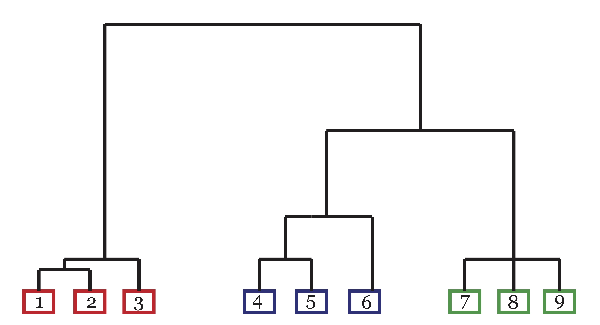
<p class="caption">(\#fig:dendrogram)A Dendrogram exhibiting linkage/similarity between 9 objects in 3 clusters.</p>
</div>

There are a number of different systems for determining linkage in hierarchical clustering dendrograms. For a complete discussion, we suggests the classic books by Anderberg [@anderberg] or Jain and Dubes [@jainbook]. The basic scheme for hierarchical clustering algorithms is outlined in the algorithm below.\

__Agglomerative Hierarchical Clustering__
<ol>
<li> __Input__: n objects to be clustered.
<li> Begin by assigning each object to its own cluster. 
<li> Compute the pairwise similarities between each cluster.
<li> Find the most similar pair of clusters and merge them into a single cluster. There is now one less cluster. 
<li> Compute pairwise similarities between the new cluster and each of the old clusters.
<li> Repeat steps 3-4 until all objects belong to a single cluster of size n.
<li> __Output__: Dendrogram depicting each merge step. 
</ol>

What differentiates the numerous hierarchical clustering algorithms is the choice of similarity metric used and the way the chosen similarity metric is used to compare clusters in step 4. For example, suppose Euclidean distance is chosen to compute the similarity (or dissimilarity) between objects in step 2. In step 4, the same notion of similarity must be extended to compare _clusters_ of objects. Several methods of computing pairwise distances between clusters have been proposed over the years. The most common approaches are as follows:


- __Single-Linkage__: The distance between two clusters is equal to the _shortest_ distance from any member of one cluster to any member of the other cluster.
- __Complete-Linkage__: The distance between two clusters is equal to the _greatest_ distance from any member of one cluster to any member of the other cluster.
- __Average-Linkage__: The distance between two clusters is equal to the _average_ distance from any member of one cluster to any member of the other cluster.


While many people have been given credit for the methods listed above, it appears that numerical taxonomers Sneath, Sokal and Michener were the first to describe the Single- and Average-linkage protocols, while ecologist Sorenson had previously pioneered Complete-linkage in his ecological studies. These early researchers used correlation coefficients to measure similarity between objects, but they suggest in 1963 that other correlation-like or distance-like measures could also be useful [@sokal].  The paper by Stephen Johnson in 1967 [@johnson67] formalized the single- and complete-linkage algorithms in a more general data clustering setting.  Other linkage techniques for hierarchical clustering, such as centroid and median linkage, have been proposed as well. We refer interested readers to Anderberg [@anderberg] for more on these variants.

 The main drawback of agglomerative hierarchical schemes is their computational complexity. In recent years, variations like BIRCH [@birch] and CURE [@cure] have been developed in an effort to combat this problem. Another feature which causes problems in some applications is that once a connection between points or clusters is made, it cannot be undone. For this reason, hierarchical algorithms often suffer in the presence of noise and outliers.


### Principal Direction Divisive Partitioning (PDDP)

While the hierarchical algorithms discussed above were _agglomerative_, it is also possible to create a cluster hierarchy or dendrogram by iteratively {_dividing_ points into groups until a desired number of groups is reached. Principal Direction Divisive Partitioning (PDDP) is one example of a {_divisive hierarchical algorithm_. Other partitional methods which will be discussed in Section \@ref(spectral) can also be placed in this hierarchical framework.

PDDP was proposed in [@boleypddp] by Daniel Boley at the University of Minnesota. PDDP has become popular due to its computational efficiency and ability to handle large data sets. We will explain this algorithm in a different, but equivalent context than is done in the original paper. At each step of this method, data are projected onto the first principal component and split into two groups based upon which side of the mean their projections fall. The first principal component, as discussed in Chapter \@ref(pca), creates the _total least squares line_, $\mathcal{L}$, which is the line which minimizes the total sum of squares of orthogonal deviations between the data and $\mathcal{L}$ among all lines in $\Re^m$.  Let $\X=[\mathbf{x}_1,\mathbf{x}_2,\dots,\mathbf{x}_n]$ be the data points and $\mathcal{L}(\mathbf{u},\bo{p})$ be a line in $\Re^m$ where $\bo{p}$ is a point on a line and $\mathbf{u}$ is the direction of the line. The projection of $\mathbf{x}_j$ onto $\mathcal{L}(\mathbf{u},\bo{p})$ is given by
$$\widehat{\mathbf{x}_j} = \mathbf{u}\mathbf{u}^T(\mathbf{x}_j-\bo{p})+\bo{p},$$
and therefore the orthogonal distance between $\mathbf{x}_j$ and $\mathcal{L}(\mathbf{u},p)$ is
$$\mathbf{x}_j - \widehat{\mathbf{x}_j} = (\bo{I}-\mathbf{u}\mathbf{u}^T)(\mathbf{x}_j-\bo{p}).$$
Consequently, the total least squares line is the line $\mathcal{L}$ which minimizes (over directions $\mathbf{u}$ and points $\bo{p}$)
\begin{equation*}
\begin{split}
f(\mathbf{u},\bo{p}) &= \sum_{j=1}^{n} \|\mathbf{x}_j - \widehat{\mathbf{x}_j}\|_2^2\\
&=\sum_{j=1}^{n} \|(\bo{I}-\mathbf{u}\mathbf{u}^T)(\mathbf{x}_j-\bo{p})\|_2^2\\
&= \|(\bo{I}-\mathbf{u}\mathbf{u}^T)(\X-\bo{p}\e^T)\|_F^2.
\end{split}
\end{equation*}

The following definition precisely characterizes the first principal component as the total least squares line. 


:::{.definition name='First Principal Component (Total Least Squares Line)' #rowcol}
The __First Principal Component (total least squares line)__ for the column data in $\X=[\mathbf{x}_1,\mathbf{x}_2,\dots,\mathbf{x}_n]$ is given by
$$\mathcal{L} = \{\alpha \mathbf{u}_1(\X_c) + \boldsymbol\mu | \alpha \in \Re\},$$
where $\boldsymbol\mu= \X\e/n$ is the mean (centroid) of the column data, and $\mathbf{u}_1(\bo{X}_c)$ is the principal left-hand singular vector of the centered matrix 
$$\bo{X}_c=\X-\boldsymbol\mu\e^T = \X(\bo{I}-\e\e^T/n).$$
:::

The orthogonal projection of the data onto the total least squares line will capture the maximum amount of directional variance over all possible one dimensional orthogonal projections. This fact is treated in greater detail in Chapter \@ref(pca). 

Boley's PDDP algorithm partitions the data into two clusters at each step based upon whether their projections onto the total least squares line fall to the left or to the right of $\boldsymbol \mu$. This is equivalent to examining the signs of the projections of the _centered_ data, $\X_c$, onto the direction $\mathbf{u}_1(\bo{X}_c)$. Conveniently, the signs of the projections are determined by the signs of the entries in the principal _right-hand_ singular vector, $\vv_1(\X_c)$.  A simple example motivating this method is illustrated in Figure \@ref(fig:pddpgood).

<div class="figure" style="text-align: center">
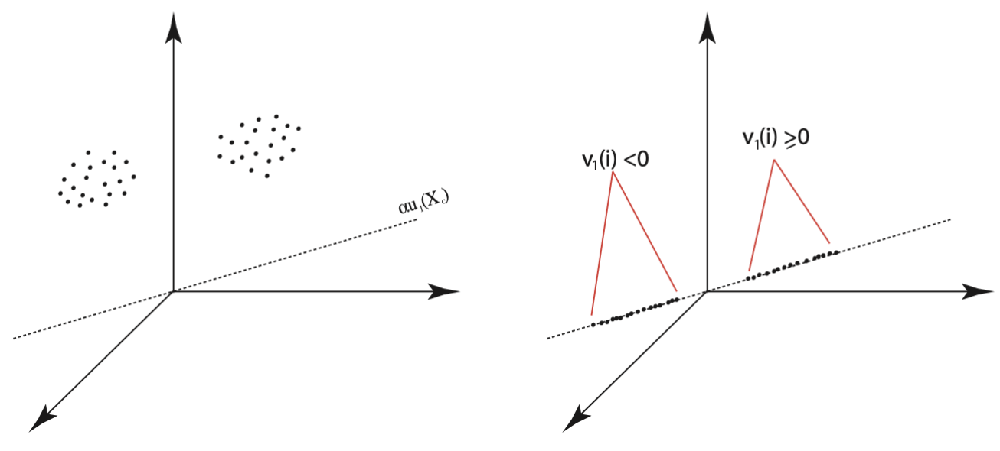
<p class="caption">(\#fig:pddpgood)Illustration of Principal Direction Divisive Partitioning: Two Clusters and their Corresponding Projections on the First Principal Component</p>
</div>

 Once the data are divided, the two clusters are examined to find the one with the greatest variance (scatter). This subset of data is then extracted from the original data matrix, centered and projected onto the span of its own first principal component. The split at zero is made again and the algorithm proceeds iteratively until the desired number of clusters has been produced.

 It is necessary to note, however, that the example in Figure \@ref(fig:pddpgood) is truly an ideal geometric configuration of data. Figure \@ref(fig:pddpbad) illustrates two configurations in which PDDP would fail. In the configuration on the left, both clusters would be split down the middle, and in the configuration on the right, the middle cluster would be split in the first iteration. Unfortunately, once data points are separated in an iteration of PDDP, there is no chance for them to be rejoined later. Table \@ref(tab:algpddp) provides the PDDP Algorithm.

<div class="figure" style="text-align: center">
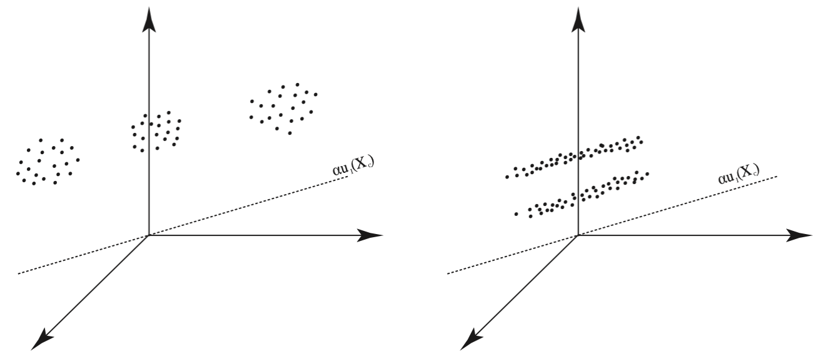
<p class="caption">(\#fig:pddpbad)Failures of Principal Direction Divisive Partitioning: Two Configurations of Data that would be Poorly Clustered by PDDP</p>
</div>


<table>
<tr> <td>
<ol>
<li> __Input:__ $n$ data points $\X=[\mathbf{x}_1,\mathbf{x}_2,\dots,\mathbf{x}_n]$ and number of clusters $k$
<li> Center the data to have mean zero: $\X_c = \X-\boldsymbol \mu\e^T$.
<li> Compute the first right singular vector of $\X_c$, $\vv_1$.
<li> Partition the data into two clusters based upon the signs of the entries in $\vv_1$.
<li> Compute the variance of each existing cluster and choose the cluster with largest variance to partition next.
<li> Repeat steps 1-4 using only the data in the cluster with largest variance until eventually $k$ clusters are formed.
<li> __Output:__ Resulting $k$-clusters
</table>

<caption>(\#tab:algpddp) Principal Direction Divisive Partitioning (PDDP)</caption>
 <br>

Since its initial publication, variations of the PDDP algorithm have been proposed, most notably PDDP($\ell$) [@pddpl] and KPDDP [@kpddp], both developed by Dimitrios Zeimpekis and Efstratios Gallopoulos from the University of Patras in Greece. PDDP($\ell$) uses the sign patterns in the first $\ell$ principal components to partition the data into at most $2^\ell$ clusters at each step of the algorithm, whereas KPDDP is a kernel variant which uses $k$-means to steer the cluster assignments at each step.

## Iterative Partitional Algorithms {#kmeanshistory}

 Iterative partitional algorithms begin with an initial partition of the data into $k$ clusters and iteratively update the cluster memberships according to some notion of what constitutes a ``better" partition [@jainbook; @anderberg].   The $k$-means algorithm is one example of a partitional algorithm. Before we get into the details of the modern day $k$-means algorithms, we'll take a look back at the history that fostered its development as one of the best-known and most widely used clustering algorithms in the world.

### Early Partitional Algorithms

 Although the name ``$k$-means" was first used by MacQueen in 1967 [@macqueen], the partitional method generally referred to by this name today was proposed by Forgy in 1965 [@forgy]. Forgy's algorithm involves iteratively updating $k$ _seed points_ which, at each pass of the algorithm, define a partitioning of the data by associating each data point with its nearest seed point. The seeds are then updated to represent the centroids (means) of the resulting clusters and the process is repeated. Euclidean distance is the most common metric for measuring the nearness of points in these algorithms, but other metrics, such as Mahalanobis distance and angular distance, can and have been used as well. $K$-means can also handle binary or categorical variables by using simple matching coefficients found in the data mining literature, for example [@datamining].  Forgy's method is outlined in Table \@ref(tab:algforgy).

<table>
<tr> <td>
<ol>
<li>    __Input__: Data points and an initial cluster configuration of the data, defined by $k$ seed points (start in step 1) or an initial clustering (start in step 2).
<li> Assign each data point to the cluster associated with the nearest seed point.
<li> Compute new seed points to be the centroids of the clusters.
<li> Repeat steps 1 and 2 until no data points change cluster membership in step 2.
<li>   __Output__: Final Clusters
</ol>
</table>

<caption>(\#tab:algforgy) Forgy's $k$-means Algorithm [@anderberg]</caption>
 <br>

In 1966, Jancey suggested a variation of this method where the new seeds points in step 2 were computed by reflecting the old seed point across the new centroid, as depicted in Figure \@ref(fig:jancey). Jancey argued that the data's nearness to point 1 grouped them into a cluster initially, and thus using a seed point which exaggerates this movement toward the new centroid ought to help speed up convergence, and possibly lead to a better solution by avoiding local minima [@jancey].

<div class="figure" style="text-align: center">
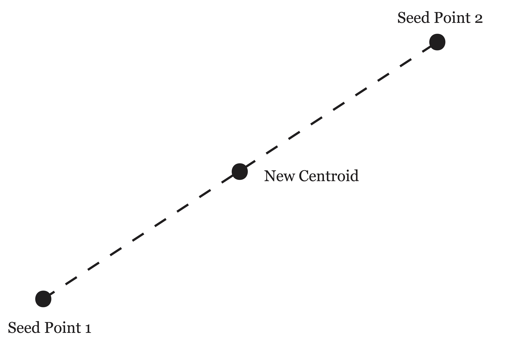
<p class="caption">(\#fig:jancey)Jancey's method of reflecting old seed point across the centroid to determine new seed point</p>
</div>


MacQueen's 1967 partitional process, which he called ``$k$-means", differs from Forgy's formulation in that it a) specifies initial seed points and b) assigns data points to clusters one-by-one, updating the seed to be the centroid of the cluster each time a new point is added. The algorithm only makes one pass through the data. MacQueen's method is presented in Table \@ref(tab:algmacqueen).


<table>
<tr><td>
 __Input__: $n$ data points
 <ol>
<li> Choose the first $k$ data points as clusters with one member each. Set i=1.
<li> Assign the $(k+i)^{th}$ data point to the cluster with the closest centroid. Recompute the cetroid of the updated cluster. Set $i=i+1$.
<li> Repeat step 2 until $i=n-k$ and all the data points have been assigned. Use final cluster centroids to determine a final clustering by re-assigning each data point to the cluster associated with its nearest centroid.
</ol>
 __Output__: Final Clusters
</table>

<caption> (\#tab:algmacqueen) MacQueens $k$-means Algorithm</caption>
 <br>

As you can see, MacQueen's algorithm, while similar in spirit, is quite different from that proposed by Forgy. The set of clusters found is likely to be dependent upon the order of the data, a property generally undesirable in cluster analysis. MacQueen stated that in his experience, these discrepancies in final solution based upon the order of the data were generally minor, and thus not unlike those caused by the choice of initialization in Forgy's method.  An advantage of MacQueen's algorithm is the reduced computation load achieved by avoiding the continual processing of the data to convergence.  It has also been suggested that MacQueen's method may be useful to initialize the seeds for Forgy's algorithm [@anderberg] and in fact this option is available in many data mining software packages like SAS's Enterprise Miner.

Discussion of some additional partitional methods, including Dubes and Jain's FORGY implementation and Ball and Hall's ISODATA algorithm, is deferred to Chapter \@ref(number) because they involve procedures aimed at determining the number of clusters in the data.


### $k$-means {#kmeans}

We will finish our discussion of $k$-means with what has become the classical presentation. We begin with a matrix of column data, $\X=[\mathbf{x}_1,\mathbf{x}_2,\dots,\mathbf{x}_n]$ where $\mathbf{x}_i \in \Re^m, 1 \leq i \leq n$. The objective of $k$-means is to determine a partitioning of the data into $k$ sets, $C=\{C_1, C_2, \dots, C_k\}$, such that an intra-cluster sum of squares cost function is minimized:
\[
\mbox{arg}\min_C \sum_{i=1}^{k} \sum_{\mathbf{x}_j \in C_i} \|\bo{x}_j-\boldsymbol \mu_i \|^2
\]
Any desired distance metric can be used, according to the applications and whims of the user.  Euclidean distance is standard, and leads to the specification _Euclidean $k$-means_.   In document clustering, it is common to use the cosine of the angle between two data vectors (documents) to measure their distance from each other. This variant is commonly referred to as _spherical $k$-means_ and will be discussed briefly in Section \@ref(skmeans).  The $k$-means algorithm, which is essentially the same as Forgy's algorithm in Section \@ref(kmeanshistory), is presented in Table \@ref(tab:algkmeans).


<table>
<tr><td>
 __Input__: Data points $\{\mathbf{x}_1,\mathbf{x}_2,\dots,\mathbf{x}_n\}$ and set of initial centroids $\{\boldsymbol \mu_1^{(0)},\boldsymbol \mu_2^{(0)},\dots, \boldsymbol \mu_k^{(0)}\}$.
<ol>
<li> Assign each data point to cluster associated with the nearest centroid. $$ C_j^{(t)} = \{\mathbf{x}_i : \|\mathbf{x}_i-\boldsymbol \mu_j^{(t)} \| \leq \|\mathbf{x}_i-\boldsymbol \mu_l^{(t)} \| \,\, \forall 1 \leq l \leq k\}$$ If two centroids are equally close, the tie is broken arbitrarily.
<li> The new centroid for each cluster is calculated by setting $$\boldsymbol \mu_j^{(t+1)}=\frac{1}{|C_j^{(t)}|} \sum_{\mathbf{x}_i \in C_j^{(t)}} \mathbf{x}_i$$
<li> Repeat steps 2 and 3 until the centroids remain stationary.
</ol>
 __Output__: $k$ clusters $C_1,C_2,\dots,C_k$
</table>

<caption> (\#tab:algkmeans) Euclidean $k$-means </caption>
 <br>
 This algorithm is guaranteed to converge because there are a finite number of partitions possible and at each pass of the algorithm the intra-cluster sum of squares cost function is decreased due to the fact that points are reassigned to a new cluster only if they are closer to the existing centroid of the new cluster than they were to the old one. The cost function is further reduced as the new centroids are calculated and the process repeats, lowering the cost function at each step. However, it is quite common for the algorithm to converge to local minima, particularly with large datasets. The output of $k$-means is sensitive to the initialization of the centroids and the choice of distance metric used in step 2. Randomly initialized centroids tend to be the most popular, but one can also seed the algorithm with centroids of clusters determined by another clustering algorithm. 
<!-- % \subsubsection*{Linear Algebraic Formulation of $k$-means Objective} -->
<!-- % Let $\bo{H}$ be a $k \times n$ matrix indicating the cluster memberships of the $m$-dimensional data $\X=[\mathbf{x}_1,\mathbf{x}_2,\dots, \mathbf{x}_n]$ into a set of clusters $C=\{C_1,\dots C_k\}$ as follows: -->
<!-- % $$\bo{H}_{ij} = \left\{ -->
<!-- %     \begin{array}{lr} -->
<!-- %       \frac{1}{\sqrt{n_i}} : &\mbox{if  } \mathbf{x}_j \in C_i \\ -->
<!-- %       0  : &\mbox{otherwise} -->
<!-- %     \end{array} -->
<!-- %   \right. -->
<!-- % $$ -->
<!-- % Then, using $\mathcal{H}$ to denote the set of all such indicator matrices $\bo{H}$, the $k$-means objective function can be written as follows: -->
<!-- % $$\min_{\bo{H} \in \mathcal{H}} \|\X-\X\bo{H}^T\bo{H}\|_F^2$$ -->
<!-- % -->

#### Spherical $k$-means {#skmeans}

In some applications, such as document clustering, similarity is often measured by the cosine of the angle $\theta$ between two objects $\mathbf{x}_i$ and $\mathbf{x}_j$ (each normalized to have unit norm),
$$\cos(\theta)=\mathbf{x}_i^T\mathbf{x}_j.$$
This similarity is often transformed into a distance by computing the quantity $d(\mathbf{x}_i,\mathbf{x}_j)=1-\cos(\theta)$ to formulate the spherical $k$-means objective function as follows:
$$\min_C \sum_{i=1}^k \sum_{\mathbf{x} \in C_i} 1- \mathbf{x}^T \bo{c}_i.$$
Where $\bo{c}_i = \frac{1}{\|\boldsymbol \mu_i\|}\boldsymbol \mu_i $ is the normalized centroid of the cluster. The spherical $k$-means algorithm is the same as the euclidean $k$-means algorithm aside from the definition of nearness in step 2.

#### $k$-mediods: Partitioning around Mediods (PAM) and Clustering Large Applications (CLARA)

In 1987, Kaufman and Rousseeuw devised another partitional method which searched through data in order to find $k$ representative points (or mediods) belonging to the dataset which would serve as cluster centers in the same way the centroids do in $k$-means. They called these points ``representative" because it was thought the points would give some interpretability to the groups by exhibiting some defining characteristics of their associated clusters and distinguishing characteristics from other clusters.  The authors' original algorithm, Partitioning around Mediods (PAM), was not suitable for large datasets because of the computation time necessary to search through the data points to build the set of $k$ representative points. The same authors developed a second algorithm, Clustering Large Applications (CLARA), to combat this problem. The central idea of CLARA was to use PAM on large datasets by sampling the data and applying the algorithm on the smaller sample. Once $k$ representative points were found in the sample, the remaining data were associated with the mediod to which they were closest. The quality of the clustering is measured by the average distance of every object to its representative point. Five such samples are drawn, and the clustering that results in the lowest average distance is retained [@kaufman].

### The Expectation-Maximization (EM) Clustering Algorithm

The Expectation-Maximization (EM) Algorithm, originally proposed by Dempster, Laird, and Rubin in 1977 [@emdempster], is one that has been used to solve many types of statistical problems over the years. It is generally used to determine parameters of a statistical model used to describe observations in a dataset. Here we will show how the algorithm is used for clustering, as in [@emcluster]. Our discussion is limited to the variant of the algorithm which uses Gaussian mixtures to model the data.

Supposing that our data points, $\mathbf{x}_1,\mathbf{x}_2,\dots,\mathbf{x}_n$, each belonging to one of $k$ clusters (or classes), $C_1,C_2,\dots, C_k$. Then there exists some latent variables $y_i, \,\, 1\leq i\leq n$, which identify the class membership of each $\mathbf{x}_i$. It is assumed that each class label $C_i$ determines the probability distribution of the data in that class. Here, we assume that this distribution is multivariate Gaussian.  The parameters of this model include the a priori probabilities of each of the $k$ classes, $P(C_i)$, and the parameters of the corresponding normal distributions $\boldsymbol \mu_i$ and $\mathbf{\Sigma_i}$, which are the mean and covariance matrix respectively. The objective of the EM algorithm is to determine the parameters which maximize the likelihood of the data:
$$\log L = \sum_i (\log P(y_i) + \log P(\mathbf{x}_i|y_i))$$

 The EM algorithm takes as input a set of $m$-dimensional data points, $\{\mathbf{x}_i\}_{i=1}^n$, the desired number of clusters $k$, and an initial set of parameters $\theta_j$ for each cluster $C_j$ $1\leq j\leq k$. For Guassian mixtures, $\theta_j$ consists of mean $\boldsymbol \mu_j$ and an $m\times m$ covariance matrix $\mathbf{\Sigma_j}$. The a priori probability of each cluster, $\alpha_j = P(C_j)$ must also be initialized and updated throughout the algorithm. If no information is known about the underlying clusters, then we suggest initialization $\alpha_j = 1/k$ for all clusters $C_j$.   EM then operates by iteratively executing an _expectation step_, where the probability that each data point belongs to each of the $k$ classes is computed, followed by a _maximization step_, where the parameters for each class are updated to maximize the likelihood of the data [@emcluster]. These steps are summarized in Table \@ref(tab:algem).

<table>
<tr><td>
__Input__: $n$ data points, $\{\mathbf{x}_i\}_{i=1}^n$, number of clusters $k$, and initial set of parameters for each cluster $C_j$: $\alpha_j$ and $\theta_j = \{\boldsymbol \mu_j, \Sigma_j\}\,\,1\leq  j\leq k$
<ol>
<li> _Expectation Step_: Compute the probability of each data point $\mathbf{x}_i$ being drawn from each class distribution, $C_j$:
$$p_{ij} = P(\mathbf{x}_i|\alpha_j,\boldsymbol \mu_j,\Sigma_j) \propto \alpha_j P(\mathbf{x}_i|\boldsymbol \mu_j,\Sigma_j)$$
<li> _Maximization Step_: Update the parameters to maximize the likelihood of the data:
$$\alpha_j = \frac{1}{n} \sum_{i=1}^{n} p_{ij}$$
$$\boldsymbol \mu_j = \frac{\sum_{i=1}^{n} p_{ij}\mathbf{x}_i}{\sum_{i=1}^{n} p_{ij}}$$
$$\Sigma_j = \frac{\sum_{i=1}^n p_{ij}(\mathbf{x}_i-\boldsymbol \mu_j)(\mathbf{x}_i-\boldsymbol \mu_j)^T}{\sum_{i=1}^{n} p_{ij}}$$
<li> Repeat steps 1-2 until convergence.
</ol>
 __Output__: Class label $j$ for each $\mathbf{x}_i$ such that $p_{ij} \geq p_{il}\,\,1\leq l \leq k$
</table>

<caption> (\#tab:algem) Expectation-Maximization Algorithm for Clustering [@emcluster]. </caption>
<br>

The EM Algorithm with Gaussian mixtures works well for clustering when the normality assumption of the underlying clusters holds true. Unfortunately, it is difficult to know if this is the case prior to the identification of the clusters. The algorithm suffers considerable computational drawbacks, particularly with regards to storage of the $k$ covariance matrices $\mathbf{\Sigma_j}\in \Re^{m\times m}$, and is not easily run in parallel. For this reason, the EM algorithm is generally limited in its ability to be used on large datasets, particularly when the number of attributes $m$ is very large, as it is in document clustering.

## Density Search Algorithms

If objects are depicted as data points in a metric space, then one may interpret the problem of clustering as an attempt to find areas of the space that are densely populated by points, separated by less populated areas. A natural approach to the problem is then to search through the space seeking these dense regions. Such algorithms have been referred to as _density search_ algorithms [@everitt]. While these algorithms tend to suffer on real data in both accuracy efficiency, their ability to identify noise and to estimate the number of clusters $k$ makes them worthy of discussion.

Many density search algorithms have their roots in the single-linkage hierarchical algorithms described in Section \@ref(hc). Individual points are joined together in clusters one-by-one based upon their similarity (or nearness in space). However in this case there exists some criteria for which objects are rejected from joining an existing cluster and instead are set out to form their own cluster. For example, suppose we had two distinct well separated dense regions of points. Beginning with a single point in the first region, we form a cluster and search through the remaining points one by one adding them to the cluster in they satisfy some specified criterion of nearness to the points already in the cluster. Once all the points in the first region are combined into a single cluster, the purpose of the criterion is to reject points from the second region from joining the first cluster, causing them to create a new cluster.

The conception of density search algorithms dates to the late `60s with the _taxmap_ method of Carmichael _et al_. in [@carmichael;@carmichaelsneath] and the _mode analysis_ method of Wishart [@wishart]. In _taxmap_ the authors suggested criterion like the drop in average similarity upon adding a new point to a cluster. In _mode analysis_ the criterion was simply containment in a specified radius of points in a cluster. The problem with this approach was that it had trouble finding both large and small clusters simultaneously [@everitt].

All density search algorithms suffer from the inability to find clusters of varying density, no matter how the term is defined in application, because the density of points is used to define the notion of a cluster. High dimensional data adds to this problem as demonstrated in Chapter \@ref(dimred) because as the size of the space grows, the points naturally become less and less dense inside of it. Another problem with density search algorithm is the necessity to search through data again and again, making their implementation difficult if not irrelevant for large data sets. Among the benefits to these methods are the inherent estimation of the number of clusters and their ability to find irregularly shaped (non-convex) clusters. Several algorithms in this category, like Density Based Spacial Clustering of Applications with Noise (DBSCAN) also make an effort to determine outliers or noise in the data.  Because of the computational workload of these methods, we will abandon them after the present discussion in favor of more efficient methods. For an in-depth analysis of other density search algorithms and their variants, see  [@density1].

### Density Based Spacial Clustering of Applications with Noise (DBSCAN)

Density Based Spacial Clustering of Applications with Noise (DBSCAN) is an algorithm proposed by Ester, Kriegel, Sander, and Xu in 1996 [@dbscan], which uses the Euclidean nearness of a group of points in $m$-space to define density. The algorithm uses the terminology in Definition \@ref(def:dbscandefs). 

:::{.definition name='DBSCAN Terms' #dbscandefs}
The following definitions will aid our discussion of the DBSCAN algorithm:

1. __Dense Point and__ $\rho_{min}$: 
    A point $\mathbf{x}_j$ is called _dense_ if there are at least $\rho_{min}$ other points contained in its $\epsilon$-neighborhood.
    
2. __Direct Density Reachability__:
	A point $\mathbf{x}_i$ is called _directly density reachable_ from a point $\mathbf{x}_j$ if it is in the $\epsilon$-neighborhood surrounding $\mathbf{x}_j$, i.e. if $\mathbf{x}_i \in \mathscr{N}(\mathbf{x}_j,\epsilon)$, _and_ $\mathbf{x}_j$ is a dense point.
	
3. __Density Reachability__:
	A point $\mathbf{x}_i$ is called _density reachable_ from a point $\mathbf{x}_j$ if there is a sequence of points $\mathbf{x}_{1},\mathbf{x}_{2},\dots, \mathbf{x}_{p}$ with $\mathbf{x}_{1}=\mathbf{x}_j$ and $\mathbf{x}_{p}=\mathbf{x}_i$ where each $\mathbf{x}_{{k+1}}$ is directly density reachable from $\mathbf{x}_{k}.$
	
4. __Noise Point__:
	A point $\mathbf{x}_l$ is called a _noise point_ or _outlier_ if it contains 0 points in its $\epsilon$-neighborhood.
:::

The relationship of density reachability is not symmetric. This fact is illustrated in Figure \@ref(fig:dbscan). A point in this illustration is dense if its $\epsilon$-neighborhood contains at least $\rho_{min} = 2$ other points. The green point $a$ is density reachable from the blue point $b$, however the reverse is not true because $a$ is not a dense point. Because of this, we introduce the notion of _density connectedness_.

<div class="figure" style="text-align: center">

<p class="caption">(\#fig:dbscan)DBSCAN Illustration</p>
</div>

:::{.definition name='Density Connectedness' #dbscandefs2}
Two points $\mathbf{x}_i$ and $\mathbf{x}_j$ are __density-connected__ if there exists some point $\mathbf{x}_k$ such that both $\mathbf{x}_i$ and $\mathbf{x}_j$ are density reachable from $x_k$.
:::

In Figure \@ref(fig:dbscan), it is clear that we can say points $a$ and $b$ are density-connected since they are each density reachable from any of the 4 points in between them. The point $c$ in this illustration is a noise point or outlier because there are no points contained in its $\epsilon$-neighborhood.


Using these definitions, we can formalize the properties that define a cluster in DBSCAN. 

:::{.definition name='DBSCAN Cluster' #dbscancluster}
Given the parameters $\rho_{min}$ and $\epsilon$, a __DBSCAN cluster__ is a set of points that satisfy the two following conditions:

1. All points within the cluster are mutually density-connected.
2. If a point is density-connected to any point in the cluster, it is part of the cluster as well.
:::

Table \@ref(tab:algdbscan) describes how DBSCAN finds such clusters.

<table>
<tr><td>

__Input:__ Set of points $\mathbf{X}=[\mathbf{x}_1,\mathbf{x}_2,\dots,\mathbf{x}_n]$ to be clustered and parameters $\epsilon$ and $\rho_{min}$\
<ol>
<li> For each unvisited point $p=\mathbf{x}_i$, do:
<ol style="list-style-type:upper-roman">
<li> Mark $p$ as visited.
<li> Let $\mathcal{N}$ be the set of points contained in the $\epsilon$-neighborhood around $p$.
<ol style="list-style-type:upper-alpha">
<li> If $|\mathcal{N}| < \rho_{min}$ mark $p$ as noise.
<li> Else let $C$ be the next cluster. Do:
<ol style="list-style-type:lower-alpha">
<li> Add $p$ to cluster $C$.
<li> For each point $p'$ in $\mathcal{N}$, do:
<ol style="list-style-type:lower-roman">
<li> If $p'$ is not visited, mark $p'$ as visited, let $\mathscr{N}'$ be the set of points contained in the  $\epsilon$-neighborhood around $p'$.  If $|\mathcal{N}'| \geq \rho_{min}$ let $\mathcal{N}=\mathcal{N} \cup \mathcal{N}'$

<li> If $p'$ is not yet a member of any cluster, add $p'$ to cluster $C$.
</ol>
</ol>
</ol>
</ol>
</ol>
  __Output:__ Clusters found $C_1,\dots,C_k$

</table>

<caption> (\#tab:algdbscan) Density Based Spacial Clustering of Applications with Noise (DBSCAN) [@datamining] </caption>

 <br>
 
## Conclusion

The purpose of this chapter was to give the reader a basic understanding of hierarchical, iterative partitional, and density search approaches to data clustering. One of the main concerns addressed in this paper is that all of these algorithms have merit, but in application rarely do the algorithms completely agree on a solution. In fact, algorithms with random inputs like $k$-means are not even likely to agree with themselves over a number of different trials. It can be extremely difficult to qualitatively measure the goodness of your clustering when the data cannot be visualized in 2 or 3 dimensions. While there are a number of metrics to help the user get a sense of the compactness of the clusters (see Chapter \@ref(validation)), the effect of noise and outliers can often blur the true picture. It is also common for such metrics to take nearly equivalent values for vastly different cluster solutions, forcing the user to choose a solution using domain knowledge and utility.  First we will look at another class of clustering methods which aim to solve the graph partitioning problem described in Chapter \@ref(chap-zero).

The difference between the problems of data clustering and graph partitioning is merely the structure of the input objects to be clustered. In data clustering, the input objects are composed of measurements on $m$ variables or features. If we interpret the graph partitioning problem in such a way that input objects are vertices on a graph and the variables describing them are the weights of the edges by which they are connected to other vertices, then it becomes clear we can use any of the methods in this chapter to cluster the columns of an adjacency matrix as described in Chapter \@ref(chap-zero). Similarly if one creates a similarity matrix for objects from a data clustering problem, we can cluster that matrix using the theory and algorithms from graph partitioning. While each problem can be transformed into the other, the design of the algorithms for the two cases is generally quite different. In the next chapter, we provide a thorough overview of some popular graph clustering algorithms.

<!--chapter:end:111-ClusterAlgos.Rmd-->

# Algorithms for Graph Partitioning {#chap1.5}

## Spectral Clustering {#spectral}
Spectral clustering is a term that data-miners have given to the partitioning problem as it arose in graph theory. The theoretical framework for spectral clustering was laid in 1973 by Miroslav Fiedler [@fiedlerac;@fiedlerev]. We will begin with a discussion of this early work, and then take a look at how others have adapted the framework to meet the needs of data clustering. In this setting, we have a graph  $G$ on a set of vertices $N=\{1,2,\dots,n\}$ with edge set $E=\{(i,j) : i,j \in N \mbox{and} i \leftrightarrow j\}$. Edges between the vertices are recorded in an  _adjacency matrix_ $\A = (a_{ij})$, where $a_{ij}$ is equal to the weight of the edge connecting vertex (object) $i$ and vertex $j$ and $a_{ij}=0$ if $(i,j) \notin E$. For the immediate discussion, we will assume the graph has no "self-loops", i.e. $a_{ii}=0 \forall i$. 
Spectral clustering algorithms typically involve the  _Laplacian matrix_ associated with a graph. A Laplacian matrix is defined as follows:

:::{.definition name='The Laplacian Matrix' #laplaciandef}
The  _Laplacian Matrix_, $\mathbf{L}$, of an undirected, weighted graph with adjacency matrix $\A=(a_{ij})$ and diagonal degree matrix $\mathbf{D}=\mbox{diag}(\A\e)$ is:
$$\mathbf{L}=\mathbf{D}-\A$$
:::

The Laplacian matrix is symmetric, singular, and positive semi-definite. To see this third property, construct an $n \times |E|$ "vertex-edge incidence" matrix $\U$ with rows corresponding to vertices and columns corresponding to edges. Allow the edges of the original graph to be directed arbitrarily, and set 
\[
\U_{v,e} = \left\{
     \begin{array}{lr}
       +\sqrt{a_{ij}} : &\mbox{if  } v \mbox{  is the head of  } e\\
       -\sqrt{a_{ij}} : &\mbox{if  } v \mbox{  is the tail of  } e\\
       0  : &\mbox{otherwise}
     \end{array}
   \right.
 \]
 
 Then $\mathbf{L}=\U\U^T$ is positive semi-definite [@fiedlerac]. $\mathbf{L}$ gives rise to a nice quadratic form:
 
 \begin{equation}
(\#eq:quadlaplacian)
 \mathbf{y}^T \mathbf{L} \mathbf{y} = \sum_{(i,j) \in E}a_{ij} (y_i - y_j)^2.
 \end{equation}
  
  Let $\sigma(\mathbf{L})=\{\lambda_1 \leq \lambda_2 \leq \dots \leq \lambda_n\}$ be the spectrum of $\mathbf{L}$. Since $\mathbf{L}$ is positive semi-definite, $\lambda_i \geq 0 \forall i$. Also, since the row sums of $\mathbf{L}$ are zero, $\lambda_1=0$. Furthermore if the graph, $G$, is composed of $k$ connected components, each disconnected from each other, then $\lambda_1=\lambda_2=\dots=\lambda_k = 0$ and $\lambda_j \geq 0 \mbox{ for } j\geq k+1$.  In [@fiedlerac] Fiedler defined the  _algebraic connectivity_ of the graph as the second smallest eigenvalue, $\lambda_2$, because its magnitude provides information about how easily the graph is to be disconnected into two components. Later, in [@fiedlerev], he alluded to the utility of the eigenvector associated with $\lambda_2$ in determining this two-component decomposition of a graph. 
  
## Fiedler Partitioning

Suppose we wish to decompose our graph into two components (or clusters of vertices) $C_1$ and $C_2$ where the edges exist more frequently and with higher weight inside the clusters than between the two clusters. In other words, we intend to make an  _edge-cut_ disconnecting the graph into two clusters. It is desired that the resulting partition satisfies the following objectives:
<ol>
<li> minimize the total weight of edges cut (edges in between components)
<li> maximize the total weight of edges inside the two components.
</ol>
 To begin with, lets take the quadratic form in Equation \@ref(quadlaplacian) and let $\y$ be a vector that determines the cluster membership of each vertex as follows:
 $$
\y_i=\left\{
     \begin{array}{lr}
       +1 & : \mbox{if vertex } i \mbox{  belongs in } C_1\\
       -1 & : \mbox{if vertex } i \mbox{  belongs in  } C_2\\
     \end{array}
   \right.
 $$
Our first goal is then to minimize Equation \@ref(eq:quadlaplacian) over all such vectors $\y$:

\begin{equation}
(\#eq:mincut)
\min_{\y} \y^T \mathbf{L} \y = \sum_{(i,j) \in E} a_{ij} (\y_i-\y_j)^2 = 2 \sum_{\substack{(i,j) \in E \\i \in C_1, j \in C_2}} 4 a_{ij}
\end{equation}

Note that the final sum is doubled to reflect the fact that each edge connecting $C_1$ and $C_2$ will be counted twice. However, the above formulation is incomplete because it does not take into account the second objective, which is to maximize the total weight of edges inside the two components. Indeed it seems the minimum solution to Equation \@ref(mincut) would often involve cutting all of the edges adjacent to a single vertex of minimal degree, disconnecting the graph into components of size $1$ and $n-1$, which is generally undesirable. In addition, the above optimization problem is NP-hard. To solve the latter problem, the objective function is relaxed from discrete to continuous. By the Rayleigh theorem,
$$\min_{\|\y\|_2=1} \y^T\mathbf{L} \y = \lambda_1$$ with $\y^*$ being the eigenvector corresponding to the smallest eigenvalue. However, for the Laplacian matrix, $y^*=\e$. In context, this makes sense - in order to minimize the weight of edges cut, we should simply assign all vertices to one cluster, leaving the second empty. In order to divide the vertices into two clusters we need an additional constraint on $\y$. Since clusters of relatively balanced size are desirable, a natural constraint is $\y^T\e=0$. By the Courant-Fischer theorem,

\begin{equation}
(\#eq:fiedlercut)
\min_{\substack{\| \y \|_2=1 \\ \y^T \e=0}} \y^T \mathbf{L} \y = \lambda_2
\end{equation}

with $\y^*=\textbf{v}_2$ being the eigenvector corresponding to the second smallest eigenvalue, $\lambda_2$. This vector is often referred to as the  _Fiedler vector_ after the man who identified its usefulness in graph partitioning. We define the Fiedler graph partition as follows:

:::{.definition name='Fiedler Graph Partition' #fiedlerpart}
Let $G=(N,E)$ be a connected graph on vertex set $N=\{1,2,\dots,n\}$ with adjacency matrix $\A$. Let $\mathbf{L}=\mathbf{D}-\A$ be the Laplacian matrix of $G$. Let $\textbf{v}_2$ be an eigenvector corresponding to the second smallest eigenvalue of $\mathbf{L}$. The __Fiedler partition__ is:

\begin{eqnarray*}
C_1 &=& \{i \in N : \textbf{v}_2(i) <0\}\\
C_2 &=& \{i \in N : \textbf{v}_2(i) >0\}
\end{eqnarray*}
Vertices $j$, for which $\textbf{v}_2(j)=0$, can be arbitrarily placed into either cluster.
:::


There is no uniform agreement on how to determine the cluster membership of vertices for which $\textbf{v}_2(j)=0$. The decision to make the assignment arbitrarily comes from experimental results that indicate in  _some scenarios_ these zero valuated vertices are equally drawn to either cluster. Situations where there are a large proportion of zero valuated vertices may be indicative of a graph which does not conform well to Fiedler's partition, and we suggest the user tread lightly in these cases. Figure \@ref(fig:ptsart) shows the experimental motivation for our arbitrary assignment of zero valuated vertices. The vertices in these graphs are labelled according to the sign of the corresponding entry in $\textbf{v}_2$. We highlight the red vertex and watch how its sign in $\textbf{v}_2$ changes as nodes and edges are added to the graph.


<div class="figure" style="text-align: center">

<p class="caption">(\#fig:ptsart)Fiedler Partitions and Zero Valuated Vertices</p>
</div>

 In order to create more than two clusters, the Fiedler graph partition can be performed iteratively, by examining the subgraphs induced by the vertices in $C_1$ and $C_2$ and partitioning each based upon their own Fiedler vector, or in an extended fashion using multiple eigenvectors. This iterative method requires a cluster to be chosen for further division, perhaps based upon the algebraic connectivity of the cluster. It is also possible to use the sign patterns in subsequent eigenvectors to further partition the graph. This approach is called Extended Fiedler Clustering and is discussed in Section \@ref(extendedfiedler). First, let's take a more rigorous look at why the sign patterns of the Fiedler vector provide us with a partition.
 
### Linear Algebraic Motivation for the Fiedler vector

The relaxation proposed in Equation \@ref(eq:fiedlercut) does not give us a general understanding of why the sign patterns of the Fiedler vector are useful in determining cluster membership information. We will use the following facts:

:::{.lemma name='Fiedler Lemma 1' #flem1}
Let $\mathbf{L}=\mathbf{D}-\A$ be a Laplacian matrix for a graph $G=(V,E)$ with $|V|=n$. Let $\sigma(L)=\lambda_1 \leq \lambda_2 \leq \dots \leq \lambda_n$ Then $\mathbf{L}$ is symmetric and positive semi-definite with $\lambda_1=0$. 
:::

:::{.lemma name='Fiedler Lemma 2' #flem2}

$\lambda_2(L)=0$ if and only if the graph $G$ has 2 components, $C_1$ and $C_2$ which are completely disconnected from each other (i.e. there are no edges connecting the vertices in $C_1$ to the vertices in $C_2$.)
:::
:::{.lemma name='Fiedler Lemma 3' #flem3}
Let $\mathbf{M}$ be a symmetric matrix of rank $r$. Let 
$$\mathbf{M} = \mathbf{V} \mathbf{D}  \mathbf{V}^T = (\textbf{v}_1, \textbf{v}_2, \dots, \textbf{v}_r)
\left(
\begin{matrix}
\sigma_1 &  0  & \ldots & 0\\
0  &  \sigma_2 &  \ldots &  0\\
\vdots & \vdots & \ddots&  \vdots\\
0  &   0       &\ldots & \sigma_r\\
\end{matrix}
\right)
\left(
\begin{matrix}
\textbf{v}_1^T\\
\textbf{v}_2^T\\
\vdots \\
\textbf{v}_r^T\\
\end{matrix} 
\right)
=\sum_{i=1}^r \sigma_i \textbf{v}_i \textbf{v}_i^T$$
 be the singular value decomposition of $\mathbf{M}$, with $\sigma_1 \geq \sigma_2 \geq \dots \sigma_r$.  Let $\widetilde{\mathbf{M}}$ be the closest (in the euclidean sense) rank $k$ approximation to $\mathbf{M}$:
 $$\widetilde{\mathbf{M}}=\mbox{arg}\min_{\mathbf{B} , rank(\mathbf{B})=k}\|\mathbf{M} - \bf B\|.$$
Then $\widetilde{\mathbf{M}}$  is given by the  _truncated singular value decomposition_:
 $$B=\sum_{i=1}^k \sigma_i \textbf{v}_i \textbf{v}_i^T$$
:::

From these simple tools, we can get a sense for why the signs of the Fiedler vector will determine a natural partition of a graph into two components. In the simplest case, $\lambda_1=\lambda_2=0$, the graph contains two disjoint components, $C_1$ and $C_2$. Thus, there exists some permutation matrix $\mathbf{P}$ such that $\mathbf{P} \mathbf{L} \mathbf{P}$ is block diagonal:

$$
\mathbf{P} \mathbf{L} \mathbf{P} =\left( \begin{array}{cc}
\mathbf{L}_1 & 0\\
0 & \mathbf{L}_2\\
\end{array}
\right)
$$

and $\mathbf{L}_1$ is the Laplacian matrix for the graph of $C_1$ and $\mathbf{L}_2$ is the Laplacian for $C_2$. Let $n_1$ and $n_2$ be the number of of vertices in each component. Clearly the eigenvectors $\textbf{v}_2$ and $\textbf{v}_2$ associated with $\lambda_1=0$ and $\lambda_2=0$ are contained in the span of $\mathbf{u}_1$ and $\mathbf{u}_2$ where:

\begin{equation}
\mathbf{u}_1 =
\begin{array}{cc}\begin{array}{c} 1\\ \vdots \\ n_1 \\ n_1+1 \\ \vdots \\ n \end{array} &\left( \begin{array}{c} 1 \\ \vdots \\ 1 \\ 0 \\ \vdots \\ 0 \end{array} \right) \end{array}

\qquad\mbox{and}\qquad

\mathbf{u}_2 =\begin{array}{cc}\begin{array}{c} 1\\ \vdots \\ n_1 \\ n_1+1 \\ \vdots \\ n \end{array} &\left( \begin{array}{c}0 \\ \vdots \\ 0 \\ 1 \\ \vdots \\ 1 \end{array} \right)\end{array}
\end{equation}

For all Laplacian matrices, it is convention to consider $\textbf{v}_1=\e$, the vector of all ones. Under this convention, the two conditions $\textbf{v}_2 \perp \textbf{v}_1$ and $\textbf{v}_2 \in span \{ \mathbf{u}_1,\mathbf{u}_2\}$ necessarily force $\textbf{v}_2$ to have a form such that the component membership of each vertex is discernible from the sign of the corresponding entry in the vector:
$$\textbf{v}_2 = \alpha(\mathbf{u}_1-\frac{n_1}{n_2} \mathbf{u}_2).$$

The case when $\mathbf{L}$ is  _not_ disconnected into two components is far more interesting, as this is generally the problem encountered in practice. We will start with a connected graph, so that our Laplacian matrix has rank $n-1$. Let the spectral decomposition of our Laplacian matrix $\mathbf{L}$ (which is equivalent to its singular value decomposition because $\mathbf{L}$ is symmetric) be:
$$\mathbf{L}=\sum_{i=2}^n \lambda_i \textbf{v}_i \textbf{v}_i^T.$$
Let $\widetilde{\mathbf{L}}$ be the closest rank $n-2$ approximation to $\mathbf{L}$. Then, by Lemmas \@ref(lem:flem2) and \@ref(lem:flem3),
$$\widetilde{\mathbf{L}} = \sum_{i=3}^n \lambda_i  \textbf{v}_i \textbf{v}_i^T$$
and there exists a permutation matrix $\mathbf{P}$ such that

$$
\mathbf{P} \widetilde{\mathbf{L}} \mathbf{P} =\left( \begin{matrix}
\widetilde{\mathbf{L}}_1 & 0\\
0 & \widetilde{\mathbf{L}}_2
\end{matrix}
\right).
$$

Suppose we permute the rows of $\mathbf{L}$ accordingly so that

$$
\mathbf{P} \mathbf{L} \mathbf{P} =\left( \begin{matrix}
\mathbf{L}_1 & -\mathbf{E}\\
-\mathbf{E}^T & \mathbf{L}_2\\
\end{matrix}
\right)
$$
where $\mathbf{E}_{ij} \geq 0 \forall i,j$ because $\mathbf{L}$ is a Laplacian matrix. Consider the difference between $\mathbf{L}$ and $\widetilde{\mathbf{L}}$:

$$\mathbf{L}-\widetilde{\mathbf{L}} = \lambda_2 \textbf{v}_2 \textbf{v}_2^T$$

which entails $\mathbf{L} - \lambda_2 \textbf{v}_2 \textbf{v}_2^T = \widetilde{\mathbf{L}}$. If we permute the vector $\textbf{v}_2$ in the same manner as the matrices $\mathbf{L}$ and $\widetilde{\mathbf{L}}$, then one thing is clear:

\begin{equation*}
\lambda_2\mathbf{P}\textbf{v}\textbf{v}_2^T\mathbf{P} = \left(\begin{matrix}
\A & -\mathbf{E} \\
-\mathbf{E}^T & B 
\end{matrix}\right)
\end{equation*}
Thus, if 
\begin{equation*}\mathbf{P}\textbf{v} =\left(\begin{matrix}
\mathbf{a} \\
 \mathbf{b}\\
\end{matrix} \right)
\end{equation*}

where $\mathbf{a} \in \Re^{n_1}$ and $\mathbf{b} \in \Re^{n_2}$


#### Extended Fiedler Clustering {#extendedfiedler}
 In the extended Fiedler algorithm, we use the sign patterns of entries in the first $l$ eigenvectors of $\mathbf{L}$ to create up to $k=2^l$ clusters. For instance, suppose we had 10 vertices, and used the $l=3$ eigenvectors $\textbf{v}_2,\textbf{v}_3,\mbox{ and  }\textbf{v}_4$. Suppose the sign of the entries in these eigenvectors are recorded as follows:
\[
       \begin{array}{cc} & \begin{array}{ccc} \mathbf{v}_2 & \mathbf{v}_3&\mathbf{v}_4 \end{array}\cr
       \begin{array}{c}
        1 \\
        2 \\
        3 \\
        4 \\
        5 \\
        6 \\
        7 \\
        8 \\
        9 \\
        10 \end{array} & \left(
        \begin{array}{ccc} 
              +&+&-\cr
              -&+&+\cr
              +&+&+\cr
              -&-&-\cr
              -&-&-\cr
              +&+&-\cr
              -&-&-\cr
              -&+&+\cr
              +&-&+\cr
              +&+&+ \end{array}
              \right) \end{array}
\]
     Then the 10 vertices are clustered as follows:
  $$
       \{1,6\},\quad
       \{2,8\},\quad 
       \{3,10\},\quad 
       \{4,5,7\},\quad
       \{9\}.
     $$
 Extended Fiedler makes clustering the data into a specified number of clusters $k$ difficult, but may be able determine a natural choice for $k$ as it partitions the data along several eigenvectors.
 
 In a 1990 paper by Pothen, Simon and Liou, an alternative formulation of the Fiedler partition is proposed [@pothen]. Rather than partition the vertices based upon the sign of their corresponding entries in $\mathbf{v}_2$, the vector $\mathbf{v}_2$ is instead divided at its median value. The main motivation for this approach was to split the vertices into sets of equal size. In 2003, Ding et al. derived an objective function for determining an ideal split point for similar partitions using the second eigenvector of the _normalized_ Laplacian, defined in Section \@ref(ncut) [@minmax]. The basic idea outlined above has been adapted and altered hundreds if not thousands of times in the past 20 years. The present discussion is meant merely as an introduction to the literature. 
 
 
### Graph Cuts

 The majority of spectral algorithms are derived as alterations of the objective function in Equation \@ref(eq:fiedlercut).The idea is the same: partition the graph into two components by means of a minimized edge cut, while requiring that the two components remain somewhat balanced in size (i.e. do not simply isolate a small number of vertices). Two common objective functions which embody this idea are the ratio cut (RatioCut) [@ratiocut], the normalized cut (Ncut) [@shi]. 
 
#### Ratio Cut

The ratio cut objective function was first introduced by Hagen and Kahng in 1992 [@ratiocut]. Given a graph $G(V,E)$ with vertex set $V$ partitioned into $k$ disjoint clusters, $V_1,V_2,\dots V_k$, the __ratio cut__ of the given partition is defined as
 $$\mbox{RatioCut}(V_1,V_2,\dots,V_k) = \sum_{i=1}^k \frac{w(V_i,\bar{V_i})}{|V_i|}$$
 where $|V_i|$ is the number of vertices in $V_i$, $\bar{V_i}$ is the complement of the set $V_i$ and, given two vertex sets $A$ and $B$, $w(A,B)$ is the sum of the weights of the edges between vertices in $A$ and vertices in $B$.  Let $\mathbf{H}$ be an $n\times k$ matrix indicating cluster membership of vertices by its entries:
\begin{equation}
(\#eq:ratioH)
 \mathbf{H}_{ij}=
 \begin{cases}
\frac{1}{\sqrt{|V_j|}}, & \mbox{if the } i^{th} \mbox{ vertex is in cluster } V_j \\
0 & \text{otherwise}
\end{cases}
\end{equation}

 Then $\mathbf{H}^T\mathbf{H}=\mathbf{I}$ and minimizing the ratio cut over all possible partitionings is equivalent to minimizing
 $$f(\mathbf{H}) = \mbox{Trace}(\mathbf{H}^T\mathbf{L}\mathbf{H})$$
 over all matrices $\mathbf{H}$ described by Equation \@ref(eq:ratioH), where $\mathbf{L}$ is the Laplacian matrix from Definition \@ref(def:laplaciandef). The exact minimization of this objective function is again NP-hard, but relaxing the conditions on $\mathbf{H}$ to $\mathbf{H}^T\mathbf{H}=\mathbf{I}$ yields a solution $\mathbf{H}^*$ with columns containing the eigenvectors of $\mathbf{L}$ corresponding to the $k$ smallest eigenvalues.
 
 Unfortunately, after this relaxation it is not necessarily possible to automatically determine from $\mathbf{H}^*$ which vertices belong to each cluster. Instead, it is necessary to look for clustering patterns in the rows of $\mathbf{H}^*$. This is a common conceptual drawback of the relaxation of objective functions in spectral clustering. The best way to procede after the relaxation is to cluster the rows of $\mathbf{H}^*$ with an algorithm like $k$-means to determine a final clustering. The ratio cut minimization method is generally referred to as _unnormalized spectral clustering_ [@spectraltutorial]. The algorithm is as follows:
 
 <table><tr><td>
__Input__: $n \times n$ adjacency (or similarity) matrix $\mathbf{A}$ for a graph on vertices (or objects) $\{1,\dots,n\}$ and desired number of clusters $k$
<ol>
<li> Compute the Laplacian $\mathbf{L}=\mathbf{D}-\mathbf{A}$.
<li> Compute the first $k$ eigenvectors $\mathbf{V}=\mathbf{v}_1,\mathbf{v}_2,\dots,\mathbf{v}_k$ of $\mathbf{L}$ corresponding to the $k$ smallest eigenvalues.
<li> Let $\mathbf{y}_{i}$ be the $i^{th}$ row of $\mathbf{V}$
<li> Cluster the points $\mathbf{y}_i \in \Re^k$ with the $k$-means algorithm into clusters $\bar{C}_1,\dots \bar{C}_k$.
</ol>
__Output__: Clusters $C_1,\dots,C_k$ such that $C_j = \{i : \mathbf{y}_i \in \bar{C}_j\|$
</table>
 <caption>(\#tab:algratiocut) Unnormalized Spectral Clustering (RatioCut) [@spectraltutorial] </caption>
<br>

#### Normalized Cut (Ncut) {#ncut}

 The normalized cut objective function was introduced by Shi and Malik in 2000 [@shi]. Given a graph $G(V,E)$ with vertex set $V$ partitioned into $k$ disjoint clusters, $V_1,V_2,\dots V_k$, the __normalized cut__ of the given partition is defined as
$$\mbox{Ncut}(V_1,V_2,\dots,V_k)= \sum_{i=1}^k \frac{w(V_i,\bar{V_i})}{\mbox{vol}(V_i)},$$
where $\mbox{vol}(V_i)$ is the sum of the weights of the edges connecting the vertices in $V_i$. Whereas the size of a subgraph $V_i$ in the ratio cut formulation is measured by the number of vertices $|V_i|$, in the normalized cut formulation it is measured by the total weight of the edges in the subgraph.
Thus, minimizing the normalized cut is equivalent to minimizing
$$f(\mathbf{H}) = \mbox{Trace}(\mathbf{H}^T\mathbf{L}\mathbf{H})$$ over all matrices $\mathbf{H}$ with the following form:
 
\begin{equation}
\mathbf{H}_{ij}=
\begin{cases}
\frac{1}{\sqrt{\mbox{vol}(V_j)}}, & \mbox{if the } i^{th} \mbox{ vertex is in cluster } V_j \\
0 & \text{otherwise.}
\end{cases}
(\#eq:ncutH)
\end{equation}

With $\mathbf{H}^T \mathbf{D} \mathbf{H} = \mathbf{I}$ where $\mathbf{D}$ is the diagonal degree matrix from Definition \@ref(def:laplaciandef). Thus, to relax the problem, we substitute $\mathbf{G}=\mathbf{D}^{1/2}\mathbf{H}$ and minimize
 $$f(\mathbf{G})=\mathbf{G}^T \mathscr{L} \mathbf{G}$$ subject to $\mathbf{G}^T\mathbf{G}=\mathbf{I}$, where $\mathscr{L}=\mathbf{D}^{-1/2}\mathbf{L} \mathbf{D}^{-1/2}$ is called the __normalized Laplacian__. Similarly, the solution to the relaxed problem is the matrix $\mathbf{G}^*$ with columns containing eigenvectors associated with the $k$ smallest eigenvalues of $\mathscr{L}$. Again, the immediate interpretation of the entries in $\mathbf{G}^*$ is lost in the relaxation and so a clustering algorithm like $k$-means is used to determine the patterns.
 
 <table><tr><td>
__Input__: $n \times n$ adjacency (or similarity) matrix $\mathbf{A}$ for a graph on vertices (or objects) $\{1,\dots,n\}$ and desired number of clusters $k$
<ol>
<li> Compute the _normalized_ Laplacian $\mathscr{L}=\mathbf{D}^{-1/2}\mathbf{L} \mathbf{D}^{-1/2}$.
<li> Compute the first $k$ eigenvectors $\mathbf{V}=[\mathbf{v}_1,\mathbf{v}_2,\dots,\mathbf{v}_k]$ of $\mathscr{L}$ corresponding to the $k$ smallest eigenvalues.
<li> Let $\mathbf{y}_{i}$ be the $i^{th}$ row of $\mathbf{V}$
<li> Cluster the points $\mathbf{y}_i \in \Re^k$ with the $k$-means algorithm into clusters $\bar{C}_1,\dots \bar{C}_k$.
</ol>
__Output__: Clusters $C_1,\dots,C_k$ such that $C_j = \{i : \mathbf{y}_i \in \bar{C}_j\|$
 </table>
 <caption>(\#tab:algncut) Normalized Spectral Clustering (Ncut) [@spectraltutorial] </caption>
 <br>
 
#### Other Normalized Cuts

While the algorithm in Table \@ref(tab:algncut) carries "normalized cut" in its title, other researchers have suggested alternative ways to consider normalized cuts in a graph. In a popular 2001 paper, Ng, Jordan, and Weiss made a slight alteration of  the previous algorithm which simply normalized the rows of the eigenvector matrix computed in step 2 to have unit length before proceeding to step 3 [@ng]. This algorithm is presented in Table \@ref(tab:algnjw).

 <table><tr><td>

__Input__: $n \times n$ adjacency (or similarity) matrix $\mathbf{A}$ for a graph on vertices (or objects) $\{1,\dots,n\}$ and desired number of clusters $k$
 <ol>
<li> Compute the _normalized_ Laplacian $\mathscr{L}=\mathbf{D}^{-1/2}\mathbf{L} \mathbf{D}^{-1/2}$.
<li> Compute the first $k$ eigenvectors $\mathbf{V}=[\mathbf{v}_1,\mathbf{v}_2,\dots,\mathbf{v}_k]$ of $\mathscr{L}$ corresponding to the $k$ smallest eigenvalues.
<li> Normalize the rows of $\mathbf{V}$ to have unit 2-norm.
<li> Let $\mathbf{y}_{i}$ be the $i^{th}$ row of $\mathbf{V}$
<li> Cluster the points $\mathbf{y}_i \in \Re^k$ with the $k$-means algorithm into clusters $\bar{C}_1,\dots \bar{C}_k$.
</ol>
__Output__: Clusters $C_1,\dots,C_k$ such that $C_j = \{i : \mathbf{y}_i \in \bar{C}_j\|$
 </table>
<caption> (\#tab:algnjw) Normalized Spectral Clustering according to Ng, Jordan and Weiss (NJW) [@spectraltutorial]</caption>
<br>
 
 In 2001, Meila and Shi altered the objective function once again, and derived yet another spectral algorithm using the _normalized random walk_ Laplacian, $\mathscr{L}_{rw} = \mathbf{D}^{-1}\mathbf{L} = \mathbf{I} - \mathbf{D}^{-1} \A$ [@meila]. As shown in [@tutorial], if $\lambda$ is an eigenvalue for $\mathscr{L}$ with corresponding eigenvector $\mathbf{v}$ then $\lambda$ is also an eigenvalue for  $\mathscr{L}_{rw}$ with corresponding eigenvector $\mathbf{D}^{1/2}\mathbf{v}$. This formulation amounts to a different scaling of the eigenvectors in step 3 of Table \@ref(tab:algnjw). This normalized random walk Laplacian will present itself again in Section \@ref(pic).  Meila and Shi's spectral clustering method is outlined in Table \@ref(tab:algmeila).

 
  <table><tr><td>
__Input__: $n \times n$ adjacency (or similarity) matrix $\mathbf{A}$ for a graph on vertices (or objects) $\{1,\dots,n\}$ and desired number of clusters $k$
<ol>
 <li> Compute the _normalized random walk_ Laplacian $\mathscr{L}_{rw}=\mathbf{D}^{-1}\mathbf{L} $.
 <li> Compute the first $k$ eigenvectors $\mathbf{V}=[\mathbf{v}_1,\mathbf{v}_2,\dots,\mathbf{v}_k]$ of $\mathscr{L}_{rw}$ corresponding to the $k$ smallest eigenvalues.
 <li> Normalize the rows of $\mathbf{V}$ to have unit 2-norm.
 <li> Let $\mathbf{y}_{i}$ be the $i^{th}$ row of $\mathbf{V}$
 <li> Cluster the points $\mathbf{y}_i \in \Re^k$ with the $k$-means algorithm into clusters $\bar{C}_1,\dots \bar{C}_k$.
 </ol>
__Output__: Clusters $C_1,\dots,C_k$ such that $C_j = \{i : \mathbf{y}_i \in \bar{C}_j\|$

 </table>
 <caption>(\#tab:algmeila) Normalized Spectral Clustering according to Meila and Shi  </caption>
 <br>
All of the spectral algorithms outlined thus far seem very similar in their formulation, yet in practice they tend to produce quite different results. This presents a problem because while each method has merit in its own right, it is impossible to predict which one will work best on any particular graph. We will discuss this problem further in \cref{consensus}.

### Power Iteration Clustering {#pic}
  In a 2010 paper, Frank Lin and William Cohen propose a fast, scalable algorithm for clustering graphs using the power method (or power iteration) [@poweriteration]. Let $\mathbf{W}=\mathbf{D}^{-1}\A$ be the $n\times n$ row-normalized  (row stochastic) adjacency matrix for a graph, and let $\mathbf{v}_0 \neq 0$ be a vector in $\Re^n$. A simple method for computing the eigenvector corresponding to the largest eigenvalue of $\mathbf{W}$ is the power method, which repeatedly computes the power iteration
  $$\mathbf{v}_{t+1}=c\mathbf{W}\mathbf{v}_t$$
  where $c=1/\|\mathbf{W}\mathbf{v}_t\|_1$ is a normalizing constant to prevent $\mathbf{v}_t$ from growing too large.
  
Applying the power method to convergence on $\mathbf{W}$ would result in the uniform vector $\alpha \e$ where 
$\alpha = 1/n.$  However, stepping through a small number of power iterations, will result in a vector that contains combined information from the eigenvectors associated with the largest eigenvalues. The formulation of Meila and Shi's spectral algorithm in [@meila] warranted the use of the eigenvectors corresponding to the $k$ smallest eigenvalues of the normalized random walk Laplacian $\mathscr{L}_{rw} = \mathbf{I}-\mathbf{W}$ which is equivalent to the consideration of the eigenvectors of the largest eigenvalues of $\mathbf{W}$. Thus, the idea behind Power Iteration Clustering (PIC) is to detect and stop the power method at some number of iterations $t$ such that $\mathbf{v}_t$ is a useful linear combination of the first $k$ eigenvectors.  The analysis in [@poweriteration] motivates the idea that the power method should pass through some initial stage of local convergence at the cluster level before going on to the stage of global convergence toward the uniform vector. At this stopping point, it is expected that $\mathbf{v}_t$ will be an approximately piecewise constant vector, nearly uniform on each of the clusters. Thus, the clusters at this stage will be revealed by the closeness of their corresponding entries in $\mathbf{v}_t$. See [@poweriteration] for the complete analysis. The PIC procedure is given in Table \@ref(tab:algpic). 

Applying the power method to $\mathbf{P}^T$ would equate to watching the probability distribution of a random walker evolve through time steps of the Markov Chain, where $\mathbf{v}_t$ is the distribution at time $t$, and eventually would converge to the stationary distribution in Equation \@ref(eq:pi).  
 However, according to Lin and Cohen, stepping through a limited number of power iterations on $\mathbf{P}$ is equivalent to observing the same chain backwards, so that $\mathbf{v}_t(i)$ gives the observer a sense of the most likely distribution of the chain $t$ steps in the past, given that the walk ended with distribution $\mathbf{v}_0$. On a graph with cluster structure as described above, a random walker that ends up on a particular vertex $j \in C_1$ is more or less equally likely to have come from any other node in $C_1$ (but relatively unlikely to have come from $C_i, i\neq1$), making the distribution close to uniform on the vertices in $C_1$. The same argument is true for any cluster $C_j$ and thus, by stepping backwards through time we expect to find these distribution vectors which are nearly uniform on each cluster $C_j$. For a complete discussion of the algorithm, including a more detailed mathematical analysis, consult [@poweriteration].

<table><tr><td>
__Input:__ A row-stochastic matrix $\mathbf{P}=\mathbf{D}^{-1}\A$ where $\A$ is an adjacency or similarity matrix and the number of clusters $k$.
<ol>
<li> Pick an initial vector $\mathbf{v}_0$. [@poweriteration] suggests the degree vector $\mathbf{v}_0 = \A\e.$
<li> Set $\mathbf{v}_{t+1} = \frac{\mathbf{P}\mathbf{v}_t}{\|\mathbf{P}\mathbf{v}_t\|_1}$ and $\delta_{t+1} = |\mathbf{v}_{t+1}-\mathbf{v}_t|.$
<li> Increment $t$ and repeat step 2 until $|\delta_t-\delta_{t+1}| \simeq \mathbf{0}.$
<li> Use $k$-means to cluster points on $\mathbf{v}_t$ and return clusters $C_1, C_2,\dots,C_k.$
</ol>
__Output:__ Clusters $C_1, C_2,\dots,C_k$.

 </table>
<caption> (\#tab:algpic) Power Iteration Clustering (PIC) [@poweriteration] </caption>
<br>
<!-- %  -->
<!-- % \subsubsection{Spectral Dimension Reduction} -->
<!-- % In light of the discussion in \cref{dimred}, the author prefers to view Algorithms \ref{algratiocut}, \ref{algncut}, and \ref{algnjw} as graph-specialized forms of dimension reduction. Let $\mathbf{L}= \mathbf{D}-\A$ be the Laplacian matrix and let $\sigma(\mathbf{L}') = \{|\lambda_1| \geq |\lambda_2| \geq \dots \geq |\lambda_n|\}$ be the spectrum of $\mathbf{L}$ with corresponding orthonormal eigenvectors $\U=[\uu_1, \uu_2,\dots,\uu_n]$ such that -->
<!-- % $$\mathbf{L}' = \sum_{i=1}^n \lambda_i \uu_i\uu_i^T.$$ -->
<!-- % Then the spectral clustering in Algorithms \ref{algratiocut}, \ref{algncut}, and \ref{algnjw} amount to an unusual truncation of the above sum, containing the terms with the most trivial contribution to the over-all signal: -->
<!-- % $$\mathbf{L}' \approx \sum_{i=K+1}^n \lambda_i \uu_i\uu_i^T.$$ -->
<!-- %  -->
<!-- % This interpretation of spectral clustering not intuitive and I'm hoping that by the time I finish this paper I will have some way to explain it. -->
<!-- %  -->
<!-- %%%%%%%%%%%%%%%%%%%%POINTS OF ARTICULATION%%%%%%%%%%%%%%%% -->
<!-- %Fiedler gave the name \textit{points of articulation} to those vertices $j$ satisfying $\textbf{v}_2(j)=0$ because their removal from the graph (along with all adjacent edges) disconnects the graph into multiple components. In \fref{ptsofart} we try to illustrate this concept with multiple graphs. The vertices in these graphs are labelled according to the sign of the corresponding entry in $\textbf{v}_2$. -->


<!-- %Two of his important results are combined and recast as follows: -->
<!-- %\begin{thm}[Fiedler] -->
<!-- %Let $G$ be a connected graph with Laplacian matrix $\mathbf{L}$. Let $\mathbf{v}_2$ be an eigenvector corresponding to the second smallest eigenvalue of $\mathbf{L}$. If $\mathbf{v}_2$ is nonzero, that is if $\mathbf{v}_2(i) \neq 0 \,\,\, \forall i$, then the subgraphs induced by cutting the edges between vertices in $C_1$ and $C_2$, where  -->
<!-- %$C_1= \{ i \in N : \mathbf{v}_2(i) < 0 \}$ and $C_2=\{ i \in N : \mathbf{v}_2(i) >0 \}$ are both connected. Furthermore if $\mathbf{v}_2(i) = 0$ for some vertices $i$, the subgraph induced by $C_1= \{ i \in N : \mathbf{v}_2(i) \leq 0 \}$ is connected and the subgraph induced by $C_1= \{ i \in N : \mathbf{v}_2(i) \geq 0 \}$ is connected. -->
<!-- %\end{thm} -->
<!-- %This result ensures that we can divide our graph into two (and no more than two) separate components by the following partition rule: -->

### Clustering via Modularity Maximization {#modularity}
 
 Another technique proposed in the network community detection literature compares the structure of a given graph to what one may expect from a random graph on the same vertices [@ncdnewman;@ncdmucha]. The motivation for this method was that simply counting edges between clusters as was done in previous spectral methods may not be the best way to define clusters in graph. A better approach may be to somehow measure whether they are fewer edges than _expected_ between communities. Let $\A$ be the adjacency matrix of the graph (or network) and let $\mathbf{P}$ be the adjacency matrix of a random graph on the same vertices containing the expected value of weights on that graph. Then the matrix $\mathbf{B}=\A-\mathbf{P}$ would contain information about how the structure of $\A$ deviates from what is expected. Obviously this formulation relies on some underlying probability distribution of the weights in the random graph, known as the _null model_. The most common null model uses the degree sequence of the vertices in the given graph, $\{d_1,d_2,\dots,d_n\}$, where $d_i$ is the degree of vertex $i$ (i.e. $d_i$ is the sum of the weights of the edges connected to vertex $i$), to create the probabilities [@ncdmucha,@ncdnewman]
 \begin{equation}
(\#eq:null) 
 p(\mbox{edge}(i,j)) = \frac{d_j}{\sum_{k=1}^n d_k}.
 \end{equation}
 
 Thus, the expected value of the weight of the edge from $i$ to $j$ is
 $$\mathbf{P}_{ij} = E(w(i,j)) = d_i \left(\frac{d_j}{\sum_{k=1}^n d_k}\right).$$
 
 One may recognize that the probabilities in Equation \@ref(eq:null) are precisely the stationary probabilities of the random walk on the graph defined by $\A$, and thus seem a reasonable choice for a null model. This formulation gives us $E(w(i,j)) = E(w(j,i))$ as desired for an undirected graph. Using this null model, a _modularity matrix_ $\mathbf{B}$ is formed as
$$\mathbf{B} = \A - \mathbf{P}.$$

 For a division of the data into two clusters, let $\mathbf{s}$ be an $n\times 1$ vector indicating cluster membership by
$$\mathbf{s}_{i} = 
\begin{cases}
-1 &: \mbox{vertex }  i \mbox{ belongs in cluster 1}\\
\,\,\,\,1 &: \mbox{vertex } i \mbox{ belongs in cluster 2}
\end{cases}.
$$
Let $d=\sum_{k=1}^n d_k$. The __modularity__ of a given partition is defined by
\begin{equation}
(\#eq:modeqn)
Q= \frac{1}{2d} \sum_{i,j} \mathbf{B}_{ij} \mathbf{s}_i\mathbf{s}_j = \frac{1}{2d}\mathbf{s}^T\mathbf{B}\mathbf{s}.
\end{equation}
The goal of the algorithm proposed in [@ncdnewman] is to maximize this quantity, thus we can drop the constant $1/2d$ and write the objective as
\begin{equation}
(\#eq:modobj)
\max_{\substack{\mathbf{s} \\ \mathbf{s}_i = \pm 1}} Q = \mathbf{s}^T \mathbf{B} \mathbf{s}
 \end{equation}

#### Illustrative Example {-}
  To get an idea of why this is true, consider the case where we have two relatively obvious clusters $C_1$ and $C_2$ in a graph and reorder the rows and columns of the adjacency matrix to reflect this structure,
$$
\A=\left[ \begin{array}{cc}
\A_{C_1} & \mathbf{E} \\
\mathbf{E}^T & \A_{C_2} \end{array}\right]
$$
Where $\A_{C_1}$ and $\A_{C_2}$ are relatively dense matrices with larger entries representing the weight of edges within the clusters $C_1$ and $C_2$ respectively and $\mathbf{E}$ is a sparse matrix with smaller entries representing the weight of edges which connect the two clusters. In a random graph with no community or cluster structure, we'd be likely to find just as many edges between the clusters as within clusters. Thus, after subtracting $\mathbf{P}$ our modularity matrix may look something like
$$
\mathbf{B}=\left[ \begin{array}{cc}
\mathbf{B}_{11} & \mathbf{B}_{12} \\
\mathbf{B}_{21} & \mathbf{B}_{22} \end{array}\right]
\approx\left[ \begin{array}{cc}
+ & - \\
- & + \end{array}\right]
$$
Where the indicated signs reflect the sign _tendancy_ of values in $\mathbf{B}$. In other words, the entries in the diagonal blocks $\mathbf{B}_{11}$ and $\mathbf{B}_{22}$ _tend_ to be positive because the edges within clusters had larger weights than one would expect at random and the entries in the off diagonal blocks $\mathbf{B}_{12}$ and $\mathbf{B}_{21}$ _tend_ to be negative because the edges between clusters had smaller weights than one would expect at random. Thus, the modularity of this graph, $\mathbf{Q} = \mathbf{s}^T \mathbf{B} \mathbf{s}$, will be maximized by the appropriate partition $\mathbf{s}^T=[\mathbf{s}^T_1,\mathbf{s}^T_2]=[\e^T_{C_1}, -\e^T_{C_2}]$.


In order to maximize the modularity objective function given in Equation \@ref(eq:modobj), let $\uu_1,\uu_2,\dots,\uu_n$ be an orthonormal set of eigenvectors for $\mathbf{B}$ corresponding respectively to the eigenvalues $\lambda_1 \geq \lambda_2 \geq \dots \geq \lambda_n$. Write the vector $\mathbf{s}$ as a linear combination of eigenvectors,
$$\mathbf{s} = \sum_{i=1}^n \alpha_i \uu_i$$ where $$\alpha_i =\uu_i^T \mathbf{s}.$$
Then, the objective function from Equation \@ref(eq:modobj) becomes
$$\max_{\substack{\mathbf{s} \\ \mathbf{s}_i = \pm 1}}  \left(\sum_{i=1}^n \alpha_i \uu_i^T \mathbf{B}\right)\left(\sum_{i=1}^n \alpha_i \uu_i\right) = \sum_{i=1}^n \lambda_i (\uu_i^T \mathbf{S})^2.$$

This optimization is NP-hard due to the constraint that $\mathbf{s}_i =\pm 1$. It is clear that without this constraint one would choose $\mathbf{s}$ proportional to $\uu_1$, maximizing the first term in the summation (associated with the largest eigenvalue) and terminating the others. A reasonable way to proceed in light of this information is to maximize the leading term and ignore the remaining terms. To accomplish this, it is quite clear that we should choose $\mathbf{s}$ so that its entries match the signs of the entries in $\uu_1$. The placement of vertices corresponding to zero entries in $\uu_1$ will be decided arbitrarily. However, if the leading eigenvalue of the modularity matrix is _negative_ then the corresponding eigenvector is $\e$, leading us to no partition. According to [@ncdnewman] the ``no partition'' solution in this scenario is in fact the correct result, i.e. a negative leading eigenvalue indicates there is no community or cluster structure in the graph. This gives a clear stopping point for the procedure, which allows it to automatically determine an appropriate number of clusters or communities to create. Unfortunately, the arbitrary placement of vertices corresponding to zero entries in $\uu_1$ may in some cases affect the determined number of clusters.

To create more than 2 clusters, the above procedure can be repeated on each of the subgraphs induced by the vertices in each cluster found. This leads us to an iterative divisive (hierarchical) algorithm like the iterative Fiedler method in Section \@ref(extendedfiedler) and PDDP in Section \@ref(pddp). The modularity clustering procedure is formalized in Table \ref{algmod}.

<table><tr><td>
__Input:__ $n \times n$ adjacency matrix $\A$ for an undirected graph to be partitioned
<ol>
<li> Let $d_i$ be the $i^{th}$ row sum of $\A$. Let $d=\sum_{i=1}^n d_i$
<li> Form the matrix $\mathbf{P}$ with $\mathbf{P}_{ij}=d_i d_j / d$.
<li> Form the modularity matrix $\mathbf{B}=\A-\mathbf{P}$.
<li> Compute the largest eigenvalue $\lambda_1$ and corresponding eigenvector $\uu_1$ of $\mathbf{B}$.
<li> If $\lambda_1 < 0$, stop. There is no partition of this graph.
<li> Otherwise partition the vertices of the graph into 2 clusters as follows
\begin{equation}
(\#eq:modsplit)
\begin{split}
C_1 &= \{i : \uu_1(i) <0\} \cr
C_2 &= \{i : \uu_1(i) \geq 0\}
\end{split}
\end{equation}
<li> Determine further partitions by extracting the rows and columns of the original adjacency matrix corresponding to the vertices in each cluster to form $\A'$ and repeat the algorithm with $\A'$ until each created cluster fails to partition in step 5.
</ol>
 __Output:__ Final clusters.
</table>
<caption>(\#tab:algmod) Modularity Procedure for Network Community Detection (Newman) [@ncdnewman]</caption>
<br>
 

## Stochastic Clustering
  
  An alternative way to interpret a graph is by considering a random walk along the edges. For an undirected graph with adjacency matrix $\A$, we can create a transition probability matrix $\mathbf{P}$ by dividing each row by the corresponding row sum. Using the degree matrix from Definition \@ref(def:laplaciandef) we have $$\mathbf{P}=\mathbf{D}^{-1}\A.$$ If our graph does indeed have some cluster structure, i.e. sets of vertices $C_1,C_2, \dots,C_k$ for which the total weight of edges within each set are substantially higher than the total weight of edges between the different sets, then a random walker in a given cluster $C_i$ is more likely to stay in $C_i$ for several steps than he is to transition to another cluster $C_j$. It is well known that for a connected and undirected graph, the long term probability distribution is given by
\begin{equation}
(\#eq:pi)
\pi^T = \frac{\e^T\mathbf{D}}{\e^T\mathbf{D}\e^T}
\end{equation}
  Which is not likely to give any cluster information. However, the short-term evolution of this walk can tell us something about the cluster structure because a random walker is far more likely, in the short-run, to remain inside a cluster than he is to transition between clusters. The Stochastic Clustering Algorithm (SCA) of Wessell and Meyer [@chuck] takes advantage of this fact.

### Stochastic Clustering Algorithm (SCA)
  
  In a 2012 paper, Chuck Wessell and Carl Meyer formulated a clustering model by creating a symmetric (doubly stochastic) transition matrix $\mathbf{P}$ [@chuck;@chuckthesis] from the adjacency matrix of a graph. The method in this paper is quite similar to that in PIC except that here the mathematics of the ``backward'' Markov Chain intuition given in [@poweriteration] works out in this context because the probability transition matrix is symmetric. One added feature in this algorithm is the automatic determination of the number of clusters in the data, using eigenvalues of the transition matrix $\mathbf{P}$.  Wessell and Meyer's formulation is based on theory that was developed by Nobel Laureate economist Herbert Simon and his student Albert Ando.  This theory surrounds the mixing rates of resources or wealth in local economies (composed of states in a Markov chain) as part of a global economy (which links together some states from each local economy). It is assumed that the adjacency matrix for the graph is irreducible, or equivalently that the graph is connected. 
  
  The basic idea is that resources will be exchanged more frequently at a local level than they will at the global level. Suppose individual companies from a global economy are represented as nodes in a graph with edges between them signifying the amount of trade between each pair of companies. Natural clusters would form in this graph at a local level, represented by the strong and frequent trade relationships of proximal companies. Let $k$ be the number of local economies (clusters), each containing $n_i$ states $i=1,\dots,k$, and define the distribution of resources at time $t$ as $\mathbf{\pi}_t$, given a starting distribution $\mathbf{\pi}_0$. Then
  $$\mathbf{\pi}_t^T = \mathbf{\pi}_0^T\mathbf{P}^t$$
  
   The heavily localized trade in this global economy leads to a so-called _short-term stabilization_ of the system characterized by a distribution vector at some time $t$ which is nearly constant across each local economy:
$$\mathbf{\pi}_t^T \approx \left( \frac{\alpha_1}{n_1}  \frac{\alpha_1}{n_1}   \dots \frac{\alpha_1}{n_1}   | \frac{\alpha_2}{n_2}   \frac{\alpha_2}{n_2}   \dots \frac{\alpha_2}{n_2}   | \dots | \frac{\alpha_k}{n_k}   \frac{\alpha_k}{n_k}   \dots \frac{\alpha_k}{n_k} \right)$$
   After this short-term stabilization, the distribution of goods in the Markov Chain is eventually expected to converge to a constant level across every state. However, in the period following the short-run stabilization, the distribution vector retains its approximately piecewise constant structure for a some time before settling down into its final uniform equilibrium.

Wessell and Meyer's derivation requires the creation of a symmetric probability transition matrix $\mathbf{P}$ from the adjacency matrix $\A$ by means of a simultaneous row and column scaling. In other words, a diagonal matrix $\mathbf{S}$ is determined for which
$$\mathbf{S}\A\mathbf{S}= \mathbf{P}$$
is a doubly stochastic transition probability matrix.  This task turns out to be quite simple, $\mathbf{S}$ is found by iterating a single step until convergence. Letting $\mathbf{S}_{ii}=\mathbf{s}(i)$, the diagonal scaling procedure put forth by Ruiz [@ruiz} is simply:
\begin{equation}
(\#eq:diagscaling)
\begin{split}
\mathbf{s}_0 &= \e \\
\mathbf{s}_{t+1}(i) &=\sqrt{\frac{\mathbf{s}_t(i)}{\A_{i*}^T\mathbf{s}_t}}
\end{split}
\end{equation}
 
 In [@chuckthesis], it is convincingly argued that the diagonal scaling procedure does not change the underlying cluster structure of the data in $\A$, and thus that the desired information is not damaged by this transformation.  The clusters in this method are found in a similar manner to PIC, where $k$-means is employed to find the nearly piecewise constant segments of the distribution vector $\mathbf{\pi}_t$ after a short number of steps. The Stochastic Clustering Algorithm automatically determines the number of clusters in the data by counting the number of eigenvalues whose value is close to $\lambda_1=1$. This group of eigenvalues near 1 is referred to as the _Perron cluster_. We postpone discussion of this matter to \cref{findk} where it will be analyzed in detail. For now, we present the Stochastic Clustering method in Table \@ref(tab:algsc). The eigenvector iterations in SCA are quite similar to those put forth in PIC, and users commonly create visualizations of the iterations that look quite similar to those in Figure \@ref(fig:picex).
 
 <table><tr><td>
__Input:__ Adjacency matrix $\A$ for some graph to be partitioned
<ol>
<li> Convert $\A$ to a symmetric probability transition matrix $\mathbf{P}$ using the diagonal scaling procedure given in \@ref(eq:diagscaling).
<li> Calculate the eigenvalues of $\mathbf{P}$ and determine $k$ to be the number of eigenvalues in the Perron cluster.
<li> Create a random initial probability distribution $\mathbf{\pi}_0^T$.
<li> Track the evolution of $\mathbf{\pi}_{t+1}^T = \mathbf{\pi}_t^T \mathbf{P}$. After each multiplication, cluster the entries of $\mathbf{\pi}_t$ using $k$-means. When this clustering has remained the same for a user-preferred number of iterations stop.
</ol>
__ Output:__ $k$ clusters found $C_1, C_2,\dots, C_k$.
 </table>
<caption> (\#tab:algsc) Stochastic Clustering Algorithm (SCA) [@chuck]</caption>
<br>
 

<!--chapter:end:112-NetworkAlgos.Rmd-->

# Cluster Validation {#validation}

The algorithms in Chapters \@ref(chap1) and \@ref(spectral), with the exception of DBSCAN, all suffer from the same drawback: they require the user to input the number of clusters for the algorithm to create. This is problematic because in practice it is unlikely that the user knows exactly how many clusters they are looking for. In fact, this may be precisely the information that the researcher is after. In the next chapter, we will discuss some popular approaches to determining a suitable value for $k$. Many of these approaches seek to choose the "best" clustering from a set of clusterings containing different numbers of clusters. In order to present these approaches, we must first look at ways one might quantitatively describe the "goodness" of a clustering. Such measures fall into the realm of _cluster validation_

In Chapter \@ref(chap-zero) it was made clear that the concept of a cluster (and hence the "optimal clustering" of a group of data) is a subjective one. Thus, it is impossible to truly quantify the quality or accuracy of a clustering, without first being given a set of categorical labels assumed to be the optimal clustering. Cluster validation metrics which use such labels (i.e. the "answers") are called _external_ metrics because they use additional information that was not contained in the data input to the clustering algorithm.

Clearly such labels are non-existent in practice, or we would not need to do clustering at all. Thus, it is necessary to establish some _internal_ metrics, which use only the information contained in the data, in order to get a sense for the quality or validity of a given clustering. In addition, _relative_ metrics are established with the aim of comparing two different clusterings. The goal of this chapter is to provide but a brief introduction to internal, external and relative metrics to fit our needs. For a more comprehensive survey of cluster validation see for example [@kaufman; @anderberg; @dcebook; @jainbook; @chap8; @everitt].

## Internal Validity Metrics

Most _internal_ metrics aim to describe the _cohesion_ of each cluster and the _separation_ between clusters. The cohesion of each cluster is some measure of its compactness, i.e how proximal or similar the objects in that cluster are to each other. The separation between clusters is some measure of the distance between them or how dissimilar the objects in different clusters are. Some metrics aim to quantify cohesion and separation separately, while others take both ideas into account in one measure. 
### General Cluster Cohesion and Separation: Graphs vs. Data
#### Cohesion

Generally, cluster cohesion measures the similarity or proximity of the points within a cluster. The definitions of cohesion for graph partitioning and data partitioning problems differ slightly depending on the similarity measure used. In graph partitioning, the goal is to measure how similar, or close, vertices in a cluster are to one another, whereas in data clustering cohesion is generally measured by the similarity of the points in a cluster to some _representative point_ (usually the mean or centroid) of that cluster [@chap8]. This difference is illustrated in Figure \@ref(fig:cohesion). The red lines represent the similarity/distance quantities of interest in either scenario, and the red point in Figure \@ref(fig:cohesionD) is a representative point which is not necessarily a data point. In our analysis, representative points will be defined as centroids and thus may be referred to as such.

<div class="figure" style="text-align: center">

<p class="caption">(\#fig:cohesion)Cluster Cohesion in Data (left) compared to Graph-Based Cluster Cohesion (right)</p>
</div>

Depending on the proximity or similarity function used, the two quantities in Figure \@ref(fig:cohesion) may or may not be the same. Often times for graphs and networks, there is no simple way to define a centroid or representative point for a cluster. The particular representation for a cohesion metric will always be dependent on a choice of distance or similarity function. Thus, for graphs we merely define the general concept of cohesion as follows:

:::{.definition name='General Cluster Cohesion in Graphs' #graphcohesion}

For a graph $G(V,E)$ with edge weights $w_{ij}$, and a partition of the vertices into $k$ disjoint sets $C=\{C_1,C_2,\dots, C_k\}$, the __cohesion__ of cluster $C_p$  is 
$$\mbox{cohesion}(C_p) = \sum_{i,j \in C_p} w_{ij}.$$
:::

Given this definition, it should be clear that if $w_{ij}$ is a measure of similarity between vertices $i$ and $j$ then higher values of cohesion are desired, whereas if $w_{ij}$ measures distance or dissimilarity then lower values of cohesion are desired.

For data clustering problems, cluster cohesion is similarly defined, only now the similarities or proximities are measured between each point in the cluster and the cluster's representative point.

:::{.definition name='General Cluster Cohesion for Data' #datacohesion}
Let $\X=[\x_1,\x_2,\dots, \x_n]$ be an $m\times n$ matrix of column data, and let $C=\{C_1,C_2,\dots,C_k\}$ be a set of disjoint clusters partitioning the data with corresponding representative points $\{\cc_1,\cc_2,\dots,\cc_k\}$. Then the __cohesion__ of cluster $C_p$ is 
$$\mbox{cohesion}(C_p) = \sum_{\x_i \in C_p} d(\x_i,\cc_p)$$
Where $d$ is any distance or similarity function.
:::

Again, the given definitions are not associated with any particular distance or similarity function and thus define a broad classes of metrics for measuring cluster cohesion. 

#### Separation

The goal in clustering is not only to form groups of points which are similar or proximal, but also to assure some level of separation or dissimilarity between these groups. Thus, in addition to measuring cluster cohesion, it is also wise to consider cluster separation. Again this concept is a little different for graphs, where the separation is measured pairwise between points in different clusters, than it is for data, where separation is generally measured between the representative points of different clusters. This difference is presented with the following 2 definitions.

:::{.definition name='General Cluster Separation for Graphs' #graphseparation}

For a graph $G(V,E)$ with edge weights $w_{ij}$, and a partition of the vertices into $k$ disjoint sets $C=\{C_1,C_2,\dots, C_k\}$. The __separation__ between clusters $C_p$ and $C_q$ is 
$$\mbox{separation}(C_p,C_q) = \sum_{\substack{i \in C_p \\ j \in C_q}} w_{i,j}.$$
:::

:::{.definition name='General Cluster Separation for Data' #dataseparation}
Let $\X=[\x_1,\x_2,\dots, \x_n]$ be an $m\times n$ matrix of column data, and let $C=\{C_1,C_2,\dots,C_k\}$ be a set of disjoint clusters in the data with corresponding representative points $\{\cc_1,\cc_2,\dots,\cc_k\}$. Then the __separation__ between clusters $C_p$ and $C_q$ is
$$\mbox{separation}(C_p,C_q) = d(\cc_p,\cc_q)$$
where $d$ is any distance or similarity function.
:::

#### Averaging Measures of Cohesion and Separation for a Set of Clusters
Definitions \@ref(def:graphcohesion), \@ref(def:datacohesion), \@ref(def:graphseparation) and \@ref(def:dataseparation) provide simple, well-defined metrics (given a proximity or similarity measure) for individual clusters $C_p$ or pairs of clusters $(C_p,C_q)$ that can be combined into overall measures for a clustering $C = \{C_1,C_2,\dots,C_k\}$ by some weighted average [@chap8]. The weights for such an average vary according to applications and user-preference, but they typically reflect the size of the clusters in some way. At the end of this chapter, in Table \@ref(tab:cstable), we provide a few examples of these overall metrics. 

### Common Measures of Cohesion and Separation
As stated earlier, the previous definitions were considered "general" in that they did not specify particular functions of similarity or distance. Here we discuss some specific measures which have become established as foundations of cluster validation in the literature.

#### Sum of Squared Error (SSE)
The _sum of squared error (SSE)_ metric incorporates the squared euclidean distances from each point in a given cluster to the __centroid__ of the cluster, defined as
 $$\mean_j = \frac{1}{n_j} \sum_{\x_i \in C_j} \x_i.$$
 This is equivalent to measuring the average pairwise distance between points in a cluster, as one would do in a graph having Euclidean distance as a measure of proximity.  The SSE of a single cluster is then

\begin{eqnarray*}
\text{SSE}(C_j)&=&\sum_{\x_i \in  C_j} \| \x_i - \mean_j \|_2^2 \\
    &=&\frac{1}{2n_j}\sum_{\x_i,\x_l \in C_j} \|\x_i - \x_l\|_2^2 
\label{SSE}
\end{eqnarray*}
where $n_j = |C_j|$ . The SSE of an entire clustering $C$ is simply the sum of the SSE for each cluster $C_j \in C$
$$\mbox{SSE}(C)=\sum_{j=1}^k \sum_{\x_i \in C_j} \|\x_i - \mean_j\|_2^2.$$

Smaller values of SSE indicate more cohesive or compact clusters. One may recognize Equation \@ref(eq:SSE) as the objective function from Section \@ref(kmeans) because minimizing the SSE is the goal of the Euclidean \kmeans algorithm. We can use the same idea to measure cluster separation by computing the _Between Group Sums of Squares_ (SSB), which is a weighted average of the squared distances from the cluster centroids $\{\mean_1, \mean_2,\dots,\mean_k\}$ to the over all centroid of the dataset $\mean_* = \frac{1}{n} \sum_{i=1}^n \x_i$: 
$$
\mbox{SSB}(C) =\sum_{j=1}^k n_j\|\mean_j-\mean_*\|_2^2.
$$


It is straightforward to show that the _total sum of squares_ (TSS) of the data
$$\mbox{TSS}(\X)=\sum_{i=1}^n \|\x_i-\mean_*\|_2^2,$$
which is constant, is equal to the sum of the SSE and SSB for every clustering $C$, i.e.
$$\mbox{TSS}(\X)=\mbox{SSE}(C) + \mbox{SSB}(C),$$
thus minimizing the SSE (attaining more cohesion) is equivalent to maximizing the SSB (attaining more separation).

 Sum of Squared Error is used as a tool in the calculation of the _gap statistic_, outlined in the next chapter, a popular parameter used to determine the number of clusters in data.  

#### Ray and Turi's Validity Measure {#rayturi}
In [@rayturi] a measure of cluster validity is chosen as the ratio of intracluster distance to intercluster distance. The authors define these distances as 
$$M_{intra} = \frac{1}{n}\mbox{SSE}(C) =  \frac{1}{n}\sum_{j=1}^k \sum_{\x_i \in C_j} \|\x_i - \mean_j\|^2.$$
and
$$M_{inter} = \min_{1\leq i \leq  j \leq k} \|\mean_i - \mean_j\|^2.$$
Clearly a good clustering should have small $M_{intra}$ and large $M_{inter}$.  Ray and Turi's validity measure,
$$V=\frac{M_{intra}}{M_{inter}}$$
is expected to take on smaller values for a better clustering [@dcebook]. 

#### Silhouette Coefficients
Silhouette coefficients are popular indices that combine the concepts of cohesion and separation [@datamining]. These indices are defined for each object or observation $\x_i,\, i=1,\dots, n$ in the data set using two parameters $a_i$ and $b_i$, measuring cohesion and separation respectively. These parameters and the silhouette coefficient for an object $\x_i$ are computed as follows:
<ul>
<li> Suppose, for a given clustering $C=\{C_1,\dots, \C_k\}$ with $|C_j|=n_j$, that the point $\x_i$ belongs to cluster $C_p$ 
<li> Then $a_i$ is the average distance (or similarity) of point $\x_i$ from the other points in $C_p$,
$$ a_i = \frac{1}{n_p} \sum_{\x_j \in C_p} d(\x_i,\x_j)$$
<li> Define the distance (or similarity) between $\x_i$ and the remaining clusters $C_q, 1\leq\,q\leq\,k, q\neq p$ to be the average distance (or similarity) between $\x_i$ and the points in each cluster,
$$d(\x_i,C_q) = \frac{1}{n_q} \sum_{\x_j \in C_q} d(\x_i,\x_j).$$
Then $b_i$ is defined to be the minimum of these distances (or maximum for similarity):
$$b_i = \min_{q \neq p} d(\x_i,C_q).$$
<li> The silhouette coefficient for $\x_i$ is then
$$s_i = \frac{(b_i-a_i)}{\max(a_i,b_i)} \mbox{  (for distance metrics)}$$
$$s_i = \frac{(a_i-b_i)}{\max(a_i,b_i)} \mbox{  (for similarity metrics)}$$

</ul>

The silhouette coefficient takes on values $-1 \leq s_i \leq 1$, where negative values undesirably indicate that $\x_i$ is closer (or more similar) on the average to points in another cluster than to points in its own cluster, and values close to $1$ indicate a good clustering.\\

Silhouette coefficients are commonly averaged for all points in a cluster to get an overall sense for the validity of that cluster.

## External Validity Metrics {#external}
Many of the results presented in Chapter \@ref(results) will use data sets for which the class labels of each object are known. Using this information, one can generally create validity metrics that are easier to understand and compare across clusterings. Such metrics are known as _external metrics_ because of their dependence on the external class labels. We will show that most external metrics can be transformed into _relative metrics_ which compute the similarity between two clusterings.  

Using the information from external class labels, one can create a so-called __confusion matrix__  (also called a matching matrix).  The confusion matrix is simply a table that shows correspondence between predicted cluster labels (determined by an algorithm) and the actual or "true" cluster labels of the data. A simple example is given in Figure \@ref(fig:confusion), where the actual class labels (`science', `math', and `french') are shown across the columns of the matrix and the clusters determined by an algorithm ($C_1, C_2,$ and $C_3$) are shown along the rows.  The $(i,j)^{th}$ entry in the confusion matrix is then the number of objects from the dataset that had class label $j$ and were assigned to cluster $i$. 

<div class="figure" style="text-align: center">

<p class="caption">(\#fig:confusion)Example of a Confusion Matrix</p>
</div>

For this simple example, one may assume that cluster 1 ($C_1$) corresponds to the class `Science', cluster 2 corresponds to the class `Math', and likewise that cluster 3 represents the class `French', even though the clustering algorithm did not split these classes apart perfectly. Most external metrics will rely on the values in the confusion matrix.

### Accuracy
Accuracy is a measure between 0 and 1 that simply measures the proportion of objects that were labelled correctly by an algorithm. This is not always a straightforward task, given that the labels assigned by a clustering algorithm are done so arbitrarily in that it does not matter if one refers to the same group of points as "cluster 1" or  "cluster 2". In the confusion matrix in Figure \@ref(fig:confusion), it is easy to identify which cluster labels corresponds to which class. In this case it is easy to see that out of a total of 153 objects, only 13 were classified incorrectly, leading to an accuracy of 140/153 $\approx$ 91.5\%. However with a more _confusing_ confusion matrix, like that shown in Figure \@ref(fig:conconfusion), the answer is not quite as clear and thus it is left to determine exactly how to match predicted cluster labels with assigned class labels in an appropriate way.

<div class="figure" style="text-align: center">

<p class="caption">(\#fig:conconfusion)A More _Confusing_ Confusion Matrix</p>
</div>


This turns out to be a well studied matching problem from graph theory, known as a _maximum matching_ for a bipartite graph. If we transform our confusion matrix from Figure \@ref(fig:conconfusion) into an undirected bipartite graph with edge weights corresponding to edges in the confusion matrix, the result would be the graph in Figure \@ref(fig:bipartite). The task is then to find a set of 3 edges, each beginning at distinct vertices on the left and ending at distinct vertices on the right such that the sum of the edge weights is maximal. The solution to this problem is shown in Figure \@ref(fig:maximummatching) and it is clear that the matching of predicted labels to actual labels did not actually change from the simpler version of this confusion matrix in Figure \@ref(fig:confusion), it just became less obvious because of the errors made by the algorithm.

<div class="figure" style="text-align: center">

<p class="caption">(\#fig:maximummatching)Bipartite Graph of Confusion Matrix (left) and Matching Predicted Class Labels to Actual Class Labels (right) </p>
</div>


Once the predicted class labels are matched to the actual labels, the accuracy of a clustering is straightforward to compute by
$$\mbox{Accuracy}(C)=\frac{\mbox{# of objects labelled correctly}}{n}.$$
The accuracy of the second clustering given in Figure \@ref(fig:conconfusion) is 118/153 $\approx$ 77\%, which is sharply lower than the 91.5\% achieved by the clustering in Figure \@ref(fig:confusion). The nice thing about accuracy as a metric is it provides a contextual interpretation and thus allows us to quantify an answer to the question "how _much_ better is this clustering?" This is not necessarily true of other external metrics, as you will see in the next sections. 

 The aspect of this metric that requires some computation is the determination of the maximum matching as shown in Figure \@ref(fig:bipartitematching}. Fortunately, this problem is one that was solved by graph theorist H.W. Kuhn in 1955 [@kuhn]. Kuhn's algorithm was adapted by James Munkres in 1957 and the resulting method was dubbed the Kuhn-Munkres Algorithm, or sometimes the Hungarian Algorithm in honor of the mathematicians who pioneered the work upon which Kuhn's method was based [@munkres]. This algorithm is fast and computationally inexpensive. The details of the process are not pertinent to the present discussion, but can be found in any handbook of graph theory algorithms.

#### Comparing Two Clusterings: Agreement 
 
 The accuracy metric, along with other external metrics, can be used to compute the similarity between two different cluster solutions. Since, in practice, class labels are not available for the data, the user may run two different clustering algorithms (or even the same algorithm with different representations of the data as input or different initializations) and get two different clusterings as a result. The natural question is then "how similar are these two clusterings?"  Treating one clustering as class labels and computing the accuracy of the second compared to the first will provide the percentage of data points for which the two clusterings _agree_ on cluster assignment. Thus, when comparing two clusterings, the accuracy metric becomes a measure of __agreement__ between the two clusterings. As such, value of 90\% agreement indicates that 90\% of the data points were clustered the same way in both clusterings.

### Entropy
The notion of entropy is associated with randomness. As a clustering metric, entropy measures the degree to which the predicted clusters consist of objects belonging to a single class, as opposed to many classes. Suppose a cluster (as predicted by an algorithm) contains objects belonging to multiple classes (as given by the class labels). Define the quantities

<ul>
<li> $n_i = $ number of objects in cluster $C_i$
<li> $n_{ij} = $ number of objects in cluster $C_i$ having class label $j$
<li> $p_{ij} = \frac{n_{ij}}{n_i} = $ probability that a member of cluster $C_i$ belongs to class $j$
</ul>

Then the __entropy__ of each cluster $C_i$ is
$$\mbox{entropy}(C_i) = -\sum_{j=1}^L p_{ij} \log_2 p_{ij}$$
where $L$ is the number of classes, and the total entropy for a set of clusters, $C$, is the sum of the entropies for each cluster weighted by the proportion of points in that cluster:
$$\mbox{entropy}(C)=\sum_{i=1}^k \frac{n_i}{n} \mbox{entropy}(C_i).$$

Smaller values of entropy indicate a less random distribution of class labels within clusters [@datamining]. One benefit of using entropy rather than accuracy is that it can be calculated for any number of clusters $k$, whereas accuracy is restricted to the case where $k=L$. \

 __Sample Calculations for Entropy__\
Comparing the two clusterings represented by the confusion matrices in Figures \@ref(fig:confusion) and \@ref(fig:conconfusion), we'd see that for the first example,

\begin{eqnarray*}
p_{11}=\frac{45}{50} & p_{12}=\frac{5}{50} & p_{13}=0 \\
p_{21}=\frac{8}{48}  & p_{22}=\frac{40}{48} & p_{23}=0 \\
p_{31}=0 & p_{32}=0 & p_{33}=1 
\end{eqnarray*}

so that
\begin{eqnarray*}
\mbox{entropy}(C_1) &=& - ( \frac{45}{50} \log_2 \frac{45}{50}  + \frac{5}{50} \log_2 \frac{5}{50}) = 0.469\\
\mbox{entropy}(C_2) &=& - (\frac{8}{48} \log_2 \frac{8}{48}  + \frac{40}{48} \log_2 \frac{40}{48}) = 0.65\\
\mbox{entropy}(C_3) &=& - (\log_2 1) = 0
\end{eqnarray*}
and thus the total entropy of the first clustering is
$$\mbox{entropy}(C) = \frac{50}{153} (0.469) + \frac{48}{153}(0.65) = \framebox{0.357}.$$

And for the second example, we have 
\begin{eqnarray*}
p_{11}=\frac{25}{30} & p_{12}=\frac{5}{30} & p_{13}=0 \\
p_{21}=\frac{30}{68}  & p_{22}=\frac{38}{68} & p_{23}=0 \\
p_{31}=0 & p_{32}=0 & p_{33}=1
\end{eqnarray*}
yielding
\begin{eqnarray*}
\mbox{entropy}(C_1) &=& - ( \frac{25}{30} \log_2 \frac{25}{30}  + \frac{5}{30}  \log_2 \frac{5}{30} ) = 0.65 \\
\mbox{entropy}(C_2) &=& - (\frac{30}{68} \log_2 \frac{30}{68}  + \frac{38}{68} \log_2 \frac{38}{68}) = 0.99 \\
\mbox{entropy}(C_3) &=& - (\log_2 1) = 0
\end{eqnarray*}
and finally the total entropy of the second clustering is
$$\mbox{entropy}(C) = \frac{30}{153} (0.469) + \frac{68}{153}(0.65) = \framebox{0.568}$$

revealing a higher-overall entropy and thus a worse partition of the data compared to the first clustering.


### Purity

Purity is a simple measure of the extent to which a predicted cluster contains objects of a single class [@datamining]. Using the quantities defined in the previous section, the __purity__ of a cluster is defined as
$$\mbox{purity}(C_i) = \max_j p_{ij}$$
and the purity of a clustering $C$ is the weighted average
$$\mbox{purity}(C) = \sum_{i=1}^k \frac{n_i}{n} \mbox{purity}(C_i).$$
The purity metric takes on positive values less than 1, where values of 1 reflect the desirable situation where each cluster only contains objects from a single class. Like entropy, purity can be computed for any number of clusters, $k$. Purity and accuracy are often confused and used interchangeably but they are _not_ the same. Purity takes no matching of class labels to cluster labels into account, and thus it is possible for the purity of two clusters to count the proportion of objects having the _same_ class label. For example, suppose we had only two class labels given, A and B, for a set of 10 objects and set our clustering algorithm to seek 2 clusters in the data and the following confusion matrix resulted:


<center>
$$\begin{array}{c | c c}
  &A & B \\
\hline
C_1 & 3 & 2\\
C_2 & 3 & 2
\end{array}$$
</center>

Then the purity of each cluster would be $\frac{3}{5}$ referring in both cases to the proportion of objects having class label A. High values of purity are easy to achieve when the number of clusters is large. For example, by assigning each object to its own cluster we'd achieve perfect purity. One metric that accounts for such a tradeoff is _Normalized Mutual Information_, presented next. \

__Sample Purity Calculations__\
Again, we'll compare the two clusterings represented by the confusion matrices in Figures \@ref(fig:confusion) and \@ref(fig:conconfusion). For the first clustering, 
\begin{eqnarray*}
\mbox{purity}(C_1) &=& \max(\frac{45}{50} ,\frac{5}{50} ,0) = \frac{45}{50}= 0.9 \\
\mbox{purity}(C_2) &=& \max(\frac{8}{48},\frac{40}{48},0) = \frac{40}{48} = 0.83 \\
\mbox{purity}(C_2) &=& \max(0,0,1) = 1
\end{eqnarray*}
so the overall purity is
$$\mbox{purity}(C) =  \frac{50}{153} (0.9) + \frac{48}{153}(0.83) + \frac{55}{153}(1) = \framebox{0.914}.$$

Similarly for the second clustering we have,
\begin{eqnarray*}
\mbox{purity}(C_1) &=& \max(\frac{25}{30},\frac{5}{30},0) = \frac{25}{30}) = 0.83 \\
\mbox{purity}(C_2) &=& \max(\frac{30}{68},\frac{38}{68} ,0) = \frac{38}{68}) = 0.56 \\
\mbox{purity}(C_2) &=& \max(0,0,1) = 1
\end{eqnarray*}

And thus the overall purity is
$$\mbox{purity}(C) =  \frac{30}{153} (0.83) + \frac{68}{153}(0.56) + \frac{55}{153}(1) = \framebox{0.771}.$$

### Mutual Information (MI) and <br> Normalized Mutual Information (NMI)
Mutual Information (MI) is a measure that has been used in various data applications [@datamining]. The objective of this metric is to measure the amount information about the class labels revealed by a clustering. Adopting the previous notation,
<ul>
<li> $n_i = $ number of objects in cluster $C_i$
<li> $n_{ij} = $ number of objects in cluster $C_i$ having class label $j$
<li> $p_{ij} = n_{ij}/n_i = $ probability that a member of cluster $C_i$ belongs to class $j$
</ul>
also let

<ul>
<li> $l_j =$ the number of objects having class label $j$
<li> $L =$ the number of classes
<li> $\mathcal{L} =\{\mathcal{L}_1,\dots,\mathcal{L}_L\}$ the "proper" clustering according to class labels
</ul>
and, as always, let
<ul>
<li> $n=$ the number of objects in the data
<li> $k=$ the number of clusters in the clustering.
</ul>
 The __Mutual Information__ of a clustering $C$ is then
$$\mbox{MI}(C)=\sum_{i=1}^k \sum_{j=1}^L p_{ij} \log \frac{n n_{ij}}{n_i l_j}$$
and the __Normalized Mutual Information__ of $C$ is
$$\mbox{NMI}(C) = \frac{\mbox{MI}(C)}{[\mbox{entropy}(C) + \mbox{entropy}(\mathcal{L})]/2}$$
Clearly, when $\mathcal{L}$ corresponds the class labels we have $\mbox{entropy}(\mathcal{L})=0$ but if user's objective is instead to compare two different clusterings, this piece of the equation is necessary. Thus, using the same treatment used for _agreement_ between two clusterings, one can compute the mutual information between two clusterings.

### Other External Measures of Validity

There are a number of other measures that can either be used to validate a clustering in the presence of class labels or to compare the similarity between two clusterings $C=\{C_1,C_2,\dots,C_k\}$ and $\hat{C}=\{\hat{C}_1,\hat{C}_2,\dots,\hat{C_k}\}$. In our presentation we will consider the second clustering to correspond to the class labels, but in the same way that the accuracy metric can be used to compute agreement, these measures are often used to compare different clusterings. To begin we define the following parameters [@dcebook]:
<ul>
<li> $a$ is the number of pairs of data points which are in the same cluster in $C$ and have the same class labels (i.e. are in the same cluster in $\hat{C}$).
<li> $b$ is the number of pairs of data points which are in the same cluster in $C$ and have different class labels.
<li> $c$ is the number of pairs of data points which are in different clusters in $C$ and have the same class labels.
<li> $d$ is the number of pairs of data points which are in different clusters in $C$ and have different class labels.
</ul>
These four parameters add up to the total number of pairs of points in the data set, $N$,
$$a+b+c+d = N = \frac{n(n-1)}{2}.$$

From these values we can compute a number of different similarity coefficients, a few of which are provided in Table \@ref(tab:comparisonmeasures) [@dcebook].

<table>
<tr><td>Name <td> Formula </tr>
<tr><td>Jaccard Coefficient <td> $\displaystyle J = \frac{a}{a+b+c}$ </tr>
<tr><td>Rand Statistic <td> $\displaystyle R = \frac{a+b}{N}$</tr>
<tr><td>Folkes and Mallows Index <td> $\displaystyle \sqrt{\frac{a}{a+b} \frac{a}{a+c}}$</tr>
<tr><td>Odds Ratio  <td> $\displaystyle \frac{ad}{bc}$</tr>
</table>
 <caption>(\#tab:comparisonmeasures) Some Common Similarity Coefficients </caption>
<br>

#### Hubert's $\Gamma$ Statistic

Another measure popular in the clustering literature is Hubert's $\Gamma$ statistic, which aims to measure the correlation between two clusterings, or between one clustering and the class label solution [@datamining;@dcebook]. Here we define an $n\times n$ __adjacency matrix__ for a clustering $C$, denoted $\bo{Y}$ such that

\begin{equation}
\label{clusteradjacency}
\bo{Y}_{ij} = 
\begin{cases}
1 & \text{object } i \text{ and object } j \text{ are in the same cluster in } C \\
0 & \text{otherwise}
\end{cases}
\end{equation}

Similarly, let $\bo{H}$ be an adjacency matrix pertaining to the class label partition (or a different clustering) as follows:
\begin{equation}
\bo{H}_{ij} = 
\begin{cases}
1 & \mbox{object } i \mbox{ and object } j \mbox{ have the same class label }  \\
0 & \mbox{otherwise}
\end{cases}
\end{equation}

Then __Hubert's __$\Gamma$ __statistic__,  defined as
$$\Gamma=\frac{1}{N} \sum_{i=1}^{n-1} \sum_{i+1}^n \bo{Y}_{ij} H_{ij},$$
is a way of measuring the correlation between the clustering and the class label partition [@dcebook].

### Summary Table

<table>
<tr>
<td>
Name <td> Overall Measure <td> Cluster Weight <td> Type </tr>

<td>Overall Cohesion (Graphs) <td> $\displaystyle \sum_{p=1}^k \alpha_p \sum_{i,j \in C_p} w_{ij} $  <td> $\displaystyle \alpha_p= \frac{1}{n_i}$<td> Graph Cohesion </tr>

<td> $\mathcal{G}_{CS}$ (Graph C-S Measure) <td> $\displaystyle\sum_{p=1}^k \alpha_p \sum_{\substack{q=1 \\ q\neq p}}^k \sum_{\substack{i \in C_p \\ j \in C_q}} w_{ij}$ <td> $\displaystyle\alpha_p = \frac{1}{\sum_{i,j \in C_p} w_{ij}}$ <td> Graph Cohesion \& Separation </tr>

<td>Sum Squared Error (SSE) (Data) <td> $\displaystyle \sum_{p=1}^k \alpha_p  \sum_{\x_i\in C_p} \|\x_i - \mean_p\|^2$ <td> $\displaystyle\alpha_p = 1$ <td> Data Cohesion </tr>

<td>Ray and Turi's $M_{intra}$ <td>  $\displaystyle \sum_{p=1}^k \alpha_p  \sum_{\x_i\in C_p} \|\x_i - \mean_p\|^2$ <td> $\displaystyle\alpha_p = \frac{1}{n}$ <td> Data Cohesion </tr>

<td>Ray and Turi's $M_{inter}$ <td> $\displaystyle\min_{1\leq i \leq  j \leq k} \|\mean_i - \mean_j\|^2 $<td> N/A <td> Data Separation </tr>

<td>Ray and Turi's Validity Measure <td> $\displaystyle\frac{M_{intra}}{M_{inter}}$ <td> N/A <td> Data Cohesion \& Separation </tr>


</table>
<caption> (\#tab:cstable) Some Common Measures of Overall Cohesion and Separation [@dcebook,@datamining]</caption> 


<!--chapter:end:113-validation.Rmd-->

# Determining the Number of Clusters $k$ {#findk}

As previously discussed, one of the major dilemmas faced when using the clustering algorithms from Chapters \@ref(chap1) and \@ref(spectral) is that these algorithms take the number of clusters, $k$, as input. Therefore, it is necessary to somehow determine a reasonable estimate for the number of clusters present. Many methods have been proposed for this task, for a more in-depth summary we suggest the 1999 book by Gordon [@gordon] or the 1985 paper by Milligan and Cooper [@milligan]. The purpose of this chapter is to survey some established methodologies for this task, and to motivate our novel method discussed in Chapter \@ref(consensus).  

## Methods based on Cluster Validity (Stopping Rules)

The most popular methods for determining the number of clusters involve observing some internal measure of cluster validity (like those outlined in the previous chapter) as the number, $k$, of clusters increases. Cohesion scores like SSE are expected to be monotonically decreasing as $k$ increases. At some value, $k^*$, the marginal drop in SSE is expected to flatten drastically, indicating that further division of the clusters does not provide a significant improvement in terms of cohesion [@milligan, @gapstat, @jainbook]. Methods based on cluster validity can be implemented with any clustering algorithm the user desires. Unfortunately, if the algorithm used is not working well with the dataset then the resulting determination of the number of clusters will be flawed. Furthermore, it is possible to get different results with different algorithms or different cohesion metrics, which may instil the user with little confidence in a given solution.

In the hierarchical algorithms from Section \@ref(hc), a series of solutions ranging from $k=1$ to $k=n$ clusters are output, and thus the methods for determining an appropriate value for $k$ in these procedures are often referred to as stopping rules. Since hierarchical algorithms tend to be slow and computationally expensive for large datasets, the stopping rules which cannot be extended to include general partitions of the data will be omitted from the discussion.

## Sum Squared Error (SSE) Cohesion Plots

For a simple example for this stopping rule methodology, consider the so-called _Ruspini dataset_ in Figure \@ref(fig:ruspini), which has been used to demonstrate clustering algorithms in the literature. This dataset consists of 75 two dimensional points in the first Cartesian quadrant, and visually it seems clear that these points fall into $k=4$ different clusters, using Euclidean distance as a measure of proximity. (Some individuals may argue that these 4 clusters could be meaningfully broken down into smaller clusters. These arguments are certainly valid, but we base our decision to specify 4 on the following assumptions: a) If asked to choose 4 clusters, most human beings would choose the same 4 - this may not be the case with 5 or 6; b) If we consider these points as a sample from a population, then it is reasonable to suspect that the collection of more data may destroy the subcluster appearance - that is, there is more observed evidence of 4 clusters than any other number.)  We ought to be able to uncover this "true" number of clusters by observing the level of decrease in the SSE metric as the number of clusters increase, and determining an "elbow" in the curve at $k^*=4$ where the SSE flattens out for $k\geq 4$.

<div class="figure" style="text-align: center">
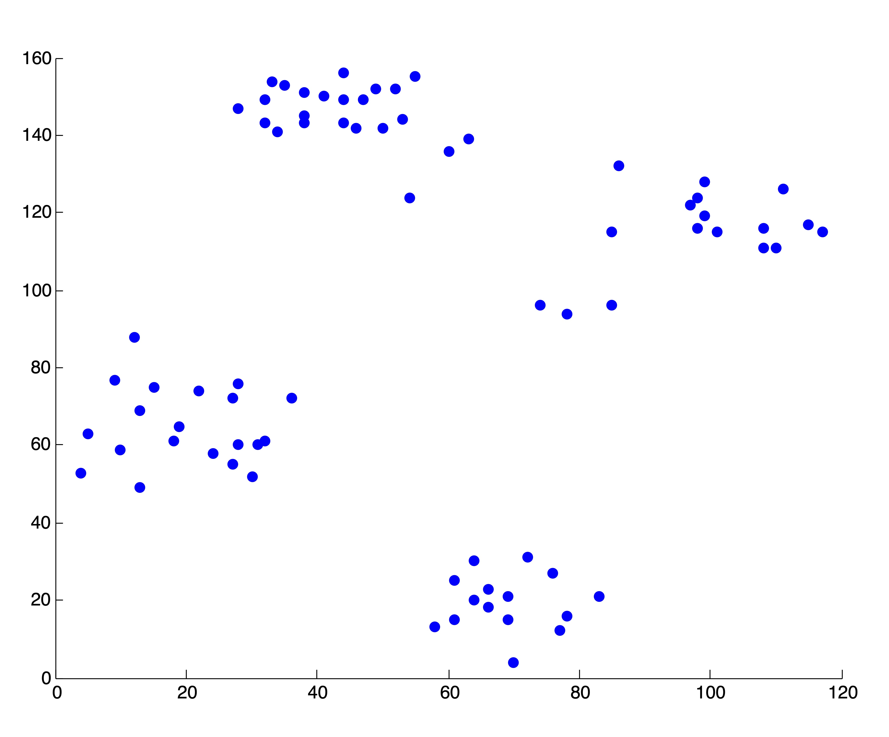
<p class="caption">(\#fig:ruspini)The Two-Dimensional Ruspini Dataset</p>
</div>


Figure \@ref(fig:ruspiniSSEplotgood) shows some examples of clusters found in the data using $k$-means and $k=2, 3, 4, 5, 6$ clusters. The initialization of seed points was done randomly in each case. Figure \@ref(fig:ruspiniSSEplotgood) shows the SSE (as described in Section \@ref(SSE) for the 6 different clusterings. We wish to point out that these 5 clusterings are "good" or reasonable clusterings upon visual inspection. Indeed, this first SSE plot properly depicts $k^*=4$ as the "elbow" of the curve, where the marginal decrease in SSE for adding additional clusters flattens out.\

(ref:rusSSEgoodcap) 5 "Good" $k$-means Clusterings of the Ruspini Dataset and the Corresponding SSE Plot

<div class="figure" style="text-align: center">
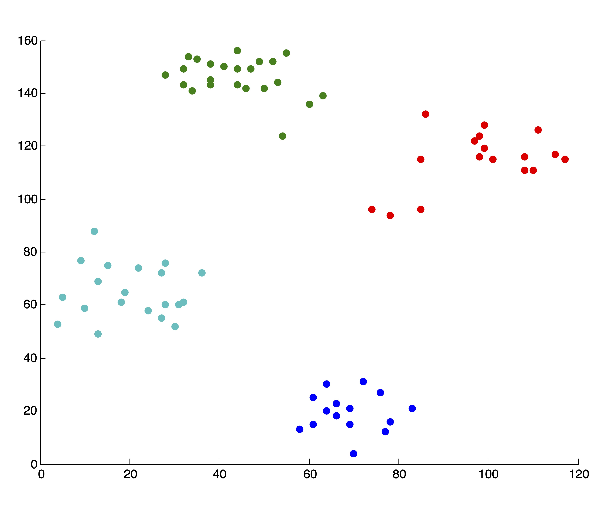
<p class="caption">(\#fig:ruspiniSSEplotgood)(ref:rusSSEgoodcap)</p>
</div>


__User Beware__ <br>

As always, with $k$-means, it is of the utmost importance that the user pay close attention to the output from the algorithm. In our creation of the SSE plot in Figure \@ref(fig:ruspiniSSEplotgood), we came by the two solutions, associated with $k=4$ and $k=5$ clusters respectively, that are shown in Figure \@ref(fig:rusSSEbad). Because we are able to visualize the data in 2 dimensions (which, practically speaking, means we could have identified $k^*=4$ by visualizing the original data anyhow), we were able to throw away these two solutions upon inspection. If we did not do this, the resulting SSE plot shown in Figure \@ref(fig:rusSSEbad) would have clearly misled us to choose $k^*=3$ clusters. Without being able to visually inspect the solutions, it is wise to run several iterations of the $k$-means algorithm for each $k$ and use some criteria (like lowest SSE, or most frequent SSE [@poweriteration]) to choose an appropriate clustering for inclusion in the SSE plot. While this is not guaranteed to circumvent problematic SSE plots like that shown in Figure \@ref(fig:rusSSEbad), it can help in many situations and certainly won't hurt in others.  This dependence on good clusterings is a glaring drawback of stopping rule methodology, because not all algorithms can produce multiple results for a single value of $k$ to choose from.

<div class="figure" style="text-align: center">
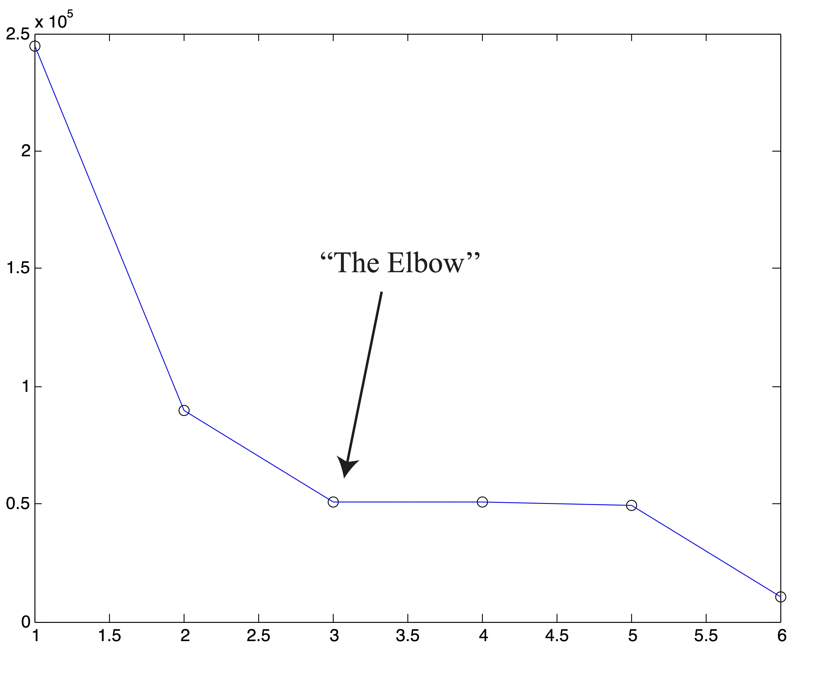
<p class="caption">(\#fig:rusSSEbad)Example of 'Poor' Clusterings and their Effect on SSE Plot</p>
</div>

### Cosine-Cohesion Plots for Text Data

Further complicating the method of cohesion plots is the curse of dimensionality discussed in Chapter \@ref(dimred).  For high dimensional data, it is unusual to witness such drastic "elbows" in these plots. To illustrate this effect, we consider a combination of 3 text datasets used frequently in the information retrieval literature: 'Medlars', 'Cranfield', 'CISI' [@surveytextmining,@kogan].  The Medlars-Cranfield-CISI (MCC) collection consists of nearly 4,000 scientific abstracts from 3 different disciplines. These 3 disciplines (Medlars = medicine, Cranfield = aerodynamics, CISI = information science) form 3 relatively distinct clusters in the data, which are not particularly difficult to uncover (For example, spherical $k$-means frequently achieves 98\% accuracy on the full-dimensional data). 

For this experiment, we ran 25 trials of the spherical $k$-means algorithm for each value of $k=2,3,\dots,20$ and from each set of trials chose the solution with the lowest objective value. The resulting SSE plot is shown in Figure \@ref(fig:MCCSSE). It is difficult to identify a distinct "elbow" in this curve.

(ref:MCCSSElab) Spherical $k$-means Objective Function Values for $2\leq k \leq 20$

<div class="figure" style="text-align: center">
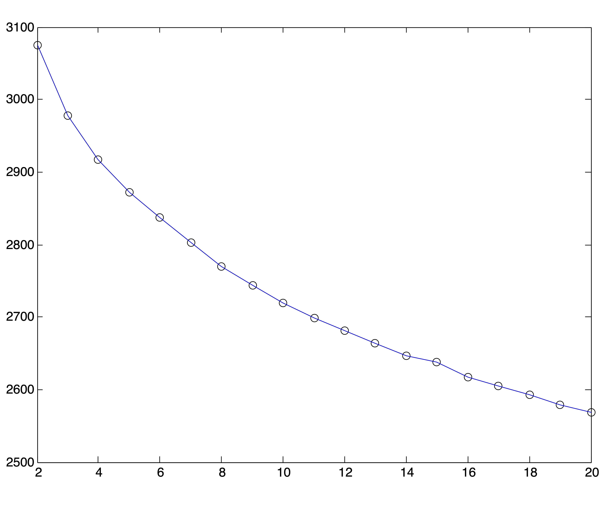
<p class="caption">(\#fig:MCCSSE)(ref:MCCSSElab)</p>
</div>


Because of the behavior of distance metrics in high dimensional space, it is often easier (and always faster) to find clusters after reducing the dimensions of a dataset by one of the methods discussed in Chapter \@ref(dimred). Because the singular value decomposition generally works well for text data, we conduct this same experiment on the Medlars-Cranfield-CISI dataset using projections onto the first $r=8,12, \mbox{ and } 20$ singular vectors. Using the correct number of clusters $k^*=3$, the $k$-means algorithm is able to achieve the same accuracy of 98\% on each of these dimension reductions, indicating that the clustering information is by no means lost in the lower dimensional representations.  However, the SSE plots for these lower dimensional representations, shown in Figure \@ref(fig:MCCsvdSSE), do no better at clearly indicating an appropriate number of clusters. In fact, these graphs seem to flatten out at $k=r$.  Again, 25 trials of the $k$-means algorithm were run for each value of $k$ and the solution with the lowest SSE was chosen to represent that value of $k$ in the plots. 

(ref:sseplotlab) SSE Plots for Medlars-Cranfield-CISI Clusterings using SVD Reduction to $r=\{8,12,20\}$ dimensions

<div class="figure" style="text-align: center">
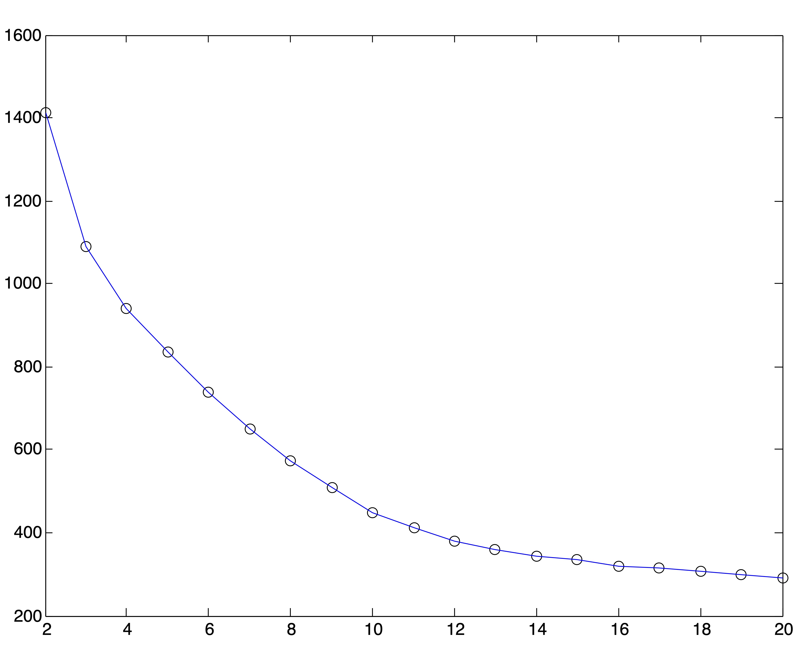
<p class="caption">(\#fig:MCCsvdSSE)(ref:sseplotlab)</p>
</div>

### Ray and Turi's Method

In [@rayturi], Ray and Turi suggested the use of their validity metric for determining the number of clusters. Unlike the SSE plots investigated previously, this method does not rely on the subjectivity of the user. Instead, the goal is simply to find the minimum value of their validity metric over the clusterings produced for various values of $k$. Recalling the definition from Chapter \@ref(validation) Section \@ref(rayturi), we have the validity of a clustering defined as
\begin{equation}
v=\frac{M_{intra}}{M_{inter}}
(\#rayturivalidity)
\end{equation}
where
\begin{eqnarray}
M_{intra} &=& \frac{1}{n} \sum_{i=1}^{k} \sum_{\x in C_i} \| \x - \mean_i\|_2^2 \\
M_{inter} &=&  \min_{1\leq i <j \leq k} \|\mean_i - \mean_j\|^2
\end{eqnarray}
and
$\mean_i$ is the centroid of cluster $i$. In their original work in [@rayturi], the authors' goal was to cluster images. They noticed for these datasets that the minimum value for the validity metric frequently occurred for small numbers of clusters in the range of 2, 3, or 4 because of the large inter-cluster distances occurring when the number of clusters is small. This was undesirable in their application to image processing because the number of clusters was not expected to be small. To account for this fact, they proposed the following procedural adjustment for determining the number of clusters: 

<ol>
<li> Specify the maximum number of clusters to be considered, $k_{max}$.
<li> For $k=2,\dots,k_{max}$ use $k$-means to cluster the data into $k$ clusters.
<li> For each clustering $C(k)$ compute the validity metric, $v(k)$ from Equation \@ref(eq:rayturivalidity).
<li> Locate the _first_ local maximum in the validity measure, $\tilde{k}$ such that
$$v(\tilde{k}-1) < v(\tilde{k}) > v(\tilde{k}+1)$$
<li> Choose the optimal number of clusters, $k^*$, to be the __modified minimum__ such that $\tilde{k} < k^* \leq k_{max}$ is the number which minimizes the validity measure _after_ the first local maximum.
</ol>

__Ray and Turi Plots for the Ruspini Data __ \

We applied the above method to the 2-dimensional Ruspini data which was depicted in Figure \@ref(fig:ruspini). To avoid the type of poor clusterings that were displayed in Figure \@ref(fig:ruspinibadclusters), for each value of $k$, the $k$-means algorithm was run 25 times and the best solution (that is, the solution with the lowest objective function) was chosen to represent that value of $k$. Figure \@ref(fig:ruspinirayturi) shows the plot of Ray and Turi's validity metric computed on each solution. If one were to pick the global minimum from this set of clusterings, the optimal number of clusters would be $k^*=2$. However, according to the modified minimum favored in the original paper [@rayturi], the optimal number of clusters for the Ruspini data is $k^*=5$.  Neither of these solutions impose quite as obvious a clustering as the true number, 4.

<div class="figure" style="text-align: center">

<p class="caption">(\#fig:ruspinirayturi)Ray and Turi Validity Plot for Ruspini Data</p>
</div>

__Ray and Turi Plots for Medlars-Cranfield-CISI__ \

We can generate similar plots using the same clusterings found by spherical $k$-means that were used to generate the SSE plots in Figures \@ref(fig:MCCSSE) and \@ref(fig:MCCsvdSSE). Obviously, the plots of Ray and Turi's validity metric are far more definitive in their determination of $k^*$, although it is left to the user to determine whether to pick the _global minimum_ or _modified minimum_ [@rayturi]. 

(ref:rayturicap) Ray \& Turi's Validity Plots for Medlars-Cranfield-CISI Clusterings on Raw Data and SVD Reductions to $r=\{8,12,20\}$ Dimensions Respectively.

<div class="figure" style="text-align: center">
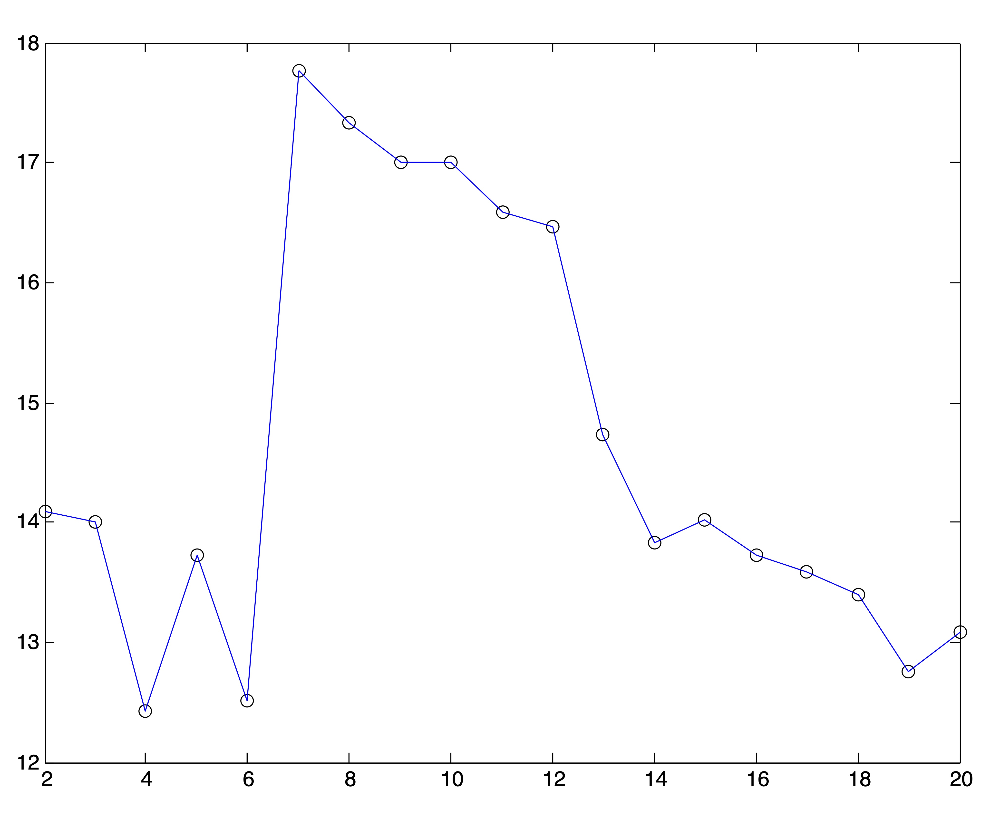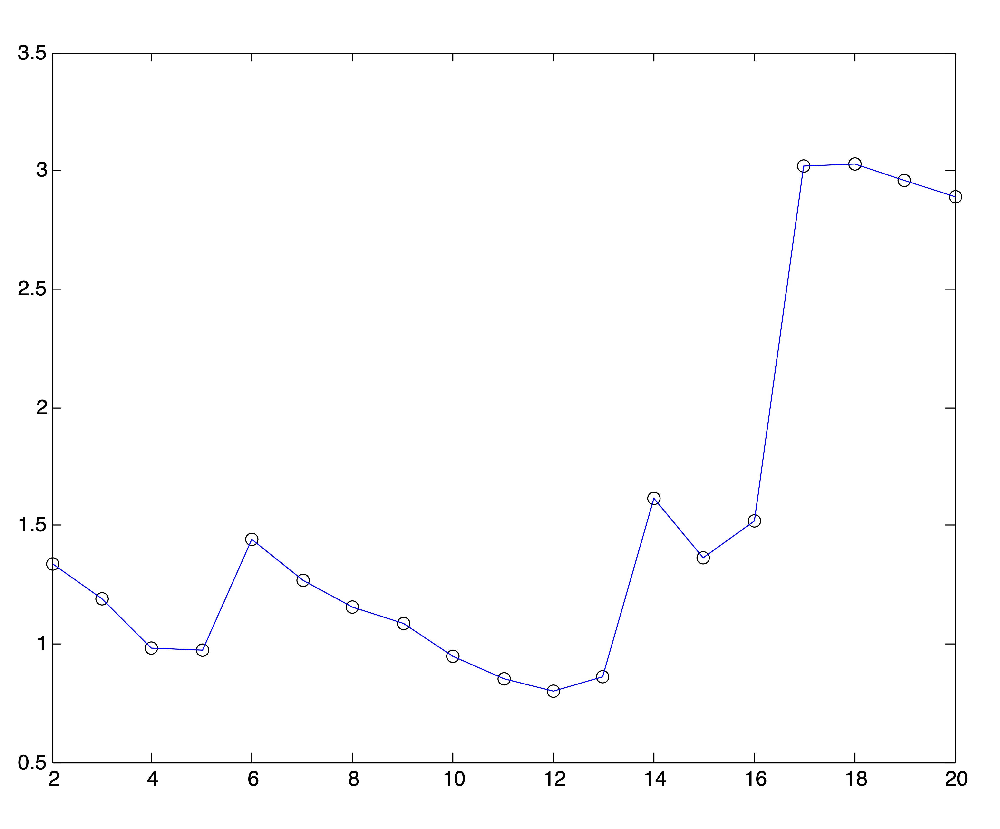
<p class="caption">(\#fig:MCCrayturi)(ref:rayturicap) </p>
</div>

The results from Figures \@ref(fig:ruspinirayturi) and \@ref(fig:MCCrayturi) are summarized in the following table, which shows the number of clusters that would be chosen if one were to pick the global minimum validity or the modified minimum validity along with the actual number of clusters.\

<table>
<tr>
<td> Data Input <td>  Global Min <td>  Modified Min.<td>  Actual $k$ 
<tr>
<td>Medlars-Cranfield-CISI <td>  4 <td>  6 <td>  3 or 5  
<tr>
<td>Ruspini <td>  2<td>  5 <td>  4 
</table>
 <caption>(\#tab:mccrayturitable) Approximated Number of Clusters via Ray and Turi's Method  </caption>

### The Gap Statistic

The _gap statistic_ is an index devised by Tibshirani, Walther, and Hastie in 2000 that has received massive amounts of attention in the literature. This method is quite similar to the stopping methods previously discussed, only now the objective is to compare the cluster cohesion values with what is expected under some null reference distribution [@gapstat]. Supposing the $n$ data points $\x_1,\dots,\x_n$ are clustered in to $k$ clusters, $C_1,C_2,\dots,C_k$ and $|C_j|=n_j$ some measure of cohesion is defined as
$$W_k = \sum_{j=1}^k \frac{1}{2n_j} \sum_{\x_p,\x_q \in \C_j} d(\x_p,\x_q)$$
where $d(x,y)$ is a distance function. The idea is then to compare the graph of $\log(W_k), \,\,k=1,\dots,K$ to its expectation under some null reference distribution and to choose the value of $k, 1\leq k \leq K$ for which $\log(W_k)$ falls the farthest below its expectation. This distance between $\log(W_k)$ and its expectation under the reference distribution, denoted by $E^*$, is called the _gap_:
$$\mbox{Gap}(k) = E^*(\log(W_k)) - \log(W_k).$$

This expectation is estimated by drawing a Monte Carlo sample, $\X^*_1,\X^*_2,\dots,\X^*_B$ from the reference distribution. Each dataset in the sample is clustered, and the values of $\log(W^*_k), \,\,k=1,\dots,K$ are averaged over the samples. The sampling distribution of the gap statistic is controlled using the standard deviation, $sd_k$, of the B Monte Carlo replicates of $\log(W^*_k)$. Accounting for the simulation error in $E^*(\log(W_k))$ yields the standard error
$$s_k = sd_k\sqrt{1+\frac{1}{B}} .$$

Using the common "one standard error" rule, the number of clusters $k^*$ is chosen to be the smallest $k$ such that $$Gap(k)\geq Gap(k+1)-s_{k+1}.$$

The authors in [@gapstat] suggest, both for simplicity and performance, using a uniform distribution as the null reference distribution. This process is summarized in Table \@ref(tab:gapstat).

<table><tr><td>
<ol>
<li> Cluster the observed data in $X$ (which contains $n$ objects and $m$ features), varying the total number of clusters from $k=1,2,\dots K$, recording within dispersion measures (SSE function values) $W_k, \,\,k=1,2,\dots,K$.
<li> Generate $B$ reference datasets, each with $n$ objects having $m$ reference features generated uniformly over the range of the observed values for the original features in $X$. Cluster each of the $B$ reference datasets, recording within dispersion measures (SSE function values) $W^*_{kb},\,\, b=1,2,\dots,B,\,\,k=1,2,\dots,K.$ Compute the estimated Gap statistic:
$$Gap(k)=(1/B)\sum_b \log(W^*_{kb})-\log(W_k)$$
<li> Let $\bar{\mathit{l}} = (1/B)\sum_b \log(W^*_{kb})$ and compute the standard deviation:
$$sd_k = [(1/B)\sum_b \left(\log(W^*_{kb})-\bar{\mathit{l}} \right)^2]^{1/2}.$$
Define $s_k = sd_k \sqrt{1+\frac{1}{B}}.$ Finally choose the number of clusters to be the smallest value of $k$ such that 
$$Gap(k) \geq Gap(k+1) - s_{k+1}$$.
</ol>
</table>
 <caption>(\#tab:gapstat) Computation of the Gap Statistic [@gapstat] </caption>

In Figure \@ref(fig:ruspinigapstat) we provide the results from the gap statistic procedure on the ruspini data. Our Monte Carlo simulation involved $B=10$ generated datasets. The gap statistic indicates the presence of $k^*=4$ clusters.

(ref:gapstatlab) Results for gap statistic procedure on Ruspini data. Observed vs. Expected values of $\log(W_k)$ (left) and Width of Gap (right).  The maximum gap occurs at $k^*=4$ clusters.

<div class="figure" style="text-align: center">

<p class="caption">(\#fig:ruspinigapstat)(ref:gapstatlab) </p>
</div>


## Graph Methods Based on Eigenvalues <br> (Perron Cluster Analysis) {#perroncluster}

Another commonly used methodology for determining the number of clusters relies upon the examination of eigenvalues of a graph Laplacian. Keeping with our focus in Chapter \@ref(spectral) we consider only undirected graphs. The methodology contained herein is motivated by the following observation: suppose we had an undirected graph consisting of $k$ connected components (i.e. $k$ distinct components, none of which are connected to any other). The adjacency matrix of such a graph would be block diagonal with $k$ diagonal blocks $\A_1, \dots, \A_k$, and each diagonal block would itself be an adjacency matrix for one connected component.

\begin{equation}
\A = 
\left[ 
\begin{array}{ccccc}
\A_1 & 0 & 0& \dots  & 0 \\
0   & \A_2 & 0 & \dots & 0 \\
0   & 0 & \A_3 & \ddots & 0 \\
0 & 0& 0 & \ddots & \vdots  \\
0 & 0 & 0 & \dots & \A_k 
\end{array}
\right] 
(\#eq:componentA)
\end{equation}

Thus, the Laplacian matrix $\mathbf{L}=\mathbf{D}-\A$ would also be block diagonal and each diagonal block would be the Laplacian matrix for one component of the graph.

\begin{equation}
\mathbf{L} = 
\left[ 
\begin{array}{ccccc}
\mathbf{L}_1 & 0 & 0& \dots  & 0 \\
0   & \mathbf{L}_2 & 0 & \dots & 0 \\
0   & 0 & \mathbf{L}_3 & \ddots & 0 \\
0 & 0& 0 & \ddots & \vdots  \\
0 & 0 & 0 & \dots & \mathbf{L}_k 
\end{array}
\right]
\hspace{.5cm}
\mbox{ with } \mathbf{L}_i \e = \mathbf{0} \mbox{ for } i=1,\dots, k
(\#eq:componentlaplacian)
\end{equation}

Thus, if each component is connected, the multiplicity of the smallest eigenvalue, $\lambda_1 = 0$, will count the number of diagonal blocks and thus the number of components. Of course the situation depicted in Equation \@ref(eq:componentlaplacian) is ideal and unlikely to be encountered in practice. However when the graph is _nearly_ decomposable into disconnected components, continuity of the eigenvalues suggests that one may be able to count the number of tightly connected components by counting the number of eigenvalues _near_ $\lambda_1 =0$. In order to be able to characterize eigenvalues as being _near_ $\lambda_1 =0$, it is necessary to transform (normalize) the Laplacian matrix so that its spectrum is contained in the interval $[0,1]$. This type of analysis is usually done using one of the two _normalized Laplacian matrices_ discussed in Chapter \@ref(spectral) and defined again here.
<ol>
<li> __The random-walk Laplacian__ $$\mathbf{L}_{rw} = \mathbf{D}^{-1}\mathbf{L} = \mathbf{I}-\mathbf{D}^{-1}\mathbf{A} = \mathbf{I}-\mathbf{P}$$
<li> __The symmetric Laplacian__ $$\mathbf{L}_{sym} = \mathbf{D}^{-1/2}\mathbf{L}\mathbf{D}^{-1/2}=\mathbf{I}-\mathbf{D}^{-1/2}\mathbf{A}\mathbf{D}^{-1/2}.$$
</ol>

The normalized Laplacians, like the Laplacian matrix itself, are both positive definite. Furthermore, $\mathbf{L}_{rw}$ and $\mathbf{L}_{sym}$ have the same spectrum.   The following well-known and easily verified fact characterizes the relationship between the eigenvalues and eigenvectors of these two matrices [@chung].

(ref:thmcap1) Eigenvalues of $\mathbf{L}_{sym}$ and $\mathbf{L}_{rw}$

:::{.theorem name='(ref:thmcap1)'}
$\lambda$ is an eigenvalue of $\mathbf{L}_{rw}$ with eigenvector $\mathbf{v}$ if and only if $\lambda$ is an eigenvalue of $\mathbf{L}_{sym}$ with eigenvector $\mathbf{w}=\mathbf{D}^{1/2}\mathbf{v}$.
:::

In light of this fact, we will limit our discussion to the properties of the transition probability matrix of a random walk on the graph associated with the adjacency matrix $\A$, denoted
 $$\mathbf{P}=\mathbf{D}^{-1} \A = \mathbf{I}-\mathbf{L}_{rw},$$  
 since $$\lambda \in \sigma(\mathbf{P}) \quad \Rightarrow \quad (1-\lambda) \in \sigma(\mathbf{L}_{rw}).$$
 Random walks on undirected graphs are _reversible Markov chains_, which satisfy the so-called _detailed balance equations_  [@kemenysnell;@stewart]:
$$\mathbf{Q}\mathbf{P}=\mathbf{P}^T \mathbf{Q} \hspace{.2cm} \mbox{ where  } \mathbf{Q}=diag(\mathbf{\pi}).$$
The stationary distribution for $\mathbf{P}$ given by  $\mathbf{\pi}^T= \frac{\e^T\mathbf{D}}{\e^T\mathbf{D}\e}$.

We assume the underlying graph (which we aim to partition) is connected so that the matrix $\mathbf{P}$ is irreducible. If the graph is composed of connected components, like the one associated with Equation \@ref(eq:componentA), the resulting random walk is equivalently referred to as _completely reducible, uncoupled, or completely decomposable_ and there simple efficient algorithms available to identify the connected components [@concomp]. 

 In our connected graph, we assume that there exists some cluster or community structure, i.e. that there are $k$ groups of vertices, $C_1,C_2, \dots, C_k$ with $|C_k|=n_k$, for which edges exist more frequently and with higher weight within each group than between each group. With this assumption, we can reorder the rows and columns of the transition probability matrix $\mathbf{P}$ according to group membership so that the result is _block-diagonally dominant_. By this we essentially mean that $\mathbf{P}$ is a perturbation of a block-diagonal matrix $\mathbf{B}$, such that

\begin{equation}
\mathbf{P}=\mathbf{B}+\mathbf{E} = \left[ 
\begin{array}{ccccc}
\mathbf{B}_{11} & \mathbf{E}_{12} & \mathbf{E}_{13}& \dots  & \mathbf{E}_{1k} \\
\mathbf{E}_{21}   & \mathbf{B}_{22} & \mathbf{E}_{23} & \dots & \mathbf{E}_{2k} \\
\mathbf{E}_{31}   & \mathbf{E}_{32} & \mathbf{B}_{33} & \ddots & \mathbf{E}_{3k} \\
\vdots& \vdots& \vdots & \ddots & \vdots  \\
\mathbf{E}_{k1} & \mathbf{E}_{k2}& \mathbf{E}_{k3} & \dots & \mathbf{B}_{kk}
\end{array}
\right]
 (\#eq:bdd)
 \end{equation}
 where the off-diagonal blocks, $\mathbf{E}_{ij}$, are much smaller in magnitude than the the diagonal blocks. In fact, the entries in the off-diagonal blocks are small enough that the diagonal blocks are _nearly stochastic_, i.e. $\mathbf{B}_{ii} \e \approx 1$ for $i=1,2,\dots,k$.  A transition probability matrix taking this form describes a __nearly uncoupled__ or __nearly completely reducible__ Markov Chain.
 
The degree to which a matrix is considered nearly uncoupled is dependent on one's criteria for measuring the level of _coupling_ (interconnection) between the _aggregates_ (clusters of states) of the Markov chain [@fischer;@meyernumc;@chuckthesis]. In [@meyernumc], the _deviation from complete reducibility_ is defined as follows:
<!-- %  -->
<!-- % \begin{definition}[Uncoupling Measure] -->
<!-- % Let $n_1$ and $n_2$ be fixed positive integers such that $n_1+n_2=n$, and let $\mathbf{P}$ be an $n\times n$ irreducible stochastic matrix, whose respective rows and columns have been rearranged to the form -->
<!-- % $$\mathbf{P}=\left[ \begin{array}{cc} -->
<!-- % \mathbf{P}_{11} & \mathbf{P}_{12} \\ -->
<!-- % \mathbf{P}{21} & \mathbf{P}_{22} \end{array} \right]$$ -->
<!-- % where $\mathbf{P}_{11}$ is $n_1 \times n_1$ and $\mathbf{P}_{22}$ is $n_2 \times n_2$ so that the ratio -->
<!-- % $$\sigma(\mathbf{P},n_1) = \frac{ \e^T \mathbf{P}_{12} \e + \e^T \mathbf{P}_{21} \e}{\e^T\mathbf{P}\e}$$ is minimized over all symmetric permutations of $\mathbf{P}$. The quantity $\sigma(\mathbf{P},n_1)$ is called the \textbf{uncoupling measure} of $\mathbf{P}$ with respect to the parameter $n_1$, defined as the ratio of the sum of the entries in the off-diagonal blocks to the sum  of all the entries in the matrix. -->
<!-- % \end{definition} -->
 
:::{.definition name='Deviation from Complete Reducibility'}
For an $m\times n$ irreducible stochastic matrix with a $k$-level partition
 $$\mathbf{P} = \left[ 
\begin{array}{ccccc}
\mathbf{P}_{11} & \mathbf{P}_{12} & \mathbf{P}_{13}& \dots  & \mathbf{P}_{1k} \\
\mathbf{P}_{21}   & \mathbf{P}_{22} & \mathbf{P}_{23} & \dots & \mathbf{P}_{2k} \\
\mathbf{P}_{31}   & \mathbf{P}_{32} & \mathbf{P}_{33} & \ddots & \mathbf{P}_{3k} \\
\vdots& \vdots& \vdots & \ddots & \vdots  \\
\mathbf{P}_{k1} & \mathbf{P}_{k2}& \mathbf{P}_{k3} & \dots & \mathbf{P}_{kk}
\end{array}
\right]$$
 the number $$\delta=2\max_{i} \|\mathbf{P}_{i*}\|_{\infty}$$ is called the __deviation from complete reducibility.__ 

:::
  
It is important to point out that the parameter $\delta$, or any other parameter that measures the level of coupling between clusters in a graph (like those suggested in [@fischer;@chuckthesis;@meyerharfield]) cannot be computed without knowing a priori the clusters in the graph. Such parameters are merely tools for the perturbation analysis, used to prove the next theorem regarding the spectrum of block-diagonally dominant stochastic matrices [@fischer; @kato; @chuck; @meyernumc; @meyerharfield; @perroncluster; @stewartnumc].

(ref:bddsm) The Spectrum of a Block-Diagonally Dominant Stochastic Matrix

:::{.theorem name='(ref:bddsm)' #bddsm} 
For sufficiently small $\delta \neq 0$, the eigenvalues of $\mathbf{P}(\delta)$ are continuous in $\delta$, and can be divided into 3 parts [@fischer; @meyernumc; @perroncluster; @chuck]:

1. The Perron root, $\lambda_1(\delta)=1$,
2. a cluster of $k-1$ eigenvalues $\lambda_2(\delta),\lambda_3(\delta),\dots,\lambda_k(\delta)$ that approach 1 as $\delta \to 0$, and
3. the remaining eigenvalues, which are bounded away from 1 as $\delta \to 0$.
:::


<!-- %Before we discuss the notion of coupling and the parameter $\epsilon$,  -->
<!-- %  -->
<!-- % Let $\mathbf{P}(\epsilon)$ be a family of matrices having the form in Equation \@ref(eq:bdd} and define $\epsilon^*$ such that $\mathbf{P}(\epsilon^*)=\mathbf{P}$. In order to continue such perturbation analysis, the following assumptions are adopted from [@fischer} as needed to implement Theorem 6.1 from [@kato}.  -->
<!-- %  -->
<!-- % \begin{itemize} -->
<!-- % \item[] \textbf{Assumptions} -->
<!-- % \item[1.] Let $\mathbf{P}(\epsilon) = \mathbf{P}(0) + \epsilon \mathbf{P}^{(1)} + \epsilon^2\mathbf{P}^{(2)} + \dots$ be a family of matrices that are analytic in a domain containing the origin. -->
<!-- % \item[2.] Let $\mathbf{P}(\epsilon)$ be stochastic and reversible for all $\epsilon$, and primitive for all $\epsilon \neq 0$. -->
<!-- % \item[3.] For $\epsilon = 0$, let $\mathbf{P}(0)$ be block-diagonal with primitive diagonal blocks. -->
<!-- % \end{itemize}  -->
<!-- %  -->

 
The cluster of $k$ eigenvalues surrounding and including the Perron root $\lambda_1=1$ is known as the __Perron cluster__ [@chuck,@fischer,@perroncluster]. The analysis in [@chuck] explains that if there is no further decomposition (or meaningful sub-clustering) of the diagonal blocks, a relatively large gap between the eigenvalues $\lambda_k$ and $\lambda_{k+1}$ is expected. Thus, we can determine the number of clusters in the state space of a nearly uncoupled Markov chain (i.e. the number of clusters in a graph) by counting the number of eigenvalues in this Perron Cluster. 

This method is extremely effective when the graph to be partitioned is sufficiently close to being uncoupled. Problems arise when either high levels of coupling (intercluster linkage) are in play or when some vertices within a cluster are weakly connected to that cluster (for example, _dangling nodes_ - vertices with degree 1).

The examples in Figure \@ref(fig:perronex) illustrate this point. Firts we show a synthetic example of a graph exhibiting cluster structure and the eigenvalues of the associated transition probability matrix respectively.  The thickness of the edges in the graph correspond to their respective weights. Because there is a limited amount of coupling (intercluster connection) in this first example, the Perron cluster of eigenvalues is easy to identify. Because there are 3 eigenvalues near 1, the user would conclude that the graph has 3 clusters. 

 Occasionally a user can get a sense of the cluster structure in a graph with an appropriate layout of the nodes and edges. Force-directed graph drawing algorithms are common in this practice. The basic idea behind these algorithms is to model the edges as springs connecting the nodes and then to somehow minimize the total amount of tension in the system. Thus, densely connected groups of nodes are placed proximal to each other and the edges which loosely connect these groups are stretched. The graph drawings in Figure \@ref(fig:perronex) are all examples of force-directed layouts. Graph drawing algorithms are beyond the scope of this paper, but for information the interested reader should see, for example, [@graphdrawing1,@graphdrawing2]. 

The second two rows of Figure \@ref(fig:perronex) display a real-world example using the hyperlink graph between a sample of 1222 American political blogs. Based upon the force-directed drawing of the graph, it is clear that there are 2 large communities or clusters in this graph. These clusters correspond to the liberal and conservative division of American politics. The Perron cluster is not easily identified on the eigenvalue plot in Figure \@ref(fig:perronex), and thus no conclusion should be drawn regarding the number of clusters in this data. However, after removing a large number of dangling nodes from the graph, or blogs which link only to a single neighboring page in the sampled population, a different picture comes to light. In the final row of Figure \@ref(fig:perronex) we illustrate the effect of removing these dangling nodes (about 200 in total) on the eigenvalues of the transition probability matrix. Luckily, for this particular graph, removing the dangling nodes did not create more, a situation that is not guaranteed in general. The third eigenvalue in the Perron cluster likely identifies the small group of 3 blogs that is now visible in the force directed drawing of the graph. Such small clusters are generally undesirable in graph partitioning, and since the eigenvalues tell the user nothing about the size or composition of the graph communities counted by the eigenvalues in the Perron cluster, this method must be used with caution! 

<div class="figure" style="text-align: center">
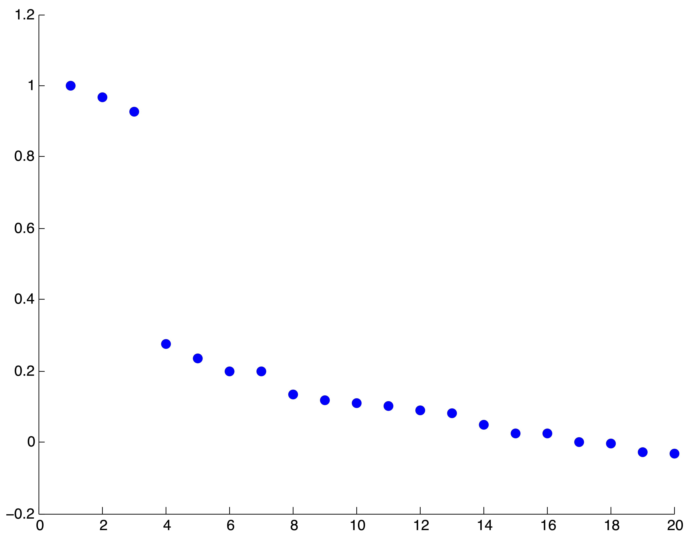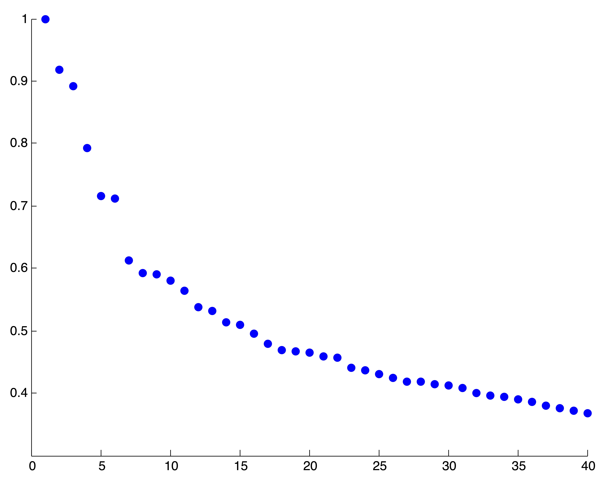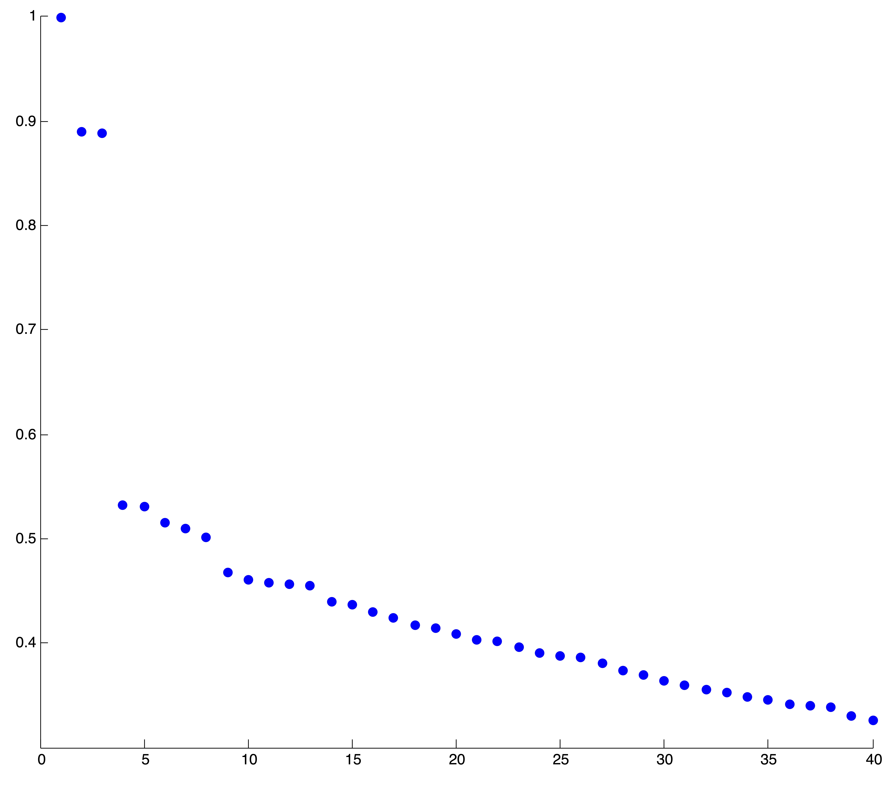
<p class="caption">(\#fig:perronex)Some Examples of Perron Cluster Identification on various Network Datasets</p>
</div>

 In the next Chapter, we will introduce a similarity matrix that is well suited for this Perron-cluster analysis. Our method has the ability of estimating the number of clusters in very noisy and high-dimensional data when other methods fail.

<!--chapter:end:114-findk.Rmd-->

# References

<div id="refs"></div>

<!--chapter:end:99-References.Rmd-->

